# 🏁 Edye-Documentación

**Version:** 1.0  
**Date:** 12/01/2025  

---

# Edye Documentation

The technical documentation for **Edye** consolidates all the information needed to understand, develop, maintain, and operate the technological ecosystem that supports the platform. Its goal is to provide a centralized, up-to-date, and structured reference that facilitates the work of the **development, DevOps, operations, QA, product, and integration** teams.

Edye is a system composed of multiple services, applications, APIs, and tools that interact to deliver a stable, secure, and scalable digital experience. Due to the distributed nature of the ecosystem and the continuous evolution of its components, this documentation serves as the single source of truth to:

- Understand the overall architecture and its main flows.  
- Learn the DevOps processes and standards applied in the organization.  
- Access usage, deployment, and operation manuals for each service.  
- Review how APIs, integrations, and pipelines work.  
- Ensure traceability and consistency across areas and regions.  

The information presented here follows a modular and practical structure, allowing navigation through specific sections based on the user’s role and needs. Each document is part of a unified technical framework that aims to improve collaboration among teams, accelerate delivery cycles, and ensure software quality at every stage.

This documentation is a living resource: it evolves alongside Edye’s platform, processes, and technologies. Therefore, any significant change in code, infrastructure, or operating models must be reflected here to maintain an accurate and up-to-date view of the entire ecosystem.

***

\newpage

# 🏢 EDYE Infrastructure

**Version:** 1.0  
**Date:** 12/01/2025  

---

## 1. Introduction and Purpose

This document describes, in a structured and auditable manner, the technological infrastructure that supports the **EDYE** platform of **HITN Digital**. Its purpose is to provide the **DevOps**, **Operations**, **SRE** (Site Reliability Engineering), and **Security** teams with a unified corporate reference on environment architecture, infrastructure components, deployment models, monitoring and observability mechanisms, as well as security and operational continuity practices.


## 2. Infrastructure Scope


The documentation covers the EDYE ecosystem as a whole and therefore includes the following main elements:

- **Hosting and network infrastructure:** cloud providers, regions, and primary and secondary data centers.
- **Segregated environments:** local, staging, and production environments with their respective components and deployment flows.
- **Core services:** application modules (Admin, API, Billing, Play, Cloud, Connect/Conecta, Satellite) and supporting elements (cache, databases, web servers).
- **Base technologies:** frameworks and languages used (Node.js and its processes managed by a V8 engine, Laravel framework based on the MVC pattern, MySQL and MongoDB database engines, Nginx web servers for load balancing and caching, and process managers such as PM2). Only components that are part of the actual EDYE ecosystem are included.
- **CI/CD and automated deployments:** continuous integration and deployment tools and processes that enable agile, controlled delivery.
- **Monitoring and observability:** metrics, logs, and traces that allow evaluating system health, alerts, and visualization dashboards.
- **Security and access:** access control, credential management, and adherence to best practices.
- **Operational continuity and backups:** backup strategies, high availability, and recovery procedures.


## 3. General Architecture of the Ecosystem


The EDYE ecosystem is organized in a modular architecture composed of back-end and front-end services that communicate via APIs and message queues. Services are deployed on virtual instances or containers within data centers in the United States (primary) and a secondary site for contingencies. The content delivery layer relies on a global CDN provider to optimize distribution to end users.


> **Figure 1.** General ecosystem architecture - Production


> **Figure 2.** General ecosystem architecture - Staging


### 3.1. Architecture Description


- **Delivery layer:** a global CDN handles distribution of video and static content, minimizing latency to users. The cache layer (based on in-memory storage services) stores frequent responses to reduce load on backend services.


- **Business services:** the **API**, **Admin**, **Billing**, **Play**, **Cloud**, and **Conecta** modules represent independent services encapsulating specific functionality. Services written in **Node.js** use the **V8** engine to run server-side JavaScript and employ **PM2** as a process manager to ensure continuous availability. The **Admin** service is implemented with **Laravel**, a **PHP** framework that follows the model–view–controller pattern.


- **Data layers:** relational **MySQL** databases, a common component of the **LAMP** stack, store transactions and structured data. **MongoDB** is used for unstructured or semi-structured information; it is a document-oriented **NoSQL** database that uses JSON-like documents with optional schemas.


- **Replicated environments:** core services are replicated in separate environments (Staging and Local) for testing and validation before promoting changes to production. These environments are isolated and do not share sensitive data with production.


## 4. Environments and Segregation (Local / Staging / Production)

The EDYE platform operates under an environment segregation model to ensure the software lifecycle proceeds in a controlled manner and changes are properly tested before impacting end users.


### 4.3. Local Environment

The local environment corresponds to developer workstations. Each developer has a lightweight replica of the services needed to code and validate changes. Containers or virtual machines are used to simulate the database, cache, and internal services. Source code is managed through a version control system (e.g., Git) and integrated with the CI platform for automated test execution.


### 4.4. Staging Environment

The staging environment mirrors production architecture at smaller scale. All release branches that pass continuous integration validation are deployed here. Databases are initialized with anonymized or synthetic data to allow functional and performance testing without compromising user information. This environment is used for acceptance tests and to validate integrations with external services before promotion.


### 4.5. Production Environment

The production environment hosts the active EDYE instance accessible to users. It is distributed across at least two geographically separated data centers to provide high availability and fault tolerance. User traffic is distributed through load balancers and the CDN layer, which route requests to the nearest active site. Databases and critical services implement synchronous or asynchronous replicas between regions so that a data center failure can be resolved with controlled failover. Configuration and deployment policies are enforced strictly to ensure stability.


## 5. Server and Hosting Infrastructure

EDYE runs on a cloud computing platform with US data centers acting as primary and secondary. Each data center hosts groups of instances running the services described above. The infrastructure relies on containerization technologies or virtual machines that enable horizontal scalability.

Data centers: at least two geographic locations are used—a primary center (for example, in the central US region) and a secondary center (on the east coast or another region). This allows load balancing and ensures operational continuity in case of disaster.

Application servers: Node.js and Laravel instances are deployed in server groups managed by HTTP load balancers (Nginx) that distribute requests and apply cache policies. Nginx also acts as a reverse proxy and high-performance content server
nginx.org
.

Cache layer: in-memory solutions (Redis or Memcached) store temporary data and improve service response times. The cache layer is replicated to avoid single points of failure and its memory usage is monitored.

Object storage: the Cloud service integrates object storage (S3-compatible) to host media files, images, and documents. This storage is replicated across multiple regions and integrated with the CDN for distribution.

Databases: MySQL databases are deployed in master–replica clusters with synchronous replication to guarantee consistency. MongoDB is configured in replica sets to provide high availability and supports sharding when horizontal scales are required
en.wikipedia.org
.


## 6. Deployment Architecture (CI/CD)

The platform uses a continuous integration and continuous deployment (CI/CD) flow that automates software build, testing, and release. The general flow is as follows:


Commit and version control: Developers update code in the repository. Feature branches and merge requests are used for peer review.

CI pipeline: A CI server runs automated tests (unit, integration, and static) on each commit. If tests fail, the pipeline is marked as failed.

Build and versioning: After tests pass, the pipeline packages artifacts (for example, containers) and publishes them to a private registry with semantic tagging.

Staging deployment: Artifacts are automatically deployed to the staging environment for functional and performance validation. Database migrations are automated and service health is monitored.

Production approval and deployment: A manual (gated) step lets an operations owner approve deployment to production. Deployment is performed gradually using strategies such as blue/green or canary to minimize risk.

Post-deployment observability: After deployment, key metrics are monitored and alerts enabled to detect regressions.


## 7. Process and Service Management

The EDYE platform is composed of services running as independent processes, orchestrated and monitored to ensure availability and performance.

Process management for Node.js: PM2 is used, a production process manager that keeps Node.js applications online 24/7
pm2.keymetrics.io
. PM2 offers clustering, zero-downtime reloads, and built-in monitoring.

PHP/Laravel service management: Laravel-based services are deployed via PHP-FPM behind Nginx or Apache. Process pools are configured and performance and security parameters are tuned.

Load balancing and reverse proxy: Nginx acts as a reverse proxy, load balancer, and content server, recognized for high performance and low resource usage
nginx.org
. Upstream groups with health checks are configured and cache rules are implemented at the proxy layer.

Auxiliary services: The infrastructure includes additional services such as message queues (for example, RabbitMQ or SQS) to decouple processes, and an email delivery system for notifications. Exact details match the current implementation.


## 8. Monitoring and Observability

Observability is key to ensuring reliability of the EDYE ecosystem. The platform implements tools and practices to collect metrics, logs, and distributed traces.

Infrastructure metrics: CPU, memory, disk, and network utilization metrics are collected for each instance. Agents export these metrics to a centralized system for dashboard visualization and alerting.

Service monitoring: Services expose health and metrics endpoints (for example, Prometheus metrics or equivalents). Latency, throughput, and error percentage are monitored.

Centralized logs: All services send logs to a centralized logging system (ELK/Graylog or another solution) where they are indexed and can be queried. A common log format is defined to ease analysis.

Alerts and notifications: Alerts are configured based on thresholds and anomalies; notifications are sent to corporate messaging channels or ticketing systems.

Distributed traces: Microservice-based services adopt tracing solutions (for example, OpenTelemetry) to correlate requests across services and detect bottlenecks.


## 9. Security and Access Control

Security is addressed cross-cutting across the architecture. Key measures implemented include:

Environment segregation: Development, staging, and production environments are kept fully isolated, preventing direct access between them. Staging databases contain anonymized data.

Identity and access management (IAM): The principle of least privilege is applied. User and service accounts are managed with a central directory and multifactor authentication. Access policies are reviewed periodically.

Encryption: Communication channels use TLS/HTTPS. Databases encrypt sensitive data at rest, and secret managers store credentials and keys.

Server hardening: Hardening practices are followed (port limitation, package updates, disabling unnecessary services). Nginx/Apache are configured with security headers and IP access control lists are implemented.

Audit and compliance: Audit logs are enabled for administrative access and configuration changes. Penetration tests and vulnerability scans are performed periodically. The infrastructure complies with applicable data protection regulations.


## 10. Operational Continuity and Backups

Business continuity is ensured through high-availability designs and consistent backup policies.

High availability and replication: Critical services are deployed in redundant clusters distributed across data centers. MySQL databases use master–slave or multi-master replication; MongoDB employs replica sets for fault tolerance
en.wikipedia.org
.

Backups: Regular backups of databases and stored objects are performed. Backups are encrypted and stored in separate locations. Retention policies allow point-in-time restores (PITR) and are regularly tested via restoration drills.

Contingency plan: Runbooks exist for manual or automatic failover to a secondary site in case of disaster. Acceptable recovery time objective (RTO) and recovery point objective (RPO) targets are defined.

Recovery tests: Failover exercises are executed periodically to validate procedures and ensure staff readiness for real incidents.


## 11. Incident Management and Support

The organization has a formal incident management process covering detection, classification, response, communication, and closure with learnings. The general flow is as follows:


**Detection**: Monitoring alerts or user reports initiate the incident process.

**Classification**: Severity level is determined and appropriate resources are assigned. Critical incidents activate a specialized response team.

**Mitigation and diagnosis**: Work focuses on restoring service as quickly as possible, analyzing root causes, and applying temporary fixes when needed.

**Resolution**: Permanent fixes are implemented and system stability is validated.

**Post-mortem**: A detailed analysis is conducted documenting root cause, time to resolution, and preventive actions. Runbooks are updated and lessons learned are communicated to teams.

**Ticket management**: All steps are recorded in the corporate incident tracking tool (for example, Jira), enabling audit and traceability.


## 12. Operational Best Practices

To ensure quality and stability of EDYE infrastructure, the following best practices are adopted:

**Version control and code review**: All code undergoes peer review and automated pipelines before being integrated into main branches.

**Automation**: Repetitive processes are automated through scripts and orchestration tools, reducing manual errors.

**Configuration management**: Infrastructure as code (IaC) is used to define environments declaratively. This facilitates replication and reduces configuration drift.

**Updates and patches**: Maintenance windows are established to apply security patches and software updates. They are tested in staging before applying to production.

**Proactive observability**: Metric trends are analyzed to anticipate capacity issues. SLO/SLI are defined and reviewed periodically.

**Security by design**: Security is considered from the design phase, implementing appropriate access controls, encryption, and secure development practices.


## 13. Final Considerations

This document summarizes EDYE's current infrastructure and serves as a starting point for future audits and improvements. As technology and business needs evolve, the documentation should be reviewed and updated periodically to remain aligned with operational reality. Any substantial change in architecture, tools, or processes should be reflected in the documentation and communicated to all impacted teams.

***

\newpage

# 🈸 Admin Service


**Version:** 1.0  
**Date:** 12/01/2025

---

## 1. Introduction and Purpose

The **Admin Service** is the internal administrative portal for the EDYE/HITN Digital ecosystem. Per the user manual, the portal focuses on **product management**, enabling operations and processes that ultimately support content delivery to **partners and end users**. Tasks in this service include **user and role management**, querying and recording information, viewing usage metrics, and configuring and sending playlists, images, and metadata. This documentation targets **DevOps**, **Operations**, **SRE**, and **Security** teams and provides a technical and operational description of the service infrastructure and flows.

## 2. Functional Description

The Admin Service acts as an administrative interface for internal teams and partners. The main features, derived from the portal menu, are summarized below:

### 2.1. Dashboard

**Technical Info:** shows traffic charts by endpoint, usage by endpoint, and error metrics. A line chart displays total hits, successful hits, and errors, while donut charts show API usage by endpoint and by partner. A table named Latest Errors lists recent errors with ID, date, level, and user, with an option to view details.

**Commercial Info:** displays commercial information related to **InPlayer** (subscriptions, payments, and active/expired accounts) via line and bar charts, plus account status tables. It also shows the percentage of API usage per partner.

### 2.2. Metadata Management

**Download Metadata:** lets you download metadata for shows, seasons, and episodes in the format required by each partner.

**Edit Metadata:** enables creating and editing objects (shows, episodes, or movies). To register an asset, it must already exist in the **JW Player** library. The edit form includes fields such as Media Type, JWP Code (media or thumbnail code depending on asset type), Edye Asset #, premiere and end dates, languages, studios, and other metadata details. It also supports recording titles, descriptions, ratings, cast, production crew, country release dates, and awards; these fields are handled through structured forms for each asset section.

### 2.3. Image and Delivery Management

**Upload Files:** allows uploading, editing, and deleting images by show, season, or episode. The user selects the season, the format (e.g., 16:9), and the file to upload; upon submission, a list of images linked to the asset is generated.

**Delivery View:** shows image deliveries by partner. For each delivery it displays the partner name, delivery method, whether delivery is enabled, whether watermarking is used, image formats, and a list of episodes with image counts and download options.

**Watermark:** manages watermark collections. You can create collections, upload watermark images, set a default collection, and delete specific watermarks.

**Delivery:** enables creation of new delivery packages for a partner and monitoring of existing deliveries.

### 2.4. Logging and Auditing

**API Log:** provides a chronological record of API requests. It allows filtering by dates, user, or endpoint and downloading data as CSV. The table shows fields such as ID, date, level (informational or error), user, message, geolocation, and response code.

**Notification Log:** lists notifications sent to partners that require confirmations; it includes ID, date, partner, method, URL, and access to transaction details.

**Terra Log:** records events related to the Terra integration, allowing filtering by date, operation, and event type. It displays fields such as ID, date, MSISDN, operation, level, and response.

**Bango Log:** shows events related to the Bango integration; it includes ID, date, level, user, message, geolocation, and response.

**Marketing API Log:** lists interactions with the email marketing system (Mailchimp), with filters by date, operation type (contact or order), and event type.

**SSO API Log:** records SSO login events; it allows filtering by origin and shows fields like ID, date, origin, SSO partner, SSO client, method and endpoint, response, and download option.

### 2.5. JW Player Integration

The Admin Service integrates with the JW Player platform to manage shows, episodes, and tags. The main actions are:

**Shows:** lists shows published in JW Player and allows filtering by library (for example, 16:9 ES, carousel, or 16:9 PT). You can search for a show, download the filtered list, and, by selecting the checkbox, redirect to JW Player to edit the show tags.

**Episodes:** lets you edit metadata for specific episodes via JW Player interfaces. You can filter by library, show, or episode name and access the JW Player editor for each episode.

**Tags vs Shows / Tags vs Episodes:** groups shows or episodes by tag for a unified view and allows editing the corresponding tags in JW Player.

**Sync Shows Info:** syncs JW Player library information with the API database. This process runs automatically each night, though it can be executed manually when immediate changes are needed.

**Edit JW Player:** facilitates bulk editing of a show's metadata and its episodes, as well as syncing data and images for that show only.

### 2.6. Configuration

**Partners:** lets you create, edit, or delete partners. When creating a partner, you define main information (name), watermark settings, thumbnail formats, and delivery methods. It also manages credentials (S3, SFTP, etc.), billing settings (such as subscription URL and payment gateway), and naming formats for video, image, and metadata. The panel allows enabling or disabling delivery via API and configuring Aspera folders for file distribution.

**Users:** creates, edits, and assigns permissions to administrative users.

**Playlist:** assigns master playlists by language.

**System Config:** manages environment variables required for the application to run.

**Cron Process:** displays a list of automated processes with information about the last execution and a log history.

### 2.7. Tools

**Cache:** option to clear cache servers.

**Coactive:** dashboard with synchronization information between the managed library and Coactive's AI database, showing the sync status.

**Logout:** portal sign out.

## 3. Architecture and Components

According to internal documentation, the Admin Service is implemented as a client-server web application. Its architecture consists of:

| Component              | Description                                                                                                                                                                                                                                                                                                                        |
| ---------------------- | ---------------------------------------------------------------------------------------------------------------------------------------------------------------------------------------------------------------------------------------------------------------------------------------------------------------------------------- |
| **Frontend**           | Interface built with Next JS, based on React. The runtime uses Node.js to leverage a non-blocking event model.                                                                                                                                                                                                                      |
| **Backend**            | Core logic developed in Laravel (PHP), using an MVC pattern and a robust ORM for database operations. Laravel supports relational databases like MySQL and can be extended to MongoDB through specific packages.                                                                                                                   |
| **Database**           | Relational MySQL instance used to store configurations, users, and catalog metadata. MySQL provides ACID transactions and replication.                                                                                                                                                                                              |
| **External services**  | Communication with the content API to publish changes, cloud storage services to upload images and assets, and other integrations such as InPlayer, Terra, Bango, Mailchimp, and SSO as indicated in the logs. It also integrates with JW Player for metadata management and content synchronization.                               |

> Note: The technologies described for frontend, backend, and database come from the service base document. The user manual does not detail the development stack or infrastructure topology, so these descriptions must be validated with the technical team before formal audits.

## 4. Internal and External Dependencies

The Admin Service interacts with several modules and services:

- **Content API:** exposes endpoints to create, update, or delete catalog resources. The portal queries and sends metadata and receives operation confirmations.
- **Cloud storage service:** manages storage and delivery of images and media files. Image delivery settings per partner involve S3/SFTP credentials and Aspera folders.

**Third-party integrations:**

- **JW Player:** the source of truth for audiovisual assets. Metadata creation processes and library synchronization rely on assets already existing in JW Player.
- **InPlayer:** subscription and payment platform; the commercial dashboard shows InPlayer metrics.
- **Terra, Bango, and Mailchimp:** external services integrated via logs and notification processes.
- **Coactive:** AI system for content analysis and tagging, with which the Admin library synchronizes.
- **Payments and billing system:** partners can associate payment gateway settings and specific URLs for their subscription pages.

## 5. Main Operational Flows

### 5.1. Access and Authentication

Portal access is via internal username/password authentication. User onboarding is handled by the Edye team. After authentication, users access the main dashboard and sections according to their permissions. A dedicated event log exists for SSO integrations.

### 5.2. Catalog Editing

- **Metadata creation/editing:** the operator selects the asset type (series, episode, or movie), completes required fields, and saves the information. Only assets that already exist in JW Player can be created.
- **Image upload:** from Upload Files, select the show, season, and format and upload the file. Images linked to the asset are listed with download options.
- **Delivery management:** delivery packages are configured for partners, assigning formats and credentials. Deliveries can be made via the API or through folders in systems like Aspera and S3.
- **Synchronization with JW Player:** show and episode catalogs are synchronized every night. Manual syncs are used when changes need to be reflected immediately.

### 5.3. Monitoring and Auditing

Operators use the Dashboard panels to review API traffic and commercial metrics. They can also consult various logs to audit events:

- **API Log:** request and error tracking, with filters and CSV export.
- **Notification Log, Terra Log, Bango Log, Marketing API Log, and SSO API Log:** records specific to external integrations.
- **Coactive:** information about synchronization with the AI database.

Logs are used to detect incidents, analyze response times, and verify compliance with notification processes.

## 6. Security and Access Control

- **Authentication and authorization:** the application uses role-based access control. User onboarding is centralized and each user receives specific permissions (e.g., editors, supervisors). SSO events are recorded in a dedicated log.
- **Secure transport:** all communications occur over HTTPS/TLS. Passwords and API keys are stored encrypted.
- **Secret management:** partner credentials (S3, SFTP, Aspera) are stored securely in partner settings. Sensitive environment variables are managed from the System Config section.
- **Auditing:** user operations and automated processes are logged, enabling full traceability.

## 7. Operations, Monitoring, and Logs

The Admin Service is deployed via a CI/CD pipeline with automated tests, container packaging, and promotion to development, staging, and production environments. Operators perform smoke tests before promoting to production. The orchestrator manages auto-scaling and load balancing. Sensitive variables are managed as secrets.

Monitoring includes:

- **Application metrics:** traffic by endpoint, response time, error rate, and resource usage. These metrics are displayed in the Technical Info panel.
- **Commercial metrics:** subscription activity, payments, and account status captured from InPlayer and shown in the Commercial Info panel.
- **Structured logs:** all subsystems generate records that are centralized for search and auditing. Logs can be downloaded in flat formats for external analysis.

## 8. Operational Continuity and Resilience

- **High availability:** the application is deployed across multiple availability zones with load balancers.
- **Backups and recovery:** backups are performed for the database and stateful containers. There is asynchronous replication to a secondary region and documented procedures for failover.
- **Contingency tests:** restoration and failover exercises are scheduled to validate recovery times.

> Note: these practices come from the base document and are not detailed in the user manual. They must be confirmed with the operations team.

## 9. Known Limitations / Documented Assumptions

- **Pre-existing assets in JW Player:** creating an asset in the Admin Service requires that the asset already exists in the JW Player library.
- **Dependence on external integrations:** many functions rely on third-party services (InPlayer, Terra, Bango, Mailchimp, SSO, Aspera). Availability and latency of these services impact operations.
- **Nightly synchronization:** the full sync of shows and episodes with JW Player runs automatically every night and can take time. Users should avoid running it manually unless necessary.
- **Sensitive configuration:** delivery data (bucket credentials, image formats, payment gateways) must be handled carefully. The manual does not detail rotation policies or secret management; this should be reviewed with the security team.

## 10. Items Pending Validation

- **Exact technology stack:** the user manual does not explicitly confirm the use of Laravel, Next JS, or MySQL; these details come from the base document and must be confirmed with the development team before auditing the infrastructure.
- **Deployment topology:** no details are provided about the container orchestrator (e.g., Kubernetes, ECS) or auto-scaling configuration.
- **CI/CD processes:** the pipeline described in the base document (unit tests, container builds, environment deployments) is not documented in the manual and must be validated.
- **Encryption and key management mechanisms:** although encryption and HTTPS are mentioned, algorithms and secret management mechanisms are not detailed.
- **Partner approval and auditing flows:** business rules for creating and approving new partners, as well as enabling automatic deliveries, are not specified in the documentation and require confirmation.

## 11. Final Observations

The consolidation presented here integrates the functionality detailed in the User Manual with the operational and technical structure from the base document. Undocumented assumptions have been avoided, and items requiring validation have been flagged. This document provides a coherent, up-to-date view of the Admin Service, suitable for publication in corporate documentation platforms such as Docusaurus, Confluence, or PDF documents.

***

\newpage

# 🈸 API Service


**Version:** 1.0  
**Date:** 12/01/2025

---

# API Service

## 1. Introduction and Purpose

This document describes the architecture, deployment, and operational practices of the API Service in the EDYE/HITN Digital ecosystem. The service aims to provide a standardized access layer to catalogs of videos, books, and games for both first-party applications (web, mobile, and TV) and distributor integrations. The document targets DevOps, Operations, SRE, and Security teams.

## 2. Functional Description

The API Service is the core communication layer between clients and content resources. Its main functions are:

- **Content exposure:** offers REST endpoints to retrieve lists of series, episodes, books, and games, along with multilingual metadata.
- **Partner authentication:** manages authentication for distributors and end users. The API implements authentication flows for pay-TV providers (MVPD) and for direct platform customers.
- **User and profile management:** allows creating accounts, validating credentials, and managing child and parent profiles.
- **Viewing continuity:** provides endpoints for features like “continue watching” and favorites lists. According to the Coorva study, these features were built on a Node.js/NextJS stack with a MongoDB database.
- **Image and asset processing:** offers resizing and optimization services for client images.

## 3. Architecture and Components

The service is designed as a high-performance microservice in Node.js. The main components are:

| Component                | Description                                                                                                                                                                                                                                                                                                                                                                                |
| ------------------------ | ------------------------------------------------------------------------------------------------------------------------------------------------------------------------------------------------------------------------------------------------------------------------------------------------------------------------------------------------------------------------------------------ |
| **Node.js platform**     | Implemented on Node.js, which employs an event loop for non-blocking I/O operations. This model allows handling many requests simultaneously, which is critical for a content service.                                                                                                                                                                                                      |
| **Framework and controllers** | Uses an HTTP framework (e.g., Express or Fastify) to define REST routes, controllers, and middleware.                                                                                                                                                                                                                                                                                    |
| **Databases**            | 1) **MySQL** for relational data such as user accounts, title metadata, and their relationships. MySQL is recognized for reliability and ACID support. 2) **MongoDB** for semi-structured data related to viewing continuity (playlists, favorites). Laravel supports MongoDB through an official package, easing integration with other services.                                                |
| **Cache services**       | Uses in-memory cache (e.g., Redis) to store frequent responses and reduce latency.                                                                                                                                                                                                                                                                                                         |
| **External services**    | Interacts with storage services to obtain media assets and with the subscription service to validate access licenses.                                                                                                                                                                                                                                                                        |

### 3.1. Architecture Diagram


This diagram summarizes the main interaction between clients, databases, and supporting services.

## 4. Deployment Model

The service is managed via CI/CD pipelines that ensure code integrity and deployment reliability:

- **Version control:** source code is stored in a Git repository with branches for development, staging, and production.
- **Build and tests:** when changes are made, unit and integration tests run to validate routes, error handling, and database compatibility.
- **Containerization:** the application is packaged into a container image. Configuration variables (ports, database credentials, external service keys) are injected as environment variables.
- **Deployment:** images are published to development, staging, and production environments. The orchestrator handles horizontal scaling and load balancing. Updates are performed via rolling deployments to avoid downtime.

## 5. Monitoring and Observability

The following practices are instrumented:

- **Technical metrics:** request latency, throughput (requests per second), percentage of 4xx and 5xx errors, CPU/memory utilization, and database connectivity.
- **Logs:** Node.js generates structured logs with severity level and request traces (correlated IDs). Logs are collected in a centralized service for analysis and auditing.
- **Distributed traces:** instrumentation is implemented to associate each request with an identifier that propagates to associated services (Cloud, Billing, Play). This facilitates tracking errors across the service chain.
- **Alerts:** alerts are configured based on metrics (e.g., high latency, database errors) that notify the SRE team via corporate messaging systems.

## 6. Security and Access

Security is a priority in the API design:

- **Authentication and authorization:** authorization standards with signed tokens (for example, JWT) and scope-based access control are implemented. Distributors use specific authentication flows (OAuth 2.0) to validate their credentials.
- **Encrypted communications:** all interactions occur over HTTPS/TLS. Encrypted tunnels are used for database connections.
- **Abuse protection:** rate limiting and request validation are applied to mitigate brute-force and denial-of-service attacks.
- **Secret management:** credentials and API keys are stored in secret managers and rotated periodically.

## Operational Continuity

To ensure an available and resilient service, the following apply:

- **Horizontal scaling:** multiple API replicas run behind load balancing. This absorbs traffic spikes associated with events or premieres.
- **Replication and backups:** the MySQL database replicates to secondary nodes and regular backups are scheduled. Data in MongoDB is replicated in clusters with built-in replication.
- **Failover:** automatic failover procedures are defined for application node or database failures. Containers monitor their state and restart upon crashes.
- **Resilience tests:** controlled node-failure and saturation drills are performed to validate recovery capacity.

## 7. Dependencies and Communication

The API interacts with various services in the ecosystem:

- **Admin Service:** receives metadata updates and notifies completed operations. Admin is the source of most catalog changes.
- **Billing Service:** checks subscription and access rights before delivering premium content.
- **Cloud Service:** obtains asset URLs (videos, images, books) and manages access signatures.
- **Play/Applications Service:** end clients consume the API to present content to users.
- **Connect Service:** provides authorization tokens when authentication is performed through external distributors.

Each integration uses versioned API contracts to maintain compatibility and traceability.

***

\newpage

# 🈸 Billing Service

**Version:** 1.0  
**Date:** 12/01/2025  

---

# Billing Service

## 1. Introduction and Purpose

The Billing Service is responsible for managing subscriptions and transactions within the EDYE/HITN Digital platform. Its objective is to ensure that only users with active plans or valid entitlements can access premium content, manage billing, and provide payment information for different modules. This document details the infrastructure components and operational processes for DevOps, Operations, SRE, and Security teams.

## 2. Functional Description

The main functions of the service are:

- **Paywall management:** controls access to restricted content through a paywall. Per paywall system descriptions, this mechanism requires visitors to provide data (email) or subscribe before accessing.
- **Subscription management:** keeps an updated record of plans, billing cycles, and each subscriber's status. The subscription software manages payment information, rate changes, and transactions such as refunds.
- **Payment processing:** integrates the platform with an external payment provider to authorize charges and store payment tokens. Sensitive data is not stored in internal systems.
- **Access control:** issues access tokens and checks a user's subscription status before allowing content playback. This control is coordinated with the API service and the playback front end.
- **Reporting and reconciliation:** generates reports for business areas (revenue, cancellations) and facilitates reconciliation with payment providers.

## 3. Architecture and Components

The Billing Service consists of the following elements:

| Component                 | Description |
|---------------------------|-------------|
| Payment interface         | API that exposes subscription, cancellation, and renewal operations. The interface is based on Node.js/Express to orchestrate flows and communicate with external services. |
| Subscription provider     | The platform uses a third-party service specialized in paywall and subscription management to maintain customer information. This provider offers tools to create plans, update prices, and process changes. |
| Internal database         | Stores non-sensitive information such as customer IDs, change history, and correlations with EDYE users. MySQL is used for its reliability and ACID support. |
| Auxiliary services        | Include a notification service to send emails about renewals and expirations, and a reconciliation service to compare internal records with payment provider reports. |

### 3.1. Architecture Diagram


## 4. General Flow

1. The user starts a subscription process from the front end (web or app). The interface requests minimal information (email and desired plan). The paywall requires subscription to access content.
2. Payment information is sent to the external subscription platform, which processes the charge and returns an authorized payment token.
3. The Billing Service stores a record of the user and token, updates their status to active, and notifies the API to enable access.
4. For each content API request, it consults the Billing Service to validate that the subscription is current before delivering the resource.
5. In case of cancellation or expiration, the status is updated and corresponding permissions are revoked.

## 5. Deployment Model

The service code resides in a version-controlled repository. The CI/CD pipeline includes:

- **Testing and validation:** unit tests verify renewal date logic, token verification, and communication with the external provider.
- **Packaging:** a container image is built with the application, and sensitive variables are managed via deployment secrets.
- **Deployment:** the image is deployed to development, staging, and production environments. Replicas are used for high availability, and auto-scaling is configured based on CPU consumption and transaction count.
- **Integration with external services:** API keys and certificates are registered for secure connection to the subscription provider.

## 6. Monitoring and Observability

To ensure a reliable service, the following are monitored:

- **Business indicators:** number of active subscriptions, cancellations, monthly recurring revenue (MRR), payment failures.
- **Technical indicators:** latency of requests to the external platform, API response times, 4xx/5xx error ratio, CPU and memory utilization.
- **Logs:** subscription events (sign-ups, renewals, cancellations) are recorded and sent to a centralized system. Sensitive data is filtered to comply with data protection regulations.
- **Alerts:** thresholds are configured (e.g., payment failure rate above 2%) that trigger notifications to the operations team.

## 7. Security and Access

Handling payment data requires strict measures:

- **PCI DSS compliance:** card processing is delegated to the payment provider, avoiding storage of financial information in our systems. Communications with the provider are performed over TLS.
- **Authentication and authorization:** subscription creation, cancellation, and renewal operations are protected via user authentication and session tokens. Only the API and applications with valid permissions can invoke internal endpoints.
- **Encryption:** communications between the Billing Service and other services (API, Play) are encrypted in transit. Transaction identifiers are also masked in logs.
- **Retention policies:** subscription data is retained for the minimum time necessary to meet legal obligations and securely deleted afterward.

## 8. Operational Continuity

The service is designed to be resilient to failures:

- **High availability:** multiple replicas run in different availability zones. Losing one instance does not impact payment processing capacity.
- **Backups and replication:** the internal database is backed up regularly. Critical data such as subscription tokens can be reconstructed from the external provider in case of failure.
- **Retry mechanisms:** requests to the external platform implement retries with exponential backoff to handle temporary failures.
- **Contingency plans:** procedures are documented to temporarily suspend billing during critical incidents and resume it once resolved.

## 9. Dependencies and Communication

The main service integrations are:

- **Content API:** checks subscription status on each premium resource request. Communication occurs through authenticated internal endpoints.
- **External payment platform:** used to manage subscriptions, process charges, and issue access tokens. Financial information is not stored in EDYE systems.
- **Play Service:** during the subscription flow, the playback app redirects the user to the Billing Service to complete purchase, then obtains the authorization token.
- **Admin Service:** allows operators to review distributor account status and their permissions for premium content access.

All communications use versioned API contracts and are secured with access keys and certificates to guarantee data confidentiality and integrity.

***

\newpage

# 🈸 Cloud Service


**Version:** 1.0  
**Date:** 12/01/2025

---
# Cloud Service

## Introduction and Purpose

The Cloud Service provides the storage and content delivery infrastructure in the EDYE/HITN Digital ecosystem. Its role is to store videos, audio, images, books, and game files, and deliver them efficiently and securely to end users and other internal services. This document details its architecture, deployment processes, observability, and security controls.

## Functional Description

The service's main responsibilities are:

- **Asset storage:** persistently stores all multimedia catalog items (videos at different bitrates, covers, e-books, and games). It uses a scalable, distributed object storage service with versioning and geographic replication.
- **Processing and conversion:** integrates pipelines to transcode videos to different resolutions and adaptive formats. It also generates thumbnails and optimized images for use by the Play service.
- **Distribution via CDN:** delivers content to end users through a content delivery network (CDN) that minimizes latency and improves the streaming experience.
- **File metadata management:** maintains an internal asset catalog with tags, versions, and expiration policies. This catalog synchronizes with the API and Admin services.
- **Secure delivery:** provides signed URLs with expiration to protect access and control download link lifetime.

## Architecture and Components

The Cloud Service is composed of several layers:

| Component                  | Description                                                                                                                                                                                                                     |
| -------------------------- | ------------------------------------------------------------------------------------------------------------------------------------------------------------------------------------------------------------------------------- |
| Object storage             | Distributed storage system that stores objects of any size. Supports replication across multiple zones for high availability and durability.                                                                                    |
| Transcoder                 | Engine that ingests source files and generates versions adapted for streaming (HLS/DASH). It also produces thumbnails and resized images used by the Admin and Play services.                                                    |
| CDN                        | Global network that caches asset copies to reduce latency in delivery to end users. Configures cache policies, invalidation, and protection against mass downloads.                                                             |
| Signing service            | Component that generates temporary signatures and access tokens so content is only accessible with valid permissions.                                                                                                            |
| Metadata database          | Stores information associated with each file: physical location, versions, transcoding status, and relationships to catalog titles.                                                                                              |

### Architecture Diagram


## Deployment Model

The service is deployed following infrastructure-as-code practices and automated pipelines:

- **Provisioning:** storage, transcoding, and CDN resources are defined via templates (e.g., Terraform or CloudFormation) and deployed in the public cloud.
- **CI/CD:** automation scripts are updated and executed in pipelines that validate syntax, simulate deployments, and apply changes in development, staging, and production environments.
- **Microservice deployment:** the signing service and metadata catalog are containerized. They are deployed on clusters with horizontal scaling and load balancing.
- **Asset versioning:** changes to transcoding configurations and CDN policies are versioned and published through the same automation tools.

## Monitoring and Observability

To ensure distribution quality and availability, the following are monitored:

- **Storage metrics:** used capacity, read/write rate, access errors.
- **Transcoding metrics:** processing time per file, number of queued jobs, and conversion failures.
- **CDN performance:** latency, cache hit rate, number of requests served, and geographic traffic distribution.
- **Logs:** object access, signed URL generation, and transcoding operations are logged. These records are stored in a central system for auditing and anomaly detection.
- **Alerts:** thresholds are configured (e.g., storage utilization at 80%, persistent transcoding failures) that trigger alerts to the SRE team.

## Security and Access

Because it handles protected content, strict security controls are applied:

- **Access controls:** storage buckets are configured with policies that restrict access to authenticated services. Only the API and Play services can request signed URLs.
- **Encryption:** objects are encrypted at rest and in transit. Managed keys are used and rotated periodically.
- **Signed URLs:** each download link includes a signature generated by the signing service that limits temporal validity and the IP allowed to use it. This prevents unauthorized redistribution.
- **Integrity validation:** checksums are computed when uploading and delivering files to detect corruption.

## Operational Continuity

Resilience practices include:

- **Geographic replication:** objects are replicated across multiple regions to protect against regional failures.
- **Backups:** although object storage offers high durability, periodic backups of metadata and transcoding configurations are generated.
- **Failover strategies:** alternative routes in the CDN and policies for switching to secondary regions are configured for severe incidents.
- **Recovery tests:** scheduled restoration and failover drills are conducted to verify target recovery times.

## Dependencies and Communication

The Cloud Service interacts with the following modules:

- **API Service:** requests creation of signed URLs to allow file access. It also updates the metadata catalog when new assets are uploaded or transcodings are completed.
- **Admin Service:** uploads new images and triggers cover conversions. Retrieves thumbnail views for display in the admin panel.
- **Play Service:** consumes signed URLs to play videos, display covers, and download books or games.
- **Satellite Service:** obtains files related to playlists and tracking items to synchronize user progress.

These interactions are managed through internal APIs, ensuring access control and traceability for each operation.

***

\newpage

# 🈸 Play Service


**Version:** 1.0  
**Date:** 12/01/2025

---

# Play Service

## Introduction and Purpose

The Play Service is the entry point for end users to the audiovisual and games catalog of EDYE/HITN Digital. It includes web and mobile applications that enable streaming playback, access to interactive books and educational games, and management of profiles and preferences. This document describes the service's infrastructure from an operational and security perspective.

## Functional Description

Key functions of the service include:

- **Content playback:** delivers streaming video, games, and books. It uses an integrated video player and a lightweight game engine in the browser or app.
- **User interface:** the application is built with Next JS (React-based) to provide an interactive, responsive experience. The platform combines server-generated pages and client-rendered components.
- **Profile management:** allows creating child profiles with age limits and parental controls. Profiles determine available categories and store viewing progress.
- **API interaction:** consumes API service endpoints to obtain catalogs, program details, and recommendations. It also sends “continue watching” and favorites events to save state.
- **Multi-device support:** designed to work on modern browsers, mobile apps, and smart TVs, ensuring users can continue playback across devices. The API infrastructure provides multi-device authentication.

## Architecture and Components

| Component                 | Description                                                                                                                                                                                                                                                   |
| ------------------------- | ------------------------------------------------------------------------------------------------------------------------------------------------------------------------------------------------------------------------------------------------------------- |
| Frontend (Next JS)        | The playback application is built in Next JS, leveraging its hybrid rendering capabilities and React integration. Next JS uses Node.js as the server-side runtime, benefiting from the non-blocking I/O model.                                                  |
| Service backend           | An intermediate Node.js layer orchestrates communication with the API service, handles sessions, and applies local caching.                                                                                                                                     |
| Playback engine           | Uses a video player compatible with security and parental control requirements. The player retrieves streaming URLs via the API and manages DRM and subtitles.                                                                                                |
| Games and books manager   | Loads HTML5 games and interactive books from the Cloud service.                                                                                                                                                                                                |
| Local database            | On mobile devices, local storage (IndexedDB or SQLite) is used to cache progress and allow limited offline playback.                                                                                                                                            |

### Flow Diagram


## Deployment Model

The Play Service is deployed as a combination of web and mobile applications:

- **Web:** Next JS code is compiled and generates static artifacts distributed over a content delivery network (CDN). The server layer (Next JS API Routes) is deployed in containers or serverless functions.
- **Mobile:** the app is packaged using native or hybrid frameworks (e.g., React Native). It is published to app stores following coordinated release cycles.
- **TV/Consoles:** specific apps are developed using TV platform SDKs. These apps consume the same API endpoints.
- **CI/CD:** automated pipelines run UI tests, linters, and device emulators to validate the experience. Configuration variables (API URLs, player keys, etc.) are managed via environment files and secret services.

## Monitoring and Observability

To track application performance and stability, the following are monitored:

- **Frontend metrics:** page load times, initial playback latency, interrupted playback rate, and bandwidth consumption.
- **Backend metrics:** response time of Play application endpoints, cache utilization, and error rates.
- **User telemetry:** usage events (login, playback, pauses) are collected anonymously for analysis. This telemetry helps improve the experience but is managed according to child privacy regulations.
- **Logs and traces:** application logs are aggregated to detect rendering failures, exceptions, and integration issues with the API.
- **Alerts:** alerts are generated for availability drops, high start-playback times, and errors in the subscription flow.

## Security and Access

The Play Service must protect children's identity and content integrity:

- **Authentication:** uses tokens generated by the API service to validate sessions. Tokens have short expirations and are renewed with silent mechanisms.
- **Parental control:** implements a “parent gate” requiring a PIN or other verification mechanism to access administrative functions or unlock sensitive content.
- **Encryption:** connections use HTTPS/TLS. The video player uses end-to-end encryption and DRM to prevent unauthorized downloads.
- **Data protection:** local storage is minimized and telemetry is anonymized. Child profile data is not shared with third parties.

## Operational Continuity

To ensure application availability:

- **CDN and scaling:** static artifacts are replicated in a global CDN to reduce latency. The backend service scales automatically based on demand.
- **Offline mode:** on mobile devices, selected episodes can be downloaded. Progress syncs when the connection returns.
- **Store monitoring:** app store status is monitored to quickly detect distribution or approval failures.
- **Contingency plan:** procedures are established to pull defective versions, perform rollbacks, and communicate critical updates to users.

## Dependencies and Communication

The main interactions of the Play Service are:

- **API Service:** to obtain catalogs, metadata, playback URLs, and send state events.
- **Billing Service:** to verify subscriptions before playing premium content. The payment flow is routed to the Billing Service.
- **Cloud Service:** to download video, audio, book, and game files. Delivery is via signed, temporary URLs.
- **Satellite Service:** to synchronize “continue watching” and favorites when the user moves between devices.

The modular design of these communications facilitates independent updates to each service without affecting the user experience.

***

\newpage

# 🈸 Connect Service (Conecta)

**Version:** 1.0  
**Date:** 12/01/2025  

---

# Connect Service (Conecta)

## Introduction and Purpose

The Connect Service, also known as Conecta, is the component responsible for authenticating users who access EDYE/HITN Digital through external distributors (for example, pay TV providers). This document offers a technical description of its infrastructure and operational procedures for DevOps, SRE, Operations, and Security teams.

## Functional Description

The key functions of the service are:

- **Integration with external providers:** implements authentication flows (TV Everywhere) that allow distributor subscribers to identify with their external credentials and obtain content permissions.
- **Session management:** once authentication with the provider is completed, it issues internal tokens used to access other services. These tokens include information about viewing rights, expiration, and user identifier.
- **Profile synchronization:** creates or updates local profiles (in the API service) based on information returned by the distributor and links them to the existing viewing history.
- **Multiplatform compatibility:** the service is used by web, mobile, and TV applications to redirect the user to the provider's authentication flow and retrieve the result transparently.

## Architecture and Components

The service is implemented as a microservice focused on external integrations. Components include:

| Component               | Description |
|-------------------------|-------------|
| Authentication gateway  | API service that exposes endpoints to start and complete the authentication flow. It encapsulates distributor-specific logic (redirects, parameters, and response handling). |
| Provider modules        | Each TV provider is managed through a module that implements the agreed authentication protocol (OAuth 2.0, SAML, or others). Modules encapsulate specific endpoints, scopes, and parameters. |
| Session database        | Stores temporary tokens and intermediate states. A fast database (e.g., Redis or MySQL) is used to correlate the initial request with the provider's response. |
| API integration         | Once the user is authenticated, the service informs the API to create or update the profile, including the permissions obtained. |
| TV frontend             | Some flows are implemented as web pages adapted to TV devices, developed in Laravel/Next JS for compatibility with embedded browsers. |

### Sequence Diagram


## Deployment Model

The service is deployed as an independent microservice with the following practices:

- **Repositories and versioning:** source code is separated by provider modules, allowing updates without affecting others. Versions are tagged, and integration contracts are maintained with each distributor.
- **CI/CD pipelines:** when adding a new provider or updating a module, integration tests simulate authentication flows. The resulting container image is deployed to development, staging, and production environments.
- **Dynamic configuration:** endpoints and parameters for each provider are managed through configuration files or databases that can be reloaded without deploying code.
- **Scaling:** replicas are configured to absorb spikes when live events generate massive authentications.

## Monitoring and Observability

To ensure reliability and detect issues with external providers, the following are monitored:

- **Authentication rate:** number of flows started, completed, and failed per provider.
- **Authentication time:** average time from flow start to internal token issuance. An increase may indicate provider issues.
- **Specific errors:** logging of error codes returned by providers for analysis and communication with them.
- **Audit logs:** incoming and outgoing requests are logged, ensuring credentials are not stored. These logs allow tracking user incidents and detecting anomalous behavior.
- **Alerts:** configured for massive authentication failures or unavailability of any provider.

## Security and Access

The service handles sensitive tokens and credentials, so it applies strict measures:

- **Token protection:** provider tokens are kept in memory for the minimum necessary time and encrypted before being stored temporarily.
- **Encrypted communications:** all interactions with providers and the API occur over HTTPS/TLS.
- **Response validation:** the signature and integrity of tokens returned by providers are validated. Only responses from authorized domains are accepted.
- **Least-privilege policy:** internal tokens generated contain only the information necessary to identify the user and their permissions. They expire quickly to limit misuse risk.
- **Compliance:** child privacy requirements are met, and the amount of personal data received from distributors is limited.

## Operational Continuity

Service resilience is ensured through:

- **High availability:** multiple instances run in different zones. Health checks are used to remove degraded instances.
- **Provider failover:** if an external provider is down, a clear error message is shown to the user and the support team is informed to activate alternative channels if they exist.
- **Configuration backups:** provider configurations (endpoints, keys) are backed up and managed through centralized configuration systems.
- **Periodic tests:** automated tests simulate authentications to detect unexpected changes in distributor flows.

## Dependencies and Communication

The Connect Service interacts with:

- **External providers:** uses standard protocols (OAuth 2.0, SAML) to redirect users and exchange authentication tokens. Specific configurations are kept up to date for each provider.
- **API Service:** once the provider token is obtained, it communicates with the API to create or update profiles and obtain an internal token. This communication is authenticated and traced for audit purposes.
- **Billing Service:** checks the subscription status of users authenticated through distributors to verify that their plan is active before granting access.
- **Play Service:** sends the internal token back to the application, allowing session start in the user interface.

Communications use internal API contracts and are monitored to ensure compliance with agreements with distributors.

***

\newpage

# 🈸 Satellite Service


**Version:** 1.0  
**Date:** 12/01/2025

---
# Satellite Service

## 1. Introduction and Purpose

The Satellite Service provides persistence and synchronization of user consumption state within the EDYE/HITN Digital ecosystem. It is aimed at storing and sharing data such as playback position (“continue watching”), favorites lists, and personalized preferences across different devices. This document details its technical design and operation.

## 2. Functional Description

The service performs the following functions:

- **Progress persistence:** stores each user's playback position per title so that when switching devices they can resume where they left off.
- **Favorites and lists management:** allows users to mark shows, books, or games as favorites and group them into custom lists. This information syncs with the main API.
- **Multi-device synchronization:** centralizes information so the Play application can retrieve progress and favorites regardless of where they were generated.
- **Query interface:** exposes endpoints for clients to query and update their consumption state. These endpoints are protected by authentication and authorize only the owning user.

## 3. Architecture and Components

| Component                    | Description                                                                                                                                                                                                                                                                                                                                                                                            |
| ---------------------------- | ------------------------------------------------------------------------------------------------------------------------------------------------------------------------------------------------------------------------------------------------------------------------------------------------------------------------------------------------------------------------------------------------------ |
| Node.js/NextJS server        | The core of the service is implemented with Node.js and NextJS, leveraging its asynchronous nature to handle numerous state update requests.                                                                                                                                                                                                                     |
| NoSQL database (MongoDB)     | A document-oriented database stores flexible structures for progress and lists. MongoDB offers dynamic schema and horizontal scalability, making it suitable for semi-structured data like playlists and favorites. Laravel and other frameworks natively support MongoDB through official packages.                                                                                                          |
| Synchronization service      | Subsystem that listens to events from the API and Play application to update records. It ensures eventual consistency between local caches and the central database.                                                                                                                                                                                                                                    |
| Message queue                | Manages asynchronous events (e.g., end of playback, favorite marked) to decouple the client application from the persistence process.                                                                                                                                                                                                                                                                 |

### 3.1. Architecture Diagram


## 4. Deployment Model

The service is built and distributed through CI/CD processes:

- **Repository and dependency management:** the source code (Node.js/NextJS) is maintained in a Git repository. Dependencies are managed via package managers (npm/yarn) and updated through periodic reviews.
- **Testing:** unit and integration tests validate correct update and query of data in MongoDB, as well as event handling.
- **Containerization and deployment:** the application is packaged into containers. Deployment is performed in a microservices cluster with automatic horizontal scaling. Configuration variables (API URLs, MongoDB connection) are provided through configuration services.
- **Event queues:** the service subscribes to message queues configured in a messaging system (for example, RabbitMQ, Kafka) deployed as a shared service.

## 5. Monitoring and Observability

Proper operation of Satellite is monitored through:

- **Synchronization metrics:** number of events processed per minute, event processing latency, and failure rate in MongoDB updates.
- **Resource usage:** monitoring of CPU, memory, and open database connections. Limits are tuned in the orchestrator to avoid saturation.
- **Logs:** update actions, conflicts, and deserialization errors are recorded. These logs are centrally stored for auditing and support.
- **Alerts:** thresholds are configured to detect growing message queues, database errors, and high synchronization times.

## 6. Security and Access

The service handles user data related to their consumption and preferences. The following measures apply:

- **Authentication:** each request must include a valid token issued by the API service. Satellite verifies the token before processing updates or queries.
- **Authorization:** it ensures a user can only access and modify their own progress and lists. User identifiers are extracted from the token and checked against stored data.
- **Encryption:** communications between Satellite, the API, and the database travel over encrypted connections. Data in the database is encrypted at rest.
- **Retention policy:** progress data is retained for a defined period and purged periodically to comply with data protection regulations.

## 7. Operational Continuity

To guarantee a smooth experience across all platforms:

- **Horizontal scaling:** multiple service replicas are deployed and the MongoDB database is configured as a replica set for high availability.
- **Queue persistence:** the messaging system retains events until they are processed correctly. This ensures updates are not lost during incidents.
- **Backups:** regular backups of the database are performed. Procedures to restore progress data in case of loss are documented.
- **Resilience tests:** load and stress tests simulate event spikes to validate the service maintains acceptable latency.

## 8. Dependencies and Communication

The Satellite Service integrates with:

- **API Service:** receives update events and sends requests to validate user identity. It also exposes endpoints to which the API delegates retrieval of progress and favorites.
- **Play Service:** clients directly consume Satellite endpoints to retrieve their progress. They also send update events that are routed through the API.
- **Queue service:** relies on a messaging queue to decouple event generation from processing, enabling handling of high update volumes.
- **Billing Service:** does not interact directly but relies on API subscription validation to allow storing progress only for users with active plans.

Communication between services is designed to be idempotent, ensuring eventual data consistency across the ecosystem.

***

\newpage

# 📃 DevOps Structure

**Version:** 1.0  
**Date:** 12/01/2025

---

## 1. Introduction and Context

This document is part of the Edye (HITN Digital) technology documentation project, launched in July 2025 to consolidate DevOps, security, and monitoring processes across the digital ecosystem. The DevOps structure standardizes automation practices, continuous delivery, and software quality control in development, staging, and production environments.

---

## 2. DevOps Process Overview

The DevOps component integrates development, continuous integration, continuous delivery, operations, and continuous improvement. Its goal is to automate flows, shorten delivery times, and ensure software quality, supported by:

- **GitHub** (repositories, CI/CD)
- **Swagger** (API documentation)
- **Monday** (task management)
- **Grafana** (monitoring)
- **Qualys** (security)
- **Postman** (endpoint testing)

---

## 3. DevOps Cycle (General Pipeline)

The DevOps cycle implemented at Edye follows this main flow:


> **Figure 1.** _General DevOps process flow_

Each phase relies on specific tools and assigned owners:

| Phase                      | Description                                | Tools                             |
| -------------------------- | ------------------------------------------ | --------------------------------- |
| **Planning**               | Backlog management, milestones, KPIs.      | Monday                            |
| **Development**            | Code implementation and unit testing.      | GitHub, Swagger, Postman          |
| **Continuous Integration** | Build, validation, and security analysis.  | GitHub Actions, Snyk, SonarQube   |
| **Continuous Delivery**    | Automated deployments.                     | GitHub Actions                    |
| **Operations**             | Monitoring, alerts, and incident response. | monitor.edye.com, status.edye.com |

---

## 4. Document Structure

DevOps documentation is organized hierarchically to ensure traceability and version control.

| Category                   | Documents                                                                                           |
| -------------------------- | --------------------------------------------------------------------------------------------------- |
| **Planning**               | https://docs.google.com/document/d/1e1P99kDmgtiPRaAMtj3oYz1zFkKUvrec49buXHp72D0/edit?usp=drive_link |
| **Development**            | https://docs.google.com/document/d/1TlZTob4QFa2sHtZ76Ku2NXcrI3V5mWGbYvv_zTQNmgk/edit?tab=t.0        |
| **Continuous Integration** | https://docs.google.com/document/d/1e9Nkp1mI-z8yjHeEcgsXJW6vHIu2aFj1N4mMSdSvYKY/edit?tab=t.0        |
| **Continuous Delivery**    | https://docs.google.com/document/d/19QMMCA3rwXQ2e18Q9jByyy2XnHC5zmNe8XulaiZDhlQ/edit?tab=t.0        |
| **Operations**             | https://docs.google.com/document/d/1txgJkjhwSdG694OBCQZhHs5iWSVDR6SCr74ZyZi66t0/edit?tab=t.0        |

---

## 5. Security and Monitoring

Security is embedded throughout the DevOps pipeline via:

- **Qualys** for scanning and compliance.
- **Grafana / Prometheus** for infrastructure and API monitoring.
- **Loki** for centralized logging.
- **Automated alerts** configured on critical metrics.

---

## 6. Roles and Responsibilities

| Role                     | Responsibilities                                          | Associated Tools         | Primary Interaction |
| ------------------------ | --------------------------------------------------------- | ------------------------ | ------------------- |
| **DevOps Engineer**      | Maintain CI/CD pipelines, infrastructure, and monitoring. | GitHub Actions, Grafana  | Backend, QA         |
| **Full-Stack Developer** | Implement APIs and maintain documentation.                | GitHub, Swagger, Postman | DevOps, QA          |
| **QA Engineer**          | Execute automated tests and integrations.                 | Postman, Jenkins         | Development         |
| **Project Manager**      | Coordinate releases and internal communication.           | Monday                   | All areas           |

---

## 7. Documentation Governance

Update flow:

**Request → Review → Adjustment → Approval → Update (Drive/Miro)**

Each document tracks:

- **Change owner**
- **Technical approver**
- **Repository administrator**

---

## 8. Best Practices

- Keep pipelines automated and validated.
- Apply branch control and code reviews.
- Update technical documentation for every release.
- Run postmortems after incidents.
- Use Monday as the single source of tracking.

***

\newpage

# 📃 DevOps Strategy

**Version:** 1.0  
**Date:** 12/01/2025

---

## 1. Objective and Scope

Define the organization’s updated DevOps strategy, consolidating automation, security, and continuous monitoring across development, integration, testing, and production environments.

This strategy applies to all platforms supported by:

- GitHub
- Swagger
- Monday
- Grafana
- Qualys

---

## 2. DevOps Principles and Policies

### **Core Principles**

- End-to-end automation
- Ongoing collaboration between teams
- Continuous improvement
- Built-in security (DevSecOps)
- Continuous monitoring

### **Versioning Policy**

All code must be versioned in GitHub under a controlled branch scheme:

- `main`
- `stage`
- `production`
- `feature/*`

### **Deployment Policy**

Deployments must be performed exclusively through validated and automated pipelines, with prior quality control.

---

## 3. Governance and Collaboration

Each region (LatAm, Europe, North America) has a **DevOps Lead** responsible for coordinating releases, validations, and controlled deployments.

Task management is performed in **Monday**, including:

- Automated weekly reports
- Version control in Drive/Miro
- Formal documentation flow:  
  Request → Review → Adjustment → Approval → Publication.

---

## 4. Key Tools

| Tool                            | Purpose                               | Integration                          |
| ------------------------------- | ------------------------------------- | ------------------------------------ |
| **GitHub / GitHub Actions**     | Repository and automated CI/CD        | Integration with Swagger             |
| **Swagger / Postman**           | Documentation and endpoint validation | Automated QA                         |
| **Monday**                      | Backlog and incident management       | Source of tracking and control       |
| **Grafana / Prometheus / Loki** | Monitoring and alerts                 | Email integration                    |
| **Qualys (VMDR/WAS)**           | Vulnerability scanning and compliance | Continuous integration in monitoring |

---

## 5. Security and Monitoring

Security is an integral part of the DevOps pipeline (**DevSecOps**), with automated vulnerability controls via **Qualys**.

Monitoring is performed with **Grafana**, consolidating metrics for:

- Infrastructure
- APIs
- Critical services

Alerts are sent by email and reviewed daily on the incident dashboard.

***

\newpage

# 📃 DevOps Planning

**Version:** 1.0  
**Date:** 12/01/2025

---

## 1. Introduction

This document is part of the technical procedures that structure the DevOps cycle of the **Edye / HITN Digital** ecosystem.  
Its purpose is to define the methodological and operational framework for the **planning** phase, ensuring proper management of tasks, resources, and priorities within technology projects.

DevOps planning is the starting point of the continuous development cycle, enabling:

- Alignment between business needs and technical objectives.
- Guaranteed task traceability.
- Optimized collaboration among development, QA, infrastructure, and operations.

This procedure integrates with the processes of:

- Development
- Continuous Integration (CI)
- Continuous Delivery (CD)
- Operations
- Continuous Improvement

Forming an end-to-end flow aimed at efficiency, automation, and software quality.

---

## 2. Scope

This procedure applies to **all digital projects, products, and services** developed within the Edye ecosystem that require technical planning under the DevOps model.

It establishes guidelines for:

- Organizing and prioritizing technical tasks.
- Roles and responsibilities of the DevOps team.
- Use of corporate tools (Monday, GitHub, Grafana).
- Tracking and validating planned deliverables.

The scope ranges from **backlog review** to **final validation**, tying into the phases of:

- Development
- Integration
- Deployment
- Operations
- Postmortem Evaluation

---

## 3. Procedure

### 3.1. General description

The DevOps planning process defines the sequence of activities required to:

- Organize
- Prioritize
- Manage

technical tasks within the continuous development cycle.

The flow covers:

1. Review
2. Prioritization
3. Assignment
4. Execution
5. Validation

All activities are managed through:

- **Monday**: backlog, dependencies, dates.
- **GitHub**: version control, technical validation, PRs.

---

### 3.2. DevOps planning flow diagram


> **Figure 1.** Diagram of the DevOps planning process flow.

---

### 3.3. Detail by phase or activity

| **Phase**                    | **Input**                 | **Activity**                                       | **Tool**                      | **Output**                   |
| --------------------------- | ------------------------- | -------------------------------------------------- | ----------------------------- | ---------------------------- |
| **1. Backlog review**       | Tasks in Monday           | Review and technical prioritization                | Monday                        | Validated backlog            |
| **2. Task planning**        | Approved backlog          | Assign tasks, dates, and dependencies              | Monday                        | Task development plan        |
| **3. Development**          | Task development plan     | Component coding and unit testing                  | GitHub / Postman / Swagger    | Validated code               |
| **4. Continuous integration** | Pull Requests            | Automated validation and build                     | GitHub Actions                | Validated build              |
| **5. Deployment**           | Approved code             | Run CI/CD pipeline and deploy to Staging           | GitHub Actions                | Deployed release             |
| **6. Evaluation**           | Metrics and reports       | Performance analysis and improvements              | Grafana / Manual evaluations  | Retrospective report         |

---

## 4. Tools

| Category    | Tool    | Use                                                          |
| ----------- | ------- | ------------------------------------------------------------ |
| **Management** | Monday | Management of priorities, releases, tasks, and workflows      |

***

\newpage

# 📃 DevOps Development

**Version:** 1.0  
**Date:** 12/01/2025

---

## 1. Introduction

Define the guidelines, activities, roles, and tools applicable to the software development process within the Edye (HITN Digital) technology ecosystem.

This procedure aims to guarantee the quality, consistency, and traceability of the source code prior to its integration into testing and deployment environments. It also establishes the technical and operational principles for agile, secure development aligned with corporate DevOps practices.

---

## 2. Scope

This procedure applies to all source code implementation, documentation, validation, and version control activities hosted in Edye’s official repositories.

It covers the full cycle from task assignment to code approval for integration into staging or production environments, ensuring traceability between requirements, commits, tests, and deliveries.

This procedure applies to backend, frontend, and QA development teams, as well as DevOps Engineers and Project Managers responsible for quality control and deliverable validation.

---

## 3. Procedure

The DevOps development process at Edye defines the activities and technical guidelines for implementation, version control, testing, and documentation of the source code within the HITN Digital technology ecosystem.

The flow integrates the phases of **coding**, **validation**, and **peer review** before integration into staging and production environments, ensuring traceability and quality of the delivered software.

---

## 3.1. Development environment

Edye’s development environment is based on a modern technology architecture built mainly with **Node.js**, **Next.js**, and **Laravel**.

The platform operates under a hybrid database model:

- **MySQL** → relational engine for structured processes.
- **MongoDB** → NoSQL database for components that require flexibility and scalability.

### Main environments

- **Local**: individual developer work.
- **Staging**: integrated testing and QA environment.
- **Production**: validated stable deployment.

### Version control

Version control is managed in **GitHub**, using the main branches:

- `main`
- `production`
- `features/*`
- `staging`

---

## 3.2. Process inputs and outputs

| Type        | Description                                                                              |
| ----------- | ---------------------------------------------------------------------------------------- |
| **Inputs**  | Tasks assigned in Monday, functional/technical requirements, bug or improvement reports. |
| **Outputs** | Documented, tested, and approved code in GitHub; updated Swagger; validated Postman.     |

> _Note:_ For some repositories, Swagger/Postman deliveries are not required.

---

## 3.3. DevOps development flow diagram

The following diagram visually represents the **general flow of the development phase within Edye’s DevOps cycle**.


> **Figure 1.** _Diagram of the DevOps development process flow._

---

## 3.4. Detail by phase or activity

- **Assignment and preparation:** Task reception → branch creation from `production` using `feature/<name>` or `<name>`.
- **Coding:** Development of the assigned component.
- **Testing:** Creation of unit tests with Jest and validation with Postman collections.  
  Swagger documentation is generated automatically.
- **Technical review:** Pull Request (PR), peer review, GitHub Actions validations.
- **Approval and merge:** Functional validation, controlled merge, semantic versioning, changelog update.

---

## 3.5. GitHub repositories

Repositories are hosted on GitHub and constitute the single source of truth for code and technical documentation in the EDYE ecosystem. Each repository maintains its branches, CI/CD pipelines, and associated documentation files (README.md, Swagger, Postman).

| Repository              | Purpose                                            | Branches                    | Stack                       |
| ----------------------- | -------------------------------------------------- | --------------------------- | --------------------------- |
| **EDYE-CONNECT**        | SSO middleware for operators, apps, and partners.  | Main / Staging / Production | PHP - Laravel - MySQL       |
| **EDYE-BILLING**        | Payments, promotions, and subscriptions.           | Main / Staging / Production | PHP - Laravel - MySQL       |
| **EDYE-API-STANDALONE** | Main backend with REST endpoints.                  | Main / Staging / Production | PHP - Laravel - MySQL       |
| **EDYE-CONECTA**        | SSO connector between Edye and operators.          | Main / Staging / Production | PHP - Laravel - MySQL       |
| **EDYE-ADMIN**          | Central CMS for shows, metadata, images, partners. | Main / Staging / Production | PHP - Laravel - MySQL       |
| **EDYE-PLAY**           | Web platform (kids/parents).                       | Main / Staging / Production | Node.js - Next.js - MongoDB |
| **EDYE-CLOUD**          | User activity and storage.                         | Main / Staging / Production | Node.js - MongoDB           |
| **EDYE-API-SATELITE**   | Redundancy, load, and resilience.                  | Main / Staging / Production | PHP - Laravel - MySQL       |

> **Standard naming:** `edye-[module]`

Each repository must include its own README.md with installation instructions, dependencies, active branches, deployment pipelines, and technical contacts.

---

## 3.6. Cloning GitHub repositories

Developers must have permissions and have configured SSH or PAT.

### Cloning via SSH (recommended)

**Prerequisites:**

- Have an SSH key (`id_rsa` or `ed25519`)
- Add the public key to GitHub:  
  **Settings → SSH and GPG keys**

**Official tutorial:**  
https://docs.github.com/en/authentication/connecting-to-github-with-ssh/adding-a-new-ssh-key-to-your-github-account

**Clone command:**

```bash
git clone git@github.com:edye/<repository>.git
```

---

## 3.7. Development standards

Software development at Edye follows uniform criteria to ensure consistency, maintainability, and code quality.

Standards include:

- **Modular structure** organized by service.
- **Mandatory code review** before every merge request.
- **Controlled branch naming**
  - `feature/<name>`
  - `<name>`
- **Semantic versioning**, e.g., `v1.3.2`.
- **Proper definition of RESTful endpoints**, ensuring consistent **JSON responses**.
- **Compliance with style conventions** and API documentation using **Swagger/OpenAPI**.

---

## 4. Tools

| Category            | Tool          | Use                                                                                                                                |
| ------------------- | ------------- | ---------------------------------------------------------------------------------------------------------------------------------- |
| **Version control** | GitHub        | Repositories, PRs, code review                                                                                                     |
| **Testing**         | Jest, Postman | Functional and integration validation                                                                                              |
| **Management**      | Monday        | Backlog tracking and deliveries. All changes must update the technical documentation and reference the originating task in Monday. |

***

\newpage

# 📃 Continuous Integration (CI)

**Version:** 1.0  
**Date:** 01/12/2025

---

## 1. Introduction

Define the guidelines and activities of the Continuous Integration (CI) process within the Edye / HITN Digital ecosystem, ensuring the automation of build, validation, and quality control of the source code before its deployment.

The main purpose of this procedure is to reduce human errors, increase traceability of changes, and accelerate the delivery of stable software in the staging and production environments, using corporate automation, review, and monitoring tools.

In this way, Continuous Integration helps maintain an efficient, secure, and auditable DevOps flow, integrating version control, automated testing, and quality analysis in a unified pipeline managed by GitHub Actions.

---

## 2. Scope

This procedure applies to all repositories hosted on GitHub belonging to the Edye ecosystem, including:

- EDYE-CONNECT
- EDYE-BILLING
- EDYE-API-STANDALONE
- EDYE-CONECTA
- EDYE-ADMIN
- EDYE-PLAY
- EDYE-CLOUD
- EDYE-API-SATELITE

Each repository has a CI pipeline configured in GitHub Actions, which runs automatically on every pull request (PR) or push to the main branches (**stage** or **production**). The scope includes building, analyzing, validating, and packaging the code.

---

## 3. Procedure

The Continuous Integration (CI) process in the Edye / HITN Digital ecosystem automates the build, validation, testing, and quality control of the source code using GitHub Actions.

---

## 3.1. General flow of the Continuous Integration process

Each repository has a configured pipeline that is triggered on a **push** or **pull request** to the `main` or `develop` branches.

The following diagram represents the complete sequence of the CI process in Edye:


> **Figure 1.** Diagram of the general flow of the Continuous Integration process

---

## 3.2. CI flow description

---

### 3.2.1 Pipeline Description – CI Cloud (Node.js)

The CI Cloud pipeline implements the automated process of validation, build, and deployment of the Node.js application corresponding to the production environment cloud-prod.edye.com. This flow ensures that only the approved versions in the branches are distributed to the production servers of Akamai/Linode.

### 1. Pipeline Triggers

The workflow runs under two conditions:

**a) Push to the branch**  
Each commit or merge made to the branches automatically triggers the pipeline, starting the deployment process.

**b) Manual execution (`workflow_dispatch`)**  
Allows launching the pipeline from GitHub Actions without making a commit, useful for retries or controlled deployments.

### 2. Execution Environment

The main job uses:

- Operating system: Ubuntu 22.04
- Node.js: version 22 (configured via actions/setup-node)

This environment ensures compatibility and reproducibility during the process execution.

### 3. Pipeline Stages

#### 3.1. Repository Checkout

The pipeline fetches the source code from the repository using actions/checkout, allowing access to all current content in the branch.

#### 3.2. Node.js Setup

Through actions/setup-node, the required Node.js version is set to run the project tasks.

#### 3.3. Dependency Update

A package update process is run using the npm update command to ensure versions consistent with the production environment.

```bash
npm update
```

#### 3.4. Automated Test Execution

The test script defined in the project is run (npm run test). If any test fails, the pipeline ends and a faulty deployment is prevented.

```bash
npm run test
```

#### 3.5. Project Build

The command npm run build is run to generate the final system artifacts (bundle, dist, or equivalents).

```bash
npm run build
```

#### 3.6. Cleanup Before Deployment

To reduce the size of the final package, unnecessary directories are removed:

- node_modules
- .git

### 4. Deployment on Linode Server 1

#### 4.1. File Transfer (SCP)

The pipeline uses appleboy/scp-action to copy all generated files to the server directory: **/var/www/cloud-prod.edye.com**.

Authentication is done using secure variables and secrets stored in GitHub.

#### 4.2. Script Execution on the Server (SSH)

Once the files are copied, the following actions are performed on the server:

- Load NVM and Node.js environment
- Install production environment dependencies (npm install)
- Restart the Node.js process using **PM2**, ensuring the service is active with the new version.

### 5. Deployment on Linode Server 2

The exact same process applied to server 1 is repeated:

- File copy via SCP
- Dependency installation
- Service restart using PM2

This ensures high availability and consistency between both production nodes.

### 6. Pipeline Completion

The pipeline concludes after completing the deployment on both servers.  
The new version of the cloud-prod.edye.com service is operational on both nodes.

### General Flow Summary

- Node.js environment setup
- Dependency update
- Automated test execution
- Project build
- Cleanup of unnecessary files
- File transfer to servers
- Dependency installation on servers
- Service restart with PM2
- Final publication on both production nodes

---

### 3.2.2 Pipeline Description – CI Admin - Deploy (Laravel)

The “CI Admin - Deploy” pipeline automates the deployment process of the Laravel Admin application in the stage environment. Its main function is to notify a deployment script on the server each time the branch is updated, delegating to that script the internal tasks of code and environment update.

### 1. Pipeline Triggers

The workflow runs in two scenarios:

**a) Push to the branch**  
Every time a commit or merge is made to the branches, GitHub Actions automatically triggers this deployment pipeline.

**b) Manual execution (`workflow_dispatch`)**  
The pipeline can be run manually from the “Actions” tab in GitHub, allowing the process to be relaunched without generating new commits.

### 2. Execution Environment

The main job of the workflow is called **deploy** and runs on:

- Runner operating system: **Ubuntu 22.04**

This runner acts as the origin of the remote connection to the server where the Laravel Admin application is hosted.

### 3. General Pipeline Process

The pipeline consists of a single main step, which is responsible for invoking the remote deployment process:

#### 3.1. SSH Connection and Remote Execution

The `appleboy/ssh-action` action is used to connect to the server via SSH, using the credentials defined as variables and secrets in GitHub:

- Host: defined in `ADMIN_PROD_HOST`
- User: defined in `ADMIN_PROD_USER`
- Password: defined in `ADMIN_PROD_PASSWORD`

Once the connection is established, the runner executes a `curl` command on the server that makes a local HTTP request:

- **Method:** POST
- **URL:** `http://127.0.0.1/deploy/deploy.php`
- **Parameters:**
  - token sent in the URL, obtained from the `ADMIN_PROD_TOKEN` secret
  - JSON body with the `ref` field indicating the branch reference: `"refs/heads/production"`

This POST activates the `deploy.php` script on the server itself, which is responsible for internally executing the necessary actions to update the application with the latest version of the branch code (for example, fetching changes from the repository, updating dependencies, running Laravel tasks, clearing caches, etc., as configured in that script).

### 4. Logical Deployment Flow

In summary, the pipeline flow is as follows:

- A change in the branch is detected or the workflow is launched manually.
- GitHub Actions starts the **deploy** job on an Ubuntu 22.04 runner.
- The runner connects via SSH to the server using the secure credentials configured in GitHub.
- On the server, a local HTTP request (`curl`) is made to `deploy.php` with:
  - a security token
  - the branch reference as a parameter
- The `deploy.php` script processes the request and executes the deployment flow defined for the Laravel Admin application.
- Once the deployment script is finished, the new version of the application is available in the **stage/** environment.

### 5. DevOps Approach

This pipeline aligns with the Edye ecosystem's DevOps strategy by:

- Centralizing environment deployment in GitHub Actions.
- Keeping credentials and tokens managed as secrets in GitHub.
- Delegating the specific deployment logic for Laravel to a server script (`deploy.php`), allowing the process to be adapted and extended without modifying the pipeline.
- Facilitating controlled and repeatable redeployments through the manual option (`workflow_dispatch`).

---

## 3.3. Execution and validation policies

- The Pull Request requires approval by the technical area.
- Every Merge must pass the CI pipeline.
- At least one technical reviewer is required for merging to Stage and Production.

---

## 3.4. Pipeline File Structure

Each repository in the Edye ecosystem must contain a main Continuous Integration workflow file at the following path: **.github/workflows/ci.yml**

Basic configuration example  
_[Pipeline File Structure](https://drive.google.com/file/d/1SvEgbb7Nh5Z_eFrrlLFLRECpUTM_qHEQ/view?usp=drive_link)_

---

## 3.5. Branch and trigger conventions

Version control and CI pipeline execution are based on the following branch structure:

| Branch         | Purpose                                 | Associated pipeline                                                        |
| -------------- | --------------------------------------- | -------------------------------------------------------------------------- |
| **main**       | Stable production code.                 | Pipeline does not apply. <br/>SCI limited to test and lint.                |
| **stage**      | Staging or integrated test environment. | Node.js stack pipeline per branch. <br/>Laravel stack pipeline per branch. |
| **production** | Production environment.                 | Node.js stack pipeline per branch. <br/>Laravel stack pipeline per branch. |
| **Satellite**  | Special environment (NY).               | Laravel stack pipeline per branch.                                         |

---

# 4. Tools

The main tools used in Eddy's Continuous Integration are:

| Category                    | Tool           | Main use                                                  |
| --------------------------- | -------------- | --------------------------------------------------------- |
| Repositories and versioning | GitHub         | Code management, PR, branch control, and CI/CD workflows. |
| CI/CD automation            | GitHub Actions | Automatic execution of pipelines and validations.         |

***

\newpage

# 📃 Continuous Delivery (CD)

**Version:** 1.0  
**Date:** 01/12/2025

---

## 1. Introduction

Define the technical architecture, configuration, and access policies for the servers that support the staging and production environments of the Edye ecosystem.

---

## 2. Scope

This procedure applies to all servers and environments of the Edye ecosystem, including the services:  
Admin, API, Satellite, Billing, Cloud, Play, Conecta, and Conect, in their staging and production environments.

The scope of this DevOps document only covers activities related to the stability, availability, security, and operational continuity of the services deployed in these environments.

---

## 3. Procedure

The Continuous Delivery (CD) process allows stable versions of the software to be deployed in the defined environments through automated and reproducible flows.  
Deployments are managed through GitHub Actions and integrated monitoring tools.

---

## 3.1. General environment architecture

Edye's infrastructure is hosted on Linode (Akamai Cloud) and organized into three main levels:

- **Staging:** intermediate environment for functional validation and QA testing.
- **Production:** active environment with services in operation.

**General technical configuration:**

- Web Server: Linode/Ubuntu
- Database: MongoDB, MySQL
- Deployments: automated via GitHub Actions

---

### 3.1.1. General server and DNS architecture

- _[**Linode servers**](https://docs.google.com/spreadsheets/d/19VrWJu_G5nqdRHV1idEApHZ80LjAlgtPcORP6zDS-y8/edit?usp=drive_link)_
- _[**Domain names**](https://docs.google.com/spreadsheets/d/1x-BnfqmrZmFQHwP7ihllWhJsTDkXjA37w5z9jj-uCDE/edit?usp=drive_link)_

---

## 3.2. Server/Database access and authentication

### Access to Linode server

Access to the Edye ecosystem servers is performed according to the following guidelines:

- Secure SSH connection, restricted by firewall.
- Authentication via public key (SSH Key) on port 22/TCP.
- Access limited only to authorized roles:
  - Administrators (Admin / DevOps).

### Access to Databases

The Edye ecosystem operates with two main engines:

- **MySQL** (Laravel services: Admin, API, Billing, Conecta, Connect, Satellite)
- **MongoDB** (Node.js services: Play and Cloud)

Each technology has particular policies:

---

### MySQL

**Connection method:**

- Access only from authorized servers within the internal Linode network.
- No public external connections allowed.
- Authentication via username and password.
- Standard port: **3306/TCP**

**Main uses:**

- User management (API / Connect / Billing).
- Metadata synchronization.
- Billing and subscription processes.

---

### MongoDB

Used by EDYE-PLAY and EDYE-CLOUD as NoSQL database.

**Connection method:**

- Internal access via port **27017/TCP**
- Authentication via username and password
- No public access: only Linode private network / VPN

**Main uses:**

- User event registration and analytics (Cloud)
- Profiles, preferences, and playback states (Play)

---

## 3.3. Continuous delivery process flow


> **Figure 1.** Diagram of the DevOps Continuous Delivery flow

**Flow description:**

### Automated deployment

The pipeline automatically executes the deployment procedure corresponding to the technology type:

#### Laravel Services (Apache)

- `git pull`
- `composer install` / optimization
- `php artisan migrate` _(only on 1 Production node)_
- Apache restart

#### Node.js Services (Nginx + PM2)

- Build transfer via SCP
- `pm2 reload`

---

### Post-Deploy Validation

Once deployed in Staging, the following validations are performed:

- Review of initial logs
- Validation of critical endpoints
- Backend/service response check

If all tests are completed successfully, the option to deploy to Production is enabled.

---

### Manual approval and deployment to Production

Deployment from Staging to Production requires **manual approval** by the authorized team (DevOps / Technical Lead).
Once approved, the system executes in Production the same automated procedure applied in Staging, ensuring consistency between environments.

---

### Monitoring and Tracking

After deploying to Production, continuous monitoring is activated:

- Server and application logs
- Performance, usage, and availability metrics (https://monitor.edye.com)
- Alerts: errors, response time, outages

If an anomaly or service degradation is detected, the flow advances to the contingency process.

---

### Backup / Rollback

In case of post-deployment errors:

- Restore previous version
- Use snapshots or historical artifacts
- Reactivate service in previous stable state

This ensures operational continuity and minimizes downtime.

---

## 3.4. Deployment methods by service type (Apache vs PM2/Nginx)

The Edye ecosystem uses two different execution models depending on the service technology.

Although the CI/CD process is common, **the way the server updates and starts each service depends on the technology stack.**

| Service Type               | Server / Process | Service Start   | Deployment Method                                              | Logs                                                          |
| -------------------------- | ---------------- | --------------- | -------------------------------------------------------------- | ------------------------------------------------------------- |
| **Laravel**                | Apache           | Automatic       | git pull + composer install + artisan migrate + restart Apache | /var/log/apache2/\* /var/www/{'app'}/storage/logs/laravel.log |
| **Node.js (Play / Cloud)** | Nginx + PM2      | PM2 (fork mode) | CI build → scp → pm2 reload                                    | /var/log/nginx/_ ~/.pm2/logs/_                                |

---

### 3.4.1 Nginx + PM2

Play and Cloud services use an architecture based on **Node.js**, managed by **PM2** and exposed to the Internet through **Nginx** as a reverse proxy. This stack applies exclusively to Node services.

#### Nginx

- Latest version: https://nginx.org/
- Acts as a reverse proxy
- Does not run the app; only routes HTTPS traffic

**Configuration paths:**

- `/etc/nginx/sites-enabled/play-proxy.conf`
- `/etc/nginx/sites-enabled/cloud-prod-proxy.conf`

**Certificates:**

- Automatic Certbot
- Manual renewal every 75 days on balancers

**Commands:**

- `sudo systemctl reload nginx` Command that reloads the Nginx server configuration without stopping the process or interrupting existing active connections.
- `sudo systemctl restart nginx` The sudo systemctl restart nginx command completely stops the Nginx service and restarts it from scratch, which implies a temporary interruption of all active connections and may cause a brief period in which your website is unavailable.

---

#### PM2

PM2 manages the Node.js process lifecycle, allowing controlled restarts, monitoring, and autostart.

**Code location:**

- `/var/www/play`
- `/var/www/cloud-prod.edye.com`

**Node.js versions:**

- Cloud → 22.19.0
- Play → 18.20.4

**Logs:**

- `~/.pm2/logs`

**PM2 autostart:**

- `pm2 startup`
- `pm2 save`

**Frequent commands:**

- `pm2 start 0`
- `pm2 stop 0`
- `pm2 delete 0`
- `pm2 reload 0`

**Deployment flow (Node.js):**

The pipeline does not run git pull on Node.js servers.

- CI runs build + tests
- Build is copied via SCP
- `pm2 reload 0`

**Validation and monitoring:**

- 24/7 Healthcheck
- Degradation alerts
- Dashboard at https://monitor.edye.com
- External status: https://status.edye.com

**Rollback:**

- Roll back production branch
- New build
- Redeploy

---

### 3.4.2 Apache

Laravel-based services within the Edye ecosystem run on **Apache HTTP Server**. They function as PHP applications served directly by Apache.

**Architecture:**

- PHP applications served from `/public`
- Routing managed via VirtualHost

**Deployment flow:**

- `git pull`
- `composer install --no-dev --optimize-autoloader`
- `php artisan migrate`
- `php artisan optimize`
- Cache cleaning:
  - `php artisan cache:clear`
  - `php artisan config:clear`
  - `php artisan route:clear`
- `sudo systemctl restart apache2`

**Logs:**

- `/var/log/apache2/error.log`
- `/var/log/apache2/access.log`
- `/var/www/{'app'}/storage/logs/laravel.log`

**Validation and monitoring:**

- Active healthcheck
- Apache + Laravel logs
- Observability in Grafana

**Rollback:**

- Revert code
- Rerun deploy flow

---

## 3.5. Maintenance and contingency procedure

- Automatic updates for each PUSH
- Log and temp cleanup (Autorotate)
- Daily backups (Akamai Cloud Storage)
- Daily Qualys scan
- Manual rollback in case of critical failures

---

## 4. Tools

| Category                  | Tool                                      | Main use                                                  |
| ------------------------- | ----------------------------------------- | --------------------------------------------------------- |
| Automation and deployment | GitHub Actions                            | Automated deployment of applications and resources        |
| Infrastructure            | Linode (Akamai Cloud), PM2, Nginx, Apache | Hosting and running services                              |
| Security                  | Qualys                                    | Vulnerability scanning                                    |
| Monitoring                | Grafana                                   | Performance monitoring                                    |
| Operational management    | Monday                                    | Delivery records, incidents, and post-deploy traceability |

***

\newpage

# 📃 DevOps Operations

**Version:** 1.0  
**Date:** 01/12/2025

---

## 1. Introduction

The purpose of this document is to establish the **procedures**, **tools**, and **responsibilities** that ensure the **stability**, **availability**, **continuous monitoring**, and **operational continuity** of the digital services of the **Edye / HITN Digital** ecosystem.

The **DevOps Operations** process ensures that all systems operate securely and at maximum performance, through **proactive monitoring**, **timely incident management**, and the execution of **preventive maintenance activities** that anticipate failures and reduce service interruptions.

---

## 2. Scope

This procedure applies to all productive and support components of the **Edye** ecosystem, including:

- **Admin**
- **API**
- **Satellite**
- **Billing**
- **Cloud**
- **Play**
- **Conecta**
- **Conect**

Applicable environments:

- **Staging**
- **Production**

It includes the following activities:

- Infrastructure administration and observability.
- Detection, analysis, and resolution of incidents.
- Performance and security monitoring.
- Contingency, backup, and service continuity plans.

---

## 3. Procedure

The DevOps Operations process ensures continuous supervision of services, early detection of anomalies, and agile response to failures or degradations, maintaining traceability and communication between DevOps teams.

---

## 3.1. Monitoring and observability

Monitoring is performed in real time on the infrastructure and key services, collecting metrics, logs, and events that are visualized on corporate operational dashboards.

| Category                                                        | Tool                  | Main function                                                                                                         |
| --------------------------------------------------------------- | --------------------- | --------------------------------------------------------------------------------------------------------------------- |
| Security and vulnerabilities                                    | Qualys                | Vulnerability scanning, PCI-DSS compliance, and critical alerts.                                                      |
| User metrics. Logs and alerts. Metrics and infrastructure       | https://monitor.edye.com | Usage tracking, content consumption, and frontend performance, with centralized logs and automatic alerts.            |
| Edyes service status metrics                                    | https://status.edye.com/ | Global overview of the operation of all Edyes services.                                                              |

---

## 3.2. Monitoring procedure

- Real-time metric capture from servers and applications.
- Automatic evaluation of critical thresholds (CPU > 80%, error rate > 2%).
- Incident registration in Monday.
- Post-event analysis with definition of corrective actions.

---

### 3.2.1. EDYE service STATUS (https://status.edye.com/)

The Edye Service Status is the public external monitoring platform of the Edye / HITN Digital ecosystem. It provides a consolidated view of the operational status of all services and allows historical availability evaluation through precise uptime indicators, facilitating early detection of incidents and transparency with partners and internal teams.

This panel shows:

**General ecosystem status**  
At the top, a global indicator (All systems Operational) summarizes the current availability of the entire platform.  
The status dynamically varies between:

- Operational (Green)
- (Yellow)
- (Red)


> **Figure 1.** _General ecosystem status._

**Historical uptime (last 90 days)**  
Each service has a bar chart representing its daily availability over the last 90 days.  
The use of colors allows quick identification of:

- Green → normal availability
- Yellow → partial degradation
- Red → total unavailability


> **Figure 2.** _Historical uptime last 90 days._

**Monitored services**  
The panel includes the main Edye modules:

- EDYE API
- EDYE Billing
- EDYE Cloud
- EDYE Com
- EDYE Conecta
- EDYE Connect
- EDYE Play

Each with its exact availability percentage (e.g. 99.997%), status indicator, and uptime history.


> **Figure 3.** _Monitored services last 90 days._

**Automatic update**  
The system updates at regular intervals (for example, every few seconds), allowing information practically in real time, as indicated by the update counter (Next update in X sec).


> **Figure 4.** _Automatic dashboard update._

**Overall Uptime (last 24h · 7 days · 30 days · 90 days)**  
The panel includes consolidated metrics of the global availability of the ecosystem:

- 99.978% – Last 24 hours
- 99.948% – Last 7 days
- 99.919% – Last 30 days
- 99.939% – Last 90 days

This block allows evaluation of the general stability of the platform over time and detection of improvement or degradation trends.


> **Figure 5.** _Overall Uptime._

**Incident and update log (Status Updates)**  
The panel incorporates an updates area that shows reported incidents, scheduled maintenance, or historical problems.

This indicates that no relevant incidents have occurred in the last month.  
The “Status update history” link provides access to the full history of recorded events.


> **Figure 6.** _Incident and update log._

**Purpose within the ecosystem**  
The service fulfills key functions:

- External monitoring (Blackbox monitoring). Verifies availability from outside the infrastructure, detecting outages, connectivity errors, or certificate expiration.
- Transparency with partners and clients. Allows operators, commercial teams, and stakeholders to quickly check system health.
- Complement to Grafana / Loki / Prometheus. While Grafana centralizes internal metrics, the Service Status panel shows the end-user perspective.

---

### 3.2.2. Monitor https://monitor.edye.com (Grafana)

The Edye Monitor is the internal centralized observability platform of the Edye / HITN Digital ecosystem. It is built on Grafana and consolidates real-time metrics from servers, applications, APIs, databases, and critical external services. Its purpose is to enable early detection of anomalies, continuous performance monitoring, and complete traceability in operational incidents.

This system complements external monitoring (https://status.edye.com) by providing a deep view of the internal behavior of the infrastructure, while Status Edye only shows the end-user experience (blackbox monitoring).

**System Status Overview**

The main screen of the Edye Monitor presents a real-time summary of the status of the ecosystem's services and servers.


> **Figure 6.** _System overview (Main dashboard)._ 

This panel displays:

- Current status of services (OK / Degraded / Down)
- Resource consumption per server (CPU, RAM, Load Average)
- API performance: average latency, errors per minute, throughput
- Status of internal processes (cron jobs, workers, PM2, Laravel services)
- Active alerts or detected degradations

**Infrastructure Metrics**

The system collects and graphs metrics from each of the ecosystem's servers, including:

**CPU and RAM**

_Figure X. CPU and memory consumption on Edye servers._

Main indicators:

- Average and peak CPU usage
- RAM consumption per service
- Hourly/daily load trends
- Saturation events (>80%) that trigger automatic alerts

**Latency and response times**

Graphs include:

- API response time by endpoint
- Frontend latency (Play)
- MySQL and MongoDB query metrics

_Figure X. Latency and response time of the Edye API_

**Content Consumption and Frontend Metrics**

One of the most relevant sections of the panel monitors in real time:

_Figure X. Content consumption and frontend performance_

Includes:

- Play count per minute/hour
- Content consumption (VOD, Live)
- Distribution by country or partner
- Concurrent active users
- Playback error events

This information allows detection of CDN outages, anomalous traffic spikes, or integration problems with JW Player.

**Centralized Logs and Error Detection**

The panel includes integrated views with Loki, showing:


> **Figure X.** _Centralized logs and system errors (Loki)._ 

- Nginx logs (Play/Cloud)
- Apache logs (Laravel services)
- PM2 logs for Node.js
- API error logs

Included options:

- Filters by service, level, date, or error occurrence
- Advanced search by endpoint, tag, partner, or content ID
- Correlated view between logs + metrics for quick diagnosis

**Automatic Alerts**

The system has rules configured to notify the operations team when an anomaly occurs.

_Figure X. Automatic alerts from the Edye Monitor_

Configured alerts:

- CPU > 80% sustained
- RAM > 85%
- API Latency > 500 ms
- Error Rate > 2%
- Service outage (Node.js, Laravel, PM2, Apache)
- Integration failure (VTR, Claro, Pagoralia, InPlayer)
- Cron job or synchronization process failure

Notifications:

- Automatic email
- Registration in Monday as an incident (when the procedure applies)

**Diagnosis and Operational Actions**

The monitor is used as the main source of information during:

- Incident management
- Postmortems
- Post-deploy validation
- Performance degradation analysis

It allows:

- Compare curves before/after a deployment
- Identify CPU/RAM spikes due to bugs
- Review repeated error patterns
- Detect partners generating overload or frequent errors

**Integration with the DevOps Process**

The Edye Monitor integrates directly into the DevOps flow:

- Automatic review after each deployment (CI/CD)
- Continuous monitoring for rollback decisions
- Metrics that feed the incident board
- Validation of service status before starting deliveries to partners

---

## 3.3. Incident management

Each incident is managed according to its type, impact, and priority.  
The process ensures complete traceability from detection to final resolution.

| Incident type                         | Procedure                                                        |
| ------------------------------------- | ---------------------------------------------------------------- |
| Server or service failure             | Automatic notification → diagnosis → restart or rollback.        |
| API or endpoint errors                | Swagger validation → log review → hotfix in GitHub.              |
| Critical vulnerabilities              | Escalation to CISO → immediate remediation.                      |
| Performance degradation               | Analysis in Grafana → resource adjustment.                       |
| Partner or integration issues         | Package verification → controlled resend or partial rollback.    |

## 3.4. Operational continuity and maintenance

- Daily automatic backups in Akamai Cloud Storage.
- Weekly review of system logs and packages.
- Scheduled package update (APT Update/Upgrade).
- Quarterly restoration tests from snapshots.
- Planned service restart outside operational hours.

---

## 3.5. Incident management flow


> **Figure X.** _DevOps operational incident management flow diagram._

**General flow description:**

**Phases:**

**Detection**  
Monitoring detects anomaly or alert from Grafana / Qualys.

**Registration**  
Ticket is created in Monday (type, priority, impact).

**Classification**  
Impact on users, services, or integrations is evaluated.

**Diagnosis**  
Review of logs (Loki), metrics, API, infrastructure.

**Corrective action**

- Service restart
- Rollback
- Hotfix
- Infrastructure adjustment
- Coordination with partners if applicable

**Validation**  
Confirmation through healthchecks and monitoring.

**Documentation**  
Record of root cause, impact, times, corrections.

---

## 3.6. Web Server Configuration (Nginx)

This section documents the standard Nginx configuration for the Node.js applications of the Edye ecosystem in the staging and production environments.

Currently mainly applies to:

- **CLOUD (cloud.edye.com)** – Node.js application exposed through reverse proxy.
- **PLAY (play.edye.com)** – Web frontend (Next.js/Node.js) exposed via Nginx, with method and security header control.

---

### 3.6.1. General reverse proxy pattern for Node.js applications

All Node.js applications are published via Nginx as a reverse proxy to a Node process listening on `localhost:3000` (or the port defined on each server).

**Base pattern:**

- `listen` on the server's internal IP, port 80 (or 443 if TLS terminates on the same instance).
- `server_name` with the application's domain (cloud.edye.com, play.edye.com, etc.).
- `location /` pointing to `proxy_pass http://localhost:3000;`.

**Standard headers:**

- `proxy_set_header Host $host;`
- `proxy_set_header Upgrade $http_upgrade;`
- `proxy_set_header Connection 'upgrade';`

**Timeouts:**

- `proxy_read_timeout 60s;`
- `send_timeout 60s;`

**Optimization:**

- `gzip on;` and `gzip_types` for static content and JSON.
- Proxy buffers (`proxy_buffer_size`, `proxy_buffers`, `proxy_busy_buffers_size`).

**Basic security:**

- Hide technology headers:  
  `proxy_hide_header X-Powered-By;`  
  `more_clear_headers Server;`

This pattern is reused in the specific configurations of **CLOUD** and **PLAY**.

---

### 3.6.2. Nginx Configuration – cloud.edye.com (CLOUD)

Configuration file (production and/or staging):

- Suggested path: /etc/nginx/sites-available/cloud-prod-proxy.conf
- Symlink: /etc/nginx/sites-enabled/cloud-prod-proxy.conf

Configuration:

```bash
server {
    listen 192.168.130.157:80;
    server_name cloud.edye.com;
    more_clear_headers Server;
    location / {
        proxy_pass http://localhost:3000;
        proxy_http_version 1.1;
        proxy_set_header Upgrade $http_upgrade;
        proxy_set_header Connection 'upgrade';
        proxy_set_header Host $host;
        proxy_cache_bypass $http_upgrade;
        proxy_hide_header X-Powered-By;
        proxy_read_timeout 60s;
        send_timeout 60s;
    }
    client_max_body_size 10m;
    gzip on;
    gzip_types text/plain text/css application/json application/javascript application/xml;
    gzip_min_length 256;
    proxy_buffer_size 128k;
    proxy_buffers 4 256k;
    proxy_busy_buffers_size 256k;
}
```

**Key points:**

**Listen and domain**  
Servers listen to the balancer on (internal IP):80.

**Proxy to Node.js**

- All requests (/) are redirected to `http://localhost:3000`, where the Node app runs.
- WebSockets support is enabled (`Upgrade` / `Connection 'upgrade'`).

**Security and headers**  
`more_clear_headers Server;` and `proxy_hide_header X-Powered-By;` prevent exposing technology details.

**Upload size**  
`client_max_body_size 10m;` limits the maximum upload file size to 10 MB.

**Performance**

- `gzip on;` + `gzip_types` to compress text, JSON, JS, XML.
- Buffer configuration to handle large responses without penalizing memory.

---

### 3.6.3. Nginx Configuration – play.edye.com (PLAY)

Configuration file (production and/or staging):

- Suggested path: /etc/nginx/sites-available/play-proxy.conf
- Symlink: /etc/nginx/sites-enabled/play-proxy.conf

Configuration:

```bash
server {
    listen 192.168.222.103:80;
    server_name play.edye.com; # Replace with your domain
    # REDIRECT DONE IN APP CODE
    if ($http_x_forwarded_proto = "http") {
        return 301 https://$host$request_uri;
    }
    location / {
        if ($request_method !~ ^(GET|HEAD|OPTIONS)$) { return 405; }
        proxy_pass http://localhost:3000;
        proxy_http_version 1.1;
        proxy_set_header Upgrade $http_upgrade;
        proxy_set_header Connection 'upgrade';
        proxy_set_header Host $host;
        proxy_cache_bypass $http_upgrade;
        proxy_hide_header X-Powered-By;
        proxy_read_timeout 60s;
        send_timeout 60s;
        #proxy_set_header   X-Real-IP            $remote_addr;
        #proxy_set_header   X-Forwarded-For      $proxy_add_x_forwarded_for;
        proxy_set_header   X-Forwarded-Proto    $http_x_forwarded_proto;
    }
    # API search — allow POST (and GET if needed)
    location = /api/search {
        if ($request_method !~ ^(POST)$) { return 405; }
        proxy_pass http://localhost:3000;
        proxy_http_version 1.1;
        proxy_set_header Upgrade $http_upgrade;
        proxy_set_header Connection 'upgrade';
        proxy_set_header Host $host;
        proxy_cache_bypass $http_upgrade;
        proxy_hide_header X-Powered-By;
        proxy_read_timeout 60s;
        send_timeout 60s;
        proxy_set_header   X-Forwarded-Proto    $http_x_forwarded_proto;
    }
    more_clear_headers Server;
    add_header X-Frame-Options "SAMEORIGIN" always;
    add_header X-XSS-Protection "1; mode=block" always;
    add_header X-Content-Type-Options "nosniff" always;
    add_header Referrer-Policy "no-referrer-when-downgrade" always;
    add_header Strict-Transport-Security "max-age=31536000; includeSubDomains; preload" always;
    #add_header Content-Security-Policy "default-src 'self'; img-src 'self'>
    client_max_body_size 512K;  # Adjust the size as needed
    gzip on;
    gzip_types text/plain text/css application/json application/javascript >
    gzip_min_length 256;
    proxy_buffer_size 128k;
    proxy_buffers 4 256k;
    proxy_busy_buffers_size 256k;
}
```

**Key points:**

**Listen and domain**  
Servers listen to the balancer on (local IP):80.

**Redirect to HTTPS**  
The `X-Forwarded-Proto` header is used to force HTTP → HTTPS:

```bash
if ($http_x_forwarded_proto = "http") {
    return 301 https://$host$request_uri;
}
```

This assumes that TLS terminates on a balancer or previous layer that injects X-Forwarded-Proto.

**Method restriction on /**  
Only **GET, HEAD, and OPTIONS** are allowed for the web app (`location /`).  
Any other method (POST, PUT, DELETE, etc.) returns **405 Method Not Allowed**.

This helps to:

- Reduce attack surface.
- Ensure that read operations go through the web app, and write operations are controlled on specific endpoints.

**Specific endpoint `/api/search`**  
`location = /api/search` is defined with different behavior:

- Only allows POST. If the method is not POST ⇒ **405**.
- Also redirects to `http://localhost:3000` but with that method policy.

Useful for searches or endpoints that require payload.

**Security headers**

- `X-Frame-Options "SAMEORIGIN"`: prevents the site from being embedded in iframes from other domains.
- `X-XSS-Protection "1; mode=block"`: basic protection against XSS in old browsers.
- `X-Content-Type-Options "nosniff"`: prevents the browser from inferring content types.
- `Referrer-Policy "no-referrer-when-downgrade"`: controls sending of the `Referer` header.
- `Strict-Transport-Security` (HSTS): forces the use of HTTPS on the domain and subdomains for one year.

**Request size**  
`client_max_body_size 512K;` limits the payload size (more aggressive than in CLOUD).

**Performance**  
`gzip` and buffer configuration similar to CLOUD.

---

### 3.6.4. Operation and maintenance of Nginx configurations

For all staging and production servers:

**File locations**

`/etc/nginx/sites-available/<name>.conf`
`/etc/nginx/sites-enabled/<name>.conf (symlink)`

**Configuration validation**

- Before applying changes:

`nginx -t`

If the test is successful:

`systemctl reload nginx`

Any error must be recorded in the system logs:

`/var/log/nginx/error.log`

**Best practices**

- Do not expose public IPs or internal ports in external documentation.
- Keep consistent use of `X-Forwarded-Proto`, `Host`, and other headers between CLOUD and PLAY.
- Document relevant changes in Monday linking the task to the Nginx change and the GitHub commit (if applicable).

---

## 3.7. Node.js process management (PM2)

PM2 is the process manager used to run Node.js applications on the **staging** and **production** servers of the Edye ecosystem.

Currently, **no** `ecosystem.config.js` file is used on the servers; instead, processes are started directly with individual PM2 commands.

---

### 3.7.1 Execution model

Node.js applications (Play and Cloud) are run using:

`pm2 start <script>.js --name "<app-name>"`

The state of the applications is managed directly with PM2:

```bash
pm2 status
pm2 restart <pm2 app identifier>
pm2 stop <pm2 app identifier>
pm2 delete <pm2 app identifier>
```

**Since there is no ecosystem file**, all configuration depends on:

- The initial commands used when running `pm2 start`
- The persistent values stored in PM2
- The pm2-logrotate module configuration

---

### 3.7.2 Active module: pm2-logrotate

The server has the **pm2-logrotate** module enabled, which automatically rotates the logs of each application.

**Current configuration:**

```bash
pm2 set pm2-logrotate:max_size 100M
pm2 set pm2-logrotate:retain 10
pm2 set pm2-logrotate:compress true
pm2 set pm2-logrotate:dateFormat YYYY-MM-DD
pm2 set pm2-logrotate:workerInterval 30
pm2 set pm2-logrotate:rotateInterval 0 0 * * *
pm2 set pm2-logrotate:rotateModule true
```

**This ensures:**

- Automatic log rotation
- Size control
- No disk saturation
- Compressed logs in environments

---

### 3.7.3 Log location

PM2 creates its logs in:

```bash
~/.pm2/logs/<app>-out.log
~/.pm2/logs/<app>-error.log
```

After rotation:

```bash
~/.pm2/logs/<app>-out-2025-01-13.log.gz
```

**Important:**

These logs are consumed along with `nginx/error.log` and `nginx/access.log` for post-incident analysis (see section 3.5 of the Operations document).

---

### 3.7.4 Persistence and automatic startup

Since there is no ecosystem file, PM2 persists the current state using:

```bash
pm2 save
pm2 startup
```

This ensures that:

- Apps start automatically after a server reboot
- Changes are maintained even without an ecosystem file

---

### 3.7.5 Operational recommendations

- Keep `pm2 save` after any process change
- Check logs after deploy:
  `pm2 logs <app> --lines 100`
- Avoid running `pm2 delete all` in production
- Check disk size periodically:
  `du -sh ~/.pm2/logs`

  ***

## 4. Tools

| Category                                      | Tool                                                                                      | Main use                                                                         |
| ---------------------------------------------- | ----------------------------------------------------------------------------------------- | --------------------------------------------------------------------------------- |
| Monitoring, metrics, alerts, and notifications | Grafana (Metrics monitoring) / Prometheus (Server status aggregation) / Loki (Log aggregation) | Availability and performance monitoring. Centralized log visualization.           |
| Security and compliance                        | Qualys                                                                                     | Scanning, access management, and regulatory compliance.                           |
| Operational management                         | Monday                                                                                     | Incident registration, traceability, and documentation.                           |

***

\newpage

# 🤝 Edyes - Integrations

**Version:** 1.0  
**Date:** 12/01/2025  

---

# Integration Types Table

<div align="center">

| Name                        | Integration Type                          | Status         |
|-----------------------------|-------------------------------------------|----------------|
| Claro Video                 | Ingestion                                 | 🟢 Operational |
| Megacable                   | Ingestion                                 | 🟢 Operational |
| Dish Mexico                 | Ingestion                                 | 🟢 Operational |
| The Shelf                   | Delivery via API                          | 🟢 Operational |
| Telefónica (Movistar)       | API + Notifier (Direct Carrier Billing)   | 🟢 Operational |
| VTR                         | OpenID, Ingestion                         | 🟢 Operational |
| Directv                     | Delivery via API                          | 🟢 Operational |
| Claro Brazil                | Ingestion                                 | 🟢 Operational |
| Sky Brazil                  | Ingestion                                 | 🟢 Operational |
| WATCH Brazil                | Delivery via API                          | 🟢 Operational |
| Walmart                     | Edye Billing                              | 🟢 Operational |
| Telecable                   | API + Notifier + APK                      | 🟢 Operational |
| Ultralink                   | Edye Billing                              | 🟢 Operational |
| Mi Bebé y Yo                | Edye Billing                              | 🟢 Operational |
| ROKU Premium Subscriptions  | Ingestion                                 | 🟢 Operational |

</div>

***

\newpage

# 🤝 Integración por Ingesta

This document describes the **standard content ingestion model** within the
**EDYE** ecosystem, used by multiple partners for the distribution of audiovisual
content (series, movies, episodes, images, and metadata).

This model applies, among others, to the following partners:

- Claro Video
- Megacable
- Dish México
- Sky Brasil
- Roku Premium Subscriptions
- WATCH Brazil

---

## 1. Scope

The ingestion model covers:

- Content preparation and validation
- Synchronization with JW Player
- Metadata normalization and validation
- Asset generation per partner (packages and/or individual assets)
- Delivery of metadata and images
- Post-ingestion validation, monitoring, and reporting

It does not cover:

- User authentication
- Billing
- Content consumption by the partner

---

## 2. Systems Involved

The following systems participate in the ingestion flow:

- **JW Player (JWP)**  
  Source of videos, playlists, and still images.

- **EDYE API**  
  Central engine for processing, validation, and asset generation.

- **Admin Panel (EDYE)**  
  Operational interface for synchronization, validations, delivery generation, and monitoring.

- **External metadata sources (when applicable)**  
  - **Gracenote / TMS** (IDs, catalog references)

> **Rule:** **Gracenote / TMS** identifiers are required **only** for partners that have **catalog correlation via Gracenote** (currently: **[NOMBRE_DEL_PARTNER]**).  
> For other partners, these IDs are **not mandatory** (optional / N/A).


- **Delivery channels / repositories (per partner configuration)**  
  - Aspera (HITN Production)
  - Partner SFTP
  - Partner S3 (specific cases)
  - API/SSL delivery (specific cases)

- **Partner**  
  Final recipient of the generated assets.

---

## 3. Supported Content Types

The ingestion model supports the following content types:

- Series
- Movies
- Episodes
- Playlists
- Images:
  - Posters
  - Episodic stills
  - Logos
  - Thumbnails (when applicable per partner)
- Metadata associated with the content

---

## 4. General Ingestion Flow

The standard ingestion flow consists of the following steps:

1. Audiovisual content is uploaded and organized in **JW Player**.
2. **Mandatory metadata parameters** are completed (per model and partner), for example:
  - External IDs (e.g., **TMS ID**) when applicable
  - Custom parameters (e.g., **Acronym**) when applicable
3. **JW Player is synchronized with EDYE API**.
4. Metadata and content tagging are validated (mandatory fields, consistency, and tags).
5. The **image package** (posters / episodic stills / thumbnails) and its **naming/structure** are validated according to the partner specs.
6. A **delivery** is generated for one or more partners from the Admin Panel.
7. EDYE API processes the assets (XML/metadata, images, packages) and executes **QC** (warnings/errors).
8. Assets are delivered via the configured channel (**Aspera / SFTP / S3 / API**).
9. The final ingestion status is validated (per delivery and per asset) and failures are retried (if applicable).
10. Post-ingestion reports are generated.

### 4.1. Flow Phases

#### Phase A — Pre-ingestion (Preparation)

1. **Content upload**

  - Master videos
  - Organization by series, seasons, and episodes
  - Languages and variants

2. **Metadata preparation**

  - Mandatory fields
  - External IDs (e.g., TMS / Gracenote)
  - Editorial and operational metadata

3. **Image preparation**

  - Posters
  - Episodic stills
  - Logos (if applicable)
  - Thumbnails (if applicable)

4. **Partner rule configuration**
  - Type of metadata
  - Validation rules
  - Naming and structure rules
  - Image format and watermark

---

#### Phase B — Ingestion (Execution)

5. **Ingestion trigger**

  - Synchronization via API
  - Or ingestion via FTP / polling (if applicable)

6. **Automatic validation**

  - Video: codec, resolution, duration
  - Metadata: completeness and consistency
  - Images: existence and format

  **Possible outcome:**

  - Failed → requires correction
  - Completed with warnings
  - Validated OK

7. **Delivery generation**

  - Packaging according to partner specification
  - Application of naming and structure
  - Inclusion of thumbnails / watermark (if applicable)

8. **Delivery**
  - Channel defined by partner:
    - SFTP
    - Aspera
    - S3
    - API

---

#### Phase C — Post-ingestion (Control and Closure)

9. **Final validation (Operations)**

  - Delivery integrity
  - Reception confirmation by the partner

10. **Reporting**
   - Processing status
   - Errors and reprocessing
   - Execution logs and metrics

---

### 4.2. Flow Diagram

```mermaid
flowchart TD
  A[Pre-ingesta] --> B[Ingesta / Sync]
  B --> C{Validación}
  C -- Error --> R[Corrección y reintento]
  R --> B
  C -- OK --> D[Generación Delivery]
  D --> E[Entrega]
  E --> F{Validación Final}
  F -- Error --> R2[Corrección y reenvío]
  R2 --> D
  F -- OK --> G[Reporting y Cierre]
```


> **Figure 1.** Flow diagram **

---

## 5. Mandatory Prerequisites

Before running an ingestion, the following requirements must be met:

- Playlists correctly configured in JW Player (including partner-specific playlists, if applicable)
- Content (series/movies/episodes) synchronizable with EDYE API
- Complete and consistent metadata (mandatory fields, language(s), availability, etc.)
- External IDs loaded when applicable (e.g., **TMS ID**) and required custom parameters (e.g., **Acronym**)
- Correct tagging (e.g., `geoList`, editorial tags)
- Complete image package per partner:
  - Posters (with required aspect ratios)
  - Episodic stills per episode (minimum required quantity)
  - Thumbnails (if the partner requires them)
- File naming and structure according to the **partner specifications**
- Partner enabled for delivery (channel configuration + delivery format)

---

## 6. Ingestion Model Variants

Variants are grouped by **delivery channel** and **package type**.

### 6.1 Delivery channels (per partner)

| Channel       | Description                                         |
|--------------|------------------------------------------------------|
| Aspera       | Assets generated and stored in HITN Production       |
| Direct SFTP  | Assets sent to the partner SFTP repository           |
| S3           | Assets sent to the partner S3 bucket (cases)         |
| API/SSL      | Delivery via API/SSL (API integration cases)         |

### 6.2 Package types / delivery scope

| Package              | Description                                              |
|----------------------|----------------------------------------------------------|
| Metadata + Images    | Full delivery of metadata (XML/JSON) and images          |
| Full Package         | Metadata + posters + episodic stills + thumbnails (if applicable) |
| Images Only          | Delivery limited to artwork and images                   |
| Metadata Only        | Delivery limited to metadata (when the partner allows it) |

Each partner may apply one or more variants of the model.

---

## 7. System Validations

During ingestion, EDYE API runs automatic validations on:

- Existence of required images (by content type and by partner)
- Consistency between playlists and episodes
- Asset structure and naming
- JW Player ↔ EDYE synchronization
- Delivery configuration per partner
- Additional restrictions (e.g., thumbnails with watermark, when applicable)

### Processing states

- **Pending / Received**: Delivery created, pending execution
- **Processing**: Assets in generation/transfer
- **Completed**: Ingestion finished successfully
- **Failed**: Error in one or more assets
- **Completed with Warnings** (if applicable): finishes but requires alert review

---

## 8. Monitoring and Control

The status of an ingestion can be monitored from the **Admin Panel**:

- General deliveries view
- **Delivery View**: review of the generated package (per partner, per asset type)
- Detailed log per asset (errors, warnings)
- Individual status of each file
- Manual retry of failed assets
- **API Logs / Log Viewer** (if enabled): audit and troubleshooting

---

## 9. Common Errors and Troubleshooting

| Error / Symptom                         | Probable cause                                                                 | Recommended action                                               |
|----------------------------------------|--------------------------------------------------------------------------------|------------------------------------------------------------------|
| Validation error                        | Images not synchronized or missing                                             | Run JW Player sync and revalidate                                |
| Missing assets                          | Episodes without stills / incomplete posters                                   | Upload/replace images and retry                                  |
| Inconsistent metadata                   | Mandatory fields missing **or invisible characters/invalid encoding (UTF-8 only)** | Correct metadata in JWP / EDYE, normalize text to UTF-8, and retry |
| Delivery stuck / prolonged processing   | Batch error or dependency in the transfer                                      | Check logs, retry, escalate to DevOps                            |
| Invalid naming/structure                | Does not meet partner spec                                                     | Adjust naming/structure and regenerate                           |


---

## 10. Post-ingestion Reporting

Once ingestion is completed, EDYE allows:

- Downloading reports in CSV or XLS format
- Validating assets delivered by partner
- Auditing dates, IDs, and content availability

Some partners require specific formats (e.g., XLS).

---

## 11. Security and Access Control

- Access to the Admin Panel is role-restricted.
- Credentials are not exposed in the documentation.
- Ingestion operations are recorded in auditable logs.

---

## 12. References

- [Ingestion Flow](../flujos/flujo-ingesta.md)
- [Claro Video Ingestion](../partners/claro-video/ingesta.md)
- [Dish Mexico Ingestion](../partners/dish-mexico/ingesta.md)

---

## 13. Supporting Documents (Google Drive)

This section centralizes the operational documents (PDF) related to the ingestion model.
Use these links as a step-by-step visual reference of the Admin Panel and delivery processes.

### Delivery operations and monitoring

- **Generate deliveries for partners via EDYE API (PDF)**  
  [Open in Drive](https://drive.google.com/file/d/1lljpBhoBqpV9BHzWPlfA6_Rba-Q3kpa9/view?usp=drive_link)

- **Verify the individual status of an asset within a delivery (PDF)**  
  [Open in Drive](https://drive.google.com/file/d/1Id1bk7cMcvQ-fLHOOZG8bCvFyNa8DSxJ/view?usp=drive_link)

- **Download ingestion reports / delivery reports (PDF)**  
  [Open in Drive](https://drive.google.com/file/d/1dMgpGFmfRcIClUC1X3K68CsPRi4oYyoG/view?usp=drive_link)

### Images and packages

- **Download image packages for specific partners (PDF)**  
  [Open in Drive](https://drive.google.com/file/d/1RqXEM0K-BSqC7vBPRrdundW3J1LPrVfb/view?usp=drive_link)

- **Replace episode images manually in EDYE API (PDF)**  
  [Open in Drive](https://drive.google.com/file/d/1rRpWeTCohNudmPhUEZr6QLZ0CRxGmFYy/view?usp=drive_link)

- **Synchronize playlists and images from JW Player to EDYE API (PDF)**  
  [Open in Drive](https://drive.google.com/file/d/1EknA3RHwOift9hmv90AgMzdGwLk3KLWj/view?usp=drive_link)

### Metadata and tagging

- **Mass tagging (Add Tags to Content in Bulk) via EDYE API (PDF)**  
  [Open in Drive](https://drive.google.com/file/d/1HHgs9z459F3KGgZ8cR3qr6rMBtHYnTB9/view?usp=drive_link)

***

\newpage

# 🤝 Delivery via API Integration

**Version:** 1.0  
**Date:** 12/01/2025  

---

# Integration Model: Content Delivery via API

This document describes the standard delivery model via API within the EDYE ecosystem, used by partners to consume catalog, metadata, and images directly from endpoints (without file-based transfer such as SFTP/Aspera).

This model applies, among others, to partners that integrate catalog via API (for example, OTT applications, operators, or aggregators consuming JSON). The structure and style of this document follow the same pattern as the attached example.

---

## 1. Scope

The delivery via API model covers:

- Publication and exposure of catalog (series, movies, episodes)
- Delivery of structured metadata (JSON) for programmatic consumption
- Delivery of image and thumbnail references/URLs (when applicable)
- Versioning, pagination, and incremental synchronization (checkpoint/cursor)
- Functional validation of consumption (contract, mandatory fields, consistency)
- Monitoring, access control, rate limits, and troubleshooting
- Reporting and consumption audit (when applicable)

Not covered:

- Content ingest/upload into JW Player (belongs to the ingestion model)
- Transfer of asset packages via SFTP/Aspera/S3 (file-based model)
- DRM playback, player SDK, or partner analytics (unless specifically agreed)

---

## 2. Systems Involved

The following systems participate in delivery via API:

- **EDYE API**  
  Central source for exposing catalog, metadata, and assets via endpoints.
- **Admin Panel (EDYE)**  
  Operational interface for per-partner configuration (access, parameters, thumbnails, etc.) and verification/monitoring.
- **JW Player (JWP) (upstream, indirect source)**  
  Source of videos, playlists, and still images. Ingestion keeps EDYE updated, and then the partner consumes from EDYE API.
- **External metadata sources (when applicable)** – Gracenote / TMS (IDs, correlation, enrichment) – Rule: Gracenote / TMS identifiers are required only for partners that correlate catalog via Gracenote/TMS (defined by contract). For other partners, these IDs are not mandatory (optional / N/A).
- **Partner**  
  API client (backend or app) that consumes the endpoints and synchronizes its catalog.

---

## 3. Supported Content Types

The delivery via API model supports, depending on configuration:

- Series
- Movies
- Episodes
- Playlists / collections (if exposed)
- Images: - Posters - Episodic stills - Logos - Thumbnails (when applicable per partner)
- Metadata associated with the content (editorial fields, availability, ratings, languages, etc.)

---

## 4. General Delivery Flow via API

The standard delivery flow via API is composed of the following steps:

### Phase A — Preparation (Pre-delivery)

- Content upload and organization
  - Master videos in JW Player
  - Structure: show → season → episode
  - Languages / variants (if applicable)
- Minimum metadata and consistency
  - Mandatory fields (per EDYE standard + partner annex)
  - External IDs (TMS/Gracenote or others, if applicable)
  - Editorial consistency review
- Images and thumbnails
  - Posters / stills / logos (as applicable)
  - Thumbnail generation/validation per partner formats (if applicable)
- Partner configuration in EDYE Admin
  - Create/edit partner
  - Define API permissions (enabled endpoints)
  - Filters by tags/geo (if applicable)
  - Thumbnail and/or watermark configuration (if applicable)
  - Selection of “Delivery Type” when appropriate (e.g., API Delivery)

> Note: In “API Delivery,” EDYE can add to the JSON an additional field with the configured thumbnails (e.g., custom_thumbnails) when applicable.

### Phase B — Publication and Exposure via API

- Data synchronization/update
  - Synchronization of shows/episodes (if applicable per operation)
  - Verification that content is “visible” and in correct tags
- Exposure on EDYE endpoints
  - Typical endpoints (per permissions):
    - Show List
    - Episode List
  - The response includes metadata + references to assets (images/thumbnails) according to configuration
- Partner consumption
  - The partner executes polling (scheduled job) or on-demand synchronization
  - The partner:
    - Detects new shows/episodes or changes
    - Downloads/consumes referenced assets (images/thumbnails)
    - Updates its internal catalog

### Phase C — Control, Errors, and Operational Closure

- Validation and error control
  - In EDYE:
    - Tracking traffic by endpoint/partner
    - Reviewing recent errors (Latest Errors)
    - Reviewing API Log (by date range, endpoint, user, status)
  - On partner side:
    - Handling retries and backoff
    - Reporting inconsistencies (if an asset does not exist or metadata is missing)
- Correction and retries
  - If the error is editorial (metadata/images): Content Ops / Design fixes and re-exposes via API
  - If the error is technical (auth, endpoint, performance): DevOps investigates logs and applies a fix
- Reporting
  - Consumption status (successes/errors per window)
  - Evidence in logs (API Log) and technical dashboard metrics

---

### Flow Diagram


---

## 5. Mandatory Prerequisites

Before enabling a partner for delivery via API, the following requirements must be met:

- Partner created and configured in EDYE (environments: staging/prod)
- Definition of authentication scheme (API key / bearer token / etc.)
- Role/partner permissions to required endpoints (Access Control)
- Definition of catalog scope (what content is visible: tags/playlists/geo/languages)
- Definition of mandatory fields per partner (data contract)
- Definition of required thumbnails/images (formats, sizes, watermark if applicable)
- Definition of rate limit and retry strategy
- Agreement on synchronization and operation windows (consumption frequency)

---

## 6. Variants of the Delivery via API Model

Variants are grouped by consumption type and data scope.

### 6.1 Consumption Types (per Partner)

| Type          | Description                                                                   |
| ------------- | ----------------------------------------------------------------------------- |
| Full catalog | The partner synchronizes the entire allowed catalog (paginated).                  |
| Incremental   | The partner consumes only changes from a checkpoint (updated_since / cursor). |
| By collection | The partner consumes specific playlists/collections (tags/IDs).          |
| Hybrid       | Initial full + recurring incremental.                                        |

### 6.2 Delivery Scope

| Scope                     | Description                                                               |
| --------------------------- | ------------------------------------------------------------------------- |
| Metadata + Images         | JSON + URLs to posters/stills/thumbnails.                                  |
| Metadata only               | JSON without strict image requirements (if the partner allows). |
| Images only               | Endpoints/feeds for artwork refresh (specific cases).             |
| Enriched (TMS/Gracenote) | Includes external IDs and/or additional fields for correlation.             |

---

## 7. System Validations

During delivery via API, the following validations are considered (partner side and operational):

- Data contract (schema): mandatory fields present and with valid type
- Consistency: coherent show–season–episode relationship
- Availability: publication windows (start/end), geo, language, editorial flags
- Images: existence of URLs and required formats (if applicable)
- Metadata encoding: avoid invisible characters/invalid text; standardize to UTF-8
- Pagination: avoid duplicating or missing items between pages/cursor
- Rate limit and resilience: controlled retries for 429/5xx

**Response states (from the client perspective)**

- 200 OK: valid response
- 204 No Content: no changes / no results (if applicable)
- 400 Bad Request: invalid parameters
- 401/403: authentication/authorization
- 404: resource does not exist or is not allowed
- 409: conflict (if applicable)
- 429 Too Many Requests: rate limit
- 5xx: service error

---

## 8. Monitoring and Control

The operational status can be monitored from:

- Admin Panel (partner configuration, operational validations, reviews)
- API Logs / Log Viewer (if enabled): audit and troubleshooting
- Metrics (request rate, latency, errors per endpoint, 429)

**Minimum evidence for support (partner → EDYE)**

When the partner reports an incident, they must include:

- Environment (staging/prod)
- Endpoint + method
- Timestamp (UTC) and partner time zone
- Status code
- Request/Correlation ID (if available)
- Parameters (without credentials)
- Example of affected IDs (show_id / episode_id)

---

## 9. Common Errors and Troubleshooting

| Error / Symptom    | Probable cause                                                                           | Recommended action                                                        |
| ------------------ | ---------------------------------------------------------------------------------------- | ------------------------------------------------------------------------- |
| 401 / 403          | Invalid, expired, or unauthorized credentials                                         | Validate token/API key, check Access Control, rotate credentials         |
| 400 Bad Request    | Unsupported parameters (pagination/filters)                                            | Review contract, adjust query/cursor, validate types                     |
| 404 Not Found      | Resource does not exist or is out of partner scope                                      | Confirm filters/tags/geo; validate IDs                                   |
| 429 Rate limit     | Excess requests or burst not allowed                                                  | Implement exponential backoff + jitter; respect agreed RPS           |
| 5xx / timeouts     | Temporary service degradation                                                        | Retry with backoff; enable circuit breaker; escalate to DevOps         |
| Inconsistent data | Missing mandatory fields or invisible characters/invalid encoding (UTF-8 only) | Normalize metadata upstream (JWP/EDYE), correct fields, and re-sync |
| Missing images | Posters/stills unavailable or not meeting format                                       | Complete images, validate ratios/sizes/watermark, and retry         |

---

## 10. Post-Delivery Reporting

Once the integration is stabilized, EDYE can support:

- Consumption reports (aggregated by endpoint/window) if enabled
- Audit of delivered vs expected catalog (samples by date/checkpoint)
- Evidence for troubleshooting (traces by request ID)

Some partners require reports in specific formats (CSV/XLS) depending on the operation.

---

## 11. Security and Access Control

- Access restricted by roles and permissions (principle of least privilege)
- Credentials are not exposed in documentation
- Periodic credential rotation (recommended)
- Optional: allowlist of partner IPs (depending on environment)
- All relevant operations must be recorded in auditable logs

---

## 12. References

- [Delivery Flow via API](../flujos/flujo-delivery-api.md)
- [Integration Model: Ingestion](./ingesta.md)
- Partner annexes (API Delivery)

---

## 13. Supporting Documents (Google Drive)

This section centralizes operational documents (PDF) related to operation, monitoring, and validations of delivery via API.

### Operation and Monitoring

- API consumption monitoring and log review (PDF)  
  _Open in Drive_
- Access control and roles per partner (PDF)  
  _Open in Drive_

### Data Contract and Validations

- Schema contract (mandatory fields) per partner (PDF)  
  _Open in Drive_
- Pagination and incremental sync guide (PDF)  
  _Open in Drive_

***

\newpage

# 🤝 Edye Billing Integration

**Version:** 1.0  
**Date:** 12/01/2025  

---

# Integration Model: Edye Billing

This document describes the standard Billing integration model within the EDYE / HITN Digital ecosystem, used for managing subscriptions, charges, renewals, cancellations, and access states associated with consumption of content and applications.

The model is reusable for any partner requiring direct billing integration, carrier billing, or external gateway, maintaining a homogeneous technical-operational approach.

## 1. Scope

The Billing integration model covers:

- Creation and management of subscriptions
- Processing of payments, renewals, and extensions
- Cancellation and revocation of access
- Account status synchronization
- Exposure of subscription status to consuming systems
- Monitoring, reporting, and transaction audit

Not covered:

- Content ingestion or delivery integrations
- Editorial content management
- Partner payment screen UI/UX
- External commercial or financial support

## 2. Systems Involved

The following systems participate in the Billing flow:

- **EDYE Billing Service:** Central billing engine, business rules, and subscription control.
- **EDYE API:** Exposure of REST endpoints for billing operations and status queries.
- **Admin Panel (EDYE):** Operational interface for monitoring, auditing, reporting, and troubleshooting.
- **InPlayer:** External platform for managing payments, customers, and transactions (when applicable).
- **Payment gateway / Carrier Billing (depending on partner):**
    - Carrier Billing
    - External gateway
    - DTC / Marketplace
- **Partner:** Consumer of billing endpoints and recipient of subscription status.

## 3. Supported Integration Types

The Billing model supports the following integration types:

- **Direct Carrier Billing:** Direct charge via operator (telco).
- **DTC / External Gateway:** Integration with an external payment provider.
- **Marketplace / App Store:** Receipt validation and access control.
- **Hybrid model:** Combination of external billing + centralized control in EDYE.

## 4. General Integration Architecture

The Billing architecture is based on a **centralized orchestration model**, in which EDYE coordinates the different services involved—subscription processes, charging, and access management—through a set of microservices and an API orchestration layer. This approach decouples partners from complex payment logic, simplifying integration and increasing system resilience.

Various articles on payment architecture note that modern orchestration engines are built with microservices to achieve scalability and reliability; instead of a monolith, functions are divided into independent services that can be developed, deployed, and scaled separately. In an API orchestration environment, a dedicated service manages the workflow and acts as a single point of control, sequencing and combining calls to other services. This orchestration layer offers several advantages: it simplifies client logic by encapsulating the business flow, allows observation and debugging of processes at a single point, and improves security by abstracting the internal topology.

In the EDYE context, the **EDYE Billing Service** component orchestrates charge transactions and manages them through its **REST API.** Internal services store and control subscription state, while specific connectors manage communication with payment providers (carrier billing, gateways, or marketplaces). Integration with external platforms such as **InPlayer** is also decoupled through this layer; InPlayer provides identity, payment, and access management services, but orchestration of these services is performed from EDYE to ensure a homogeneous and centralized flow.

**Key components:**

- **Transactional REST API:** public layer exposing operations for activation, renewal, cancellation, and queries.
- **State persistence services:** store subscription states and transaction records for audit and synchronization.
- **Payment provider connectors:** encapsulate communication with carrier billing, external gateways, or marketplaces and can scale independently.
- **Orchestration module:** coordinates the flow among API, persistence, connectors, and third-party services, performing transformations and data aggregation.
- **Normalized status exposure to partners:** provides partner systems with a unified view of subscription and transaction status.

## 5. General Billing Flow

The standard Billing flow is composed of the following steps:

1. The partner initiates a subscription activation request.
2. EDYE Billing validates the product, plan, and applicable rules.
3. The charge process is executed via the configured provider.
4. The provider returns the transaction result.
5. EDYE records the subscription and its status.
6. Access is enabled or denied depending on the result.
7. Automatic renewals are scheduled (if applicable).
8. Status query endpoints are exposed.
9. Logs, metrics, and events are recorded.
10. Operational and financial reports are generated.

Below is a high-level diagram illustrating this end-to-end flow. The diagram shows the interaction between **EDYE Billing** (as orchestrator), the payment gateway (**Pagoralia** in the example), the **client**, and the external platform **InPlayer**. The geolocated portal is created and integrated with the gateway; the client accesses their portal and offers various subscriptions, the user enters the paywall and registers, and finally EDYE reconciles earnings with the partner. If a transaction failure occurs, an error screen is shown; in case of success, the user is registered in InPlayer and the renewal and reporting flow continues.

```mermaid
flowchart TD
    %% Definición de subgráficos para representar las "swimlanes"
    subgraph EDYE_API["EDYE API"]
        A[Creación de portal geolocalizado para cliente]
    end

    subgraph Pagoralia["Pagoralia"]
        B[Implementación de Pagoralia en el portal del cliente]
        D{Paywall Pagoralia}
        E[ Pantalla de error ]
    end

    subgraph Cliente["Cliente"]
        C[Portal entregado al cliente<br>para distribución]
        F[Cliente ofrece diferentes ofertas de suscripciones]
    end

    subgraph InPlayer["InPlayer"]
        G[El usuario es registrado en InPlayer]
    end

    subgraph Reconciliación["Reconciliación"]
        H[Reconciliación y de ganancias entre Edye y cliente]
    end

    %% Flujo principal
    A --> B --> C --> F --> D
    D -->|Transacción Falla| E --> H
    D -->|Transacción Exitosa| G --> H
```
> **Figure 1.** General Billing Flow

## 6. Mandatory Prerequisites

Before enabling a Billing integration, the following are required:

- Partner registered and enabled in EDYE
- Products and plans configured
- Charging rules defined (trial, renewal, cancellation)
- Payment channel configured
- Endpoints enabled and authenticated
- Access and roles defined in Admin Panel
- Environment validation (staging / production)

## 7. Variants of the Billing Model

### 7.1 Charging Types

Type Description
Trial Free access for a defined period
Recurring Automatic renewal
One-time One-time payment
Promotional Special conditions

### 7.2 State Management

State Description
Active Active subscription
Expired Period ended
Revoked Access canceled
Pending Transaction in process

## 8. System Validations

During the Billing process, EDYE performs automatic validations on:

- Existence of product and plan
- Customer status
- Payment provider result
- Duplicate subscriptions
- Consistency of dates and periods
- Renewal and cancellation rules
- Processing states: Pending, Active, Expired, Revoked, Failed

## 9. Monitoring and Control

Monitoring is performed from the Admin Panel:

- Billing activity dashboard
- History per customer
- Transaction details
- Subscription states
- API logs
- Retries and manual corrections (depending on role)

## 10. Common Errors and Troubleshooting

Error / Symptom Probable cause Recommended action
Subscription not activated Payment error Check provider and retry
Renewal not applied Automatic job failure Verify scheduler
Status mismatch Desynchronization Force status sync
Payment rejected External provider Validate reason for rejection
API unauthorized Invalid token Regenerate credentials

## 11. Post-Billing Reporting

EDYE allows:

- Export CSV / XLS reports
- Audit transactions by period
- Check conversion metrics
- Review revenue by partner / product

## 12. Security and Access Control

- Authentication via secure tokens
- Role control per operation
- Auditable logs
- No exposure of sensitive data
- Compliance with security best practices

## 13. References

- EDYE Billing API documentation.
- Admin Panel operations manual.
- DevOps procedures (CI/CD, monitoring, security).
- **InPlayer Basic Overview:** description of InPlayer’s three service lines (identity/authentication management, payments/subscriptions, and access control).
- **Payment orchestration architecture:** articles on orchestration engines highlighting the use of microservices for scalability, fault isolation, and independent deployments.
- **API orchestration layer:** guide on orchestration layer design explaining functions such as sequencing, aggregation, and response transformation.

***

\newpage

# 🤝 API Notifier APK Integration


**Version:** 1.0  
**Date:** 12/01/2025

---

# EDYE Integration – APP/APO/Notifier Model

## 1. Introduction

This document describes the guidelines for integrating the EDYE application into a partner ecosystem using the APP INTEGRATION model – APO + Notifier + APK. It is aimed at technical teams and DevOps operations. Its purpose is to serve as a generic reference for any partner integrating the official EDYE APK, without mentioning specifics of any particular operator.

## 2. Objective and Scope

**Objective:** provide a detailed guide to integrate the EDYE application into partner platforms using APO (Application Provider Operator) and Notifier.

**Scope:** includes delivery of the official APK, APO configuration, subscription to events through Notifier, and connection with the EDYE backend. Billing processes or ingestion of third-party users are excluded.

## 3. APO + Notifier + APK Integration Model (Overview)

The integration model is based on three elements provided by EDYE:

- **Official APK:** packaged application for Android devices (including Android TV or OTT), delivered signed and unmodified.
- **APO (Application Provider Operator):** configuration console that manages parameters such as environments (QA and production), API keys, content channels, and versions.
- **Notifier:** event-based messaging service that reports actions occurring on the platform. According to asynchronous messaging guidelines, events do not require consumer action and do not expect a specific response; producer and consumer are decoupled.

The integrating partner must:

- Receive and integrate the APK into their store or distribution channel.
- Configure APO with their own parameters (endpoints, tokens, channels).
- Consume events emitted by Notifier and confirm reception via an acknowledgement to ensure delivery.

## 4. General Integration Architecture

The architecture consists of:

- **Partner Ecosystem:** environment where the APK is distributed and the integration operates.
- **EDYE APK:** official application running on user devices.
- **APO:** centralized configuration platform.
- **Notifier:** messaging service that publishes operational and business events.
- **EDYE Backend:** authentication, catalog, and streaming services.

A general diagram could show these components connected: the APK communicates with the backend for authentication and content, is managed via APO, and publishes events to Notifier; the partner consumes those events and updates their systems according to the received information.

## 5. General Integration Flow (End-to-End Textual Description)

1. **APK delivery:** EDYE delivers the signed APK to the partner along with version metadata.
2. **Environment preparation:** the partner enables a QA environment and receives initial credentials.
3. **APK installation:** the partner distributes the application to devices.
4. **APO configuration:** environments, keys, endpoints, and content channels are defined in the APO console.
5. **Notifier subscription:** the partner subscribes to relevant event topics.
6. **Backend integration:** the APK invokes EDYE services via HTTPS and tokens.
7. **Monitoring and support:** the partner monitors operation and coordinates with EDYE in case of incidents.


> **Figure 1.** Flow diagram \*\*

---

## 6. Components Involved

### Partner (Integrating Partner)

- Integrates the APK into their application catalog and configures APO with their parameters.
- Consumes Notifier events and confirms receipt.
- Manages first-level support for their users.

### EDYE APO

- APK configuration platform. Allows defining environments, endpoints, content channels, keys, and versioning.
- Records changes and provides audit logs.

### EDYE Notifier

- Service based on the publisher–subscriber pattern. Publishes events when relevant events occur.
- Implements an acknowledgement and retry system to ensure message delivery.

### EDYE APK

- Official application that manages the user experience on Android devices.
- Configured dynamically via APO.
- Reports events to Notifier and consumes content from the backend.

### EDYE Backend (API / Connect / Play)

- Authentication, catalog, and streaming services.
- Operates over HTTPS and requires access tokens. Best practices for authentication require keeping keys secret, including only necessary information in tokens, and defining expiration.

---

## 7. Detailed Flow by Phases

### 7.1 Environment Preparation

- EDYE provides initial credentials for QA and production.
- The partner configures the network to allow HTTPS traffic to EDYE domains.
- An account is created in APO with appropriate permissions.

### 7.2 APK Delivery and Installation

- Reception and verification of the signed APK.
- Distribution through the partner’s internal channels.
- Installation testing on compatible devices.

### 7.3 APO Configuration

- Definition of environments, endpoints, and keys.
- Configuration of content channels and versions.
- Logging of changes and audit.

### 7.4 Notifier Integration

- Subscription to event topics (for example: activations, cancellations, errors).
- Implementation of a client that consumes events and sends acks.
- Handling retries with back-off and idempotency.

### 7.5 Functional Validation

- Verify authentication and access to content.
- Play titles and validate DRM.
- Test Notifier events and acknowledgements.
- Validate that APO configuration is applied correctly.

### 7.6 Go-Live

- Update production parameters in APO.
- Deploy the APK to end users.
- Monitor the service during the transition and record versions and dates.

---

## 8. Notifier Event Model

### 8.1 Event Types

- User activation, user deactivation, errors, service status, playback interactions.
- Events are sent in JSON format with identifier, timestamp, type, and relevant data.

### 8.2 Acknowledgements and Retries

- Although events do not require consumer action, an ack is sent to confirm reception.
- Notifier will store the event and perform retries until the ack is received.
- The consumer must be idempotent to handle duplicates.

---

## 9. APO Configuration

- **Parameters:** environments (QA/production), keys, endpoints, channels, minimum/maximum APK version.
- **Environments:** each environment has its own tokens and configurations.
- **Version management:** controls access to APK versions and can force updates.
- **Operational controls:** audit logs, alerts, and user management.

---

## 10. Security and Access Control

- **Authentication:** via tokens that must be kept secret and have expiration.
- **Authorization:** validation of permissions in the backend and in APO.
- **Endpoint protection:** use of HTTPS, rate limiting, input validation.
- **Credential management:** periodic rotation, secure storage, and least-privilege access control.

---

## 11. Error Handling, Monitoring, and Retries

- Handle exceptions in the APK with retries and clear messages.
- Use logs and metrics to detect failures.
- Idempotency and retries in Notifier to ensure delivery.
- Integration with the partner’s observability tools.

---

## 12. Integration Acceptance Criteria

- Correct installation and operation of the APK.
- Configuration validated in APO.
- Reception and confirmation of Notifier events.
- Secure access to content.
- Monitoring and documentation completed.

---

## 13. Operation, Monitoring, and Support

- Monitor usage metrics and events daily.
- Update configurations in APO as needed.
- Coordinate APK updates with EDYE.
- Use established support channels to resolve incidents.

---

***

\newpage

# 🤝 API Notifier Billing Integration


**Version:** 1.0  
**Date:** 12/01/2025  

---
# Generic EDYE Integration — API + Notifier (DCB)

## 1. Introduction

**Direct Carrier Billing (DCB)** is an online payment method that allows users to purchase digital goods or services by charging the amount directly to their mobile operator’s bill. This mechanism eliminates the need to enter banking data and is especially useful in mobile services, digital media, and countries where credit card usage is not widespread.
In the context of **EDYE**, HITN Digital’s preschool platform that offers educational and entertainment content for children in a safe environment, DCB is used so users can subscribe to the platform through their mobile operator. This document generically defines the **API + Notifier** integration model used by EDYE to offer subscriptions via DCB, in a neutral way and without references to a specific operator.

## 2. Scope

The objective of this document is to serve as a technical-operational guide for **Operations, DevOps**, and **partner technical teams** that need to integrate EDYE services using DCB. It describes:

- The logical architecture of the API + Notifier model.
- The components involved and their interaction.
- Communication flows for registration, authentication, and subscription management.
- Responsibilities of EDYE and the operator.
- Security considerations, error handling, and best practices.

Out of scope are operator-specific details, real URLs, credentials, or country variations.

## 3. Logical Architecture of the Integration

The integration is based on two communication vectors:

- **EDYE REST API:** exposes services for user registration and authentication, subscription status validation, and access management to content.
- **Operator Notifier:** asynchronous messaging mechanism through which the operator sends billing events (activations, renewals, suspensions, and cancellations) to EDYE. These events allow synchronization of subscription status and updating user access.

The following figure illustrates the general architecture of the API + Notifier model. The diagram is conceptual and shows the essential elements without specific implementation details:


> **Figure 1.** Logical architecture of the integration

## 4. Main Components

| Component                         | Brief description                                                                                                                                              |
| ---------------------------------- | -------------------------------------------------------------------------------------------------------------------------------------------------------------- |
| **User**                        | End customer who uses the EDYE application to access content and manage their subscription.                                                                    |
| **EDYE Application**                    | Mobile or web application where the user consumes the service. Manages the user experience and communicates with the EDYE API.                                   |
| **EDYE API (REST)**                    | Set of services exposed by EDYE to create accounts, authenticate users, check subscription status, and authorize access to content.                             |
| **Authentication and Registration Module** | Processes user registration and login. Implements security requirements (strong passwords, age validations).                                                     |
| **Subscription Management Module** | Stores and queries the user subscription status. Interacts with the operator to start, renew, or cancel subscriptions.                                          |
| **Internal billing**                    | EDYE’s internal system that manages billing, reconciliation, and service provisioning based on events received from the operator.                               |
| **Content Access Manager**      | Controls access to episodes, games, and other resources according to the user’s active plan.                                                                  |
| **Operator Notifier**              | Operator service that sends asynchronous events (activation, renewal, suspension, and cancellation) to the webhook configured by EDYE to keep the subscription synchronized. |
| **DCB Operator**                       | Entity that provides direct billing service through the mobile network and supplies the APIs and the Notifier to manage payments and events.                   |

## 5. Communication Flows

### 5.1. User Registration and Authentication

User onboarding in EDYE follows a simple sequence described in the official help section. The user downloads the application from official stores, selects content, and completes a small calculation to confirm adulthood. Next, a form is displayed where **name, email, and password** are entered. The password must meet security requirements (at least eight characters, including uppercase, lowercase, number, and special character). After completing registration, a welcome email is sent allowing selection of the subscription plan.

EDYE exposes REST services to:

- **Create user:** receives credentials and registration data, validates age, and starts the account creation process.
- **Authenticate user:** validates credentials and issues access tokens (for example, JWT).
- **Check subscription status:** allows the application to know whether the user has an active, expired, or suspended subscription.
- **Authorize access to content:** validates plan-based permissions and grants access to resources.

Communication is done via HTTPS and authentication tokens are used to protect resources.

### 5.2. Subscription Activation (Start)

To activate a subscription via DCB, the phases below are followed. They are based on common industry practices and on the flow described by the CAMARA initiative: in the direct billing model, payment can be completed in one or two steps.

1. **Payment preparation (optional):** the application requests the EDYE API to start a subscription process. EDYE validates that the user is registered, meets eligibility criteria, and prepares the order. This phase is optional because the operator’s billing API allows single-phase payments, combining preparation and charge.
2. **Payment request:** EDYE sends the subscription request to the operator. The request includes the user identifier (for example, MSISDN or user token) and the plan amount. The operator charges the amount to the user’s bill and returns a transaction identifier.
3. **Payment confirmation (in two-step models):** if the reserve-and-confirm scheme is used, EDYE must call a confirmation endpoint to complete the transaction. There is also a cancellation endpoint to void the reservation before it is charged.
4. **Receipt of activation event:** after successful charging, the operator sends an activation event (subscription activated) to the configured Notifier. EDYE consumes this event, updates its internal billing system, and enables content access.

### 5.3. Renewals

Subscriptions are renewed according to the plan frequency (for example, weekly, monthly, or yearly). The operator executes the charge and sends a renewal event to EDYE via the Notifier. EDYE updates the validity date and extends user access.

### 5.4. Suspensions and Cancellations

- **Suspension:** the operator sends a suspension event when the renewal cannot be charged (insufficient balance, temporary user block, etc.). EDYE changes the subscription status to suspended and restricts access until payment regularity is restored.
- **Cancellation:** occurs when the user cancels the subscription or when the operator applies a definitive cancellation. The Notifier sends the event, EDYE marks the subscription as canceled, and revokes access.

## 6. Event Summary Table

| Event (eventType)   | Origin                | Brief description                           | Action in EDYE                                               |
| -------------------- | --------------------- | ------------------------------------------- | ------------------------------------------------------------ |
| SUBSCRIPTION_STARTED | Operator via Notifier | Subscription activation (first successful charge). | Activate plan, update internal billing, and enable access. |
| RENEWAL              | Operator via Notifier | Periodic subscription renewal.     | Update validity and maintain access.                       |
| SUSPENSION           | Operator via Notifier | Failed charge or temporary suspension.        | Suspend plan and restrict access until regularization.     |
| CANCELLATION         | Operator via Notifier | Final cancellation.                     | Mark the subscription as canceled and revoke access.       |

Typical event fields include a transaction identifier (paymentId or subscriptionId), the **msisdn** or user identifier, the event type, and the issue date/time. The operator’s Notifier usually allows including a **signature token** to ensure message integrity.

## 7. Responsibilities

### 7.1. Responsibilities of EDYE

- **Expose and maintain secure APIs:** implement REST services that allow registration, authentication, and subscription queries with proper access controls.
- **Synchronize events:** consume events from the Notifier, verify their authenticity, and update the internal billing system, user profile, and access manager.
- **Data and privacy management:** EDYE only stores the username and password to save information on the content the user consumes; it does not collect data revealing real identity. Users are encouraged to use pseudonyms and comply with current privacy policies.
- **Monitoring and auditing:** record transactions, errors, and notifications for audit and support purposes. Implement alerts for Notifier failures or anomalous error rates.
- **Error management:** return appropriate HTTP codes (for example, 400 Bad Request for invalid parameters, 401 Unauthorized for incorrect credentials, 500 Internal Server Error for internal failures) and clear messages to aid resolution.
- **Idempotency:** ensure activation and renewal operations are idempotent using correlation identifiers to avoid duplicate charges or activations.

### 7.2. Responsibilities of the Operator (Partner)

- **Provide DCB billing APIs:** expose payment endpoints for one or two phases, cancellation, and payment inquiry.
- **Manage consents and authentication:** resolve user identity and obtain consent to charge the bill, as described in the CAMARA flow: the operator is responsible for providing privacy URLs and managing user consent.
- **Issue events via the Notifier:** reliably send activation, renewal, suspension, and cancellation events to EDYE’s webhook. Include unique identifiers and message signature.
- **Provide retry mechanisms:** if a notification delivery fails, the operator must retry until it receives a 200 OK response from EDYE.
- **Offer test environments:** supply a sandbox environment where EDYE can test integrations without real charges.

## 8. Security Considerations

- **Encryption and secure transport:** all services (API and Notifier) must run over HTTPS/TLS.
- **Authentication and authorization:** implement OAuth 2.0 and OpenID Connect schemes for authentication between EDYE, aggregators, and operators. User identity must be transmitted securely and identifiers such as IP address or MSISDN can be used.
- **Notification validation:** verify the signature or token accompanying each Notifier event to ensure it originates from the operator. It is advisable to have shared public keys to validate signatures or a shared HMAC mechanism.
- **Personal data protection:** EDYE does not store information revealing the user’s real identity and recommends using anonymous usernames. Any sensitive data must be stored encrypted and comply with applicable regulations (e.g., GDPR).
- **Access control and rate limiting:** implement rate limits and blocking policies to prevent abuse and denial-of-service attacks.
- **Versioning and secrets management:** manage API versions and rotate keys and tokens regularly.

## 9. Error and Event Handling

- **Authentication errors:** when user credentials are incorrect, the API will return 401 Unauthorized with a descriptive message.
- **Parameter errors:** if parameters are missing or incorrectly formatted, return 400 Bad Request.
- **Operator errors:** the operator can send error events (for example, payment rejected). EDYE must process them and adjust the subscription status.
- **Duplicates:** to avoid processing the same event multiple times, store a unique event identifier and discard already processed events.
- **Retries:** if EDYE does not return 200 OK, the operator will resend the event. Implement exponential backoff retries on both sides.

## 10. Operational Best Practices

- **Use segregated environments:** test the integration in a sandbox environment before moving to production.
- **Continuous monitoring:** establish metrics for latency, payment success rate, Notifier response times, and alarms in case of anomalies.
- **Documentation and versioning:** keep documentation up to date, specify API versions, and schema changes.
- **Time synchronization:** synchronize system clocks to correctly log event timestamps.
- **Support and escalation:** define communication channels between technical teams to manage incidents and maintain service level agreements.
- **Resilience testing:** simulate network failures and Notifier retries to validate system behavior.
- **Audit and compliance:** store access and transaction logs for the period defined by internal policies and regulations.

## 11. Glossary of Terms

| Term                      | Definition                                                                                                                |
| ---------------------------- | ------------------------------------------------------------------------------------------------------------------------- |
| **DCB (Direct Carrier Billing)** | Payment method that charges the cost of a transaction to the user’s mobile operator bill.                                 |
| **API REST**                     | HTTP-based programming interface that follows the REST paradigm to expose web services.                                    |
| **Notifier**                     | Service provided by the operator to send asynchronous events to EDYE (activations, renewals, suspensions, cancellations).  |
| **msisdn**                       | Mobile phone number that identifies the subscriber on the operator’s network.                                             |
| **OAuth 2.0 / OIDC**             | Authorization and authentication standards used to securely exchange credentials between applications.                     |
| **EventType**                    | Event field indicating the type of notified operation (SUBSCRIPTION_STARTED, RENEWAL, SUSPENSION, CANCELLATION).           |

This document is part of EDYE’s corporate documentation ecosystem. It has been prepared for technical and operational purposes and will be kept up to date as direct billing integrations evolve.

***

\newpage

# Content Ingestion – Claro Video

This document describes the **specifics of the content ingestion integration for
the Claro Video partner**, based on the **standard EDYE ingestion model**.

---

## 1. General information

- **Partner:** Claro Video  
- **Service:** International VOD Ingestion  
- **Content type:** Video on Demand  
- **Video format:** MP4 (H.264)  
- **Estimated volume:** ~1500 assets per day  

---

## 2. Applied integration model

Claro Video implements the following model:

- **Model:** Content Ingestion  
  See: `modelos/Ingesta`

This document does not redefine the model; it documents the
**partner-specific configurations and rules**.

---

## 3. Applied flow

In addition to the standard EDYE ingestion technical flow, Claro Video has an
operational flow that involves the Content, Design, and DevOps teams.

This flow describes the human tasks before and after the delivery generation.


> **Figure 1.** Partner operational flow diagram

---

## 4. Operational considerations

- High daily operational volume (~1500 assets)
- Asynchronous processing
- Average processing time:
  - **3 to 5 minutes per asset**
- Deliveries performed through controlled batches

---

## 5. General validations

During ingestion for Claro Video the following are validated:

- Minimum video resolution: **720p**
- Supported encoding: **H.264**
- Complete mandatory metadata
- Synchronized and valid images
- Naming in accordance with partner rules

---

## 6. Processing states

| State | Description |
|------|-------------|
| Pending | Delivery created |
| Processing | Assets in processing |
| Completed | Successful processing |
| Failed | Error in one or more assets |

The status is checked from the **EDYE Admin Panel**.

---

## 7. Delivery method

Processed content is delivered through:

- **Aspera (HITN Production)** – main method
- **Direct partner SFTP** – when applicable

---

## 8. Technical annexes

The following rules are mandatory for Claro Video:

- Posters and artwork  
  See: `Anexos-Claro Video/Posters y Artwork Claro Video`

---

## 9. Notes

- Ingestion flows via FTP are being phased out.
- Any operational change must be validated with **EDYE Operations**.

---

## 10. Related documentation

- `modelos/ingesta.md`
- `flujo/flujo-ingesta.md`
- `anexos-globales/codigos-error.md`

***

\newpage

# Posters and Artwork Claro Video

This document defines the **technical and graphic rules** that must be met for
the correct ingestion of **posters and images** for the Claro Video partner.

---

## Scope

Aplica a:

- Series
- Temporadas
- Episodios
- Películas

Incluye:

- Posters
- Episodic stills
- Variantes por idioma
- Versiones CLEAN (sin texto)

---

## Languages and variants

| Code  | Description |
| ----- | ----------- |
| EN    | English     |
| PT    | Portuguese  |
| SS    | Spanish     |
| CLEAN | No text     |

---

## Folder structure

```text
TITULODELACONTENIDO/
├── HD/
│   ├── CLEAN/
│   ├── EN/
│   ├── PT/
│   └── SS/
└── SD/
    ├── CLEAN/
    ├── EN/
    ├── PT/
    └── SS/
```

---

## File naming – Episodes

### General format

```text
TITULO-TEMP-EP-EP_VARIANTE_CALIDAD_CODIGO.jpg
```

### Components

| Component    | Description                      |
| ------------ | -------------------------------- |
| **TITULO**   | Content name                     |
| **TEMP**     | Season number                    |
| **EP**       | Episode number                   |
| **VARIANTE** | CLEAN / EN / PT / SS             |
| **CALIDAD**  | HD / SD                          |
| **CODIGO**   | Internal code (BC10, PS01, etc.) |

### Valid examples

```text
TITULODELASERIE-01-01-01_CLEAN_HD_BC10.jpg
TITULODELASERIE-01-01-01_SS_HD_PS04.jpg
TITULODELASERIE-01-01-01_EN_SD_BC13.jpg
```

### Important considerations

- **Folders** must be in **UPPERCASE** and **without spaces**.
- An **incorrect naming** can cause:
  - Validation failures
  - Delivery rejection
- All **required variants** must be delivered as applicable.

---

### Change control

Any modification to:

- Dimensiones
- Naming
- Idiomas
- Estructura de carpetas

Must be validated beforehand with **EDYE Operations** and **Claro Video**.

***

\newpage

# Content Ingestion – Dish Mexico

## 1. Description

VOD ingestion integration for Dish México through delivery of media,
metadata, and artwork, operated primarily via Aspera.

## 2. Ingestion Type

- Primary mode: Aspera
- Secondary mode: API (if applicable)
- Frequency: daily
- Estimated volume: ~1500 assets/day

## 3. Delivery Channels

### 3.1 Aspera

- Account provided by Dish
- Expected directories:
  - /MEDIA
  - /METADATA
  - /ART

## 4. Flujo de Ingesta – Dish México

```mermaid
---
config:
  theme: mc
  look: neo
---
sequenceDiagram
    actor CO as "Content Operations"
    actor DT as "Design Team"
    actor DD as "EDYE DevOps"
    actor CV as "Dish Mexico"

    CO->>CO: Recibe contenido del equipo de programación
    CO->>CO: Sube contenido a JW Player y crea metadata
    CO->>CO: Sincroniza JW Player con EDYE API

    CO->>DT: Solicita creación de arte principal por serie
    DT->>DT: Diseña arte según especificaciones del partner
    DT->>CO: Notifica arte disponible
    CO->>CO: Verifica y valida arte cargado en EDYE

    CO->>DD: Solicita generación de delivery
    DD->>DD: Genera delivery para  Dish Mexico
    DD->>DD: Ejecuta validación operativa (metadata / imágenes / naming)

    alt Errores en la validación
        DD->>CO: Reporta errores para corrección
        CO->>CO: Corrige contenido / metadata / imágenes
    else Validación exitosa
        DD->>CV: Entrega assets vía SFTP / Aspera
    end
```



> **Figura 1.** Diagrama del flujo operativo del partner
> **Figure 1.** Partner operational flow diagram

This flow describes the complete operational process from the receipt of
content by the Content Operations team to the final delivery of the
content to the Dish México customer via Aspera.

## 5. Metadata

- Standard: CableLabs XML
- Version: according to Dish specification
- Mandatory validations:
  - ProgramID
  - Title
  - Rating
  - Language
  - Duration

> See Annex: Metadata / XML CableLabs – Dish México

## 6. Dish-Specific Rules

- Strict naming by ProgramID
- Ingestion rejected if artwork is missing
- Reprocessing requires full resend

## 7. Dependencies

- Aspera
- XML validator
- Standard Edye Ingestion pipeline

## 8. References

- General model: Ingesta de Contenidos
- General flow: Flujo de Ingesta de Contenidos

***

\newpage

# Ingesta VOD – Dish México (MVShub Specifications)

**MVShub Delivery Specifications**

## 1. Introducción

This document defines the **VOD content delivery specifications** for the OTT platform of **Dish México**, including:

- Media (video, audio, subtítulos)
- Artwork (posters y wallpapers)
- Metadata (XML CableLabs)

Ingestion is **automated**, so **all requirements must be strictly met** for the content to be accepted and processed correctly.

---

## 2. Delivery Channel

- **Método:** Aspera
- **Cuenta:** Provista por Dish
- **Condición:** El partner debe cumplir previamente con todas las especificaciones técnicas antes de habilitar la ingesta.

---

## 3. Folder Structure

The delivery must strictly follow the following structure:

```text
    /MEDIA/ASSETID.mp4

    /METADATA/CHANNELNAME/ASSETID.xml

    /ART/CHANNELNAME/ASSETID/
    ├── ASSETID_main.jpg
    ├── ASSETID_highlight.jpg
    └── ASSETID_highlight1.jpg (solo series)
```

---

## 4. Media

### 4.1 Video

| Parámetro  | Valor           |
| ---------- | --------------- |
| Codec      | H.264           |
| Contenedor | MP4             |
| Profile    | High@L3         |
| Bitrate    | 15 Mbps         |
| Resolución | 1080p 29.97 fps |

📌 All video files must be placed **directly in `/MEDIA`**, without subfolders.

---

### 4.2 Audio

| Parámetro     | Valor    |
| ------------- | -------- |
| Codec         | AAC      |
| Profile       | LC       |
| Bitrate       | 192 Kbps |
| Canales       | Stereo   |
| Sampling Rate | 48 kHz   |

---

### 4.3 Subtitles

- **Formato:** TTML o SRT
- **Idioma:** `es` (ISO-2)

---

## 5. Artwork (Images)

Images must be delivered via **Aspera**, inside the `/ART` folder.

---

### 5.1 Series

```text
    ART/ChannelName/AssetID/
    ├── AssetID_main.jpg
    ├── AssetID_highlight.jpg
    └── AssetID_highlight1.jpg
```

### 5.2 Movies

```text
    ART/ChannelName/AssetID/
    ├── AssetID_main.jpg
    └── AssetID_highlight.jpg
```

---

### 5.3 Technical Specifications

#### Series Poster

- Resolución: **720 × 1080**
- PPP: 72
- Formato: JPEG
- Postfix: `_main.jpg`

#### Series Wallpaper

- Resolución: **1920 × 1080**
- PPP: 72
- Formato: JPEG
- Postfix: `_highlight.jpg`

#### Episode Wallpaper

- Resolución: **1920 × 1080**
- PPP: 72
- Formato: JPEG
- Postfix: `_highlight1.jpg`

---

#### Movie Poster

- Resolución: **720 × 1080**
- PPP: 72
- Formato: JPEG
- Postfix: `_main.jpg`

#### Movie Wallpaper

- Resolución: **1920 × 1080**
- PPP: 72
- Formato: JPEG
- Postfix: `_highlight.jpg`

📌 Series: **3 mandatory images**  
📌 Movies: **2 mandatory images**

---

## 6. Metadata (XML)

### 6.1 Formato

- **Format:** XML
- **Standard:** CableLabs VOD Specification
- **Version:** 1.1
- **Files:** 1 XML per asset

Dish will provide a **base template** with fields that can be imported.

---

## 7. Asset ID Rules

- Prefix: **4 letters from the channel name**
- Movies: free after the prefix
- Episodes:

```text
PROVIDER + SERIE_ID + SEASON + EPISODE
```

---

## 8. Metadata – Movies (Mandatory fields)

| Campo             | Description                      |
| ----------------- | -------------------------------- |
| Asset_ID          | Unique ID                        |
| asset_name        | Title                            |
| provider          | Channel                          |
| spanish_title     | Title in Spanish                 |
| english_title     | Title in English                 |
| original_title    | Original title                   |
| summary_long      | Long description                 |
| summary_short     | Short description                |
| rating            | MX system (AA, A, B, B-15, C, D) |
| run_time          | hh:mm:ss                         |
| year              | Year                             |
| country_of_origin | ISO-2                            |
| actors            | Comma-separated                  |
| director          | Comma-separated                  |
| genre             | Comma-separated                  |
| start_date        | DD/MM/YYYY                       |
| end_date          | DD/MM/YYYY                       |
| poster            | URL or reference to ART          |
| wallpaper1        | URL or reference to ART          |

---

## 9. Metadata – TV Shows / Episodes

Includes fields for:

- Serie
- Temporada
- Episodio

Key fields:

- asset_id
- Serie Name
- Episode Name
- Season_number
- episode_number
- rating
- run_time
- genre
- Serie poster / wallpaper
- Episode wallpaper

---

## 10. Ad Breaks (Chapters)

Si se cuenta con información de cortes publicitarios, debe agregarse al XML:

```xml
<App_Data App="MOD" Name="Chapter" Value="00:00:00;00,Intro"/>
<App_Data App="MOD" Name="Chapter" Value="00:23:45;11,Part"/>
<App_Data App="MOD" Name="Chapter" Value="01:21:11;01,Credits"/>
```

---

## 11. Final Considerations

- Ingestion is **fully automated**.
- The **naming** and **folder structure** are **strict and mandatory**.
- Any non-compliance with technical or metadata specifications **will result in asset rejection**.
- In case of reprocessing, the content must be **resent completely** (media, metadata, and artwork).

***

\newpage

# Content Ingestion – Claro Brazil

This document describes the **partner-specific configurations for Claro Brazil** that complement the **generic EDYE ingestion flow**.  
It does not redefine the standard flow; it only details the particular parameters required by this partner.

---

## 1. Ingestion Flow – Claro Brazil

The following diagram represents the **operational content ingestion flow toward Claro Brazil**, based on the **standard EDYE ingestion model** and adapted to this partner’s technical specifics.

The process starts with **content preparation in JW Player**, where master videos are uploaded, the catalog is structured (series, seasons, and episodes), and the required metadata is completed. The required images (posters and episodic stills) are then generated and uploaded by the Design team in EDYE.

Once video, metadata, and images are synchronized, the **DevOps system generates the delivery package specific to Claro Brazil**, running automatic validations on video format, metadata consistency, and image specifications.

Delivery is preferably performed via the **Claro Brazil ingestion API**, using an asynchronous scheme with a **tracking ID** to monitor processing status. In case of validation or processing errors, the flow includes **source correction and controlled retries**, either partial (metadata / images) or full (video).

The process concludes when Claro Brazil returns the **`completed`** status, at which point Operations validate the delivery and perform the **operational close of the ingestion**.

```mermaid
sequenceDiagram
    autonumber
    actor CO as "Content Operations (EDYE)"
    actor DT as "Design Team (EDYE)"
    participant JWP as "JW Player"
    participant API as "EDYE API / Admin"
    participant DD as "Delivery Service / DevOps (EDYE)"
    participant CB as "Claro Brasil (API)"

    CO->>CO: Recibe contenido (masters + info editorial)
    CO->>JWP: Carga video y organiza (show/season/episode)
    CO->>JWP: Completa metadata mínima (IDs, idiomas, tags/geo)
    CO->>API: Sync JWP → EDYE (catálogo + metadata base)

    CO->>DT: Solicita arte (poster / episodic stills)
    DT->>API: Sube imágenes a EDYE (formatos requeridos)
    DT-->>CO: Confirma carga de imágenes (listas/IDs)

    CO->>DD: Solicita generación de paquete para Claro BR
    DD->>API: Valida consistencia (external_id, metadata, imágenes)
    DD->>DD: Genera payload Claro BR (video + metadata JSON + images)

    DD->>CB: POST Ingesta (multipart/form-data)\n(video + metadata.json + images)
    CB-->>DD: Respuesta con tracking_id + estado=received

    loop Seguimiento de procesamiento
        DD->>CB: GET Status (tracking_id)
        CB-->>DD: estado=processing / completed / error
    end

    alt Error en validación/procesamiento (CB=error o validación EDYE falla)
        DD-->>CO: Reporta errores (detalle + tracking_id)
        CO->>JWP: Corrige metadata/video (si aplica)
        CO->>API: Re-sync JWP → EDYE (si aplica)
        CO->>DT: Ajusta/recarga imágenes (si aplica)
        CO->>DD: Reintento (parcial si metadata/imágenes)\nReenvío completo si cambia el video/IDs
    else OK (CB=completed)
        DD-->>CO: Confirma entrega exitosa (tracking_id, timestamp)
        CO-->>CB: Cierre operativo / registro de entrega
    end

    note over DD,CB: Canal preferido: API\nAlterno legacy: FTP/SFTP (si se habilita por Claro BR)
```

<div class="mermaid-zoom">



</div>
> **Figure 1.** Partner operational flow diagram
---

## 1. Delivery Channel

**Delivery type:** Hybrid (API + file transfer)

### 1.1 Supported methods

- **API REST (principal)**
- **FTP / SFTP (polling)** _(en proceso de descontinuación)_

### 1.2 Main endpoints

| Use               | Endpoint                                   |
| ----------------- | ------------------------------------------ |
| Content ingestion | `POST /api/ingesta/contenido`              |
| Status query      | `GET /api/ingesta/status?id={tracking_id}` |

### 1.3 Authentication

- **Bearer Token**
- Token provided by Claro Brazil per environment (DEV / QA / PROD)

### 1.4 Submission format

- `multipart/form-data`
  - Video file
  - Metadata JSON

---

## 2. Structure and Naming

### 2.1 Logical asset structure

```text
/ingesta/
 └── claro_br/
     └── {external_id}/
         ├── video/
         │   └── {external_id}.mp4
         ├── metadata/
         │   └── {external_id}.json
         └── images/
             ├── poster/
             │   └── {external_id}_poster.jpg
             └── episode/
                 └── {external_id}_ep_{n}.jpg
```

### 2.2 Naming conventions

- No spaces
- No special characters
- Strict UTF-8
- Consistent external identifier across video, metadata, and images

---

## 3. Metadata

### 3.1 Required fields

| Field       | Type   | Description             |
| ----------- | ------ | ----------------------- |
| title       | string | Content title           |
| external_id | string | Unique content ID       |
| id_cliente  | string | Claro Brazil identifier |
| duration    | number | Duration in seconds     |
| language    | string | Main language           |
| tms_id      | string | Gracenote / TMS ID      |
| acronym     | string | Operational acronym     |

### 3.2 JSON example

```json
{
  "external_id": "SER123_EP01",
  "title": "Serie Ejemplo - Episodio 1",
  "id_cliente": "CLARO_BR",
  "language": "pt-BR",
  "duration": 1450,
  "tms_id": "SH123456789",
  "acronym": "EDYE",
  "content_type": "episode"
}
```

---

## 4. Images

### 4.1 Required types

| Type | Use |
| Tipo | Uso |
| Poster | Series |
| Episodic still | Episode |
| Episodic still | Episodio |

### 4.2 Specifications

| Type | Resolution | Ratio | Watermark |
| Tipo | Resolución | Ratio | Watermark |
|---------|---------------|-------|-----------|
| Poster | >= 2000x3000 | 2:3 | No |
| Episodio| >= 1920x1080 | 16:9 | No |

---

## 5. Validation Rules

### 5.1 Video

- Container: MP4
- Codec: H.264
- Minimum resolution: 1280x720
- Maximum duration: 2 hours
- AAC audio
- Audio AAC

### 5.2 Metadata

- Valid JSON
- Required fields present
- No invisible special characters
- Strict UTF-8
- UTF-8 estricto

### 5.3 Imágenes

- Ratio compliance
- Valid minimum resolution
- Correct naming
- Naming correcto

---

## 6. Acceptance Criteria (Operations)

Operations validate that:
Operaciones valida que:

- Video, metadata, and images correspond to the same external_id
- The final process state is completed
- No validation errors exist
- The tracking ID closes successfully
- Automatic QC without critical errors
- QC automático sin errores críticos

---

## 7. Retries and Rollback

### 7.1 Partial retry

Allowed when:
Se permite cuando:

- Metadata error
- Image error
- Non-structural validation failure
- Fallo de validación no estructural

### 7.2 Full resend

Mandatory when:
Obligatorio cuando:

- Video error
- Master file change
- ID inconsistency
- Inconsistencia de IDs

---

## 8. Process States

| State | Description |
| Estado | Descripción |
| received | File received |
| processing | In processing |
| error | Validation failure |
| completed | Successful process |
| completed | Proceso exitoso |

---

## 9. Support and Escalation

### 9.1 EDYE Operations

- Hours: Mon-Fri 9:00-18:00 (UTC-5)
- Channel: Slack / Operational email
- Escalation: DevOps EDYE
- Escalamiento: DevOps EDYE

### 9.2 Claro Brazil Partner

- Claro BR technical team
- Escalation via ticket / assigned contact
- Support window per partner SLA
- Ventana de soporte según SLA del partner

***

\newpage

# Content Ingestion – Sky Brazil

This annex summarizes the specific parameters for Sky Brazil. API is the preferred channel; Aspera is used only in file-based flows when agreed.

---

## 1. Ingestion Flow – Sky Brazil

The following flow describes the **end-to-end ingestion and delivery process for content to Sky Brazil**, starting from editorial and technical preparation in EDYE to the partner’s final validation.
This flow is a **specific implementation of the generic ingestion model**, adapted to Sky’s technical and operational requirements.

```mermaid
sequenceDiagram
    actor CO as "Content Operations"
    actor DT as "Design Team"
    actor DD as "Edye DevOps"
    actor SB as "Sky Brazil"

    CO->>CO: Recibe contenido del equipo de contenido/programación
    CO->>CO: Sube contenido a JW Player (videos) y completa metadata mínima
    CO->>CO: Verifica requisitos Sky (H.264, >=720p, <=2h) y packaging requerido
    CO->>CO: Sincroniza JW Player con la API de EDYE
    CO->>CO: Solicita al equipo de diseño el arte principal (key art / posters / stills)

    CO->>DT: Solicita creación/actualización de artes por serie/temporada/episodio
    DT->>DT: Crea artes según ratios/tamaños Sky (16:9, 4:3, 2:3)
    DT->>DT: Sube imágenes a EDYE (API) y notifica a Operaciones

    CO->>DD: Solicita generación de delivery Sky (API o Aspera, según canal acordado)
    DD->>DD: Genera delivery (metadata + imágenes + media) para Sky

    DD->>DD: Validación correcta? (video + metadata + imágenes)
    alt Errores en validación
        DD->>CO: Reporta errores y causa (metadata/imagenes/video)
        CO->>CO: Corrige en JWP/EDYE y solicita reintento
        CO->>DD: Reintento de generación/entrega
    else OK
        alt Canal API (principal)
            DD->>SB: Ingesta vía API Sky (multipart: media + JSON metadata)
            SB-->>DD: Status: received / processing
            DD->>SB: Consulta status (polling)
            SB-->>DD: Status final: completed
        else Canal Aspera (alternativo)
            DD->>SB: Entrega paquete completo vía Aspera
            SB-->>DD: Confirmación transferencia
            DD->>DD: Verifica outcome / logs
        end
    end
```

<div class="mermaid-zoom">



</div>
> **Figura 1.** Diagrama del flujo operativo del partner
> **Figure 1.** Partner operational flow diagram

### 1.2. Flow description

1. **Content reception and preparation**

   - Content Operations receives approved content (video + editorial info + availability).
   - Uploads the videos to JW Player with minimum metadata and validates Sky technical requirements (codec, resolution, duration).

2. **Synchronization with EDYE**

   - After validating in JWP, assets are synchronized with the EDYE API, making EDYE the orchestration layer toward Sky.

3. **Artwork production and upload**

   - Content Operations requests the Design Team for the artwork (posters, key art, stills) with ratios/resolutions defined by Sky.
   - Design Team uploads the images to EDYE and notifies Operations upon completion.

4. **Delivery generation**

   - With video, metadata, and images available, Edye DevOps generates the delivery for Sky Brazil applying rules of the chosen channel (API or Aspera).

5. **Technical validation**

   - DevOps automatically validates: video format and characteristics, metadata completeness/consistency, presence and quality of images.
   - In case of errors, it reports to Content Operations for correction and retry.

6. **Delivery to Sky Brazil**

   - API channel (main): ingestion via Sky API; status is monitored until `completed`.
   - Aspera channel (alternate): a full package is delivered via Aspera and transfer/processing is verified.

7. **Closure and monitoring**
   - The flow closes when Sky confirms correct receipt/processing.
   - Ingestion logs and statuses remain available for operational monitoring/reporting.

---

## 2. Delivery channel

### 2.1. Option A — Ingestion via API (preferred)

- Type: REST API
- Endpoint: `POST /api/ingesta/contenido`
- Authentication: Bearer Token
- Format: `multipart/form-data` (media) + JSON (metadata)
- Tracking: the API returns `id` and status is queried via `GET /api/ingesta/status?id={id}`
- Fallback / legacy: FTP with polling (deprecation planned Q3 2025)

### 2.2. Option B — Package delivery via Aspera (file-based)

- Type: Aspera Enterprise Server (push or pull)
- Host: `aspera.engsky.com.br`
- Ports: TCP 33001 / UDP 33001
- Onboarding requirements: fixed public IP(s), push/pull mode, bandwidth, technical/operational contacts, whitelist, and credentials.
- Note: keep API as main channel; Aspera only for specific flows agreed with Sky/VRIO.

---

## 3. Structure and naming

### 3.1. API (Option A)

- Media: `video.mp4` (H.264)
- Metadata: JSON embedded in the form (`-F metadata='{...}'`)
- Recommended naming (EDYE):
  - `archivo_media`: `{partner}_{id_cliente}_{assetId}_{lang}_{version}.mp4`
  - `assetId`: stable, no spaces, no invisible special characters (clean UTF-8)

### 3.2. Aspera / packages (Option B)

Estructura base de paquete (ejemplo):

```text
/PACKAGE_ROOT/
	ADI.XML
	media/      (video)
	images/     (posters/banners)
	subtitles/  (si aplica)
```

Key rule: only place already conformed packages in the delivery folder (VRIO performs pull/push and triggers processing upon download).

---

## 4. Metadata

### 4.1 Mandatory fields (API)

- `titulo`
- `id_cliente`
- `archivo_media`
- `idioma`
- `asset_id`
- `tipo`

### 4.2 JSON example (minimum)

```json
{
  "titulo": "Mi Serie S01E01",
  "id_cliente": "SKYBR",
  "idioma": "es",
  "asset_id": "SERIE_S01E01",
  "tipo": "episode"
}
```

### 4.3 Metadata file-based (Aspera)

- Based on CableLabs 1.1 with ADI.XML structure (Title, Movie, Poster, Preview, etc., per Sky/VRIO scope).

---

## 5. Images

- Format: JPG
- Editorial rule: 16:9 and 4:3 for carousels/PDP without text to avoid visual overload.
- Watermark / labels: not required; visual labels only if agreed with curation.

### 5.1 Movies (minimums)

| Ratio | Resolución | Preferencia                                                     |
| ----- | ---------- | --------------------------------------------------------------- |
| 16:9  | 1920x1080  | Iconic > Key Art > VOD Art > Banner-L2 (sin texto)              |
| 4:3   | 1440x1080  | Iconic > Key Art > VOD Art > Banner-L2 (sin texto)              |
| 2:3   | 1280x1920  | Poster Art > VOD Art > Key Art > Banner-L1 (puede llevar texto) |

### 5.2 Shows (minimums)

| Ratio | Resolución | Preferencia                                |
| ----- | ---------- | ------------------------------------------ |
| 16:9  | 1920x1080  | Iconic > Banner-L1 > Banner-L2 (sin texto) |
| 4:3   | 1440x1080  | Iconic > Banner-L1 > Banner-L2 (sin texto) |
| 2:3   | 1280x1920  | Poster / VOD Art                           |

### 5.3 Episodes (minimums)

| Ratio | Resolución | Preferencia                        |
| ----- | ---------- | ---------------------------------- |
| 16:9  | 1920x1080  | Iconic Art (screen grab) sin texto |
| 4:3   | 1440x1080  | Puede ser crop del 16:9            |
| 2:3   | 1280x1920  | Puede ser crop del 16:9            |

---

## 6. Validation rules

### 6.1 API (Sky Brazil)

- Resolución mínima: 720p
- Duración máxima: 2h
- Codificación: H.264
- Estados: `received | processing | error | completed`

### 6.2 Aspera / VRIO (file-based)

- Wrappers/codecs aceptados según spec (ej. TS + H.264/AVC + AC3, etc.).
- Subtítulos SRT: sin tags HTML `<b>` `<i>`, guardados en filesystem tipo Windows/DOS.

---

## 7. Acceptance criteria

### 7.1 Technical acceptance (Operations)

- Ingesta API responde `200 OK` con `{ "status": "received", "id": "..." }`.
- `GET /api/ingesta/status?id=...` llega a `completed` en la ventana esperada (referencia 3–5 min/archivo).
- Sin errores de validación por formato no soportado o metadata incompleta.

### 7.2 Visual acceptance

- Cumple ratios/tamaños mínimos y reglas sin texto donde aplica.

---

## 8. Retries / rollback

### 8.1 API

- Failure due to incomplete metadata: correct metadata and retry `POST` (same `asset_id`).
- Failure due to format/codec/duration: correct source media and reingest (new file).
- Recommended retries: maximum N (define) before escalating.

### 8.2 Aspera

- If a package has already been pull/push and turns out invalid: full resend of the package (not incremental) to avoid inconsistent states.

---

## 9. Support, contacts, schedules, escalation

### 9.1. Monitoring / logs

- Logs: Elastic/Kibana > IngestaLogs
- Critical alerts: >10 consecutive errors per client

### 9.2. ontacts (pending completion)

- Sky/VRIO NOC / Engineering Network Team (Aspera): TBD
- EDYE Operations: TBD
- EDYE DevOps escalation: TBD
- Operating schedule and deployment window: TBD

***

\newpage

# Content Ingestion – Watch Brazil

**Partner:** Watch Brazil  
**Integration type:** VOD Ingestion  
**Status:** Active

This annex complements the **generic EDYE Ingestion flow** and defines only the specific configurations required by the **Watch Brazil** partner.  
The operational flow, general validations, and base responsibilities are governed by the standard Ingestion document.

---

## 1. Ingestion Flow – Sky Brazil

The following flow describes the **end-to-end ingestion and content delivery process to Sky Brazil**, starting from the editorial and technical preparation in EDYE through the partner’s final validation. This flow is a **specific implementation of the generic ingestion model**, adapted to Sky’s technical and operational requirements.

```mermaid
sequenceDiagram
    actor CO as "Content Operations"
    actor DT as "Design Team"
    actor DD as "Edye DevOps"
    actor WB as "WATCH Brazil"

    CO->>CO: Recibe contenido del equipo de contenido/programación
    CO->>CO: Sube contenido a JW Player (video) y completa metadata mínima
    CO->>CO: Verifica campos específicos Watch (rating, studio, ventanas)
    CO->>CO: Solicita al equipo de diseño los artes requeridos (posters/stills)

    CO->>DT: Brief de artes por serie/temporada/episodio
    DT->>DT: Produce posters y stills (incluye Still Vertical obligatoria)
    DT->>DT: Carga imágenes en EDYE (API/Admin) y notifica a Operaciones
    DT->>DD: Confirma artes listos para delivery

    DD->>DD: Genera paquete de entrega (video + metadata JSON + imágenes)
    DD->>DD: Ejecuta validaciones (video/metadata/imágenes/naming)

    alt Errores en la validación
        DD->>CO: Reporta errores y solicita corrección (reintento)
        CO->>CO: Corrige en JWP/metadata/imágenes y reenvía para regeneración
    else Validación OK
        DD->>WB: Entrega por API (multipart: video + JSON + imágenes)
        DD->>DD: Monitorea estados (received/processing/completed o error)
        opt Canal alterno (si aplica)
            DD->>WB: Entrega a bucket Amazon S3 del partner
        end
    end
```

<div class="mermaid-zoom">



</div>
> **Figure 1.** Partner operational flow diagram

# Ingestion Flow – Watch Brazil

1. **Content reception**  
   Content Operations receives audiovisual content from programming or suppliers.

2. **Upload to JW Player**  
   The video is uploaded to JW Player and the minimum metadata is completed, including the specific fields required by Watch Brazil.

3. **Request and creation of artwork**  
   Content Operations requests posters and stills from the Design Team; the design team produces and uploads the required artwork.

4. **Asset confirmation**  
   Once the images are uploaded, the Design Team notifies Edye DevOps that the assets are ready for delivery.

5. **Package generation**  
   Edye DevOps consolidates the complete delivery package (video, metadata, and images).

6. **Technical validation**  
   Video, metadata, images, naming, and delivery structure validations are executed.

7. **Corrections (if applicable)**  
   If there are errors, they are reported to Content Operations, the content is corrected, and the package is regenerated.

8. **Delivery to the partner**  
   With successful validation, Edye DevOps delivers the content to Watch Brazil (API and, if applicable, Amazon S3) and confirms process closure.

---

## 2. Delivery channel

**Main method:**

- **API REST (POST multipart/form-data)**

**Alternative / legacy methods:**

- FTP con polling (en proceso de desuso)

**Authentication:**

- Bearer Token

**Main endpoint:**

```text
POST /api/ingesta/contenido
```

**Format:**

- Video: MP4 (H.264)
- Metadata: JSON (multipart)

---

## 3. Structure and naming

### Logical delivery structure

```text
/ingesta/
├── video/
│   └── <content_id>.mp4
├── metadata/
│   └── <content_id>.json
└── images/
	├── poster_horizontal.jpg
	├── poster_vertical.jpg
	├── still_horizontal.jpg
	└── still_vertical.jpg
```

### Naming rules

- One **unique content_id** per asset
- Names without spaces
- ASCII characters only
- Consistency among video, metadata, and images

---

## 4. Metadata

### Mandatory fields (JSON)

| Campo                    | Descripción                 |
| ------------------------ | --------------------------- |
| `title`                  | Content title               |
| `id_cliente`             | Partner identifier          |
| `rating`                 | Age rating                  |
| `studio`                 | Must be **Edye**            |
| `studio_name`            | Must be **Edye**            |
| `licensing_window_start` | Date + time (ISO 8601)      |
| `licensing_window_end`   | Date + time (ISO 8601)      |
| `actors_display`         | Consolidated list of actors |

**Special Watch Brazil rules:**

- The `rating` field **does not accept simple numeric values**
- It must be sent as:
  - `A12`, `AL`, `12`, or `L`
- `studio` and `studio_name` **must be forced to “Edye”**

### Minimum JSON example

```json
{
  "title": "Tipo Rato",
  "id_cliente": "watch_br",
  "rating": "L",
  "studio": "Edye",
  "studio_name": "Edye",
  "licensing_window_start": "2025-07-15T00:00:00",
  "licensing_window_end": "2026-07-15T23:59:59",
  "actors_display": "Actor 1, Actor 2, Actor 3"
}
```

---

## 5. Images

### Required images (mandatory)

| Type              | Resolution | Ratio    |
| ----------------- | ---------- | -------- |
| Poster Horizontal | 3840x2160  | 16:9     |
| Poster Vertical   | 1708x2562  | Vertical |
| Still Horizontal  | 3840x2160  | 16:9     |
| Still Vertical    | 1708x2562  | Vertical |

> ⚠️ The **Still Vertical** image is mandatory. Without this asset, the Still Horizontal will be cropped in mobile applications.

- Watermark: Not mandatory
- Technical reference: Specs XML and Images - Edye

---

## 6. Validation rules

### Video

- Codec: H.264
- Minimum resolution: 720p
- Maximum duration: 2 hours

### Metadata

- Mandatory fields completed
- Dates with timestamp
- UTF-8 encoding (without broken invisible characters)

### Imágenes

- Exact resolutions
- Correct ratio
- All required types present

---

## 7. Acceptance criteria (Operations)

The delivery is considered **ACCEPTED** when:

- The endpoint responds `200 OK`
- Final status: `completed`
- No validation errors exist
- Metadata and images match the delivered video
- Automated QC without critical failures

Possible states: `received`, `processing`, `error`, `completed`

Technical reference: ESP-INT Ingesta Watch Brazil

---

## 8. Retries and rollback

### Partial retry

Allowed when:

- Metadata error
- Image error
- Correction without video change

### Full resend

Required when:

- The video file changes
- Structural naming error
- Inconsistency among assets

---

## 9. Support and escalation

### Contacts

- Partner – Watch Brazil: Henrique Weber — henrique.weber@watch.tv.br
- EDYE – Operations: DevOps Team / Content Operations

### Support hours

- Monday to Friday, business hours Brazil (BRT)

### Escalation

- EDYE Operations
- EDYE DevOps
- Watch Brazil technical contact

***

\newpage

# Content Ingestion – VTR

## 1. Ingestion Flow – VTR

This flow describes the ingestion-based integration process with the VTR partner, following EDYE’s standard model. The goal is to ensure audiovisual content (video, metadata, and images) meets VTR’s technical and operational requirements before it is ingested, processed, and marked as `completed` on their platform.

The flow is designed to be reusable and controlled, incorporating early validations, error handling and retries, and supporting two input channels:

- **API REST (principal)**
- **FTP con polling (legado / transitorio)**

This way, Operations, Design, and DevOps work in coordination to ensure stable ingestion, traceability, and status visibility at every stage.

```mermaid
sequenceDiagram
    actor CO as "Content Operations"
    actor DT as "Design Team"
    actor DD as "Edye DevOps"
    actor VTR as "VTR"

    CO->>CO: Recibe contenido del equipo de contenido/programación
    CO->>CO: Prepara video + metadata mínima (titulo, id_cliente, archivo_media)
    CO->>CO: Verifica requisitos VTR (MP4/H.264, >=720p, <=2h) y paquete requerido
    CO->>CO: (Si aplica) asegura thumbnails/imagenes requeridas para catálogo

    CO->>DT: Solicita creación/actualización de artes (posters/stills) si aplica
    DT->>DT: Crea artes según sizes/ratios definidos por VTR (TBD)
    DT->>DT: Sube imágenes a EDYE (API) y notifica a Operaciones

    CO->>DD: Solicita ejecución de ingesta VTR (según canal acordado)
    DD->>DD: Ejecuta ingesta y procesamiento (metadata + media + post-proceso/QC)

    DD->>DD: Validación correcta? (video + metadata + post-proceso)
    alt Errores en validación
        DD->>CO: Reporta errores y causa (metadatos incompletos / formato no soportado)
        CO->>CO: Corrige (JSON o re-encode) y solicita reintento
        CO->>DD: Reintento de ingesta
    else OK
        alt Canal API (principal)
            DD->>VTR: POST /api/ingesta/contenido (multipart: file + metadata JSON)
            VTR-->>DD: 200 OK (status=received + trackingId)
            DD->>VTR: GET /api/ingesta/status?id=trackingId (polling)
            VTR-->>DD: Status final: completed
        else Canal FTP polling (legado / transitorio)
            DD->>VTR: Deposita media/paquete en FTP Inbound
            VTR-->>DD: Polling detecta archivo y crea trackingId
            DD->>VTR: Consulta/confirmación de estado (según operación)
            VTR-->>DD: Status final: completed
        end
    end
```

<div class="mermaid-zoom">



</div>
> **Figure 1.** Partner operational flow diagram

## Step-by-step description of the VTR ingestion flow

1. **Content reception**  
   The Content Operations team receives audiovisual content from Programming or Content (series, seasons, episodes).

2. **Preparation of video and minimum metadata**  
   Content Operations prepares the video file and completes the mandatory metadata required by VTR (for example: title, client identifier, and reference to the media file).

3. **Pre-validation of technical requirements**  
   Before starting ingestion, the team verifies that the content meets VTR’s technical specifications, such as MP4/H.264 format, minimum resolution of 720p, and maximum allowed duration.

4. **Image and artwork management (if applicable)**  
   If editorial artwork is required, Content Operations requests the Design Team to create or update posters, stills, or other graphic assets. The design team generates the images according to the sizes and ratios defined by VTR and uploads them to EDYE.

5. **Ingestion execution request**  
   Once video, metadata, and images are validated, Content Operations asks Edye DevOps to execute the ingestion process toward VTR using the agreed channel.

6. **Ingestion execution and processing**  
   Edye DevOps executes ingestion, sending content through VTR’s API (main channel) or via FTP with polling (alternative channel). During this stage, the video, metadata, and automatic post-processing (QC and thumbnail generation) are processed.

7. **Result validation**  
   DevOps validates that ingestion completed successfully, reviewing the process status (`received`, `processing`, `error`, or `completed`) and confirming there are no issues in video, metadata, or processing.

8. **Error handling and retries**  
   If errors are detected (for example, incomplete metadata or unsupported video format), DevOps reports the cause to Content Operations. The team corrects the required inputs and requests an ingestion retry.

9. **Successful ingestion closure**  
   When the final status is `completed`, the operational closure of the flow is confirmed. The content is correctly ingested in VTR and the process is recorded for monitoring, reporting, and auditing.

---

## 1. Delivery channel

### Input model (ingestion)

- **API REST (principal):** `POST /api/ingesta/contenido`
- **Autenticación:** Bearer Token
- **Payload:** `multipart/form-data` con:
  - `file` (media)
  - `metadata` (JSON)
- **Tracking:** respuesta inicial entrega un id (tracking ID), luego consulta por `GET /api/ingesta/status?id=xxx`

> **⚠️ FTP with polling (legacy / in transition):**
>
> Historical entry point, in the process of being decommissioned in Q3 2025 (confirm whether it still applies in PROD).

### Hybrid flow (historical operation)

- VTR as Hybrid Delivery (Manual + API): videos in folders in Aspera; the API takes the videos, generates metadata, and uploads with images to HITN Aspera; the final delivery for VTR includes images + metadata.
- Note: keep both flows in the annex to avoid team confusion.

### Environments

- Development, QA, Production.
- Test token for sandbox: `abc123` (do not expose real secrets).

### OAuth/entitlement endpoints (not ingestion, but useful for support):

- OAuth/token/logout and authorization endpoints for comprehensive partner validation.

---

## 2. Structure and naming

Ingestion via API does not define a folder tree or file naming. A baseline is proposed for standardization (TBD validate with VTR):

```text
/VTR/INBOUND/VIDEOS/YYYY/MM/DD/
	SERIES_<externalId>_S<season>_E<episode>_<lang>_<version>.mp4
/VTR/INBOUND/METADATA/YYYY/MM/DD/
	SERIES_<externalId>_S<season>_E<episode>_<lang>.json
/VTR/INBOUND/IMAGES/YYYY/MM/DD/
	SERIES_<externalId>_poster_<WxH>.jpg
	SERIES_<externalId>_S<season>_E<episode>_still_<WxH>.jpg
```

**Minimum recommended naming rules:**

- No accents / invisible characters; consistent UTF-8.
- No spaces; use `_` or `-`.
- Stable IDs (ideally `externalId` or `id_cliente` + a `contentId` from the catalog).

---

## 3. Metadata

### Mandatory fields

- `titulo`
- `id_cliente`
- `archivo_media`

### Minimum JSON example

```json
{
  "titulo": "Nombre del contenido",
  "id_cliente": "VTR",
  "archivo_media": "video.mp4",
  "tipo": "episode",
  "content_id": "ext-12345",
  "serie": "Serie X",
  "temporada": 1,
  "episodio": 3,
  "idioma": "es",
  "rating": "G",
  "duracion_seg": 1320,
  "sinopsis": "Descripción corta para catálogo.",
  "tags": ["kids", "comedy"]
}
```

---

## 4. Images

### Technical specification

- During post-processing: thumbnail creation and automated QC. No specific sizes/ratios are defined.

### Operational flow (hybrid)

- Historical delivery: images + metadata as deliverables.

### Image template (TBD by VTR)

- Posters (series)
- Stills (episode)
- Derived thumbnails (if VTR consumes specific thumbs)

### Watermark

- Not specified (TBD)

---

## 5. Validation rules

### Video

- Minimum resolution: 720p
- Maximum duration: 2h
- Encoding: H.264
- Container/Type: MP4 H.264

### Metadata

- “Metadatos incompletos” appears as a common error.

### Imágenes

- No explicit rules (TBD), although thumbnails are generated in post-processing.

### Estados del proceso (API)

- `received`, `processing`, `error`, `completed`

### Errores comunes (API)

- Unsupported format
- Incomplete metadata

---

## 6. Acceptance criteria

### EDYE Operations validates:

- `POST /api/ingesta/contenido` responds `200 OK` with `status: received` and a valid id.
- `GET /api/ingesta/status?id=xxx` reaches `completed`.
- Technical media validation: `MP4/H.264, >=720p`, duration `<=2h`.
- Metadata validation: `titulo`, `id_cliente`, `archivo_media` present and consistent.
- Post-processing evidence: thumbnails generated / automatic QC without failures (per logs/monitoring).
- If the hybrid delivery flow applies (images+metadata): confirmation of availability of the final package according to the defined channel (Aspera).

---

## 7. Retries / rollback

### Recommended retries (ingestion API)

- If the status remains in error due to:
  - “Unsupported format” → re-encode / replace the file and re-ingest.
  - “Metadatos incompletos” → correct the JSON and re-ingest.

### Regenerate vs resend complete (practical criterion)

- Regenerate (partial) when the media is valid and the issue was metadata (JSON change) or a missing field.
- Resend the full package when the video file changes (new encode) or inputs that affect thumbnails/QC change.

### Rollback

- In ingestion, the typical “rollback” is to invalidate/remove the asset in the catalog (if it already propagated) and re-ingest the corrected version with new tracking.
- No “delete/rollback” endpoint is defined for ingestion (TBD).

---

## 8. Support

### Monitoring / logs

- Logs: Elastic/Kibana > IngestaLogs
- Indicators: processing time, % failures per client.
- Critical alerts: >10 consecutive errors per client.

### Systems involved (for triage)

- Ingest Processor
- Metadata Parser
- Media Transcoder
- Dependencies: S3 bucket, AWS Lambda, Kafka

### Suggested escalation (EDYE)

- Content Operations: validates inputs (minimum metadata + file).
- Technical Integrations/Backend team: reviews logs + status by tracking ID.
- DevOps: infrastructure incidents (S3/Lambda/Kafka), degradation or queues.

### Contacts / schedule

- Not provided in attached documents → TBD (add: name, email, Slack/Teams, schedule, and “on-call” if applicable).

---

## 9. Final notes specific to VTR

- Keep the duality visible:
- Ingestion (entry to EDYE via API/FTP)
- Operational/historical delivery (videos in Aspera + delivery of images/metadata)

***

\newpage

# Content Ingestion –  ROKU Premium

## General description of the integration flow

The following diagram describes the **ingestion integration flow with the ROKU partner**, based on the standard Edye model and adapted to the channel’s specific requirements. The process covers end-to-end preparation, validation, and delivery of audiovisual content, from receipt of the material by Content Operations to the final ingestion confirmation by ROKU.

The flow includes **ROKU API ingestion as the main channel**, using a `multipart` scheme that combines media and metadata in JSON format, with **state tracking (polling)** mechanisms until completion. In a controlled way, an **alternative/legacy channel via FTP** is also considered, only in exceptional scenarios.

Throughout the process, quality controls are integrated on **video, metadata, and images**, with clear correction and retry cycles in case of errors, ensuring traceability, operational consistency, and alignment with the partner’s technical specifications. This diagram serves as a single, reusable reference for operations, design, and DevOps during the execution and support of the integration with ROKU.

```mermaid
sequenceDiagram
    actor CO as "Content Operations"
    actor DT as "Design Team"
    actor DD as "Edye DevOps"
    actor RK as "ROKU"

    CO->>CO: Recibe contenido del equipo de contenido/programación
    CO->>CO: Sube contenido a JW Player (videos) y completa metadata mínima
    CO->>CO: Verifica requisitos ROKU (H.264, >=720p, <=2h) y pre-validación de metadata mínima
    CO->>CO: Sincroniza JW Player con la API de EDYE
    CO->>CO: Solicita al equipo de diseño el arte principal (key art / posters / stills)

    CO->>DT: Solicita creación/actualización de artes por serie/temporada/episodio
    DT->>DT: Crea artes según ratios/tamaños requeridos por ROKU (según spec)
    DT->>DT: Sube imágenes a EDYE (API) y notifica a Operaciones

    CO->>DD: Solicita generación de delivery ROKU (API principal)
    DD->>DD: Genera delivery (metadata + imágenes + media) para ROKU
    DD->>DD: Validación correcta? (video + metadata + imágenes)

    alt Errores en validación
        DD->>CO: Reporta errores y causa (metadata/imagenes/video)
        CO->>CO: Corrige en JWP/EDYE y solicita reintento
        CO->>DD: Reintento de generación/entrega
    else OK
        alt Canal API (principal)
            DD->>RK: Ingesta vía API ROKU (multipart: media + JSON metadata + id_cliente)
            RK-->>DD: Status: received / processing / error
            DD->>RK: Consulta status (polling por tracking_id)
            RK-->>DD: Status final: completed
        else Canal FTP (legado / alternativo)
            DD->>RK: Entrega vía FTP (polling)
            RK-->>DD: Confirmación / detección por polling
            DD->>DD: Verifica outcome / logs
        end
    end
```



> **Figura 1.** Diagrama del flujo operativo del partner
> **Figure 1.** Partner operational flow diagram

## 1. Delivery channel

**Primary method (recommended / current):** REST API (VOD Ingestion)

- Endpoint: `POST /api/ingesta/contenido`
- Auth: Bearer Token
- Formato: `multipart/form-data` (media) + JSON (metadata)
- Status/tracking: `GET /api/ingesta/status?id=xxx` (usa Tracking ID retornado por la ingesta)
- Token (Sandbox): `abc123` (ejemplo)
- Token (Prod): TBD (por Roku)
- Base URL (QA/Prod): TBD
- Cliente/tenant: `id_cliente` (definido por operaciones/partner)

**Alternate method (legacy):** FTP with polling (deprecated, will be discontinued Q3 2025)

**Referencia oficial:**

- [Especificación de ingesta (Roku Developer)](https://developer.roku.com/es-mx/trc-docs/video-on-demand/delivery/ingest-specifications.md)

---

## 2. Structure and naming

**API model:** Does not require a folder tree.

**Recommended convention (internal Edye → delivery to Roku):**

- Archivo de video: `external_id` o `title_id` + variante idioma/temporada/episodio si aplica

**Ejemplos:**

- `EDYE_S01E03_ES.mp4`
- `EDYE_MOV_000123_EN.mp4`

**Idempotency / retries:** Maintain the same logical identifier (`external_id`) to track resends.

If Roku requires file/package structure, reference and align with its official spec.

---

## 3. Metadata

**Minimum mandatory fields:**

- `titulo`
- `id_cliente`
- `archivo_media` (en el multipart/form-data)

**Submission format:**

- `file=@video.mp4`
- `metadata='{...json...}'`

**Request example:**

```http
POST /api/ingesta/contenido
Authorization: Bearer <token>
Content-Type: multipart/form-data

file: video.mp4
metadata: JSON
```

**JSON example (minimum + recommended):**

```json
{
  "titulo": "Edye - Episodio 3",
  "id_cliente": "roku_premium_subs_mx",
  "external_id": "EDYE_S01E03_ES",
  "idioma": "es",
  "tipo": "episode",
  "temporada": 1,
  "episodio": 3,
  "duracion_seg": 1320,
  "rating": "TV-Y7",
  "generos": ["kids", "education"],
  "synopsis_corta": "Descripción breve del episodio."
}
```

> Note: the technical doc only sets minimums (`titulo`, `id_cliente`). The rest is an operational extension for traceability/QA. If Roku requires an exact schema, it is adjusted to its spec.

---

## 4. Images

In the documented flow, subsequent processing includes thumbnail creation (automated).

**To be completed by partner (see official guide):**

- Tipos de imágenes requeridas: posters / cover / background / episodic stills / logo, etc.
- Tamaños/ratios: TBD (según Roku)
- Watermark: Sí/No (según acuerdo)

Si el modelo final exige “package” con artwork + metadata, dejar explícito aquí y vincular la spec.

---

## 5. Validation rules

**Video:**

- Resolución mínima: 720p
- Duración máxima: 2 horas
- Codec: H.264
- Formato: MP4 H.264 + JSON metadata

**Process/business:**

- Estados: `received`, `processing`, `error`, `completed`
- Errores comunes: formato no soportado, metadatos incompletos

**Images:**

- Si Roku recibe imágenes, validar contra tamaños/ratio/watermark exigidos en la spec oficial.

---

## 6. Acceptance criteria

Operations/QA must confirm as **ACCEPTED** when:

- Ingesta responde `200 OK` con `status=received` y Tracking ID
- El status del Tracking ID llega a `completed` (sin error)
- Cumple validaciones mínimas: H.264, ≥720p, ≤2h
- Metadata mínima completa (al menos `titulo`, `id_cliente`)
- QC/thumbnails generados OK (según logs)

---

## 7. Retries / rollback

**Retry (without regenerating master) when:**

- Error por metadatos incompletos → corregir JSON y reenviar
- Error transitorio de red/timeouts → reenviar misma media + metadata (con mismo `external_id`)

**Regenerate media (new encode) when:**

- Error por formato/codificación no soportada o falla de validación (codec/resolución/duración)

**Rollback (operational):**

- It is usually unpublishing or correction with reingestion of the asset (if Roku allows it by spec/operation)

---

## 8. Support

**Contacts to be completed:**

- Roku Partner / Ops: Nombre + email + canal (Slack/Teams) — TBD
- Edye Content Operations: responsable de carga y validación
- Edye DevOps / Integraciones: monitoreo, troubleshooting, reintentos

**Monitoring / logs:**

- Logs: Elastic/Kibana → IngestaLogs
- Alertas críticas: más de 10 errores consecutivos por cliente

**Schedule and SLA:** TBD (define by operational agreement with Roku)

***

\newpage

# Content Ingestion - Directv

## General description of the ingestion flow

The following ingestion sequence diagram for DIRECTV describes the complete process of delivering content from Edye to the partner, using an API-driven and highly automated model.
The goal of the flow is to ensure that each audiovisual asset meets the technical, metadata, and processing requirements before being accepted by DIRECTV, maintaining traceability, error control, and clear retry criteria.

This flow relies on an asynchronous pipeline, where the initial ingestion, processing, and final validation are decoupled, allowing volume scaling and reduced manual intervention.

```mermaid
sequenceDiagram
    autonumber

    participant CO as Content Operations (Edye)
    participant JWP as JW Player
    participant API as DIRECTV Ingest API
    participant PROC as Ingest Processor / Pipeline
    participant OPS as Operaciones Edye

    %% Pre-ingesta
    CO->>CO: Recepción y validación inicial del contenido
    CO->>JWP: Carga de video master y metadata base
    CO->>CO: Verifica codec, resolución y duración (H.264, >=720p, <=2h)

    %% Ingesta
    CO->>API: POST Ingesta (video + metadata JSON)
    API-->>CO: 200 OK + asset_id (tracking)

    %% Procesamiento
    API->>PROC: Encola asset para procesamiento
    PROC->>PROC: Validación técnica (video, metadata)
    PROC->>PROC: Transcoding / thumbnails / QC automático

    %% Validación
    alt Error de validación
        PROC-->>API: Estado = error
        API-->>OPS: Error reportado (logs / alertas)
        OPS-->>CO: Solicita corrección
        CO->>API: Reintento (metadata corregida o media regenerada)
    else Validación OK
        PROC-->>API: Estado = completed
        API-->>OPS: Notificación de ingesta exitosa
    end

    %% Cierre
    OPS->>OPS: Verificación final (estado, logs, SLA)
    OPS-->>CO: Confirmación de entrega DIRECTV
```

<div class="mermaid-zoom">



</div>
> **Figure 1.** Partner operational flow diagram

## Step-by-step sequence explanation

1. **Content reception and pre-validation**  
   Content Operations receives the content and performs a basic pre-check (format, duration, resolution), ensuring the material is ready to be ingested.

2. **Asset upload and preparation**  
   The master video and base metadata are prepared (and, if applicable, managed from JW Player as the source of truth) before starting delivery to the partner.

3. **Ingestion via DIRECTV API**  
   The content is sent through a POST request to the DIRECTV ingestion API, including the video file and metadata in JSON format.  
   The API responds with an asset_id that enables process tracking.

4. **Asynchronous processing**  
   The asset is queued in the DIRECTV pipeline, where technical validations, video processing (transcoding), thumbnail generation, and automatic quality controls are executed.

5. **Validation and error control**  
   If an error occurs (invalid video, incomplete metadata, processing failure), the status is marked as error and logs and alerts are notified to Operations.  
   Operations coordinates the corresponding correction with Content Operations.

6. **Controlled retries**  
   Depending on the type of error, the flow allows:

- Retry only the corrected metadata, or
- Regenerate the media and resend the full ingestion.

7. **Successful completion**  
   If all validations are correct, the asset changes to `completed` status and becomes available in the DIRECTV ecosystem.

8. **Operational close**  
   Operations performs the final verification (status, logs, and SLA) and confirms the delivery as closed.

---

## 1. Delivery channel

**Primary method (active):** REST API (content insertion via ingestion endpoint)

- Endpoint: `POST /api/ingesta/contenido`
- Authentication: Bearer Token
- Content-Type: `multipart/form-data` (media) + JSON (metadata)
- Token (QA / Sandbox): `abc123` (test token)
- Token (Production): [TO BE COMPLETED]
- Base URL (Dev/QA/Prod): [TO BE COMPLETED]

**Alternate method (legacy):** FTP with polling (note: "FTP will be discontinued Q3 2025")

- FTP host/path: [TO BE COMPLETED]

---

## 2. Structure and naming

**Recommended convention (media file):**
`directv_<id_cliente>_<titulo_sanitizado>_<yyyyMMdd>.<ext>`
Example: `directv_7890_el-bosque-magico_20251222.mp4`

**Recommended convention (metadata):**
`directv_<id_cliente>_<asset_id>.json`
Example: `directv_7890_1234-5678.json`

---

## 3. Metadata

**Mandatory fields (minimum):**

- `titulo`
- `id_cliente`
- `archivo_media` (en el multipart como “file”)

**Minimum JSON example:**

```json
{
  "titulo": "Nombre del contenido",
  "id_cliente": "7890",
  "idioma": "es",
  "tipo": "vod",
  "anio": 2025,
  "generos": ["kids", "educativo"]
}
```

**Request example (curl):**
`curl -X POST -F file=@video.mp4 -F metadata='{...}' <endpoint>`

**Expected response (tracking):**
`200 OK` with payload: `{ "status": "received", "id": "1234-5678" }`

---

## 4. Images

In DIRECTV, the pipeline includes "thumbnail creation" as part of the automatic processing.

**Minimum recommended list:**

- Poster / Key Art (vertical)
- Thumbnail (horizontal)
- Still (episodic, if applicable)

**Sizes / ratios:** [TO BE COMPLETED]

**Watermark:** [Yes/No] [TO BE COMPLETED]

---

## 5. Validation rules

**Video:**

- Codec: H.264
- Minimum resolution: 720p
- Maximum duration: 2 hours

**Metadata:**

- Rejected if metadata is incomplete

**Estados de proceso:**

- `received`, `processing`, `error`, `completed`

---

## 6. Acceptance criteria

**Acceptance checklist (Operations):**

- Successful ingestion: API responds 200 and provides tracking id
- Tracking: the id checks status in `GET /api/ingesta/status?id=xxx`
- Final state: `completed` (without remaining in `processing` beyond the operational threshold)
- Technical validation of media: meets `720p+, H.264 and <=2h`
- Subsequent pipeline verification: transcode ABR + thumbnails + automated QC completed
- Monitoring/logs: evidence in Elastic/Kibana (IngestaLogs)

---

## 7. Retries / rollback

**Retry (without resending everything) when:**

- Failure due to "incomplete metadata" and the media does not require changes → resend request with corrected metadata + same file

**Regenerate and resend completely when:**

- The error is "unsupported format" or video validation failure → requires new encode/export and new ingestion

**Rollback:**

- Stop publication/entitlement of the asset at the destination
- Reingest corrected version
- Audit logs of the failed attempt
- [TO BE COMPLETED: there is an endpoint to delete/cancel the asset or it is only replacement by reingestion]

---

## 8. Support

**Monitoring / alerts:**

- Logs: Elastic/Kibana → "IngestaLogs"
- Critical alert: more than 10 consecutive errors per client

**Contacts:**

- Partner DIRECTV (NOC/Support): [Name, email, channel]
- Edye Operations (L1): [Name, email, Slack/Teams]
- Edye DevOps (L2): [Name, on-call]
- Escalation (L3): [Tech Lead / Architecture]

**Schedule:**

- Operating window: [TO BE COMPLETED]
- Maintenance window: [TO BE COMPLETED]

---

## 9. DIRECTV-specific notes

- Documented content type: MP4 video (H.264) + metadata JSON
- Estimated volume: 1500 files/day
- Components involved: Ingest Processor, Metadata Parser, Media Transcoder; dependencies: S3 Bucket, AWS Lambda, Kafka
- Storage: AWS S3 (bucket: vod-ingest-prod)

***

\newpage

# Content Ingestion – Megacable

## Introduction to the flow diagram

The following sequence diagram describes the VOD content ingestion flow for the partner Megacable, from content preparation by the Operations team to the final validation and confirmation of ingestion.
The flow is based on the generic EDYE ingestion model, using the Megacable Ingest API as the main entry point and incorporating automatic technical validations, derivative generation (thumbnails), and operational monitoring through tracking identifiers (tracking_id).

This diagram clearly shows who is involved at each stage, which validations are executed, and how errors and retries are handled, ensuring a consistent and reusable integration for this partner.

```mermaid
sequenceDiagram
    actor CO as Content Operations
    actor DT as Design Team
    actor DD as Edye DevOps
    participant API as Megacable Ingest API
    participant LOG as Monitoring / Logs

    CO->>CO: Recibe contenido del equipo de programación
    CO->>CO: Verifica requisitos técnicos (H.264, >=720p, <=2h)
    CO->>CO: Completa metadata mínima (titulo, id_cliente, archivo_media)

    CO->>DT: Solicita artes (poster / still si aplica)
    DT->>DT: Crea y valida artes según ratios requeridos
    DT->>CO: Confirma disponibilidad de imágenes

    CO->>DD: Solicita ejecución de ingesta
    DD->>API: POST Ingesta (video + metadata JSON)
    API-->>DD: Respuesta 200 OK + tracking_id

    DD->>LOG: Registra evento de ingesta (tracking_id)

    API->>API: Validación de video (codec, resolución, duración)
    API->>API: Validación de metadata
    API->>API: Generación de thumbnails (si aplica)

    alt Error de validación
        API-->>DD: Estado ERROR + detalle
        DD->>CO: Reporta error para corrección
        CO->>CO: Corrige video / metadata
        CO->>DD: Solicita reenvío completo
        DD->>API: Reenvía ingesta corregida
    else Validación OK
        API-->>DD: Estado COMPLETED
        DD->>LOG: Registra cierre exitoso
        DD->>CO: Confirma ingesta exitosa
    end
```

<div class="mermaid-zoom">



</div>
> **Figura 1.** Diagrama del flujo operativo del partner
> **Figure 1.** Partner operational flow diagram

## Flow sequence description

1. **Content reception**  
   The Content Operations team receives the content from the programming area and performs an initial check of video availability and associated materials.

2. **Pre-technical validation**  
   Before ingestion, it is validated that the video file meets the minimum requirements defined for Megacable (H.264 codec, minimum 720p resolution, and maximum allowed duration).

3. **Metadata preparation**  
   Content Operations completes the minimum metadata required for ingestion, including title, client identifier, and reference to the media file.

4. **Artwork management (if applicable)**  
   When the partner requires source images, the Design Team is asked to create or validate artwork (poster, stills). Once available, compliance with ratios and sizes is confirmed.

5. **Ingestion execution**  
   The Edye DevOps team performs the ingestion by sending the video file and metadata via a POST request to the Megacable API. The system responds with a unique tracking_id for process tracking.

6. **Partner automatic validations**  
   The Megacable API runs validations on the video, metadata, and, if applicable, automatically generates thumbnails or other derivatives.

7. **Error handling and retries**  
   If a validation error occurs, the ingestion status is marked as ERROR and Content Operations is notified for source correction. Once corrected, a full resend of the ingestion is performed.

8. **Successful close and monitoring**  
   When all validations finish correctly, the ingestion is marked as COMPLETED. The event is logged in monitoring systems and Operations is notified to close the process.

---

## 1. Delivery channel

### 1.1 Primary method (active)

- **Type:** REST API
- **Ingest endpoint:** `POST /api/ingesta/contenido`
- **Authentication:** Bearer Token
- **Format:** `multipart/form-data` (media) + JSON (metadata)

### 1.2 Alternate / legacy method (if applicable)

- **Type:** FTP with polling (LEGACY)
- **Note:** "FTP endpoint" planned to be discontinued in Q3 2025

### 1.3 Credentials / paths (to be completed by partner)

- **Production** - API Base URL: ************\_\_************ - Token (vault/secret ref): ************\_\_************ - (If FTP applies) Host: ****\_\_**** Port: \_**\_ User: **\_\_**** Path: **\_\_\_\_**
- **QA / Sandbox** - Test token (doc): `abc123` - QA Base URL: ************\_\_************

---

## 2. Structure and naming

### 2.1 For delivery via API (recommended)

- No folder tree required for the “upload” (file is attached in request).
- **Recommended naming (archivo_media):**

  `{id_cliente}{titulo_sanitizado}{yyyyMMdd}.mp4`

  Ejemplo: `7788_ElBosqueMagico_20251222.mp4`

### 2.2 For delivery via FTP (if kept enabled)

- **FTP root:** `/incoming/megacable/` - `/incoming/megacable/video/` - `/incoming/megacable/metadata/` - `/incoming/megacable/images/`
- **Examples:** - `video/7788_ElBosqueMagico_20251222.mp4` - `metadata/7788_ElBosqueMagico_20251222.json` - `images/7788_ElBosqueMagico_poster_16x9.jpg`

---

## 3. Metadata

### 3.1 Mandatory fields (minimum)

- `titulo`
- `id_cliente`
- `archivo_media` (referencia al archivo adjunto o nombre del archivo)

### 3.2 Request example (API)

- Example (curl, reference): `-F file=@video.mp4 -F metadata='{...}'`

### 3.3 Minimum JSON example (suggested)

```json
{
  "titulo": "El Bosque Mágico",
  "id_cliente": "7788",
  "archivo_media": "7788_ElBosqueMagico_20251222.mp4"
}
```

### 3.4 Optional fields (if the partner requires them)

- idioma: ****\_\_****
- sinopsis: ****\_\_****
- género/tema: ****\_\_****
- temporada/episodio: ****\_\_****
- tags/acrónimo: ****\_\_****

---

## 4. Images

> Nota: el pipeline contempla “creación de thumbnails” como proceso automático post-ingesta.

If Megacable requires “source” artwork or specific sizes, complete this section.

### 4.1 Required images list (to be completed)

- Poster / Key Art (Show)
- Still (Episode)
- Thumbnail (derivative)

### 4.2 Sizes and ratio (to be completed)

- `16:9 = ______ x ______`
- `2:3 = ______ x ______`
- `1:1 = ______ x ______`
- `Others: __________________`

### 4.3 Watermark

- Does watermark apply?: Yes / No / TBD
- If applicable: watermark name in Admin + associated formats. (Watermark and format management/validation is operated from the Admin Watermarks/Thumbnails module).

---

## 5. Validation rules

### 5.1 Video (mínimos)

- Codec: H.264
- Resolución mínima: 720p
- Duración máxima: 2 horas

### 5.2 Metadata

- Minimum fields present: titulo, id_cliente, archivo_media
- Valid JSON (no invalid characters / consistent encoding)
- Consistency between attached file and archivo_media

### 5.3 Imágenes

- If source images are delivered: validate ratio and size against partner specs (section 4)
- If watermark is used: validate watermark availability per format before generating thumbnails

---

## 6. Acceptance criteria

### 6.1 Technical acceptance (API / Process)

- Ingestion responds 200 OK and returns id (tracking id)
- The state moves to “completed” (without remaining in “error”)
- The content passes validations: `H.264, >=720p, <=2h`

### 6.2 Operational acceptance (QC + evidence)

- Thumbnails generated (if applicable) and available for delivery/consultation (according to configuration)
- Logs without validation errors for the tracking id (see section 7)
- Delivery report/record (Ticket/Monday/internal log): ********\_\_********

---

## 7. End-of-operations (monitoring, logs, alerts)

- Logs: Elastic/Kibana > IngestaLogs
- Expected events: load start, load end, validation errors
- Key indicators: processing time, % failures per client
- Critical alerts: more than 10 consecutive errors per client

---

## 8. Retries / rollback

### 8.1 Recommended retries (by state)

- “error” state due to “Unsupported format” / “incomplete metadata”:
  - Action: correct source (transcode/metadata) and RESEND the complete request (file + metadata).
- “received” or “processing” state outside operational threshold:
  - Action: check status via `GET /api/ingesta/status?id=xxx`
  - If it exceeds internal window: escalate to DevOps and evaluate controlled retry.

### 8.2 Regenerate vs resend

- Regenerate (only) when:
  - Thumbnail creation/automated QC failed but the media and metadata are valid (internal regeneration).
- Resend completely when:
  - The video file changes or mandatory metadata changes (id_cliente/titulo/archivo_media).
- Rollback (operational):
  - If a “completed” content must be removed, define action per catalog (unpublishing) and evidence: ********\_\_********

---

## 9. Support (contacts, schedule, escalation) — TO BE COMPLETED

### Partner (Megacable)

- Contacto técnico: ********\_\_********
- Email: ********\_\_********
- Tel: ********\_\_********
- Ventana de soporte: ********\_\_******** (TZ)

### EDYE / HITN

- Operaciones (L1): ********\_\_********
- DevOps (L2): ********\_\_********
- Producto/Contenido (L3 si aplica): ********\_\_********
- Severidades y SLA (si existen): ********\_\_********
- Canal de escalamiento (Slack/Email/Ticket): ********\_\_********

***

\newpage

# Edye Billing – Walmart

## Información de integración específica – Walmart

This section compiles partner-specific information implementing the EDYE Billing integration through Pagoralia and InPlayer. The descriptions are based on the shared integration documents.

**Integration channel:** REST API with environment-specific endpoints. Pagoralia endpoints (`/create‑portal`) are used to generate the geolocated payment portal, and InPlayer endpoints (`/auth`, `/user`) handle user authentication and registration.

**Architecture and flow:** Pagoralia generates a geolocated portal, adjusting language and currency based on the user’s IP address. InPlayer manages identity and validates paying users. The sequential flow has three steps: (1) portal generation; (2) registration in InPlayer; and (3) enabling access to the content. The portal is customized with the client’s logos and colors.

**Fields and interoperability:** Pagoralia sends InPlayer the name, email, purchase ID, IP, and product type. InPlayer returns a JWT to the platform that includes the claims `userID`, `email`, `purchaseTime`, and `accessLevel`. Synchronization between both services is done via webhooks that confirm payment and user registration.

**Validations and security:** Pagoralia verifies that the country is supported, that the client is available, and that payment methods are active. InPlayer validates that the email is not duplicated, that formats are correct, and that passwords comply with security policies. The most common error messages are `403 Forbidden` (client not enabled) and `409 Conflict` (user already registered). Communications use HTTPS and signed tokens, and temporary portals expire after one hour.

**Environments and URLs:** Walmart will use the QA and production endpoints of Pagoralia and InPlayer: `https://qa.pagoralia.com/create‑portal` and `https://qa.inplayer.com/api/auth` for testing, and `https://pagos.pagoralia.com` and `https://inplayer.com/api` for the production environment.

**Operational particulars:** The portal automatically adjusts language and currency based on the end user’s location and applies the client’s branding. The integration is limited to one-time, real-time payments; revenue reconciliation is handled through EDYE’s standard mechanisms.

**Support contacts:** The original document does not specify contacts; these must be agreed upon in the service contracts.

***

\newpage

# Edye Billing – Mi Bebé y Yo

## Specific integration information – Mi Bebé y Yo

This section gathers partner-specific information for the EDYE Billing integration via Pagoralia and InPlayer. The descriptions are based on the shared integration documents.

**Integration channel:** REST API with environment-specific endpoints. Pagoralia endpoints (`/create‑portal`) are used to generate the geolocated payment portal, and InPlayer endpoints (`/auth`, `/user`) for user authentication and registration.

**Architecture and flow:** Pagoralia generates a geolocated portal, adjusting language and currency based on the user’s IP address. InPlayer manages identity and validates paying users. The sequential flow consists of three steps: (1) portal generation; (2) registration in InPlayer; and (3) enabling access to the content. The portal is customized with client logos and colors.

**Fields and interoperability:** Pagoralia sends InPlayer the data for name, email, purchase ID, IP, and product type. InPlayer returns to the platform a JWT that includes the claims `userID`, `email`, `purchaseTime`, and `accessLevel`. Synchronization between both services is performed via webhooks that confirm payment and user registration.

**Validations and security:** Pagoralia checks that the country is supported, the client is available, and payment methods are active. InPlayer validates that the email is not duplicated, formats are correct, and passwords comply with security policies. The most common error messages are `403 Forbidden` (client not enabled) and `409 Conflict` (user already registered). Communications use HTTPS and signed tokens, and temporary portals expire after one hour.

**Environments and URLs:** Mi Bebé y Yo will use the QA and production endpoints of Pagoralia and InPlayer: `https://qa.pagoralia.com/create‑portal` and `https://qa.inplayer.com/api/auth` for testing, and `https://pagos.pagoralia.com` and `https://inplayer.com/api` for the production environment.

**Operational particularities:** The portal automatically adjusts language and currency based on the end user’s location and applies client branding. The integration is limited to real-time individual payments; revenue reconciliation is managed through EDYE standard mechanisms.

**Support contacts:** The original document does not specify contacts; these must be agreed upon in the service contracts.w

***

\newpage

# Edye Billing – Ultralink

## Specific integration information – Ultralink

This section gathers partner-specific information for the EDYE Billing integration via Pagoralia and InPlayer. The descriptions are based on the shared integration documents.

**Integration channel:** REST API with environment-specific endpoints. Pagoralia endpoints (`/create‑portal`) are used to generate the geolocated payment portal, and InPlayer endpoints (`/auth`, `/user`) for user authentication and registration.

**Architecture and flow:** Pagoralia generates a geolocated portal, adjusting language and currency based on the user’s IP address. InPlayer manages identity and validates paying users. The sequential flow consists of three steps: (1) portal generation; (2) registration in InPlayer; and (3) enabling access to the content. The portal is customized with client logos and colors.

**Fields and interoperability:** Pagoralia sends InPlayer the data for name, email, purchase ID, IP, and product type. InPlayer returns to the platform a JWT that includes the claims `userID`, `email`, `purchaseTime`, and `accessLevel`. Synchronization between both services is performed via webhooks that confirm payment and user registration.

**Validations and security:** Pagoralia checks that the country is supported, the client is available, and payment methods are active. InPlayer validates that the email is not duplicated, formats are correct, and passwords comply with security policies. The most common error messages are `403 Forbidden` (client not enabled) and `409 Conflict` (user already registered). Communications use HTTPS and signed tokens, and temporary portals expire after one hour.

**Environments and URLs:** Ultralink will use the QA and production endpoints of Pagoralia and InPlayer: `https://qa.pagoralia.com/create‑portal` and `https://qa.inplayer.com/api/auth` for testing, and `https://pagos.pagoralia.com` and `https://inplayer.com/api` for the production environment.

**Operational particularities:** The portal automatically adjusts language and currency based on the end user’s location and applies client branding. The integration is limited to real-time individual payments; revenue reconciliation is managed through EDYE standard mechanisms.

**Support contacts:** The original document does not specify contacts; these must be agreed upon in the service contracts.

***

\newpage

# Delivery via API – The Shelf

| Elemento                    | Valor                                                                                                                                                 |
| --------------------------- | ----------------------------------------------------------------------------------------------------------------------------------------------------- |
| Partner                     | The Shelf                                                                                                                                             |
| Nombre del Servicio         | Content Delivery – EDYE API / JW Player Feed                                                                                                          |
| Tipo de integración         | Delivery via API (content pull)                                                                                                                       |
| Objetivo                    | Distribute updated content (video, metadata, images) through EDYE APIs to the partner platform, enabling ingestion in JW Player and internal systems. |
| Formato de salida           | JSON structured according to JW Player specifications and the EDYE model.                                                                             |
| Frecuencia de actualización | Every hour or on demand (publish event).                                                                                                              |

This section defines the scope and basic parameters of the integration. The Delivery via API integration type implies that the partner consumes the resources exposed by EDYE APIs on a scheduled or event-driven basis. The content covers video, metadata, and thumbnails, which are generated on the EDYE platform from media sources (JW Player) and served through REST endpoints.

## 2. Structure of the delivered JSON

The API delivers a feed in JSON format. Each entry in the feed corresponds to a video and contains the main fields shown below. The maximum feed size is 1,000 items per query.

### 2.1 Main fields

| Campo            | Description                                                                    | Obligatorio |
| ---------------- | ------------------------------------------------------------------------------ | ----------- |
| title            | Content title.                                                                 | Sí          |
| description      | Short description of the asset.                                                | No          |
| image / images[] | URL of the main thumbnail or array of thumbnail URLs in various sizes.         | No          |
| sources          | List of video sources. Each element includes file, label, type, width, height. | Sí          |
| tags             | Set of tags associated with the content.                                       | No          |
| pubdate          | Publication date in ISO 8601 format.                                           | Sí          |
| custom_fields    | JSON object with custom fields defined by the partner.                         | No          |

The delivery endpoint is configured as a public or authenticated URL. The partner must request feeds in an authenticated manner via API token or HTTP header according to EDYE security policies.

### 2.2 General architecture

The delivery architecture is composed of the following components:

```mermaid
flowchart LR
		subgraph Origen
				A[JW Player – Origen de media]
		end
		subgraph Plataforma_EDYE
				B[Ingesta y procesamiento de contenido]
				C[APIs EDYE]
		end
		subgraph Partner
				D[Servicio de integración de The Shelf]
		end
		A --> B
		B --> C
		C --REST JSON--> D
```

**Origin:** EDYE uses JW Player as the media source. Video uploads and their variants are stored and managed in JW Player.

**EDYE Platform:** ingests content, normalizes metadata and images, and exposes the resources via EDYE APIs.

**Partner:** The Shelf operates an integration service that consumes the REST endpoints to build its local catalog and publish to its players (JW Player or others).

### 2.3 APIs involved

The main endpoints the partner must consume are detailed below. All endpoints are HTTP GET and return JSON objects.

| Endpoint                                    | Description                                                                           | Parámetros relevantes        |
| ------------------------------------------- | ------------------------------------------------------------------------------------- | ---------------------------- |
| /v1/feed                                    | Returns the full feed of available content.                                           | page, page_size (pagination) |
| /v1/feed?updated_since=YYYY‑MM‑DDTHH:MM:SSZ | Returns only the items updated since a given date.                                    | updated_since (ISO 8601)     |
| `/v1/media/{id}`                            | Returns the details of a specific content item, including video sources and metadata. | id (UUID of the content)     |
| `/v1/media/{id}/images`                     | Returns the list of thumbnails associated with the content.                           | id (UUID of the content)     |
| `/v1/media/{id}/metadata`                   | Returns only the metadata of the content.                                             | id                           |

Each endpoint requires authentication via an API token sent in the Authorization: Bearer header. The partner must manage renewal and secure storage of this token. Routes and endpoint names may be adjusted depending on the environment (QA or production).

## 3. Multimedia Content and Thumbnails

### 3.1 Video sources

The `sources` field is a list of objects that define each version of the video. Each object includes at least:

- `file` – URL del archivo de vídeo (HLS, MP4 u otro formato).
- `label` – Indicador de calidad o resolución (por ejemplo 1080p).
- `type` – Tipo MIME del archivo (video/mp4, application/x-mpegURL, etc.).
- `width`/`height` – Resolución del vídeo en píxeles.

All URLs must be accessible via HTTPS. The partner must verify their availability before ingesting them.

### 3.2 Images

Thumbnails are provided in the `image` field or within `images[]` to support multiple sizes. EDYE recommendations are:

- Relación de aspecto 16:9.
- Resolución mínima 640×360 px.
- Formato JPG o PNG optimizado para web.

The partner can request images in different resolutions using the `/v1/media/{id}/images` endpoint and filtering by size key (small, medium, large).

### 3.3 Validation rules for multimedia

- **URL verification:** before publishing a feed, the EDYE platform automatically validates that video and image links respond with HTTP 2xx. The partner must replicate this verification to discard corrupt content.
- **File integrity:** check that the video duration and size match the reported metadata. Discrepancies must be reported to support.
- **Supported formats:** only standard MIME types are accepted (MP4/HLS for video, JPEG/PNG for images). Files with unsupported codecs must be omitted.

## 4. Required and optional metadata

### 4.1 Mandatory fields

| Campo   | Descripción                               |
| ------- | ----------------------------------------- |
| title   | Título del vídeo.                         |
| sources | Array de fuentes de vídeo.                |
| pubdate | Fecha de publicación en formato ISO 8601. |

### 4.2 Optional fields

| Campo            | Descripción                                      |
| ---------------- | ------------------------------------------------ |
| description      | Descripción o sinopsis del contenido.            |
| tags             | Lista de etiquetas temáticas o de clasificación. |
| image / images[] | Miniaturas asociadas al vídeo.                   |
| duration         | Duración del contenido en segundos.              |
| custom_fields    | JSON anidado con claves específicas del cliente. |

### 4.3 Custom fields

`custom_fields` allow inclusion of specific metadata defined by the partner. This field is optional but must follow JSON format. Example:

```json
{
  "custom_fields": {
    "season": "3",
    "rating": "PG‑13"
  }
}
```

The EDYE platform does not interpret these values; they are stored and transmitted as is. The Shelf is responsible for their consistency and use.

## 5. Delivery process and endpoints

### 5.1 Delivery method

The feed is generated in the EDYE backend and published via HTTP(S). The partner performs GET requests to the endpoints described in section 2 to obtain full or incremental data. The integration model is pull; The Shelf initiates requests according to its update schedule.

### 5.2 Security and authentication

Authentication via token in the URL or header, or basic authentication, is used as agreed. Credentials are supplied through secure channels. Rotating tokens periodically and using HTTPS to protect data in transit is recommended.

### 5.3 Monitoring and notifications

- **Monitoring:** EDYE logs the HTTP status of each delivery, access logs, and the integrity of the generated JSON. It is recommended that The Shelf track calls, response times, and status codes to detect anomalies.
- **Notifications:** after a successful feed update, the platform can invoke a webhook configured by The Shelf. The webhook must accept POST requests and respond with 2xx to confirm receipt.

### 5.4 Operational flow of delivery via API

```mermaid
sequenceDiagram
		participant Shelf as The Shelf
		participant EDYE as EDYE API
		participant JW as JW Player / Ingesta
		JW-->EDYE: Carga de nuevos contenidos
		Shelf->>EDYE: Solicitar feed (/v1/feed)
		EDYE-->>Shelf: Respuesta JSON con contenidos
		Shelf->>EDYE: Para cada ítem, obtener detalles (`/v1/media/{id}`)
		EDYE-->>Shelf: Detalle de media, metadatos e imágenes
		Shelf->Shelf: Validación y procesamiento local
		Shelf->>Webhook: Notificación interna de disponibilidad
```

### 5.5 Flow description (step by step)

1. **Content generation:** when new videos are published in JW Player, EDYE ingests the files and updates metadata.
2. **Feed publication:** the EDYE backend generates the JSON feed and exposes it at the `/v1/feed` endpoint.
3. **Partner request:** The Shelf schedules a job (e.g., hourly) to request the full or incremental feed.
4. **Processing:** The Shelf service parses the response, identifies new or modified items, and makes additional calls to `/v1/media/{id}`, `/v1/media/{id}/images`, or `/v1/media/{id}/metadata` as needed.
5. **Validation:** The Shelf verifies JSON integrity, availability of multimedia resources, and compliance with mandatory fields.
6. **Internal ingestion:** the data is inserted into the internal catalog and, optionally, a webhook is published to notify other applications.

### 5.6 Error handling and retries

- **HTTP codes:** endpoints return standard codes (200, 400, 401, 404, 500). 4xx responses indicate client errors; 5xx indicate temporary server issues.
- **Retries:** implement exponential retries for 5xx errors or timeouts, with a maximum of three attempts and incremental wait.
- **Failure logging:** all failed calls must be logged with timestamp, endpoint, and status code to ease analysis.
- **Rate limit handling:** respect rate limit policies (if applicable) to avoid blocking. Upon a 429 response, wait the time indicated in the Retry‑After header.

### 5.7 Technical dependencies

- **Connectivity:** Internet access via HTTPS to EDYE and JW Player domains.
- **Authentication:** management of API tokens and access credentials.
- **Runtime environment:** service capable of performing HTTP requests, processing JSON, and storing data (e.g., a microservice in The Shelf infrastructure).
- **Time synchronization:** servers must keep their clocks synchronized to compare `pubdate` and `updated_since` filters.

## 6. Validations and quality control

### 6.1 Pre-validations

Before publishing a feed, EDYE performs automatic validations of the JSON structure, verifies the presence of all mandatory fields, and checks multimedia URLs. The Shelf must replicate these validations when consuming the data.

### 6.2 Logs

EDYE keeps records of feed generation, validation, and publication. The partner must retain its own consumption logs for traceability: request time, requested URL, response code, and number of items processed.

### 6.3 Alerts and error notifications

Critical errors are identified via alerts: code 500, invalid JSON, broken or missing thumbnails. In case of an error:

- Log the incident and the returned code.
- Retry the request according to the retry policy.
- Notify the EDYE support team if the problem persists.

### 6.4 Version retention

The platform retains the history of the last three generated feeds. The Shelf can compare versions to detect changes or recover data in case of an incident.

## 7. Test environments and tools

### 7.1 QA environment

For testing and certification there is a QA environment accessible through a specific URL (example: https://qa.api.clientdomain.com/feed/jwplayer.json). Data in QA may differ from production and is reset periodically.

### 7.2 Recommended tools

- **Postman** – para construir y ejecutar peticiones HTTP.
- **JSONLint** – para validar la sintaxis JSON.
- **JW Platform feed validator** – herramienta oficial de JW Player para validar feeds.

### 7.3 Validation example

It is recommended to use the JW Player validation tool available at https://developer.jwplayer.com/tools/feeds/validate/. Enter the feed URL and review the results to detect missing fields or format errors.

### 7.4 Test client

During integration, access to the JW Player Dev Console is provided with a temporary API Key. This console allows testing content playback and verifying feed properties.

### 7.5 Operation and support

- **Continuous monitoring:** the integration must be instrumented to measure response times, error rate, and number of processed items.
- **Incident management:** in case of a persistent error, the partner must open a ticket in the EDYE help desk providing logs and a description of the problem.
- **Maintenance windows:** EDYE will notify in advance any intervention that may affect API availability.

# 8. Example of delivered JSON

The following example illustrates an entry from the feed returned by `/v1/feed`:

```json
{
  "playlist": [
    {
      "title": "Avance Temporada 4",
      "description": "Tráiler oficial HD",
      "image": "https://cdn.client.com/thumbnails/t4.jpg",
      "pubdate": "2025-07-21T10:00:00Z",
      "sources": [
        {
          "file": "https://cdn.client.com/videos/t4-1080.mp4",
          "label": "1080p",
          "type": "video/mp4"
        }
      ],
      "custom_fields": {
        "season": "4",
        "language": "es"
      }
    }
  ]
}
```

***

\newpage

# API-Notifer-APK – Telecable

## 1. Introducción

This document provides detailed instructions for Telecable to integrate the official EDYE application into its ecosystem using the APP INTEGRATION model – APO + Notifier + APK. It is aimed at Telecable technical and operations teams and describes all the phases needed to deploy, configure, and operate the integration.

## 2. Objetivo y alcance

**Objective:** guide Telecable’s team in implementing the integration with EDYE, ensuring a homogeneous deployment in line with security and operations standards.

**Scope:** covers delivery of the EDYE APK, APO configuration, subscription and consumption of Notifier events, and connection to the EDYE backend. It does not cover proprietary billing processes or user ingestion from Telecable systems.

## 3. Modelo de integración APO + Notifier + APK (visión general)

En el contexto de Telecable:

**EDYE delivers:**

- La APK oficial de la aplicación EDYE para los dispositivos Android/Android TV operados por Telecable.
- El acceso a APO, que permite configurar entornos, claves, endpoints y canales.
- El servicio Notifier, que publica eventos de negocio y operativos.

**Telecable performs:**

- La distribución interna de la APK en su set‑top box y plataformas móviles.
- La configuración de APO con sus credenciales y parámetros.
- El consumo de eventos de Notifier y la confirmación de su recepción con acks.
- La provisión de soporte de primer nivel a sus usuarios finales.

The messaging architecture is event-based, where the producer publishes facts without waiting for a response, and the consumer replies with an ack to ensure delivery.

## 4. Arquitectura general de la integración

The following description summarizes the architecture for Telecable:

- **Entorno Telecable:** compuesto por el set‑top box y aplicaciones móviles donde se desplegará la APK de EDYE.
- **EDYE APK:** aplicación que se ejecuta en los dispositivos de Telecable y que se conecta con APO para obtener su configuración.
- **EDYE APO:** utilizado por Telecable para configurar credenciales, endpoints, canales y versiones.
- **EDYE Notifier:** servicio que emite eventos; Telecable configura un cliente para recibirlos y procesarlos.
- **Backend de EDYE:** servicios que proporcionan autenticación, catálogo y streaming.

## 5. Flujo general de la integración (descripción end‑to‑end)

1. **APK delivery and validation:** Telecable receives the signed EDYE APK and checks its integrity.
2. **Environment preparation:** a QA environment is enabled with specific credentials and the network is configured to allow HTTPS connections to EDYE.
3. **APK installation:** the application is added to Telecable’s internal repository and distributed to devices in the QA environment.
4. **APO configuration:** Telecable registers its credentials in APO and defines authentication, catalog, and streaming endpoints, as well as content channels and allowed versions.
5. **Notifier subscription:** Telecable configures its messaging client to subscribe to signup, cancel, error, and other relevant events.
6. **Backend connection:** the APK calls EDYE services using tokens and retrieves dynamic configuration from APO.
7. **Monitoring and support:** Telecable oversees operations, logs events, and coordinates with EDYE to resolve issues.

```mermaid
sequenceDiagram
    participant Usuario
    participant Telecable
    participant EDYE
    participant Inplayer

    Usuario->>Telecable: Activa el producto vía APK de EDYE instalada en el decodificador de Telecable
    Telecable->>Telecable: Verificación de autenticación del usuario
    alt Autenticación exitosa
        Telecable->>EDYE: Solicitar URL de suscripción
        EDYE->>Telecable: API genera y devuelve URL de suscripción
        EDYE->>Usuario: API envía un SMS al usuario para completar su registro
        Usuario->>EDYE: Crea su cuenta de EDYE usando el enlace recibido
        EDYE->>Inplayer: API genera la suscripción en Inplayer
        Inplayer->>Telecable: Envía confirmación con el Subscription ID del usuario
        Telecable->>Usuario: Libera acceso al contenido en la APK de EDYE instalada en su decodificador
    else Autenticación fallida
        Telecable->>Usuario: Notifica error de autenticación
    end
```

> **Figura 1.** Diagrama del flujo operativo del partner
> **Figure 1.** Partner operational flow diagram

## 6. Componentes involucrados

### Telecable

- Integra la APK en su set‑top box y aplicaciones.
- Configura APO con claves, endpoints y canales.
- Desarrolla o configura un cliente para consumir eventos de Notifier y confirma su recepción.
- Monitorea la operación y brinda soporte a sus usuarios.

### EDYE APO

- Allows Telecable to manage environments, keys, endpoints, channels, and versions.
- Provides a secure interface with audit logs for all actions.

### EDYE Notifier

- Publishes events related to operations (for example, signups, cancellations, errors, service status).
- Requires confirmation via ack to guarantee delivery, allowing retries and idempotency.

### EDYE APK

- Manages user authentication and content access.
- Receives dynamic configuration from APO.
- Reports internal events to Notifier.

### EDYE Backend

- Provides authentication, content catalog, and streaming services.
- Its endpoints use HTTPS and tokens with secure parameters (expiration, minimal claims, etc.).

## 7. Flujo detallado por fases

### 7.1 Environment preparation

- **Credentials:** EDYE generates API credentials for Telecable (QA and production).
- **Network:** Telecable enables firewall rules to allow HTTPS traffic to EDYE.
- **Account in APO:** an operator account is configured for Telecable with appropriate users and permissions.

### 7.2 APK delivery and installation

- The APK is distributed through Telecable’s internal repository to test devices.
- Installation and compatibility are verified on different devices (STB, Android TV).
- The installed version is recorded for later control.

### 7.3 APO configuration

- Telecable configures QA and production parameters: authentication, catalog, streaming endpoints; keys and tokens; content channels; minimum/maximum versioning.
- Changes are logged and validated in QA.
- Once verified, parameters are replicated to production.

### 7.4 Notifier integration

- Telecable subscribes to Notifier topics (user.signup, user.cancel, error, status, interaction).
- Telecable’s client processes each event, executes the corresponding logic (for example, signup or cancellation in its system), and sends an ack.
- In case of errors, retries are performed according to the retry policy.
- Reception and confirmation of each event are recorded.

### 7.5 Functional validation

- **Authentication and access:** verify that the APK authenticates correctly and users can access content.
- **Notifier events:** generate test events to verify that Telecable receives and processes them.
- **APO configuration:** apply changes in APO and verify they are reflected in the APK.
- **Compatibility:** test different devices to ensure the experience is uniform.

### 7.6 Production rollout

- Final configurations are updated in APO for production.
- The authorized APK version is deployed to Telecable end users.
- Behavior in production is monitored during the first 48 hours and mitigation actions are coordinated if issues are detected.
- APK versions, deployment dates, and relevant data are documented.

## 8. Modelo de eventos Notifier

### 8.1 Enabled event types

- Telecable subscribes to the following events:
  - user.signup – User signup.
  - user.cancel – User cancellation.
  - error – Notifications of playback or authentication errors.
  - status – Changes in service status.
  - interaction – Interaction events such as start or end of playback.

### 8.2 Structure and handling

- Events are sent in JSON format with identifier, timestamp, type, and additional data.
- Telecable must send an ack for each consumed event to guarantee delivery and avoid resends.
- Consumers must be idempotent to handle duplicates.
- Notifier will retry until it receives the ack or exhausts the maximum number of attempts.

## 9. APO configuration

Telecable uses APO to:

- Define QA and production environments with their own endpoints, keys, and tokens.
- Configure content channels and allowed APK versions.
- Set Notifier parameters, including subscribed topics and retry policies.
- Perform change auditing and access control.

## 10. Security and access control

- **Tokens and keys:** keep them secret and ensure their expiration.
- **Authorization:** validate permissions on every call to the backend and in APO management.
- **Endpoint protection:** use HTTPS, input filtering, rate limiting, and monitoring.
- **Credential management:** periodic rotation, secure storage, and role-based access control.

## 11. Error handling, monitoring, and retries

- Error handling in the APK with retries and clear messages.
- Notifier and APO logs and metrics to diagnose issues.
- Automatic retries and idempotency for event delivery.
- Integration with Telecable observability tools to monitor event latency, playbacks, and errors.

## 12. Integration acceptance criteria

- The APK installs and runs without errors on Telecable devices.
- APO configurations correctly applied in QA and production.
- Telecable consistently receives and processes Notifier events and confirms with ack.
- Users can authenticate and play EDYE content without incidents.
- Telecable team has visibility and control over logs and metrics.
- Documentation and support procedures completed.

## 13. Operations, monitoring, and support

- Telecable monitors usage metrics, errors, and events daily.
- Updates APO configuration according to operational needs.
- Coordinates APK updates with EDYE.
- Maintains a direct support channel with EDYE to resolve incidents and plan maintenance.

## 14. Annex – Telecable

- **APK distribution channel:** Telecable distributes the EDYE application through its internal application repository and the set‑top box. Authorized devices download the APK after validating with the Telecable server.
- **Environments used:** Telecable operates with two environments: QA, for internal testing, and production, for end users. Each environment has independent keys and endpoints in APO.
- **Authentication scheme:** user authentication is performed via JWT tokens provided by the EDYE backend. Telecable manages obtaining and renewing these tokens through the APK and does not store sensitive credentials on devices.
- **Enabled Notifier events:** Telecable is subscribed to the user.signup, user.cancel, error, status, and interaction events, with retry and confirmation policies defined in section 8.
- **Operational particularities:** Telecable operates in the Europe/Madrid time zone and has defined maintenance windows. Bandwidth limits of the Telecable network must be considered to adjust the frequency of status events and payload sizes.

**Support contacts:**

| Área                       | Contacto             |
| -------------------------- | -------------------- |
| Soporte funcional          | soporte@edye.com     |
| Soporte técnico            | techsupport@edye.com |
| Coordinación de despliegue | proyectos@edye.com   |

**Maintenance windows:** planned updates of the APK and the EDYE platform are carried out on Wednesdays between 02:00 and 04:00 CET. Telecable will be notified in advance and actions will be coordinated to minimize user impact.

***

\newpage

# API-Notifer-Billing – Telefonica (Movistar)

## 1. Introducción

This document specifically and operationally describes how the **API + Notifier** model is implemented for **Direct Carrier Billing (DCB)** between **EDYE** and **Telefónica**, through its **Movistar** brand. The baseline is EDYE’s generic integration model, but here the partner’s particularities are included. The DCB method allows the subscription cost to be charged directly to the customer’s bill. In entertainment services such as Kanto on Movistar Plus+, this approach has shown that the annual plan amount can be charged “directly to the Movistar bill” and that the integration relies on the open billing API of the **Open Gateway** initiative.
For Movistar users, this method reduces friction when subscribing and removes the need to enter banking data. The same principle applies to EDYE.

## 2. Alcance

As in the generic document, this manual is aimed at **Operations**, **DevOps**, and **Telefónica technical teams**. It details the integration of the API + Notifier model with Movistar, covering:

- Components and architecture adapted to Telefónica’s environment.
- Specific flows for subscription activation, renewal, and cancellation.
- Specifications of the Movistar Notifier.
- Particular security considerations and agreed operational rules.

General explanations already contained in the generic document are not duplicated; any reference to common mechanisms is understood to follow what is described there.

## 3. Arquitectura lógica específica

The integration model maintains the same general structure (EDYE application, EDYE REST API, internal billing system, Notifier, and operator). In the case of Telefónica:

- **Movistar operator:** Telefónica exposes its Carrier Billing API through the Open Gateway initiative. This API supports one- and two-step payments, cancellation, and transaction queries, and is invoked via **OAuth 2.0 / OpenID** Connect to authenticate the client application.
- **Operator identification:** EDYE uses mechanisms such as **telco finder** to determine that the user belongs to Movistar. This step is necessary to route the request to the correct server.
- **User consent:** Telefónica manages the final consent, redirecting the user to a privacy page where network capabilities access is authorized.

The logical diagram is the same as in the generic document, with the difference that the “DCB Operator” component corresponds to **Telefónica (Movistar)** and is invoked following the CAMARA API specifications.

## 4. Flujos específicos de integración

```mermaid
sequenceDiagram
    participant Usuario
    participant App as Aplicación EDYE
    participant API as API EDYE
    participant Movistar as API Movistar DCB
    participant Notifier as Notifier Movistar

    Usuario->>App: Selecciona suscripción DCB
    App->>API: Solicita alta de suscripción
    API->>Movistar: Identificar operador / obtener MSISDN
    Movistar-->>API: Devuelve MSISDN identificado
    API->>Movistar: Inicia autenticación (OAuth 2.0/OIDC)
    Movistar-->>Usuario: Envía OTP o mensaje de consentimiento
    Usuario-->>Movistar: Confirma consentimiento de pago
    Movistar-->>API: Devuelve access token
    API->>Movistar: Crea suscripción (preparación y cobro)
    Movistar-->>API: paymentId y estado del cobro
    Movistar-->>Notifier: Emite evento SUBSCRIPTION_STARTED
    Notifier->>API: Notifica alta de suscripción
    API->>App: Confirma suscripción y habilita acceso

    Note over Usuario,Notifier: Las renovaciones, suspensiones y cancelaciones siguen el mismo patrón. Movistar realiza el cobro periódico y su Notifier envía eventos RENEWAL, SUSPENSION o CANCELLATION que EDYE procesa para actualizar el estado de la suscripción.

```

### 4.1. Subscription activation with Movistar

1. **User and operator identification:** the EDYE application requests a DCB subscription process from the EDYE API. EDYE or an aggregator obtains the **MSISDN** or user identifier and uses the telco finder function to confirm the user is a Movistar customer.
2. **Authentication and consent:** an **OAuth 2.0 / OIDC** flow is executed in backend mode (for example, Client Initiated Backchannel Authentication). The Movistar API requests user authentication; the user receives a message or notification to approve the purchase. After approval, EDYE receives an access token.
3. **Payment preparation and request:** EDYE decides whether to use the one-step flow (prepare and charge in a single call) or two steps. In the latter, a payment reservation is made and later a confirm to execute the charge. The cancellation and payment query endpoints are available to void a reservation or retrieve transaction information.
4. **Charge and activation:** Movistar charges the plan amount to the user’s bill. After successful charging, the API returns a paymentId and marks the subscription as active.
5. **Activation notification:** Telefónica’s Notifier sends EDYE a SUBSCRIPTION_STARTED event with the transaction identifier. EDYE validates the signature and updates its internal billing system. Access to content is enabled.

### 4.2. Billing event notification

Telefónica uses a Notification Endpoint in the CAMARA API to send notifications about the payment process to a URL provided by the client. The main characteristics of the Movistar Notifier are:

- **Message format:** JSON with fields such as eventType, paymentId, msisdn, timestamp, and additional payload. The eventType field takes values such as SUBSCRIPTION_STARTED, RENEWAL, SUSPENSION, and CANCELLATION (there may be additional internal codes agreed between the parties).
- **Signature and security:** notifications are digitally signed. Telefónica provides a public key to validate the signature or an HMAC mechanism. EDYE must verify the signature before processing the event.
- **Retries:** if EDYE does not respond with 200 OK, Telefónica will resend the notification using an exponential retry mechanism up to a maximum number of attempts.
- **Idempotency:** each notification includes a unique identifier (paymentId or notificationId) that allows discarding duplicates.

### 4.3. Renewals and cancellations

- **Periodic renewals:** Movistar performs renewal charges according to the periodicity defined in the plan. After each successful charge a RENEWAL event is sent to EDYE. EDYE updates the expiration date and keeps the user’s access active.
- **Suspensions:** if the renewal cannot be charged (e.g., insufficient balance), Movistar sends a SUSPENSION event. EDYE marks the subscription as suspended and temporarily restricts access.
- **Cancellations:** cancellations may originate from user request (through Movistar channels) or administrative termination. In both cases, a CANCELLATION event is sent and EDYE revokes access.

## 5. Particularidades del Notifier de Telefónica

- **Endpoints and authentication:** Telefónica publishes a notification endpoint defined in the CAMARA API; the EDYE webhook URL must be registered beforehand. Authentication is performed via headers with tokens generated by Telefónica and validated by EDYE.
- **Response schemas:** EDYE must always respond with 200 OK and an empty body to confirm receipt. Different responses are interpreted as failure and generate retries.
- **Testing and sandbox:** Telefónica provides a test environment where notifications are sent to a sandbox webhook. It is essential to verify in this environment that signatures are validated correctly and idempotency is handled.

## 6. Consideraciones de seguridad y validación

- **OAuth 2.0 / OIDC:** to invoke the Movistar API an access token must be obtained. The process includes end-user authentication and operator validation.
- **User consent:** Movistar is responsible for collecting the end user’s consent to use network capabilities. The user is redirected to a privacy page provided by the operator and, after authorization, the API returns the recorded consent.
- **Notification signature:** all notifications contain a digital or HMAC signature; EDYE must validate this signature using the key provided by Telefónica.
- **Personal data:** as in the generic model, EDYE does not store sensitive personal information; identification is performed through pseudonyms and the MSISDN, which are encrypted and handled according to data protection laws.
- **Retry and latency policies:** notifications must be received and processed within a reasonable time (for example, < 2 seconds). Monitoring latency and setting alarms in case of delays is recommended.

## 7. Manejo de incidencias y escenarios de error

- **Token authentication errors:** if the OAuth token is invalid or expired, the Movistar API responds with 401 Unauthorized. EDYE must refresh the token and retry the request.
- **Payment rejected:** when the operator rejects a charge, an error code is returned in the API response. EDYE must end the subscription flow and notify the user.
- **Unrecognized notifications:** if an unsupported eventType arrives, EDYE must respond 400 Bad Request and start an investigation with the Telefónica team.
- **State desynchronization:** inconsistencies may occur between the state reported by Movistar and that recorded in EDYE (for example, a renewal event not received). Periodic reconciliation processes (queries to the payment endpoint) and a technical support channel with Telefónica are recommended.

## 8. Reglas operativas acordadas

- **Maintenance windows:** must be coordinated with Telefónica to schedule maintenance that may affect the Notifier or the API.
- **Service level agreements (SLA):** the target availability time for the EDYE webhook must be ≥ 99.9%. Telefónica commits to delivering notifications on time and correctly.
- **Contact information:** both parties must keep operational contact information up to date to escalate incidents 24/7.
- **Version control:** any change in the API or Notifier contract will be communicated in advance and managed through semantic versioning.
- **Shared audit:** both companies must keep transaction and notification records to facilitate audits and conflict resolution.
- **Regression testing:** before releasing changes to production, test cases must be executed in the sandbox environment and verify that the integration continues to function correctly.

## 9. Tabla de eventos y acciones (Movistar)

| eventType            | Meaning in Movistar                          | Expected action in EDYE                 |
| -------------------- | -------------------------------------------- | --------------------------------------- |
| **SUBSCRIPTION_STARTED** | Subscription activation; successful initial charge | Activate plan and enable access.        |
| **RENEWAL**              | Periodic plan renewal                        | Update validity, keep access.           |
| **SUSPENSION**           | Renewal charge failed; temporary suspension | Mark the subscription as suspended.     |
| **CANCELLATION**         | Final cancellation of the subscription      | Revoke access and close the subscription. |

***

\newpage

# Edyes - Integrations Checklist

**Version:** 1.0  
**Date:** 12/01/2025  

---

## ✅ Checklist — API + Notifier Integration (Direct Carrier Billing)

### 1. General Information

- Partner name
- Country / region
- Operator type (telco / carrier / aggregator)
- Defined environment(s): staging / production
- Partner technical contacts
- Support and escalation window

### 2. Architecture and Scope

- Confirmed integration type (API + Notifier DCB)
- Subscription activation flow defined
- Renewal flow defined
- Cancellation flow defined
- Retry flow defined
- Documented EDYE vs Partner responsibilities

### 3. API – Configuration

- EDYE endpoints enabled
- Partner endpoints documented
- Agreed authentication method (token / header / signature)
- Allowed IPs (whitelisting)
- Defined rate limits
- Agreed timeouts

### 4. Notifier (Events)

- Partner notification URL defined
- Agreed event types:
	- Activation
	- Renewal
	- Cancellation
	- Error / failure
- Payload format validated
- Retries and error handling defined
- ACK / expected response documented

### 5. Billing and States

- Subscription states mapped
- Billing periodicity defined
- Grace period handling defined
- Handling of failed charges defined
- Access rules tied to state

### 6. Security and Compliance

- HTTPS mandatory
- Signature / token validation
- Event logs enabled
- Log retention defined
- Local regulatory compliance validated

### 7. Testing and Validation

- Test cases documented
- Staging environment tests executed
- Error / edge case tests
- Event reconciliation validated
- Go-live approved by both parties

## ✅ Checklist — APP Integration (APO + Notifier + APK)

### 1. General Information

- Partner identified
- Platform(s): Android / Android TV / OTT
- Country / region
- Technical contacts
- Defined environments

### 2. APK

- EDYE APK delivered
- Version documented
- Signature / keystore validated
- Update rules defined
- Publication process agreed

### 3. APO (Application Provider Operator)

- Channel configuration
- Branding configuration
- Partner-specific parameters defined
- Access control validated
- Configuration synchronization validated

### 4. Notifier

- Supported events defined
- Notification endpoint configured
- Event format validated
- Error handling documented

### 5. Authentication and Access

- Login model defined
- User-subscription association validated
- Parental control / profiles validated

### 6. Testing

- Installation on real devices
- Login flows tested
- Billing flows tested
- App update tests
- Final partner approval

## ✅ Checklist — EDYE Billing Integration – Ingestion

### 1. General Information

- Partner identified
- Ingestion type (API / CSV / hybrid)
- Sending periodicity
- Defined environments
- Technical contacts

### 2. Data Model

- User schema defined
- Subscription schema defined
- Subscription states agreed
- Unique identifiers defined
- Mandatory validations documented

### 3. Ingestion Flow

- User creation
- Subscription creation
- Renewal
- Cancellation
- Status update

### 4. Transport

- Endpoint / channel defined
- Security (auth / signature / IP)
- Error handling
- Retries defined

### 5. Reconciliation

- Daily control mechanism
- Logs and audit
- Handling inconsistencies

### 6. Testing

- Initial loads tested
- Error cases validated
- Volume tests
- Go-live approved

## ✅ Checklist — Delivery Integration via API

### 1. General Information

- Partner identified
- Delivery type (metadata / images / video)
- Consumption frequency
- Defined environments

### 2. API

- Endpoints enabled
- Authentication configured
- Catalog filters defined
- API versioning agreed

### 3. Content

- Metadata validated
- Images validated
- Videos validated (if applicable)
- Naming conventions agreed

### 4. Performance

- Defined rate limits
- Caching agreed
- Availability SLA

### 5. Testing

- Consumption in staging
- Payload validation
- Error handling
- Final approval

## ✅ Checklist — Content Ingestion Integration

### 1. General Information

- Partner identified
- Ingestion type (API / Aspera / SFTP)
- Scope (video / metadata / images)
- Delivery frequency

### 2. Formats

- Metadata specification
- Image specification
- Video specification
- Naming conventions

### 3. Transport

- Channel configured
- Credentials delivered
- Security validated

### 4. Processing

- Automatic QC
- Manual QC (if applicable)
- Error handling

### 5. Testing

- Pilot load
- Complete validation
- Operations approval

***

\newpage

# Security and Monitoring


**Version:** 1.0  
**Date:** 12/01/2025

---
## 1. Introduction and Purpose

The EDYE ecosystem integrates multiple services (API, streaming platforms, billing, and connectors) running on a hybrid infrastructure. To ensure availability and protect information, EDYE implements a security, monitoring, and assessment strategy based on specialized tools and established operational practices.
This section describes the scope and goal of these practices, defining the key security and monitoring elements and their relationship with DevOps, Operations, SRE, and Security teams.
The document provides an operational view of the tools used, the types of data monitored, and associated responsibilities, referencing the “Security and Monitoring” diagrams and the EDYE specifications document.

## 2. Infrastructure Management and Monitoring


> **Figure 1.** _General flow of the Security and Monitoring process_

# Description of the monitored infrastructure

EDYE uses Ubuntu servers as the base for its services. Landscape is employed to manage and monitor these hosts, administering instance lifecycle, applying updates, and collecting system events. The monitored infrastructure includes server states (on/off), operating system and package versions, as well as relevant system events.

### 2.1. Tool used

- **Landscape**: manages and monitors Ubuntu servers and centralizes event logs from each host.
  The Infrastructure Management and Monitoring diagram shows Landscape connected to Ubuntu servers, reflecting the direct relationship between the tool and the infrastructure.

### 2.2. Information collected

The platform collects:

- **Server state:** on/off, CPU usage, memory, and disk space.
- **System events:** logs of updates, configuration changes, and security alerts.
- **Inventory:** operating system versions and installed packages.

The information captured by Landscape forms the basis for maintenance tasks, patching, and monitoring infrastructure health.

## 3. Security and Compliance


> **Figure 2.** _General flow of the Security and Compliance process_

# General approach

EDYE’s security strategy is based on proactive vulnerability detection and compliance with applicable regulations. It uses tools that scan both infrastructure and applications, prioritize risks, and demonstrate adherence to standards.
The Security and Compliance diagram places the Qualys platform at the core of this security layer and subdivides its functionality into VMDR, WAS, and Compliance.

### 3.1. Scanning and analysis tools

- **VMDR (Vulnerability Management, Detection and Response):** Qualys module that manages vulnerabilities. It uses scoring techniques such as TruRisk to identify and classify the most critical vulnerabilities.
  - **Scope:** performs daily scans inside and outside servers; surveys internal configurations and external open ports, comparing them against the latest vulnerability database to generate reports with severity and remediation suggestions.
  - **Owner:** DevOps team (administrator: Agustín).

- **WAS (Web Application Scanning):** performs external scans on web applications using a reference attack bank to identify configuration or code vulnerabilities.
  - For APIs, the test collection (e.g., Postman) is imported and all endpoints are scanned.
  - **Owner:** DevOps team (administrator: Agustín).

- **Compliance:** module that validates adherence to policies and standards. Qualys verifies that technology operations and data comply with laws and standards (currently validated against the credit card industry standard).
  - Allows defining internal policies, generating evidence, and facilitating audits.

- **Qualys Platform:** SaaS platform that integrates the above modules and offers asset inventory, reporting, and remediation.
  - Centralizes asset and vulnerability management and serves as the control point for security and operations teams.

#### Scan differentiation

| Scan type               | Tool                | Objective and scope                                                                |
|------------------------ |-------------------- |-----------------------------------------------------------------------------------|
| Infrastructure          | VMDR                | Detect vulnerabilities in configurations and operating systems; review external open ports and exposed services. |
| Applications            | WAS                 | Identify issues in web applications and APIs using automated pentesting techniques. |
| Vulnerability management | VMDR + Qualys      | Prioritize risks and automate remediation using risk scores.                       |
| Regulatory compliance   | Compliance          | Verify adherence to standards and policies, currently aligned with the credit card industry standard. |

## 4. Monitoring and Alerting


> **Figure 3.** _General flow of the Monitoring and Alerting process_

# Monitoring strategy

EDYE monitoring covers both service availability and performance. APIs, applications, databases, third-party integrations, and infrastructure are monitored, as well as user experience via external (black box) tests. The goal is to guarantee a 99.9% availability SLA and react quickly to failures.

### 4.1. Monitored metrics

Las métricas se clasifican en:

- **Infrastructure metrics:** CPU, memory, disk usage, and service state. Collected and exposed to Prometheus.
- **Server and application logs:** application and microservice logs sent to Loki for indexing and search.
- **Service performance:** API response times, 5xx error rate, and availability, sent to Grafana via Black Box (QoS).
- **External tests (black box):** checks availability and response times externally via HTTP/HTTPS, DNS, TCP, and ICMP probes. Runs independently with servers in the United States and Brazil.

### 4.2. Tools and functions

- **Prometheus:** collects infrastructure metrics via a pull model and stores them in a time series database. Uses PromQL for queries and forwards data to Grafana for visualization.
- **Loki:** multi-tenant log aggregation system that indexes metadata and enables efficient searches; Grafana uses this data for visualizations.
- **Black Box (QoS):** Prometheus exporter that tests endpoint availability and performance; supports HTTP/HTTPS, DNS, TCP, and ICMP checks.
- **Grafana:** analysis and visualization platform that centralizes metrics and logs, allows configuring dashboards and alerts; administered by the DevOps team.

### 4.3. Alert model

Los equipos establecen umbrales y canales para notificaciones:

- **Alert channels:** Slack and email.
- **Severity:** info, warning, and critical.
- **Example thresholds:** latency > 500 ms (warning); availability < 99% (critical).

Las alertas se configuran en Grafana y se alimentan de Prometheus y Loki. Los umbrales se ajustan según los acuerdos de nivel de servicio (SLA) y la criticidad de cada servicio. Los equipos de SRE y Operaciones analizan los eventos y coordinan la respuesta.

## 5. Code Security


> **Figure 4.** _General flow of the Code Security process_

# Security integrated into the development cycle (DevSecOps)

EDYE incorporates security from design through the software lifecycle. Code reviews are mandatory via pull requests with peer review. Additionally, static and dynamic analyses are integrated into the CI/CD pipeline to identify issues before reaching production.

### 5.1. Controls applied to code repositories

- **Code repositories:** API and application source code is stored in GitHub, serving as the version control and collaboration system.
  GitHub also provides information about repository access and activity.

#### Types of analysis

| Analysis type                     | Tool or function     | Description                                                                 |
|-----------------------------------|----------------------|-----------------------------------------------------------------------------|
| Static application security testing (SAST) | SonarQube    | Assesses code quality and security during development, identifying bugs and vulnerabilities before compilation. |
| Dynamic application security testing (DAST) | OWASP ZAP   | Runs automated penetration tests on running web applications to detect vulnerabilities. |
| Dependency analysis               | Snyk                 | Examines libraries and packages to identify vulnerable versions and recommends updates. |
| Code Scanning (GitHub)            | GitHub feature       | Searches for errors and vulnerabilities in repository code.                 |
| Secret Scanning (GitHub)          | GitHub feature       | Scans repository history to detect exposed tokens, keys, and credentials, generating automatic alerts. |
| Dependency Review (GitHub)        | GitHub feature       | Shows dependency changes during a pull request, with version and vulnerability information. |
| Dependabot (GitHub)               | Dependabot           | Automates detection and updates of outdated or vulnerable dependencies, creating pull requests and alerts. |

### 5.2. Relationship with CI/CD

The continuous integration and continuous deployment (CI/CD) pipeline runs code and dependency analyses on every build. This way, any vulnerability identified by SonarQube, OWASP ZAP, or Snyk blocks integration until resolved. GitHub mechanisms (Code Scanning, Secret Scanning, Dependency Review, and Dependabot) complement this process by automatically inspecting repository code and proposing updates.
These practices reinforce the DevSecOps culture, where security responsibility is shared between development and operations teams.

## 6. Roles and Responsibilities

La operación de la plataforma de seguridad y monitoreo requiere una coordinación clara entre equipos:

- **DevOps / Operations team:** responsible for administering Landscape, Qualys, Prometheus, Loki, Grafana, and GitHub repository configurations. This team manages vulnerability scans (VMDR and WAS), reviews compliance reports, tunes monitoring thresholds, and coordinates remediation actions. Per the specifications, Agustín acts as administrator for Landscape, Qualys, and Grafana.
- **SRE team:** defines and reviews service level indicators (SLIs), manages service level objectives (SLOs), and operates the alerting system. Works with Operations to automate responses and escalate critical incidents.
- **Security team:** verifies policy compliance, reviews scan results (VMDR, WAS, SonarQube, ZAP, Snyk), and coordinates compliance audits. Also defines secure code acceptance criteria and advises developers on best practices.
- **Developers:** participate in code review, fix vulnerabilities reported by tools, and follow policies for secure handling of secrets and dependencies.

## 7. Operational Considerations

- **Best practices:** the reference document recommends using AWS Secrets Manager for secret handling, applying the principle of least privilege, and avoiding exposure of credentials in code repositories. These principles must be observed in all lifecycle phases.
- **Scope limits:** this section describes what is monitored and with which tools, but does not detail internal configurations or specific procedures. For information on CI/CD setup, infrastructure as code management, or other practices, see EDYE’s Infrastructure and DevOps documents.
- **Integration with other documents:** the security and monitoring strategy is part of EDYE’s documentation suite. It complements architecture guides, access policies, and deployment instructions. Diagram references are included only for context; flows are not reinterpreted nor are undocumented capabilities added.

***

\newpage

# Internal Client Support


**Version:** 1.0  
**Date:** 12/01/2025

---

# Official Technical Support Procedure for EDYE / HITN Digital

## 1. Introduction and Purpose

This document consolidates the current technical support model of EDYE / HITN Digital for internal clients. Its purpose is to serve as an auditable corporate reference for the Technical Support, Operations, DevOps, SRE, and Security teams. The information described here is based solely on the Technical Support Procedure – Internal client and the operational escalation matrix provided by the organization; no roles, flows, tools, or metrics beyond those sources have been added.

## 2. Objective of the Technical Support Service

The objective of the service is to provide efficient technical assistance to EDYE collaborators (internal clients) to solve problems related to the company’s technological services, both hardware and software. The service adopts a proactive and reactive approach, seeking not only to fix existing problems but also to prevent future incidents. It is a multichannel service oriented to internal clients.

## 3. Scope (Internal Client)

### 3.1. Definitions and Key Terms

The service is aimed exclusively at internal clients, defined as technical team collaborators who ensure the delivery of EDYE services. Below are some terms used in the procedure:

| Term         | Definition |
|-----------------|------------|
| FAQ             | Acronym for Frequently Asked Questions; repository where common questions about technical topics for EDYE services are collected and answered. |
| Multichannel      | Practice of assisting partners and internal clients through multiple communication channels such as email and Monday. |
| Monday          | Work OS used by EDYE for executing projects and workflows. |
| Status report | Document detailing the progress and current status of a ticket; shows actions taken, time spent, and relevant information to track incident resolution. |
| SLA (Service Level Agreement) | Agreement that sets response conditions for solving technical incidents. |
| Ticket          | Digital record created when an internal client reports a problem or requests help; allows tracking, managing, and resolving the incident. |

### 3.2. Scope of the Service

The support service covers only internal clients. End users (direct EDYE subscribers or partner subscribers) and partners (external clients that distribute EDYE content) are not part of this procedure.

### 3.3. Type of Users Served

- Collaborators of the technical and operations teams of EDYE / HITN Digital.
- Authorized staff with access to Monday and the defined support channels.

### 3.4. General Typology of Requests

Requests received are classified according to their nature and when they are submitted:

- **Day-to-day questions and operations:** routine operational inquiries. The matrix sets a response time of 2–3 hours during business hours.
- **Errors or technical questions during business hours:** technical incidents that require intervention during working hours. Response time: 2–3 hours.
- **Errors or technical questions outside business hours (1st contact):** critical incidents reported outside business hours. Response time: 24 hours.
- **Errors or technical questions outside business hours (2nd contact):** additional escalation when the 1st contact does not resolve the case; response in 48 hours.
- **Marketing and business questions:** inquiries from marketing or business areas; response in 24 hours.

## 4. Support Channels

Technical support is provided through the following authorized channels:

| Channel | Description | Access requirements |
|-------|-------------|---------------------|
| Monday | Main ticket management platform. Internal clients create, update, and review tickets in Monday. The ticket administrator classifies and assigns tickets to the appropriate agents. | Requires access credentials to the corporate Monday account. |
| Email/Monday notifications | Agents and the ticket administrator use notifications generated by Monday to assign and communicate ticket status. | The user must have a corporate email registered in Monday. |
| Zendesk | Used to notify the internal client about the ticket resolution and request confirmation. | Access is managed by the ticket administrator. |
| Slack | Internal communication channel used for reassignment of level 2 tickets and notifications between agents and the administrator. | Access to authorized internal workspaces. |

## 5. Tools Used

- **Monday:** Work OS to manage tickets, record activity, and maintain process traceability.
- **Zendesk:** platform to send notifications to the internal client about ticket resolution.
- **Slack:** internal communication channel used for notifications and escalations between agents and the administrator.
- **Knowledge bases and FAQ:** repositories where solutions, procedures, and frequent answers are documented.

## 6. Access Requirements

- Have valid credentials to access Monday and Slack.
- Have a corporate email to receive notifications and communicate with the support team.
- For Zendesk queries, the internal client must be registered by the ticket administrator.

## 7. Roles and Responsibilities

### 7.1. Ticket Administrator

- Review, classify, and assign tickets according to the required service level.
- Serve as the communication channel with internal clients and the support team.
- Resolve tickets based on their knowledge and experience.
- Notify the internal client about ticket resolution through Zendesk and record the management in Monday.
- Reassign tickets that cannot be resolved at level 1 or 2.

### 7.2. Support Agents

Agents are divided into levels according to request complexity.

#### Level 1

- Resolve assigned tickets in line with established SLAs.
- Update Monday with reports for each ticket and keep internal clients informed.
- Notify the ticket administrator when they cannot provide a technical solution.
- Document solutions in the knowledge base.

#### Level 2

- Take tickets not resolved at level 1 and solve them while respecting SLAs.
- Keep reports updated in Monday and communicate status to stakeholders.
- Notify the ticket administrator when they cannot provide a technical solution.
- Update the knowledge base with the applied solutions.

#### Escalation to Level 3

When level 2 does not resolve an incident, the ticket administrator forwards the ticket to the VP and the technical team for analysis. This level analyzes priority, impact, and available resources and decides whether to proceed with an external provider or expert. If approved, the level 3 technical resolution process is executed with that provider. Otherwise, alternative internal measures are applied (e.g., rolling back to a previous version, removing a component, or reducing functionality).

### 7.3. External Providers or Experts

The external provider or expert participates only when level 3 approves their intervention to resolve the incident.

## 8. Ticket Classification

### 8.1. Types of Requests

The procedure identifies the following ticket categories:

| Request type | Response time | Responsible / Area | Reference |
|-------------------|--------------------|--------------------|------------|
| Day-to-day questions and operations | 2–3 hours during business hours | Operations area – Manager | Escalation matrix |
| Errors or technical questions | 2–3 hours during business hours | Operations area – Manager | Escalation matrix |
| Errors or technical questions outside business hours (1st contact) | 24 hours | Operations area – Manager | Escalation matrix |
| Errors or technical questions outside business hours (2nd contact) | 48 hours | Operations area – Head of Technology | Escalation matrix |
| Marketing and business questions | 24 hours | Marketing and Business – VP | Escalation matrix |

### 8.2. Classification Criteria

Tickets are classified by:

- Type of incident: operational inquiries, technical errors, or marketing/business requests.
- Schedule: differentiates between business hours and off-hours, which determines response times.
- Criticality level: tickets that cannot be resolved at level 1 or 2 are escalated to higher levels.

## 9. SLAs and Response Times

Service Level Agreements (SLAs) define maximum response times for each type of request:

- Requests during business hours: response within 2–3 hours.
- Technical errors outside business hours (first contact): response in 24 hours.
- Technical errors outside business hours (second contact): response in 48 hours.
- Marketing and business questions: response in 24 hours.

Business hours are considered to be the work hours established internally (not documented in the matrix) and off-hours are any period after that schedule. Times apply from the creation of the ticket in Monday or its receipt by the administrator.

## 10. Technical Support Care Flow


> **Figure 1.** _General flow of Internal Client Support_

### 10.1. Step-by-Step Flow Description

1. **Ticket creation:** The internal client creates a ticket in Monday when a need arises.
2. **Review and assignment:** The ticket administrator reviews the ticket, classifies it according to the typologies, and assigns it to a level 1 agent.
3. **Level 1 resolution process:** The level 1 agent performs the actions needed to solve the problem and notifies the ticket administrator of the result.
4. **Notification to the internal client:** If the ticket is solved, the administrator notifies the internal client via Zendesk and records the solution in Monday.
5. **Internal client confirmation:** The internal client confirms the solution; if there is no response, the ticket is considered solved and closed.
6. **Reassignment to level 2:** If the ticket cannot be solved at level 1, it is reassigned to a level 2 agent through Monday/Slack, attaching the status report.
7. **Level 2 resolution process:** The level 2 agent attempts to resolve the problem, notifies the administrator of the result, and updates the knowledge base when appropriate.
8. **Reassignment to level 3:** If the ticket remains unresolved, it is sent to the VP and the technical team for review.
9. **Case analysis:** The VP and technical team analyze priority, impact, and resources and define the best solution alternative.
10. **Level 3 resolution process:** If approved, a level 3 technical solution is executed with an external provider or expert and the result is reported to the ticket administrator.
11. **Alternative measures:** If external support is not approved, the support team applies alternative measures (do not intervene, roll back versions, remove components, reduce functionality, etc.) and notifies the administrator.

### 10.2. Management by Levels

The flow is structured into three support levels:

- **Level 1:** resolution of common incidents and operational inquiries.
- **Level 2:** resolution of incidents requiring greater technical knowledge or not resolved at level 1.
- **Level 3:** analysis and decision-making by the VP and the technical team; possible intervention of external providers or application of alternative measures.

### 10.3. Ticket Closure

Ticket closure occurs when:

- The internal client confirms the solution through Zendesk or Monday.
- No response is received from the internal client within the established timeframe; in this case, the ticket is considered solved.

## 11. Escalation Model

### 11.1. Operational Escalation

The operational escalation matrix indicates who to contact based on the type of request and schedule. The main information is summarized below:

| Escalation scenario | Response time | Area / Position | Contact | Email | Phone |
|--------------------------|--------------------|---------------|----------|--------------------|----------|
| Day-to-day questions and operations | 2–3 hours during business hours | Operations / Manager | Constantine Costopoulos (Kosta) | ccostopoulos@hitn.org | +1 (646) 296‑2497 |
| Errors or technical questions during business hours | 2–3 hours | Operations / Manager | Constantine Costopoulos (Kosta) | ccostopoulos@hitn.org | +1 (646) 296‑2497 |
| Errors or technical questions outside business hours (1st contact) | 24 hours | Operations / Manager | Constantine Costopoulos (Kosta) | ccostopoulos@hitn.org | +1 (646) 296‑2497 |
| Errors or technical questions outside business hours (2nd contact) | 48 hours | Operations / Head of Technology | Agustín Gómez Vega | agustin@edye.com | +1 (786) 329‑9448 |
| Marketing and business questions | 24 hours | Marketing and Business / VP | Maximiliano Vaccaro | mvaccaro@hitn.org | +1 (305) 721‑4309 |

### 11.2. Responsibles and Times

The contacts indicated in the matrix are responsible for responding within the established times. When a ticket cannot be resolved at the corresponding level, the ticket administrator triggers escalation to the next level following the escalation matrix and described flow.

### 11.3. Tools Used in Escalation

- **Ticket management:** Monday is the source of truth for ticket creation, classification, assignment, tracking, and closure.
- **Communication:** Slack and Monday notifications are used for internal coordination and ticket reassignment.
- **Logging and tracking:** All actions are recorded in Monday to maintain traceability; Zendesk notifications are used to inform the internal client.

## 12. Tracking Metrics

The procedure defines two key metrics:

| Metric | Frequency | Responsible | Tool |
|---------|------------|-------------|-------------|
| Number of tickets received | Daily | Ticket administrator | Monday / Zendesk |
| SLAs met by user or type | Weekly | Ticket administrator | Monday |

These metrics are used to control workload and the effectiveness of technical support and are reported to the operations and management teams.

## 13. Knowledge Management

### 13.1 Knowledge Base

Support agents must update the knowledge base after resolving each ticket. This includes documenting steps, solutions, and best practices. The goal is to reduce incident recurrence and facilitate learning among agents.

### 13.2. FAQ

Frequently asked questions are published on EDYE’s help site (https://ayuda.edye.com/hc/es), where answers to common problems are included. Monday also provides support material for using the platform.

## 14. Related Documentation

- **Technical support procedure – Internal client (PRO-STEC 2):** official document establishing the flow and responsibilities of technical support (version 1.0, 08/01/2025).
- **Operational escalation matrix (ANX-STEC):** table of contacts and response times for each escalation type.

## 15. Final Considerations

The described model is intended solely for internal clients of EDYE / HITN Digital. It must not be used to serve end users or external partners.

All ticket management and communication must be recorded in official tools (Monday, Slack, Zendesk) to ensure traceability and SLA compliance.

The Technical Support, Operations, DevOps, SRE, and Security teams must periodically review metrics and update the knowledge base to ensure continuous service improvement.

***

\newpage

# External Client Support


**Version:** 1.0  
**Date:** 12/01/2025

---

# Technical Support Procedure for External Clients

## 1. Introduction

This document serves as the corporate reference for the technical support service for external clients in the EDYE / HITN Digital ecosystem. Its purpose is to describe, in an operational and non-commercial manner, how assistance is provided to partners and external clients with technical needs related to EDYE’s technological services. The service philosophy is to provide effective and efficient assistance, both in hardware and software, adopting a proactive and reactive approach to address needs and prevent future incidents.

## 2. Purpose of the Document

The aim of this document is to formalize the multichannel technical support model that EDYE offers external clients. It is intended for internal teams (Technical Support, Operations, DevOps, SRE) and external partners with access to EDYE services. The information included here comes exclusively from official procedures and matrices; no undocumented assumptions or improvements are introduced.

## 3. Scope of the Support Service for External Clients

The technical support described is aimed solely at external clients who consume EDYE services through its streaming platform. The service is delivered through a multichannel and multicustomer approach, designed to resolve incidents and technical inquiries quickly.

### 3.1. Support scope

- **Coverage:** includes handling technical issues related to hardware and software for EDYE services, covering both incident resolution and preventive actions.
- **Users served:** partners and external clients with active services.
- **Available channels:** contact is made via the Zendesk ticketing system, which requires authentication.
- **Self-service:** use of a Zendesk knowledge base is encouraged so clients can resolve frequent needs themselves.

### 3.2. Out of scope

The reviewed documentation does not explicitly define which activities fall outside the support scope. Any exclusion or limitation not specified here is considered undefined in the current documentation.

## 4. Definitions and Key Terms

Para facilitar la comprensión del proceso, se incluyen los principales términos utilizados en el servicio:

| Term | Definition |
|---------|------------|
| Internal clients | Members of the technical team responsible for ensuring EDYE service delivery. |
| FAQ (Frequently Asked Questions) | Section on websites or repositories where common questions that partners and external clients may have about EDYE technical services are collected and answered. |
| Multichannel | Practice of assisting partners and external clients through multiple communication channels; in this case email and Monday. |
| Monday | Work OS that facilitates project execution and workflows. Used for internal notifications, ticket logging, and tracking. |
| Partner / External client | External customer or associate with active services for distributing EDYE content. |
| Status report | Document detailing ticket progress and status: actions taken, time spent, and relevant information to track progress. |
| SLA (Service Level Agreement) | Agreement that sets response conditions for resolving technical incidents. They may be defined internally or via contracts with partners. |
| End users | Direct EDYE subscribers or partner subscribers who access EDYE content. |
| Ticket | Digital record created when a partner or external client reports a problem or requests help. It enables efficient tracking, management, and resolution of the incident. |
| Zendesk | Customer service platform that centralizes interactions across multiple channels and enables process automation and data analysis. |

## 5. Service Summary

| Item | Description |
|----------|------------|
| Service name | Multichannel technical support |
| Objective | Provide efficient technical assistance according to user type. |
| Target audience | External clients. |
| Main channel | Zendesk, which requires authentication by the partner or external client. |
| Support scope | Handling hardware and software technical incidents related to EDYE services. The service seeks to resolve current issues and prevent future incidents. |
| Out of scope | No specific restrictions or exclusions are described in the current documentation. |

## 6. Roles and Responsibilities

A continuación se describen los roles documentados y sus responsabilidades principales:

### 6.1. Ticket administrator

- Review, classify, and assign tickets according to the required service level.
- Act as the communication channel between partners or external clients and the support team.
- Resolve tickets according to their knowledge and experience.

### 6.2. Level 1 agent

- Resolve assigned tickets in line with established SLAs.
- Update Monday with reports for each ticket per the actions taken.
- Inform via Monday the status of assigned tickets.
- Notify the ticket administrator when a technical solution cannot be provided.
- Update the technical support knowledge base.

### 6.3. Level 2 agent

- Resolve assigned tickets in line with established SLAs.
- Update Monday with reports for each ticket per the actions taken.
- Inform via Monday the status of assigned tickets.
- Notify the ticket administrator when a technical solution cannot be provided.
- Update the technical support knowledge base.

### 6.4. Executive level / VP

The VP analyzes service level requirements with external providers or experts and recommends actions based on case severity and available resources.

### 6.5. External providers or experts

Provide the technical solution in cases requiring specialized support.

## 7. Support Channels

### 7.1. Enabled tools

- **Zendesk:** primary customer service platform that centralizes tickets and requires authentication.
- **Monday:** Work OS used to classify, assign, and track tickets, as well as for internal notifications and reports.
- **Slack:** internal communication channel used for notifications and reassignment to higher levels.
- **Knowledge base in Zendesk:** repository of self-service articles available to external clients.

### 7.2. Access requirements

- Partners and external clients must have Zendesk access credentials to create and view tickets.
- The internal team uses Monday and Slack for internal management; these channels are not open to external clients.
- For self-service, clients can consult the knowledge base in Zendesk without creating a ticket.

### 7.3. Use of each channel

| Channel | Use |
|-------|-----|
| Zendesk | Creation and tracking of support tickets; communication with the external client and resolution notifications. |
| Monday | Internal tool for ticket classification, assignment, tracking, and reporting; sends notifications between administrators and agents. |
| Slack | Internal channel used for notifications and ticket reassignment to higher levels when appropriate. |
| Knowledge base | Self-service resource allowing external clients to consult articles to resolve common issues without opening a ticket. |

## 8. Ticket Classification

The documentation provides an operational escalation matrix with request types, response times, and associated contacts. These ticket types constitute the currently defined classification. Times are expressed in hours from ticket receipt, and contacts correspond to the operations area unless otherwise indicated.

| Request type | Response time | Area/Contact | Role | Medium |
|-------------------|--------------------|--------------|-------|-------|
| Contact for questions and day-to-day operations | 2–3 hours during business hours | Operations – Constantine Costopoulos | Manager | ccostopoulos@hitn.org / +1 (646) 296‑2497 |
| Escalation of errors or technical questions | 2–3 hours during business hours | Operations – Constantine Costopoulos | Manager | ccostopoulos@hitn.org / +1 (646) 296‑2497 |
| Escalation of errors or technical questions outside business hours (1st contact) | 24 hours | Operations – Constantine Costopoulos | Manager | ccostopoulos@hitn.org / +1 (646) 296‑2497 |
| Escalation of errors or technical questions outside business hours (2nd contact) | 48 hours | Operations – Agustín Gomez Vega | Head of Technology | agustin@edye.com / +1 (786) 329‑9448 |
| Marketing and business questions | 24 hours | Marketing and Business – Maximiliano Vaccaro | VP | mvaccaro@hitn.org / +1 (305) 721‑4309 |

### 8.1. Scheduling considerations

- **Business hours:** the documentation refers to “business hours” for requests with a 2–3 hour response; however, the exact schedule is not specified. It is assumed to be the usual workday, but no specific time range is included in the current documentation.
- **Outside business hours:** escalations outside business hours have response times of 24 and 48 hours for the first and second contacts respectively.

## 9. Support and Resolution Flow


> **Figure 1.** _General flow of the support and resolution process_

The ticket handling process follows a sequence of steps defined in the procedure, with corresponding records in Zendesk and Monday:

1. **Start – need detection:** the process starts when the external client identifies a need for technical support.
2. **Self-service via knowledge base:** the client consults the updated knowledge base in Zendesk to resolve the need on their own. If this solves the issue, the flow ends.
3. **Ticket creation:** if self-service is not enough, the external client opens a ticket in Zendesk.
4. **Review and classification:** the ticket administrator reviews the ticket, classifies it according to defined typologies, and assigns it to a level 1 agent. Assignment is done via Monday notification.
5. **Level 1 resolution process:** the level 1 agent executes the technical resolution process and notifies the ticket administrator of the result.
6. **Knowledge base update:** as part of closure, the level 1 agent updates the knowledge base as appropriate.
7. **Notification to the external client:** once resolved, the ticket administrator notifies the external client via Zendesk and records the resolution in Monday.
8. **External client confirmation:** the client confirms the solution. If there is no response, consent is assumed and the ticket is closed.
9. **Reassignment to level 2:** if the level 1 agent cannot resolve the ticket, the administrator reassigns it to a level 2 agent via Monday or Slack.
10. **Level 2 resolution process:** the level 2 agent manages the technical resolution, notifies the ticket administrator of the result, and updates the knowledge base when applicable.
11. **Reassignment to level 3:** if level 2 cannot resolve, the ticket is sent for analysis to the VP and the technical team.
12. **Case analysis (level 3):** the VP and technical team evaluate priority, impact, and available resources, define the best solution alternative, and notify via Monday or Slack.
13. **Resolution process with external provider:** if intervention of an external provider or expert is approved, they execute the level 3 solution and report the result.
14. **Alternative measures:** if external support is not approved, the support team applies alternative measures such as not intervening, rolling back to a previous version, removing components, or reducing functionality, and notifies the ticket administrator.

## 10. Operational Escalation

Ticket escalation is organized in levels to ensure response times match incident criticality:

- **Level 1 – Operations (Manager):** handles day-to-day operational questions and escalation of errors or technical questions during business hours. Contact is Constantine Costopoulos, Operations Manager, with a 2–3 hour response time during business hours.
- **First contact outside business hours:** for escalations of errors or technical questions outside business hours, the initial contact remains Constantine Costopoulos with a 24-hour response time.
- **Second contact outside business hours:** if there is no response or the issue persists, contact Agustín Gomez Vega, Head of Technology, with a 48-hour response time.
- **Marketing and business escalation:** marketing and business questions are routed to the Marketing and Business area with contact Maximiliano Vaccaro, VP, and a 24-hour response time.

Escalation levels ensure support continuity based on schedule and incident nature. If a level cannot resolve the incident, it is escalated to the next per the defined flow.

## 11. SLAs and Response Times

Service level agreements (SLAs) are defined by request type and schedule. The documentation sets the following response times:

| Request type | Support level | Documented SLA |
|-------------------|-----------------|-----------------|
| Day-to-day questions and operations | Level 1 | 2–3 hours during business hours |
| Errors or technical questions (business hours) | Level 1 | 2–3 hours |
| Errors or technical questions (first contact outside business hours) | Level 1 / Operations Management | 24 hours |
| Errors or technical questions (second contact outside business hours) | Level 2 / Head of Technology | 48 hours |
| Marketing and business questions | VP of Marketing and Business | 24 hours |

The documentation does not define resolution times or availability commitments; only initial response times are set.

## 12. Support Tools

The tools used in the support process enable comprehensive ticket management and collaboration between teams:

- **Zendesk:** central ticketing and communication platform for external clients; used to create, track, and close tickets.
- **Monday:** Work OS that facilitates project and workflow execution. Used for assignment, ticket tracking, internal notifications, status reporting, and knowledge base version control.
- **Slack:** internal messaging tool used to notify and coordinate ticket reassignment at higher levels.
- **Knowledge base (Zendesk):** repository accessible to external clients for self-service, updated by agents after each resolution.

## 13. Knowledge Management

Knowledge management is a key component to reduce recurrence of incidents and improve self-help:

- **Updated knowledge base:** support agents update the knowledge base after each technical resolution process.
- **Version control:** the documentation indicates knowledge base changes should be version-controlled, though the specific method is not described.
- **Use by external clients:** the knowledge base in Zendesk is available for clients to consult articles and resolve questions before opening a ticket.

## 14. Tracking Metrics

The support service performs tracking via metrics defined in the procedure:

| Metric | Frequency | Responsible | Tool |
|---------|------------|-------------|-------------|
| Number of tickets received | Daily | Ticket administrator | Monday / Zendesk |
| SLAs met by user/type | Weekly | Ticket administrator | Monday |

No additional metrics such as resolution time or customer satisfaction are described; therefore, any other metric is considered undefined in the current documentation.

## 15. Templates, Forms, and Macros

The documentation records templates and forms used in Monday to streamline ticket management:

| Tool | Template/Macro | Objective |
|-------------|-----------------|----------|
| Monday | Errors and technical questions form | Streamline handling of frequent technical incidents. |
| Monday | Marketing and business form | Streamline handling of marketing and business questions. |
| Monday | Status report format | Establish the minimum required content for status reports on each ticket. |

### 15.1 Available forms

The mentioned forms are in Monday and intended for the internal team. The documentation does not specify additional templates or macros in Zendesk; any template not included here is considered undefined.

## 16. Conclusion

This document compiles the official information available about the technical support service for external clients of EDYE / HITN Digital. The structure presented facilitates its integration into corporate documentation platforms such as Confluence or Docusaurus. To keep the procedure current, it is important to update this document whenever roles, SLAs, tools, or workflows change, following the version control established in the source documentation.
