# 🏁 Edye-Documentación

La documentación técnica de **Edye** consolida toda la información necesaria para comprender, desarrollar, mantener y operar el ecosistema tecnológico que sostiene la plataforma. Su objetivo es proporcionar una referencia centralizada, actualizada y estructurada que facilite el trabajo de los equipos de **desarrollo, DevOps, operaciones, QA, producto e integración**.

Edye es un sistema compuesto por múltiples servicios, aplicaciones, APIs y herramientas que interactúan para ofrecer una experiencia digital estable, segura y escalable. Debido a la naturaleza distribuida del ecosistema y a la evolución continua de sus componentes, esta documentación funciona como el punto de verdad para:

- Conocer la arquitectura general y sus flujos principales.  
- Entender los procesos y estándares DevOps aplicados en la organización.  
- Acceder a manuales de uso, despliegue y operación de cada servicio.  
- Consultar el funcionamiento de APIs, integraciones y pipelines.  
- Garantizar la trazabilidad y consistencia entre áreas y regiones.  

La información presentada aquí sigue una estructura modular y práctica, permitiendo navegar por secciones específicas según el rol y las necesidades del usuario. Cada documento forma parte de un marco técnico unificado que busca mejorar la colaboración entre equipos, acelerar los ciclos de entrega y asegurar la calidad del software en todas las etapas.

Esta documentación es un recurso vivo: evoluciona junto con la plataforma, los procesos y las tecnologías de Edye. Por ello, cualquier cambio relevante en código, infraestructura o modelos operativos debe reflejarse aquí para mantener una visión precisa y actualizada del ecosistema completo.

***

\newpage

# 🏢 Infraestructura EDYE

## 1. Introducción y propósito

El presente documento describe de manera estructurada y auditable la infraestructura tecnológica que soporta la plataforma **EDYE**, de **HITN Digital**. Su finalidad es proporcionar a los equipos de **DevOps**, **Operaciones**, **SRE** (Site Reliability Engineering) y **Seguridad** una referencia corporativa unificada sobre la arquitectura de los entornos, los componentes de infraestructura, los modelos de despliegue, los mecanismos de monitoreo y observabilidad, así como las prácticas de seguridad y continuidad operativa.


## 2. Alcance de la infraestructura


La documentación abarca el ecosistema EDYE en su conjunto y, por lo tanto, contempla los siguientes elementos principales:

- **Infraestructura de hosting y red:** proveedores cloud, regiones y centros de datos principales y secundarios.
- **Entornos segregados:** entornos locales, staging y producción con sus respectivos componentes y flujos de despliegue.
- **Servicios principales:** módulos de la aplicación (Admin, API, Billing, Play, Cloud, Connect/Conecta, Satellite) y elementos de soporte (caché, bases de datos, servidores web).
- **Tecnologías base:** marcos de trabajo y lenguajes utilizados (Node.js y sus procesos gestionados por un motor V8, framework Laravel basado en el patrón MVC, gestores de bases de datos MySQL y MongoDB, servidores web Nginx para equilibrio de carga y caché y gestores de procesos como PM2). Se incluyen únicamente componentes que forman parte real del ecosistema EDYE.
- **CI/CD y despliegues automatizados:** herramientas y procesos de integración y despliegue continuo que permiten una entrega ágil y controlada.
- **Monitoreo y observabilidad:** métricas, registros y trazas que permiten evaluar la salud del sistema, alertas y paneles de visualización.
- **Seguridad y accesos:** control de accesos, gestión de credenciales y cumplimiento de buenas prácticas.
- **Continuidad operativa y backups:** estrategias de copia de seguridad, alta disponibilidad y procedimientos de recuperación.


## 3. Arquitectura general del ecosistema


El ecosistema EDYE está organizado en una arquitectura modular compuesta por servicios de back‑end y front‑end que se comunican a través de APIs y colas de mensajes. Los servicios se despliegan en instancias virtuales o contenedores dentro de centros de datos en Estados Unidos (principal) y un centro secundario para contingencias. La capa de entrega de contenido se apoya en un proveedor de CDN de ámbito global para optimizar la distribución de contenidos a los usuarios finales.


> **Figura 1.** Arquitectura general del ecosistema Production


> **Figura 2.** Arquitectura general del ecosistema Staging


### 3.1. Descripción de la arquitectura:


- **Capa de entrega:** un CDN global se encarga de la distribución de contenidos de vídeo y estáticos, minimizando la latencia hacia los usuarios. La capa de caché (basada en servicios de almacenamiento en memoria) almacena respuestas frecuentes para reducir la carga sobre los servicios backend.


- **Servicios de negocio:** los módulos **API**, **Admin**, **Billing**, **Play**, **Cloud** y **Conecta** representan servicios independientes que encapsulan funcionalidades específicas. Los servicios escritos en **Node.js** utilizan el motor **V8** para ejecutar JavaScript del lado del servidor y emplean **PM2** como gestor de procesos para asegurar su disponibilidad continua. El servicio **Admin** se implementa con **Laravel**, un framework **PHP** que sigue el patrón modelo–vista–controlador .


- **Capas de datos:** se utilizan bases de datos relacionales **MySQL**, componente habitual del stack **LAMP**, para almacenar transacciones y datos estructurados. Para almacenar información no estructurada o semiestructurada se emplea **MongoDB**, un programa de base de datos orientado a documentos clasificado como **NoSQL** y que utiliza documentos JSON‑like con esquemas opcionales.


- **Entornos replicados:** los servicios principales se replican en entornos separados (Staging y Local) para pruebas y validación antes de promover cambios a producción. Estos entornos son aislados y no comparten datos sensibles con producción.


## 4. Entornos y segregación (Local / Staging / Producción)

La plataforma EDYE opera bajo un modelo de segregación de entornos para asegurar que el ciclo de vida del software se desarrolle de manera controlada y que los cambios sean probados adecuadamente antes de afectar a los usuarios finales.


### 4.3. Entorno local

El entorno local corresponde a las estaciones de desarrollo utilizadas por los ingenieros. Cada desarrollador dispone de una réplica ligera de los servicios necesarios para programar y validar el código. En este entorno se emplean contenedores o máquinas virtuales que simulan la base de datos, la caché y los servicios internos. El código fuente se gestiona a través de un sistema de control de versiones (p. ej. Git) y se integra con la plataforma de CI para la ejecución de pruebas automáticas.


### 4.4. Entorno staging

El entorno staging replica la arquitectura de producción a menor escala. Aquí se despliegan todas las ramas release que han superado la validación de la integración continua. Las bases de datos se inicializan con datos anonimizados o sintéticos para permitir pruebas funcionales y de rendimiento sin comprometer la información de usuarios. Este entorno sirve para pruebas de aceptación y para validar integraciones con servicios externos antes de promover los cambios.


### 4.5. Entorno de producción

El entorno de producción aloja la instancia activa de EDYE accesible por los usuarios. Está distribuido en al menos dos centros de datos geográficamente separados para proporcionar alta disponibilidad y tolerancia a fallos. El tráfico de los usuarios es distribuido a través de balanceadores y la capa CDN, que enrutan las peticiones al centro activo más cercano. La base de datos y los servicios críticos implementan réplicas síncronas o asíncronas entre regiones, de modo que un fallo en un centro de datos pueda resolverse con un failover controlado. Las políticas de configuración y despliegue se aplican de manera estricta para garantizar la estabilidad.


## 5. Infraestructura de servidores y hosting

EDYE se ejecuta sobre una plataforma de cloud computing con centros de datos en EE. UU. que actúan como primario y secundario. Cada centro de datos alberga grupos de instancias que ejecutan los servicios descritos anteriormente. La infraestructura se soporta sobre tecnologías de contenedorización o máquinas virtuales que permiten la escalabilidad horizontal.

Centros de datos: se utilizan al menos dos ubicaciones geográficas: un centro principal (por ejemplo en la región central de EE. UU.) y un centro secundario (en la costa este u otra región). Esto permite balancear la carga y garantizar continuidad operativa en caso de desastre.

Servidores de aplicación: las instancias de Node.js y Laravel se despliegan en grupos de servidores gestionados por balanceadores HTTP (Nginx) que distribuyen las peticiones y aplican políticas de caché. Nginx actúa además como proxy inverso y servidor de contenidos de alto rendimiento
nginx.org
.

Capa de caché: se emplean soluciones en memoria (Redis o Memcached) para almacenar datos temporales y mejorar los tiempos de respuesta de los servicios. La capa de caché se replica para evitar puntos únicos de fallo y se monitoriza su uso de memoria.

Almacenamiento de objetos: el servicio Cloud integra almacenamiento de objetos (compatible con S3) para albergar archivos multimedia, imágenes y documentos. Este almacenamiento se replica en varias regiones y está integrado con la CDN para distribución.

Bases de datos: las bases de datos MySQL se despliegan en clústeres maestro‑replica con replicación síncrona para garantizar la consistencia. MongoDB se configura en replica sets para proporcionar alta disponibilidad y permite funciones de sharding cuando se necesitan escalas horizontales
en.wikipedia.org
.


## 6. Arquitectura de despliegue (CI/CD)

La plataforma utiliza un flujo de integración continua y despliegue continuo (CI/CD) que automatiza la compilación, pruebas y puesta en producción del software. El flujo general es el siguiente:


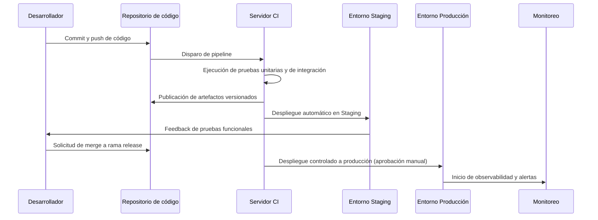
```mermaid
%% Diagrama de flujo CI/CD
sequenceDiagram
  participant Dev as Desarrollador
  participant SCM as Repositorio de código
  participant CI as Servidor CI
  participant QA as Entorno Staging
  participant Prod as Entorno Producción

  Dev->>SCM: Commit y push de código
  SCM->>CI: Disparo de pipeline
  CI->>CI: Ejecución de pruebas unitarias y de integración
  CI->>SCM: Publicación de artefactos versionados
  CI->>QA: Despliegue automático en Staging
  QA->>Dev: Feedback de pruebas funcionales
  Dev->>SCM: Solicitud de merge a rama release
  CI->>Prod: Despliegue controlado a producción (aprobación manual)
  Prod->>Monitoreo: Inicio de observabilidad y alertas
```
> **Figura 3.** Diagrama de Arquitectura de despliegue (CI/CD)

Commit y control de versiones: Los desarrolladores actualizan el código en el repositorio. Se utilizan ramas feature y merge requests para revisión de pares.

Pipeline de CI: Un servidor de CI ejecuta pruebas automáticas (unitarias, de integración y estáticas) en cada commit. Si las pruebas fallan, el pipeline se marca como fallido.

Construcción y versionado: Tras superar las pruebas, el pipeline empaqueta los artefactos (por ejemplo contenedores) y los publica en un registro privado con etiquetado semántico.

Despliegue en staging: Los artefactos se despliegan automáticamente en el entorno staging para validación funcional y de rendimiento. Se automatizan migraciones de base de datos y se monitoriza la salud de los servicios.

Aprobación y despliegue a producción: Un paso manual (gated) permite que un responsable de operaciones apruebe el despliegue a producción. El despliegue se realiza de manera gradual utilizando estrategias como blue/green o canary para minimizar riesgos.

Observabilidad post‑despliegue: Tras el despliegue se supervisan métricas clave y se habilitan alertas para detectar cualquier regresión.


## 7. Gestión de procesos y servicios

La plataforma EDYE se compone de servicios que corren como procesos independientes, orquestados y monitorizados para asegurar disponibilidad y rendimiento.

Gestión de procesos para Node.js: Se utiliza PM2, un gestor de procesos de producción que mantiene las aplicaciones Node.js en línea 24/7
pm2.keymetrics.io
. PM2 ofrece clustering, recarga sin interrupción y supervisión integrada.

Gestión de servicios PHP/Laravel: Los servicios basados en Laravel se despliegan mediante PHP‑FPM detrás de Nginx o Apache. Se realizan configuraciones de pools de procesos y se ajustan parámetros de rendimiento y seguridad.

Balanceo y proxy inverso: Nginx actúa como reverse proxy, balanceador de carga y servidor de contenidos, reconocido por su alto rendimiento y bajo consumo de recursos
nginx.org
. Se configuran grupos upstream con chequeos de salud y se implementan reglas de caché en la capa de proxy.

Servicios auxiliares: La infraestructura incluye servicios adicionales como colas de mensajes (por ejemplo RabbitMQ o SQS) para desacoplar procesos, y un sistema de envío de correos para notificaciones. Los detalles precisos se corresponden con la implementación real vigente.


## 8. Monitoreo y observabilidad

La observabilidad es clave para garantizar la fiabilidad del ecosistema EDYE. La plataforma implementa un conjunto de herramientas y prácticas para recolectar métricas, logs y trazas distribuidas.

Métricas de infraestructura: Se recogen métricas de utilización de CPU, memoria, disco y red de cada instancia. Se emplean agentes que exportan dichas métricas a un sistema centralizado donde se pueden visualizar en paneles y generar alertas.

Monitoreo de servicios: Los servicios exponen endpoints de salud y métricas (por ejemplo con Prometheus metrics o herramientas equivalentes). Se monitoriza la latencia, el throughput y el porcentaje de errores.

Logs centralizados: Todos los servicios envían sus registros a un sistema de logging centralizado (ELK/Graylog u otra solución) donde se indexan y se pueden consultar mediante búsquedas. Se define un formato común de logs para facilitar el análisis.

Alertas y notificaciones: Se configuran alertas basadas en umbrales y en anomalías; las notificaciones se envían a canales de mensajería corporativa o a sistemas de ticketing.

Trazas distribuidas: Los servicios que utilizan microservicios adoptan soluciones de trazabilidad (por ejemplo OpenTelemetry) para correlacionar peticiones a través de servicios y detectar cuellos de botella.


## 9. Seguridad y control de accesos

La seguridad se aborda de forma transversal en toda la arquitectura. Las principales medidas implementadas son:

Segregación de entornos: Los entornos de desarrollo, staging y producción se mantienen completamente aislados, evitando accesos directos entre ellos. Las bases de datos de staging contienen datos anonimizados.

Gestión de identidades y accesos (IAM): Se aplica el principio de privilegios mínimos. Las cuentas de usuario y de servicio se administran con un directorio central y autenticación multifactor. Se revisan periódicamente las políticas de acceso.

Cifrado: Los canales de comunicación utilizan TLS/HTTPS. Las bases de datos cifran datos sensibles en reposo y se emplean gestores de secretos para almacenar credenciales y claves.

Hardening de servidores: Se siguen prácticas de bastionado (limitación de puertos, actualización de paquetes, desactivación de servicios innecesarios). Nginx/Apache se configuran con encabezados de seguridad y se implementan listas de control de acceso IP.

Auditoría y cumplimiento: Se activan registros de auditoría para accesos administrativos y cambios de configuración. Periódicamente se realizan pruebas de penetración y análisis de vulnerabilidades. La infraestructura cumple con normativas de protección de datos aplicables.


## 10. Continuidad operativa y backups

La continuidad de negocio se garantiza mediante diseños de alta disponibilidad y políticas de respaldo consistentes.

Alta disponibilidad y replicación: Los servicios críticos se despliegan en clústeres redundantes distribuidos entre centros de datos. Las bases de datos MySQL utilizan replicación maestro‑esclavo o multi‑maestro; MongoDB emplea replica sets para tolerancia a fallos
en.wikipedia.org
.

Copias de seguridad: Se realizan backups periódicos de bases de datos y de objetos almacenados. Los backups se cifran y se guardan en ubicaciones separadas. Se mantienen políticas de retención que permiten restaurar a puntos en el tiempo (PITR) y se prueban regularmente mediante simulacros de restauración.

Plan de contingencia: Existen runbooks para conmutación manual o automática a un centro secundario en caso de desastre. Se definen objetivos de tiempo de recuperación (RTO) y objetivo de punto de recuperación (RPO) aceptables.

Pruebas de recuperación: De forma periódica se ejecutan ejercicios de failover para validar que los procedimientos se ejecutan correctamente y que el personal está preparado para incidentes reales.


## 11. Gestión de incidencias y soporte

La organización dispone de un proceso formal para la gestión de incidencias que abarca detección, clasificación, respuesta, comunicación y cierre con aprendizaje. El flujo general es el siguiente:


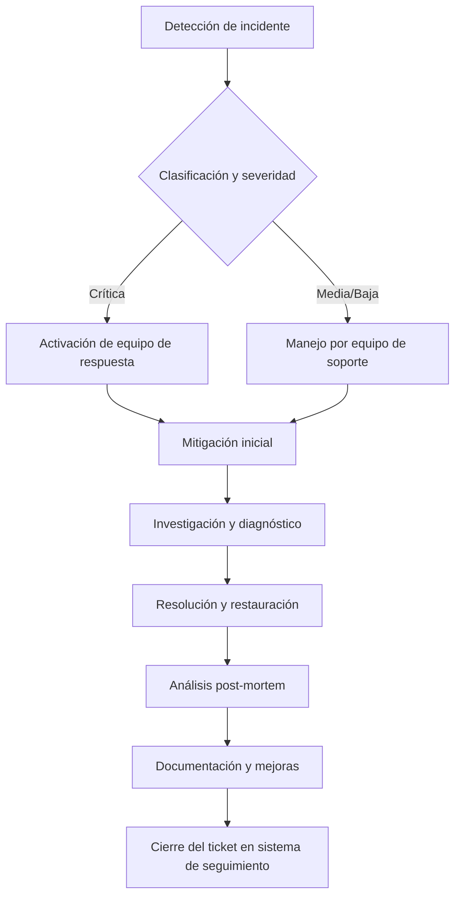
```mermaid
%% Flujo de gestión de incidencias
flowchart TD
  A[Detección de incidente] --> B{Clasificación y severidad}
  B -->|Crítica| C[Activación de equipo de respuesta]
  B -->|Media/Baja| D[Manejo por equipo de soporte]
  C --> E[Mitigación inicial]
  D --> E
  E --> F[Investigación y diagnóstico]
  F --> G[Resolución y restauración]
  G --> H[Análisis post‑mortem]
  H --> I[Documentación y mejoras]
  I --> J[Cierre del ticket en sistema de seguimiento]
```
> **Figura 4.** Diagrama de Gestión de incidencias y soporte

**Detección**: Las alertas de monitoreo o los reportes de usuarios inician el proceso de incidente.

**Clasificación**: Se determina el nivel de severidad y se asignan recursos apropiados. Los incidentes críticos activan un equipo de respuesta especializado.

**Mitigación y diagnóstico**: Se trabaja para restablecer el servicio lo antes posible, analizando causas raíz y aplicando soluciones temporales cuando sea necesario.

**Resolución**: Se implementan correcciones definitivas y se valida la estabilidad del sistema.

**Post‑mortem**: Se realiza un análisis detallado documentando la causa raíz, el tiempo de resolución y las acciones preventivas. Se actualizan los runbooks y se comunican las lecciones aprendidas a los equipos.

**Gestión de tickets**: Todos los pasos se registran en la herramienta corporativa de seguimiento de incidencias (por ejemplo Jira), permitiendo auditoría y trazabilidad.


## 12. Buenas prácticas operativas

Para asegurar la calidad y estabilidad de la infraestructura EDYE, se adoptan las siguientes buenas prácticas:

**Control de versiones y revisión de código**: Todo el código pasa por revisiones de pares y pipelines automáticos antes de ser integrado en ramas principales.

**Automatización**: Los procesos repetitivos se automatizan mediante scripts y herramientas de orquestación, reduciendo errores manuales.

**Gestión de configuraciones**: Se utiliza infraestructura como código (IaC) para definir entornos de manera declarativa. Esto facilita la replicación y reduce la deriva de configuración.

**Actualizaciones y parches**: Se establecen ventanas de mantenimiento para aplicar parches de seguridad y actualizaciones de software. Se prueban primero en staging antes de aplicar a producción.

**Observabilidad proactiva**: Se analizan tendencias de métricas para anticiparse a problemas de capacidad. Se definen SLO/SLI y se revisan periódicamente.

**Seguridad por diseño**: La seguridad se considera desde el diseño, implementando controles de acceso adecuados, cifrado y prácticas de desarrollo seguro.


## 13. Consideraciones finales

Este documento sintetiza la infraestructura actual de EDYE y sirve como punto de partida para futuras auditorías y mejoras. Dado que la tecnología y las necesidades del negocio evolucionan, la documentación deberá revisarse y actualizarse periódicamente para mantenerse alineada con la realidad operativa. Se recomienda que cualquier cambio sustancial en la arquitectura, herramientas o procesos se refleje en la documentación y se comunique a todos los equipos impactados.

***

\newpage

# 🈸 Servicio Admin

## 1. Introducción y propósito

El **servicio Admin** constituye el portal administrativo interno del ecosistema EDYE/HITN Digital. Según el manual de usuario, el portal está orientado a la **gestión del producto**, permitiendo ejecutar operaciones y procesos que finalmente soportan la entrega de contenidos a **partners y usuarios finales**. Entre las tareas que se realizan en este servicio se encuentran la **gestión de usuarios y roles**, la consulta y registro de información, la visualización de métricas de uso, así como la configuración y el envío de playlists, imágenes y metadatos. Esta documentación está dirigida a equipos de **DevOps**, **Operaciones**, **SRE** y **Seguridad**, y describe de forma técnica y operativa la infraestructura y los flujos del servicio.

## 2. Descripción funcional

El servicio Admin actúa como interfaz administrativa para los equipos internos y partners. Las principales funcionalidades, derivadas del menú del portal, se resumen a continuación:

### 2.1. Panel de control (Dashboard)

**Technical Info:** presenta gráficos de tráfico por endpoint, uso por endpoint y métricas de errores. Un gráfico de líneas muestra los hits totales, exitosos y con error, mientras que gráficos de anillos muestran el uso del API por endpoint y por partner. Una tabla denominada Latest Errors lista los errores recientes, mostrando el ID, la fecha, el nivel y el usuario, con opción de consultar el detalle.

**Commercial Info:** visualiza la información comercial asociada a **InPlayer** (suscripciones, pagos y cuentas activas/expiradas) mediante gráficos de líneas y barras, así como tablas de estado de cuentas. También muestra el porcentaje de uso del API por partner.

### 2.2. Gestión de metadatos

**Download Metadata:** permite descargar los metadatos de shows, temporadas y episodios en el formato requerido por cada partner.

**Editar Metadata:** habilita la creación y edición de objetos (shows, episodios o películas). Para dar de alta un asset es obligatorio que el asset exista previamente en la librería de **JW Player**. El formulario de edición incluye campos como Media Type, JWP Code (código de media o thumbnail según el tipo de asset), Edye Asset #, fechas de estreno y finalización, idiomas, estudios y otra información de metadatos. También permite registrar títulos, descripciones, ratings, elenco, equipo de producción, fechas de lanzamiento por país y premios; estos campos se gestionan a través de formularios estructurados para cada sección del asset.

### 2.3. Gestión de imágenes y entregas

**Upload Files:** permite cargar, editar y eliminar imágenes por show, temporada o episodio. El usuario selecciona la temporada, el formato (p. ej., 16:9) y el archivo a cargar; al enviar la operación se genera una lista de imágenes asociadas al asset.

**Delivery View:** muestra los envíos de imágenes por partner. Para cada envío se visualizan datos como el nombre del partner, el método de entrega, si la entrega está habilitada, si utiliza marca de agua, los formatos de imagen y una lista de episodios con la cantidad de imágenes y opciones de descarga.

**Watermark:** gestiona colecciones de marcas de agua. Se pueden crear colecciones, subir imágenes de marca de agua, definir la colección por defecto y eliminar marcas de agua específicas.

**Delivery:** posibilita la creación de nuevos paquetes de entrega para un partner y el monitoreo de entregas existentes.

### 2.4. Registro y auditoría

**Api Log:** proporciona un registro cronológico de las peticiones al API. Permite filtrar por fechas, usuario o endpoint y descargar la información en CSV. La tabla muestra campos como ID, fecha, nivel (informativo o error), usuario, mensaje, geolocalización y código de respuesta.

**Notification Log:** lista las notificaciones enviadas a partners que requieren confirmaciones; incluye el ID, la fecha, el partner, el método, la URL y un acceso al detalle de la transacción.

**Terra Log:** registra eventos asociados a la integración con Terra, permitiendo filtrar por fecha, operación y tipo de evento. Muestra campos como ID, fecha, MSISDN, operación, nivel y respuesta.

**Bango Log:** muestra eventos relacionados con la integración con Bango; incluye identificación, fecha, nivel, usuario, mensaje, geolocalización y respuesta.

**Marketing API Log:** lista las interacciones con el sistema de email marketing (Mailchimp), con filtros por fecha, tipo de operación (contacto u orden) y tipo de evento.

**SSO API Log:** registra eventos de inicio de sesión mediante SSO; permite filtrar por origen y muestra campos como ID, fecha, origen, partner SSO, cliente SSO, método y endpoint, respuesta y opción de descarga.

### 2.5. Integración con JW Player

El servicio Admin se integra con la plataforma JW Player para administrar shows, episodios y tags. Las principales acciones son:

**Shows:** lista los shows publicados en JW Player y permite filtrar por librería (por ejemplo, 16:9 ES, carrusel o 16:9 PT). Se puede buscar un show, descargar la lista filtrada y, al activar la casilla, redirigirse a JW Player para editar los tags del show.

**Episodes:** permite editar la metadata de episodios específicos a través de las interfaces de JW Player. Se puede filtrar por librería, show o nombre del episodio y acceder al editor de JW Player para cada episodio.

**Tags vs Shows / Tags vs Episodes:** agrupan los shows o episodios por tag para una vista unificada y permiten editar los tags correspondientes en JW Player.

**Sync Shows Info:** sincroniza la información de las librerías de JW Player con la base de datos del API. Este proceso corre automáticamente cada noche, aunque puede ejecutarse manualmente cuando se requieren cambios inmediatos.

**Edit JW Player:** facilita la edición masiva de metadatos de un show y sus episodios, así como la sincronización de datos e imágenes solo para ese show.

### 2.6. Configuración

**Partners:** permite crear, editar o eliminar partners. Al crear un partner se define la información principal (nombre), la configuración de watermarks, los formatos de miniaturas y los métodos de entrega. También se gestionan credenciales (S3, SFTP, etc.), configuraciones de billing (como URL de suscripción y pasarela de pago) y formatos de naming para video, imagen y metadata. El panel permite habilitar o deshabilitar la entrega vía API y configurar carpetas de Aspera para distribución de archivos.

**Users:** crea, edita y asigna permisos a usuarios administrativos.

**Playlist:** asigna los playlists maestros por idioma.

**System Config:** gestiona variables de entorno necesarias para la ejecución de la aplicación.

**Cron Process:** muestra un listado de procesos automáticos, con información de la última ejecución y un historial de logs.

### 2.7. Herramientas

**Cache:** opción para borrar los servidores de caché.

**Coactive:** tablero con información de sincronización entre la biblioteca administrada y la base de datos de IA de Coactive, mostrando el estado de dicha sincronización.

**Logout:** cierre de sesión del portal.

## 3. Arquitectura y componentes

De acuerdo con la documentación interna, el servicio Admin está implementado como una aplicación web cliente‑servidor. Su arquitectura se compone de:

| Componente             | Descripción                                                                                                                                                                                                                                                                                                                        |
| ---------------------- | ---------------------------------------------------------------------------------------------------------------------------------------------------------------------------------------------------------------------------------------------------------------------------------------------------------------------------------- |
| **Frontend**           | Interfaz construida con Next JS, basada en React. El entorno de ejecución utiliza Node.js para aprovechar un modelo de eventos no bloqueante.                                                                                                                                                                                      |
| **Backend**            | Lógica principal desarrollada en Laravel (PHP), utilizando un patrón MVC y un ORM robusto para operaciones con la base de datos. Laravel soporta bases de datos relacionales como MySQL y se puede extender a MongoDB mediante paquetes específicos.                                                                               |
| **Base de datos**      | Instancia relacional MySQL empleada para almacenar configuraciones, usuarios y metadatos del catálogo. MySQL proporciona transacciones ACID y replicación.                                                                                                                                                                         |
| **Servicios externos** | Comunicación con el API de contenidos para publicar cambios, servicios de almacenamiento en la nube para cargar imágenes y activos, y otras integraciones como InPlayer, Terra, Bango, Mailchimp y SSO según lo indicado en los logs. Además, se integra con JW Player para la gestión de metadatos y sincronización de contenido. |

> Nota: Las tecnologías descritas en el frontend, backend y base de datos provienen del documento base del servicio. El manual de usuario no detalla la pila de desarrollo ni la topología de infraestructura, por lo que estas descripciones se deben validar con el equipo técnico antes de auditorías formales.

## 4. Dependencias internas y externas

El servicio Admin interactúa con varios módulos y servicios:

- **API de contenidos:** expone los endpoints que permiten crear, actualizar o eliminar recursos del catálogo. El portal consulta y envía metadatos y recibe confirmación de operaciones.
- **Servicio de almacenamiento en la nube:** gestiona el almacenamiento y la entrega de imágenes y archivos multimedia. La configuración de delivery de imágenes por partner implica credenciales S3/SFTP y carpetas de Aspera.

**Integraciones de terceros:**

- **JW Player:** fuente de verdad para los assets audiovisuales. Los procesos de creación de metadatos y la sincronización de librerías dependen de que los assets existan previamente en JW Player.
- **InPlayer:** plataforma de suscripciones y pagos; el dashboard comercial muestra métricas de InPlayer.
- **Terra, Bango y Mailchimp:** servicios externos integrados a través de logs y procesos de notificación.
- **Coactive:** sistema de IA para análisis y etiquetado de contenido, con el que se sincroniza la biblioteca de Admin.
- **Sistema de pagos y facturación:** partners pueden asociar configuraciones de pasarelas de pago y URL específicas para sus páginas de suscripción.

## 5. Flujos operativos principales

### 5.1. Acceso y autenticación

El acceso al portal se realiza mediante autenticación con usuario y contraseña internos. El alta de usuarios se gestiona por el equipo de Edye. Tras la autenticación, los usuarios acceden al panel principal y a las secciones según sus permisos. Para integraciones SSO existe un log de eventos dedicado.

### 5.2. Edición de catálogo

- **Creación/edición de metadata:** el operador selecciona el tipo de asset (serie, episodio o película), diligencia los campos obligatorios y guarda la información. Solo se pueden crear assets que ya existen en JW Player.
- **Carga de imágenes:** desde Upload Files, se selecciona el show, temporada y formato y se sube el archivo. Las imágenes asociadas al asset quedan listadas junto con opciones de descarga.
- **Gestión de entregas:** se configuran paquetes de entrega para partners, asignando formatos y credenciales. Las entregas pueden hacerse mediante la API o por carpetas en sistemas como Aspera y S3.
- **Sincronización con JW Player:** los catálogos de shows y episodios se sincronizan cada noche. Las sincronizaciones manuales se utilizan cuando se requiere reflejar cambios de inmediato.

### 5.3. Monitoreo y auditoría

Los operadores utilizan los tableros del Dashboard para revisar el tráfico de la API y las métricas comerciales. Además, pueden consultar diferentes logs para auditar eventos:

- **API Log:** seguimiento de peticiones y errores, con filtros y exportación a CSV.
- **Notification Log, Terra Log, Bango Log, Marketing API Log y SSO API Log:** registros específicos de integraciones externas.
- **Coactive:** información sobre la sincronización con la base de datos de IA.

Los logs se utilizan para detectar incidencias, analizar tiempos de respuesta y verificar el cumplimiento de procesos de notificación.

## 6. Seguridad y control de accesos

- **Autenticación y autorización:** la aplicación utiliza control de acceso basado en roles. El alta de usuarios se realiza de forma centralizada y cada usuario recibe permisos específicos (p. ej., editores, supervisores). Para SSO se registran eventos en un log dedicado.
- **Transmisión segura:** todas las comunicaciones se realizan sobre HTTPS/TLS. Las contraseñas y claves de API se almacenan cifradas.
- **Gestión de secretos:** las credenciales de partners (S3, SFTP, Aspera) se almacenan de forma segura en la configuración del partner. Las variables de entorno sensibles se gestionan desde la sección System Config.
- **Auditoría:** las operaciones de usuarios y procesos automáticos quedan registradas en los diversos logs, permitiendo traceabilidad completa.

## 7. Operación, monitoreo y logs

El servicio Admin se despliega mediante un flujo de integración y entrega continua (CI/CD), con pruebas automáticas, empaquetado en contenedores y publicación en entornos de desarrollo, staging y producción. Los operadores realizan pruebas de smoke antes de promover a producción. El orquestador gestiona el auto‑escalado y balanceo de carga. Las variables sensibles se gestionan como secretos.

El monitoreo incluye:

- **Métricas de aplicación:** tráfico por endpoint, tiempo de respuesta, tasa de errores y uso de recursos. Estas métricas se visualizan en el panel Technical Info.
- **Métricas comerciales:** actividad de suscripciones, pagos y estado de cuentas, capturadas a partir de InPlayer y mostradas en el panel Commercial Info.
- **Logs estructurados:** todos los subsistemas generan registros que se centralizan para búsquedas y auditoría. Los registros se pueden descargar en formatos planos para análisis externo.

## 8. Continuidad operativa y resiliencia

- **Alta disponibilidad:** la aplicación se despliega en múltiples zonas de disponibilidad con balanceadores de carga.
- **Backups y recuperación:** se realizan copias de seguridad de la base de datos y de los contenedores de estado. Existe replicación asíncrona a una región secundaria y procedimientos documentados para conmutación por error.
- **Pruebas de contingencia:** se programan ejercicios de restauración y failover para validar los tiempos de recuperación.

> Nota: estas prácticas provienen del documento base y no son detalladas en el manual de usuario. Deben confirmarse con el equipo de operaciones.

## 9. Limitaciones conocidas / supuestos documentados

- **Pre‑existencia de assets en JW Player:** la creación de un asset en el servicio Admin requiere que el asset exista previamente en la librería de JW Player.
- **Dependencia de integraciones externas:** muchas funciones dependen de servicios de terceros (InPlayer, Terra, Bango, Mailchimp, SSO, Aspera). La disponibilidad y latencia de estos servicios impacta la operación.
- **Sincronización nocturna:** la sincronización completa de shows y episodios con JW Player se ejecuta automáticamente cada noche y puede tardar. Los usuarios deben evitar ejecutarla manualmente a menos que sea necesario.
- **Configuración sensible:** los datos de entrega (credenciales de buckets, formatos de imagen, pasarelas de pago) deben gestionarse con cuidado. El manual no detalla políticas de rotación ni gestión de secretos; se debe revisar con el área de seguridad.

## 10. Pendientes de validación

- **Pila tecnológica exacta:** el manual de usuario no confirma explícitamente el uso de Laravel, Next JS ni MySQL; estos detalles provienen del documento base y deben confirmarse con el equipo de desarrollo antes de auditar la infraestructura.
- **Topología de despliegue:** no se proporcionan detalles sobre el orquestador de contenedores (p. ej., Kubernetes, ECS) ni la configuración de auto‑escalado.
- **Procesos CI/CD:** el pipeline descrito en el documento base (pruebas unitarias, construcción de contenedores, despliegue en entornos) no está documentado en el manual y debe validarse.
- **Mecanismos de cifrado y gestión de claves:** aunque se menciona cifrado y HTTPS, no se detallan algoritmos ni mecanismos de gestión de secretos.
- **Flujos de aprobación y auditoría de partners:** las reglas de negocio para la creación y aprobación de nuevos partners, así como la habilitación de entregas automáticas, no están especificadas en la documentación; se requiere confirmación.

## 11. Observaciones finales

La consolidación presentada integra la funcionalidad detallada en el Manual de Usuario con la estructura operativa y técnica del documento base. Se han evitado suposiciones no documentadas y se han marcado los puntos que requieren validación. Este documento proporciona una visión coherente y actualizada del servicio Admin, adecuada para su publicación en plataformas de documentación corporativa como Docusaurus, Confluence o documentos PDF.

***

\newpage

# 🈸 Servicio API

## 1. Introducción y propósito

Este documento describe la arquitectura, el despliegue y las prácticas operativas del servicio API del ecosistema EDYE/HITN Digital. El objetivo del servicio es proporcionar una capa de acceso estandarizada a los catálogos de vídeos, libros y juegos, tanto para aplicaciones propias (web, móviles y TV) como para integraciones con distribuidores. El público objetivo del documento son los equipos de DevOps, Operaciones, SRE y Seguridad.

## 2. Descripción funcional

El servicio API constituye el núcleo de comunicación entre clientes y recursos de contenido. Sus principales funciones son:

- **Exposición de contenidos:** ofrece endpoints REST para recuperar listados de series, episodios, libros y juegos, junto con metadatos multilingües.
- **Autenticación de socios:** gestiona la autenticación de distribuidores y usuarios finales. El API implementa flujos de autenticación para proveedores de TV de pago (MVPD) y para clientes directos de la plataforma.
- **Gestión de usuarios y perfiles:** permite crear cuentas, validar credenciales y administrar perfiles de menores y padres.
- **Continuidad de consumo:** proporciona endpoints para funciones como “seguir viendo” y listas de favoritos. Según el estudio de Coorva, estas funcionalidades se construyeron sobre un stack Node.js/NextJS con base de datos MongoDB.
- **Procesamiento de imágenes y activos:** ofrece servicios de redimensionamiento y optimización de imágenes para los clientes.

## 3. Arquitectura y componentes

El servicio está diseñado como microservicio de alto rendimiento en Node.js. Los principales componentes son:

| Componente                    | Descripción                                                                                                                                                                                                                                                                                                                                                                                        |
| ----------------------------- | -------------------------------------------------------------------------------------------------------------------------------------------------------------------------------------------------------------------------------------------------------------------------------------------------------------------------------------------------------------------------------------------------- |
| **Plataforma Node.js**        | Implementado sobre Node.js, que emplea un bucle de eventos para operaciones de E/S no bloqueantes. Este modelo permite atender muchas solicitudes simultáneamente, lo que es fundamental para un servicio de contenido.                                                                                                                                                                            |
| **Framework y controladores** | Se utiliza un framework HTTP (p. ej., Express o Fastify) para definir rutas REST, controladores y middlewares.                                                                                                                                                                                                                                                                                     |
| **Bases de datos**            | 1) **MySQL** para datos relacionales como cuentas de usuario, metadatos de títulos y sus relaciones. MySQL es reconocido por su fiabilidad y soporte a ACID. 2) **MongoDB** para datos semiestructurados relacionados con la continuidad de visualización (listas de reproducción, favoritos). Laravel admite MongoDB mediante un paquete oficial, facilitando la integración con otros servicios. |
| **Servicios de cache**        | Utiliza caché en memoria (p. ej., Redis) para almacenar respuestas frecuentes y reducir la latencia.                                                                                                                                                                                                                                                                                               |
| **Servicios externos**        | Interactúa con servicios de almacenamiento para obtener activos multimedia y con el servicio de suscripciones para validar licencias de acceso.                                                                                                                                                                                                                                                    |

### 3.1. Diagrama de arquitectura

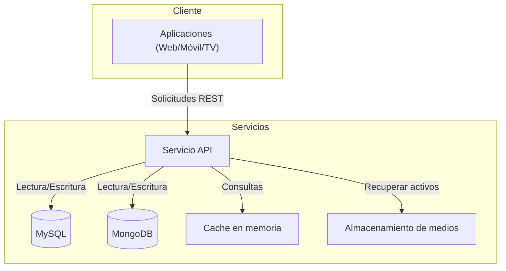
```mermaid
flowchart TD
    subgraph Cliente
        A["Aplicaciones (Web/Móvil/TV)"]
    end
    subgraph Servicios
        API["Servicio API"]
        DBR[("MySQL")]
        DBNoSQL[("MongoDB")]
        Cache["Cache en memoria"]
        Storage["Almacenamiento de medios"]
    end
    A -- "Solicitudes REST" --> API
    API -- "Lectura/Escritura" --> DBR
    API -- "Lectura/Escritura" --> DBNoSQL
    API -- "Consultas" --> Cache
    API -- "Recuperar activos" --> Storage
```

> **Figura 1.** Diagrama de arquitectura

Este diagrama resume la interacción principal entre clientes, bases de datos y servicios de soporte.

## 4. Modelo de despliegue

El servicio se gestiona mediante pipelines de CI/CD que garantizan la integridad del código y la confiabilidad de los despliegues:

- **Control de versiones:** el código fuente se almacena en un repositorio Git con ramas para desarrollo, staging y producción.
- **Construcción y pruebas:** al realizar cambios, se ejecutan pruebas unitarias y de integración que validan las rutas, el manejo de errores y la compatibilidad con las bases de datos.
- **Contenerización:** se empaqueta la aplicación en una imagen de contenedor. Las variables de configuración (puertos, credenciales de bases de datos, claves de servicios externos) se inyectan como variables de entorno.
- **Despliegue:** las imágenes se publican en entornos de desarrollo, staging y producción. El orquestador se encarga del escalado horizontal y del balanceo de carga. Las actualizaciones se realizan mediante despliegues continuos (rolling update) para evitar interrupciones.

## 5. Monitoreo y observabilidad

Se instrumentan las siguientes prácticas:

- **Métricas técnicas:** latencia de peticiones, throughput (peticiones por segundo), porcentaje de errores 4xx y 5xx, utilización de CPU/memoria y conexión a base de datos.
- **Registros:** Node.js genera logs estructurados con nivel de severidad y trazas de solicitudes (IDs correlacionados). Los logs se recolectan en un servicio centralizado para análisis y auditoría.
- **Trazas distribuidas:** se implementa instrumentation para asociar cada solicitud con un identificador que se transmite a los servicios asociados (Cloud, Billing, Play). Esto facilita el seguimiento de errores en la cadena de servicios.
- **Alertas:** se configuran alertas basadas en métricas (p. ej., latencia alta, errores de base de datos) que notifican al equipo SRE mediante sistemas de mensajería corporativos.

## 6. Seguridad y accesos

La seguridad es una prioridad en el diseño del API:

- **Autenticación y autorización:** se implementan estándares de autorización con tokens firmados (por ejemplo, JWT) y control de acceso basado en scopes. Los distribuidores utilizan flujos de autenticación específicos (OAuth 2.0) para validar sus credenciales.
- **Cifrado de comunicaciones:** todas las interacciones se realizan mediante HTTPS/TLS. Para las conexiones a las bases de datos se utilizan túneles cifrados.
- **Protección contra abusos:** se aplican límites de tasa (rate limiting) y validación de peticiones para mitigar ataques de fuerza bruta y denegación de servicio.
- **Gestión de secretos:** las credenciales y claves de API se almacenan en gestores de secretos y se rotan periódicamente.

## Continuidad operativa

Para garantizar un servicio disponible y resiliente se aplica lo siguiente:

- **Escalado horizontal:** se ejecutan múltiples réplicas del API con balanceo de carga. Esto permite absorber picos de tráfico asociados a eventos o estrenos.
- **Replicación y backups:** la base de datos MySQL se replica a nodos secundarios y se programan copias de seguridad regulares. Los datos en MongoDB se replican en clústeres con réplica integrada.
- **Failover:** se definen procedimientos de conmutación automática ante fallos en los nodos de aplicación o en las bases de datos. Los contenedores monitorizan su estado y se reinician ante caídas.
- **Pruebas de resiliencia:** se realizan ensayos controlados de caída de nodos y de saturación para validar la capacidad de recuperación.

## 7. Dependencias y comunicación

El API interactúa con diversos servicios del ecosistema:

- **Servicio Admin:** recibe actualizaciones de metadatos y notifica operaciones completadas. El Admin es el origen de la mayoría de los cambios de catálogo.
- **Servicio Billing:** consulta la información de suscripción y derecho de acceso antes de entregar contenidos premium.
- **Servicio Cloud:** obtiene las URL de activos (videos, imágenes, libros) y gestiona firmas de acceso.
- **Servicio Play/Aplicaciones:** los clientes finales consumen el API para presentar contenido a los usuarios.
- **Servicio Connect:** proporciona tokens de autorización cuando la autenticación se realiza a través de distribuidores externos.

Cada integración utiliza contratos de API versionados para mantener la compatibilidad y la trazabilidad.

***

\newpage

# 🈸 Servicio Billing

## 1. Introducción y propósito

El servicio Billing es responsable de la gestión de suscripciones y transacciones dentro de la plataforma EDYE/HITN Digital. Su objetivo es asegurar que solo los usuarios con planes activos o derechos válidos puedan acceder al contenido premium, administrar la facturación y proporcionar información de cobro para los distintos módulos. Este documento detalla los componentes de infraestructura y los procesos operativos para los equipos de DevOps, Operaciones, SRE y Seguridad.

## 2. Descripción funcional

Las funciones principales del servicio son:

- **Gestión de paywall:** controla el acceso a contenido restringido mediante una barrera de pago. Según la descripción de los sistemas de paywall, este mecanismo obliga a los visitantes a proporcionar datos (correo electrónico) o a suscribirse antes de acceder.
- **Gestión de suscripciones:** mantiene el registro actualizado de planes, ciclos de facturación y estado de cada suscriptor. El software de suscripción administra información de pago, cambios de tarifa y transacciones como reembolsos.
- **Procesamiento de pagos:** integra la plataforma con un proveedor de pagos externo para autorizar cobros y almacenar tokens de pago. Los datos sensibles no se guardan en los sistemas internos.
- **Control de acceso:** emite tokens de acceso y comprueba el estado de la suscripción de un usuario antes de permitir la visualización de contenidos. Este control se realiza en coordinación con el servicio API y con el front‑end de reproducción.
- **Reportes y reconciliación:** genera reportes para áreas de negocio (ingresos, cancelaciones) y facilita la conciliación con los proveedores de pagos.

## 3. Arquitectura y componentes

El servicio Billing está compuesto por los siguientes elementos:

| Componente                 | Descripción                                                                                                                                                                                                                                     |
| -------------------------- | ----------------------------------------------------------------------------------------------------------------------------------------------------------------------------------------------------------------------------------------------- |
| Interfaz de pago           | API que expone las operaciones de suscripción, cancelación y renovación. La interfaz se basa en Node.js/Express para orquestar los flujos y comunicarse con servicios externos.                                                                 |
| Proveedor de suscripciones | La plataforma utiliza un servicio de terceros especializado en paywall y administración de suscripciones para mantener la información de clientes. Este proveedor ofrece herramientas para crear planes, actualizar precios y procesar cambios. |
| Base de datos interna      | Se almacena información no sensible como identificadores de clientes, historial de cambios y correlaciones con usuarios de EDYE. Para ello se emplea MySQL por su fiabilidad y soporte a ACID.                                                  |
| Servicios auxiliares       | Incluyen un servicio de notificaciones para enviar correos electrónicos sobre renovaciones y vencimientos, y un servicio de conciliación para comparar registros internos con los reportes del proveedor de pagos.                              |

### 3.1. Diagrama de arquitectura

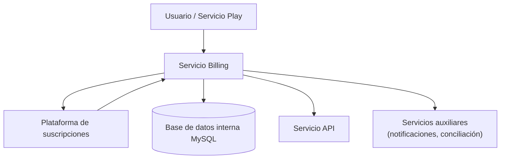
```mermaid
flowchart TD
    User[Usuario / Servicio Play] --> Billing[Servicio Billing]
    Billing --> External[Plataforma de suscripciones]
    External --> Billing
    Billing --> DB[(Base de datos interna MySQL)]
    Billing --> API[Servicio API]
    Billing --> Aux["Servicios auxiliares<br/>(notificaciones, conciliación)"]
```

> **Figura 1.** Diagrama de arquitectura

## 4. Flujo general

1. El usuario inicia un proceso de suscripción desde el front‑end (web o aplicación). La interfaz solicita información mínima (correo y plan deseado). El paywall exige la suscripción para acceder al contenido.
2. La información de pago se envía a la plataforma de suscripciones externa, que procesa el cobro y devuelve un token de pago autorizado.
3. El servicio Billing almacena un registro del usuario y del token, actualiza su estado a activo y notifica al API para habilitar el acceso.
4. En cada petición al API de contenidos, éste consulta el servicio Billing para validar que la suscripción está vigente antes de entregar el recurso.
5. En caso de cancelación o expiración, se actualiza el estado y se revocan los permisos correspondientes.

## 5. Modelo de despliegue

El código del servicio reside en un repositorio gestionado mediante control de versiones. El pipeline de CI/CD contempla:

- **Pruebas y validación:** se ejecutan pruebas unitarias para verificar la lógica de cálculo de fechas de renovación, verificación de tokens y comunicación con el proveedor externo.
- **Empaquetado:** se construye una imagen de contenedor con la aplicación y se gestionan variables sensibles mediante secretos de despliegue.
- **Despliegue:** la imagen se despliega en entornos de desarrollo, staging y producción. Se utilizan réplicas para alta disponibilidad y se configura auto‑escalado basado en consumo de CPU y número de transacciones.
- **Integración con servicios externos:** se registran claves de API y certificados para la conexión segura con el proveedor de suscripciones.

## 6. Monitoreo y observabilidad

Para garantizar un servicio confiable se monitorizan:

- **Indicadores de negocio:** número de suscripciones activas, cancelaciones, ingresos recurrentes mensuales (MRR), fallos de cobro.
- **Indicadores técnicos:** latencia de peticiones a la plataforma externa, tiempos de respuesta del API, ratio de errores 4xx/5xx, utilización de CPU y memoria.
- **Logs:** se registran eventos de suscripción (altas, renovaciones, cancelaciones) y se envían a un sistema centralizado. Se filtran datos sensibles para cumplir con normativas de protección de datos.
- **Alertas:** se configuran umbrales (p. ej., tasa de fallos de cobro superior al 2 %) que disparan notificaciones al equipo de operaciones.

## 7. Seguridad y accesos

El tratamiento de datos de pago requiere medidas estrictas:

- **Cumplimiento PCI DSS:** se delega el procesamiento de tarjetas al proveedor de pagos, evitando el almacenamiento de información financiera en nuestros sistemas. Las comunicaciones con el proveedor se realizan mediante TLS.
- **Autenticación y autorización:** las operaciones de alta, baja y renovación se protegen mediante autenticación de usuarios y tokens de sesión. Solo el API y las aplicaciones con permisos válidos pueden invocar los endpoints internos.
- **Cifrado:** se cifran en tránsito las comunicaciones entre el servicio Billing y los demás servicios (API, Play). Además, los identificadores de transacción se enmascaran en los registros.
- **Políticas de retención:** los datos de suscripción se conservan el tiempo mínimo necesario para cumplir con obligaciones legales y se eliminan de forma segura al finalizar.

## 8. Continuidad operativa

El servicio se diseña para ser resiliente ante fallos:

- **Alta disponibilidad:** se ejecutan varias réplicas en distintas zonas de disponibilidad. La pérdida de una instancia no impacta en la capacidad de procesar pagos.
- **Backups y replicación:** la base de datos interna se respalda regularmente. Los datos críticos como tokens de suscripción se pueden reconstituir desde el proveedor externo en caso de fallo.
- **Mecanismos de reintento:** las peticiones a la plataforma externa implementan reintentos con back‑off exponencial para manejar fallos temporales.
- **Planes de contingencia:** se documentan procedimientos para suspender temporalmente la facturación ante incidencias críticas y reanudarla cuando se resuelvan.

## 9. Dependencias y comunicación

Las principales integraciones del servicio son:

- **API de contenidos:** consulta el estado de suscripción en cada solicitud de recurso premium. La comunicación se realiza mediante endpoints internos autenticados.
- **Plataforma de pagos externa:** se utiliza para gestionar suscripciones, procesar cobros y emitir tokens de acceso. No se almacena información financiera en los sistemas de EDYE.
- **Servicio Play:** durante el flujo de suscripción, la aplicación de reproducción redirige al usuario hacia el servicio Billing para completar la compra y luego obtiene el token de autorización.
- **Servicio Admin:** permite a los operadores revisar el estado de las cuentas de distribuidores y sus permisos de acceso al contenido premium.

Todas las comunicaciones utilizan contratos de API versionados y se securizan con claves de acceso y certificados para garantizar la confidencialidad e integridad de los datos.

***

\newpage

# 🈸 Servicio Cloud

## Introducción y propósito

El servicio Cloud proporciona la infraestructura de almacenamiento y distribución de contenidos en el ecosistema EDYE/HITN Digital. Su rol es almacenar vídeos, audios, imágenes, libros y archivos de juegos, y entregarlos de forma eficiente y segura a los usuarios finales y a los demás servicios internos. Este documento detalla su arquitectura, procesos de despliegue, observabilidad y controles de seguridad.

## Descripción funcional

Las responsabilidades principales del servicio son:

- **Almacenamiento de activos:** guarda de forma persistente todos los elementos multimedia del catálogo (vídeos en distintos bitrates, carátulas, e‑books y juegos). Utiliza un servicio de almacenamiento de objetos escalable y distribuido, con control de versiones y replicación geográfica.
- **Procesamiento y conversión:** integra pipelines para transcodificar vídeos a diferentes resoluciones y formatos adaptativos. También genera miniaturas e imágenes optimizadas para su uso en el servicio Play.
- **Distribución mediante CDN:** entrega contenidos a usuarios finales a través de una red de distribución de contenidos (CDN) que minimiza la latencia y mejora la experiencia de streaming.
- **Gestión de metadatos de archivos:** mantiene un catálogo interno de activos con etiquetas, versiones y políticas de expiración. Este catálogo se sincroniza con el servicio API y el servicio Admin.
- **Entrega segura:** proporciona URLs firmadas con expiración para proteger el acceso y controlar el tiempo de vida de los enlaces de descarga.

## Arquitectura y componentes

El servicio Cloud se compone de varias capas:

| Componente                 | Descripción                                                                                                                                                                                         |
| -------------------------- | --------------------------------------------------------------------------------------------------------------------------------------------------------------------------------------------------- |
| Almacenamiento de objetos  | Sistema de almacenamiento distribuido que permite guardar objetos de cualquier tamaño. Permite la replicación en múltiples zonas para alta disponibilidad y durabilidad.                            |
| Transcodificador           | Motor que ingiere los archivos fuente y genera versiones adaptadas para streaming (HLS/DASH). También produce miniaturas e imágenes redimensionadas utilizadas por el servicio Admin y Play.        |
| CDN                        | Red global que almacena copias en caché de los activos para reducir la latencia en la entrega a usuarios finales. Configura políticas de cache, invalidación y protección contra descargas masivas. |
| Servicio de firma          | Componente que genera firmas temporales y tokens de acceso para que el contenido solo sea accesible con permisos válidos.                                                                           |
| Base de datos de metadatos | Conserva información asociada a cada archivo: ubicación física, versiones, estatus de transcodificación y relaciones con títulos del catálogo.                                                      |

### Diagrama de arquitectura

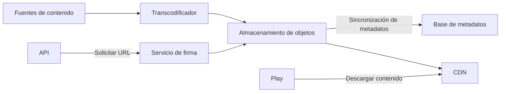
```mermaid
flowchart LR
	Source[Fuentes de contenido] --> Transcode[Transcodificador]
	Transcode --> Storage[Almacenamiento de objetos]
	Storage -- Sincronización de metadatos --> Metadata[Base de metadatos]
	Storage --> CDN
	API -- Solicitar URL --> Signer[Servicio de firma]
	Signer --> Storage
	Play -- Descargar contenido --> CDN
```

> **Figura 1.** Diagrama de arquitectura

## Modelo de despliegue

El servicio se despliega siguiendo prácticas de infraestructura como código y pipelines automatizados:

- **Aprovisionamiento:** los recursos de almacenamiento, transcodificación y CDN se definen mediante plantillas (p. ej., Terraform o CloudFormation) y se desplegaron en la nube pública.
- **CI/CD:** los scripts de automatización se actualizan y se ejecutan en pipelines que verifican sintaxis, simulan despliegues y aplican cambios en entornos de desarrollo, staging y producción.
- **Despliegue de microservicios:** el servicio de firma y el catálogo de metadatos se empaquetan en contenedores. Se despliegan en clústeres con escalado horizontal y balanceo de carga.
- **Versionado de activos:** los cambios en las configuraciones de transcodificación y políticas de CDN se versionan y se publican mediante las mismas herramientas de automatización.

## Monitoreo y observabilidad

Para asegurar la calidad y disponibilidad de la distribución se monitorizan:

- **Métricas de almacenamiento:** capacidad usada, tasa de lectura/escritura, errores de acceso.
- **Métricas de transcodificación:** tiempo de procesamiento por archivo, número de trabajos en cola y fallos de conversión.
- **Desempeño de CDN:** latencia, tasa de aciertos de caché, número de solicitudes servidas y distribución geográfica del tráfico.
- **Registros:** se registran accesos a objetos, generación de URLs firmadas y operaciones de transcodificación. Estos registros se almacenan en un sistema central para auditoría y detección de anomalías.
- **Alertas:** se configuran umbrales (p. ej., utilización de almacenamiento al 80 %, fallos de transcodificación persistentes) que disparan alertas al equipo SRE.

## Seguridad y accesos

Dado que maneja contenido protegido, se aplican controles de seguridad estrictos:

- **Controles de acceso:** los buckets de almacenamiento están configurados con políticas que restringen el acceso a servicios autenticados. Solo el servicio API y el servicio Play pueden solicitar URLs firmadas.
- **Cifrado:** los objetos se cifran tanto en reposo como en tránsito. Se utilizan claves gestionadas y se rotan periódicamente.
- **URLs firmadas:** cada enlace de descarga incluye una firma generada por el servicio de firma que limita la validez temporal y la IP que lo puede utilizar. Esto evita la redistribución no autorizada.
- **Validación de integridad:** se calculan sumas de verificación (checksums) de los archivos al cargarlos y al entregarlos para detectar corrupciones.

## Continuidad operativa

Las prácticas de resiliencia incluyen:

- **Replicación geográfica:** los objetos se replican en múltiples regiones para protegerse contra fallos regionales.
- **Backups:** aunque el almacenamiento de objetos ofrece alta durabilidad, se generan backups periódicos de los metadatos y de las configuraciones de transcodificación.
- **Estrategias de failover:** se configuran rutas alternativas en la CDN y políticas de conmutación a regiones secundarias en caso de incidentes graves.
- **Pruebas de recuperación:** se realizan ejercicios programados de restauración y de conmutación para comprobar los tiempos de recuperación objetivos.

## Dependencias y comunicación

El servicio Cloud interactúa con los siguientes módulos:

- **Servicio API:** solicita la creación de URLs firmadas para permitir el acceso a archivos. También actualiza el catálogo de metadatos cuando se suben nuevos activos o se completan transcodificaciones.
- **Servicio Admin:** carga nuevas imágenes y activa conversiones de portada. Recupera vistas en miniatura para presentación en el panel administrativo.
- **Servicio Play:** consume las URLs firmadas para reproducir vídeos, mostrar portadas y descargar libros o juegos.
- **Servicio Satellite:** obtiene archivos relacionados con listas de reproducción y elementos de seguimiento para sincronizar el progreso del usuario.

Estas interacciones se gestionan mediante API internas, asegurando el control de acceso y la trazabilidad de cada operación.

***

\newpage

# 🈸 Servicio Play

## Introducción y propósito

El servicio Play es la puerta de entrada de los usuarios finales al catálogo audiovisual y de juegos de EDYE/HITN Digital. Incluye las aplicaciones web y móviles que permiten reproducir contenido en streaming, acceder a libros interactivos y juegos educativos, así como gestionar perfiles y preferencias. Este documento describe la infraestructura del servicio desde la perspectiva operativa y de seguridad.

## Descripción funcional

Entre las funciones clave del servicio se encuentran:

- **Reproducción de contenidos:** entrega vídeo en streaming, juegos y libros. Utiliza un reproductor de vídeo integrado y un motor de juegos ligero en el navegador o en la aplicación.
- **Interfaz de usuario:** la aplicación está desarrollada con Next JS (basado en React) para proporcionar una experiencia interactiva y responsiva. La plataforma combina páginas generadas en el servidor y componentes renderizados en el cliente.
- **Gestión de perfiles:** permite crear perfiles de niños con límites de edad y control parental. Los perfiles determinan qué categorías están disponibles y guardan el progreso de visualización.
- **Interacción con el API:** consume los endpoints del servicio API para obtener catálogos, detalles de programas y recomendaciones. También envía eventos de “seguir viendo” y favoritos para guardar el estado.
- **Soporte multi‑dispositivo:** diseñado para funcionar en navegadores modernos, aplicaciones móviles y televisores inteligentes, garantizando que el usuario pueda continuar la reproducción en distintos dispositivos. La infraestructura del API proporciona autenticación multi‑dispositivo.

## Arquitectura y componentes

| Componente                | Descripción                                                                                                                                                                                                                                                   |
| ------------------------- | ------------------------------------------------------------------------------------------------------------------------------------------------------------------------------------------------------------------------------------------------------------- |
| Frontend (Next JS)        | La aplicación de reproducción se desarrolla en Next JS, aprovechando su capacidad de renderizado híbrido y su integración con React. Next JS utiliza Node.js como entorno de ejecución del lado del servidor, beneficiándose del modelo de E/S no bloqueante. |
| Backend de servicio       | Una capa intermedia en Node.js se encarga de orquestar la comunicación con el servicio API, manejar sesiones y aplicar caché local.                                                                                                                           |
| Motor de reproducción     | Utiliza un reproductor de vídeo compatible con los requerimientos de seguridad y control parental. El reproductor recupera las URLs de streaming mediante el API y gestiona el DRM y subtítulos.                                                              |
| Gestor de juegos y libros | Carga juegos HTML5 y libros interactivos desde el servicio Cloud.                                                                                                                                                                                             |
| Base de datos local       | En dispositivos móviles se utiliza almacenamiento local (IndexedDB o SQLite) para cachear progresos y permitir la reproducción offline limitada.                                                                                                              |

### Diagrama de flujo

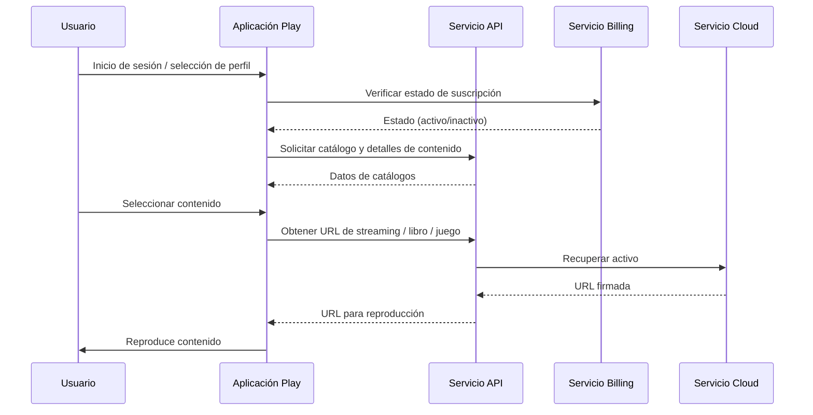
```mermaid
sequenceDiagram
	participant User as Usuario
	participant PlayApp as Aplicación Play
	participant API as Servicio API
	participant Billing as Servicio Billing
	participant Cloud as Servicio Cloud
	User->>PlayApp: Inicio de sesión / selección de perfil
	PlayApp->>Billing: Verificar estado de suscripción
	Billing-->>PlayApp: Estado (activo/inactivo)
	PlayApp->>API: Solicitar catálogo y detalles de contenido
	API-->>PlayApp: Datos de catálogos
	User->>PlayApp: Seleccionar contenido
	PlayApp->>API: Obtener URL de streaming / libro / juego
	API->>Cloud: Recuperar activo
	Cloud-->>API: URL firmada
	API-->>PlayApp: URL para reproducción
	PlayApp->>User: Reproduce contenido
```

> **Figura 1.** Diagrama de arquitectura

## Modelo de despliegue

El servicio Play se despliega como una combinación de aplicaciones web y móviles:

- **Web:** el código Next JS se compila y genera artefactos estáticos que se distribuyen en una red de entrega de contenidos (CDN). La capa de servidor (Next JS API Routes) se despliega en contenedores o funciones serverless.
- **Móvil:** la aplicación se empaqueta usando frameworks nativos o híbridos (p. ej., React Native). Se publica en tiendas de aplicaciones siguiendo ciclos de release coordinados.
- **Televisión/Consolas:** se desarrollan aplicaciones específicas utilizando SDKs de las plataformas de TV. Estas aplicaciones consumen los mismos endpoints del API.
- **CI/CD:** pipelines automatizados ejecutan pruebas de interfaz, linters y emulan dispositivos para validar la experiencia. Las variables de configuración (URLs de API, claves de reproductor, etc.) se gestionan mediante archivos de entorno y servicios de secretos.

## Monitoreo y observabilidad

Para controlar el rendimiento y la estabilidad de las aplicaciones se monitoriza:

- **Métricas de front‑end:** tiempos de carga de página, latencia de reproducción inicial, tasa de reproducción interrumpida y consumo de ancho de banda.
- **Métricas de back‑end:** tiempo de respuesta de los endpoints de la aplicación Play, utilización de cachés y tasas de error.
- **Telemetría de usuario:** eventos de uso (inicio de sesión, reproducción, pausas) se recogen de forma anonimizada para análisis. Esta telemetría ayuda a mejorar la experiencia pero se gestiona de acuerdo con las normativas de privacidad infantil.
- **Logs y trazas:** los logs de la aplicación se agregan y permiten detectar fallos de renderizado, excepciones y problemas de integración con el API.
- **Alertas:** se generan alertas por caídas de disponibilidad, altos tiempos de inicio de reproducción y errores en el flujo de suscripción.

## Seguridad y accesos

El servicio Play debe proteger la identidad de los menores y la integridad del contenido:

- **Autenticación:** utiliza tokens generados por el servicio API para validar sesiones. Los tokens tienen expiraciones cortas y se renuevan con mecanismos silenciosos.
- **Control parental:** se implementa un “parent gate” que exige un PIN u otro mecanismo de verificación para acceder a funciones administrativas o desbloquear contenido sensible.
- **Cifrado:** las conexiones se realizan mediante HTTPS/TLS. El reproductor de vídeo utiliza cifrado de extremo a extremo y DRM para evitar descargas no autorizadas.
- **Protección de datos:** se minimiza el almacenamiento local y se anonimiza la telemetría. Los datos de perfiles de niños no se comparten con terceros.

## Continuidad operativa

Para asegurar la disponibilidad de las aplicaciones:

- **CDN y escalado:** los artefactos estáticos se replican en una CDN global para reducir la latencia. El servicio de backend escala automáticamente según la demanda.
- **Modo offline:** en dispositivos móviles se permite descargar capítulos seleccionados. El progreso se sincroniza cuando vuelve la conexión.
- **Supervisión de tiendas:** se monitoriza el estado de las aplicaciones en las tiendas para detectar rápidamente fallos de distribución o de aprobación.
- **Plan de contingencia:** se establecen procedimientos para retirar versiones defectuosas, realizar rollbacks y comunicar a los usuarios actualizaciones críticas.

## Dependencias y comunicación

Las interacciones principales del servicio Play son:

- **Servicio API:** para obtener catálogos, metadatos, URL de reproducción y enviar eventos de estado.
- **Servicio Billing:** para verificar suscripciones antes de reproducir contenido premium. El flujo de pago se deriva al servicio Billing.
- **Servicio Cloud:** para descargar archivos de vídeo, audio, libros y juegos. La entrega se hace mediante URLs firmadas y temporales.
- **Servicio Satellite:** para sincronizar el estado de “seguir viendo” y favoritos cuando el usuario se mueve entre dispositivos.

El diseño modular de estas comunicaciones facilita la actualización independiente de cada servicio sin afectar la experiencia de usuario.

***

\newpage

# 🈸 Servicio Connect (Conecta)

## Introducción y propósito

El servicio Connect, también denominado Conecta, es el componente encargado de autenticar a los usuarios que acceden a EDYE/HITN Digital a través de distribuidores externos (por ejemplo, proveedores de televisión de pago). Este documento ofrece una descripción técnica de su infraestructura y de los procedimientos operativos para los equipos de DevOps, SRE, Operaciones y Seguridad.

## Descripción funcional

Las funciones clave del servicio son:

- **Integración con proveedores externos:** implementa flujos de autenticación (TV Everywhere) que permiten a los suscriptores de distribuidores identificarse con sus credenciales externas y obtener permisos sobre el contenido.
- **Gestión de sesiones:** una vez completada la autenticación con el proveedor, emite tokens internos que se utilizan para acceder a los demás servicios. Estos tokens incluyen información sobre los derechos de visualización, la expiración y el identificador de usuario.
- **Sincronización de perfiles:** crea o actualiza perfiles locales (en el servicio API) basados en la información devuelta por el distribuidor y los vincula al historial de visualización existente.
- **Compatibilidad multiplataforma:** el servicio es utilizado por aplicaciones web, móviles y de TV para redirigir al usuario hacia el flujo de autenticación del proveedor y recuperar el resultado de forma transparente.

## Arquitectura y componentes

El servicio se implementa como un microservicio orientado a integraciones externas. Los componentes incluyen:

| Componente               | Descripción                                                                                                                                                                                                         |
| ------------------------ | ------------------------------------------------------------------------------------------------------------------------------------------------------------------------------------------------------------------- |
| Gateway de autenticación | Servicio API que expone endpoints para iniciar y completar el flujo de autenticación. Encapsula la lógica específica de cada distribuidor (redirecciones, parámetros y manejo de respuestas).                       |
| Módulos de proveedor     | Cada proveedor de televisión se gestiona mediante un módulo que implementa el protocolo de autenticación acordado (OAuth 2.0, SAML u otros). Los módulos encapsulan los endpoints, scopes y parámetros específicos. |
| Base de datos de sesión  | Almacena tokens temporales y estados intermedios. Se utiliza una base de datos rápida (p. ej., Redis o MySQL) para realizar la correlación entre la solicitud inicial y la respuesta del proveedor.                 |
| Integración con API      | Una vez autenticado el usuario, el servicio comunica al API la creación o actualización del perfil, incluyendo los permisos obtenidos.                                                                              |
| Frontend de TV           | Algunos flujos se implementan como páginas web adaptadas a dispositivos de TV, desarrolladas en Laravel/Next JS para compatibilidad con navegadores embebidos.                                                      |

### Diagrama de secuencia

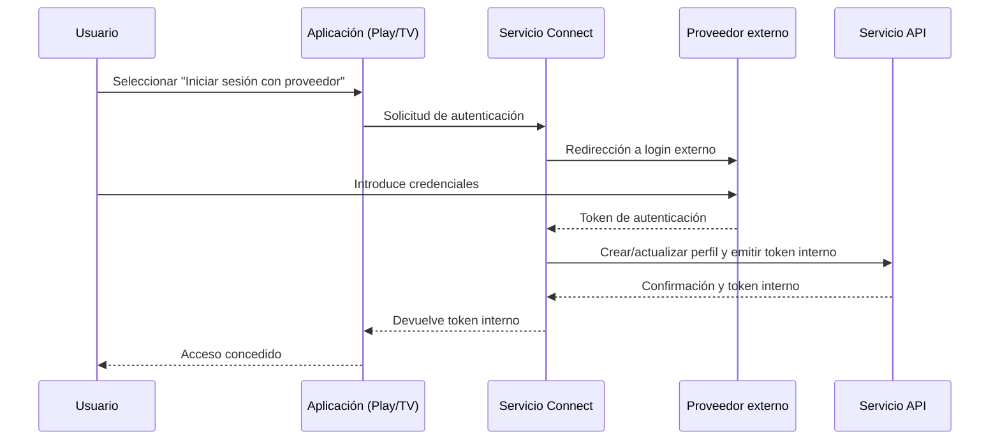
```mermaid
sequenceDiagram
	participant User as Usuario
	participant App as Aplicación (Play/TV)
	participant Connect as Servicio Connect
	participant Provider as Proveedor externo
	participant API as Servicio API
	User->>App: Seleccionar "Iniciar sesión con proveedor"
	App->>Connect: Solicitud de autenticación
	Connect->>Provider: Redirección a login externo
	User->>Provider: Introduce credenciales
	Provider-->>Connect: Token de autenticación
	Connect->>API: Crear/actualizar perfil y emitir token interno
	API-->>Connect: Confirmación y token interno
	Connect-->>App: Devuelve token interno
	App-->>User: Acceso concedido
```

> **Figura 1.** Diagrama de arquitectura

## Modelo de despliegue

El servicio se despliega como microservicio independiente con las siguientes prácticas:

- **Repositorios y versionado:** el código fuente se separa por módulos de proveedor, permitiendo actualizaciones sin afectar a los demás. Las versiones se etiquetan y se mantienen contratos de integración con cada distribuidor.
- **Pipelines CI/CD:** al agregar un nuevo proveedor o actualizar un módulo, se ejecutan pruebas de integración que simulan los flujos de autenticación. La imagen de contenedor resultante se despliega en entornos de desarrollo, staging y producción.
- **Configuración dinámica:** los endpoints y parámetros de cada proveedor se gestionan mediante archivos de configuración o bases de datos que se recargan sin necesidad de desplegar código.
- **Escalado:** se configuran réplicas para absorber picos cuando hay eventos en vivo que generan autenticaciones masivas.

## Monitoreo y observabilidad

Para garantizar fiabilidad y detectar problemas con proveedores externos se supervisa:

- **Tasa de autenticación:** número de flujos iniciados, completados y fallidos por proveedor.
- **Tiempo de autenticación:** tiempo medio que transcurre desde que se inicia el flujo hasta que se entrega el token interno. Un aumento puede indicar problemas con el proveedor.
- **Errores específicos:** registro de códigos de error devueltos por los proveedores para análisis y comunicación con ellos.
- **Logs de auditoría:** se registran las solicitudes entrantes y salientes, asegurando que no se almacenen credenciales. Estos logs permiten rastrear incidencias de usuarios y detectar comportamientos anómalos.
- **Alertas:** se configuran para fallos de autenticación masivos o indisponibilidad de algún proveedor.

## Seguridad y accesos

El servicio maneja tokens y credenciales sensibles, por lo que aplica medidas estrictas:

- **Protección de tokens:** los tokens de proveedor se mantienen en memoria el tiempo mínimo necesario y se cifran antes de almacenarse temporalmente.
- **Cifrado de comunicaciones:** todas las interacciones con proveedores y con el API se realizan mediante HTTPS/TLS.
- **Validación de respuestas:** se valida la firma y la integridad de los tokens devueltos por los proveedores. Solo se aceptan respuestas provenientes de dominios autorizados.
- **Política de mínimos privilegios:** los tokens internos generados contienen únicamente la información necesaria para identificar al usuario y sus permisos. Caducan rápidamente para limitar el riesgo de uso indebido.
- **Cumplimiento:** se cumplen requisitos de privacidad infantil y se limita la cantidad de datos personales recibidos desde los distribuidores.

## Continuidad operativa

La resiliencia del servicio se asegura mediante:

- **Alta disponibilidad:** se ejecutan múltiples instancias en distintas zonas. Se utilizan health checks para retirar instancias degradadas.
- **Failover de proveedores:** en caso de que un proveedor externo esté fuera de servicio, se ofrece un mensaje de error claro al usuario y se informa al equipo de soporte para activar canales alternativos si existen.
- **Backups de configuración:** las configuraciones de cada proveedor (endpoints, claves) se respaldan y se gestionan a través de sistemas de configuración centralizados.
- **Pruebas periódicas:** se ejecutan tests automáticos que simulan autenticaciones para detectar cambios inesperados en los flujos de los distribuidores.

## Dependencias y comunicación

El servicio Connect interactúa con:

- **Proveedores externos:** utiliza protocolos estándar (OAuth 2.0, SAML) para redirigir a los usuarios e intercambiar tokens de autenticación. Las configuraciones específicas se mantienen actualizadas para cada proveedor.
- **Servicio API:** una vez obtenido el token del proveedor, se comunica con el API para crear o actualizar perfiles y obtener un token interno. Esta comunicación está autenticada y se traza para auditoría.
- **Servicio Billing:** consulta el estado de la suscripción de los usuarios autenticados a través de distribuidores para verificar que su plan está activo antes de otorgar acceso.
- **Servicio Play:** envía de vuelta el token interno a la aplicación, permitiendo iniciar la sesión en la interfaz de usuario.

Las comunicaciones usan contratos de API internos y se supervisan para garantizar el cumplimiento de los acuerdos con los distribuidores.

***

\newpage

# 🈸 Servicio Satellite

## 1. Introducción y propósito

El servicio Satellite proporciona funcionalidades de persistencia y sincronización del estado de consumo de los usuarios en el ecosistema EDYE/HITN Digital. Está orientado a almacenar y compartir datos como la posición de reproducción (“seguir viendo”), listas de favoritos y preferencias personalizadas entre diferentes dispositivos. Este documento detalla su diseño técnico y su operación.

## 2. Descripción funcional

El servicio cumple las siguientes funciones:

- **Persistencia de progreso:** almacena la posición de reproducción de cada usuario en cada título, de manera que al cambiar de dispositivo pueda retomar el contenido donde lo dejó.
- **Gestión de favoritos y listas:** permite a los usuarios marcar programas, libros o juegos como favoritos y agruparlos en listas personalizadas. Esta información se sincroniza con el API principal.
- **Sincronización multi‑dispositivo:** centraliza la información para que la aplicación Play pueda recuperar el progreso y los favoritos independientemente de dónde se haya generado.
- **Interfaz de consulta:** expone endpoints para que los clientes consulten y actualicen su estado de consumo. Estos endpoints están protegidos mediante autenticación y autorizan únicamente al usuario propietario.

## 3. Arquitectura y componentes

| Componente                    | Descripción                                                                                                                                                                                                                                                                                                                                                       |
| ----------------------------- | ----------------------------------------------------------------------------------------------------------------------------------------------------------------------------------------------------------------------------------------------------------------------------------------------------------------------------------------------------------------- |
| Servidor Node.js/NextJS       | El núcleo del servicio está implementado con Node.js y NextJS, aprovechando su naturaleza asíncrona para gestionar numerosas peticiones de actualización de estado.                                                                                                                                                                                               |
| Base de datos NoSQL (MongoDB) | Se utiliza una base de datos orientada a documentos para almacenar estructuras flexibles de progreso y listas. MongoDB ofrece esquema dinámico y escalabilidad horizontal, lo que facilita el almacenamiento de datos semiestructurados como listas de reproducción y favoritos. Laravel y otros marcos soportan nativamente MongoDB mediante paquetes oficiales. |
| Servicio de sincronización    | Subsistema que escucha eventos del API y de la aplicación Play para actualizar los registros. Asegura consistencia eventual entre cachés locales y la base de datos central.                                                                                                                                                                                      |
| Cola de mensajes              | Gestiona eventos asincrónicos (p. ej., fin de reproducción, marcado de favorito) para desacoplar a la aplicación cliente del proceso de persistencia.                                                                                                                                                                                                             |

### 3.1. Diagrama de arquitectura

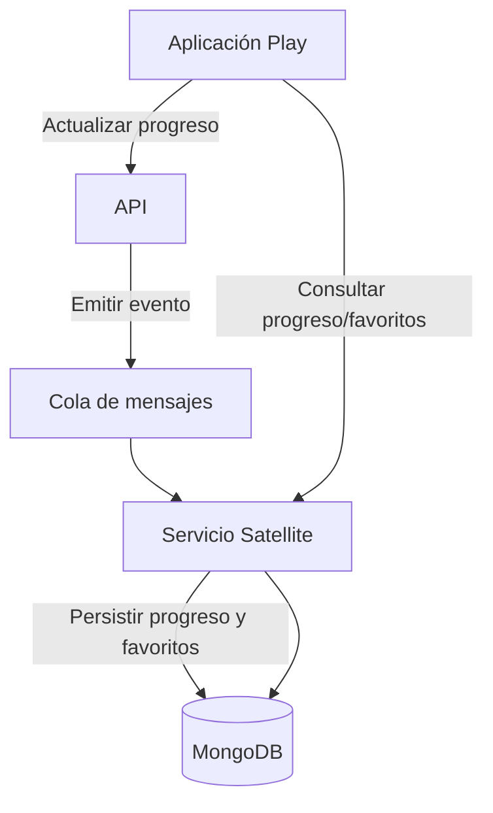
```mermaid
flowchart TD
	Client[Aplicación Play] -- Actualizar progreso --> API
	API -- Emitir evento --> Queue[Cola de mensajes]
	Queue --> Satellite[Servicio Satellite]
	Satellite -- Persistir progreso y favoritos --> DB[(MongoDB)]
	Client -- Consultar progreso/favoritos --> Satellite
	Satellite --> DB
```

> **Figura 1.** Diagrama de arquitectura

## 4. Modelo de despliegue

El servicio se construye y se distribuye mediante procesos de CI/CD:

- **Repositorio y gestión de dependencias:** el código fuente (Node.js/NextJS) se mantiene en un repositorio Git. Las dependencias se controlan mediante gestores (npm/yarn) y se actualizan con revisiones periódicas.
- **Pruebas:** se ejecutan pruebas unitarias y de integración que validan la correcta actualización y consulta de datos en MongoDB, así como la gestión de eventos.
- **Contenerización y despliegue:** se empaqueta la aplicación en contenedores. El despliegue se realiza en un clúster de microservicios con escalado horizontal automático. Las variables de configuración (URLs del API, conexión a MongoDB) se proporcionan a través de servicios de configuración.
- **Colas de eventos:** el servicio se suscribe a colas de mensajes configuradas en un sistema de mensajería (por ejemplo, RabbitMQ, Kafka) que se despliega como servicio compartido.

## 5. Monitoreo y observabilidad

El correcto funcionamiento de Satellite se supervisa mediante:

- **Métricas de sincronización:** número de eventos procesados por minuto, latencia de procesamiento de eventos y tasa de fallos en la actualización de MongoDB.
- **Uso de recursos:** monitoreo de CPU, memoria y conexiones abiertas a la base de datos. Se ajustan límites en el orquestador para evitar saturación.
- **Logs:** se registran acciones de actualización, conflictos y errores de deserialización. Estos logs se almacenan centralmente para auditoría y soporte.
- **Alertas:** se configuran umbrales para detectar colas de mensajes en crecimiento, errores de base de datos y tiempos de sincronización altos.

## 6. Seguridad y accesos

El servicio maneja datos de usuario relacionados con su consumo y preferencias. Se aplican las siguientes medidas:

- **Autenticación:** cada solicitud debe incluir un token válido emitido por el servicio API. Satellite verifica el token antes de procesar la actualización o consulta.
- **Autorización:** se garantiza que un usuario solo pueda acceder y modificar su propio progreso y listas. Los identificadores de usuario se extraen del token y se comprueban con los datos almacenados.
- **Encriptación:** las comunicaciones entre Satellite, el API y la base de datos viajan a través de conexiones cifradas. Los datos en la base de datos se cifran en reposo.
- **Política de retención:** los datos de progreso se conservan por un periodo definido y se purgan periódicamente para cumplir con normativas de protección de datos.

## 7. Continuidad operativa

Para garantizar una experiencia fluida en todas las plataformas:

- **Escalado horizontal:** se despliegan varias réplicas del servicio y la base de datos MongoDB se configura como un clúster con réplica para alta disponibilidad.
- **Persistencia de colas:** el sistema de mensajería conserva los eventos hasta que son procesados correctamente. Esto asegura que no se pierdan actualizaciones durante incidentes.
- **Backups:** se realizan copias de seguridad regulares de la base de datos. Se documentan procedimientos para restaurar datos de progreso en caso de pérdida.
- **Pruebas de resistencia:** se realizan pruebas de carga y de estrés para simular picos de eventos y validar que el servicio mantiene la latencia aceptable.

## 8. Dependencias y comunicación

El servicio Satellite se integra con:

- **Servicio API:** recibe eventos de actualización y envía solicitudes para validar la identidad del usuario. También expone endpoints a los que el API delega la recuperación de progreso y favoritos.
- **Servicio Play:** los clientes consumen directamente los endpoints de Satellite para recuperar su progreso. También envían eventos de actualización que se enrutan a través del API.
- **Servicio de colas:** se apoya en una cola de mensajería para desacoplar la generación de eventos de su procesamiento, permitiendo manejar gran volumen de actualizaciones.
- **Servicio Billing:** no interactúa directamente pero se apoya en la validación de suscripción del API para permitir el almacenamiento de progresos solo a usuarios con planes activos.

La comunicación entre servicios se diseña para ser idempotente y se asegura la consistencia eventual de los datos en todo el ecosistema.

***

\newpage

# 📃 Estructura Devops

## 1. Introducción y Contexto

Este documento forma parte del proyecto de documentación tecnológica de Edye (HITN Digital), desarrollado a partir de julio de 2025 con el objetivo de consolidar los procesos DevOps, seguridad y monitoreo del ecosistema digital. La estructura DevOps busca estandarizar prácticas de automatización, despliegue continuo y control de calidad del software en los entornos de desarrollo, staging y producción.

---

## 2. Descripción General del Proceso DevOps

El componente DevOps integra los procesos de desarrollo, integración continua, entrega continua, operaciones y mejora continua en la organización. Su objetivo es automatizar flujos, reducir tiempos de entrega y garantizar la calidad del software.  
Se apoya en herramientas como:

- **GitHub** (repositorios, CI/CD)
- **Swagger** (documentación de APIs)
- **Monday** (gestión de tareas)
- **Grafana** (monitoreo)
- **Qualys** (seguridad)
- **Postman** (pruebas de endpoints)

---

## 3. Ciclo DevOps (Pipeline General)

El ciclo DevOps implementado en Edye sigue el siguiente flujo principal:


> **Figura 1.** _Flujo general del proceso DevOps_

Cada fase está soportada por herramientas específicas y responsables asignados:

| Fase                     | Descripción                                      | Herramientas                      |
| ------------------------ | ------------------------------------------------ | --------------------------------- |
| **Planificación**        | Gestión de backlog, milestones y KPIs.           | Monday                            |
| **Desarrollo**           | Implementación de código y pruebas unitarias.    | GitHub, Swagger, Postman          |
| **Integración Continua** | Compilación, validación y análisis de seguridad. | GitHub Actions, Snyk, SonarQube   |
| **Entrega Continua**     | Despliegue automatizado.                         | GitHub Actions                    |
| **Operaciones**          | Monitoreo, alertas y gestión de incidentes.      | monitor.edye.com, status.edye.com |

## 4. Arquitectura Técnica del Ciclo DevOps de EDYE


> **Figura 2.** _Arquitectura DevOps y Flujo CI/CD del Ecosistema EDYE_

---

## 5. Estructura Documental

La documentación DevOps se organiza jerárquicamente para asegurar trazabilidad y control de versiones.

| Categoría                | Documentos                                                                                          |
| ------------------------ | --------------------------------------------------------------------------------------------------- |
| **Planificación**        | https://docs.google.com/document/d/1e1P99kDmgtiPRaAMtj3oYz1zFkKUvrec49buXHp72D0/edit?usp=drive_link |
| **Desarrollo**           | https://docs.google.com/document/d/1TlZTob4QFa2sHtZ76Ku2NXcrI3V5mWGbYvv_zTQNmgk/edit?tab=t.0        |
| **Integración Continua** | https://docs.google.com/document/d/1e9Nkp1mI-z8yjHeEcgsXJW6vHIu2aFj1N4mMSdSvYKY/edit?tab=t.0        |
| **Entrega Continua**     | https://docs.google.com/document/d/19QMMCA3rwXQ2e18Q9jByyy2XnHC5zmNe8XulaiZDhlQ/edit?tab=t.0        |
| **Operaciones**          | https://docs.google.com/document/d/1txgJkjhwSdG694OBCQZhHs5iWSVDR6SCr74ZyZi66t0/edit?tab=t.0        |

---

## 6. Seguridad y Monitoreo

La seguridad forma parte integral del pipeline DevOps y se implementa mediante:

- **Qualys** para escaneo y cumplimiento.
- **Grafana / Prometheus** para monitoreo de infraestructura y APIs.
- **Loki** para centralización de logs.
- **Alertas automáticas** configuradas sobre métricas críticas.

---

## 7. Roles y Responsabilidades

| Rol                     | Responsabilidades                                      | Herramientas Asociadas   | Interacción Principal |
| ----------------------- | ------------------------------------------------------ | ------------------------ | --------------------- |
| **DevOps Engineer**     | Mantener pipelines CI/CD, infraestructura y monitoreo. | GitHub Actions, Grafana  | Backend, QA           |
| **FullStack Developer** | Implementar APIs y mantener documentación.             | GitHub, Swagger, Postman | DevOps, QA            |
| **QA Engineer**         | Ejecutar pruebas automatizadas e integraciones.        | Postman, Jenkins         | Desarrollo            |
| **Project Manager**     | Coordinar entregas y comunicación interna.             | Monday                   | Todas las áreas       |

---

## 8. Gobernanza Documental

El flujo de actualización sigue:

**Solicitud → Revisión → Ajuste → Aprobación → Actualización (Drive/Miro)**

Cada documento tiene:

- **Responsable del cambio**
- **Aprobador técnico**
- **Administrador de repositorio**

---

## 9. Mejores Prácticas

- Mantener pipelines automatizados y validados.
- Aplicar control de ramas y revisiones de código.
- Actualizar documentación técnica en cada versión.
- Ejecutar postmortems tras incidentes.
- Usar Monday como fuente única de seguimiento.

***

\newpage

# 📃 Estrategia DevOps

## 1. Objetivo y alcance

Definir la estrategia DevOps revisada de la organización, consolidando la automatización, seguridad y monitoreo continuo en los entornos de desarrollo, integración, pruebas y producción.

Esta estrategia aplica a todas las plataformas soportadas por:

- GitHub
- Swagger
- Monday
- Grafana
- Qualys

---

## 2. Principios y Políticas DevOps

### **Principios básicos**

- Automatización extremo a extremo
- Colaboración constante entre equipos
- Mejora continua
- Seguridad integrada (DevSecOps)
- Monitoreo constante

### **Política de Versionamiento**

Todo código debe estar versionado en GitHub bajo un esquema de ramas controlado:

- `main`
- `stage`
- `production`
- `feature/*`

### **Política de Despliegue**

Los despliegues deben realizarse exclusivamente mediante **pipelines validados y automatizados**, con control de calidad previo.

---

## 3. Gobernanza y Colaboración

Cada región (_Latam, Europa, Norteamérica_) cuenta con un **DevOps Lead** responsable de coordinar entregas, validaciones y despliegues controlados.

La gestión de tareas se realiza en **Monday**, con:

- Reportes semanales automatizados
- Control de versiones en Drive/Miro
- Flujo formal de documentación:

Solicitud → Revisión → Ajuste → Aprobación → Publicación.

---

## 4. Herramientas Principales

| Herramienta                     | Propósito                                | Integración                       |
| ------------------------------- | ---------------------------------------- | --------------------------------- |
| **GitHub / GitHub Actions**     | Repositorio y CI/CD automatizado         | Integración con Swagger           |
| **Swagger / Postman**           | Documentación y validación de endpoints  | QA automatizado                   |
| **Monday**                      | Gestión de backlog e incidentes          | Fuente de seguimiento y control   |
| **Grafana / Prometheus / Loki** | Monitoreo y alertas                      | Integración por correo            |
| **Qualys (VMDR/WAS)**           | Escaneo de vulnerabilidades y compliance | Integración continua en monitoreo |

---

## 5. Seguridad y Monitoreo

La seguridad forma parte integral del pipeline DevOps (**DevSecOps**), aplicándose controles automáticos de vulnerabilidades mediante **Qualys**.

El monitoreo se realiza con **Grafana**, consolidando métricas de:

- Infraestructura
- APIs
- Servicios críticos

Las alertas se envían por correo y se revisan diariamente en el panel de incidentes.

***

\newpage

# 📃 Planificación DevOps

## 1. Introducción

El presente documento forma parte del conjunto de procedimientos técnicos que estructuran el ciclo DevOps del ecosistema **Edye / HITN Digital**.  
Su propósito es definir el marco metodológico y operativo para la fase de **planificación**, asegurando la correcta gestión de tareas, recursos y prioridades dentro de los proyectos tecnológicos.

La planificación DevOps constituye el punto de partida del ciclo de desarrollo continuo, permitiendo:

- Alinear las necesidades del negocio con los objetivos técnicos.
- Garantizar la trazabilidad de las tareas.
- Optimizar la colaboración entre desarrollo, QA, infraestructura y operaciones.

Este procedimiento se integra con los procesos de:

- Desarrollo
- Integración Continua (CI)
- Entrega Continua (CD)
- Operaciones
- Mejora Continua

Formando un flujo integral orientado a la eficiencia, automatización y calidad del software.

---

## 2. Alcance

Este procedimiento aplica a **todos los proyectos, productos y servicios digitales** desarrollados dentro del ecosistema Edye que requieran planificación técnica bajo el modelo DevOps.

Establece lineamientos sobre:

- Organización y priorización de tareas técnicas.
- Roles y responsabilidades del equipo DevOps.
- Uso de herramientas corporativas (Monday, GitHub, Grafana).
- Seguimiento y validación de entregas planificadas.

El alcance va desde la **revisión del backlog** hasta la **validación final**, enlazándose con las fases de:

- Desarrollo
- Integración
- Despliegue
- Operaciones
- Evaluación Postmortem

---

## 3. Procedimiento

### 3.1. Descripción general

El proceso de planificación DevOps define la secuencia de actividades necesarias para:

- Organizar
- Priorizar
- Gestionar

las tareas técnicas dentro del ciclo de desarrollo continuo.

El flujo abarca:

1. Revisión
2. Priorización
3. Asignación
4. Ejecución
5. Validación

Todas las actividades se gestionan mediante:

- **Monday**: backlog, dependencias, fechas.
- **GitHub**: control de versiones, validación técnica, PRs.

---

### 3.2. Diagrama del flujo de planificación DevOps


> **Figura 1.** Diagrama del flujo del proceso de planificación DevOps.

---

### 3.3. Detalle por fase o actividad

| **Fase**                       | **Entrada**                  | **Actividad**                                       | **Herramienta**                 | **Salida**                   |
| ------------------------------ | ---------------------------- | --------------------------------------------------- | ------------------------------- | ---------------------------- |
| **1. Revisión de backlog**     | Tareas en Monday             | Revisión y priorización técnica                     | Monday                          | Backlog validado             |
| **2. Planificación de tareas** | Backlog aprobado             | Asignar tareas, fechas y dependencias               | Monday                          | Plan de desarrollo de tareas |
| **3. Desarrollo**              | Plan de desarrollo de tareas | Programación de componentes y pruebas unitarias     | GitHub / Postman / Swagger      | Código validado              |
| **4. Integración continua**    | Pull Requests                | Validación y compilación automatizada               | GitHub Actions                  | Build validada               |
| **5. Despliegue**              | Código aprobado              | Ejecución de pipeline CI/CD y despliegue en Staging | GitHub Actions                  | Release desplegada           |
| **6. Evaluación**              | Métricas y reportes          | Análisis de desempeño y mejoras                     | Grafana / Evaluaciones manuales | Informe de retrospectiva     |

---

## 4. Herramientas

| Categoría   | Herramienta | Uso                                                          |
| ----------- | ----------- | ------------------------------------------------------------ |
| **Gestión** | Monday      | Gestión de prioridades, releases, tareas y flujos de trabajo |

***

\newpage

# 📃 Desarrollo DevOps

## 1. Introducción

Definir los lineamientos, actividades, roles y herramientas aplicables al proceso de desarrollo de software dentro del ecosistema tecnológico de Edye (HITN Digital).

Este procedimiento tiene como propósito garantizar la calidad, coherencia y trazabilidad del código fuente previo a su integración en los entornos de pruebas y despliegue. Además, establece los principios técnicos y operativos para un desarrollo ágil, seguro y alineado con las prácticas DevOps corporativas.

---

## 2. Alcance

El presente procedimiento aplica a todas las actividades de implementación, documentación, validación y control de versiones del código fuente alojado en los repositorios oficiales de Edye.

Cubre el ciclo completo desde la asignación de una tarea hasta la aprobación del código para su integración en los entornos de staging o producción, garantizando trazabilidad entre requerimientos, commits, pruebas y entregas.

Este procedimiento es de aplicación para los equipos de desarrollo backend, frontend y QA, así como para los perfiles DevOps Engineer y Project Manager responsables del control de calidad y validación de entregables.

---

## 3. Procedimiento

El proceso de desarrollo DevOps en Edye define las actividades y lineamientos técnicos para la implementación, control de versiones, pruebas y documentación del código fuente dentro del ecosistema tecnológico de HITN Digital.

El flujo integra las fases de **codificación**, **validación** y **revisión cruzada** antes de su integración a los entornos de staging y producción, asegurando trazabilidad y calidad del software entregado.

---

## 3.1. Entorno de desarrollo

El entorno de desarrollo de Edye se sustenta en una arquitectura tecnológica moderna basada en servicios y aplicaciones construidas principalmente con **Node.js**, **Next.js** y **Laravel**.

La plataforma opera bajo un modelo de bases de datos híbridas:

- **MySQL** → motor relacional para procesos estructurados.
- **MongoDB** → base de datos NoSQL para componentes que requieren flexibilidad y escalabilidad.

### Entornos principales

- **Local**: desarrollo individual de los programadores.
- **Staging**: entorno de pruebas integradas y QA.
- **Producción**: despliegue estable validado.

### Control de versiones

El control de versiones se gestiona en **GitHub**, utilizando las ramas principales:

- `main`
- `production`
- `features/*`
- `staging`

---

## 3.2. Entradas y salidas del proceso

| Tipo         | Descripción                                                                                  |
| ------------ | -------------------------------------------------------------------------------------------- |
| **Entradas** | Tareas asignadas en Monday, requerimientos funcionales/técnicos, reportes de bugs o mejoras. |
| **Salidas**  | Código documentado, probado y aprobado en GitHub; Swagger actualizado; Postman validado.     |

> _Nota:_ Para algunos repositorios, las entregas Swagger/Postman no son necesarias.

---

## 3.3. Diagrama del flujo de desarrollo DevOps

El siguiente diagrama representa de forma visual el **flujo general de la fase de desarrollo dentro del ciclo DevOps** del ecosistema Edye.


> **Figura 1.** _Diagrama del flujo del proceso de desarrollo DevOps._

---

## 3.4. Detalle por fase o actividad

- **Asignación y preparación:** Recepción de tarea → creación de branch desde `production` usando `feature/<nombre>` o `<nombre>`.
- **Codificación:** Desarrollo del componente asignado.
- **Testing:** Creación de unit tests con Jest y validación con Postman collections.  
  Documentación Swagger se genera automáticamente.
- **Revisión técnica:** Pull Request (PR), revisión cruzada, validaciones GitHub Actions.
- **Aprobación y merge:** Validación funcional, merge controlado, versionado semántico, actualización del changelog.

---

## 3.5. Repositorios GitHub

Los repositorios se encuentran en GitHub, y constituyen la fuente única de verdad del código y la documentación técnica del ecosistema EDYE. Cada repositorio mantiene sus ramas, pipelines CI/CD y archivos de documentación asociados (README.md, Swagger, Postman).

| Repositorio             | Propósito                                              | Ramas                       | Stack                       |
| ----------------------- | ------------------------------------------------------ | --------------------------- | --------------------------- |
| **EDYE-CONNECT**        | Middleware SSO para operadores, apps y partners.       | Main / Staging / Production | PHP - Laravel - MySQL       |
| **EDYE-BILLING**        | Pagos, promociones y suscripciones.                    | Main / Staging / Production | PHP - Laravel - MySQL       |
| **EDYE-API-STANDALONE** | Backend principal con endpoints REST.                  | Main / Staging / Production | PHP - Laravel - MySQL       |
| **EDYE-CONECTA**        | Conector SSO entre Edye y operadores.                  | Main / Staging / Production | PHP - Laravel - MySQL       |
| **EDYE-ADMIN**          | CMS central para shows, metadata, imágenes y partners. | Main / Staging / Production | PHP - Laravel - MySQL       |
| **EDYE-PLAY**           | Plataforma web (niños/padres).                         | Main / Staging / Production | Node.js - Next.js - MongoDB |
| **EDYE-CLOUD**          | Actividad de usuarios y almacenamiento.                | Main / Staging / Production | Node.js - MongoDB           |
| **EDYE-API-SATELITE**   | Redundancia, carga y resiliencia.                      | Main / Staging / Production | PHP - Laravel - MySQL       |

> **Nomenclatura estándar:** `edye-[módulo]`

Cada repositorio debe incluir su propio README.md con instrucciones de instalación, dependencias, ramas activas, pipelines de despliegue y contactos técnicos.

---

## 3.6. Clonar repositorios GitHub

El desarrollador debe contar con permisos y haber configurado SSH o PAT.

### Clonación mediante SSH (recomendada)

**Requisitos previos:**

- Tener clave SSH (`id_rsa` o `ed25519`)
- Agregar clave pública en GitHub:  
  **Settings → SSH and GPG keys**

**Tutorial oficial:**  
https://docs.github.com/es/authentication/connecting-to-github-with-ssh/adding-a-new-ssh-key-to-your-github-account

**Comando de clonación:**

```bash
git clone git@github.com:edye/<repositorio>.git
```

---

## 3.7. Estándares de desarrollo

El desarrollo de software en Edye sigue criterios uniformes para asegurar consistencia, mantenibilidad y calidad del código.

Los estándares incluyen:

- **Estructura modular** organizada por servicio.
- **Revisión de código obligatoria** antes de cada _merge request_.
- **Nomenclatura de ramas controlada**
  - `feature/<nombre>`
  - `<nombre>`
- **Versionado semántico**, por ejemplo: `v1.3.2`.
- **Definición correcta de endpoints RESTful**, asegurando respuestas **JSON coherentes**.
- **Cumplimiento de convenciones de estilo** y documentación de API mediante **Swagger/OpenAPI**.

---

## 4. Herramientas

| Categoría                | Herramienta   | Uso                                                                                                                                     |
| ------------------------ | ------------- | --------------------------------------------------------------------------------------------------------------------------------------- |
| **Control de versiones** | GitHub        | Repositorios, PRs, code review                                                                                                          |
| **Pruebas**              | Jest, Postman | Validación funcional e integración                                                                                                      |
| **Gestión**              | Monday        | Seguimiento de backlog y entregas. Todos los cambios deben actualizar la documentación técnica y referenciar la tarea origen en Monday. |

***

\newpage

# 🔄 Integración Continua (CI)

## 1. Introducción

Definir los lineamientos y actividades del proceso de Integración Continua (CI) dentro del ecosistema Edye / HITN Digital, asegurando la automatización de la compilación, validación y control de calidad del código fuente antes de su despliegue.

El propósito principal de este procedimiento es reducir errores humanos, aumentar la trazabilidad de los cambios y acelerar la entrega de software estable en los entornos de staging y production, utilizando herramientas corporativas de automatización, revisión y monitoreo.

De esta forma, la Integración Continua contribuye a mantener un flujo DevOps eficiente, seguro y auditable, integrando control de versiones, pruebas automatizadas y análisis de calidad en un pipeline unificado gestionado por GitHub Actions.

---

## 2. Alcance

Este procedimiento aplica a todos los repositorios alojados en GitHub pertenecientes al ecosistema Edye, incluyendo:

- EDYE-CONNECT
- EDYE-BILLING
- EDYE-API-STANDALONE
- EDYE-CONECTA
- EDYE-ADMIN
- EDYE-PLAY
- EDYE-CLOUD
- EDYE-API-SATELITE

Cada repositorio cuenta con un pipeline CI configurado en GitHub Actions, el cual se ejecuta automáticamente ante cada pull request (PR) o push hacia las ramas principales (**stage** o **production**). El alcance incluye la construcción, análisis, validación y empaquetado del código.

---

## 3. Procedimiento

El proceso de Integración Continua (CI) en el ecosistema Edye / HITN Digital automatiza la compilación, validación, pruebas y control de calidad del código fuente mediante GitHub Actions.

### 3.1. Flujo general del proceso de Integración Continua

Cada repositorio dispone de un pipeline configurado que se activa ante un **push** o **pull request** hacia las ramas `main` o `develop`.

El siguiente diagrama representa la secuencia completa del proceso CI en Edye:


> **Figura 1.** Diagrama del flujo general del proceso de Integración Continua


### 3.2. Descripción del flujo CI


#### 3.2.1 Descripción del Pipeline – CI Cloud (Node.js)

El pipeline CI Cloud implementa el proceso automatizado de validación, construcción y despliegue de la aplicación Node.js correspondiente al entorno productivo cloud-prod.edye.com. Este flujo garantiza que únicamente las versiones aprobadas en las ramas sean distribuidas en los servidores productivos de Akamai/Linode.

**1. Disparadores del Pipeline**

El workflow se ejecuta bajo dos condiciones:

**a) Push a la rama**  
Cada commit o merge realizado sobre las ramas activa automáticamente el pipeline, iniciando el proceso de despliegue.

**b) Ejecución manual (`workflow_dispatch`)**  
Permite lanzar el pipeline desde GitHub Actions sin necesidad de realizar un commit, útil para reintentos o despliegues controlados.

**2. Entorno de Ejecución**

El job principal utiliza:

- Sistema operativo: Ubuntu 22.04
- Node.js: versión 22 (configurada mediante actions/setup-node)

Este entorno garantiza compatibilidad y reproducibilidad durante la ejecución del proceso.

**3. Etapas del Pipeline**

**- Checkout del Repositorio**

El pipeline obtiene el código fuente del repositorio mediante actions/checkout, permitiendo acceder a todo el contenido vigente en la rama.

**- Configuración de Node.js**

A través de actions/setup-node se define la versión de Node.js necesaria para ejecutar las tareas del proyecto.

**- Actualización de Dependencias**

Se ejecuta un proceso de actualización de paquetes mediante el comando npm update para asegurar versiones coherentes con el entorno productivo.

```bash
npm update
```

**- Ejecución de Pruebas Automatizadas**

Se ejecuta el script de pruebas definido en el proyecto (npm run test). Si alguna prueba falla, el pipeline finaliza y se evita un despliegue defectuoso.

```bash
npm run test
```

**- Construcción del Proyecto (Build)**

Se ejecuta el comando npm run build para generar los artefactos finales del sistema (bundle, dist o equivalentes).

```bash
npm run build
```

**- Limpieza Antes del Despliegue**

Con el objetivo de reducir el peso del paquete final, se eliminan los directorios no necesarios:

- node_modules
- .git

---

**4. Despliegue en Servidor Linode 1**

**Transferencia de Archivos (SCP)**

El pipeline utiliza appleboy/scp-action para copiar todos los archivos generados hacia el directorio del servidor: **/var/www/cloud-prod.edye.com**.

La autenticación se realiza mediante variables y secretos seguros almacenados en GitHub.

**Ejecución de Scripts en el Servidor (SSH)**

Una vez copiados los archivos, se ejecutan las siguientes acciones en el servidor:

- Carga del entorno NVM y Node.js
- Instalación de dependencias del entorno productivo (npm install)
- Reinicio del proceso Node.js mediante **PM2**, asegurando que el servicio quede activo con la nueva versión.

**Despliegue en Servidor Linode 2**

Se repite exactamente el mismo proceso aplicado en el servidor 1:

- Copia de archivos mediante SCP
- Instalación de dependencias
- Reinicio del servicio mediante PM2

Esto garantiza alta disponibilidad y consistencia entre ambos nodos productivos.

**Finalización del Pipeline**

El pipeline concluye tras completar el despliegue en los dos servidores.  
La nueva versión del servicio cloud-prod.edye.com queda operativa en ambos nodos.

**Resumen del Flujo General**

- Configuración del entorno Node.js
- Actualización de dependencias
- Ejecución de pruebas automatizadas
- Construcción del proyecto
- Limpieza de archivos no necesarios
- Transferencia de archivos a los servidores
- Instalación de dependencias en servidores
- Reinicio del servicio con PM2
- Publicación final en ambos nodos productivos

---

#### 3.2.2 Descripción del Pipeline – CI Admin - Deploy (Laravel)

El pipeline “CI Admin - Deploy” automatiza el proceso de despliegue de la aplicación Laravel Admin en el entorno stage. Su función principal es notificar a un script de despliegue en el servidor cada vez que se actualiza la rama, delegando en dicho script las tareas internas de actualización del código y del entorno.

**1. Disparadores del Pipeline**

El workflow se ejecuta en dos escenarios:

**a) Push a la rama**  
Cada vez que se realiza un commit o merge hacia las ramas, GitHub Actions dispara automáticamente este pipeline de despliegue.

**b) Ejecución manual (`workflow_dispatch`)**  
El pipeline puede ejecutarse manualmente desde la pestaña “Actions” de GitHub, lo que permite relanzar el proceso sin necesidad de generar nuevos commits.

**2. Entorno de Ejecución**

El job principal del workflow se denomina **deploy** y se ejecuta sobre:

- Sistema operativo del runner: **Ubuntu 22.04**

Este runner actúa como origen de la conexión remota hacia el servidor donde está alojada la aplicación Laravel Admin.

**3. Proceso General del Pipeline**

El pipeline consta de un único paso principal, que se encarga de invocar el proceso de despliegue remoto:

**Conexión por SSH y ejecución remota**

Se utiliza la acción `appleboy/ssh-action` para conectarse al servidor mediante SSH, usando las credenciales definidas como variables y secretos en GitHub:

- Host: definido en `ADMIN_PROD_HOST`
- Usuario: definido en `ADMIN_PROD_USER`
- Contraseña: definida en `ADMIN_PROD_PASSWORD`

Una vez establecida la conexión, el runner ejecuta en el servidor un comando `curl` que realiza una petición HTTP local:

- **Método:** POST
- **URL:** `http://127.0.0.1/deploy/deploy.php`
- **Parámetros:**
  - token enviado en la URL, obtenido del secreto `ADMIN_PROD_TOKEN`
  - cuerpo JSON con el campo `ref` indicando la referencia de la rama: `"refs/heads/production"`

Este POST activa el script `deploy.php` en el propio servidor, el cual es el responsable de ejecutar internamente las acciones necesarias para actualizar la aplicación con la última versión del código de la rama (por ejemplo, obtener cambios del repositorio, actualizar dependencias, ejecutar tareas de Laravel, limpiar cachés, etc., según esté configurado en dicho script).

**4. Flujo Lógico del Despliegue**

De forma resumida, el flujo del pipeline es el siguiente:

- Se detecta un cambio en la rama o se lanza el workflow manualmente.
- GitHub Actions inicia el job **deploy** en un runner Ubuntu 22.04.
- El runner se conecta por SSH al servidor utilizando las credenciales seguras configuradas en GitHub.
- En el servidor, se ejecuta una petición HTTP local (`curl`) a `deploy.php` con:
  - un token de seguridad
  - la referencia de la rama como parámetro
- El script `deploy.php` procesa la solicitud y ejecuta el flujo de despliegue definido para la aplicación Laravel Admin.
- Finalizado el script de despliegue, la nueva versión de la aplicación queda disponible en el entorno **stage/**.

**5. Enfoque DevOps**

Este pipeline se alinea con la estrategia DevOps del ecosistema Edye al:

- Centralizar el despliegue de entornos en GitHub Actions.
- Mantener las credenciales y tokens gestionados como secretos en GitHub.
- Delegar en un script del servidor (`deploy.php`) la lógica específica del despliegue Laravel, permitiendo adaptar y extender el proceso sin modificar el pipeline.
- Facilitar relanzar despliegues de forma controlada y repetible mediante la opción manual (`workflow_dispatch`).

---

### 3.3. Políticas de ejecución y validación

- El Pull Request necesita aprobación por parte del área técnica.
- Todo Merge debe superar el pipeline CI.
- Se requiere mínimo un revisor técnico para el merge a Stage y Production.

---

### 3.4. Estructura de Archivos del Pipeline

Cada repositorio del ecosistema Edye debe contener un archivo principal del workflow de Integración Continua en la siguiente ruta: **.github/workflows/ci.yml**

Ejemplo básico de configuración  
_[Estructura de Archivos del Pipeline](https://drive.google.com/file/d/1SvEgbb7Nh5Z_eFrrlLFLRECpUTM_qHEQ/view?usp=drive_link)_

---

### 3.5. Convenciones de ramas y triggers

El control de versiones y la ejecución de pipelines CI se basan en la siguiente estructura de ramas:

| Rama           | Propósito                                | Pipeline asociado                                                       |
| -------------- | ---------------------------------------- | ----------------------------------------------------------------------- |
| **main**       | Código de producción estable.            | No aplica pipeline. <br/>SCI limitado a test y lint.                    |
| **stage**      | Entorno de staging o pruebas integradas. | Stack Node.js pipeline por rama. <br/>Stack Laravel pipeline por rama.  |
| **production** | Entorno de producción.                   | Stack Node.js pipeline por rama. <br/>SStack Laravel pipeline por rama. |
| **Satellite**  | Entorno especial (NY).                   | Stack Laravel pipeline por rama.                                        |

---

## 4. Herramientas

Las principales herramientas empleadas en la Integración Continua de Eddy son:

| Categoría                 | Herramienta    | Uso principal                                              |
| ------------------------- | -------------- | ---------------------------------------------------------- |
| Repositorios y versionado | GitHub         | Gestión de código, PR, control de ramas y workflows CI/CD. |
| Automatización de CI/CD   | GitHub Actions | Ejecución automática de pipelines y validaciones.          |

***

\newpage

# 🔄 Entrega Continua (CD)

## 1. Introducción

Definir la arquitectura técnica, configuración y políticas de acceso a los servidores que soportan los entornos de staging y production del ecosistema Edye.

---

## 2. Alcance

El presente procedimiento aplica a todos los servidores y entornos del ecosistema Edye, incluyendo los servicios:  
Admin, API, Satélite, Billing, Cloud, Play, Conecta y Conect, en sus ambientes de staging y production.

El alcance de este documento DevOps comprende únicamente las actividades relacionadas con la estabilidad, disponibilidad, seguridad y continuidad operativa de los servicios desplegados en dichos entornos.

---

## 3. Procedimiento

El proceso de Entrega Continua (CD) permite desplegar versiones estables del software en los entornos definidos mediante flujos automatizados y reproducibles.  
Los despliegues se gestionan a través de GitHub Actions y herramientas de monitoreo integradas.

---

## 3.1. Arquitectura general de entornos

La infraestructura de Edye se encuentra alojada en Linode (Akamai Cloud) y organizada en tres niveles principales:

- **Staging:** entorno intermedio para validación funcional y pruebas de QA.
- **Production:** entorno activo con servicios en operación.

**Configuración técnica general:**

- Servidor Web: Linode/Ubuntu
- Base de datos: MongoDB, MySQL
- Despliegues: automatizados mediante GitHub Actions

---

### 3.1.1. Arquitectura general de servidores y DNS

- _[**Linode servidores**](https://docs.google.com/spreadsheets/d/19VrWJu_G5nqdRHV1idEApHZ80LjAlgtPcORP6zDS-y8/edit?usp=drive_link)_
- _[**Nombres de dominio**](https://docs.google.com/spreadsheets/d/1x-BnfqmrZmFQHwP7ihllWhJsTDkXjA37w5z9jj-uCDE/edit?usp=drive_link)_

---

## 3.2. Acceso y autenticación a servidores/Bases de datos

### Acceso a servidor Linode

El acceso a los servidores del ecosistema Edye se realiza mediante los siguientes lineamientos:

- Conexión SSH segura, restringida por firewall.
- Autenticación mediante clave pública (SSH Key) sobre el puerto 22/TCP.
- Acceso limitado únicamente a roles autorizados:
  - Administradores (Admin / DevOps).

### Acceso a Bases de Datos

El ecosistema Edye opera con dos motores principales:

- **MySQL** (servicios Laravel: Admin, API, Billing, Conecta, Connect, Satélite)
- **MongoDB** (servicios Node.js: Play y Cloud)

Cada tecnología cuenta con políticas particulares:

---

### MySQL

El ecosistema Edye utiliza MySQL para servicios críticos como Admin, API, Billing, Connect y Satélite. La infraestructura se organiza por entorno de la siguiente forma:

### **Arquitectura General**

| Entorno        | Modelo                           | Descripción                                                |
| -------------- | -------------------------------- | ---------------------------------------------------------- |
| **Staging**    | Nodo único                       | Cada base vive en un único servidor.                       |
| **Producción** | Clúster HA (Alta Disponibilidad) | 1 Primary (lectura/escritura) + 2 Replicas (solo lectura). |

- **Versión:** MySQL **8.0.35**.
- **Ubicación:** Todos los clústeres residen en **Dallas**, mismo datacenter que la infraestructura Edye.

---

### **Acceso y Seguridad**

El acceso está protegido mediante una doble capa de seguridad:

#### **1) Whitelist de IPs**

Solo los servidores autorizados pueden conectarse:

- API
- Admin
- Billing
- Play
- Cloud
- Conecta / Connect
- Satélite

Cualquier IP no registrada en la whitelist es rechazada automáticamente.

#### **2) Conexión SSL obligatoria (Puerto 21611)**

Todas las conexiones MySQL deben usar:

- **Certificado CA obligatorio**
- **Conexión cifrada TLS**
- **Puerto seguro:** `21611`

Sin el certificado CA, la conexión es denegada aunque la IP esté autorizada.

---

### **Uso Principal de MySQL en Edye**

- Gestión de usuarios y autenticación (Connect / InPlayer)
- Transacciones de Billing
- Catálogo y configuración general (Admin)
- Persistencia del backend API
- Operaciones del ecosistema SSO

---

### MongoDB

MongoDB se utiliza para componentes que requieren flexibilidad y almacenamiento dinámico, especialmente en los servicios Cloud y Play.

### **Arquitectura**

La conexión a MongoDB está **totalmente restringida** a los dos servidores de Cloud:

- `cloud-prod-1.edye.com`
- `cloud-prod-2.edye.com`

Estos módulos administran:

- Actividad y consumo de usuarios
- Favoritos y progresos
- Contenidos vistos
- Perfil del usuario y preferencias

---

### **Método de Conexión**

MongoDB **no expone puertos directamente**.  
La conexión se realiza mediante:

### **MongoDB Data API (HTTPS)**

- Se invoca a través de una **URL de API** generada por MongoDB.
- Cada servidor utiliza un **API Key único**.
- La API permite operaciones CRUD restringidas y auditadas.

```text
POST https://data.mongodb-api.com/app/<app-id>/endpoint/data/v1/action/find
Headers:
  api-key: <API_KEY>
  content-type: application/json
Body:
{
  "dataSource": "<DATA_SOURCE_NAME>",
  "database": "<DATABASE_NAME>",
  "collection": "<COLLECTION_NAME>",
  "filter": {
      /* filtros opcionales */
  },
  "limit": 20
}
```

### **Seguridad**

- Cada API Key tiene permisos mínimos necesarios.
- Solo los servidores Cloud pueden ejecutar solicitudes válidas.
- Solicitudes desde IPs externas no son aceptadas.

---

## 3.3. Flujo del proceso de entrega continua


> **Figura 1.** Diagrama del flujo de Entrega Continua DevOps

**Descripción del flujo:**

### Despliegue automatizado

El pipeline ejecuta automáticamente el procedimiento de despliegue correspondiente al tipo de tecnología:x

#### Servicios Laravel (Apache)

- `git pull`
- `composer install` / optimización
- `php artisan migrate` _(solo en 1 nodo de Production)_
- Reinicio de Apache

#### Servicios Node.js (Nginx + PM2)

- Transferencia del build via SCP
- `pm2 reload`

---

### Validación Post-Deploy

Una vez desplegado en Staging, se realizan las siguientes validaciones:

- Revisión de logs iniciales
- Validación de endpoints críticos
- Comprobación de respuesta del backend/servicio

Si todas las pruebas se completan correctamente, se habilita la opción de despliegue a Producción.

---

### Aprobación manual y despliegue en Producción

El despliegue en Staging a Production requiere una **aprobación manual** por parte del equipo autorizado (DevOps / Líder Técnico).
Una vez aprobada, el sistema ejecuta en Production el mismo procedimiento automatizado aplicado en Staging, garantizando coherencia entre entornos.

---

### Monitoreo y Seguimiento

Tras desplegar en Production, se activa el monitoreo continuo:

- Logs de servidor y aplicación
- Métricas de rendimiento, uso y disponibilidad (https://monitor.edye.com)
- Alertas: errores, tiempo de respuesta, caídas

Si se detecta anomalía o degradación del servicio, el flujo avanza hacia el proceso de contingencia.

---

### Backup / Rollback

Ante errores post-despliegue:

- Restaurar versión anterior
- Usar snapshots o artefactos históricos
- Reactivar servicio en estado previo estable

Esto asegura continuidad operativa y minimiza tiempos de caída.

---

## 3.4. Métodos de despliegue según tipo de servicio (Apache vs PM2/Nginx)

El ecosistema Edye utiliza dos modelos de ejecución distintos según la tecnología del servicio.

Aunque el proceso CI/CD es común, **la forma en que el servidor actualiza y levanta cada servicio depende del stack tecnológico.**

| Tipo de Servicio           | Servidor / Proceso | Inicio del Servicio | Método de Despliegue                                           | Logs                                                          |
| -------------------------- | ------------------ | ------------------- | -------------------------------------------------------------- | ------------------------------------------------------------- |
| **Laravel**                | Apache             | Automático          | git pull + composer install + artisan migrate + restart Apache | /var/log/apache2/\* /var/www/{'app'}/storage/logs/laravel.log |
| **Node.js (Play / Cloud)** | Nginx + PM2        | PM2 (modo fork)     | build CI → scp → pm2 reload                                    | /var/log/nginx/_ ~/.pm2/logs/_                                |

---

### 3.4.1 Nginx + PM2

Los servicios Play y Cloud utilizan una arquitectura basada en **Node.js**, administrada mediante **PM2** y expuesta a Internet a través de **Nginx** como reverse proxy. Este stack se aplica exclusivamente a los servicios Node.

#### Nginx

- Última versión: https://nginx.org/
- Actúa como reverse proxy
- No ejecuta la app; solo enruta tráfico HTTPS

**Rutas de configuración:**

- `/etc/nginx/sites-enabled/play-proxy.conf`
- `/etc/nginx/sites-enabled/cloud-prod-proxy.conf`

**Certificados:**

- Certbot automático
- Renovación manual cada 75 días en balanceadores

**Comandos:**

- `sudo systemctl reload nginx` Comando que recarga la configuración del servidor Nginx sin detener el proceso ni interrumpir las conexiones activas existentes.
- `sudo systemctl restart nginx` Comando sudo systemctl restart nginx detiene completamente el servicio de Nginx y lo vuelve a iniciar desde cero, lo que implica una interrupción temporal de todas las conexiones activas y puede causar un breve período en el que tu sitio web no está disponible.

---

#### PM2

PM2 gestiona el ciclo de vida de los procesos Node.js, permitiendo reinicios controlados, monitoreo y autoinicio.

**Ubicación del código:**

- `/var/www/play`
- `/var/www/cloud-prod.edye.com`

**Versiones de Node.js:**

- Cloud → 22.19.0
- Play → 18.20.4

**Logs:**

- `~/.pm2/logs`

**PM2 autostart:**

- `pm2 startup`
- `pm2 save`

**Comandos frecuentes:**

- `pm2 start 0`
- `pm2 stop 0`
- `pm2 delete 0`
- `pm2 reload 0`

**Flujo de despliegue (Node.js):**

El pipeline no ejecuta git pull en servidores Node.js.

- CI ejecuta build + pruebas
- Build se copia via SCP
- `pm2 reload 0`

**Validación y monitoreo:**

- Healthcheck 24/7
- Alertas de degradación
- Dashboard en https://monitor.edye.com
- Status externo: https://status.edye.com

**Rollback:**

- Retroceder rama production
- Nuevo build
- Re-despliegue

---

### 3.4.2 Apache

Los servicios basados en Laravel dentro del ecosistema Edye operan sobre **Apache HTTP Server**. funcionan como aplicaciones PHP servidas directamente por Apache.

**Arquitectura:**

- Aplicaciones PHP servidas desde `/public`
- Routing gestionado vía VirtualHost

**Flujo de despliegue:**

- `git pull`
- `composer install --no-dev --optimize-autoloader`
- `php artisan migrate`
- `php artisan optimize`
- Limpieza de caches:
  - `php artisan cache:clear`
  - `php artisan config:clear`
  - `php artisan route:clear`
- `sudo systemctl restart apache2`

**Logs:**

- `/var/log/apache2/error.log`
- `/var/log/apache2/access.log`
- `/var/www/{'app'}/storage/logs/laravel.log`

**Validación y monitoreo:**

- Healthcheck activo
- Logs Apache + Laravel
- Observabilidad en Grafana

**Rollback:**

- Revertir código
- Reejecutar flujo de deploy

---

## 3.5. Procedimiento de mantenimiento y contingencia

- Actualizaciones automáticas por cada PUSH
- Limpieza de logs y temporales (Autorotate)
- Backups diarios (Akamai Cloud Storage)
- Escaneo Qualys diario
- Rollback manual ante fallas críticas

---

## 4. Herramientas

| Categoría                   | Herramienta                               | Uso principal                                                |
| --------------------------- | ----------------------------------------- | ------------------------------------------------------------ |
| Automatización y despliegue | GitHub Actions                            | Despliegue automatizado de aplicaciones y recursos           |
| Infraestructura             | Linode (Akamai Cloud), PM2, Nginx, Apache | Hosting y ejecución de servicios                             |
| Seguridad                   | Qualys                                    | Escaneo de vulnerabilidades                                  |
| Monitoreo                   | Grafana                                   | Supervisión de rendimiento                                   |
| Gestión operativa           | Monday                                    | Registro de entregas, incidencias y trazabilidad post-deploy |

***

\newpage

# 📃 Operaciones DevOps

## 1. Introducción

El propósito de este documento es establecer los **procedimientos**, **herramientas** y **responsabilidades** que aseguren la **estabilidad**, **disponibilidad**, **monitoreo continuo** y **continuidad operativa** de los servicios digitales del ecosistema **Edye / HITN Digital**.

El proceso de **Operaciones DevOps** garantiza que todos los sistemas funcionen de manera segura y con el máximo rendimiento, mediante un **monitoreo proactivo**, la **gestión oportuna de incidentes** y la ejecución de **actividades de mantenimiento preventivo** que permiten anticipar fallas y reducir interrupciones del servicio.

---

## 2. Alcance

Este procedimiento aplica a todos los componentes productivos y de soporte del ecosistema **Edye**, incluyendo:

- **Admin**
- **API**
- **Satélite**
- **Billing**
- **Cloud**
- **Play**
- **Conecta**
- **Conect**

Entornos aplicables:

- **Staging**
- **Producción**

Comprende las siguientes actividades:

- Administración y observabilidad de la infraestructura.
- Detección, análisis y resolución de incidentes.
- Monitoreo del rendimiento y seguridad.
- Planes de contingencia, respaldo y continuidad del servicio.

---

## 3. Procedimiento

El proceso de Operaciones DevOps garantiza la supervisión continua de los servicios, la detección temprana de anomalías y la respuesta ágil ante fallos o degradaciones, manteniendo la trazabilidad y comunicación entre los equipos DevOps.

---

## 3.1. Monitoreo y observabilidad

El monitoreo se ejecuta en tiempo real sobre la infraestructura y los servicios clave, recolectando métricas, logs y eventos que se visualizan en los tableros operativos corporativos.

| Categoría                                                        | Herramienta              | Función principal                                                                                                       |
| ---------------------------------------------------------------- | ------------------------ | ----------------------------------------------------------------------------------------------------------------------- |
| Seguridad y vulnerabilidades                                     | Qualys                   | Escaneo de vulnerabilidades, cumplimiento PCI-DSS y alertas críticas.                                                   |
| Métricas de usuarios. Logs y alertas. Métricas e infraestructura | https://monitor.edye.com | Seguimiento de uso, consumo de contenidos y rendimiento del frontend, con centralización de logs y alertas automáticas. |
| Métricas estatus de servicios Edyes                              | https://status.edye.com/ | Panoramio global de funcionamiento de todos los servicios Edyes.                                                        |

---

## 3.2. Procedimiento de monitoreo

- Captura de métricas en tiempo real desde servidores y aplicaciones.
- Evaluación automática de umbrales críticos (CPU > 80%, error rate > 2%).
- Registro del incidente en Monday.
- Ejecución de análisis post-evento con definición de acciones correctivas.

---

### 3.2.1. STATUS de servicios EDYE (https://status.edye.com/)

El Service Status de Edye es la plataforma pública de monitoreo externo del ecosistema Edye / HITN Digital. Proporciona una vista consolidada del estado operativo de todos los servicios y permite evaluar la disponibilidad histórica mediante indicadores precisos de uptime, facilitando la detección temprana de incidencias y la transparencia con partners y equipos internos.

Este panel muestra:

**Estado general del ecosistema**  
En la parte superior se presenta un indicador global (All systems Operational), que resume la disponibilidad actual de toda la plataforma.  
El estado varía dinámicamente entre:

- Operational (Verde)
- (Amarillo)
- (Rojo)


> **Figura 1.** _Estado general del ecosistema._

**Uptime histórico (últimos 90 días)**  
Cada servicio dispone de un gráfico de barras que representa su disponibilidad diaria durante los últimos 90 días.  
El uso de colores permite identificar rápidamente:

- Verde → disponibilidad normal
- Amarillo → degradación parcial
- Rojo → indisponibilidad total


> **Figura 2.** _Uptime histórico últimos 90 días._

**Servicios monitoreados**  
El panel incluye los módulos principales de Edye:

- EDYE API
- EDYE Billing
- EDYE Cloud
- EDYE Com
- EDYE Conecta
- EDYE Connect
- EDYE Play

Cada uno con su porcentaje exacto de disponibilidad (ej. 99.997%), indicador de estado y su historial de uptime.


> **Figura 3.** _Servicios monitoreados últimos 90 días._

**Actualización automática**  
El sistema se actualiza en intervalos regulares (por ejemplo, cada pocos segundos), permitiendo información prácticamente en tiempo real, como se indica con el contador de actualización (Next update in X sec).


> **Figura 4.** _Actualización automática dashboard._

**Overall Uptime (últimas 24h · 7 días · 30 días · 90 días)**  
El panel incluye métricas consolidadas de disponibilidad global del ecosistema:

- 99.978% – Últimas 24 horas
- 99.948% – Últimos 7 días
- 99.919% – Últimos 30 días
- 99.939% – Últimos 90 días

Este bloque permite evaluar la estabilidad general de la plataforma a lo largo del tiempo y detectar tendencias de mejora o degradación.


> **Figura 5.** _Overall Uptime._

**Registro de incidentes y actualizaciones (Status Updates)**  
El panel incorpora un área de actualizaciones que muestra incidentes reportados, mantenimientos programados o problemas históricos.

Esto indica que no se han producido incidentes relevantes en el último mes.  
El enlace “Status update history” da acceso al historial completo de eventos registrados.


> **Figura 6.** _Registro de incidentes y actualizaciones._

**Propósito dentro del ecosistema**  
El servicio cumple funciones claves:

- Monitoreo externo (Blackbox monitoring). Verifica disponibilidad desde fuera de la infraestructura, detectando caídas, errores de conectividad o expiración de certificados.
- Transparencia con partners y clientes. Permite a operadores, equipos comerciales y stakeholders verificar rápidamente la salud del sistema.
- Complemento a Grafana / Loki / Prometheus. Mientras Grafana centraliza métricas internas, el panel de Service Status muestra la perspectiva del usuario final.

---

### 3.2.2. Monitor https://monitor.edye.com (Grafana)

El Monitor Edye es la plataforma interna de observabilidad centralizada del ecosistema Edye / HITN Digital. Está construido sobre Grafana y consolida métricas en tiempo real provenientes de servidores, aplicaciones, APIs, bases de datos y servicios externos críticos. Su propósito es permitir detección temprana de anomalías, supervisión continua del rendimiento y trazabilidad completa ante incidentes operativos.

Este sistema complementa el monitoreo externo (https://status.edye.com) proporcionando una visión profunda del comportamiento interno de la infraestructura, mientras que Status Edye muestra únicamente la experiencia del usuario final (blackbox monitoring).

**Vista General del Estado del Sistema**

La pantalla principal del Monitor Edye presenta un resumen en tiempo real del estado de los servicios y servidores del ecosistema.


> **Figura 6.** _Vista general del sistema (Dashboard principal)._

En este panel se visualiza:

- Estado actual de los servicios (OK / Degraded / Down)
- Consumo de recursos por servidor (CPU, RAM, Load Average)
- Rendimiento del API: latencia promedio, errores por minuto, throughput
- Estado de procesos internos (cron jobs, workers, PM2, servicios Laravel)
- Alertas activas o degradaciones detectadas

**Métricas de Infraestructura**

El sistema recoge y gráfica métricas de cada uno de los servidores del ecosistema, incluyendo:

**CPU y RAM**

_Figura X. Consumo de CPU y memoria en servidores Edye._

Indicadores principales:

- Uso promedio y picos de CPU
- Consumo de memoria RAM por servicio
- Tendencias de carga horaria/diaria
- Eventos de saturación (>80%) que disparan alertas automáticas

**Latencia y tiempos de respuesta**

Se incluyen gráficos que muestran:

- Tiempo de respuesta del API por endpoint
- Latencia del frontend (Play)
- Métricas de consultas a MySQL y MongoDB

_Figura X. Latencia y tiempo de respuesta del API Edye_

**Consumo de Contenidos y Métricas del Frontend**

Una de las secciones más relevantes del panel monitorea en tiempo real:

_Figura X. Consumo de contenidos y rendimiento del frontend_

Incluye:

- Conteo de reproducciones por minuto/hora
- Consumo de contenidos (VOD, Live)
- Distribución por país o partner
- Usuarios activos concurrentes
- Eventos de error en reproducción

Esta información permite detectar caídas de CDN, picos de tráfico anómalos o problemas de integración con JW Player.

**Logs Centralizados y Detección de Errores**

El panel incluye vistas integradas con Loki, mostrando:


> **Figura X.** _Logs centralizados y errores de sistema (Loki)._

- Logs de Nginx (Play/Cloud)
- Logs de Apache (servicios Laravel)
- Logs de PM2 para Node.js
- Logs de errores de API

Opciones incluidas:

- Filtros por servicio, nivel, fecha u ocurrencia del error
- Búsqueda avanzada por endpoint, tag, partner o ID de contenido
- Vista correlacionada entre logs + métricas para diagnóstico rápido

**Alertas Automáticas**

El sistema posee reglas configuradas para notificar al equipo operativo cuando ocurre alguna anomalía.

_Figura X. Alertas automáticas del Monitor Edye_

Alertas configuradas:

- CPU > 80% sostenido
- RAM > 85%
- Latencia API > 500 ms
- Error Rate > 2%
- Caída de algún servicio (Node.js, Laravel, PM2, Apache)
- Falla de integraciones (VTR, Claro, Pagoralia, InPlayer)
- Falla de cron jobs o procesos de sincronización

Notificaciones:

- Email automático
- Registro en Monday como incidente (cuando aplica el procedimiento)

**Diagnóstico y Acciones Operativas**

El monitor se utiliza como fuente principal de información durante:

- Gestión de incidentes
- Postmortems
- Validación post-deploy
- Análisis de degradación de performance

Permite:

- Comparar curvas antes/después de un despliegue
- Identificar picos en CPU/RAM producto de bugs
- Revisar patrones de error repetidos
- Detectar partners que generan sobrecarga o errores frecuentes

**Integración con el Proceso DevOps**

El Monitor Edye se integra directamente en el flujo de DevOps:

- Revisión automática tras cada despliegue (CI/CD)
- Monitoreo continuo para decisiones de rollback
- Métricas que alimentan el tablero de incidentes
- Validación del estado de los servicios antes de iniciar entregas a partners

---

## 3.3. Gestión de incidentes

Cada incidente se gestiona de acuerdo con su tipo, impacto y prioridad.  
El proceso garantiza trazabilidad completa desde la detección hasta la resolución final.

| Tipo de incidente                      | Procedimiento                                                     |
| -------------------------------------- | ----------------------------------------------------------------- |
| Falla en servidor o servicio           | Notificación automática → diagnóstico → reinicio o rollback.      |
| Errores en API o endpoints             | Validación Swagger → revisión de logs → hotfix en GitHub.         |
| Vulnerabilidades críticas              | Escalamiento al CISO → remediación inmediata.                     |
| Degradación de rendimiento             | Análisis en Grafana → ajuste de recursos.                         |
| Problemas con partners o integraciones | Verificación de paquetes → reenvío controlado o rollback parcial. |

## 3.4. Continuidad operativa y mantenimiento

- Backups automáticos diarios en Akamai Cloud Storage.
- Revisiones semanales de logs y paquetes del sistema.
- Actualización programada de paquetes (APT Update/Upgrade).
- Pruebas de restauración trimestrales desde snapshots.
- Reinicio planificado de servicios fuera de horario operativo.

---

## 3.5. Flujo de gestión de incidencias


> **Figura X.** _Diagrama del flujo de gestión de incidentes operativos DevOps._

**Descripción general del flujo:**

**Fases:**

**Detección**  
Monitoreo detecta anomalía o alerta de Grafana / Qualys.

**Registro**  
Se crea ticket en Monday (tipo, prioridad, impacto).

**Clasificación**  
Se evalúa el impacto en usuarios, servicios o integraciones.

**Diagnóstico**  
Revisión de logs (Loki), métricas, API, infraestructura.

**Acción correctiva**

- Reinicio de servicios
- Rollback
- Hotfix
- Ajuste de infraestructura
- Coordinación con partners si aplica

**Validación**  
Confirmación mediante healthchecks y monitoreo.

**Documentación**  
Registro de causa raíz, impacto, tiempos, correcciones.

---

## 3.6. Configuración de Servidores Web (Nginx)

Esta sección documenta la configuración estándar de Nginx para las aplicaciones Node.js del ecosistema Edye en los entornos de staging y producción.

Actualmente aplican principalmente a:

- **CLOUD (cloud.edye.com)** – Aplicación Node.js expuesta a través de proxy reverso.
- **PLAY (play.edye.com)** – Frontend web (Next.js/Node.js) expuesto vía Nginx, con control de métodos y cabeceras de seguridad.

---

### 3.6.1. Patrón general de proxy reverso para aplicaciones Node.js

Todas las aplicaciones Node.js se publican mediante Nginx como reverse proxy hacia un proceso Node que escucha en `localhost:3000` (o el puerto que se defina en cada servidor).

**Patrón base:**

- `listen` en la IP interna del servidor, puerto 80 (o 443 si el TLS termina en la misma instancia).
- `server_name` con el dominio de la aplicación (cloud.edye.com, play.edye.com, etc.).
- `location /` apuntando a `proxy_pass http://localhost:3000;`.

**Cabeceras estándar:**

- `proxy_set_header Host $host;`
- `proxy_set_header Upgrade $http_upgrade;`
- `proxy_set_header Connection 'upgrade';`

**Timeouts:**

- `proxy_read_timeout 60s;`
- `send_timeout 60s;`

**Optimización:**

- `gzip on;` y `gzip_types` para contenidos estáticos y JSON.
- Buffers de proxy (`proxy_buffer_size`, `proxy_buffers`, `proxy_busy_buffers_size`).

**Seguridad básica:**

- Ocultar cabeceras de tecnología:  
  `proxy_hide_header X-Powered-By;`  
  `more_clear_headers Server;`

Este patrón se reutiliza en las configuraciones específicas de **CLOUD** y **PLAY**.

---

### 3.6.2. Configuración Nginx – cloud.edye.com (CLOUD)

Archivo de configuración (producción y/o staging):

- Ruta sugerida: /etc/nginx/sites-available/cloud-prod-proxy.conf
- Enlace simbólico: /etc/nginx/sites-enabled/cloud-prod-proxy.conf

Configuración:

```bash
server {
    listen 192.168.130.157:80;
    server_name cloud.edye.com;
    more_clear_headers Server;
    location / {
        proxy_pass http://localhost:3000;
        proxy_http_version 1.1;
        proxy_set_header Upgrade $http_upgrade;
        proxy_set_header Connection 'upgrade';
        proxy_set_header Host $host;
        proxy_cache_bypass $http_upgrade;
        proxy_hide_header X-Powered-By;
        proxy_read_timeout 60s;
        send_timeout 60s;
    }
    client_max_body_size 10m;
    gzip on;
    gzip_types text/plain text/css application/json application/javascript application/xml;
    gzip_min_length 256;
    proxy_buffer_size 128k;
    proxy_buffers 4 256k;
    proxy_busy_buffers_size 256k;
}
```

**Puntos clave:**

**Escucha y dominio**  
Los servidores escuchan al balanceador en (IP interna):80.

**Proxy a Node.js**

- Todas las peticiones (/) se redirigen a `http://localhost:3000`, donde corre la app Node.
- Se habilita soporte para WebSockets (`Upgrade` / `Connection 'upgrade'`).

**Seguridad y headers**  
`more_clear_headers Server;` y `proxy_hide_header X-Powered-By;` evitan exponer detalles de la tecnología.

**Tamaño de carga**  
`client_max_body_size 10m;` limita el tamaño máximo de archivos subidos a 10 MB.

**Rendimiento**

- `gzip on;` + `gzip_types` para comprimir texto, JSON, JS, XML.
- Configuración de buffers para manejar respuestas grandes sin penalizar memoria.

---

### 3.6.3. Configuración Nginx – play.edye.com (PLAY)

Archivo de configuración (producción y/o staging):

- Ruta sugerida: /etc/nginx/sites-available/play-proxy.conf
- Enlace simbólico: /etc/nginx/sites-enabled/play-proxy.conf

Configuración:

```bash
server {
    listen 192.168.222.103:80;
    server_name play.edye.com; # Replace with your domain
    # REDIRECT HECHO EN EL CODIGO DEL APP
    if ($http_x_forwarded_proto = "http") {
        return 301 https://$host$request_uri;
    }
    location / {
        if ($request_method !~ ^(GET|HEAD|OPTIONS)$) { return 405; }
        proxy_pass http://localhost:3000;
        proxy_http_version 1.1;
        proxy_set_header Upgrade $http_upgrade;
        proxy_set_header Connection 'upgrade';
        proxy_set_header Host $host;
        proxy_cache_bypass $http_upgrade;
        proxy_hide_header X-Powered-By;
        proxy_read_timeout 60s;
        send_timeout 60s;
        #proxy_set_header   X-Real-IP            $remote_addr;
        #proxy_set_header   X-Forwarded-For      $proxy_add_x_forwarded_for;
        proxy_set_header   X-Forwarded-Proto    $http_x_forwarded_proto;
    }
    # API search — allow POST (and GET if needed)
    location = /api/search {
        if ($request_method !~ ^(POST)$) { return 405; }
        proxy_pass http://localhost:3000;
        proxy_http_version 1.1;
        proxy_set_header Upgrade $http_upgrade;
        proxy_set_header Connection 'upgrade';
        proxy_set_header Host $host;
        proxy_cache_bypass $http_upgrade;
        proxy_hide_header X-Powered-By;
        proxy_read_timeout 60s;
        send_timeout 60s;
        proxy_set_header   X-Forwarded-Proto    $http_x_forwarded_proto;
    }
    more_clear_headers Server;
    add_header X-Frame-Options "SAMEORIGIN" always;
    add_header X-XSS-Protection "1; mode=block" always;
    add_header X-Content-Type-Options "nosniff" always;
    add_header Referrer-Policy "no-referrer-when-downgrade" always;
    add_header Strict-Transport-Security "max-age=31536000; includeSubDomains; preload" always;
    #add_header Content-Security-Policy "default-src 'self'; img-src 'self'>
    client_max_body_size 512K;  # Adjust the size as needed
    gzip on;
    gzip_types text/plain text/css application/json application/javascript >
    gzip_min_length 256;
    proxy_buffer_size 128k;
    proxy_buffers 4 256k;
    proxy_busy_buffers_size 256k;
}
```

**Puntos clave:**

**Escucha y dominio**  
Los servidores escuchan al balanceador en (IP local):80.

**Redirección a HTTPS**  
Se usa la cabecera `X-Forwarded-Proto` para forzar HTTP → HTTPS:

```bash
if ($http_x_forwarded_proto = "http") {
    return 301 https://$host$request_uri;
}
```

Esto asume que el TLS termina en un balanceador o capa anterior que inyecta X-Forwarded-Proto.

**Restricción de métodos en /**  
Solo se permiten **GET, HEAD y OPTIONS** para la app web (`location /`).  
Cualquier otro método (POST, PUT, DELETE, etc.) devuelve **405 Method Not Allowed**.

Esto ayuda a:

- Reducir superficie de ataque.
- Asegurar que las operaciones de lectura pasen por la app web, y las de escritura se controlen en endpoints específicos.

**Endpoint específico `/api/search`**  
Se define `location = /api/search` con comportamiento distinto:

- Solo permite POST. Si el método no es POST ⇒ **405**.
- Redirige también a `http://localhost:3000` pero con esa política de métodos.

Útil para búsquedas o endpoints que requieren payload.

**Cabeceras de seguridad**

- `X-Frame-Options "SAMEORIGIN"`: evita que el sitio se incruste en iframes de otros dominios.
- `X-XSS-Protection "1; mode=block"`: protección básica contra XSS en navegadores antiguos.
- `X-Content-Type-Options "nosniff"`: evita que el navegador infiera tipos de contenido.
- `Referrer-Policy "no-referrer-when-downgrade"`: controla envío del header `Referer`.
- `Strict-Transport-Security` (HSTS): obliga a usar HTTPS en el dominio y subdominios durante un año.

**Tamaño de petición**  
`client_max_body_size 512K;` limita el tamaño de payload (más agresivo que en CLOUD).

**Rendimiento**  
Configuración de `gzip` y buffers similar a CLOUD.

---

### 3.6.4. Operación y mantenimiento de configuraciones Nginx

Para todos los servidores de staging y producción:

**Ubicación de archivos**

`/etc/nginx/sites-available/<nombre>.conf`
`/etc/nginx/sites-enabled/<nombre>.conf (symlink)`

**Validación de configuración**

- Antes de aplicar cambios:

`nginx -t`

Si la prueba es exitosa:

`systemctl reload nginx`

Cualquier error debe quedar registrado en los logs del sistema:

`/var/log/nginx/error.log`

**Buenas prácticas**

- No exponer IPs públicas ni puertos internos en la documentación externa.
- Mantener consistente el uso de `X-Forwarded-Proto`, `Host` y otras cabeceras entre CLOUD y PLAY.
- Documentar cambios relevantes en Monday vinculando la tarea al cambio en Nginx y al commit de GitHub (si aplica).

---

## 3.7. Gestión de procesos Node.js (PM2)

PM2 es el administrador de procesos utilizado para ejecutar las aplicaciones Node.js en los servidores de **staging** y **producción** del ecosistema Edye.

En los servidores actuales **no se utiliza un archivo** `ecosystem.config.js`, sino que los procesos se levantan directamente con comandos PM2 individuales.

---

### 3.7.1 Modelo de ejecución

Las aplicaciones Node.js (Play y Cloud) se ejecutan mediante:

`pm2 start <script>.js --name "<nombre-app>"`

El estado de las aplicaciones se gestiona directamente con PM2:

```bash
pm2 status
pm2 restart <identificador de la aplicación en pm2>
pm2 stop <identificador de la aplicación en pm2>
pm2 delete <identificador de la aplicación en pm2>
```

**Como no existe archivo de ecosistema**, toda la configuración depende de:

- Los comandos iniciales usados al ejecutar `pm2 start`
- Los valores persistentes almacenados en PM2
- La configuración del módulo pm2-logrotate

---

### 3.7.2 Módulo activo: pm2-logrotate

El servidor tiene habilitado el módulo **pm2-logrotate**, encargado de rotar automáticamente los logs de cada aplicación.

**Configuración actual:**

```bash
pm2 set pm2-logrotate:max_size 100M
pm2 set pm2-logrotate:retain 10
pm2 set pm2-logrotate:compress true
pm2 set pm2-logrotate:dateFormat YYYY-MM-DD
pm2 set pm2-logrotate:workerInterval 30
pm2 set pm2-logrotate:rotateInterval 0 0 * * *
pm2 set pm2-logrotate:rotateModule true
```

**Esto garantiza:**

- Log rotation automática
- Control de tamaño
- No saturar el disco
- Logs comprimidos en los entornos

---

### 3.7.3 Ubicación de logs

PM2 crea sus logs en:

```bash
~/.pm2/logs/<app>-out.log
~/.pm2/logs/<app>-error.log
```

Después de rotar:

```bash
~/.pm2/logs/<app>-out-2025-01-13.log.gz
```

**Importante:**

Estos logs se consumen junto con `nginx/error.log` y `nginx/access.log` para análisis post-incidente (ver sección 3.5 del documento de Operaciones).

---

### 3.7.4 Persistencia y arranque automático

Como no existe un archivo ecosystem, PM2 persiste el estado actual mediante:

```bash
pm2 save
pm2 startup
```

Esto garantiza que:

- Las apps se levanten automáticamente tras un reinicio del servidor
- Los cambios se mantengan aun sin ecosystem

---

### 3.7.5 Recomendaciones operativas

- Mantener `pm2 save` después de cualquier cambio de procesos
- Verificar logs después de deploy:
  `pm2 logs <app> --lines 100`
- Evitar ejecutar `pm2 delete all` en producción
- Revisar tamaño del disco periódicamente:
  `du -sh ~/.pm2/logs`

  ***

## 4. Herramientas

| Categoría                                      | Herramienta                                                                                    | Uso principal                                                                     |
| ---------------------------------------------- | ---------------------------------------------------------------------------------------------- | --------------------------------------------------------------------------------- |
| Monitoreo, métricas, alertas, y notificaciones | Grafana (Monitoreo de las métricas) / Prometheus (Junta status servidores) / Loki (Junta Logs) | Supervisión de disponibilidad y rendimiento. Visualización de logs centralizados. |
| Seguridad y cumplimiento                       | Qualys                                                                                         | Escaneo, gestión de accesos y cumplimiento normativo.                             |
| Gestión operativa                              | Monday                                                                                         | Registro, trazabilidad y documentación de incidentes.                             |

***

\newpage

# 🤝 Edyes - Integraciónes

<div align="center">

| Name                        | Integration Type                          | Status         |
|-----------------------------|-------------------------------------------|----------------|
| Claro Video                 | Ingesta                                   | 🟢 Operativa   |
| Megacable                   | Ingesta                                   | 🟢 Operativa   |
| Dish México                 | Ingesta                                   | 🟢 Operativa   |
| The Shelf                   | Delivery via API                          | 🟢 Operativa   |
| Telefónica (Movistar)       | API + Notifier (Direct Carrier Billing)   | 🟢 Operativa   |
| VTR                         | OpenID, Ingesta                           | 🟢 Operativa   |
| Directv                     | Delivery via API                          | 🟢 Operativa   |
| Claro Brazil                | Ingesta                                   | 🟢 Operativa   |
| Sky Brazil                  | Ingesta                                   | 🟢 Operativa   |
| WATCH Brazil                | Delivery via API                          | 🟢 Operativa   |
| Walmart                     | Edye Billing                              | 🟢 Operativa   |
| Telecable                   | API + Notifier + APK                      | 🟢 Operativa   |
| Ultralink                   | Edye Billing                              | 🟢 Operativa   |
| Mi Bebé y Yo                | Edye Billing                              | 🟢 Operativa   |
| ROKU Premium Subscriptions  | Ingesta                                   | 🟢 Operativa   |

</div>

***

\newpage

# 🤝 Integración por Ingesta

Este documento describe el **modelo estándar de ingesta de contenidos** dentro del
ecosistema **EDYE**, utilizado por múltiples partners para la distribución de
contenidos audiovisuales (series, películas, episodios, imágenes y metadata).

Este modelo aplica, entre otros, a los siguientes partners:

- Claro Video
- Megacable
- Dish México
- Sky Brasil
- Roku Premium Subscriptions
- WATCH Brazil

---

## 1. Alcance

El modelo de ingesta cubre:

- Preparación y validación de contenidos
- Sincronización con JW Player
- Normalización y validación de metadata
- Generación de assets por partner (paquetes y/o assets individuales)
- Entrega de metadata e imágenes
- Validación, monitoreo y reporting post-ingesta

No cubre:

- Autenticación de usuarios
- Facturación
- Consumo del contenido por el partner

---

## 2. Sistemas involucrados

Los siguientes sistemas participan en el flujo de ingesta:

- **JW Player (JWP)**  
  Origen de videos, playlists y still images.

- **EDYE API**  
  Motor central de procesamiento, validación y generación de assets.

- **Admin Panel (EDYE)**  
  Interfaz operativa para sincronización, validaciones, generación de deliveries y monitoreo.

- **Fuentes de metadata externas (cuando aplique)**  
  - **Gracenote / TMS** (IDs, referencias de catálogo)

> **Regla:** Los identificadores **Gracenote / TMS** se requieren **solo** para partners que tengan **correlación de catálogo vía Gracenote** (actualmente: **[NOMBRE_DEL_PARTNER]**).  
> Para los demás partners, estos IDs **no son obligatorios** (opcionales / N/A).


- **Canales de entrega / repositorios (según configuración de partner)**  
  - Aspera (HITN Production)
  - SFTP del partner
  - S3 del partner (casos específicos)
  - Delivery vía API/SSL (casos específicos)

- **Partner**  
  Receptor final de los assets generados.

---

## 3. Tipos de contenido soportados

El modelo de ingesta soporta los siguientes tipos de contenido:

- Series
- Películas
- Episodios
- Playlists
- Imágenes:
  - Posters
  - Episodic stills
  - Logos
  - Thumbnails (cuando aplique por partner)
- Metadata asociada al contenido

---

## 4. Flujo general de ingesta

El flujo estándar de ingesta se compone de los siguientes pasos:

1. El contenido audiovisual es cargado y organizado en **JW Player**.
2. Se completan **parámetros obligatorios de metadata** (según modelo y partner), por ejemplo:
   - IDs externos (p.ej. **TMS ID**) cuando aplique
   - parámetros custom (p.ej. **Acronym**) cuando aplique
3. Se ejecuta la **sincronización de JW Player con EDYE API**.
4. Se valida la metadata y el etiquetado del contenido (campos obligatorios, consistencia y tags).
5. Se valida el **paquete de imágenes** (posters / episodic stills / thumbnails) y su **naming/estructura** de acuerdo a los specs del partner.
6. Se genera un **delivery** para uno o más partners desde el Admin Panel.
7. EDYE API procesa los assets (XML/metadata, imágenes, paquetes) y ejecuta **QC** (warnings/errors).
8. Los assets son entregados vía el canal configurado (**Aspera / SFTP / S3 / API**).
9. Se valida el estado final de la ingesta (por delivery y por asset) y se reintenta lo fallido (si aplica).
10. Se generan reportes post-ingesta.

### 4.1. Fases del flujo

#### Fase A — Pre-ingesta (Preparación)

1. **Carga de contenido**

   - Videos master
   - Organización por series, temporadas y episodios
   - Idiomas y variantes

2. **Preparación de metadata**

   - Campos obligatorios
   - IDs externos (ej. TMS / Gracenote)
   - Metadata editorial y operativa

3. **Preparación de imágenes**

   - Posters
   - Episodic stills
   - Logos (si aplica)
   - Thumbnails (si aplica)

4. **Configuración de reglas por partner**
   - Tipo de metadata
   - Reglas de validación
   - Reglas de naming y estructura
   - Formato de imágenes y watermark

---

#### Fase B — Ingesta (Ejecución)

5. **Disparo de ingesta**

   - Sincronización vía API
   - O ingesta vía FTP / polling (si aplica)

6. **Validación automática**

   - Video: codec, resolución, duración
   - Metadata: completitud y consistencia
   - Imágenes: existencia y formato

   **Resultado posible:**

   - Failed → requiere corrección
   - Completed with warnings
   - Validated OK

7. **Generación de Delivery**

   - Packaging según especificación del partner
   - Aplicación de naming y estructura
   - Inclusión de thumbnails / watermark (si aplica)

8. **Entrega**
   - Canal definido por partner:
     - SFTP
     - Aspera
     - S3
     - API

---

#### Fase C — Post-ingesta (Control y cierre)

9. **Validación final (Operaciones)**

   - Integridad del delivery
   - Confirmación de recepción por el partner

10. **Reporting**
    - Estado del procesamiento
    - Errores y reprocesos
    - Logs y métricas de ejecución

---

### 4.2. Diagrama del flujo

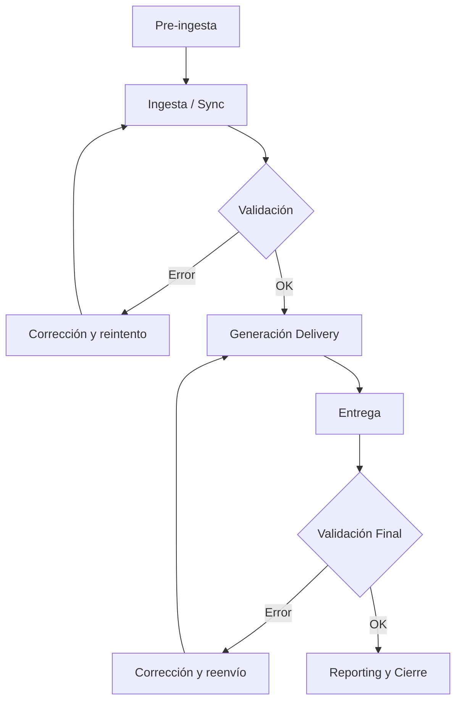
```mermaid
flowchart TD
  A[Pre-ingesta] --> B[Ingesta / Sync]
  B --> C{Validación}
  C -- Error --> R[Corrección y reintento]
  R --> B
  C -- OK --> D[Generación Delivery]
  D --> E[Entrega]
  E --> F{Validación Final}
  F -- Error --> R2[Corrección y reenvío]
  R2 --> D
  F -- OK --> G[Reporting y Cierre]
```
> **Figura 1.** Diagrama del flujo **

---

## 5. Pre-requisitos obligatorios

Antes de ejecutar una ingesta, se deben cumplir los siguientes requisitos:

- Playlists correctamente configuradas en JW Player (incluyendo playlists específicas por partner, si aplica)
- Contenidos (series/películas/episodios) sincronizables con EDYE API
- Metadata completa y consistente (campos obligatorios, idioma(s), disponibilidad, etc.)
- IDs externos cargados cuando aplique (p.ej. **TMS ID**) y parámetros custom requeridos (p.ej. **Acronym**)
- Etiquetado correcto (ej. `geoList`, tags editoriales)
- Paquete de imágenes completo según el partner:
  - Posters (con aspect ratios requeridos)
  - Episodic stills por episodio (cantidad mínima requerida)
  - Thumbnails (si el partner los requiere)
- Naming y estructura de archivos conforme a las **especificaciones del partner**
- Partner habilitado para delivery (configuración de canal + formato de entrega)

---

## 6. Variantes del modelo de ingesta

Las variantes se agrupan en **canal de entrega** y **tipo de paquete**.

### 6.1 Canales de entrega (según partner)

| Canal         | Descripción                                          |
|--------------|------------------------------------------------------|
| Aspera       | Assets generados y almacenados en HITN Production    |
| SFTP Directo | Assets enviados al repositorio SFTP del partner      |
| S3           | Assets enviados al bucket S3 del partner (casos)     |
| API/SSL      | Delivery vía API/SSL (casos de integración por API)  |

### 6.2 Tipos de paquete / alcance de delivery

| Paquete             | Descripción                                             |
|---------------------|---------------------------------------------------------|
| Metadata + Imágenes | Delivery completo de metadata (XML/JSON) e imágenes     |
| Full Package        | Metadata + posters + episodic stills + thumbnails (si aplica) |
| Solo Imágenes       | Delivery limitado a artwork e imágenes                  |
| Solo Metadata       | Delivery limitado a metadata (cuando el partner lo permite) |

Cada partner puede aplicar una o más variantes del modelo.

---

## 7. Validaciones del sistema

Durante la ingesta, EDYE API ejecuta validaciones automáticas sobre:

- Existencia de imágenes requeridas (por tipo de contenido y por partner)
- Coherencia entre playlists y episodios
- Estructura y naming de assets
- Sincronización JW Player ↔ EDYE
- Configuración del delivery por partner
- Restricciones adicionales (ej. thumbnails con watermark, cuando aplique)

### Estados de procesamiento

- **Pending / Received**: Delivery creado, pendiente de ejecución
- **Processing**: Assets en generación/transferencia
- **Completed**: Ingesta finalizada correctamente
- **Failed**: Error en uno o más assets
- **Completed with Warnings** (si aplica): finaliza pero requiere revisión de alertas

---

## 8. Monitoreo y control

El estado de una ingesta puede ser monitoreado desde el **Admin Panel**:

- Vista general de deliveries
- **Delivery View**: revisión del paquete generado (por partner, por tipo de asset)
- Log detallado por asset (errores, warnings)
- Estado individual de cada archivo
- Reintento manual de assets fallidos
- **API Logs / Log Viewer** (si está habilitado): auditoría y troubleshooting

---

## 9. Errores comunes y troubleshooting

| Error / Síntoma                         | Causa probable                                                                 | Acción recomendada                                               |
|----------------------------------------|--------------------------------------------------------------------------------|------------------------------------------------------------------|
| Validation error                        | Imágenes no sincronizadas o faltantes                                          | Ejecutar sync de JW Player y revalidar                           |
| Missing assets                          | Episodios sin stills / posters incompletos                                     | Cargar/reemplazar imágenes y reintentar                          |
| Metadata inconsistente                  | Campos obligatorios faltantes **o caracteres invisibles/codificación inválida (solo UTF-8)** | Corregir metadata en JWP / EDYE, normalizar texto a UTF-8 y reintentar |
| Delivery stuck / processing prolongado  | Error en batch o dependencia en la transferencia                               | Revisar logs, reintentar, escalar a DevOps                       |
| Naming/estructura inválidos             | No cumple spec del partner                                                     | Ajustar naming/estructura y regenerar                            |


---

## 10. Reporting post-ingesta

Una vez completada la ingesta, EDYE permite:

- Descargar reportes en formato CSV o XLS
- Validar assets entregados por partner
- Auditar fechas, IDs y disponibilidad del contenido

Algunos partners requieren formatos específicos (ej. XLS).

---

## 11. Seguridad y control de acceso

- El acceso al Admin Panel está restringido por roles.
- No se exponen credenciales en la documentación.
- Las operaciones de ingesta quedan registradas en logs auditables.

---

## 12. Referencias

- [Flujo de Ingesta](../flujos/flujo-ingesta.md)
- [Ingesta Claro Video](../partners/claro-video/ingesta.md)
- [Ingesta Dish Mexico](../partners/dish-mexico/ingesta.md)

---

## 13. Documentos de apoyo (Google Drive)

Esta sección centraliza los documentos operativos (PDF) relacionados con el modelo de ingesta.
Usa estos enlaces como referencia visual paso a paso del Admin Panel y procesos de delivery.

### Operación de deliveries y monitoreo

- **Generar deliveries para partners vía EDYE API (PDF)**  
  [Abrir en Drive](https://drive.google.com/file/d/1lljpBhoBqpV9BHzWPlfA6_Rba-Q3kpa9/view?usp=drive_link)

- **Verificar el estado individual de un asset dentro de un delivery (PDF)**  
  [Abrir en Drive](https://drive.google.com/file/d/1Id1bk7cMcvQ-fLHOOZG8bCvFyNa8DSxJ/view?usp=drive_link)

- **Descargar reportes de ingesta / delivery reports (PDF)**  
  [Abrir en Drive](https://drive.google.com/file/d/1dMgpGFmfRcIClUC1X3K68CsPRi4oYyoG/view?usp=drive_link)

### Imágenes y paquetes

- **Descargar paquetes de imágenes para partners específicos (PDF)**  
  [Abrir en Drive](https://drive.google.com/file/d/1RqXEM0K-BSqC7vBPRrdundW3J1LPrVfb/view?usp=drive_link)

- **Reemplazar imágenes de episodios manualmente en EDYE API (PDF)**  
  [Abrir en Drive](https://drive.google.com/file/d/1rRpWeTCohNudmPhUEZr6QLZ0CRxGmFYy/view?usp=drive_link)

- **Sincronizar playlists e imágenes desde JW Player hacia EDYE API (PDF)**  
  [Abrir en Drive](https://drive.google.com/file/d/1EknA3RHwOift9hmv90AgMzdGwLk3KLWj/view?usp=drive_link)

### Metadata y etiquetado

- **Etiquetado masivo (Add Tags to Content in Bulk) vía EDYE API (PDF)**  
  [Abrir en Drive](https://drive.google.com/file/d/1HHgs9z459F3KGgZ8cR3qr6rMBtHYnTB9/view?usp=drive_link)

***

\newpage

# 🤝 Integración por Delivery vía API

Este documento describe el modelo estándar de delivery vía API dentro del ecosistema EDYE, utilizado por partners para consumir catálogo, metadata e imágenes directamente desde endpoints (sin transferencia file-based como SFTP/Aspera).

Este modelo aplica, entre otros, a partners que integran catálogo mediante API (por ejemplo, aplicaciones OTT, operadores o agregadores que consumen JSON). La estructura y estilo de este documento siguen el mismo patrón del ejemplo adjunto.

---

## 1. Alcance

El modelo de delivery vía API cubre:

- Publicación y exposición de catálogo (series, películas, episodios)
- Entrega de metadata estructurada (JSON) para consumo programático
- Entrega de referencias/URLs de imágenes y thumbnails (cuando aplique)
- Versionado, paginación y sincronización incremental (checkpoint/cursor)
- Validación funcional del consumo (contrato, campos obligatorios, consistencia)
- Monitoreo, control de acceso, rate limits y troubleshooting
- Reporting y auditoría de consumo (cuando aplique)

No cubre:

- Ingesta/carga de contenido en JW Player (eso pertenece al modelo de ingesta)
- Transferencia de paquetes de assets por SFTP/Aspera/S3 (modelo file-based)
- Reproducción DRM, playback, player SDK o analítica del partner (salvo acuerdos específicos)

---

## 2. Sistemas involucrados

Los siguientes sistemas participan en el delivery vía API:

- **EDYE API**  
  Fuente central para exposición de catálogo, metadata y assets por endpoints.
- **Admin Panel (EDYE)**  
  Interfaz operativa para configuración por partner (acceso, parámetros, thumbnails, etc.) y verificación/monitoreo.
- **JW Player (JWP) (origen upstream, indirecto)**  
  Origen de videos, playlists y still images. La ingesta mantiene a EDYE actualizado, y luego el partner consume desde EDYE API.
- **Fuentes de metadata externas (cuando aplique)** - Gracenote / TMS (IDs, correlación, enriquecimiento) - Regla: Los identificadores Gracenote / TMS se requieren solo para partners que tengan correlación de catálogo vía Gracenote/TMS (definido por contrato). Para los demás partners, estos IDs no son obligatorios (opcionales / N/A).
- **Partner**  
  Cliente API (backend o app) que consume los endpoints y sincroniza su catálogo.

---

## 3. Tipos de contenido soportados

El modelo de delivery vía API soporta, según configuración:

- Series
- Películas
- Episodios
- Playlists / colecciones (si se exponen)
- Imágenes: - Posters - Episodic stills - Logos - Thumbnails (cuando aplique por partner)
- Metadata asociada al contenido (campos editoriales, disponibilidad, ratings, idiomas, etc.)

---

## 4. Flujo general de delivery vía API

El flujo estándar de delivery vía API se compone de los siguientes pasos:

### Fase A — Preparación (Pre-delivery)

- Carga y organización del contenido
  - Videos master en JW Player
  - Estructura: show → temporada → episodio
  - Idiomas / variantes (si aplica)
- Metadata mínima y consistencia
  - Campos obligatorios (por estándar EDYE + anexo partner)
  - IDs externos (TMS/Gracenote u otros, si aplica)
  - Revisión de consistencia editorial
- Imágenes y thumbnails
  - Posters / stills / logos (según caso)
  - Generación/validación de thumbnails según formatos por partner (si aplica)
- Configuración del partner en EDYE Admin
  - Alta/edición del partner
  - Definición de permisos de API (endpoints habilitados)
  - Filtros por tags/geo (si aplica)
  - Configuración de thumbnails y/o watermark (si aplica)
  - Selección de “Delivery Type” cuando corresponda (ej. API Delivery)

> Nota: En “API Delivery”, EDYE puede agregar al JSON un campo adicional con los thumbnails configurados (p. ej. custom_thumbnails) cuando aplique.

### Fase B — Publicación y Exposición vía API

- Sincronización / actualización de datos
  - Sincronización de shows/episodios (si aplica por operación)
  - Verificación de que el contenido esté “visible” y en tags correctos
- Exposición en endpoints de EDYE
  - Endpoints típicos (según permisos):
    - Show List
    - Episode List
  - La respuesta incluye metadata + referencias a assets (imágenes/thumbnails) según configuración
- Consumo por el partner
  - El partner ejecuta polling (job programado) o sincronización bajo demanda
  - El partner:
    - Detecta nuevos shows/episodios o cambios
    - Descarga/consume assets referenciados (imágenes/thumbnails)
    - Actualiza su catálogo interno

### Fase C — Control, errores y cierre operativo

- Validación y control de errores
  - En EDYE:
    - Seguimiento de tráfico por endpoint/partner
    - Revisión de errores recientes (Latest Errors)
    - Revisión de API Log (por rango de fecha, endpoint, usuario, status)
  - En partner:
    - Manejo de reintentos y backoff
    - Reporte de inconsistencias (si un asset no existe o falta metadata)
- Corrección y reintentos
  - Si el error es editorial (metadata/imagenes): corrige Content Ops / Diseño y se reexpone por API
  - Si el error es técnico (auth, endpoint, performance): DevOps investiga logs y aplica corrección
- Reporting
  - Estado del consumo (éxitos/errores por ventana)
  - Evidencia en logs (API Log) y métricas del dashboard técnico

---

### Diagrama del flujo

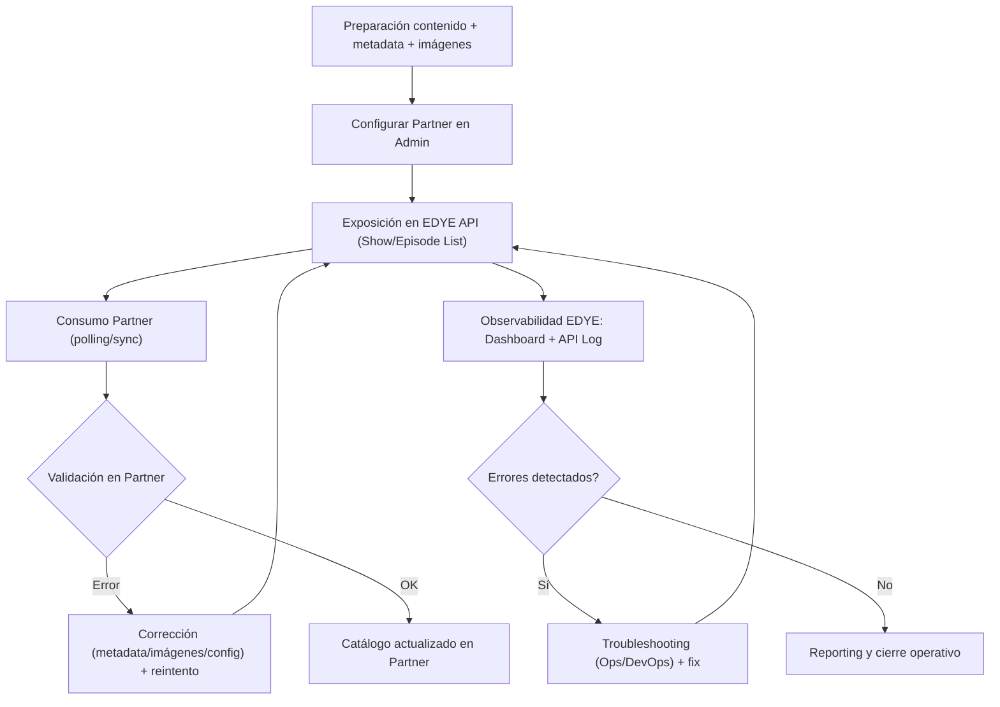
```mermaid
flowchart TD
  A["Preparación contenido + metadata + imágenes"] --> B["Configurar Partner en Admin"]
  B --> C["Exposición en EDYE API (Show/Episode List)"]
  C --> D["Consumo Partner (polling/sync)"]
  D --> E{"Validación en Partner"}
  E -- Error --> R["Corrección (metadata/imágenes/config) + reintento"]
  R --> C
  E -- OK --> F["Catálogo actualizado en Partner"]
  C --> G["Observabilidad EDYE: Dashboard + API Log"]
  G --> H{"Errores detectados?"}
  H -- Sí --> R2["Troubleshooting (Ops/DevOps) + fix"]
  R2 --> C
  H -- No --> I["Reporting y cierre operativo"]
```
> **Figura 1.** _Diagrama del flujo_

---

## 5. Pre-requisitos obligatorios

Antes de habilitar un partner para delivery vía API, se deben cumplir los siguientes requisitos:

- Partner creado y configurado en EDYE (entornos: staging/prod)
- Definición de esquema de autenticación (API key / bearer token / etc.)
- Permisos por rol/partner a endpoints requeridos (Access Control)
- Definición de alcance de catálogo (qué contenido ve: tags/playlists/geo/idiomas)
- Definición de campos obligatorios por partner (contrato de datos)
- Definición de thumbnails/imágenes requeridas (formatos, tamaños, watermark si aplica)
- Definición de rate limit y estrategia de reintentos
- Acuerdo de ventanas de sincronización y operación (frecuencia de consumo)

---

## 6. Variantes del modelo de delivery vía API

Las variantes se agrupan por tipo de consumo y alcance de datos.

### 6.1 Tipos de consumo (según partner)

| Tipo          | Descripción                                                                   |
| ------------- | ----------------------------------------------------------------------------- |
| Catálogo full | El partner sincroniza todo el catálogo permitido (paginado).                  |
| Incremental   | El partner consume solo cambios desde un checkpoint (updated_since / cursor). |
| Por colección | El partner consume por playlists/colecciones específicas (tags/IDs).          |
| Híbrido       | Full inicial + incremental recurrente.                                        |

### 6.2 Alcance de entrega

| Alcance                     | Descripción                                                               |
| --------------------------- | ------------------------------------------------------------------------- |
| Metadata + Imágenes         | JSON + URLs a posters/stills/thumbnails.                                  |
| Solo metadata               | JSON sin requerimientos estrictos de imágenes (si el partner lo permite). |
| Solo imágenes               | Endpoints/feeds para refresco de artwork (casos específicos).             |
| Enriquecido (TMS/Gracenote) | Incluye IDs externos y/o campos adicionales para correlación.             |

---

## 7. Validaciones del sistema

Durante el delivery vía API, se consideran las siguientes validaciones (del lado partner y operativas):

- Contrato de datos (schema): campos obligatorios presentes y con tipo válido
- Consistencia: relación show–temporada–episodio coherente
- Disponibilidad: ventanas de publicación (start/end), geo, idioma, flags editoriales
- Imágenes: existencia de URLs y formatos requeridos (si aplica)
- Codificación de metadata: evitar caracteres invisibles / texto inválido; estandarizar UTF-8
- Paginación: no duplicar ni perder items entre páginas/cursor
- Rate limit y resiliencia: reintentos controlados ante 429/5xx

**Estados de respuesta (desde la perspectiva del cliente)**

- 200 OK: respuesta válida
- 204 No Content: sin cambios / sin resultados (si aplica)
- 400 Bad Request: parámetros inválidos
- 401/403: autenticación/autorización
- 404: recurso no existe o no está permitido
- 409: conflicto (si aplica)
- 429 Too Many Requests: rate limit
- 5xx: error del servicio

---

## 8. Monitoreo y control

El estado de la operación puede monitorearse desde:

- Admin Panel (configuración del partner, validaciones operativas, revisiones)
- API Logs / Log Viewer (si está habilitado): auditoría y troubleshooting
- Métricas (tasa de requests, latencia, errores por endpoint, 429)

**Evidencia mínima para soporte (partner → EDYE)**

Cuando el partner reporte un incidente, debe incluir:

- Entorno (staging/prod)
- Endpoint + método
- Timestamp (UTC) y zona horaria del partner
- Status code
- Request/Correlation ID (si existe)
- Parámetros (sin credenciales)
- Ejemplo de IDs afectados (show_id / episode_id)

---

## 9. Errores comunes y troubleshooting

| Error / Síntoma    | Causa probable                                                                           | Acción recomendada                                                        |
| ------------------ | ---------------------------------------------------------------------------------------- | ------------------------------------------------------------------------- |
| 401 / 403          | Credenciales inválidas, expiradas o sin permisos                                         | Validar token/API key, revisar Access Control, rotar credenciales         |
| 400 Bad Request    | Parámetros no soportados (paginación/filtros)                                            | Revisar contrato, ajustar query/cursor, validar tipos                     |
| 404 Not Found      | Recurso no existe o no está en el scope del partner                                      | Confirmar filtros/tags/geo; validar IDs                                   |
| 429 Rate limit     | Exceso de requests o burst no permitido                                                  | Implementar backoff exponencial + jitter; respetar RPS acordado           |
| 5xx / timeouts     | Degradación temporal del servicio                                                        | Reintentar con backoff; activar circuit breaker; escalar a DevOps         |
| Data inconsistente | Campos obligatorios faltantes o caracteres invisibles/codificación inválida (solo UTF-8) | Normalizar metadata upstream (JWP/EDYE), corregir campos y re-sincronizar |
| Imágenes faltantes | Posters/stills no disponibles o no cumplen formato                                       | Completar imágenes, validar ratios/tamaños/watermark y reintentar         |

---

## 10. Reporting post-delivery

Una vez estabilizada la integración, EDYE puede soportar:

- Reportes de consumo (agregados por endpoint/ventana) si están habilitados
- Auditoría de catálogo entregado vs esperado (muestras por fecha/checkpoint)
- Evidencia para troubleshooting (trazas por request ID)

Algunos partners requieren reportes en formatos específicos (CSV/XLS) según operación.

---

## 11. Seguridad y control de acceso

- Acceso restringido por roles y permisos (principio de mínimo privilegio)
- No se exponen credenciales en documentación
- Rotación periódica de credenciales (recomendado)
- Opcional: allowlist de IPs del partner (según entorno)
- Toda operación relevante debe quedar registrada en logs auditables

---

## 12. Referencias

- [Flujo de Delivery vía API](../flujos/flujo-delivery-api.md)
- [Modelo de Integración: Ingesta](./ingesta.md)
- Anexos por partner (API Delivery)

---

## 13. Documentos de apoyo (Google Drive)

Esta sección centraliza documentos operativos (PDF) relacionados con operación, monitoreo y validaciones del delivery vía API.

### Operación y monitoreo

- Monitoreo de consumo API y revisión de logs (PDF)  
  _Abrir en Drive_
- Control de acceso y roles por partner (PDF)  
  _Abrir en Drive_

### Contrato de datos y validaciones

- Contrato de schema (campos obligatorios) por partner (PDF)  
  _Abrir en Drive_
- Guía de paginación e incremental sync (PDF)  
  _Abrir en Drive_

***

\newpage

# 🤝 Integración por Edye Billing

Este documento describe el modelo estándar de integración de Billing dentro del ecosistema EDYE / HITN Digital, utilizado para la gestión de suscripciones, cobros, renovaciones, cancelaciones y estados de acceso asociados al consumo de contenidos y aplicaciones.

El modelo es reutilizable para cualquier partner que requiera integración de facturación directa, carrier billing o pasarela externa, manteniendo un enfoque técnico-operativo homogéneo.

## 1. Alcance

El modelo de integración de Billing cubre:

- Creación y gestión de suscripciones
- Procesamiento de pagos, renovaciones y extensiones
- Cancelación y revocación de accesos
- Sincronización de estado de cuenta
- Exposición de estado de suscripción a sistemas consumidores
- Monitoreo, reporting y auditoría de transacciones

No cubre:

- Integraciones de ingesta o delivery de contenidos
- Gestión editorial de contenidos
- UI/UX de pantallas de pago del partner
- Soporte comercial o financiero externo

## 2. Sistemas involucrados

Los siguientes sistemas participan en el flujo de Billing:

- **EDYE Billing Service:** Motor central de facturación, reglas de negocio y control de suscripciones.
- **EDYE API:** Exposición de endpoints REST para operaciones de billing y consulta de estado.
- **Admin Panel (EDYE):** Interfaz operativa para monitoreo, auditoría, reportes y troubleshooting.
- **InPlayer:** Plataforma externa para gestión de pagos, clientes y transacciones (cuando aplica).
- **Pasarela de pago / Carrier Billing (según partner):**
  - Carrier Billing
  - Pasarela externa
  - DTC / Marketplace
- **Partner:** Consumidor de los endpoints de billing y receptor del estado de suscripción.

## 3. Tipos de integración soportados

El modelo de Billing soporta los siguientes tipos de integración:

- **Direct Carrier Billing:** Cobro directo vía operador (telco).
- **DTC / Pasarela Externa:** Integración con proveedor de pagos externo.
- **Marketplace / App Store:** Validación de recibos y control de acceso.
- **Modelo híbrido:** Combinación de billing externo + control centralizado en EDYE.

## 4. Arquitectura general de la integración

La arquitectura de Billing se fundamenta en un **modelo centralizado de orquestación**, en el que EDYE coordina los distintos servicios implicados – procesos de suscripción, cobro y gestión de acceso – mediante un conjunto de microservicios y una capa de orquestación API. Este enfoque permite desacoplar a los partners de la lógica compleja de pagos, simplificando la integración y aumentando la resiliencia del sistema.

Diversos artículos sobre arquitectura de pagos señalan que los motores de orquestación modernos están construidos con microservicios para lograr escalabilidad y fiabilidad; en lugar de un monolito, las funciones se dividen en servicios independientes que pueden desarrollarse, desplegarse y escalarse por separado. En un entorno de orquestación API, un servicio dedicado gestiona el flujo de trabajo y actúa como punto único de control, secuenciando y combinando llamadas a otros servicios. Esta capa de orquestación ofrece varias ventajas: simplifica la lógica del cliente al encapsular el flujo de negocio, permite observar y depurar los procesos en un único punto y mejora la seguridad al abstraer la topología interna.

En el contexto de EDYE, el componente **EDYE Billing Service** orquesta las transacciones de cobro y las gestiona a través de su **API REST.** Los servicios internos almacenan y controlan el estado de las suscripciones, mientras que conectores específicos gestionan la comunicación con los proveedores de pago (carrier billing, pasarelas o marketplaces). La integración con plataformas externas como **InPlayer** también se desacopla a través de esta capa; InPlayer aporta servicios de identidad, pagos y gestión de acceso, pero la orquestación de estos servicios se realiza desde EDYE para asegurar un flujo homogéneo y centralizado.

**Componentes clave:**

- **API REST transaccional:** capa pública que expone operaciones de alta, renovación, cancelación y consulta.
- **Servicios de persistencia de estados:** almacenan los estados de suscripción y registros de transacciones para auditoría y sincronización.
- **Conectores de proveedor de pago:** encapsulan la comunicación con carrier billing, pasarelas externas o marketplaces, y se pueden escalar de forma independiente.
- **Módulo de orquestación:** coordina el flujo entre API, persistencia, conectores y servicios de terceros, realizando transformaciones y agregación de datos.
- **Exposición de estado normalizado a partners:** provee a los sistemas del partner una vista unificada del estado de suscripciones y transacciones.

## 5. Flujo general de Billing

El flujo estándar de Billing se compone de los siguientes pasos:

1. El partner inicia una solicitud de alta de suscripción.
2. EDYE Billing valida el producto, plan y reglas aplicables.
3. Se ejecuta el proceso de cobro vía proveedor configurado.
4. El proveedor retorna el resultado de la transacción.
5. EDYE registra la suscripción y su estado.
6. Se habilita o deniega el acceso según el resultado.
7. Se programan renovaciones automáticas (si aplica).
8. Se exponen endpoints de consulta de estado.
9. Se registran logs, métricas y eventos.
10. Se generan reportes operativos y financieros.

A continuación se muestra un diagrama de alto nivel que ilustra este flujo end‑to‑end. El diagrama refleja la interacción entre el **EDYE Billing** (como orquestador), la pasarela de pagos (**Pagoralia** en el ejemplo), el **cliente** y la plataforma externa **InPlayer**. El portal geolocalizado se crea y se integra con la pasarela; el cliente accede a su portal y oferta distintas suscripciones, el usuario ingresa al paywall y se registra, y finalmente EDYE reconcilia las ganancias con el partner. Si ocurre un fallo de transacción, se presenta una pantalla de error; en caso de éxito, el usuario queda registrado en InPlayer y se continúa con el flujo de renovación y reporting.

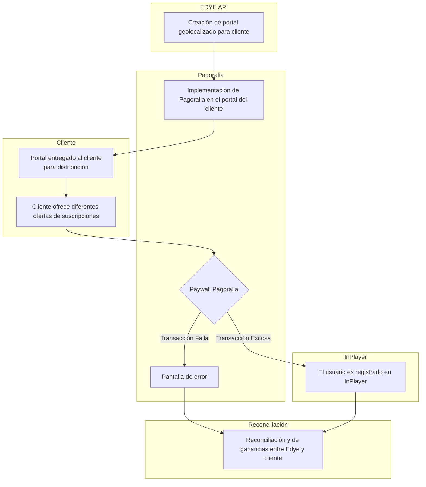
```mermaid
flowchart TD
    %% Definición de subgráficos para representar las "swimlanes"
    subgraph EDYE_API["EDYE API"]
        A[Creación de portal geolocalizado para cliente]
    end

    subgraph Pagoralia["Pagoralia"]
        B[Implementación de Pagoralia en el portal del cliente]
        D{Paywall Pagoralia}
        E[ Pantalla de error ]
    end

    subgraph Cliente["Cliente"]
        C[Portal entregado al cliente<br>para distribución]
        F[Cliente ofrece diferentes ofertas de suscripciones]
    end

    subgraph InPlayer["InPlayer"]
        G[El usuario es registrado en InPlayer]
    end

    subgraph Reconciliación["Reconciliación"]
        H[Reconciliación y de ganancias entre Edye y cliente]
    end

    %% Flujo principal
    A --> B --> C --> F --> D
    D -->|Transacción Falla| E --> H
    D -->|Transacción Exitosa| G --> H
```
> **Figura 1.** Flujo general de Billing

## 6. Pre-requisitos obligatorios

Antes de habilitar una integración de Billing, se requiere:

- Partner registrado y habilitado en EDYE
- Productos y planes configurados
- Reglas de cobro definidas (trial, renovación, cancelación)
- Canal de pago configurado
- Endpoints habilitados y autenticados
- Accesos y roles definidos en Admin Panel
- Validación de ambientes (staging / producción)

## 7. Variantes del modelo de Billing

### 7.1 Tipos de cobro

Tipo Descripción
Trial Acceso gratuito por período definido
Recurring Renovación automática
One-time Pago único
Promotional Condiciones especiales

### 7.2 Gestión de estado

Estado Descripción
Active Suscripción vigente
Expired Período finalizado
Revoked Acceso cancelado
Pending Transacción en proceso

## 8. Validaciones del sistema

Durante el proceso de Billing, EDYE ejecuta validaciones automáticas sobre:

- Existencia del producto y plan
- Estado del cliente
- Resultado del proveedor de pago
- Duplicidad de suscripciones
- Consistencia de fechas y períodos
- Reglas de renovación y cancelación
- Estados de procesamiento: Pending, Active, Expired, Revoked, Failed

## 9. Monitoreo y control

El monitoreo se realiza desde el Admin Panel:

- Dashboard de actividad de billing
- Historial por cliente
- Detalle de transacciones
- Estados de suscripción
- Logs de API
- Reintentos y correcciones manuales (según rol)

## 10. Errores comunes y troubleshooting

Error / Síntoma Causa probable Acción recomendada
Subscription not activated Error en pago Revisar proveedor y reintentar
Renewal not applied Fallo en job automático Verificar scheduler
Status mismatch Desincronización Forzar sync de estado
Payment rejected Proveedor externo Validar motivo del rechazo
API unauthorized Token inválido Regenerar credenciales

## 11. Reporting post-billing

EDYE permite:

- Exportar reportes CSV / XLS
- Auditar transacciones por período
- Consultar métricas de conversión
- Revisar ingresos por partner / producto

## 12. Seguridad y control de acceso

- Autenticación vía tokens seguros
- Control de roles por operación
- Logs auditables
- No exposición de datos sensibles
- Cumplimiento de buenas prácticas de seguridad

## 13. Referencias

- Documentación EDYE Billing API.
- Manual operativo de Admin Panel.
- Procedimientos DevOps (CI/CD, monitoreo, seguridad).
- **InPlayer Basic Overview:** descripción de las tres líneas de servicio de InPlayer (gestión de identidad/autenticación, pagos/suscripciones y control de acceso).
- **Arquitectura de orquestación de pagos:** artículos sobre motores de orquestación que destacan el uso de microservicios para escalabilidad, aislamiento de fallos y despliegues independientes.
- **Capa de orquestación API:** guía sobre diseño de capas de orquestación que explica funciones como secuenciación, agregación y transformación de respuestas.

***

\newpage

# 🤝 Integración por API Notifier APK

## 1. Introducción

Este documento describe las directrices para integrar la aplicación de EDYE en el ecosistema de un socio mediante el modelo APP INTEGRATION – APO + Notifier + APK. Está dirigido a equipos técnicos y de operaciones DevOps. Su propósito es servir como referencia genérica para cualquier partner que integre la APK oficial de EDYE, sin mencionar particularidades específicas de un operador concreto.

## 2. Objetivo y alcance

**Objetivo:** proporcionar una guía detallada para integrar la aplicación EDYE en plataformas de socios usando APO (Application Provider Operator) y Notifier.

**Alcance:** incluye la entrega de la APK oficial, la configuración de APO, la suscripción a eventos a través de Notifier y la conexión con el backend de EDYE. Se excluyen procesos de facturación o ingesta de usuarios de terceros.

## 3. Modelo de integración APO + Notifier + APK (visión general)

El modelo de integración se basa en tres elementos proporcionados por EDYE:

- **APK oficial:** aplicación empaquetada para dispositivos Android (incluyendo Android TV u OTT), suministrada firmada y sin modificaciones.
- **APO (Application Provider Operator):** consola de configuración que gestiona parámetros como entornos (QA y producción), claves API, canales de contenido y versiones.
- **Notifier:** servicio de mensajería basado en eventos que informa de acciones ocurridas en la plataforma. Según las guías de mensajería asíncrona, los eventos no requieren una acción del consumidor y no esperan una respuesta específica; el productor y el consumidor están desacoplados.

El socio integrador debe:

- Recibir e integrar la APK en su tienda o canal de distribución.
- Configurar APO con sus parámetros propios (endpoints, tokens, canales).
- Consumir los eventos emitidos por Notifier y confirmar su recepción mediante un acknowledgement para garantizar la entrega.

## 4. Arquitectura general de la integración

La arquitectura se compone de:

- **Ecosistema del Partner:** entorno donde se distribuye la APK y se opera la integración.
- **EDYE APK:** aplicación oficial que se ejecuta en los dispositivos de los usuarios.
- **APO:** plataforma de configuración centralizada.
- **Notifier:** servicio de mensajería que publica eventos operativos y de negocio.
- **Backend de EDYE:** servicios de autenticación, catálogo y streaming.

Un diagrama general podría mostrar estos componentes conectados: la APK se comunica con el backend para autenticación y contenidos, se gestiona mediante APO y publica eventos a Notifier; el partner consume dichos eventos y actualiza sus sistemas conforme a la información recibida.

## 5. Flujo general de la integración (descripción textual end‑to‑end)

1. **Entrega de la APK:** EDYE entrega la APK firmada al partner junto con metadatos de versión.
2. **Preparación del entorno:** el partner habilita un entorno de QA y recibe credenciales iniciales.
3. **Instalación de la APK:** el partner distribuye la aplicación a los dispositivos.
4. **Configuración de APO:** se definen entornos, claves, endpoints y canales de contenido en la consola APO.
5. **Suscripción a Notifier:** el partner se suscribe a los temas (topics) de eventos relevantes.
6. **Integración con el backend:** la APK invoca servicios de EDYE mediante HTTPS y tokens.
7. **Monitoreo y soporte:** el partner supervisa el funcionamiento y coordina con EDYE ante incidencias.

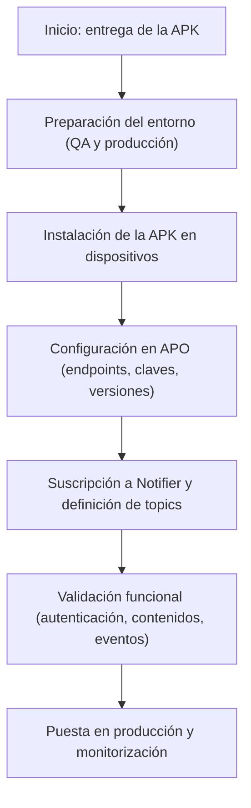
```mermaid
flowchart TD
    Start["Inicio: entrega de la APK"]
    Prep["Preparación del entorno (QA y producción)"]
    Install["Instalación de la APK en dispositivos"]
    ConfigAPO["Configuración en APO (endpoints, claves, versiones)"]
    SubscribeNotifier["Suscripción a Notifier y definición de topics"]
    Validate["Validación funcional (autenticación, contenidos, eventos)"]
    Production["Puesta en producción y monitorización"]

    Start --> Prep --> Install --> ConfigAPO --> SubscribeNotifier --> Validate --> Production
```
> **Figura 1.** _Flujo general de la integración_

## 6. Componentes involucrados

### Partner (Socio Integrador)
- Integra la APK en su catálogo de aplicaciones y configura APO con sus parámetros.
- Consume eventos de Notifier y confirma su recepción.
- Gestiona el soporte de primer nivel para sus usuarios.

### EDYE APO
- Plataforma de configuración de la APK. Permite definir entornos, endpoints, canales de contenido, claves y versionado.
- Registra cambios y proporciona registros de auditoría.

### EDYE Notifier
- Servicio basado en el patrón publicador–suscriptor. Publica eventos cuando ocurren hechos relevantes.
- Implementa un sistema de confirmaciones y reintentos para asegurar la entrega de mensajes.

### EDYE APK
- Aplicación oficial que gestiona la experiencia del usuario en dispositivos Android.
- Se configura dinámicamente mediante APO.
- Reporta eventos a Notifier y consume contenidos desde el backend.

### EDYE Backend (API / Connect / Play)
- Servicios de autenticación, catálogo y streaming.
- Opera bajo HTTPS y requiere tokens de acceso. Las mejores prácticas de autenticación exigen mantener las claves secretas, incluir sólo la información necesaria en los tokens y definir expiración.

## 7. Flujo detallado por fases

### 7.1 Preparación del entorno
- EDYE entrega credenciales iniciales para QA y producción.
- El partner configura la red para permitir tráfico HTTPS hacia los dominios de EDYE.
- Se crea una cuenta en APO con permisos adecuados.

### 7.2 Entrega e instalación de la APK
- Recepción y verificación de la APK firmada.
- Distribución a través de los canales internos del partner.
- Pruebas de instalación en dispositivos compatibles.

### 7.3 Configuración de APO
- Definición de entornos, endpoints y claves.
- Configuración de canales de contenido y versiones.
- Registro de cambios y auditoría.

### 7.4 Integración de Notifier
- Suscripción a topics de eventos (por ejemplo: altas, bajas, errores).
- Implementación de un cliente que consume eventos y envía acks.
- Manejo de reintentos con back‑off e idempotencia.

### 7.5 Validación funcional
- Verificar autenticación y acceso a contenidos.
- Reproducir títulos y validar DRM.
- Probar eventos de Notifier y confirmaciones.
- Validar que la configuración de APO se aplica correctamente.

### 7.6 Puesta en producción
- Actualizar parámetros de producción en APO.
- Desplegar la APK a los usuarios finales.
- Monitorizar el servicio durante la transición y registrar las versiones y fechas.

## 8. Modelo de eventos Notifier

### 8.1 Tipos de eventos
- Alta de usuario, baja de usuario, errores, estado del servicio, interacciones de reproducción.
- Los eventos se envían en formato JSON con identificador, timestamp, tipo y datos relevantes.

### 8.2 Confirmaciones y reintentos
- Aunque los eventos no requieren acción del consumidor, se envía un ack para confirmar la recepción.
- Notifier almacenará el evento y realizará reintentos hasta que se reciba el ack.
- El consumidor debe ser idempotente para manejar duplicados.

## 9. Configuración del APO

- **Parámetros:** entornos (QA/producción), claves, endpoints, canales, versión mínima/máxima de APK.
- **Ambientes:** cada entorno tiene sus propios tokens y configuraciones.
- **Gestión de versiones:** se controla el acceso a versiones de la APK y se puede forzar actualización.
- **Controles operativos:** logs de auditoría, alertas y gestión de usuarios.

## 10. Seguridad y control de accesos

- **Autenticación:** mediante tokens que deben mantenerse secretos y tener expiración.
- **Autorización:** validación de permisos en el backend y en APO.
- **Protección de endpoints:** uso de HTTPS, rate limiting, validación de inputs.
- **Gestión de credenciales:** rotación periódica, almacenamiento seguro y control de acceso mínimo.

## 11. Manejo de errores, monitoreo y reintentos

- Manejar excepciones en la APK con reintentos y mensajes claros.
- Utilizar logs y métricas para detectar fallos.
- Idempotencia y reintentos en Notifier para asegurar entrega.
- Integración con herramientas de observabilidad del partner.

## 12. Criterios de aceptación de la integración

- Instalación y funcionamiento correcto de la APK.
- Configuración validada en APO.
- Recepción y confirmación de eventos Notifier.
- Acceso seguro a contenidos.
- Monitoreo y documentación completados.

## 13. Operación, monitoreo y soporte

- Supervisar diariamente métricas de uso y eventos.
- Actualizar configuraciones en APO según sea necesario.
- Coordinar actualizaciones de la APK con EDYE.
- Utilizar canales de soporte establecidos para resolver incidencias.
---

***

\newpage

# 🤝 Integración por API Notifier billing

## 1. Introducción

El **Direct Carrier Billing (DCB)** es un método de pago en línea que permite a los usuarios adquirir bienes o servicios digitales cargando el importe directamente en la factura de su operador móvil. Este mecanismo elimina la necesidad de introducir datos bancarios y es especialmente útil en servicios móviles, medios digitales y países donde el uso de tarjetas de crédito no está generalizado.
En el contexto de **EDYE**, la plataforma preescolar de HITN Digital que ofrece contenidos educativos y de entretenimiento para niños en un entorno seguro, el DCB se utiliza para que los usuarios puedan suscribirse a la plataforma a través del operador móvil. Este documento define de forma genérica el modelo de integración **API + Notifier** utilizado por EDYE para ofrecer suscripciones mediante DCB, de manera neutra y sin referencias a un operador concreto.

## 2. Alcance

El objetivo de este documento es servir de guía técnico‑operativa para equipos de **Operaciones, DevOps** y **equipos técnicos de partners** que deban integrar servicios de EDYE usando DCB. Se describen:

- La arquitectura lógica del modelo API + Notifier.
- Los componentes involucrados y su interacción.
- Los flujos de comunicación para registro, autenticación y gestión de suscripciones.
- Las responsabilidades de EDYE y del operador.
- Consideraciones de seguridad, manejo de errores y buenas prácticas.

Fuera del alcance quedan detalles específicos de operadores, URLs reales, credenciales o variaciones por país.

## 3. Arquitectura lógica de la integración

La integración se basa en dos vectores de comunicación:

- **API REST de EDYE:** expone servicios para registro y autenticación de usuarios, validación de estado de suscripción y gestión de acceso a contenidos.
- **Notifier del operador:** mecanismo de mensajería asíncrona mediante el cual el operador envía eventos de facturación (altas, renovaciones, suspensiones y cancelaciones) a EDYE. Estos eventos permiten sincronizar el estado de suscripciones y actualizar el acceso del usuario.

La figura siguiente ilustra la arquitectura general del modelo API + Notifier. El diagrama es conceptual y muestra los elementos esenciales sin detalles de implementación específicos:


> **Figura 1.** Arquitectura lógica de la integración

## 4. Componentes principales

| Componente                         | Descripción breve                                                                                                                                                   |
| ---------------------------------- | ------------------------------------------------------------------------------------------------------------------------------------------------------------------- |
| **Usuario**                        | Cliente final que utiliza la aplicación de EDYE para acceder a contenidos y gestionar su suscripción.                                                               |
| **Aplicación EDYE**                    | Aplicación móvil o web donde el usuario consume el servicio. Gestiona la experiencia de usuario y se comunica con la API de EDYE.                                   |
| **API EDYE (REST)**                    | Conjunto de servicios expuestos por EDYE para crear cuentas, autenticar usuarios, consultar el estado de suscripción y autorizar el acceso a contenidos.            |
| **Módulo de Autenticación y Registro** | Procesa el registro y login de usuarios. Implementa requisitos de seguridad (contraseñas seguras, validaciones de edad).                                            |
| **Módulo de Gestión de Suscripciones** | Almacena y consulta el estado de la suscripción del usuario. Interactúa con el operador para iniciar, renovar o cancelar suscripciones.                             |
| **Billing interno**                    | Sistema interno de EDYE que gestiona la facturación, conciliación y provisión de servicios en función de los eventos recibidos del operador.                        |
| **Gestor de Acceso a Contenidos**      | Controla el acceso a los episodios, juegos y otros recursos según el plan activo del usuario.                                                                       |
| **Notifier del operador**              | Servicio del operador que envía eventos asíncronos (alta, renovación, suspensión y baja) al webhook configurado por EDYE para mantener la suscripción sincronizada. |
| **Operador DCB**                       | Entidad que presta el servicio de facturación directa a través de la red móvil y provee las APIs y el Notifier para gestionar pagos y eventos.                      |

## 5. Flujos de comunicación

### 5.1. Registro y autenticación de usuarios

El proceso de alta de un usuario en EDYE sigue una secuencia sencilla, descrita en la sección de ayuda oficial. El usuario descarga la aplicación desde las tiendas oficiales, selecciona un contenido y realiza un pequeño cálculo para confirmar que es un adulto. A continuación se muestra un formulario donde se introducen **nombre, correo electrónico y contraseña**. La contraseña debe cumplir los requisitos de seguridad (al menos ocho caracteres, incluir mayúsculas, minúsculas, número y carácter especial). Tras completar el registro se envía un correo de bienvenida donde se permite elegir el plan de suscripción.

EDYE expone servicios REST para:

- **Crear usuario:** recibe las credenciales y datos de registro, valida la edad e inicia el proceso de creación de cuenta.
- **Autenticar usuario:** valida credenciales y emite tokens de acceso (por ejemplo, JWT).
- **Consultar estado de suscripción:** permite a la aplicación conocer si el usuario tiene una suscripción activa, vencida o suspendida.
- **Autorizar acceso a contenidos:** valida permisos por plan y concede acceso a los recursos.

La comunicación se realiza mediante HTTPS y se utilizan tokens de autenticación para proteger los recursos.

### 5.2. Activación de suscripción (Alta)

Para activar una suscripción mediante DCB se siguen las fases descritas a continuación. Se basan en prácticas comunes de la industria y en el flujo descrito por la iniciativa CAMARA: en el modelo de facturación directa el pago puede realizarse en uno o dos pasos.

1. **Preparación del pago (opcional):** la aplicación solicita a la API de EDYE iniciar un proceso de suscripción. EDYE valida que el usuario esté registrado, que cumpla los criterios de elegibilidad y prepara el pedido. Esta fase es opcional porque la API de facturación del operador permite pagos de una sola fase, combinando preparación y cobro.
2. **Solicitud de pago:** EDYE envía al operador la solicitud de suscripción. La solicitud incluye el identificador del usuario (por ejemplo, MSISDN o token de usuario) y el importe del plan. El operador carga el importe en la factura del usuario y devuelve un identificador de transacción.
3. **Confirmación del pago (en modelos de dos pasos):** si se usa el esquema de reserva y confirmación, EDYE debe llamar a un endpoint de confirmación para completar la transacción. Existe igualmente un endpoint de cancelación para anular la reserva antes de que sea cobrada.
4. **Recepción de evento de alta:** tras el cobro exitoso, el operador envía un evento de alta (suscripción activada) al Notifier configurado. EDYE consume este evento, actualiza su sistema de billing interno y habilita el acceso al contenido.

### 5.3. Renovaciones

Las suscripciones se renuevan de acuerdo con la periodicidad del plan (por ejemplo, semanal, mensual o anual). El operador ejecuta el cobro y envía un evento de renovación a EDYE a través del Notifier. EDYE actualiza la fecha de vigencia y prolonga el acceso del usuario.

### 5.4. Suspensiones y cancelaciones

- **Suspensión:** el operador envía un evento de suspensión cuando no se puede cobrar la renovación (falta de saldo, bloqueo temporal del usuario, etc.). EDYE cambia el estado de la suscripción a suspendida y restringe el acceso hasta que se recupere la regularidad de pago.
- **Baja (cancelación):** se produce cuando el usuario cancela la suscripción o cuando el operador aplica una baja definitiva. El Notifier envía el evento, EDYE marca la suscripción como cancelada y revoca el acceso.

## 6. Tabla resumen de eventos

| Evento (eventType)   | Origen                | Descripción breve                           | Acción en EDYE                                               |
| -------------------- | --------------------- | ------------------------------------------- | ------------------------------------------------------------ |
| SUBSCRIPTION_STARTED | Operador via Notifier | Alta de suscripción (primer cobro exitoso). | Activar plan, actualizar billing interno y habilitar acceso. |
| RENEWAL              | Operador via Notifier | Renovación periódica de la suscripción.     | Actualizar vigencia y mantener acceso.                       |
| SUSPENSION           | Operador via Notifier | Cobro fallido o suspensión temporal.        | Suspender plan y restringir acceso hasta regularización.     |
| CANCELLATION         | Operador via Notifier | Cancelación definitiva.                     | Marcar la suscripción como cancelada y revocar acceso.       |

Los campos habituales de un evento incluyen un identificador de transacción (paymentId o subscriptionId), el **msisdn** o identificador del usuario, el tipo de evento y la fecha/hora de emisión. El Notifier del operador suele permitir incluir un **token de firma** para garantizar la integridad del mensaje.

## 7. Responsabilidades

### 7.1. Responsabilidades de EDYE

- **Exponer y mantener APIs seguras:** implementar servicios REST que permitan el registro, autenticación y consulta de suscripciones con controles de acceso adecuados.
- **Sincronizar eventos:** consumir los eventos provenientes del Notifier, verificar su autenticidad y actualizar el sistema de billing interno, perfil de usuario y gestor de acceso.
- **Gestión de datos y privacidad:** EDYE solamente almacena el nombre de usuario y la contraseña para guardar la información del contenido que consume el usuario; no recopila datos que revelen la identidad real. Se recomienda que los usuarios utilicen seudónimos y se cumplan las políticas de privacidad vigentes.
- **Monitorización y auditoría:** registrar las transacciones, errores y notificaciones para fines de auditoría y soporte. Implementar alertas ante fallos del Notifier o tasas de error anómalas.
- **Gestión de errores:** retornar códigos HTTP adecuados (por ejemplo, 400 Bad Request para parámetros inválidos, 401 Unauthorized para credenciales incorrectas, 500 Internal Server Error para fallos internos) y mensajes claros para facilitar la resolución.
- **Idempotencia:** garantizar que las operaciones de activación y renovación sean idempotentes utilizando identificadores de correlación para evitar cobros o activaciones duplicadas.

### 7.2. Responsabilidades del operador (partner)

- **Proveer APIs de facturación DCB:** exponer endpoints de pago de una o dos fases, cancelación y consulta de pagos.
- **Gestionar consentimientos y autenticación:** resolver la identidad del usuario y obtener su consentimiento para cargar la factura, tal como se describe en el flujo CAMARA: el operador es responsable de proporcionar las URLs de privacidad y gestionar el consentimiento del usuario.
- **Emitir eventos a través del Notifier:** enviar de forma fiable los eventos de alta, renovación, suspensión y baja al webhook de EDYE. Incluir identificadores únicos y firma del mensaje.
- **Proveer mecanismos de reintento:** en caso de fallo al entregar una notificación, el operador debe reintentar hasta que reciba una respuesta 200 OK de EDYE.
- **Ofrecer entornos de prueba:** suministrar un entorno de sandbox donde EDYE pueda probar integraciones sin cargos reales.

## 8. Consideraciones de seguridad

- **Cifrado y transporte seguro:** todos los servicios (API y Notifier) deben funcionar sobre HTTPS/TLS.
- **Autenticación y autorización:** implementar esquemas de OAuth 2.0 y OpenID Connect para la autenticación entre EDYE, agregadores y operadores. La identidad del usuario se debe transmitir de forma segura y se pueden usar identificadores como la dirección IP o el MSISDN.
- **Validación de notificaciones:** verificar la firma o token que acompaña a cada evento del Notifier para asegurarse de que proviene del operador. Es recomendable disponer de claves públicas compartidas para validar firmas o un mecanismo HMAC compartido.
- **Protección de datos personales:** EDYE no almacena información que revele la identidad real del usuario, y recomienda utilizar nombres de usuario anónimos. Cualquier dato sensible debe almacenarse cifrado y cumplir con la normativa aplicable (p. ej., GDPR).
- **Control de acceso y rate limiting:** implementar límites de tasa y políticas de bloqueo para evitar abusos y ataques de denegación de servicio.
- **Versionado y gestión de secretos:** gestionar versiones de API y rotar claves y tokens con regularidad.

## 9. Manejo de errores y eventos

- **Errores de autenticación:** cuando las credenciales del usuario son incorrectas, la API devolverá 401 Unauthorized con un mensaje descriptivo.
- **Errores de parámetros:** si faltan parámetros o tienen formato incorrecto, devolver 400 Bad Request.
- **Errores del operador:** el operador puede enviar eventos de error (por ejemplo, pago rechazado). EDYE debe procesarlos y ajustar el estado de la suscripción.
- **Duplicados:** para evitar procesar varias veces el mismo evento, se debe almacenar un identificador único de evento y descartar los eventos ya procesados.
- **Reintentos:** si EDYE no devuelve 200 OK, el operador reenviará el evento. Se recomienda implementar reintentos con retroceso exponencial en ambos extremos.

## 10. Buenas prácticas operativas

- **Uso de ambientes segregados:** probar la integración en un entorno de sandbox antes de pasar a producción.
- **Monitoreo continuo:** establecer métricas de latencia, tasa de éxito de pagos, tiempos de respuesta del Notifier y alarmas en caso de anomalías.
- **Documentación y versionado:** mantener documentación actualizada, especificar versiones de API y cambios de esquema.
- **Sincronización horaria:** sincronizar los relojes de los sistemas para registrar correctamente los timestamps de eventos.
- **Soporte y escalamiento:** definir canales de comunicación entre equipos técnicos para gestionar incidencias y mantener acuerdos de nivel de servicio.
- **Pruebas de resiliencia:** simular fallos de red y reintentos del Notifier para validar el comportamiento del sistema.
- **Auditoría y cumplimiento:** almacenar logs de acceso y transacciones durante el periodo definido por las políticas internas y regulaciones.

## 11. Glosario de términos

| Término                      | Definición                                                                                                                |
| ---------------------------- | ------------------------------------------------------------------------------------------------------------------------- |
| **DCB (Direct Carrier Billing)** | Método de pago que carga el costo de una transacción a la factura del operador móvil del usuario.                         |
| **API REST**                     | Interfaz de programación basada en HTTP que sigue el paradigma REST para exponer servicios web.                           |
| **Notifier**                     | Servicio proporcionado por el operador para enviar eventos asíncronos a EDYE (altas, renovaciones, suspensiones, bajas).  |
| **msisdn**                       | Número de teléfono móvil que identifica al abonado en la red del operador.                                                |
| **OAuth 2.0 / OIDC**             | Estándares de autorización y autenticación utilizados para intercambiar credenciales de manera segura entre aplicaciones. |
| **EventType**                    | Campo del evento que indica el tipo de operación notificada (SUBSCRIPTION_STARTED, RENEWAL, SUSPENSION, CANCELLATION).    |

Este documento es parte del ecosistema documental corporativo de EDYE. Ha sido elaborado con fines técnicos y operativos, y se mantendrá actualizado conforme evolucionen las integraciones de facturación directa.

***

\newpage

# Ingesta de Contenidos – Claro Video

Este documento describe las **particularidades de la integración por ingesta de
contenidos del partner Claro Video**, basada en el **modelo estándar de ingesta
EDYE**.

---

## 1. Información general

- **Partner:** Claro Video  
- **Servicio:** Ingesta VOD Internacional  
- **Tipo de contenido:** Video on Demand  
- **Formato de video:** MP4 (H.264)  
- **Volumen estimado:** ~1500 assets por día  

---

## 2. Modelo de integración aplicado

Claro Video implementa el siguiente modelo:

- **Modelo:** Ingesta de Contenidos  
  Ver: `modelos/Ingesta`

Este documento no redefine el modelo, sino que documenta las
**configuraciones y reglas específicas del partner**.

---

## 3. Flujo aplicado

Además del flujo técnico estándar de ingesta EDYE, Claro Video cuenta con un
flujo operativo que involucra a los equipos de Contenido, Diseño y DevOps.

Este flujo describe las tareas humanas previas y posteriores a la generación del
delivery.


> **Figura 1.** Diagrama del flujo operativo del partner

---

## 4. Consideraciones operativas

- Alto volumen operativo diario (~1500 assets)
- Procesamiento asincrónico
- Tiempo promedio de procesamiento:
  - **3 a 5 minutos por asset**
- Entregas realizadas mediante batches controlados

---

## 5. Validaciones generales

Durante la ingesta para Claro Video se validan:

- Resolución mínima de video: **720p**
- Codificación soportada: **H.264**
- Metadata obligatoria completa
- Imágenes sincronizadas y válidas
- Naming conforme a reglas del partner

---

## 6. Estados de procesamiento

| Estado | Descripción |
|------|-------------|
| Pending | Delivery creado |
| Processing | Assets en procesamiento |
| Completed | Procesamiento exitoso |
| Failed | Error en uno o más assets |

El estado se consulta desde el **Admin Panel** de EDYE.

---

## 7. Método de entrega

Los contenidos procesados se entregan mediante:

- **Aspera (HITN Production)** – método principal
- **SFTP directo del partner** – cuando aplica

---

## 8. Anexos técnicos

Las siguientes reglas son obligatorias para Claro Video:

- Posters y artwork  
  Ver: `Anexos-Claro Video/Posters y Artwork Claro Video`

---

## 9. Observaciones

- Los flujos de ingesta vía FTP se encuentran en proceso de descontinuación.
- Cualquier cambio operativo debe validarse con **Operaciones EDYE**.

---

## 10. Documentación relacionada

- `modelos/ingesta.md`
- `flujo/flujo-ingesta.md`
- `anexos-globales/codigos-error.md`

***

\newpage

# Posters y Artwork Claro Video

Este documento define las **reglas técnicas y gráficas** que deben cumplirse para
la correcta ingesta de **posters e imágenes** del partner Claro Video.

---

## Alcance

Aplica a:

- Series
- Temporadas
- Episodios
- Películas

Incluye:

- Posters
- Episodic stills
- Variantes por idioma
- Versiones CLEAN (sin texto)

---

## Idiomas y variantes

| Código | Descripción |
| ------ | ----------- |
| EN     | Inglés      |
| PT     | Portugués   |
| SS     | Español     |
| CLEAN  | Sin texto   |

---

## Estructura de carpetas

```text
TITULODELACONTENIDO/
├── HD/
│   ├── CLEAN/
│   ├── EN/
│   ├── PT/
│   └── SS/
└── SD/
    ├── CLEAN/
    ├── EN/
    ├── PT/
    └── SS/
```

---

## Nomenclatura de archivos – Episodios

### Formato general

```text
TITULO-TEMP-EP-EP_VARIANTE_CALIDAD_CODIGO.jpg
```

### Componentes

| Componente   | Descripción                       |
| ------------ | --------------------------------- |
| **TITULO**   | Nombre del contenido              |
| **TEMP**     | Número de temporada               |
| **EP**       | Número de episodio                |
| **VARIANTE** | CLEAN / EN / PT / SS              |
| **CALIDAD**  | HD / SD                           |
| **CODIGO**   | Código interno (BC10, PS01, etc.) |

### Ejemplos válidos

```text
TITULODELASERIE-01-01-01_CLEAN_HD_BC10.jpg
TITULODELASERIE-01-01-01_SS_HD_PS04.jpg
TITULODELASERIE-01-01-01_EN_SD_BC13.jpg
```

### Consideraciones importantes

- Las **carpetas** deben estar en **MAYÚSCULAS** y **sin espacios**.
- Un **naming incorrecto** puede provocar:
  - Fallos de validación
  - Rechazo del delivery
- Todas las **variantes requeridas** deben entregarse según corresponda.

---

### Control de cambios

Cualquier modificación en:

- Dimensiones
- Naming
- Idiomas
- Estructura de carpetas

Debe ser validada previamente con **Operaciones EDYE** y **Claro Video**.

***

\newpage

# Ingesta de Contenidos – Dish Mexico

## 1. Descripción
Integración de ingesta VOD para Dish México mediante entrega de media,
metadata y artwork, operada principalmente vía Aspera.

## 2. Tipo de Ingesta
- Modalidad principal: Aspera
- Modalidad secundaria: API (si aplica)
- Frecuencia: diaria
- Volumen estimado: ~1500 assets/día

## 3. Canales de Entrega
### 3.1 Aspera
- Cuenta provista por Dish
- Directorios esperados:
  - /MEDIA
  - /METADATA
  - /ART

## 4. Flujo de Ingesta – Dish México

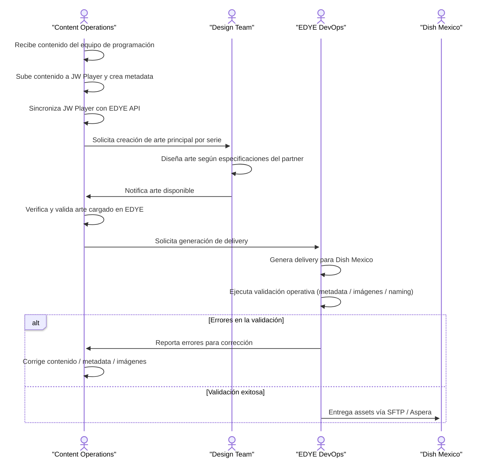
```mermaid
---
config:
  theme: mc
  look: neo
---
sequenceDiagram
    actor CO as "Content Operations"
    actor DT as "Design Team"
    actor DD as "EDYE DevOps"
    actor CV as "Dish Mexico"

    CO->>CO: Recibe contenido del equipo de programación
    CO->>CO: Sube contenido a JW Player y crea metadata
    CO->>CO: Sincroniza JW Player con EDYE API

    CO->>DT: Solicita creación de arte principal por serie
    DT->>DT: Diseña arte según especificaciones del partner
    DT->>CO: Notifica arte disponible
    CO->>CO: Verifica y valida arte cargado en EDYE

    CO->>DD: Solicita generación de delivery
    DD->>DD: Genera delivery para  Dish Mexico
    DD->>DD: Ejecuta validación operativa (metadata / imágenes / naming)

    alt Errores en la validación
        DD->>CO: Reporta errores para corrección
        CO->>CO: Corrige contenido / metadata / imágenes
    else Validación exitosa
        DD->>CV: Entrega assets vía SFTP / Aspera
    end
``` 
> **Figura 1.** Diagrama del flujo operativo del partner

Este flujo describe el proceso operativo completo desde la recepción del
contenido por parte del equipo de Content Operations hasta la entrega
final del contenido al cliente Dish México vía Aspera.

## 5. Metadata
- Estándar: CableLabs XML
- Versión: según especificación Dish
- Validaciones obligatorias:
  - ProgramID
  - Title
  - Rating
  - Language
  - Duration

> Ver Anexo: Metadata / XML CableLabs – Dish México

## 6. Reglas Específicas Dish
- Naming estricto por ProgramID
- Ingesta rechazada si falta artwork
- Reprocesos requieren reenvío completo

## 7. Dependencias
- Aspera
- Validador XML
- Pipeline estándar de Ingesta Edye

## 8. Referencias
- Modelo general: Ingesta de Contenidos
- Flujo general: Flujo de Ingesta de Contenidos

***

\newpage

# Ingesta VOD – Dish México (MVShub Specifications)

**MVShub Delivery Specifications**

## 1. Introducción

Este documento define las **especificaciones de entrega de contenido VOD** para la plataforma OTT de **Dish México**, incluyendo:

- Media (video, audio, subtítulos)
- Artwork (posters y wallpapers)
- Metadata (XML CableLabs)

La ingesta es **automatizada**, por lo que **todos los requisitos deben cumplirse estrictamente** para que el contenido sea aceptado y procesado correctamente.

---

## 2. Canal de Entrega

- **Método:** Aspera
- **Cuenta:** Provista por Dish
- **Condición:** El partner debe cumplir previamente con todas las especificaciones técnicas antes de habilitar la ingesta.

---

## 3. Estructura de Carpetas

La entrega debe respetar exactamente la siguiente estructura:

```text
    /MEDIA/ASSETID.mp4

    /METADATA/CHANNELNAME/ASSETID.xml

    /ART/CHANNELNAME/ASSETID/
    ├── ASSETID_main.jpg
    ├── ASSETID_highlight.jpg
    └── ASSETID_highlight1.jpg (solo series)
```

---

## 4. Media

### 4.1 Video

| Parámetro  | Valor           |
| ---------- | --------------- |
| Codec      | H.264           |
| Contenedor | MP4             |
| Profile    | High@L3         |
| Bitrate    | 15 Mbps         |
| Resolución | 1080p 29.97 fps |

📌 Todos los archivos de video deben colocarse **directamente en `/MEDIA`**, sin subcarpetas.

---

### 4.2 Audio

| Parámetro     | Valor    |
| ------------- | -------- |
| Codec         | AAC      |
| Profile       | LC       |
| Bitrate       | 192 Kbps |
| Canales       | Stereo   |
| Sampling Rate | 48 kHz   |

---

### 4.3 Subtítulos

- **Formato:** TTML o SRT
- **Idioma:** `es` (ISO-2)

---

## 5. Artwork (Imágenes)

Las imágenes deben entregarse vía **Aspera**, dentro de la carpeta `/ART`.

---

### 5.1 Series

```text
    ART/ChannelName/AssetID/
    ├── AssetID_main.jpg
    ├── AssetID_highlight.jpg
    └── AssetID_highlight1.jpg
```

### 5.2 Movies

```text
    ART/ChannelName/AssetID/
    ├── AssetID_main.jpg
    └── AssetID_highlight.jpg
```

---

### 5.3 Especificaciones Técnicas

#### Serie Poster

- Resolución: **720 × 1080**
- PPP: 72
- Formato: JPEG
- Postfix: `_main.jpg`

#### Serie Wallpaper

- Resolución: **1920 × 1080**
- PPP: 72
- Formato: JPEG
- Postfix: `_highlight.jpg`

#### Episode Wallpaper

- Resolución: **1920 × 1080**
- PPP: 72
- Formato: JPEG
- Postfix: `_highlight1.jpg`

---

#### Movie Poster

- Resolución: **720 × 1080**
- PPP: 72
- Formato: JPEG
- Postfix: `_main.jpg`

#### Movie Wallpaper

- Resolución: **1920 × 1080**
- PPP: 72
- Formato: JPEG
- Postfix: `_highlight.jpg`

📌 Series: **3 imágenes obligatorias**  
📌 Movies: **2 imágenes obligatorias**

---

## 6. Metadata (XML)

### 6.1 Formato

- **Formato:** XML
- **Estándar:** CableLabs VOD Specification
- **Versión:** 1.1
- **Archivos:** 1 XML por asset

Dish proveerá un **template base** con los campos que pueden ser importados.

---

## 7. Asset ID Rules

- Prefijo: **4 letras del nombre del canal**
- Movies: libre tras el prefijo
- Episodes:

```text
PROVIDER + SERIE_ID + SEASON + EPISODE
```

---

## 8. Metadata – Movies (Campos obligatorios)

| Campo             | Descripción                       |
| ----------------- | --------------------------------- |
| Asset_ID          | ID único                          |
| asset_name        | Título                            |
| provider          | Canal                             |
| spanish_title     | Título en español                 |
| english_title     | Título en inglés                  |
| original_title    | Título original                   |
| summary_long      | Descripción larga                 |
| summary_short     | Descripción corta                 |
| rating            | Sistema MX (AA, A, B, B-15, C, D) |
| run_time          | hh:mm:ss                          |
| year              | Año                               |
| country_of_origin | ISO-2                             |
| actors            | Separados por coma                |
| director          | Separados por coma                |
| genre             | Separados por coma                |
| start_date        | DD/MM/AAAA                        |
| end_date          | DD/MM/AAAA                        |
| poster            | URL o referencia a ART            |
| wallpaper1        | URL o referencia a ART            |

---

## 9. Metadata – TV Shows / Episodes

Incluye campos de:

- Serie
- Temporada
- Episodio

Campos clave:

- asset_id
- Serie Name
- Episode Name
- Season_number
- episode_number
- rating
- run_time
- genre
- Serie poster / wallpaper
- Episode wallpaper

---

## 10. Ad Breaks (Chapters)

Si se cuenta con información de cortes publicitarios, debe agregarse al XML:

```xml
<App_Data App="MOD" Name="Chapter" Value="00:00:00;00,Intro"/>
<App_Data App="MOD" Name="Chapter" Value="00:23:45;11,Part"/>
<App_Data App="MOD" Name="Chapter" Value="01:21:11;01,Credits"/>
```

---

## 11. Consideraciones Finales

- La ingesta es **totalmente automatizada**.
- El **naming** y la **estructura de carpetas** son **estrictos y obligatorios**.
- Cualquier incumplimiento en las especificaciones técnicas o de metadata **provocará el rechazo del asset**.
- En caso de reprocesos, el contenido debe ser **reenviado completamente** (media, metadata y artwork).

***

\newpage

# Ingesta de Contenidos – Claro Brasil

Este documento describe las **configuraciones específicas del partner Claro Brasil** que complementan el **flujo genérico de ingesta EDYE**.  
No redefine el flujo estándar, únicamente detalla los parámetros particulares requeridos por este partner.

---

## 1. Flujo de Ingesta – Claro Brasil

El siguiente diagrama representa el **flujo operativo de ingesta de contenidos hacia Claro Brasil**, basado en el **modelo estándar de ingesta EDYE** y adaptado a las particularidades técnicas de este partner.

El proceso inicia con la **preparación del contenido en JW Player**, donde se cargan los videos maestros, se estructura el catálogo (series, temporadas y episodios) y se completa la metadata obligatoria. Posteriormente, las imágenes requeridas (posters y episodic stills) son generadas y cargadas por el equipo de Diseño en EDYE.

Una vez que video, metadata e imágenes se encuentran sincronizados, el sistema de **DevOps genera el paquete de entrega específico para Claro Brasil**, ejecutando validaciones automáticas sobre formato de video, consistencia de metadata y especificaciones de imágenes.

La entrega se realiza preferentemente vía **API de ingesta de Claro Brasil**, utilizando un esquema asíncrono con **tracking ID** para el seguimiento del estado del procesamiento. En caso de errores de validación o procesamiento, el flujo contempla **corrección en origen y reintentos controlados**, ya sea parciales (metadata / imágenes) o completos (video).

El proceso concluye cuando Claro Brasil retorna el estado **`completed`**, momento en el cual la entrega es validada por Operaciones y se realiza el **cierre operativo de la ingesta**.


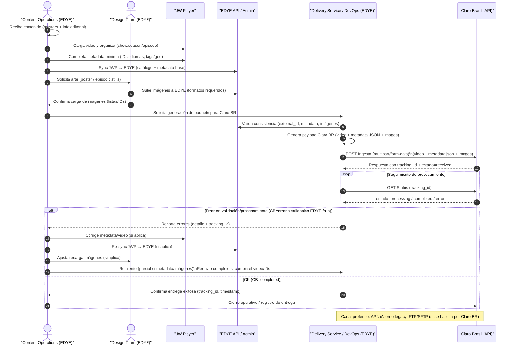
```mermaid
sequenceDiagram
    autonumber
    actor CO as "Content Operations (EDYE)"
    actor DT as "Design Team (EDYE)"
    participant JWP as "JW Player"
    participant API as "EDYE API / Admin"
    participant DD as "Delivery Service / DevOps (EDYE)"
    participant CB as "Claro Brasil (API)"

    CO->>CO: Recibe contenido (masters + info editorial)
    CO->>JWP: Carga video y organiza (show/season/episode)
    CO->>JWP: Completa metadata mínima (IDs, idiomas, tags/geo)
    CO->>API: Sync JWP → EDYE (catálogo + metadata base)

    CO->>DT: Solicita arte (poster / episodic stills)
    DT->>API: Sube imágenes a EDYE (formatos requeridos)
    DT-->>CO: Confirma carga de imágenes (listas/IDs)

    CO->>DD: Solicita generación de paquete para Claro BR
    DD->>API: Valida consistencia (external_id, metadata, imágenes)
    DD->>DD: Genera payload Claro BR (video + metadata JSON + images)

    DD->>CB: POST Ingesta (multipart/form-data)\n(video + metadata.json + images)
    CB-->>DD: Respuesta con tracking_id + estado=received

    loop Seguimiento de procesamiento
        DD->>CB: GET Status (tracking_id)
        CB-->>DD: estado=processing / completed / error
    end

    alt Error en validación/procesamiento (CB=error o validación EDYE falla)
        DD-->>CO: Reporta errores (detalle + tracking_id)
        CO->>JWP: Corrige metadata/video (si aplica)
        CO->>API: Re-sync JWP → EDYE (si aplica)
        CO->>DT: Ajusta/recarga imágenes (si aplica)
        CO->>DD: Reintento (parcial si metadata/imágenes)\nReenvío completo si cambia el video/IDs
    else OK (CB=completed)
        DD-->>CO: Confirma entrega exitosa (tracking_id, timestamp)
        CO-->>CB: Cierre operativo / registro de entrega
    end

    note over DD,CB: Canal preferido: API\nAlterno legacy: FTP/SFTP (si se habilita por Claro BR)
```

> **Figura 1.** _Diagrama del flujo operativo del partner_

---

## 1. Canal de Entrega

**Tipo de entrega:** Híbrida (API + transferencia de archivos)

### 1.1 Métodos soportados

- **API REST (principal)**
- **FTP / SFTP (polling)** _(en proceso de descontinuación)_

### 1.2 Endpoints principales

| Uso                  | Endpoint                                   |
| -------------------- | ------------------------------------------ |
| Ingesta de contenido | `POST /api/ingesta/contenido`              |
| Consulta de estado   | `GET /api/ingesta/status?id={tracking_id}` |

### 1.3 Autenticación

- **Bearer Token**
- Token entregado por Claro Brasil por ambiente (DEV / QA / PROD)

### 1.4 Formato de envío

- `multipart/form-data`
  - Archivo de video
  - JSON de metadata

---

## 2. Estructura y Naming

### 2.1 Estructura lógica de assets

```text
/ingesta/
 └── claro_br/
     └── {external_id}/
         ├── video/
         │   └── {external_id}.mp4
         ├── metadata/
         │   └── {external_id}.json
         └── images/
             ├── poster/
             │   └── {external_id}_poster.jpg
             └── episode/
                 └── {external_id}_ep_{n}.jpg
```

### 2.2 Convenciones de naming

- Sin espacios
- Sin caracteres especiales
- UTF-8 estricto
- Identificador externo consistente entre video, metadata e imágenes

---

## 3. Metadata

### 3.1 Campos obligatorios

| Campo       | Tipo   | Descripción                |
| ----------- | ------ | -------------------------- |
| title       | string | Título del contenido       |
| external_id | string | ID único del contenido     |
| id_cliente  | string | Identificador Claro Brasil |
| duration    | number | Duración en segundos       |
| language    | string | Idioma principal           |
| tms_id      | string | ID Gracenote / TMS         |
| acronym     | string | Acrónimo operativo         |

### 3.2 Ejemplo de JSON

```json
{
  "external_id": "SER123_EP01",
  "title": "Serie Ejemplo - Episodio 1",
  "id_cliente": "CLARO_BR",
  "language": "pt-BR",
  "duration": 1450,
  "tms_id": "SH123456789",
  "acronym": "EDYE",
  "content_type": "episode"
}
```

---

## 4. Imágenes

### 4.1 Tipos requeridos

| Tipo           | Uso      |
| -------------- | -------- |
| Poster         | Serie    |
| Episodic still | Episodio |

### 4.2 Especificaciones

| Tipo     | Resolución   | Ratio | Watermark |
| -------- | ------------ | ----- | --------- |
| Poster   | >= 2000x3000 | 2:3   | No        |
| Episodio | >= 1920x1080 | 16:9  | No        |

---

## 5. Reglas de Validación

### 5.1 Video

- Contenedor: MP4
- Codec: H.264
- Resolución mínima: 1280x720
- Duración máxima: 2 horas
- Audio AAC

### 5.2 Metadata

- JSON válido
- Campos obligatorios presentes
- Sin caracteres especiales invisibles
- UTF-8 estricto

### 5.3 Imágenes

- Cumplimiento de ratio
- Resolución mínima válida
- Naming correcto

---

## 6. Criterios de Aceptación (Operaciones)

Operaciones valida que:

- Video, metadata e imágenes correspondan al mismo external_id
- El estado final del proceso sea completed
- No existan errores de validación
- El tracking ID tenga cierre exitoso
- QC automático sin errores críticos

---

## 7. Reintentos y Rollback

### 7.1 Reintento parcial

Se permite cuando:

- Error de metadata
- Error de imagen
- Fallo de validación no estructural

### 7.2 Reenvío completo

Obligatorio cuando:

- Error de video
- Cambio de archivo maestro
- Inconsistencia de IDs

---

## 8. Estados del Proceso

| Estado     | Descripción         |
| ---------- | ------------------- |
| received   | Archivo recibido    |
| processing | En procesamiento    |
| error      | Fallo en validación |
| completed  | Proceso exitoso     |

---

## 9. Soporte y Escalamiento

### 9.1 Operación EDYE

- Horario: L-V 9:00-18:00 (UTC-5)
- Canal: Slack / Email operativo
- Escalamiento: DevOps EDYE

### 9.2 Partner Claro Brasil

- Equipo técnico Claro BR
- Escalamiento vía ticket / contacto asignado
- Ventana de soporte según SLA del partner

***

\newpage

# Ingesta de Contenidos – Sky Brazil

Este anexo resume los parámetros específicos para Sky Brazil. API es el canal preferido; Aspera se usa solo en flujos file-based cuando se acuerda.

---

## 1. Flujo de Ingesta – Sky Brazil

El siguiente flujo describe el **proceso end-to-end de ingesta y entrega de contenidos hacia Sky Brazil**, partiendo desde la preparación editorial y técnica en EDYE hasta la validación final del partner.
Este flujo es una **implementación específica del modelo genérico de ingesta**, adaptada a los requisitos técnicos y operativos de Sky.

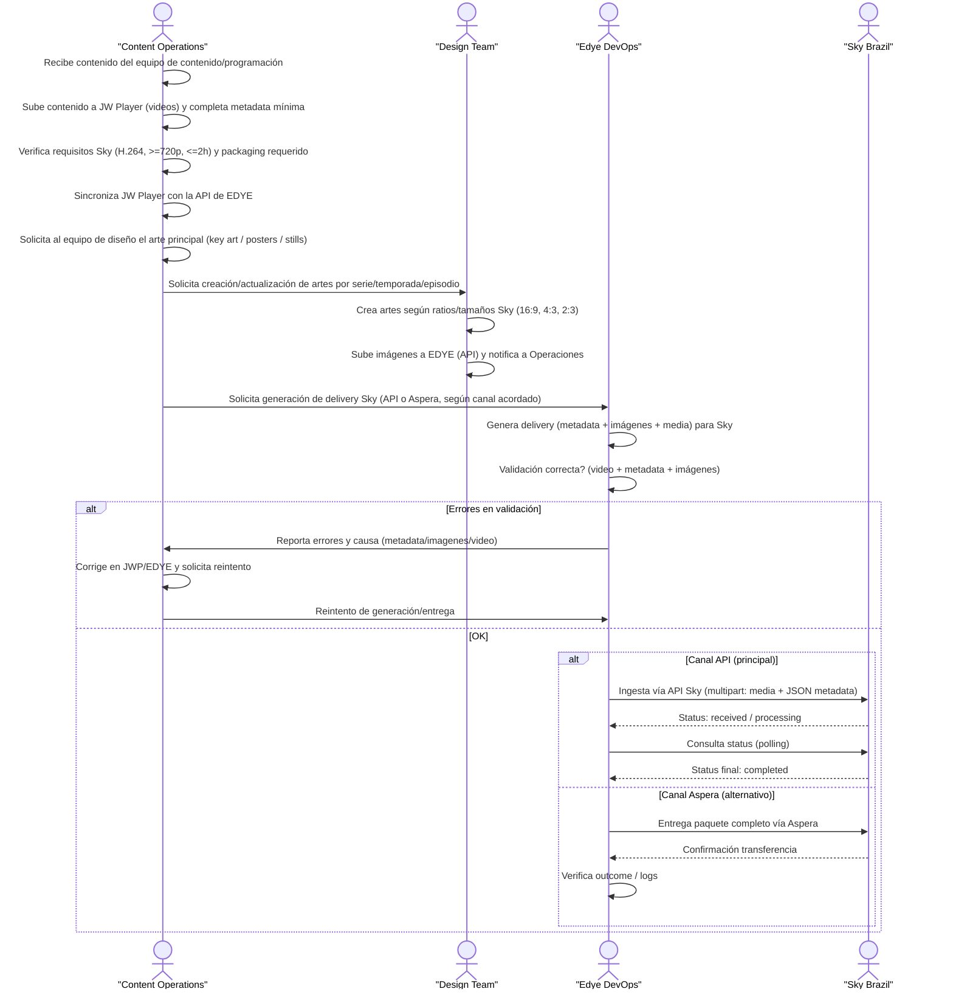
```mermaid
sequenceDiagram
    actor CO as "Content Operations"
    actor DT as "Design Team"
    actor DD as "Edye DevOps"
    actor SB as "Sky Brazil"

    CO->>CO: Recibe contenido del equipo de contenido/programación
    CO->>CO: Sube contenido a JW Player (videos) y completa metadata mínima
    CO->>CO: Verifica requisitos Sky (H.264, >=720p, <=2h) y packaging requerido
    CO->>CO: Sincroniza JW Player con la API de EDYE
    CO->>CO: Solicita al equipo de diseño el arte principal (key art / posters / stills)

    CO->>DT: Solicita creación/actualización de artes por serie/temporada/episodio
    DT->>DT: Crea artes según ratios/tamaños Sky (16:9, 4:3, 2:3)
    DT->>DT: Sube imágenes a EDYE (API) y notifica a Operaciones

    CO->>DD: Solicita generación de delivery Sky (API o Aspera, según canal acordado)
    DD->>DD: Genera delivery (metadata + imágenes + media) para Sky

    DD->>DD: Validación correcta? (video + metadata + imágenes)
    alt Errores en validación
        DD->>CO: Reporta errores y causa (metadata/imagenes/video)
        CO->>CO: Corrige en JWP/EDYE y solicita reintento
        CO->>DD: Reintento de generación/entrega
    else OK
        alt Canal API (principal)
            DD->>SB: Ingesta vía API Sky (multipart: media + JSON metadata)
            SB-->>DD: Status: received / processing
            DD->>SB: Consulta status (polling)
            SB-->>DD: Status final: completed
        else Canal Aspera (alternativo)
            DD->>SB: Entrega paquete completo vía Aspera
            SB-->>DD: Confirmación transferencia
            DD->>DD: Verifica outcome / logs
        end
    end
```

> **Figura 1.** Diagrama del flujo operativo del partner

### Descripción del flujo

1. **Recepción y preparación del contenido**

   - Content Operations recibe contenido aprobado (video + info editorial + disponibilidad).
   - Carga los videos en JW Player con metadata mínima y valida requisitos técnicos Sky (codec, resolución, duración).

2. **Sincronización con EDYE**

   - Tras validar en JWP, se sincronizan los assets con la API de EDYE, dejando a EDYE como capa de orquestación hacia Sky.

3. **Producción y carga de artes**

   - Content Operations solicita a Design Team los artes (posters, key art, stills) con ratios/resoluciones definidas por Sky.
   - Design Team carga las imágenes en EDYE y notifica a Operaciones al completar.

4. **Generación del delivery**

   - Con video, metadata e imágenes disponibles, Edye DevOps genera el delivery para Sky Brazil aplicando reglas del canal elegido (API o Aspera).

5. **Validación técnica**

   - DevOps valida automáticamente: formato y características del video, completitud/consistencia de metadata, presencia y calidad de imágenes.
   - Ante errores, se reporta a Content Operations para corrección y reintento.

6. **Entrega a Sky Brazil**

   - Canal API (principal): ingesta vía API Sky; se monitorea el estado hasta `completed`.
   - Canal Aspera (alterno): se entrega paquete completo vía Aspera y se verifica transferencia/procesamiento.

7. **Cierre y monitoreo**
   - El flujo cierra cuando Sky confirma recepción/procesamiento correcto.
   - Logs y estados de ingesta quedan disponibles para monitoreo/reporting operativo.

---

## 2. Canal de entrega

### Opción A — Ingesta vía API (preferida)

- Tipo: API REST
- Endpoint: `POST /api/ingesta/contenido`
- Autenticación: Bearer Token
- Formato: `multipart/form-data` (media) + JSON (metadata)
- Tracking: el API retorna `id` y se consulta estado por `GET /api/ingesta/status?id={id}`
- Fallback / legado: FTP con polling (plan de deprecación Q3 2025)

### Opción B — Entrega de paquetes vía Aspera (file-based)

- Tipo: Aspera Enterprise Server (push o pull)
- Host: `aspera.engsky.com.br`
- Puertos: TCP 33001 / UDP 33001
- Requisitos onboarding: IP(s) públicas fijas, modalidad push/pull, bandwidth, contactos técnicos/operativos, whitelist y credenciales.
- Nota: mantener API como canal principal; Aspera solo para flujos específicos acordados con Sky/VRIO.

---

## 3. Estructura y naming

### API (Opción A)

- Media: `video.mp4` (H.264)
- Metadata: JSON embebido en el form (`-F metadata='{...}'`)
- Naming recomendado (EDYE):
  - `archivo_media`: `{partner}_{id_cliente}_{assetId}_{lang}_{version}.mp4`
  - `assetId`: estable, sin espacios, sin caracteres especiales invisibles (UTF-8 limpio)

### Aspera / paquetes (Opción B)

Estructura base de paquete (ejemplo):

```text
/PACKAGE_ROOT/
	ADI.XML
	media/      (video)
	images/     (posters/banners)
	subtitles/  (si aplica)
```

Regla clave: solo colocar en la carpeta de entrega paquetes ya conformes (VRIO hace pull/push y dispara procesamiento al descargar).

---

## 4. Metadata

### 3.1 Campos obligatorios (API)

- `titulo`
- `id_cliente`
- `archivo_media`
- `idioma`
- `asset_id`
- `tipo`

### 3.2 Ejemplo JSON (mínimo)

```json
{
  "titulo": "Mi Serie S01E01",
  "id_cliente": "SKYBR",
  "idioma": "es",
  "asset_id": "SERIE_S01E01",
  "tipo": "episode"
}
```

### 3.3 Metadata file-based (Aspera)

- Basada en CableLabs 1.1 con estructura ADI.XML (Title, Movie, Poster, Preview, etc., según alcance Sky/VRIO).

---

## 5. Imágenes

- Formato: JPG
- Regla editorial: 16:9 y 4:3 para carruseles/PDP sin texto para evitar sobrecarga visual.
- Watermark / labels: no requerido; labels visuales solo si se acuerda con curación.

### 4.1 Movies (mínimos)

| Ratio | Resolución | Preferencia                                                     |
| ----- | ---------- | --------------------------------------------------------------- |
| 16:9  | 1920x1080  | Iconic > Key Art > VOD Art > Banner-L2 (sin texto)              |
| 4:3   | 1440x1080  | Iconic > Key Art > VOD Art > Banner-L2 (sin texto)              |
| 2:3   | 1280x1920  | Poster Art > VOD Art > Key Art > Banner-L1 (puede llevar texto) |

### 4.2 Shows (mínimos)

| Ratio | Resolución | Preferencia                                |
| ----- | ---------- | ------------------------------------------ |
| 16:9  | 1920x1080  | Iconic > Banner-L1 > Banner-L2 (sin texto) |
| 4:3   | 1440x1080  | Iconic > Banner-L1 > Banner-L2 (sin texto) |
| 2:3   | 1280x1920  | Poster / VOD Art                           |

### 4.3 Episodes (mínimos)

| Ratio | Resolución | Preferencia                        |
| ----- | ---------- | ---------------------------------- |
| 16:9  | 1920x1080  | Iconic Art (screen grab) sin texto |
| 4:3   | 1440x1080  | Puede ser crop del 16:9            |
| 2:3   | 1280x1920  | Puede ser crop del 16:9            |

---

## 6. Reglas de validación

### 5.1 API (Sky Brazil)

- Resolución mínima: 720p
- Duración máxima: 2h
- Codificación: H.264
- Estados: `received | processing | error | completed`

### 5.2 Aspera / VRIO (file-based)

- Wrappers/codecs aceptados según spec (ej. TS + H.264/AVC + AC3, etc.).
- Subtítulos SRT: sin tags HTML `<b>` `<i>`, guardados en filesystem tipo Windows/DOS.

---

## 7. Criterios de aceptación

### 6.1 Aceptación técnica (Operaciones)

- Ingesta API responde `200 OK` con `{ "status": "received", "id": "..." }`.
- `GET /api/ingesta/status?id=...` llega a `completed` en la ventana esperada (referencia 3–5 min/archivo).
- Sin errores de validación por formato no soportado o metadata incompleta.

### 6.2 Aceptación visual

- Cumple ratios/tamaños mínimos y reglas sin texto donde aplica.

---

## 8. Reintentos / rollback

### 7.1 API

- Falla por metadata incompleta: corregir metadata y reintentar `POST` (mismo `asset_id`).
- Falla por formato/codec/duración: corregir media fuente y reingestar (nuevo archivo).
- Reintentos recomendados: máximo N (definir) antes de escalar.

### 7.2 Aspera

- Si un paquete ya fue pull/push y resulta inválido: reenvío completo del paquete (no incremental) para evitar estados inconsistentes.

---

## 9. Soporte, contactos, horarios, escalamiento

### Monitoreo / logs

- Logs: Elastic/Kibana > IngestaLogs
- Alertas críticas: >10 errores consecutivos por cliente

### Contactos (pendiente completar)

- Sky/VRIO NOC / Engineering Network Team (Aspera): TBD
- Operaciones EDYE: TBD
- Escalamiento DevOps EDYE: TBD
- Horario operativo y ventana de despliegues: TBD

***

\newpage

# Ingesta de Contenidos – Whatch Brazil

**Partner:** Watch Brazil  
**Tipo de integración:** Ingesta VOD  
**Estado:** Activo

Este anexo complementa el **flujo genérico de Ingesta EDYE** y define únicamente las
configuraciones específicas requeridas por el partner **Watch Brazil**.  
El flujo operativo, validaciones generales y responsabilidades base se rigen por el
documento de Ingesta estándar.

---

## 1. Flujo de Ingesta – Sky Brazil

El siguiente flujo describe el **proceso end-to-end de ingesta y entrega de contenidos hacia Sky Brazil**, partiendo desde la preparación editorial y técnica en EDYE hasta la validación final del partner.
Este flujo es una **implementación específica del modelo genérico de ingesta**, adaptada a los requisitos técnicos y operativos de Sky.

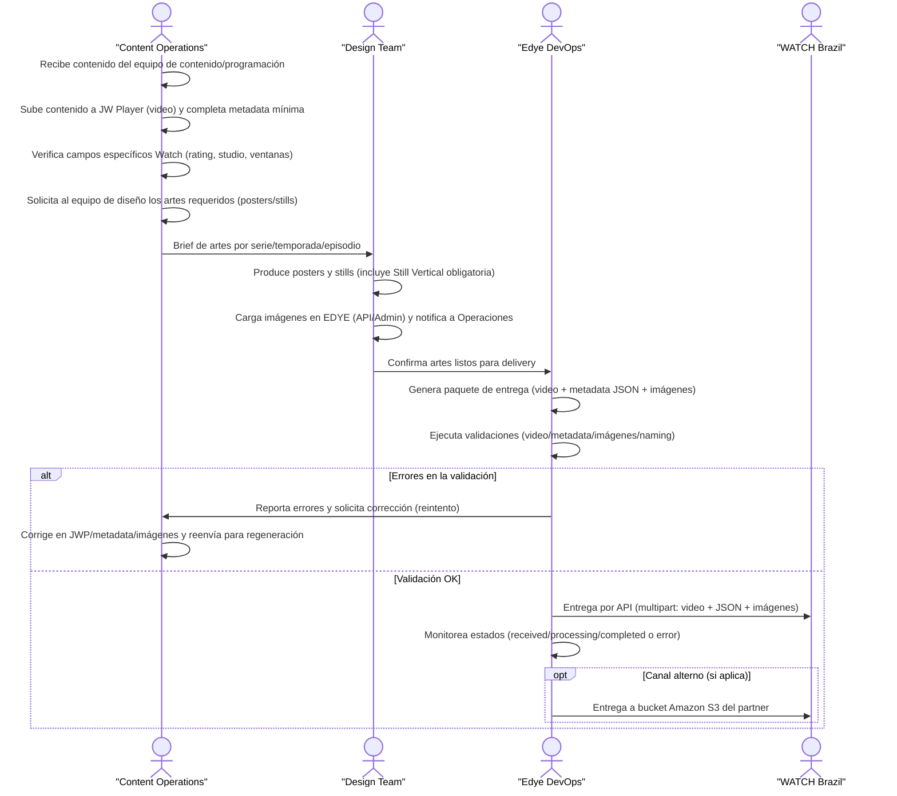
```mermaid
sequenceDiagram
    actor CO as "Content Operations"
    actor DT as "Design Team"
    actor DD as "Edye DevOps"
    actor WB as "WATCH Brazil"

    CO->>CO: Recibe contenido del equipo de contenido/programación
    CO->>CO: Sube contenido a JW Player (video) y completa metadata mínima
    CO->>CO: Verifica campos específicos Watch (rating, studio, ventanas)
    CO->>CO: Solicita al equipo de diseño los artes requeridos (posters/stills)

    CO->>DT: Brief de artes por serie/temporada/episodio
    DT->>DT: Produce posters y stills (incluye Still Vertical obligatoria)
    DT->>DT: Carga imágenes en EDYE (API/Admin) y notifica a Operaciones
    DT->>DD: Confirma artes listos para delivery

    DD->>DD: Genera paquete de entrega (video + metadata JSON + imágenes)
    DD->>DD: Ejecuta validaciones (video/metadata/imágenes/naming)

    alt Errores en la validación
        DD->>CO: Reporta errores y solicita corrección (reintento)
        CO->>CO: Corrige en JWP/metadata/imágenes y reenvía para regeneración
    else Validación OK
        DD->>WB: Entrega por API (multipart: video + JSON + imágenes)
        DD->>DD: Monitorea estados (received/processing/completed o error)
        opt Canal alterno (si aplica)
            DD->>WB: Entrega a bucket Amazon S3 del partner
        end
    end
```

> **Figura 1.** Diagrama del flujo operativo del partner

# Flujo de Ingesta – Watch Brazil

1. **Recepción del contenido**  
   Content Operations recibe el contenido audiovisual desde programación o proveedores.

2. **Carga en JW Player**  
   El video se carga en JW Player y se completa la metadata mínima, incluyendo los campos específicos requeridos por Watch Brazil.

3. **Solicitud y creación de artes**  
   Content Operations solicita al Design Team los posters y stills; el equipo de diseño produce y carga los artes requeridos.

4. **Confirmación de assets**  
   Una vez cargadas las imágenes, el Design Team notifica a Edye DevOps que los assets están listos para delivery.

5. **Generación del paquete**  
   Edye DevOps consolida el paquete completo de entrega (video, metadata e imágenes).

6. **Validación técnica**  
   Se ejecutan validaciones de video, metadata, imágenes, naming y estructura del delivery.

7. **Correcciones (si aplica)**  
   Si hay errores, se reportan a Content Operations, se corrige el contenido y se regenera el paquete.

8. **Entrega al partner**  
   Con validación exitosa, Edye DevOps entrega el contenido a Watch Brazil (API y, si aplica, Amazon S3) y confirma el cierre del proceso.

---

## 2. Canal de entrega

**Método principal:**

- **API REST (POST multipart/form-data)**

**Métodos alternativos / heredados:**

- FTP con polling (en proceso de desuso)

**Autenticación:**

- Bearer Token

**Endpoint principal:**

```text
POST /api/ingesta/contenido
```

**Formato:**

- Video: MP4 (H.264)
- Metadata: JSON (multipart)

---

## 3. Estructura y naming

### Estructura lógica del delivery

```text
/ingesta/
├── video/
│   └── <content_id>.mp4
├── metadata/
│   └── <content_id>.json
└── images/
	├── poster_horizontal.jpg
	├── poster_vertical.jpg
	├── still_horizontal.jpg
	└── still_vertical.jpg
```

### Reglas de naming

- Un **content_id único** por asset
- Nombres sin espacios
- Solo caracteres ASCII
- Consistencia entre video, metadata e imágenes

---

## 4. Metadata

### Campos obligatorios (JSON)

| Campo                    | Descripción                  |
| ------------------------ | ---------------------------- |
| `title`                  | Título del contenido         |
| `id_cliente`             | Identificador del partner    |
| `rating`                 | Clasificación etaria         |
| `studio`                 | Debe ser **Edye**            |
| `studio_name`            | Debe ser **Edye**            |
| `licensing_window_start` | Fecha + hora (ISO 8601)      |
| `licensing_window_end`   | Fecha + hora (ISO 8601)      |
| `actors_display`         | Lista consolidada de actores |

**Reglas especiales Watch Brazil:**

- El campo `rating` **no acepta valores numéricos simples**
- Debe enviarse como:
  - `A12`, `AL`, `12` o `L`
- `studio` y `studio_name` **deben forzarse a “Edye”**

### Ejemplo JSON mínimo

```json
{
  "title": "Tipo Rato",
  "id_cliente": "watch_br",
  "rating": "L",
  "studio": "Edye",
  "studio_name": "Edye",
  "licensing_window_start": "2025-07-15T00:00:00",
  "licensing_window_end": "2026-07-15T23:59:59",
  "actors_display": "Actor 1, Actor 2, Actor 3"
}
```

---

## 5. Imágenes

### Imágenes requeridas (obligatorias)

| Tipo              | Resolución | Ratio    |
| ----------------- | ---------- | -------- |
| Poster Horizontal | 3840x2160  | 16:9     |
| Poster Vertical   | 1708x2562  | Vertical |
| Still Horizontal  | 3840x2160  | 16:9     |
| Still Vertical    | 1708x2562  | Vertical |

> ⚠️ La imagen **Still Vertical** es obligatoria. Sin este asset, la Still Horizontal será recortada en aplicaciones mobile.

- Watermark: No obligatorio
- Referencia técnica: Specs XML and Images - Edye

---

## 6. Reglas de validación

### Video

- Codec: H.264
- Resolución mínima: 720p
- Duración máxima: 2 horas

### Metadata

- Campos obligatorios completos
- Fechas con timestamp
- Codificación UTF-8 (sin caracteres invisibles rotos)

### Imágenes

- Resoluciones exactas
- Ratio correcto
- Todos los tipos requeridos presentes

---

## 7. Criterios de aceptación (Operaciones)

El delivery se considera **ACEPTADO** cuando:

- El endpoint responde `200 OK`
- Estado final: `completed`
- No existen errores de validación
- Metadata e imágenes coinciden con el video entregado
- QC automatizado sin fallos críticos

Estados posibles: `received`, `processing`, `error`, `completed`

Referencia técnica: ESP-INT Ingesta Watch Brazil

---

## 8. Reintentos y rollback

### Reintento parcial

Se permite cuando:

- Error de metadata
- Error de imágenes
- Corrección sin cambio de video

### Reenvío completo

Requerido cuando:

- Cambia el archivo de video
- Error estructural de naming
- Inconsistencia entre assets

---

## 9. Soporte y escalamiento

### Contactos

- Partner – Watch Brazil: Henrique Weber — henrique.weber@watch.tv.br
- EDYE – Operaciones: Equipo DevOps / Content Operations

### Horario de soporte

- Lunes a Viernes, horario laboral Brasil (BRT)

### Escalamiento

- Operaciones EDYE
- DevOps EDYE
- Contacto técnico Watch Brazil

***

\newpage

# Ingesta de Contenidos – VTR

## 1. Flujo de Ingesta – VTR

Este flujo describe el proceso de integración por ingesta con el partner VTR, siguiendo el modelo estándar de EDYE. El objetivo es asegurar que los contenidos audiovisuales (video, metadata e imágenes) cumplan con los requisitos técnicos y operativos definidos por VTR antes de ser ingeridos, procesados y marcados como `completed` en su plataforma.

El flujo está diseñado para ser reutilizable y controlado, incorporando validaciones tempranas, manejo de errores y reintentos, y soportando dos canales de entrada:

- **API REST (principal)**
- **FTP con polling (legado / transitorio)**

De esta manera, Operaciones, Diseño y DevOps trabajan de forma coordinada para garantizar una ingesta estable, trazable y con visibilidad de estado en cada etapa.

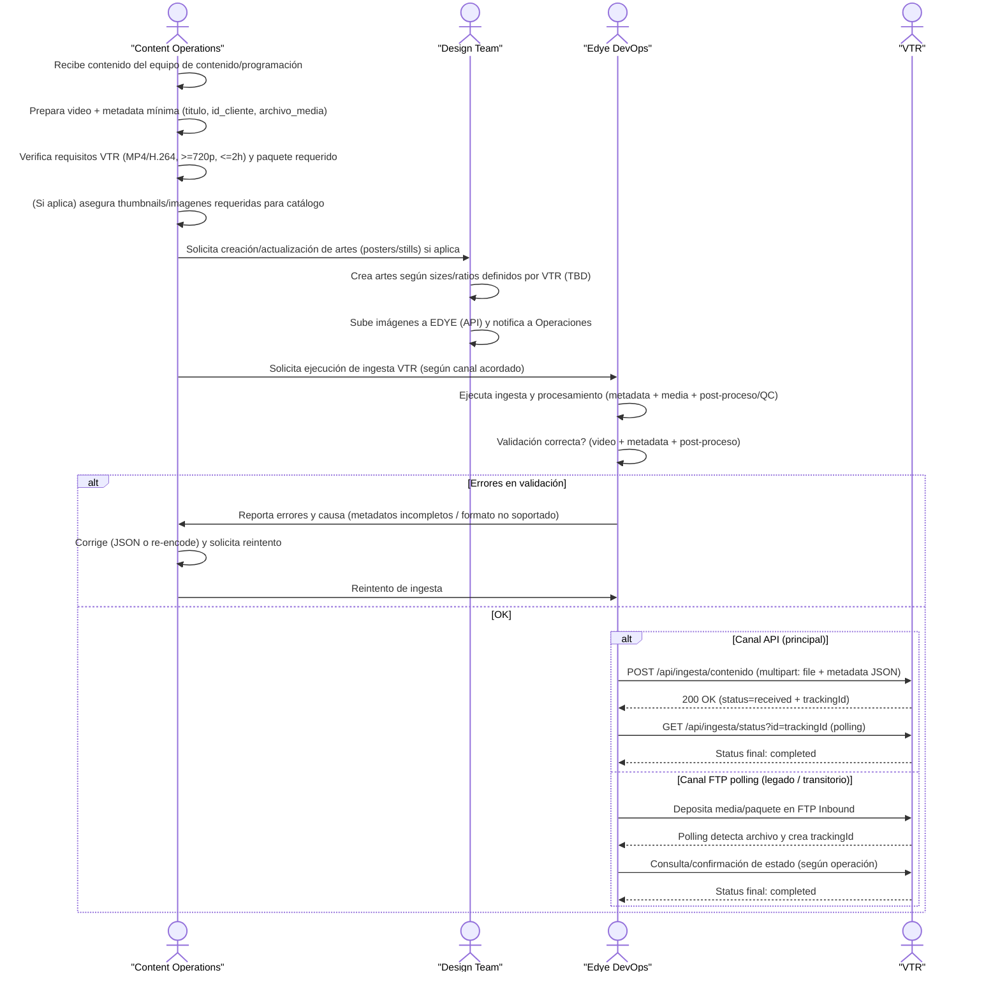
```mermaid
sequenceDiagram
    actor CO as "Content Operations"
    actor DT as "Design Team"
    actor DD as "Edye DevOps"
    actor VTR as "VTR"

    CO->>CO: Recibe contenido del equipo de contenido/programación
    CO->>CO: Prepara video + metadata mínima (titulo, id_cliente, archivo_media)
    CO->>CO: Verifica requisitos VTR (MP4/H.264, >=720p, <=2h) y paquete requerido
    CO->>CO: (Si aplica) asegura thumbnails/imagenes requeridas para catálogo

    CO->>DT: Solicita creación/actualización de artes (posters/stills) si aplica
    DT->>DT: Crea artes según sizes/ratios definidos por VTR (TBD)
    DT->>DT: Sube imágenes a EDYE (API) y notifica a Operaciones

    CO->>DD: Solicita ejecución de ingesta VTR (según canal acordado)
    DD->>DD: Ejecuta ingesta y procesamiento (metadata + media + post-proceso/QC)

    DD->>DD: Validación correcta? (video + metadata + post-proceso)
    alt Errores en validación
        DD->>CO: Reporta errores y causa (metadatos incompletos / formato no soportado)
        CO->>CO: Corrige (JSON o re-encode) y solicita reintento
        CO->>DD: Reintento de ingesta
    else OK
        alt Canal API (principal)
            DD->>VTR: POST /api/ingesta/contenido (multipart: file + metadata JSON)
            VTR-->>DD: 200 OK (status=received + trackingId)
            DD->>VTR: GET /api/ingesta/status?id=trackingId (polling)
            VTR-->>DD: Status final: completed
        else Canal FTP polling (legado / transitorio)
            DD->>VTR: Deposita media/paquete en FTP Inbound
            VTR-->>DD: Polling detecta archivo y crea trackingId
            DD->>VTR: Consulta/confirmación de estado (según operación)
            VTR-->>DD: Status final: completed
        end
    end
```

> **Figura 1.** Diagrama del flujo operativo del partner

## Descripción paso a paso del flujo de ingesta VTR

1. **Recepción del contenido**  
   El equipo de Content Operations recibe el contenido audiovisual desde Programación o Contenidos (series, temporadas, episodios).

2. **Preparación de video y metadata mínima**  
   Content Operations prepara el archivo de video y completa la metadata obligatoria requerida por VTR (por ejemplo: título, identificador de cliente y referencia al archivo de media).

3. **Validación previa de requisitos técnicos**  
   Antes de iniciar la ingesta, se verifica que el contenido cumpla con las especificaciones técnicas de VTR, como formato MP4/H.264, resolución mínima de 720p y duración máxima permitida.

4. **Gestión de imágenes y artes (si aplica)**  
   En caso de requerirse artes editoriales, Content Operations solicita al Design Team la creación o actualización de posters, stills u otros assets gráficos. El equipo de diseño genera las imágenes según los tamaños y ratios definidos por VTR y las carga en EDYE.

5. **Solicitud de ejecución de ingesta**  
   Una vez validados video, metadata e imágenes, Content Operations solicita a Edye DevOps la ejecución del proceso de ingesta hacia VTR, utilizando el canal acordado.

6. **Ejecución de la ingesta y procesamiento**  
   Edye DevOps ejecuta la ingesta, enviando el contenido mediante la API de VTR (canal principal) o a través de FTP con polling (canal alternativo). Durante esta etapa se procesan el video, la metadata y el post-proceso automático (QC y generación de thumbnails).

7. **Validación del resultado**  
   DevOps valida que la ingesta se haya completado correctamente, revisando el estado del proceso (`received`, `processing`, `error` o `completed`) y confirmando que no existan fallas en video, metadata o procesamiento.

8. **Manejo de errores y reintentos**  
   Si se detectan errores (por ejemplo, metadata incompleta o formato de video no soportado), DevOps reporta la causa a Content Operations. El equipo corrige los insumos necesarios y solicita un reintento de la ingesta.

9. **Cierre exitoso de la ingesta**  
   Cuando el estado final es `completed`, se confirma el cierre operativo del flujo. El contenido queda correctamente ingerido en VTR y el proceso se registra para monitoreo, reporting y auditoría.

---

## 1. Canal de entrega

### Modelo de entrada (ingesta)

- **API REST (principal):** `POST /api/ingesta/contenido`
- **Autenticación:** Bearer Token
- **Payload:** `multipart/form-data` con:
  - `file` (media)
  - `metadata` (JSON)
- **Tracking:** respuesta inicial entrega un id (tracking ID), luego consulta por `GET /api/ingesta/status?id=xxx`

> **⚠️ FTP con polling (legado / en transición):**
>
> Punto de entrada histórico, en proceso de descontinuación Q3 2025 (confirmar si aplica aún en PROD).

### Flujo híbrido (operación histórica)

- VTR como Hybrid Delivery (Manual + API): videos en folders en Aspera; la API toma los videos, genera metadata y sube con imágenes a HITN Aspera; el delivery final para VTR incluye imágenes + metadata.
- Nota: mantener ambos flujos en el anexo para evitar confusión de equipos.

### Ambientes

- Desarrollo, QA, Producción.
- Token de prueba para sandbox: `abc123` (no exponer secretos reales).

### Endpoints de OAuth/entitlement (no ingesta, pero útil para soporte):

- Endpoints de OAuth/token/logout y autorización para validación integral del partner.

---

## 2. Estructura y naming

La ingesta por API no define árbol de carpetas ni naming de archivos. Se propone base para estandarizar (TBD validar con VTR):

```text
/VTR/INBOUND/VIDEOS/YYYY/MM/DD/
	SERIES_<externalId>_S<season>_E<episode>_<lang>_<version>.mp4
/VTR/INBOUND/METADATA/YYYY/MM/DD/
	SERIES_<externalId>_S<season>_E<episode>_<lang>.json
/VTR/INBOUND/IMAGES/YYYY/MM/DD/
	SERIES_<externalId>_poster_<WxH>.jpg
	SERIES_<externalId>_S<season>_E<episode>_still_<WxH>.jpg
```

**Reglas mínimas recomendadas de naming:**

- Sin tildes / caracteres invisibles; UTF-8 consistente.
- Sin espacios; usar `_` o `-`.
- IDs estables (ideal: `externalId` o `id_cliente` + un `contentId` propio del catálogo).

---

## 3. Metadata

### Campos obligatorios

- `titulo`
- `id_cliente`
- `archivo_media`

### Ejemplo JSON mínimo

```json
{
  "titulo": "Nombre del contenido",
  "id_cliente": "VTR",
  "archivo_media": "video.mp4",
  "tipo": "episode",
  "content_id": "ext-12345",
  "serie": "Serie X",
  "temporada": 1,
  "episodio": 3,
  "idioma": "es",
  "rating": "G",
  "duracion_seg": 1320,
  "sinopsis": "Descripción corta para catálogo.",
  "tags": ["kids", "comedy"]
}
```

---

## 4. Imágenes

### Especificación técnica

- En procesamiento posterior: creación de thumbnails y QC automatizado. No define tamaños/ratios específicos.

### Flujo operativo (híbrido)

- Delivery histórico: imágenes + metadata como entregables.

### Plantilla de imágenes (TBD por VTR)

- Posters (serie)
- Stills (episodio)
- Thumbnails derivados (si VTR consume thumbs específicos)

### Watermark

- No especificado (TBD)

---

## 5. Reglas de validación

### Video

- Resolución mínima: 720p
- Duración máxima: 2h
- Codificación: H.264
- Contenedor/Tipo: MP4 H.264

### Metadata

- “Metadatos incompletos” figura como error común.

### Imágenes

- No hay reglas explícitas (TBD), aunque se generan thumbnails en el post-proceso.

### Estados del proceso (API)

- `received`, `processing`, `error`, `completed`

### Errores comunes (API)

- Formato no soportado
- Metadatos incompletos

---

## 6. Criterios de aceptación

### Operaciones EDYE valida:

- El `POST /api/ingesta/contenido` responde `200 OK` con `status: received` e id válido.
- El `GET /api/ingesta/status?id=xxx` llega a `completed`.
- Validación técnica de media: `MP4/H.264, >=720p`, duración `<=2h`.
- Validación de metadata: `titulo`, `id_cliente`, `archivo_media` presentes y coherentes.
- Evidencia de post-proceso: thumbnails generados / QC automático sin fallas (según logs/monitoreo).
- Si aplica flujo híbrido de delivery (imágenes+metadata): confirmación de disponibilidad del paquete final según canal definido (Aspera).

---

## 7. Reintentos / rollback

### Reintentos recomendados (ingesta API)

- Si el estado queda en error por:
  - “Formato no soportado” → re-encode / reemplazar archivo y reingestar.
  - “Metadatos incompletos” → corregir JSON y reingestar.

### Regenerar vs reenviar completo (criterio práctico)

- Regenerar (parcial) cuando el media es válido y el problema fue metadata (cambio en JSON) o un campo faltante.
- Reenviar completo cuando cambia el archivo de video (nuevo encode) o cambian insumos que afectan thumbnails/QC.

### Rollback

- En ingesta, el “rollback” típico es: invalidar/retirar el asset en el catálogo (si ya propagó), y reingestar versión corregida con nuevo tracking.
- No se define endpoint de “delete/rollback” para ingesta (TBD).

---

## 8. Soporte

### Monitoreo / logs

- Logs: Elastic/Kibana > IngestaLogs
- Indicadores: tiempo de procesamiento, % fallos por cliente.
- Alertas críticas: >10 errores consecutivos por cliente.

### Sistemas involucrados (para triage)

- Ingest Processor
- Metadata Parser
- Media Transcoder
- Dependencias: S3 bucket, AWS Lambda, Kafka

### Escalamiento sugerido (EDYE)

- Operaciones de Contenido: valida inputs (metadata mínima + archivo).
- Equipo técnico de Integraciones/Backend: revisa logs + estado por tracking ID.
- DevOps: incidentes de infraestructura (S3/Lambda/Kafka), degradación o colas.

### Contactos / horario

- No vienen en los documentos adjuntos → TBD (añadir: nombre, email, Slack/Teams, horario, y “on-call” si aplica).

---

## 9. Notas finales específicas de VTR

- Mantener visible la dualidad:
  - Ingesta (entrada a EDYE vía API/FTP)
  - Delivery operativo/histórico (videos en Aspera + entrega de imágenes/metadata)

***

\newpage

# Ingesta de Contenidos –  ROKU Premium

## Descripción general del flujo de integración

El siguiente diagrama describe el **flujo de integración por ingesta con el partner ROKU**, basado en el modelo estándar de Edye y adaptado a los requerimientos específicos del canal. El proceso cubre de extremo a extremo la preparación, validación y entrega de contenidos audiovisuales, desde la recepción del material por parte de Content Operations hasta la confirmación final de ingesta por ROKU.

El flujo contempla como **canal principal la ingesta vía API de ROKU**, utilizando un esquema `multipart` que combina media y metadata en formato JSON, con mecanismos de **seguimiento por estado (polling)** hasta su finalización. De forma controlada, también se considera un **canal alternativo/legado vía FTP**, únicamente en escenarios excepcionales.

A lo largo del proceso se integran controles de calidad sobre **video, metadata e imágenes**, con ciclos claros de corrección y reintento en caso de errores, garantizando trazabilidad, consistencia operativa y alineación con las especificaciones técnicas del partner. Este diagrama sirve como referencia única y reutilizable para operaciones, diseño y DevOps durante la ejecución y soporte de la integración con ROKU.

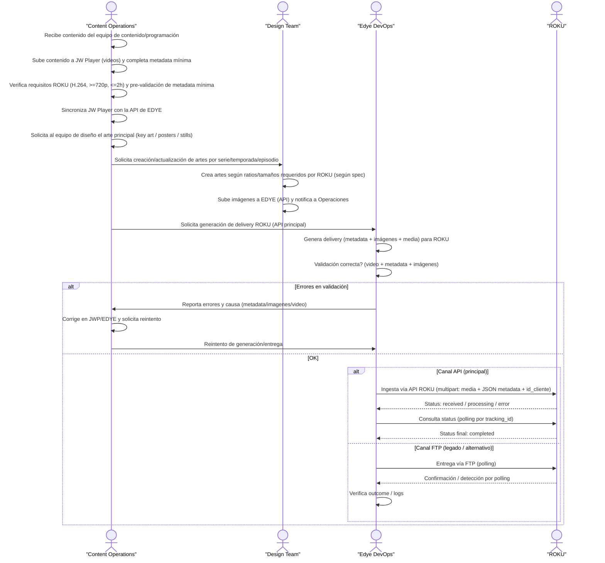
```mermaid
sequenceDiagram
    actor CO as "Content Operations"
    actor DT as "Design Team"
    actor DD as "Edye DevOps"
    actor RK as "ROKU"

    CO->>CO: Recibe contenido del equipo de contenido/programación
    CO->>CO: Sube contenido a JW Player (videos) y completa metadata mínima
    CO->>CO: Verifica requisitos ROKU (H.264, >=720p, <=2h) y pre-validación de metadata mínima
    CO->>CO: Sincroniza JW Player con la API de EDYE
    CO->>CO: Solicita al equipo de diseño el arte principal (key art / posters / stills)

    CO->>DT: Solicita creación/actualización de artes por serie/temporada/episodio
    DT->>DT: Crea artes según ratios/tamaños requeridos por ROKU (según spec)
    DT->>DT: Sube imágenes a EDYE (API) y notifica a Operaciones

    CO->>DD: Solicita generación de delivery ROKU (API principal)
    DD->>DD: Genera delivery (metadata + imágenes + media) para ROKU
    DD->>DD: Validación correcta? (video + metadata + imágenes)

    alt Errores en validación
        DD->>CO: Reporta errores y causa (metadata/imagenes/video)
        CO->>CO: Corrige en JWP/EDYE y solicita reintento
        CO->>DD: Reintento de generación/entrega
    else OK
        alt Canal API (principal)
            DD->>RK: Ingesta vía API ROKU (multipart: media + JSON metadata + id_cliente)
            RK-->>DD: Status: received / processing / error
            DD->>RK: Consulta status (polling por tracking_id)
            RK-->>DD: Status final: completed
        else Canal FTP (legado / alternativo)
            DD->>RK: Entrega vía FTP (polling)
            RK-->>DD: Confirmación / detección por polling
            DD->>DD: Verifica outcome / logs
        end
    end
```
> **Figura 1.** Diagrama del flujo operativo del partner

## 1. Canal de entrega

**Método principal (recomendado / vigente):** API REST (Ingesta VOD)

- Endpoint: `POST /api/ingesta/contenido`
- Auth: Bearer Token
- Formato: `multipart/form-data` (media) + JSON (metadata)
- Status/tracking: `GET /api/ingesta/status?id=xxx` (usa Tracking ID retornado por la ingesta)
- Token (Sandbox): `abc123` (ejemplo)
- Token (Prod): TBD (por Roku)
- Base URL (QA/Prod): TBD
- Cliente/tenant: `id_cliente` (definido por operaciones/partner)

**Método alterno (legado):** FTP con polling (en desuso, será descontinuado Q3 2025)

**Referencia oficial:**

- [Especificación de ingesta (Roku Developer)](https://developer.roku.com/es-mx/trc-docs/video-on-demand/delivery/ingest-specifications.md)

---

## 2. Estructura y naming

**Modelo API:** No requiere árbol de carpetas.

**Convención recomendada (interno Edye → entrega a Roku):**

- Archivo de video: `external_id` o `title_id` + variante idioma/temporada/episodio si aplica

**Ejemplos:**

- `EDYE_S01E03_ES.mp4`
- `EDYE_MOV_000123_EN.mp4`

**Idempotencia / reintentos:** Mantener mismo identificador lógico (`external_id`) para rastrear reenvíos.

Si Roku exige estructura de archivos/paquetes, referenciar y alinear con su spec oficial.

---

## 3. Metadata

**Campos obligatorios mínimos:**

- `titulo`
- `id_cliente`
- `archivo_media` (en el multipart/form-data)

**Formato de envío:**

- `file=@video.mp4`
- `metadata='{...json...}'`

**Ejemplo de request:**

```http
POST /api/ingesta/contenido
Authorization: Bearer <token>
Content-Type: multipart/form-data

file: video.mp4
metadata: JSON
```

**Ejemplo JSON (mínimo + recomendado):**

```json
{
  "titulo": "Edye - Episodio 3",
  "id_cliente": "roku_premium_subs_mx",
  "external_id": "EDYE_S01E03_ES",
  "idioma": "es",
  "tipo": "episode",
  "temporada": 1,
  "episodio": 3,
  "duracion_seg": 1320,
  "rating": "TV-Y7",
  "generos": ["kids", "education"],
  "synopsis_corta": "Descripción breve del episodio."
}
```

> Nota: el doc técnico solo fija mínimos (`titulo`, `id_cliente`). El resto es extensión operativa para trazabilidad/QA. Si Roku exige esquema exacto, se ajusta a su spec.

---

## 4. Imágenes

En el flujo documentado, el procesamiento posterior incluye creación de thumbnails (automatizado).

**A completar por partner (ver guía oficial):**

- Tipos de imágenes requeridas: posters / cover / background / episodic stills / logo, etc.
- Tamaños/ratios: TBD (según Roku)
- Watermark: Sí/No (según acuerdo)

Si el modelo final exige “package” con artwork + metadata, dejar explícito aquí y vincular la spec.

---

## 5. Reglas de validación

**Video:**

- Resolución mínima: 720p
- Duración máxima: 2 horas
- Codec: H.264
- Formato: MP4 H.264 + JSON metadata

**Proceso/negocio:**

- Estados: `received`, `processing`, `error`, `completed`
- Errores comunes: formato no soportado, metadatos incompletos

**Imágenes:**

- Si Roku recibe imágenes, validar contra tamaños/ratio/watermark exigidos en la spec oficial.

---

## 6. Criterios de aceptación

Operaciones/QA debe confirmar como **ACEPTADO** cuando:

- Ingesta responde `200 OK` con `status=received` y Tracking ID
- El status del Tracking ID llega a `completed` (sin error)
- Cumple validaciones mínimas: H.264, ≥720p, ≤2h
- Metadata mínima completa (al menos `titulo`, `id_cliente`)
- QC/thumbnails generados OK (según logs)

---

## 7. Reintentos / rollback

**Reintentar (sin regenerar master) cuando:**

- Error por metadatos incompletos → corregir JSON y reenviar
- Error transitorio de red/timeouts → reenviar misma media + metadata (con mismo `external_id`)

**Regenerar media (nuevo encode) cuando:**

- Error por formato/codificación no soportada o falla de validación (codec/resolución/duración)

**Rollback (operativo):**

- Suele ser despublicación o corrección con reingesta del asset (si Roku lo permite por spec/operación)

---

## 8. Soporte

**Contactos a completar:**

- Roku Partner / Ops: Nombre + email + canal (Slack/Teams) — TBD
- Edye Content Operations: responsable de carga y validación
- Edye DevOps / Integraciones: monitoreo, troubleshooting, reintentos

**Monitoreo / logs:**

- Logs: Elastic/Kibana → IngestaLogs
- Alertas críticas: más de 10 errores consecutivos por cliente

**Horario y SLA:** TBD (definir por acuerdo operativo con Roku)

***

\newpage

# Ingesta de Contenidos – Directv

## Descripción general del flujo de ingesta

El siguiente diagrama de secuencia de ingesta para DIRECTV describe el proceso completo de entrega de contenidos desde Edye hacia el partner, utilizando un modelo API-driven y altamente automatizado.
El objetivo del flujo es asegurar que cada asset audiovisual cumpla con los requisitos técnicos, de metadata y de procesamiento antes de ser aceptado por DIRECTV, manteniendo trazabilidad, control de errores y criterios claros de reintento.

Este flujo se apoya en un pipeline asíncrono, donde la ingesta inicial, el procesamiento y la validación final están desacoplados, permitiendo escalar volumen y reducir intervención manual.

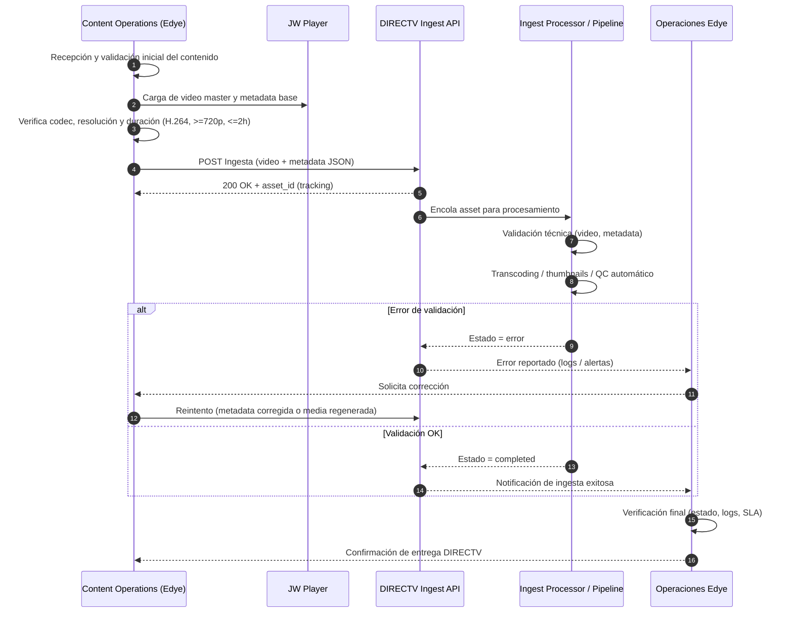
```mermaid
sequenceDiagram
    autonumber

    participant CO as Content Operations (Edye)
    participant JWP as JW Player
    participant API as DIRECTV Ingest API
    participant PROC as Ingest Processor / Pipeline
    participant OPS as Operaciones Edye

    %% Pre-ingesta
    CO->>CO: Recepción y validación inicial del contenido
    CO->>JWP: Carga de video master y metadata base
    CO->>CO: Verifica codec, resolución y duración (H.264, >=720p, <=2h)

    %% Ingesta
    CO->>API: POST Ingesta (video + metadata JSON)
    API-->>CO: 200 OK + asset_id (tracking)

    %% Procesamiento
    API->>PROC: Encola asset para procesamiento
    PROC->>PROC: Validación técnica (video, metadata)
    PROC->>PROC: Transcoding / thumbnails / QC automático

    %% Validación
    alt Error de validación
        PROC-->>API: Estado = error
        API-->>OPS: Error reportado (logs / alertas)
        OPS-->>CO: Solicita corrección
        CO->>API: Reintento (metadata corregida o media regenerada)
    else Validación OK
        PROC-->>API: Estado = completed
        API-->>OPS: Notificación de ingesta exitosa
    end

    %% Cierre
    OPS->>OPS: Verificación final (estado, logs, SLA)
    OPS-->>CO: Confirmación de entrega DIRECTV
```

> **Figura 1.** Diagrama del flujo operativo del partner

## Explicación de la secuencia paso a paso

1. **Recepción y pre-validación del contenido**  
   Content Operations recibe el contenido y realiza una verificación básica previa (formato, duración, resolución), asegurando que el material esté listo para ser ingestado.

2. **Carga y preparación del asset**  
   El video master y la metadata base son preparados (y, si aplica, gestionados desde JW Player como fuente de verdad), antes de iniciar la entrega al partner.

3. **Ingesta vía API DIRECTV**  
   El contenido se envía mediante un request POST a la API de ingesta de DIRECTV, incluyendo el archivo de video y la metadata en formato JSON.  
   La API responde con un asset_id que permite el tracking del proceso.

4. **Procesamiento asíncrono**  
   El asset es encolado en el pipeline de DIRECTV, donde se ejecutan validaciones técnicas, procesamiento de video (transcoding), generación de thumbnails y controles de calidad automáticos.

5. **Validación y control de errores**  
   Si ocurre un error (video inválido, metadata incompleta, fallo de procesamiento), el estado se marca como error y se notifican logs y alertas a Operaciones.  
   Operaciones coordina con Content Operations la corrección correspondiente.

6. **Reintentos controlados**  
   Dependiendo del tipo de error, el flujo permite:

- Reintentar solo la metadata corregida, o
- Regenerar el media y reenviar la ingesta completa.

7. **Finalización exitosa**  
   Si todas las validaciones son correctas, el asset cambia a estado `completed` y queda disponible en el ecosistema de DIRECTV.

8. **Cierre operativo**  
   Operaciones realiza la verificación final (estado, logs y SLA) y confirma la entrega como cerrada.

---

## 1. Canal de entrega

**Método principal (activo):** API REST (inserción de contenido vía endpoint de ingesta)

- Endpoint: `POST /api/ingesta/contenido`
- Autenticación: Bearer Token
- Content-Type: `multipart/form-data` (media) + JSON (metadata)
- Token (QA / Sandbox): `abc123` (token de prueba)
- Token (Producción): [COMPLETAR]
- Base URL (Dev/QA/Prod): [COMPLETAR]

**Método alterno (legado):** FTP con polling (nota: “FTP será descontinuado Q3 2025”)

- FTP host/ruta: [COMPLETAR]

---

## 2. Estructura y naming

**Convención recomendada (archivo media):**
`directv_<id_cliente>_<titulo_sanitizado>_<yyyyMMdd>.<ext>`
Ejemplo: `directv_7890_el-bosque-magico_20251222.mp4`

**Convención recomendada (metadata):**
`directv_<id_cliente>_<asset_id>.json`
Ejemplo: `directv_7890_1234-5678.json`

---

## 3. Metadata

**Campos obligatorios (mínimos):**

- `titulo`
- `id_cliente`
- `archivo_media` (en el multipart como “file”)

**Ejemplo JSON mínimo:**

```json
{
  "titulo": "Nombre del contenido",
  "id_cliente": "7890",
  "idioma": "es",
  "tipo": "vod",
  "anio": 2025,
  "generos": ["kids", "educativo"]
}
```

**Ejemplo de request (curl):**
`curl -X POST -F file=@video.mp4 -F metadata='{...}' <endpoint>`

**Respuesta esperada (tracking):**
`200 OK` con payload: `{ "status": "received", "id": "1234-5678" }`

---

## 4. Imágenes

En DIRECTV, el pipeline incluye “creación de thumbnails” como parte del procesamiento automático.

**Lista mínima recomendada:**

- Poster / Key Art (vertical)
- Thumbnail (horizontal)
- Still (episódico, si aplica)

**Tamaños / ratios:** [COMPLETAR]

**Watermark:** [Sí/No] [COMPLETAR]

---

## 5. Reglas de validación

**Video:**

- Codec: H.264
- Resolución mínima: 720p
- Duración máxima: 2 horas

**Metadata:**

- Rechazo si hay metadatos incompletos

**Estados de proceso:**

- `received`, `processing`, `error`, `completed`

---

## 6. Criterios de aceptación

**Checklist de aceptación (Operaciones):**

- Ingesta exitosa: API responde 200 y entrega id de tracking
- Seguimiento: el id consulta estado en `GET /api/ingesta/status?id=xxx`
- Estado final: `completed` (sin quedarse en `processing` más allá del umbral operativo)
- Validación técnica de media: cumple `720p+, H.264 y <=2h`
- Verificación de pipeline posterior: transcode ABR + thumbnails + QC automatizado completados
- Monitoreo/logs: evidencias en Elastic/Kibana (IngestaLogs)

---

## 7. Reintentos / rollback

**Reintentar (sin reenviar todo) cuando:**

- Falla por “metadatos incompletos” y el media no requiere cambios → reenviar request con metadata corregida + mismo archivo

**Regenerar y reenviar completo cuando:**

- El error es “formato no soportado” o falla de validación de video → requiere nuevo encode/export y nueva ingesta

**Rollback:**

- Detener publicación/entitlement del asset en el destino
- Reingestar versión corregida
- Auditar logs del intento fallido
- [COMPLETAR: existe endpoint de delete/cancel del asset o es solo reemplazo por reingesta]

---

## 8. Soporte

**Monitoreo / alertas:**

- Logs: Elastic/Kibana → “IngestaLogs”
- Alerta crítica: más de 10 errores consecutivos por cliente

**Contactos:**

- Partner DIRECTV (NOC/Soporte): [Nombre, email, canal]
- Edye Operations (L1): [Nombre, email, Slack/Teams]
- Edye DevOps (L2): [Nombre, on-call]
- Escalamiento (L3): [Tech Lead / Arquitectura]

**Horario:**

- Ventana operativa: [COMPLETAR]
- Ventana de mantenimiento: [COMPLETAR]

---

## 9. Notas específicas DIRECTV

- Tipo de contenido documentado: Video MP4 (H.264) + JSON de metadatos
- Volumen estimado: 1500 archivos/día
- Componentes involucrados: Ingest Processor, Metadata Parser, Media Transcoder; dependencias: S3 Bucket, AWS Lambda, Kafka
- Almacenamiento: AWS S3 (bucket: vod-ingest-prod)

***

\newpage

# Ingesta de Contenidos – Megacable

## Introducción al diagrama de flujo

El siguiente diagrama de secuencia describe el flujo de ingesta de contenidos VOD para el partner Megacable, desde la preparación del contenido por el equipo de Operaciones hasta la validación final y confirmación de la ingesta.
El flujo se basa en el modelo genérico de ingesta de EDYE, utilizando como punto de entrada principal la API de Ingesta de Megacable, e incorporando validaciones técnicas automáticas, generación de derivados (thumbnails) y monitoreo operativo mediante identificadores de seguimiento (tracking_id).

Este diagrama permite visualizar claramente quién interviene en cada etapa, qué validaciones se ejecutan y cómo se gestionan los errores y reintentos, asegurando una integración consistente y reutilizable para este partner.


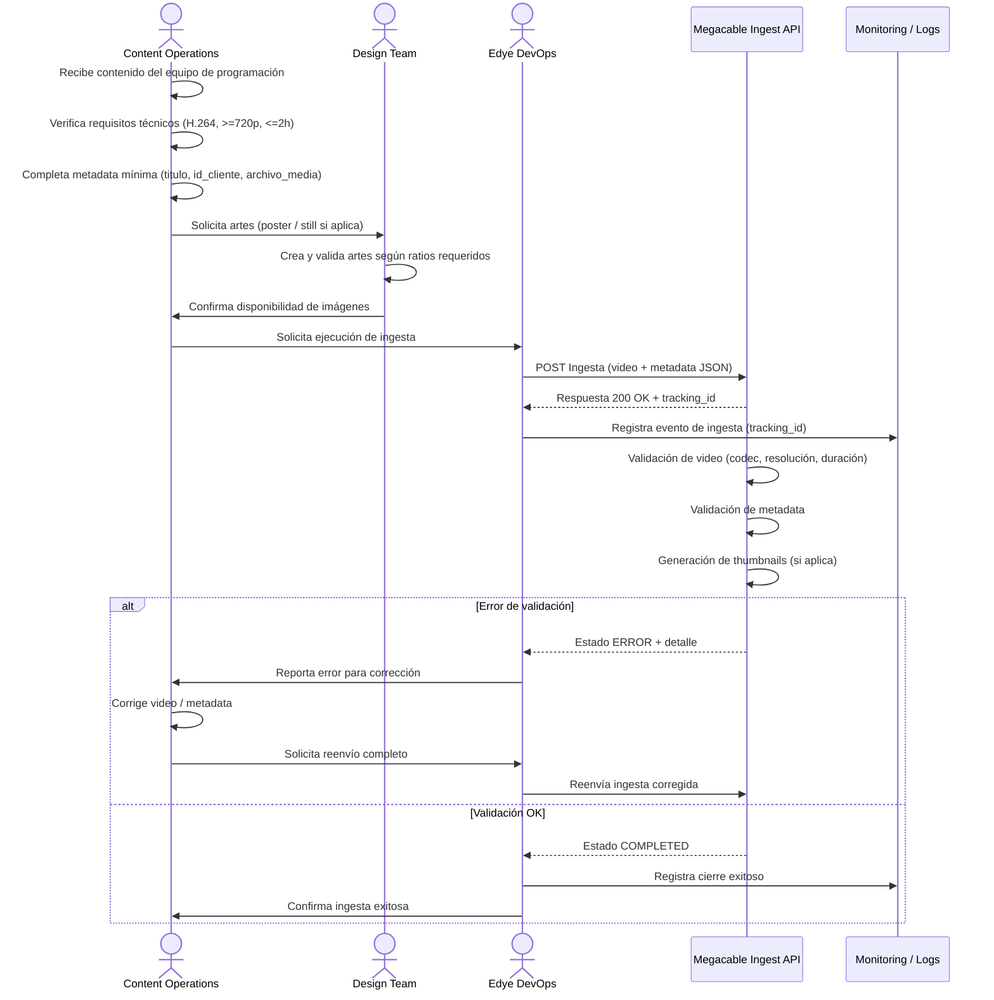
```mermaid
sequenceDiagram
    actor CO as Content Operations
    actor DT as Design Team
    actor DD as Edye DevOps
    participant API as Megacable Ingest API
    participant LOG as Monitoring / Logs

    CO->>CO: Recibe contenido del equipo de programación
    CO->>CO: Verifica requisitos técnicos (H.264, >=720p, <=2h)
    CO->>CO: Completa metadata mínima (titulo, id_cliente, archivo_media)

    CO->>DT: Solicita artes (poster / still si aplica)
    DT->>DT: Crea y valida artes según ratios requeridos
    DT->>CO: Confirma disponibilidad de imágenes

    CO->>DD: Solicita ejecución de ingesta
    DD->>API: POST Ingesta (video + metadata JSON)
    API-->>DD: Respuesta 200 OK + tracking_id

    DD->>LOG: Registra evento de ingesta (tracking_id)

    API->>API: Validación de video (codec, resolución, duración)
    API->>API: Validación de metadata
    API->>API: Generación de thumbnails (si aplica)

    alt Error de validación
        API-->>DD: Estado ERROR + detalle
        DD->>CO: Reporta error para corrección
        CO->>CO: Corrige video / metadata
        CO->>DD: Solicita reenvío completo
        DD->>API: Reenvía ingesta corregida
    else Validación OK
        API-->>DD: Estado COMPLETED
        DD->>LOG: Registra cierre exitoso
        DD->>CO: Confirma ingesta exitosa
    end
```
> **Figura 1.** _Diagrama del flujo operativo del partner_

## Descripción de la secuencia del flujo

1) **Recepción del contenido**  
El equipo de Content Operations recibe el contenido desde el área de programación y realiza una verificación inicial de disponibilidad de video y materiales asociados.

2) **Validación técnica previa**  
Antes de la ingesta, se valida que el archivo de video cumpla con los requisitos mínimos definidos para Megacable (codec H.264, resolución mínima 720p y duración máxima permitida).

3) **Preparación de metadata**  
Content Operations completa la metadata mínima requerida para la ingesta, incluyendo título, identificador del cliente y referencia del archivo de media.

4) **Gestión de artes (si aplica)**  
Cuando el partner requiere imágenes source, se solicita al Design Team la creación o validación de artes (poster, stills). Una vez disponibles, se confirma su cumplimiento de ratios y tamaños.

5) **Ejecución de la ingesta**  
El equipo de Edye DevOps ejecuta la ingesta enviando el archivo de video y la metadata mediante un request POST a la API de Megacable. El sistema responde con un tracking_id único para el seguimiento del proceso.

6) **Validaciones automáticas del partner**  
La API de Megacable ejecuta validaciones sobre el video, la metadata y, si corresponde, genera thumbnails u otros derivados de forma automática.

7) **Gestión de errores y reintentos**  
Si ocurre un error de validación, el estado de la ingesta se marca como ERROR y se notifica a Content Operations para corrección del origen. Una vez corregido, se realiza un reenvío completo de la ingesta.

8) **Cierre exitoso y monitoreo**  
Cuando todas las validaciones finalizan correctamente, la ingesta se marca como COMPLETED. El evento se registra en los sistemas de monitoreo y se notifica a Operaciones para el cierre del proceso.

---

## 1. Canal de entrega

### 1.1 Método principal (activo)
- **Tipo:** API REST
- **Endpoint ingesta:** `POST /api/ingesta/contenido`
- **Autenticación:** Bearer Token
- **Formato:** `multipart/form-data` (media) + JSON (metadata)

### 1.2 Método alterno / legado (si aplica)
- **Tipo:** FTP con polling (LEGACY)
- **Nota:** “endpoint FTP” planificado para descontinuarse en Q3 2025

### 1.3 Credenciales / rutas (a completar por partner)
- **Producción**
		- Base URL API: __________________________
		- Token (vault/secret ref): __________________________
		- (Si FTP aplica) Host: __________ Puerto: ____ Usuario: ________ Ruta: ________
- **QA / Sandbox**
		- Token de prueba (doc): `abc123`
		- Base URL QA: __________________________

---

## 2. Estructura y naming

### 2.1 Para entrega por API (recomendado)
- No requiere árbol de carpetas para el “upload” (se adjunta archivo en request).
- **Naming recomendado (archivo_media):**
  
	`{id_cliente}{titulo_sanitizado}{yyyyMMdd}.mp4`
  
	Ejemplo: `7788_ElBosqueMagico_20251222.mp4`

### 2.2 Para entrega por FTP (si se mantiene habilitado)
- **Raíz FTP:** `/incoming/megacable/`
		- `/incoming/megacable/video/`
		- `/incoming/megacable/metadata/`
		- `/incoming/megacable/images/`
- **Ejemplos:**
		- `video/7788_ElBosqueMagico_20251222.mp4`
		- `metadata/7788_ElBosqueMagico_20251222.json`
		- `images/7788_ElBosqueMagico_poster_16x9.jpg`

---

## 3. Metadata

### 3.1 Campos obligatorios (mínimos)
- `titulo`
- `id_cliente`
- `archivo_media` (referencia al archivo adjunto o nombre del archivo)

### 3.2 Ejemplo de request (API)
- Ejemplo (curl, referencia): `-F file=@video.mp4 -F metadata='{...}'`

### 3.3 Ejemplo JSON mínimo (sugerido)
```json
{
	"titulo": "El Bosque Mágico",
	"id_cliente": "7788",
	"archivo_media": "7788_ElBosqueMagico_20251222.mp4"
}
```

### 3.4 Campos opcionales (si el partner los requiere)
- idioma: __________
- sinopsis: __________
- género/tema: __________
- temporada/episodio: __________
- tags/acrónimo: __________

---

## 4. Imágenes

> Nota: el pipeline contempla “creación de thumbnails” como proceso automático post-ingesta.

Si Megacable exige artes “source” o tamaños específicos, completar esta sección.

### 4.1 Lista de imágenes requeridas (a completar)
- Poster / Key Art (Show)
- Still (Episodio)
- Thumbnail (derivado)

### 4.2 Tamaños y ratio (a completar)
- `16:9 = ______ x ______`
- `2:3 = ______ x ______`
- `1:1 = ______ x ______`
- `Otros: __________________`

### 4.3 Watermark
- ¿Aplica watermark?: Sí / No / TBD
- Si aplica: nombre watermark en Admin + formatos asociados. (La gestión/validación de watermark y formatos se opera desde el módulo de Watermarks/Thumbnails del Admin).

---

## 5. Reglas de validación

### 5.1 Video (mínimos)
- Codec: H.264
- Resolución mínima: 720p
- Duración máxima: 2 horas

### 5.2 Metadata
- Campos mínimos presentes: titulo, id_cliente, archivo_media
- JSON válido (sin caracteres inválidos / encoding consistente)
- Consistencia entre archivo adjunto y archivo_media

### 5.3 Imágenes
- Si se entregan imágenes source: validar ratio y tamaño contra specs del partner (sección 4)
- Si se usa watermark: validar disponibilidad de watermark por formato antes de generar thumbnails

---

## 6. Criterios de aceptación

### 6.1 Aceptación técnica (API / Proceso)
- Ingesta responde 200 OK y retorna id (tracking id)
- El estado avanza a “completed” (sin quedar en “error”)
- El contenido pasa validaciones: `H.264, >=720p, <=2h`

### 6.2 Aceptación operativa (QC + evidencia)
- Thumbnails generados (si aplica) y disponibles para entrega/consulta (según configuración)
- Logs sin errores de validación para el tracking id (ver sección 7)
- Reporte/registro de entrega (Ticket/Monday/bitácora interna): __________________

---

## 7. Operaciones al final (monitoreo, logs, alertas)
- Logs: Elastic/Kibana > IngestaLogs
- Eventos esperados: inicio carga, fin carga, errores de validación
- Indicadores clave: tiempo de procesamiento, % fallos por cliente
- Alertas críticas: más de 10 errores consecutivos por cliente

---

## 8. Reintentos / rollback

### 8.1 Reintentos recomendados (por estado)
- Estado “error” por “Formato no soportado” / “metadatos incompletos”:
	- Acción: corregir origen (transcode/metadata) y REENVIAR el request completo (archivo + metadata).
- Estado “received” o “processing” fuera de umbral operativo:
	- Acción: consultar status vía `GET /api/ingesta/status?id=xxx`
	- Si excede ventana interna: escalar a DevOps y evaluar reintento controlado.

### 8.2 Regenerar vs reenviar
- Regenerar (solo) cuando:
	- Falló creación de thumbnails/QC automatizado pero el media y metadata son válidos (regeneración interna).
- Reenviar completo cuando:
	- Cambia el archivo de video o cambia metadata obligatoria (id_cliente/titulo/archivo_media).
- Rollback (operativo):
	- Si un contenido “completed” debe retirarse, definir acción por catálogo (despublicación) y evidencias: __________________

---

## 9. Soporte (contactos, horario, escalamiento) — A COMPLETAR

### Partner (Megacable)
- Contacto técnico: __________________
- Email: __________________
- Tel: __________________
- Ventana de soporte: __________________ (TZ)

### EDYE / HITN
- Operaciones (L1): __________________
- DevOps (L2): __________________
- Producto/Contenido (L3 si aplica): __________________
- Severidades y SLA (si existen): __________________
- Canal de escalamiento (Slack/Email/Ticket): __________________

***

\newpage

# Edye Billing – Waltmart

## Información de integración específica – Walmart

En esta sección se recopila información específica del partner que implementa la integración EDYE Billing mediante Pagoralia e InPlayer. Las descripciones se basan en los documentos de integración compartidos.

**Canal de integración:** API REST con endpoints diferenciados por entorno. Se utilizan los endpoints de Pagoralia (`/create‑portal`) para generar el portal de pago geolocalizado y de InPlayer (`/auth`, `/user`) para autenticación y registro de usuarios.

**Arquitectura y flujo:** Pagoralia genera un portal geolocalizado ajustando el idioma y la moneda según la dirección IP del usuario. InPlayer gestiona la identidad y valida a los usuarios que pagan. El flujo secuencial consta de tres pasos: (1) generación del portal; (2) registro en InPlayer; y (3) habilitación de acceso a los contenidos. El portal se personaliza con logos y colores del cliente.

**Campos e interoperabilidad:** Pagoralia envía a InPlayer los datos de nombre, email, ID de compra, IP y tipo de producto. InPlayer devuelve a la plataforma un JWT que incluye las claims `userID`, `email`, `purchaseTime` y `accessLevel`. La sincronización entre ambos servicios se realiza mediante webhooks que confirman el pago y el registro del usuario.

**Validaciones y seguridad:** Pagoralia comprueba que el país esté soportado, que el cliente esté disponible y que los métodos de pago estén activos. InPlayer valida que el correo no esté duplicado, que los formatos sean correctos y que las contraseñas cumplan políticas de seguridad. Los mensajes de error más comunes son `403 Forbidden` (cliente no habilitado) y `409 Conflict` (usuario ya registrado). Las comunicaciones utilizan HTTPS y tokens firmados, y los portales temporales expiran tras una hora.

**Entornos y URLs:** Walmart utilizará los endpoints de QA y producción de Pagoralia e InPlayer: `https://qa.pagoralia.com/create‑portal` y `https://qa.inplayer.com/api/auth` para pruebas, y `https://pagos.pagoralia.com` y `https://inplayer.com/api` para el entorno productivo.

**Particularidades operativas:** El portal ajusta automáticamente el idioma y la moneda según la ubicación del usuario final y aplica el branding del cliente. La integración se limita a pagos individuales en tiempo real; la conciliación de ganancias se gestiona por medio de mecanismos estándar de EDYE.

**Contactos de soporte:** El documento original no especifica contactos; estos se deberán acordar en los contratos de servicio.

***

\newpage

# Edye Billing – Mi Bebé y Yo

## Información de integración específica – Mi Bebé y Yo

En esta sección se recopila información específica del partner que implementa la integración EDYE Billing mediante Pagoralia e InPlayer. Las descripciones se basan en los documentos de integración compartidos.

**Canal de integración:** API REST con endpoints diferenciados por entorno. Se utilizan los endpoints de Pagoralia (`/create‑portal`) para generar el portal de pago geolocalizado y de InPlayer (`/auth`, `/user`) para autenticación y registro de usuarios.

**Arquitectura y flujo:** Pagoralia genera un portal geolocalizado ajustando el idioma y la moneda según la dirección IP del usuario. InPlayer gestiona la identidad y valida a los usuarios que pagan. El flujo secuencial consta de tres pasos: (1) generación del portal; (2) registro en InPlayer; y (3) habilitación de acceso a los contenidos. El portal se personaliza con logos y colores del cliente.

**Campos e interoperabilidad:** Pagoralia envía a InPlayer los datos de nombre, email, ID de compra, IP y tipo de producto. InPlayer devuelve a la plataforma un JWT que incluye las claims `userID`, `email`, `purchaseTime` y `accessLevel`. La sincronización entre ambos servicios se realiza mediante webhooks que confirman el pago y el registro del usuario.

**Validaciones y seguridad:** Pagoralia comprueba que el país esté soportado, que el cliente esté disponible y que los métodos de pago estén activos. InPlayer valida que el correo no esté duplicado, que los formatos sean correctos y que las contraseñas cumplan políticas de seguridad. Los mensajes de error más comunes son `403 Forbidden` (cliente no habilitado) y `409 Conflict` (usuario ya registrado). Las comunicaciones utilizan HTTPS y tokens firmados, y los portales temporales expiran tras una hora.

**Entornos y URLs:** Mi Bebé y Yo utilizará los endpoints de QA y producción de Pagoralia e InPlayer: `https://qa.pagoralia.com/create‑portal` y `https://qa.inplayer.com/api/auth` para pruebas, y `https://pagos.pagoralia.com` y `https://inplayer.com/api` para el entorno productivo.

**Particularidades operativas:** El portal ajusta automáticamente el idioma y la moneda según la ubicación del usuario final y aplica el branding del cliente. La integración se limita a pagos individuales en tiempo real; la conciliación de ganancias se gestiona por medio de mecanismos estándar de EDYE.

**Contactos de soporte:** El documento original no especifica contactos; estos se deberán acordar en los contratos de servicio.w

***

\newpage

# Edye Billing – Ultralink

## Información de integración específica – Ultralink

En esta sección se recopila información específica del partner que implementa la integración EDYE Billing mediante Pagoralia e InPlayer. Las descripciones se basan en los documentos de integración compartidos.

**Canal de integración:** API REST con endpoints diferenciados por entorno. Se utilizan los endpoints de Pagoralia (`/create‑portal`) para generar el portal de pago geolocalizado y de InPlayer (`/auth`, `/user`) para autenticación y registro de usuarios.

**Arquitectura y flujo:** Pagoralia genera un portal geolocalizado ajustando el idioma y la moneda según la dirección IP del usuario. InPlayer gestiona la identidad y valida a los usuarios que pagan. El flujo secuencial consta de tres pasos: (1) generación del portal; (2) registro en InPlayer; y (3) habilitación de acceso a los contenidos. El portal se personaliza con logos y colores del cliente.

**Campos e interoperabilidad:** Pagoralia envía a InPlayer los datos de nombre, email, ID de compra, IP y tipo de producto. InPlayer devuelve a la plataforma un JWT que incluye las claims `userID`, `email`, `purchaseTime` y `accessLevel`. La sincronización entre ambos servicios se realiza mediante webhooks que confirman el pago y el registro del usuario.

**Validaciones y seguridad:** Pagoralia comprueba que el país esté soportado, que el cliente esté disponible y que los métodos de pago estén activos. InPlayer valida que el correo no esté duplicado, que los formatos sean correctos y que las contraseñas cumplan políticas de seguridad. Los mensajes de error más comunes son `403 Forbidden` (cliente no habilitado) y `409 Conflict` (usuario ya registrado). Las comunicaciones utilizan HTTPS y tokens firmados, y los portales temporales expiran tras una hora.

**Entornos y URLs:** Ultralink utilizará los endpoints de QA y producción de Pagoralia e InPlayer: `https://qa.pagoralia.com/create‑portal` y `https://qa.inplayer.com/api/auth` para pruebas, y `https://pagos.pagoralia.com` y `https://inplayer.com/api` para el entorno productivo.

**Particularidades operativas:** El portal ajusta automáticamente el idioma y la moneda según la ubicación del usuario final y aplica el branding del cliente. La integración se limita a pagos individuales en tiempo real; la conciliación de ganancias se gestiona por medio de mecanismos estándar de EDYE.

**Contactos de soporte:** El documento original no especifica contactos; estos se deberán acordar en los contratos de servicio.

***

\newpage

# Delivery via API – The Shelf

| Elemento                    | Valor                                                                                                                                                                      |
| --------------------------- | -------------------------------------------------------------------------------------------------------------------------------------------------------------------------- |
| Partner                     | The Shelf                                                                                                                                                                  |
| Nombre del Servicio         | Delivery de Contenidos – EDYE API / JW Player Feed                                                                                                                         |
| Tipo de integración         | Delivery vía API (pull de contenido)                                                                                                                                       |
| Objetivo                    | Distribuir contenido actualizado (video, metadatos, imágenes) mediante APIs EDYE hacia la plataforma del partner, permitiendo su ingesta en JW Player y sistemas internos. |
| Formato de salida           | JSON estructurado según especificaciones de JW Player y el modelo EDYE.                                                                                                    |
| Frecuencia de actualización | Cada hora o bajo demanda (evento de publicación).                                                                                                                          |

Esta sección define el alcance y los parámetros básicos de la integración. El tipo de integración Delivery vía API implica que el partner consume de forma programada o event‑driven los recursos expuestos por las APIs de EDYE. El contenido abarca video, metadatos y thumbnails, los cuales se generan en la plataforma EDYE a partir de los orígenes de media (JW Player) y se sirven mediante endpoints REST.

## 2. Estructura del JSON entregado

La API entrega un feed en formato JSON. Cada entrada del feed corresponde a un video y contiene los campos principales que se muestran a continuación. El tamaño máximo del feed es de 1 000 ítems por consulta.

### 2.1 Campos principales

| Campo            | Descripción                                                                        | Obligatorio |
| ---------------- | ---------------------------------------------------------------------------------- | ----------- |
| title            | Título del contenido.                                                              | Sí          |
| description      | Descripción breve del asset.                                                       | No          |
| image / images[] | URL de la miniatura principal o arreglo de URLs de miniaturas en varios tamaños.   | No          |
| sources          | Lista de fuentes de vídeo. Cada elemento incluye file, label, type, width, height. | Sí          |
| tags             | Conjunto de etiquetas asociadas al contenido.                                      | No          |
| pubdate          | Fecha de publicación en formato ISO 8601.                                          | Sí          |
| custom_fields    | Objeto JSON con campos personalizados definidos por el partner.                    | No          |

El endpoint de entrega se configura como una URL pública o autenticada. El partner debe solicitar los feeds de manera autenticada mediante token de API o cabecera HTTP conforme a las políticas de seguridad de EDYE.

### 2.2 Arquitectura general

La arquitectura de la entrega está compuesta por los siguientes componentes:

```mermaid
flowchart LR
		subgraph Origen
				A[JW Player – Origen de media]
		end
		subgraph Plataforma_EDYE
				B[Ingesta y procesamiento de contenido]
				C[APIs EDYE]
		end
		subgraph Partner
				D[Servicio de integración de The Shelf]
		end
		A --> B
		B --> C
		C --REST JSON--> D
```
> **Figura 1.** _Diagrama Arquitectura general_

**Origen:** EDYE utiliza JW Player como origen de media. Las cargas de vídeo y sus variantes se almacenan y gestionan en JW Player.

**Plataforma EDYE:** realiza la ingesta del contenido, normaliza metadatos e imágenes y expone los recursos mediante las APIs EDYE.

**Partner:** The Shelf opera un servicio de integración que consume los endpoints REST para construir su catálogo local y publicar en sus reproductores (JW Player u otros).

### 2.3 APIs involucradas

A continuación se detallan los endpoints principales que el partner debe consumir. Todos los endpoints son de tipo HTTP GET y devuelven objetos JSON.

| Endpoint                                    | Descripción                                                                              | Parámetros relevantes        |
| ------------------------------------------- | ---------------------------------------------------------------------------------------- | ---------------------------- |
| /v1/feed                                    | Devuelve el feed completo de contenidos disponibles.                                     | page, page_size (paginación) |
| /v1/feed?updated_since=YYYY‑MM‑DDTHH:MM:SSZ | Devuelve únicamente los ítems actualizados desde una fecha determinada.                  | updated_since (ISO 8601)     |
| `/v1/media/{id}`                             | Devuelve el detalle de un contenido específico, incluyendo fuentes de vídeo y metadatos. | id (UUID del contenido)      |
| `/v1/media/{id}/images`                       | Devuelve la lista de miniaturas asociadas al contenido.                                  | id (UUID del contenido)      |
| `/v1/media/{id}/metadata`                     | Devuelve únicamente los metadatos del contenido.                                         | id                           |

Cada endpoint requiere autenticación mediante un token de API enviado en la cabecera Authorization: Bearer. El partner deberá gestionar la renovación y almacenamiento seguro de dicho token. Las rutas y nombres de endpoints pueden ajustarse según el entorno (QA o producción).

## 3. Contenido Multimedia y Thumbnails

### 3.1 Fuentes de vídeo

El campo `sources` es una lista de objetos que definen cada versión del vídeo. Cada objeto incluye al menos:

- `file` – URL del archivo de vídeo (HLS, MP4 u otro formato).
- `label` – Indicador de calidad o resolución (por ejemplo 1080p).
- `type` – Tipo MIME del archivo (video/mp4, application/x-mpegURL, etc.).
- `width`/`height` – Resolución del vídeo en píxeles.

Todas las URLs deben ser accesibles mediante HTTPS. El partner debe comprobar su disponibilidad antes de ingestarlas.

### 3.2 Imágenes

Las miniaturas se suministran en el campo `image` o dentro de `images[]` para soportar múltiples tamaños. Las recomendaciones de EDYE son:

- Relación de aspecto 16:9.
- Resolución mínima 640×360 px.
- Formato JPG o PNG optimizado para web.

El partner puede solicitar imágenes en diferentes resoluciones empleando el endpoint `/v1/media/{id}/images` y filtrando por clave de tamaño (small, medium, large).

### 3.3 Reglas de validación para multimedia

- **Verificación de URLs:** antes de publicar un feed, la plataforma EDYE valida automáticamente que los enlaces de vídeo e imagen respondan con código HTTP 2xx. El partner debe replicar esta verificación para descartar contenidos corruptos.
- **Integridad del archivo:** comprobar que la duración y el tamaño del vídeo se ajustan a los metadatos informados. Las discrepancias deben reportarse a soporte.
- **Formatos soportados:** solo se aceptan tipos MIME estándar (MP4/HLS para vídeo, JPEG/PNG para imágenes). Archivos con codecs no soportados deben ser omitidos.

## 4. Metadatos requeridos y opcionales

### 4.1 Campos obligatorios

| Campo   | Descripción                               |
| ------- | ----------------------------------------- |
| title   | Título del vídeo.                         |
| sources | Array de fuentes de vídeo.                |
| pubdate | Fecha de publicación en formato ISO 8601. |

### 4.2 Campos opcionales

| Campo            | Descripción                                      |
| ---------------- | ------------------------------------------------ |
| description      | Descripción o sinopsis del contenido.            |
| tags             | Lista de etiquetas temáticas o de clasificación. |
| image / images[] | Miniaturas asociadas al vídeo.                   |
| duration         | Duración del contenido en segundos.              |
| custom_fields    | JSON anidado con claves específicas del cliente. |

### 4.3 Campos personalizados

Los `custom_fields` permiten incluir metadatos específicos definidos por el partner. Este campo es opcional pero debe respetar el formato JSON. Ejemplo:

```json
{
  "custom_fields": {
    "season": "3",
    "rating": "PG‑13"
  }
}
```

La plataforma EDYE no interpreta estos valores; se almacenan y transmiten tal cual. The Shelf es responsable de la consistencia y uso de los mismos.

## 5. Proceso de entrega y endpoints

### 5.1 Método de entrega

El feed se genera en el backend de EDYE y se publica vía HTTP(S). El partner ejecuta peticiones GET a los endpoints descritos en la sección 2 para obtener datos completos o incrementales. El modelo de integración es pull, es decir, The Shelf inicia las solicitudes según su plan de actualización.

### 5.2 Seguridad y autenticación

Se emplea autenticación mediante token en la URL o encabezado, o bien autenticación básica, según lo acordado. Las credenciales se suministran a través de canales seguros. Se recomienda rotar los tokens periódicamente y utilizar HTTPS para proteger los datos en tránsito.

### 5.3 Monitoreo y notificaciones

- **Monitoreo:** EDYE registra el estado HTTP de cada entrega, logs de acceso y la integridad del JSON generado. Se recomienda que The Shelf haga un seguimiento de las llamadas, tiempos de respuesta y códigos de estado para detectar anomalías.
- **Notificaciones:** tras una actualización exitosa del feed, la plataforma puede invocar un webhook configurado por The Shelf. El webhook debe aceptar solicitudes POST y responder con código 2xx para confirmar la recepción.

### 5.4 Flujo operativo de delivery vía API

```mermaid
sequenceDiagram
		participant Shelf as The Shelf
		participant EDYE as EDYE API
		participant JW as JW Player / Ingesta
		JW-->EDYE: Carga de nuevos contenidos
		Shelf->>EDYE: Solicitar feed (/v1/feed)
		EDYE-->>Shelf: Respuesta JSON con contenidos
		Shelf->>EDYE: Para cada ítem, obtener detalles (`/v1/media/{id}`)
		EDYE-->>Shelf: Detalle de media, metadatos e imágenes
		Shelf->Shelf: Validación y procesamiento local
		Shelf->>Webhook: Notificación interna de disponibilidad
```
> **Figura 2.** _Flujo operativo de delivery vía API_

### 5.5 Descripción del flujo (paso a paso)

1. **Generación de contenido:** cuando se publican nuevos vídeos en JW Player, EDYE ingesta los archivos y actualiza los metadatos.
2. **Publicación del feed:** el backend de EDYE genera el feed JSON y lo expone en el endpoint `/v1/feed`.
3. **Consulta del partner:** The Shelf programa un trabajo (por ejemplo, cada hora) para solicitar el feed completo o incremental.
4. **Procesamiento:** el servicio de The Shelf analiza la respuesta, identifica nuevos o modificados, y realiza llamadas adicionales a `/v1/media/{id}`, `/v1/media/{id}/images` o `/v1/media/{id}/metadata` según sea necesario.
5. **Validación:** The Shelf verifica la integridad del JSON, la disponibilidad de los recursos multimedia y el cumplimiento de campos obligatorios.
6. **Ingesta interna:** los datos se insertan en el catálogo interno y, opcionalmente, se publica un webhook para notificar a otras aplicaciones.

### 5.6 Manejo de errores y reintentos

- **Códigos HTTP:** los endpoints devuelven códigos estándar (200, 400, 401, 404, 500). Las respuestas 4xx indican errores del cliente; las 5xx indican problemas temporales del servidor.
- **Reintentos:** se recomienda implementar reintentos exponenciales ante errores 5xx o timeouts, con un máximo de tres intentos y espera incremental.
- **Registro de fallos:** todas las llamadas fallidas deben registrarse con el timestamp, endpoint y código de estado para facilitar el análisis.
- **Gestión de límites:** respetar las políticas de rate limit (si aplican) para evitar bloqueos. Ante una respuesta 429 se debe esperar el tiempo indicado en la cabecera Retry‑After.

### 5.7 Dependencias técnicas

- **Conectividad:** acceso a Internet mediante HTTPS a los dominios de EDYE y JW Player.
- **Autenticación:** gestión de tokens de API y credenciales de acceso.
- **Entorno de ejecución:** servicio capaz de realizar solicitudes HTTP, procesar JSON y almacenar datos (p. ej. un microservicio en la infraestructura de The Shelf).
- **Sincronización horaria:** los servidores deben mantener sincronizados sus relojes para comparar `pubdate` y filtros `updated_since`.

## 6. Validaciones y control de calidad

### 6.1 Validaciones previas

Antes de publicar un feed, EDYE realiza validaciones automáticas de la estructura JSON, verifica la existencia de todos los campos obligatorios y comprueba las URLs de multimedia. The Shelf debe replicar estas validaciones al consumir los datos.

### 6.2 Logs

EDYE mantiene registros de generación, validación y publicación del feed. El partner debe conservar sus propios logs de consumo para trazabilidad: hora de petición, URL solicitada, código de respuesta y cantidad de ítems procesados.

### 6.3 Alertas y notificaciones de errores

Los errores críticos se identifican mediante alertas: código 500, JSON inválido, thumbnails rotos o faltantes. Ante un error, se debe:

- Registrar el incidente y el código devuelto.
- Reintentar la solicitud según la política de reintentos.
- Notificar al equipo de soporte de EDYE si el problema persiste.

### 6.4 Retención de versiones

La plataforma conserva el historial de los tres últimos feeds generados. The Shelf puede comparar versiones para detectar cambios o recuperar datos en caso de incidencia.

## 7. Entornos de prueba y herramientas

### 7.1 Entorno de QA

Para pruebas y certificación se dispone de un entorno QA accesible a través de una URL específica (ejemplo: https://qa.api.clientdomain.com/feed/jwplayer.json). Los datos en QA pueden diferir de producción y se reinician periódicamente.

### 7.2 Herramientas recomendadas

- **Postman** – para construir y ejecutar peticiones HTTP.
- **JSONLint** – para validar la sintaxis JSON.
- **JW Platform feed validator** – herramienta oficial de JW Player para validar feeds.

### 7.3 Ejemplo de validación

Se recomienda utilizar la herramienta de validación de JW Player disponible en https://developer.jwplayer.com/tools/feeds/validate/. Ingrese la URL del feed y revise los resultados para detectar campos faltantes o errores de formato.

### 7.4 Cliente de pruebas

Durante la integración se facilita acceso a la JW Player Dev Console con una API Key temporal. Esta consola permite probar la reproducción de contenidos y verificar las propiedades del feed.

### 7.5 Operación y soporte

- **Monitoreo continuo:** se debe instrumentar la integración para medir tiempos de respuesta, tasa de error y número de elementos procesados.
- **Gestión de incidencias:** ante un error persistente, el partner debe abrir un ticket en la mesa de ayuda de EDYE proporcionando logs y descripción del problema.
- **Ventanas de mantenimiento:** EDYE notificará con antelación cualquier intervención que pueda afectar la disponibilidad de las APIs.

# 8. Ejemplo de JSON entregado

El siguiente ejemplo ilustra una entrada del feed devuelta por `/v1/feed`:

```json
{
  "playlist": [
    {
      "title": "Avance Temporada 4",
      "description": "Tráiler oficial HD",
      "image": "https://cdn.client.com/thumbnails/t4.jpg",
      "pubdate": "2025-07-21T10:00:00Z",
      "sources": [
        {
          "file": "https://cdn.client.com/videos/t4-1080.mp4",
          "label": "1080p",
          "type": "video/mp4"
        }
      ],
      "custom_fields": {
        "season": "4",
        "language": "es"
      }
    }
  ]
}
```

***

\newpage

# API-Notifer-APK – Telecable

## 1. Introducción

Este documento proporciona instrucciones detalladas para que Telecable integre la aplicación oficial de EDYE en su ecosistema mediante el modelo APP INTEGRATION – APO + Notifier + APK. Está dirigido a equipos técnicos y de operaciones de Telecable y describe todas las fases necesarias para desplegar, configurar y operar la integración.

## 2. Objetivo y alcance

**Objetivo:** guiar al equipo de Telecable en la implementación de la integración con EDYE, asegurando un despliegue homogéneo y conforme a las normas de seguridad y operaciones.

**Alcance:** cubre la entrega de la APK de EDYE, la configuración de APO, la suscripción y consumo de eventos de Notifier y la conexión con el backend de EDYE. No aborda procesos de facturación propios ni la ingesta de usuarios desde sistemas de Telecable.

## 3. Modelo de integración APO + Notifier + APK (visión general)

En el contexto de Telecable:

**EDYE entrega:**

- La APK oficial de la aplicación EDYE para los dispositivos Android/Android TV operados por Telecable.
- El acceso a APO, que permite configurar entornos, claves, endpoints y canales.
- El servicio Notifier, que publica eventos de negocio y operativos.

**Telecable realiza:**

- La distribución interna de la APK en su set‑top box y plataformas móviles.
- La configuración de APO con sus credenciales y parámetros.
- El consumo de eventos de Notifier y la confirmación de su recepción con acks.
- La provisión de soporte de primer nivel a sus usuarios finales.

La arquitectura de mensajería se basa en eventos, donde el productor publica hechos sin esperar respuesta, y el consumidor responde con un ack para asegurar la entrega.

## 4. Arquitectura general de la integración

La siguiente descripción resume la arquitectura para Telecable:

- **Entorno Telecable:** compuesto por el set‑top box y aplicaciones móviles donde se desplegará la APK de EDYE.
- **EDYE APK:** aplicación que se ejecuta en los dispositivos de Telecable y que se conecta con APO para obtener su configuración.
- **EDYE APO:** utilizado por Telecable para configurar credenciales, endpoints, canales y versiones.
- **EDYE Notifier:** servicio que emite eventos; Telecable configura un cliente para recibirlos y procesarlos.
- **Backend de EDYE:** servicios que proporcionan autenticación, catálogo y streaming.

## 5. Flujo general de la integración (descripción end‑to‑end)

1. **Entrega y validación de la APK:** Telecable recibe la APK firmada de EDYE y comprueba su integridad.
2. **Preparación del entorno:** se habilita un entorno de QA con credenciales específicas y se configura la red para permitir conexiones HTTPS hacia EDYE.
3. **Instalación de la APK:** la aplicación se incorpora al repositorio interno de Telecable y se distribuye a los dispositivos en el entorno de QA.
4. **Configuración en APO:** Telecable registra sus credenciales en APO y define los endpoints de autenticación, catálogo y streaming, así como los canales de contenido y las versiones permitidas.
5. **Suscripción a Notifier:** Telecable configura su cliente de mensajería para suscribirse a los eventos de altas, bajas, errores y otros eventos relevantes.
6. **Conexión al backend:** la APK invoca los servicios de EDYE usando tokens y obtiene la configuración dinámica desde APO.
7. **Monitoreo y soporte:** Telecable supervisa la operación, registra eventos y coordina con EDYE para resolver incidencias.

```mermaid
sequenceDiagram
    participant Usuario
    participant Telecable
    participant EDYE
    participant Inplayer

    Usuario->>Telecable: Activa el producto vía APK de EDYE instalada en el decodificador de Telecable
    Telecable->>Telecable: Verificación de autenticación del usuario
    alt Autenticación exitosa
        Telecable->>EDYE: Solicitar URL de suscripción
        EDYE->>Telecable: API genera y devuelve URL de suscripción
        EDYE->>Usuario: API envía un SMS al usuario para completar su registro
        Usuario->>EDYE: Crea su cuenta de EDYE usando el enlace recibido
        EDYE->>Inplayer: API genera la suscripción en Inplayer
        Inplayer->>Telecable: Envía confirmación con el Subscription ID del usuario
        Telecable->>Usuario: Libera acceso al contenido en la APK de EDYE instalada en su decodificador
    else Autenticación fallida
        Telecable->>Usuario: Notifica error de autenticación
    end
```
> **Figura 1.** Diagrama del flujo operativo del partner

## 6. Componentes involucrados

### Telecable
- Integra la APK en su set‑top box y aplicaciones.
- Configura APO con claves, endpoints y canales.
- Desarrolla o configura un cliente para consumir eventos de Notifier y confirma su recepción.
- Monitorea la operación y brinda soporte a sus usuarios.

### EDYE APO
- Permite a Telecable gestionar entornos, claves, endpoints, canales y versiones.
- Proporciona una interfaz segura con registros de auditoría para todas las acciones.

### EDYE Notifier
- Publica eventos relacionados con operaciones (por ejemplo, altas, bajas, errores, estado del servicio).
- Requiere confirmación mediante ack para garantizar la entrega, permitiendo reintentos e idempotencia.

### EDYE APK
- Gestiona la autenticación del usuario y el acceso a contenidos.
- Recibe configuración dinámica desde APO.
- Reporta eventos internos a Notifier.

### EDYE Backend
- Suministra los servicios de autenticación, catálogo de contenidos y streaming.
- Sus endpoints utilizan HTTPS y tokens con parámetros seguros (expiración, mínimas claims, etc.).

## 7. Flujo detallado por fases

### 7.1 Preparación del entorno
- **Credenciales:** EDYE genera credenciales de API para Telecable (QA y producción).
- **Red:** Telecable habilita reglas de firewall para permitir tráfico HTTPS hacia EDYE.
- **Cuenta en APO:** se configura una cuenta de operador para Telecable con usuarios y permisos adecuados.

### 7.2 Entrega e instalación de la APK
- La APK se distribuye a través del repositorio interno de Telecable a los dispositivos de prueba.
- Se verifica la instalación y compatibilidad en distintos dispositivos (STB, Android TV).
- Se registra la versión instalada para control posterior.

### 7.3 Configuración de APO
- Telecable configura los parámetros de QA y producción: endpoints de autenticación, catálogo, streaming; claves y tokens; canales de contenido; versionado mínimo/máximo.
- Se registran los cambios y se validan en QA.
- Una vez verificados, se replican los parámetros en producción.

### 7.4 Integración de Notifier
- Telecable se suscribe a los topics de Notifier (user.signup, user.cancel, error, status, interaction).
- El cliente de Telecable procesa cada evento, ejecuta la lógica correspondiente (por ejemplo, alta o baja en su sistema) y envía un ack.
- En caso de errores, se realizan reintentos según la política de reenvío.
- Se registra la recepción y confirmación de cada evento.

### 7.5 Validación funcional
- **Autenticación y acceso:** se comprueba que la APK se autentica correctamente y que los usuarios pueden acceder a contenidos.
- **Eventos de Notifier:** se generan eventos de prueba para verificar que Telecable los recibe y procesa.
- **Configuración de APO:** se aplican cambios en APO y se verifica que se reflejan en la APK.
- **Compatibilidad:** se prueban distintos dispositivos para asegurar que la experiencia es uniforme.

### 7.6 Puesta en producción
- Se actualizan las configuraciones definitivas en APO para producción.
- Se despliega la versión de la APK autorizada a los usuarios finales de Telecable.
- Se monitoriza el comportamiento en producción durante las primeras 48 horas y se coordinan acciones de mitigación si se detectan incidencias.
- Se documentan las versiones de APK, fechas de despliegue y datos relevantes.

## 8. Modelo de eventos Notifier

### 8.1 Tipos de eventos habilitados
- Telecable se suscribe a los siguientes eventos:
	- user.signup – Alta de usuario.
	- user.cancel – Baja de usuario.
	- error – Notificaciones de errores de reproducción o autenticación.
	- status – Cambios en el estado del servicio.
	- interaction – Eventos de interacción como inicio o finalización de reproducción.

### 8.2 Estructura y manejo
- Los eventos se envían en formato JSON con identificador, timestamp, tipo y datos adicionales.
- Telecable debe enviar un ack por cada evento consumido para garantizar la entrega y evitar reenvíos.
- Los consumidores deben ser idempotentes para manejar duplicados.
- Notifier realizará reintentos hasta recibir el ack o hasta agotar el número máximo de intentos.

## 9. Configuración del APO

Telecable utiliza APO para:
- Definir entornos de QA y producción con sus propios endpoints, claves y tokens.
- Configurar canales de contenido y versiones permitidas de la APK.
- Establecer parámetros de Notifier, incluidos los topics suscritos y las políticas de reintento.
- Realizar auditoría de cambios y control de accesos.

## 10. Seguridad y control de accesos

- **Tokens y claves:** mantenerlos en secreto y garantizar su expiración.
- **Autorización:** validar permisos en cada llamada al backend y en la gestión de APO.
- **Protección de endpoints:** emplear HTTPS, filtros de entrada, rate limiting y monitorización.
- **Gestión de credenciales:** rotación periódica, almacenamiento seguro y control de acceso basado en roles.

## 11. Manejo de errores, monitoreo y reintentos

- Manejo de errores en la APK con reintentos y mensajes claros.
- Logs y métricas de Notifier y APO para diagnosticar problemas.
- Reintentos automáticos e idempotencia para la entrega de eventos.
- Integración con herramientas de observabilidad de Telecable para supervisar latencia de eventos, reproducciones y errores.

## 12. Criterios de aceptación de la integración

- La APK se instala y ejecuta sin errores en dispositivos Telecable.
- Configuraciones de APO aplicadas correctamente en QA y producción.
- Telecable recibe y procesa eventos Notifier de forma consistente y confirma con ack.
- Los usuarios pueden autenticarse y reproducir contenidos de EDYE sin incidencias.
- El equipo de Telecable tiene visibilidad y control sobre logs y métricas.
- Documentación y procedimientos de soporte completados.

## 13. Operación, monitoreo y soporte

- Telecable vigila diariamente métricas de uso, errores y eventos.
- Actualiza la configuración de APO según necesidades operativas.
- Coordina las actualizaciones de la APK con EDYE.
- Se mantiene un canal de soporte directo con EDYE para resolver incidencias y planificar mantenimientos.

## 14. Anexo – Telecable

- **Canal de distribución de la APK:** Telecable distribuye la aplicación EDYE a través de su repositorio interno de aplicaciones y del set‑top box. Los dispositivos autorizados descargan la APK tras validarse con el servidor de Telecable.
- **Ambientes utilizados:** Telecable opera con dos entornos: QA, destinado a pruebas internas, y producción, para usuarios finales. Cada entorno tiene claves y endpoints independientes en APO.
- **Esquema de autenticación:** la autenticación de los usuarios se realiza mediante tokens JWT proporcionados por el backend de EDYE. Telecable gestiona la obtención y renovación de dichos tokens a través de la APK y no almacena credenciales sensibles en los dispositivos.
- **Eventos Notifier habilitados:** Telecable está suscrito a los eventos user.signup, user.cancel, error, status e interaction, con las políticas de reintentos y confirmación definidas en la sección 8.
- **Particularidades operativas:** Telecable opera en la zona horaria de Europa/Madrid y tiene ventanas de mantenimiento definidas. Deben considerarse los límites de ancho de banda de la red de Telecable para ajustar la frecuencia de eventos de estado y el tamaño de las cargas.

**Contactos de soporte:**

| Área                    | Contacto                |
|-------------------------|-------------------------|
| Soporte funcional       | soporte@edye.com        |
| Soporte técnico         | techsupport@edye.com    |
| Coordinación de despliegue | proyectos@edye.com   |

**Ventanas de mantenimiento:** las actualizaciones planificadas de la APK y de la plataforma EDYE se realizan los miércoles entre las 02:00 y las 04:00 CET. Telecable será notificado con antelación y se coordinarán acciones para minimizar el impacto en los usuarios.

***

\newpage

# API-Notifer-Billing – Telefonica (Movistar)

## 1. Introducción

Este documento describe de manera específica y operativa cómo se implementa el modelo de **API + Notifier** para la facturación directa (**Direct Carrier Billing**) entre **EDYE** y **Telefónica**, a través de su marca **Movistar**. La base de trabajo es el modelo genérico de integración de EDYE, pero aquí se incluyen las particularidades del partner. El método DCB permite que el costo de la suscripción se cargue directamente en la factura del cliente. En el caso de servicios de entretenimiento como Kanto en Movistar Plus+, este enfoque ha demostrado que el importe del plan anual puede cargarse “directamente a la factura de Movistar” y que la integración se apoya en la API de facturación abierta de la iniciativa **Open Gateway**.
Para los usuarios de Movistar, este método reduce fricción al suscribirse y elimina la necesidad de introducir datos bancarios. El mismo principio se aplica a EDYE.

## 2. Alcance

Al igual que el documento genérico, este manual se dirige a equipos de **Operaciones**, **DevOps** y **técnicos de Telefónica**. Se detalla la integración del modelo API + Notifier con Movistar, cubriendo:

- Componentes y arquitectura adaptados al entorno de Telefónica.
- Flujos específicos de activación, renovación y baja de suscripción.
- Especificaciones del Notifier de Movistar.
- Consideraciones de seguridad particulares y reglas operativas acordadas.

No se duplican explicaciones generales ya contenidas en el documento genérico; cualquier referencia a mecanismos comunes se entenderá que sigue lo allí descrito.

## 3. Arquitectura lógica específica

El modelo de integración mantiene la misma estructura general (aplicación EDYE, API REST de EDYE, sistema de billing interno, Notifier y operador). En el caso de Telefónica:

- **Operador Movistar:** Telefónica expone su API de Carrier Billing a través de la iniciativa Open Gateway. Esta API soporta pagos de uno y dos pasos, cancelación y consulta de transacciones y se invoca mediante **OAuth 2.0 / OpenID** Connect para autenticar a la aplicación cliente.
- **Identificación del operador:** EDYE utiliza mecanismos como **telco finder** para determinar que el usuario pertenece a Movistar. Este paso es necesario para enrutar la solicitud al servidor correcto.
- **Consentimiento del usuario:** Telefónica gestiona el consentimiento final, redirigiendo al usuario a una página de privacidad donde autoriza el acceso a las capacidades de red.

El diagrama lógico es el mismo que en el documento genérico, con la diferencia de que el componente “Operador DCB” corresponde a **Telefónica (Movistar)** y se invoca siguiendo las especificaciones de la API CAMARA.

## 4. Flujos específicos de integración

```mermaid
sequenceDiagram
    participant Usuario
    participant App as Aplicación EDYE
    participant API as API EDYE
    participant Movistar as API Movistar DCB
    participant Notifier as Notifier Movistar

    Usuario->>App: Selecciona suscripción DCB
    App->>API: Solicita alta de suscripción
    API->>Movistar: Identificar operador / obtener MSISDN
    Movistar-->>API: Devuelve MSISDN identificado
    API->>Movistar: Inicia autenticación (OAuth 2.0/OIDC)
    Movistar-->>Usuario: Envía OTP o mensaje de consentimiento
    Usuario-->>Movistar: Confirma consentimiento de pago
    Movistar-->>API: Devuelve access token
    API->>Movistar: Crea suscripción (preparación y cobro)
    Movistar-->>API: paymentId y estado del cobro
    Movistar-->>Notifier: Emite evento SUBSCRIPTION_STARTED
    Notifier->>API: Notifica alta de suscripción
    API->>App: Confirma suscripción y habilita acceso

    Note over Usuario,Notifier: Las renovaciones, suspensiones y cancelaciones siguen el mismo patrón. Movistar realiza el cobro periódico y su Notifier envía eventos RENEWAL, SUSPENSION o CANCELLATION que EDYE procesa para actualizar el estado de la suscripción.

```
> **Figura 1.** _Diagrama de Flujos específicos de integración_

### 4.1. Activación de suscripción con Movistar

1. **Identificación del usuario y operador:** la aplicación EDYE solicita a la API de EDYE un proceso de suscripción vía DCB. EDYE o un agregador obtiene el **MSISDN** o identificador del usuario y emplea la función de telco finder para confirmar que se trata de un cliente Movistar.
2. **Autenticación y consentimiento:** se ejecuta un flujo **OAuth 2.0 / OIDC** en modalidad backend (por ejemplo, Client Initiated Backchannel Authentication). La API de Movistar solicita autenticación al usuario, quien recibe un mensaje o notificación para aprobar la compra. Tras la aprobación, EDYE recibe un token de acceso.
3. **Preparación y solicitud de pago:** EDYE decide si utiliza el flujo de un paso (prepara y cobra en una sola llamada) o dos pasos. En el segundo caso se hace una reserva de pago y posteriormente un confirm para ejecutar el cobro. Los endpoints de cancelación y consulta de pago están disponibles para anular una reserva o recuperar información de la transacción.
4. **Cobro y activación:** Movistar carga el importe del plan en la factura del usuario. Tras el cobro exitoso, la API devuelve un paymentId y marca la suscripción como activa.
5. **Notificación de alta:** el Notifier de Telefónica envía a EDYE un evento SUBSCRIPTION_STARTED con el identificador de transacción. EDYE valida la firma y actualiza su sistema de billing interno. Se habilita el acceso al contenido.

### 4.2. Notificación de eventos de billing

Telefónica utiliza un Notification Endpoint en la API CAMARA para emitir notificaciones sobre el proceso de pago a una URL proporcionada por el cliente. Las principales características del Notifier de Movistar son:

- **Formato de mensaje:** JSON con campos como eventType, paymentId, msisdn, timestamp y payload adicional. El campo eventType adopta valores como SUBSCRIPTION_STARTED, RENEWAL, SUSPENSION y CANCELLATION (pueden existir códigos internos adicionales acordados entre las partes).
- **Firma y seguridad:** las notificaciones se firman digitalmente. Telefónica proporciona una clave pública para validar la firma o un mecanismo HMAC. EDYE debe verificar la firma antes de procesar el evento.
- **Reintentos:** si EDYE no responde con 200 OK, Telefónica reenviará la notificación utilizando un mecanismo de reintento exponencial hasta un número máximo de intentos.
- **Idempotencia:** cada notificación incluye un identificador único (paymentId o notificationId) que permite descartar duplicados.

### 4.3. Renovaciones y bajas

- **Renovaciones periódicas:** Movistar ejecuta los cargos de renovación de acuerdo con la periodicidad definida en el plan. Después de cada cobro exitoso se envía un evento RENEWAL a EDYE. EDYE actualiza la fecha de expiración y mantiene activo el acceso del usuario.
- **Suspensiones:** si la renovación no puede cobrarse (p. ej., saldo insuficiente), Movistar envía un evento SUSPENSION. EDYE marca la suscripción como suspendida y restringe temporalmente el acceso.
- **Cancelaciones:** las bajas pueden originarse por solicitud del usuario (a través de canales de Movistar) o por terminación administrativa. En ambos casos, se envía un evento CANCELLATION y EDYE revoca el acceso.

## 5. Particularidades del Notifier de Telefónica

- **Endpoints y autenticación:** Telefónica publica un endpoint de notificaciones definido en la API CAMARA; la URL del webhook de EDYE debe registrarse previamente. La autenticación se realiza mediante cabeceras con tokens generados por Telefónica y validados por EDYE.
- **Esquemas de respuesta:** EDYE debe responder siempre con 200 OK y un cuerpo vacío para confirmar la recepción. Respuestas distintas se interpretan como fallo y generan reintentos.
- **Pruebas y sandbox:** Telefónica proporciona un entorno de pruebas donde las notificaciones se envían a un webhook de sandbox. Es fundamental verificar en este entorno que las firmas se validan correctamente y que se maneja la idempotencia.

## 6. Consideraciones de seguridad y validación

- **OAuth 2.0 / OIDC:** para invocar la API de Movistar se requiere obtener un access token. El proceso incluye autenticación del usuario final y validación del operador.
- **Consentimiento del usuario:** Movistar es responsable de recopilar el consentimiento del usuario final para utilizar capacidades de red. Se redirige al usuario a una página de privacidad provista por el operador y, tras autorizar, la API devuelve el consentimiento registrado.
- **Firma de notificaciones:** todas las notificaciones contienen una firma digital o HMAC; EDYE debe validar esta firma usando la clave proporcionada por Telefónica.
- **Datos personales:** al igual que en el modelo genérico, EDYE no almacena información personal sensible del usuario; la identificación se realiza mediante pseudónimos y el MSISDN, que se cifran y se tratan de acuerdo con las leyes de protección de datos.
- **Políticas de reintentos y latencia:** las notificaciones deben recibirse y procesarse en un tiempo razonable (por ejemplo, < 2 segundos). Se recomienda monitorear la latencia y establecer alarmas en caso de retrasos.

## 7. Manejo de incidencias y escenarios de error

- **Errores de autenticación de token:** si el token OAuth es inválido o ha expirado, la API de Movistar responde con 401 Unauthorized. EDYE debe refrescar el token y reintentar la petición.
- **Pago rechazado:** cuando el operador rechaza un cobro, se devuelve un código de error en la respuesta de la API. EDYE debe finalizar el flujo de suscripción y notificar al usuario.
- **Notificaciones no reconocidas:** si llega un eventType no soportado, EDYE debe responder 400 Bad Request e iniciar una investigación con el equipo de Telefónica.
- **Desincronización de estados:** pueden ocurrir inconsistencias entre el estado reportado por Movistar y el registrado en EDYE (por ejemplo, un evento de renovación no recibido). Se recomienda contar con procesos de reconciliación periódica (consultas al endpoint de pago) y un canal de soporte técnico con Telefónica.

## 8. Reglas operativas acordadas

- **Ventanas de mantenimiento:** se deben coordinar con Telefónica para programar mantenimientos que puedan afectar al Notifier o a la API.
- **Acuerdos de nivel de servicio (SLA):** el tiempo de disponibilidad objetivo para el webhook de EDYE debe ser ≥ 99,9 %. Telefónica se compromete a entregar las notificaciones en tiempo y forma.
- **Datos de contacto:** ambas partes deben mantener actualizada la información de contacto operativo para escalar incidencias 24/7.
- **Control de versiones:** cualquier cambio en el contrato de la API o del Notifier se comunicará con antelación y se gestionará mediante versionado semántico.
- **Auditoría compartida:** ambas empresas deben conservar registros de transacciones y notificaciones para facilitar auditorías y solución de conflictos.
- **Pruebas de regresión:** antes de lanzar cambios en producción se deben ejecutar casos de prueba en el entorno de sandbox y verificar que la integración sigue funcionando correctamente.

## 9. Tabla de eventos y acciones (Movistar)

| eventType            | Significado en Movistar                          | Acción esperada en EDYE                 |
| -------------------- | ------------------------------------------------ | --------------------------------------- |
| **SUBSCRIPTION_STARTED** | Alta de suscripción; cobro inicial exitoso       | Activar plan y habilitar acceso.        |
| **RENEWAL**              | Renovación periódica del plan                    | Actualizar vigencia, mantener acceso.   |
| **SUSPENSION**           | Cobro de renovación fallido; suspensión temporal | Marcar la suscripción como suspendida.  |
| **CANCELLATION**         | Cancelación definitiva de la suscripción         | Revocar acceso y cerrar la suscripción. |

***

\newpage

# Edyes - Checklist de Integraciones

## ✅ Checklist — Integración API + Notifier (Direct Carrier Billing)

### 1. Información general

- Nombre del partner
- País / región
- Tipo de operador (telco / carrier / agregador)
- Ambiente(s) definidos: staging / producción
- Contactos técnicos del partner
- Ventana de soporte y escalamiento

### 2. Arquitectura y alcance

- Tipo de integración confirmado (API + Notifier DCB)
- Flujo de alta de suscripción definido
- Flujo de renovación definido
- Flujo de baja / cancelación definido
- Flujo de retry / reintentos definido
- Responsabilidades EDYE vs Partner documentadas

### 3. API – Configuración

- Endpoints de EDYE habilitados
- Endpoints del partner documentados
- Método de autenticación acordado (token / header / firma)
- IPs permitidas (whitelisting)
- Rate limits definidos
- Timeouts acordados

### 4. Notifier (eventos)

- URL de notificación del partner definida
- Tipos de eventos acordados:
	- Alta
	- Renovación
	- Baja
	- Error / fallo
- Formato de payload validado
- Reintentos y manejo de errores definidos
- ACK / respuesta esperada documentada

### 5. Billing y estados

- Estados de suscripción mapeados
- Periodicidad de cobro definida
- Manejo de grace period definido
- Tratamiento de cobros fallidos definido
- Reglas de acceso asociadas a estado

### 6. Seguridad y compliance

- HTTPS obligatorio
- Validación de firma / token
- Logs de eventos habilitados
- Retención de logs definida
- Cumplimiento regulatorio local validado

### 7. Testing y validación

- Casos de prueba documentados
- Pruebas en ambiente staging ejecutadas
- Pruebas de error / edge cases
- Validación de reconciliación de eventos
- Go-live aprobado por ambas partes

## ✅ Checklist — Integración APP Integration (APO + Notifier + APK)

### 1. Información general

- Partner identificado
- Plataforma(s): Android / Android TV / OTT
- País / región
- Contactos técnicos
- Ambientes definidos

### 2. APK

- APK EDYE entregado
- Versión documentada
- Firma / keystore validada
- Reglas de actualización definidas
- Proceso de publicación acordado

### 3. APO (Application Provider Operator)

- Configuración de canales
- Configuración de branding
- Parámetros por partner definidos
- Control de acceso validado
- Sincronización de configuración validada

### 4. Notifier

- Eventos soportados definidos
- Endpoint de notificación configurado
- Formato de eventos validado
- Manejo de errores documentado

### 5. Autenticación y acceso

- Modelo de login definido
- Asociación usuario-suscripción validada
- Control parental / perfiles validado

### 6. Testing

- Instalación en dispositivos reales
- Flujos de login probados
- Flujos de billing probados
- Pruebas de actualización de app
- Aprobación final del partner

## ✅ Checklist — Integración EDYE Billing – Ingesta

### 1. Información general

- Partner identificado
- Tipo de ingestión (API / CSV / híbrido)
- Periodicidad de envío
- Ambientes definidos
- Contactos técnicos

### 2. Modelo de datos

- Esquema de usuarios definido
- Esquema de suscripciones definido
- Estados de suscripción acordados
- Identificadores únicos definidos
- Validaciones obligatorias documentadas

### 3. Flujo de ingestión

- Alta de usuario
- Alta de suscripción
- Renovación
- Baja / cancelación
- Actualización de estado

### 4. Transporte

- Endpoint / canal definido
- Seguridad (auth / firma / IP)
- Manejo de errores
- Reintentos definidos

### 5. Reconciliación

- Mecanismo de control diario
- Logs y auditoría
- Manejo de inconsistencias

### 6. Testing

- Cargas iniciales probadas
- Casos de error validados
- Pruebas de volumen
- Go-live aprobado

## ✅ Checklist — Integración Delivery vía API

### 1. Información general

- Partner identificado
- Tipo de entrega (metadata / imágenes / video)
- Frecuencia de consumo
- Ambientes definidos

### 2. API

- Endpoints habilitados
- Autenticación configurada
- Filtros por catálogo definidos
- Versionado de API acordado

### 3. Contenidos

- Metadata validada
- Imágenes validadas
- Videos validados (si aplica)
- Naming conventions acordadas

### 4. Performance

- Rate limits definidos
- Caching acordado
- SLA de disponibilidad

### 5. Testing

- Consumo en staging
- Validación de payloads
- Manejo de errores
- Aprobación final

## ✅ Checklist — Integración Ingesta de Contenidos

### 1. Información general

- Partner identificado
- Tipo de ingesta (API / Aspera / SFTP)
- Alcance (video / metadata / imágenes)
- Frecuencia de entrega

### 2. Formatos

- Especificación de metadata
- Especificación de imágenes
- Especificación de video
- Naming conventions

### 3. Transporte

- Canal configurado
- Credenciales entregadas
- Seguridad validada

### 4. Procesamiento

- QC automático
- QC manual (si aplica)
- Manejo de errores

### 5. Testing

- Carga piloto
- Validación completa
- Aprobación de operación

***

\newpage

# Seguridad y Monitoreo

## 1. Introducción y propósito

El ecosistema de EDYE integra múltiples servicios (API, plataformas de streaming, facturación y conectores) que se ejecutan sobre una infraestructura híbrida. Para asegurar su disponibilidad y proteger la información, EDYE implementa una estrategia de seguridad, monitoreo y evaluación basada en herramientas especializadas y prácticas operativas consolidadas.
Esta sección describe el alcance y el objetivo de dichas prácticas, definiendo los elementos clave de seguridad y monitoreo y su relación con los equipos de DevOps, Operaciones, SRE y Seguridad.
El documento proporciona una vista operativa de las herramientas utilizadas, los tipos de datos supervisados y las responsabilidades asociadas, tomando como referencia los diagramas de “Seguridad y Monitoreo” y el documento de especificaciones de EDYE.

## 2. Gestión y Monitoreo de Infraestructura


> **Figura 1.** _Flujo general del proceso Seguridad y Monitoreo_

### Descripción de la infraestructura monitoreada

EDYE utiliza servidores Ubuntu como base de sus servicios. Para la gestión y el monitoreo de estos hosts se emplea Landscape, una solución que administra el ciclo de vida de las instancias, aplica actualizaciones y permite recopilar eventos del sistema. La infraestructura supervisada incluye estados de los servidores (encendido/apagado), versiones de sistema operativo y paquetes, así como eventos relevantes del sistema.

### 2.1. Herramienta utilizada

- **Landscape**: administra y monitoriza servidores Ubuntu y centraliza los event logs de cada host.
  El diagrama de Gestión y Monitoreo de Infraestructura muestra a Landscape conectado a los servidores Ubuntu, lo que refleja la relación directa entre la herramienta y la infraestructura.

### 2.2. Información recolectada

La plataforma recolecta:

- **Estado de servidores**: encendido, uso de CPU, memoria y espacio de disco.
- **Eventos del sistema**: registros de actualizaciones, cambios de configuración y alertas de seguridad.
- **Inventario**: versiones de sistema operativo y paquetes instalados.

La información capturada por Landscape constituye la base para realizar tareas de mantenimiento, aplicar parches y supervisar la salud de la infraestructura.

## 3. Seguridad y Cumplimiento


> **Figura 2.** _Flujo general del proceso Seguridad y Cumplimiento_

### Enfoque general

La estrategia de seguridad de EDYE se basa en la detección proactiva de vulnerabilidades y en el cumplimiento de normativas vigentes. Para ello se utilizan herramientas que escanean tanto la infraestructura como las aplicaciones, permiten priorizar riesgos y evidenciar el cumplimiento de estándares.
El diagrama de Seguridad y Cumplimiento sitúa la plataforma Qualys como núcleo de esta capa de seguridad y subdivide su funcionalidad en VMDR, WAS y Compliance.

### 3.1. Herramientas de escaneo y análisis

- **VMDR (Vulnerability Management, Detection and Response)**: módulo de Qualys que gestiona vulnerabilidades. Utiliza técnicas de scoring, como TruRisk, para identificar y clasificar las vulnerabilidades más críticas.

  - **Alcance**: realiza escaneos diarios por dentro y por fuera de los servidores; releva configuraciones internas y puertos abiertos externos, comparándolos con la base de datos de vulnerabilidades más reciente para generar reportes con gravedad y sugerencias de remediación.
  - **Responsable**: equipo DevOps (administrador: Agustín).

- **WAS (Web Application Scanning)**: realiza escaneos externos sobre aplicaciones web y utiliza un banco de ataques de referencia para identificar vulnerabilidades de configuración o código.

  - En el caso de APIs, se importa la colección de pruebas (p.ej., Postman) y se escanean todos los endpoints.
  - **Responsable**: equipo DevOps (administrador: Agustín).

- **Compliance**: módulo que valida el cumplimiento de políticas y normas. Qualys verifica que las operaciones tecnológicas y los datos cumplan con leyes y estándares (actualmente se valida contra la norma de la industria de tarjetas de crédito).

  - Permite definir políticas internas, generar evidencias y facilitar auditorías.

- **Qualys Platform**: plataforma SaaS que integra los módulos anteriores y ofrece inventario de activos, reportes y remediación.
  - Centraliza la gestión de activos y vulnerabilidades y sirve como punto de control para los equipos de seguridad y operaciones.

#### Diferenciación de escaneos

| Tipo de escaneo             | Herramienta   | Objetivo y alcance                                                                                                  |
| --------------------------- | ------------- | ------------------------------------------------------------------------------------------------------------------- |
| Infraestructura             | VMDR          | Detectar vulnerabilidades en configuraciones y sistemas operativos; revisar puertos abiertos y servicios expuestos. |
| Aplicaciones                | WAS           | Identificar fallos en aplicaciones web y APIs mediante técnicas de pentesting automatizado.                         |
| Gestión de vulnerabilidades | VMDR + Qualys | Priorizar riesgos y automatizar la remediación utilizando puntuaciones de riesgo.                                   |
| Compliance normativo        | Compliance    | Verificar cumplimiento de normas y políticas, actualmente alineado con la norma de tarjetas de crédito.             |

## 4. Monitoreo y Alertamiento


> **Figura 3.** _Flujo general del proceso Monitoreo y Alertamiento_

### Estrategia de monitoreo

El monitoreo de EDYE cubre tanto la disponibilidad de servicios como el rendimiento. Se vigilan APIs, aplicaciones, bases de datos, integraciones de terceros e infraestructura, así como la experiencia del usuario mediante pruebas externas (black box). La meta es garantizar un SLA de 99,9 % de disponibilidad y reaccionar rápidamente ante fallos.

### 4.1. Métricas supervisadas

Las métricas se clasifican en:

- **Métricas de infraestructura**: uso de CPU, memoria, disco y estado de servicios. Se recolectan y exponen a Prometheus.
- **Logs de servidores y aplicaciones**: registros de aplicaciones y microservicios, que se envían a Loki para su indexación y búsqueda.
- **Desempeño de servicios**: tiempos de respuesta de API, tasa de errores 5xx y disponibilidad, enviados a Grafana a través de Black Box (QoS).
- **Pruebas externas (black box)**: verifica desde fuera la disponibilidad y tiempos de respuesta mediante chequeos HTTP/HTTPS, DNS, TCP e ICMP. Se ejecuta de forma independiente con servidores en Estados Unidos y Brasil.

### 4.2. Herramientas y funciones

- **Prometheus**: recopila métricas de infraestructura mediante un modelo de extracción y las almacena en una base de datos de series temporales. Utiliza PromQL para consultar datos y remite la información a Grafana para su visualización.
- **Loki**: sistema de agregación de logs multiusuario que indexa metadatos y permite búsquedas eficientes; Grafana utiliza estos datos para visualizaciones.
- **Black Box (QoS)**: exportador de Prometheus que prueba la disponibilidad y el rendimiento de endpoints; admite chequeos HTTP/HTTPS, DNS, TCP e ICMP.
- **Grafana**: plataforma de análisis y visualización que centraliza métricas y logs, permite configurar dashboards y alertas; su administración corresponde al equipo de DevOps.

### 4.3. Modelo de alertas

Los equipos establecen umbrales y canales para notificaciones:

- **Canales de alerta**: Slack y correo electrónico.
- **Severidad**: info, warning y critical.
- **Umbrales de ejemplo**: latencia > 500 ms (warning); disponibilidad < 99 % (critical).

Las alertas se configuran en Grafana y se alimentan de Prometheus y Loki. Los umbrales se ajustan según los acuerdos de nivel de servicio (SLA) y la criticidad de cada servicio. Los equipos de SRE y Operaciones analizan los eventos y coordinan la respuesta.

## 5. Seguridad de Código


> **Figura 4.** _Flujo general del proceso Seguridad de Código_

### Seguridad integrada al ciclo de desarrollo (DevSecOps)

EDYE incorpora la seguridad desde el diseño y durante el ciclo de vida del software. Las revisiones de código son obligatorias mediante pull requests con revisión por pares. Además, se integran análisis estáticos y dinámicos en la pipeline CI/CD para identificar problemas antes de llegar a producción.

### 5.1. Controles aplicados sobre repositorios de código

- **Repositorios de código**: el código fuente de la API y de las aplicaciones se almacena en GitHub, que sirve como sistema de control de versiones y colaboración.
  GitHub también proporciona información sobre accesos y actividades del repositorio.

#### Tipos de análisis

| Tipo de análisis                         | Herramienta o función | Descripción                                                                                                                    |
| ---------------------------------------- | --------------------- | ------------------------------------------------------------------------------------------------------------------------------ |
| Análisis estático de código (SAST)       | SonarQube             | Evalúa la calidad y seguridad del código durante el desarrollo, identificando bugs y vulnerabilidades antes de la compilación. |
| Análisis dinámico de aplicaciones (DAST) | OWASP ZAP             | Ejecuta pruebas de penetración automatizadas sobre aplicaciones web en ejecución para detectar vulnerabilidades.               |
| Análisis de dependencias                 | Snyk                  | Examina las bibliotecas y paquetes utilizados para identificar versiones vulnerables y recomienda actualizaciones.             |
| Code Scanning (GitHub)                   | Función de GitHub     | Busca errores y vulnerabilidades en el código del repositorio.                                                                 |
| Secret Scanning (GitHub)                 | Función de GitHub     | Escanea el historial del repositorio para detectar tokens, claves y credenciales expuestos, generando alertas automáticas.     |
| Dependency Review (GitHub)               | Función de GitHub     | Muestra los cambios en dependencias durante una pull request, con información sobre versiones y vulnerabilidades.              |
| Dependabot (GitHub)                      | Dependabot            | Automatiza la detección y actualización de dependencias obsoletas o vulnerables, creando pull requests y alertas.              |

### 5.2. Relación con CI/CD

El pipeline de integración continua y despliegue continuo (CI/CD) ejecuta los análisis de código y dependencias en cada build. De este modo, cualquier vulnerabilidad identificada por SonarQube, OWASP ZAP o Snyk bloquea la integración hasta que se resuelva. Los mecanismos de GitHub (Code Scanning, Secret Scanning, Dependency Review y Dependabot) complementan este proceso al inspeccionar automáticamente el código en los repositorios y proponer actualizaciones.
Estas prácticas refuerzan la cultura DevSecOps, donde la responsabilidad de la seguridad es compartida entre los equipos de desarrollo y operaciones.

## 6. Roles y responsabilidades

La operación de la plataforma de seguridad y monitoreo requiere una coordinación clara entre equipos:

- **Equipo DevOps / Operaciones**: responsable de la administración de Landscape, Qualys, Prometheus, Loki, Grafana y de las configuraciones de los repositorios de GitHub. Este equipo gestiona los escaneos de vulnerabilidades (VMDR y WAS), revisa los informes de compliance, ajusta los umbrales de monitoreo y coordina las acciones de remediación. Según las especificaciones, Agustín actúa como administrador de Landscape, Qualys y Grafana.
- **Equipo SRE**: define y revisa los indicadores de desempeño (SLIs), gestiona los acuerdos de nivel de servicio (SLOs) y opera el sistema de alertas. Trabaja junto con Operaciones para automatizar respuestas y escalar incidentes críticos.
- **Equipo de Seguridad**: verifica el cumplimiento de políticas, revisa los resultados de los escaneos (VMDR, WAS, SonarQube, ZAP, Snyk) y coordina auditorías de compliance. También define los criterios de aceptación de código seguro y asesora a los desarrolladores en buenas prácticas.
- **Desarrolladores**: participan en la revisión de código, corrigen vulnerabilidades reportadas por las herramientas y siguen las políticas de manejo seguro de secretos y dependencias.

## 7. Consideraciones operativas

- **Buenas prácticas**: el documento de referencia aconseja utilizar AWS Secrets Manager para el manejo de secretos, aplicar el principio de menor privilegio y evitar exponer credenciales en repositorios de código. Estos principios se deben respetar en todas las fases del ciclo de vida.
- **Límites de alcance**: esta sección describe qué se supervisa y con qué herramientas, pero no detalla configuraciones internas ni procedimientos específicos. Para información sobre la configuración de CI/CD, gestión de infraestructura como código u otras prácticas, consulte los documentos de Infraestructura y DevOps de EDYE.
- **Integración con otros documentos**: la estrategia de seguridad y monitoreo forma parte de la suite documental de EDYE. Se complementa con las guías de arquitectura, las políticas de acceso y las instrucciones de despliegue. La referencia a diagramas se incluye solo para contextualizar; no se reinterpretan flujos ni se añaden capacidades no documentadas.

***

\newpage

# Soporte Clinetes Internos

## 1. Introducción y propósito

Este documento consolida el modelo actual de soporte técnico de EDYE / HITN Digital para clientes internos. Su finalidad es servir como referencia corporativa auditable para los equipos de Soporte Técnico, Operaciones, DevOps, SRE y Seguridad. La información aquí descrita se basa únicamente en el Procedimiento de Soporte Técnico – Cliente interno y la Matriz de escalamiento operativo facilitados por la organización; no se han añadido roles, flujos, herramientas o métricas no contemplados en dichas fuentes.

## 2. Objetivo del servicio de soporte técnico

El objetivo del servicio es proporcionar asistencia técnica eficiente a los colaboradores de EDYE (clientes internos) para resolver problemas relacionados con los servicios tecnológicos de la empresa, tanto de hardware como de software. El servicio adopta un enfoque proactivo y reactivo, buscando no solo solucionar problemas existentes sino prevenir incidentes futuros. Se trata de un servicio multicanal orientado a clientes internos.

## 3. Alcance (cliente interno)

### 3.1. Definiciones y términos clave

El servicio se dirige exclusivamente a clientes internos, definidos como colaboradores del equipo técnico que aseguran la prestación de los servicios de EDYE. A continuación se recogen algunos términos usados en el procedimiento:

| Término                       | Definición                                                                                                                                                                         |
| ----------------------------- | ---------------------------------------------------------------------------------------------------------------------------------------------------------------------------------- |
| FAQ                           | Acrónimo de Frequently Asked Questions o preguntas frecuentes; repositorio donde se recopilan y responden preguntas comunes sobre temas técnicos de los servicios de EDYE.         |
| Multicanal                    | Práctica de asistencia a partners y clientes internos a través de múltiples canales de comunicación como correo electrónico y Monday.                                              |
| Monday                        | Work OS utilizado por EDYE para la ejecución de proyectos y flujos de trabajo.                                                                                                     |
| Reporte de estado             | Documento que detalla el progreso y la situación actual de un ticket; muestra acciones tomadas, tiempo empleado e información relevante para rastrear la resolución del incidente. |
| SLA (Service Level Agreement) | Acuerdo de nivel de servicio que establece condiciones de respuesta en la solución de incidentes técnicos.                                                                         |
| Ticket                        | Registro digital creado cuando un cliente interno reporta un problema o solicitud de ayuda; permite rastrear, gestionar y resolver la incidencia.                                  |

### 3.2. Alcance del servicio

El servicio de soporte cubre únicamente a clientes internos. Los usuarios finales (suscriptores directos de EDYE o de los partners) y los partners (clientes externos que difunden contenidos de EDYE) no forman parte de este procedimiento.

### 3.3. Tipo de usuarios atendidos

- Colaboradores de los equipos técnicos y de operaciones de EDYE / HITN Digital.
- Personal autorizado que cuenta con acceso a Monday y a los canales de soporte definidos.

### 3.4. Tipología general de solicitudes

Las solicitudes recibidas se clasifican según su naturaleza y el horario en que se presentan:

- **Dudas y operaciones del día a día**: consultas operativas rutinarias. La matriz establece un tiempo de respuesta de 2–3 horas en horario comercial.
- **Errores o preguntas técnicas en horario comercial**: incidentes técnicos que requieren intervención en horario laboral. Tiempo de respuesta: 2–3 horas.
- **Errores o preguntas técnicas fuera de horario comercial (1.º contacto)**: incidentes críticos reportados fuera de horario. Tiempo de respuesta: 24 horas.
- **Errores o preguntas técnicas fuera de horario comercial (2.º contacto)**: escalamiento adicional cuando el 1.º contacto no resuelve el caso; respuesta en 48 horas.
- **Preguntas de mercadeo y negocio**: consultas de áreas de mercadeo o negocio; respuesta en 24 horas.

## 4. Canales de atención

El soporte técnico se presta a través de los siguientes canales autorizados:

| Canal                                   | Descripción                                                                                                                                                                                                   | Requisitos de acceso                                               |
| --------------------------------------- | ------------------------------------------------------------------------------------------------------------------------------------------------------------------------------------------------------------- | ------------------------------------------------------------------ |
| Monday                                  | Plataforma principal de gestión de tickets. Los clientes internos crean, actualizan y consultan tickets en Monday. El Administrador de tickets clasifica y asigna los tickets a los agentes correspondientes. | Requiere credenciales de acceso a la cuenta corporativa de Monday. |
| Correo electrónico/Monday notifications | Los agentes y el administrador de tickets utilizan notificaciones generadas por Monday para asignar y comunicar el estado de los tickets.                                                                     | El usuario debe tener un correo corporativo registrado en Monday.  |
| Zendesk                                 | Se utiliza para notificar al cliente interno sobre la solución del ticket y solicitar confirmación.                                                                                                           | El acceso es gestionado por el administrador de tickets.           |
| Slack                                   | Canal de comunicación interna empleado para la reasignación de tickets de nivel 2 y notificaciones entre agentes y administrador.                                                                             | Acceso a espacios de trabajo internos autorizados.                 |

## 5. Herramientas utilizadas

- **Monday**: Work OS para gestionar tickets, registrar la actividad y mantener la trazabilidad del proceso.
- **Zendesk**: plataforma de envío de notificaciones al cliente interno sobre la resolución de un ticket.
- **Slack**: canal interno de comunicación usado para notificaciones y escalamientos entre agentes y administrador.
- **Bases de conocimiento y FAQ**: repositorios donde se documentan soluciones, procedimientos y respuestas frecuentes.

## 6. Requisitos de acceso

- Contar con credenciales válidas de acceso a Monday y a Slack.
- Disponer de un correo electrónico corporativo para recibir notificaciones y comunicarse con el equipo de soporte.
- Para consultas en Zendesk, el cliente interno debe estar dado de alta por el Administrador de tickets.

## 7. Roles y responsabilidades

### 7.1. Administrador de tickets

- Revisar, clasificar y asignar los tickets según el nivel de servicio requerido.
- Servir como canal de comunicación con clientes internos y el equipo de soporte.
- Dar solución a tickets de acuerdo con su conocimiento y experiencia.
- Notificar al cliente interno sobre la resolución del ticket a través de Zendesk y registrar la gestión en Monday.
- Reasignar los tickets que no puedan resolverse en el nivel 1 o 2.

### 7.2. Agentes de soporte

Los agentes se dividen en niveles según la complejidad de la solicitud.

#### Nivel 1

- Solucionar los tickets asignados de acuerdo con los SLA establecidos.
- Actualizar en Monday los reportes de cada ticket y mantener informados a los clientes internos.
- Notificar al Administrador de tickets cuando no puedan ofrecer una solución técnica.
- Documentar las soluciones en la base de conocimiento.

#### Nivel 2

- Asumir tickets que no se resuelven en nivel 1 y solucionarlos respetando los SLA.
- Mantener actualizados los reportes en Monday y comunicar el estado a los interesados.
- Notificar al Administrador de tickets cuando no puedan ofrecer una solución técnica.
- Actualizar la base de conocimiento con las soluciones aplicadas.

#### Escalamiento a Nivel 3

Cuando el nivel 2 no resuelve un incidente, el Administrador de tickets remite el ticket al VP y al equipo técnico para su análisis. Este nivel analiza la prioridad, impacto y recursos disponibles y decide si se procede con un proveedor o experto externo. Si se aprueba, se ejecuta el proceso de solución técnica de nivel 3 con dicho proveedor. En caso contrario, se aplican medidas alternativas internas (p. ej. volver a una versión anterior, remover un componente o disminuir funcionalidad).

### 7.3. Proveedores o expertos externos

El proveedor o experto externo participa únicamente cuando el nivel 3 aprueba su intervención para resolver el incidente.

## 8. Clasificación de tickets

### 8.1. Tipos de solicitudes

El procedimiento identifica las siguientes categorías de tickets:

| Tipo de solicitud                                                      | Tiempo de respuesta            | Responsable / Área                         | Referencia             |
| ---------------------------------------------------------------------- | ------------------------------ | ------------------------------------------ | ---------------------- |
| Dudas y operaciones del día a día                                      | 2–3 horas en horario comercial | Área de Operaciones – Gerente              | Matriz de escalamiento |
| Errores o preguntas técnicas                                           | 2–3 horas en horario comercial | Área de Operaciones – Gerente              | Matriz de escalamiento |
| Errores o preguntas técnicas fuera de horario comercial (1.º contacto) | 24 horas                       | Área de Operaciones – Gerente              | Matriz de escalamiento |
| Errores o preguntas técnicas fuera de horario comercial (2.º contacto) | 48 horas                       | Área de Operaciones – Cabeza de Tecnología | Matriz de escalamiento |
| Preguntas de mercadeo y negocio                                        | 24 horas                       | Mercadeo y Negocio – VP                    | Matriz de escalamiento |

### 8.2. Criterios de clasificación

Los tickets se clasifican según:

- Tipo de incidencia: consultas operativas, errores técnicos o solicitudes de mercadeo/negocio.
- Horario: se diferencia entre horario comercial y fuera de horario, lo que determina los tiempos de respuesta.
- Nivel de criticidad: los tickets que no pueden resolverse en nivel 1 o 2 se escalan a niveles superiores.

## 9. SLA y tiempos de respuesta

Los Acuerdos de Nivel de Servicio (SLA) definen los tiempos máximos de respuesta para cada tipo de solicitud:

- Solicitudes en horario comercial: respuesta dentro de 2–3 horas.
- Errores técnicos fuera de horario (primer contacto): respuesta en 24 horas.
- Errores técnicos fuera de horario (segundo contacto): respuesta en 48 horas.
- Preguntas de mercadeo y negocio: respuesta en 24 horas.

Se consideran horario comercial las horas laborales establecidas internamente (no documentadas en la matriz) y fuera de horario todo periodo posterior a dicho horario. Los tiempos se aplican desde la creación del ticket en Monday o su recepción por el administrador.

## 10. Flujo de atención del soporte técnico


> **Figura 1.** _Flujo general del Soporte Clientes Internos_

### 10.1. Descripción paso a paso del flujo

1. **Creación de ticket**: El cliente interno crea un ticket en Monday cuando surge una necesidad.
2. **Revisión y asignación**: El administrador de tickets revisa el ticket, lo clasifica según las tipologías y lo asigna a un agente de nivel 1.
3. **Proceso de solución nivel 1**: El agente de nivel 1 ejecuta las acciones necesarias para resolver el problema y notifica el resultado al administrador de tickets.
4. **Notificación al cliente interno**: Si el ticket se soluciona, el administrador notifica al cliente interno por Zendesk y registra la solución en Monday.
5. **Confirmación del cliente interno**: El cliente interno confirma la solución; si no se obtiene respuesta, el ticket se da por solucionado y se cierra.
6. **Reasignación a nivel 2**: Si el ticket no se puede resolver en nivel 1, se reasigna a un agente de nivel 2 a través de Monday/Slack, adjuntando el reporte de estado.
7. **Proceso de solución nivel 2**: El agente de nivel 2 trata de resolver el problema, notifica el resultado al administrador y actualiza la base de conocimiento cuando corresponde.
8. **Reasignación a nivel 3**: Si el ticket sigue sin resolverse, se envía para revisión al VP y al equipo técnico.
9. **Análisis del caso**: El VP y el equipo técnico analizan la prioridad, impacto y recursos y definen la mejor alternativa de solución.
10. **Proceso de solución nivel 3**: Si se aprueba, se ejecuta una solución técnica de nivel 3 con un proveedor o experto externo y se notifica el resultado al administrador de tickets.
11. **Medidas alternativas**: Si no se aprueba soporte externo, el equipo de soporte aplica medidas alternativas (no intervenir, revertir versiones, remover componentes, disminuir funcionalidades, etc.) y notifica al administrador.

### 10.2. Gestión por niveles

El flujo se estructura en tres niveles de soporte:

- **Nivel 1**: resolución de incidencias comunes y consultas operativas.
- **Nivel 2**: resolución de incidencias que requieren mayor conocimiento técnico o no resueltas en nivel 1.
- **Nivel 3**: análisis y toma de decisiones por parte del VP y el equipo técnico; posible intervención de proveedores externos o aplicación de medidas alternativas.

### 10.3. Cierre del ticket

El cierre del ticket ocurre cuando:

- El cliente interno confirma la solución a través de Zendesk o Monday.
- No se recibe respuesta del cliente interno en el plazo establecido; en este caso, el ticket se da por solucionado.

## 11. Modelo de escalamiento

### 11.1. Escalamiento operativo

La matriz de escalamiento operativo indica a quién contactar según el tipo de solicitud y el horario. A continuación se resume la información principal:

| Escenario de escalamiento                                              | Tiempo de respuesta            | Área / Puesto                      | Contacto                        | Correo electrónico    | Teléfono          |
| ---------------------------------------------------------------------- | ------------------------------ | ---------------------------------- | ------------------------------- | --------------------- | ----------------- |
| Dudas y operaciones del día a día                                      | 2–3 horas en horario comercial | Operaciones / Gerente              | Constantine Costopoulos (Kosta) | ccostopoulos@hitn.org | +1 (646) 296‑2497 |
| Errores o preguntas técnicas en horario comercial                      | 2–3 horas                      | Operaciones / Gerente              | Constantine Costopoulos (Kosta) | ccostopoulos@hitn.org | +1 (646) 296‑2497 |
| Errores o preguntas técnicas fuera de horario comercial (1.º contacto) | 24 horas                       | Operaciones / Gerente              | Constantine Costopoulos (Kosta) | ccostopoulos@hitn.org | +1 (646) 296‑2497 |
| Errores o preguntas técnicas fuera de horario comercial (2.º contacto) | 48 horas                       | Operaciones / Cabeza de Tecnología | Agustín Gómez Vega              | agustin@edye.com      | +1 (786) 329‑9448 |
| Preguntas de mercadeo y negocio                                        | 24 horas                       | Mercadeo y Negocio / VP            | Maximiliano Vaccaro             | mvaccaro@hitn.org     | +1 (305) 721‑4309 |

### 11.2. Responsables y tiempos

Los contactos indicados en la matriz son responsables de responder dentro de los tiempos establecidos. Cuando un ticket no puede ser resuelto en el nivel correspondiente, el administrador de tickets activa el escalamiento al siguiente nivel siguiendo la matriz de escalamiento y el flujo descrito.

### 11.3. Herramientas utilizadas en el escalamiento

- **Gestión de tickets**: Monday es la fuente de verdad para la creación, clasificación, asignación, seguimiento y cierre de tickets.
- **Comunicación**: Slack y las notificaciones de Monday sirven para la coordinación interna y la reasignación de tickets.
- **Registro y seguimiento**: Todas las acciones se registran en Monday para mantener trazabilidad; las notificaciones de Zendesk se usan para informar al cliente interno.

## 12. Métricas de seguimiento

El procedimiento define dos métricas clave:

| Métrica                          | Frecuencia | Responsable              | Herramienta      |
| -------------------------------- | ---------- | ------------------------ | ---------------- |
| Número de tickets recibidos      | Diario     | Administrador de tickets | Monday / Zendesk |
| SLA cumplidos por usuario o tipo | Semanal    | Administrador de tickets | Monday           |

Estas métricas se utilizan para controlar la carga de trabajo y la eficacia del soporte técnico y se reportan a los equipos de operaciones y dirección.

## 13. Gestión del conocimiento

### 13.1 Base de conocimiento

Los agentes de soporte deben actualizar la base de conocimiento después de resolver cada ticket. Esto incluye documentar pasos, soluciones y mejores prácticas. El objetivo es reducir la recurrencia de incidentes y facilitar el aprendizaje entre agentes.

### 13.2. FAQ

Las preguntas frecuentes se publican en el sitio de ayuda de EDYE (https://ayuda.edye.com/hc/es), donde se incluyen respuestas a problemas comunes. Asimismo, Monday proporciona material de soporte para el uso de la plataforma.

## 14. Documentación relacionada

- **Procedimiento de soporte técnico – Cliente interno (PRO‑STEC 2)**: documento oficial que establece el flujo y las responsabilidades del soporte técnico (versión 1.0, 01/08/2025).
- **Matriz de escalamiento operativo (ANX‑STEC)**: tabla de contactos y tiempos de respuesta para cada tipo de escalamiento.

## 15. Consideraciones finales

El modelo descrito está orientado únicamente a clientes internos de EDYE / HITN Digital. No se debe emplear para atender usuarios finales o partners externos.

Toda la gestión y comunicación de tickets debe registrarse en las herramientas oficiales (Monday, Slack, Zendesk) para asegurar la trazabilidad y el cumplimiento de los SLA.

Los equipos de Soporte Técnico, Operaciones, DevOps, SRE y Seguridad deberán revisar periódicamente las métricas y actualizar la base de conocimiento para garantizar la mejora continua del servicio.

***

\newpage

# Soporte Clinetes Externos

## 1. Introducción

El presente documento constituye la referencia corporativa del servicio de soporte técnico para clientes externos del ecosistema EDYE / HITN Digital. Su finalidad es describir, de manera operativa y no comercial, cómo se brinda asistencia a partners y clientes externos que presentan necesidades técnicas relacionadas con los servicios tecnológicos de EDYE. La filosofía del servicio es proporcionar asistencia eficaz y eficiente, tanto en hardware como en software, adoptando un enfoque proactivo y reactivo para atender necesidades y prevenir incidentes futuros.

## 2. Propósito del documento

El documento tiene como objetivo formalizar el modelo de soporte técnico multicanal que EDYE ofrece a clientes externos. Está orientado a equipos internos (Soporte Técnico, Operaciones, DevOps, SRE) y a partners externos con acceso a los servicios de EDYE. La información aquí incluida proviene exclusivamente de los procedimientos y matrices oficiales; no se incorporan suposiciones ni mejoras que no estén documentadas.

## 3. Alcance del servicio de soporte para clientes externos

El soporte técnico descrito se dirige únicamente a clientes externos que consumen los servicios de EDYE a través de su plataforma de streaming. El servicio se presta mediante un enfoque multicanal y multicliente, diseñado para resolver incidentes y consultas técnicas de manera ágil.

### 3.1. Alcance del soporte

- **Cobertura**: incluye la atención de problemas técnicos relacionados con hardware y software de los servicios de EDYE, abarcando tanto la resolución de incidentes como acciones preventivas.
- **Usuarios atendidos**: partners y clientes externos con servicios activos.
- **Canales disponibles**: el contacto se realiza a través del sistema de tickets Zendesk, que requiere autenticación.
- **Autogestión**: se fomenta el uso de una base de conocimiento en Zendesk para que los clientes puedan resolver por sí mismos necesidades frecuentes.

### 3.2. Fuera del alcance

La documentación revisada no define explícitamente qué actividades quedan fuera del alcance del soporte. Cualquier exclusión o limitación no especificada aquí se considera no definida en la documentación actual.

## 4. Definiciones y términos clave

Para facilitar la comprensión del proceso, se incluyen los principales términos utilizados en el servicio:

| Término                          | Definición                                                                                                                                                                                |
| -------------------------------- | ----------------------------------------------------------------------------------------------------------------------------------------------------------------------------------------- |
| Clientes internos                | Colaboradores del equipo técnico encargados de asegurar la prestación de los servicios de EDYE.                                                                                           |
| FAQ (Frequently Asked Questions) | Sección en sitios web o repositorios donde se recopilan y responden preguntas comunes que partners y clientes externos pueden tener sobre los servicios técnicos de EDYE.                 |
| Multicanal                       | Práctica de asistencia a partners y clientes externos a través de múltiples canales de comunicación; en este caso correo electrónico y Monday.                                            |
| Monday                           | Sistema operativo de trabajo (Work OS) que facilita la ejecución de proyectos y flujos de trabajo. Se utiliza para notificaciones internas, registro y seguimiento de tickets.            |
| Partner / Cliente externo        | Cliente externo o asociado que tiene activos los servicios para la difusión de contenidos de EDYE.                                                                                        |
| Reporte de estado                | Documento que detalla el progreso y la situación de un ticket: acciones tomadas, tiempo empleado e información relevante para rastrear el avance.                                         |
| SLA (Service Level Agreement)    | Acuerdo de nivel de servicio que establece las condiciones de respuesta en la solución de incidentes técnicos. Pueden estar definidos internamente o mediante contratos con los partners. |
| Usuarios finales                 | Suscriptores directos de EDYE o de los partners que acceden a los contenidos de EDYE.                                                                                                     |
| Ticket                           | Registro digital creado cuando un partner o cliente externo reporta un problema o solicita ayuda. Permite rastrear, gestionar y resolver la incidencia de manera eficiente.               |
| Zendesk                          | Plataforma de atención al cliente que centraliza las interacciones a través de múltiples canales y permite automatizar procesos y analizar datos.                                         |

## 5. Resumen del servicio

| Elemento            | Descripción                                                                                                                                                                |
| ------------------- | -------------------------------------------------------------------------------------------------------------------------------------------------------------------------- |
| Nombre del servicio | Soporte técnico multicanal                                                                                                                                                 |
| Objetivo            | Proporcionar atención técnica eficiente según el tipo de usuario.                                                                                                          |
| Público objetivo    | Clientes externos.                                                                                                                                                         |
| Canal principal     | Zendesk, que requiere autenticación por parte del partner o cliente externo.                                                                                               |
| Alcance del soporte | Atención a incidentes técnicos de hardware y software relacionados con los servicios de EDYE. El servicio busca resolver problemas actuales y prevenir incidentes futuros. |
| Fuera del alcance   | No se describen en la documentación actual restricciones o exclusiones específicas.                                                                                        |

## 6. Roles y responsabilidades

A continuación se describen los roles documentados y sus responsabilidades principales:

### 6.1. Administrador de tickets

- Revisar, clasificar y asignar los tickets según el nivel de servicio requerido.
- Actuar como canal de comunicación entre partners o clientes externos y el equipo de soporte.
- Resolver tickets de acuerdo con su conocimiento y experiencia.

### 6.2. Agente nivel 1

- Solucionar los tickets asignados de acuerdo con los SLA establecidos.
- Actualizar en Monday los reportes de cada ticket según la gestión efectuada.
- Informar a través de Monday el estado de los tickets asignados.
- Notificar al administrador de tickets cuando no pueda ofrecer una solución técnica.
- Actualizar la base de conocimiento de soporte técnico.

### 6.3. Agente nivel 2

- Solucionar los tickets asignados acorde a los SLA establecidos.
- Actualizar en Monday los reportes de cada ticket según la gestión efectuada.
- Informar a través de Monday el estado de los tickets asignados.
- Notificar al administrador de tickets cuando no pueda ofrecer una solución técnica.
- Actualizar la base de conocimiento de soporte técnico.

### 6.4. Nivel ejecutivo / VP

El VP analiza los requerimientos de nivel de servicio con proveedores o expertos externos y recomienda acciones según la gravedad de cada caso y los recursos disponibles.

### 6.5. Proveedores o expertos externos

Proporcionan la solución técnica en los casos que requieren un nivel de soporte especializado.

## 7. Canales de atención

### 7.1. Herramientas habilitadas

- **Zendesk**: plataforma principal de atención al cliente que centraliza los tickets y requiere autenticación.
- **Monday**: Work OS utilizado para clasificar, asignar y dar seguimiento a los tickets, así como para notificaciones internas y reportes.
- **Slack**: canal interno de comunicación utilizado para notificaciones y reasignaciones en niveles superiores.
- **Base de conocimiento en Zendesk**: repositorio de artículos de autogestión disponible para los clientes externos.

### 7.2. Requisitos de acceso

- Los partners y clientes externos deben contar con credenciales de acceso a Zendesk para crear y consultar tickets.
- El equipo interno utiliza Monday y Slack para la gestión interna; estos canales no están abiertos a clientes externos.
- Para la autogestión, los clientes pueden consultar la base de conocimiento en Zendesk sin necesidad de crear un ticket.

### 7.3. Uso de cada canal

| Canal                | Uso                                                                                                                                               |
| -------------------- | ------------------------------------------------------------------------------------------------------------------------------------------------- |
| Zendesk              | Creación y seguimiento de tickets de soporte; comunicación con el cliente externo y envío de notificaciones de resolución.                        |
| Monday               | Herramienta interna para la clasificación, asignación, seguimiento y reporte de tickets; envío de notificaciones entre administradores y agentes. |
| Slack                | Canal interno usado para notificaciones y reasignación de tickets a niveles superiores cuando corresponde.                                        |
| Base de conocimiento | Recurso de autogestión que permite al cliente externo consultar artículos para resolver problemas comunes sin necesidad de abrir un ticket.       |

## 8. Clasificación de tickets

La documentación proporciona una matriz de escalamiento operativo con los tipos de solicitudes, tiempos de respuesta y contactos asociados. Estos tipos de tickets constituyen la clasificación actualmente definida. Los tiempos se expresan en horas desde la recepción del ticket, y los contactos corresponden al área de operaciones salvo indicación distinta.

| Tipo de solicitud                                                                     | Tiempo de respuesta            | Área/Contacto                            | Cargo                | Medio                                     |
| ------------------------------------------------------------------------------------- | ------------------------------ | ---------------------------------------- | -------------------- | ----------------------------------------- |
| Contacto para dudas y operaciones del día a día                                       | 2–3 horas en horario comercial | Operaciones – Constantine Costopoulos    | Gerente              | ccostopoulos@hitn.org / +1 (646) 296‑2497 |
| Escalamiento de errores o preguntas técnicas                                          | 2–3 horas en horario comercial | Operaciones – Constantine Costopoulos    | Gerente              | ccostopoulos@hitn.org / +1 (646) 296‑2497 |
| Escalamiento de errores o preguntas técnicas fuera de horario comercial (1º contacto) | 24 horas                       | Operaciones – Constantine Costopoulos    | Gerente              | ccostopoulos@hitn.org / +1 (646) 296‑2497 |
| Escalamiento de errores o preguntas técnicas fuera de horario comercial (2º contacto) | 48 horas                       | Operaciones – Agustín Gomez Vega         | Cabeza de Tecnología | agustin@edye.com / +1 (786) 329‑9448      |
| Preguntas de mercadeo y negocio                                                       | 24 horas                       | Mercadeo y Negocio – Maximiliano Vaccaro | VP                   | mvaccaro@hitn.org / +1 (305) 721‑4309     |

### 8.1. Consideraciones de horario

- **Horario comercial**: la documentación se refiere a “horario comercial” para las solicitudes con respuesta en 2–3 horas; sin embargo, no se especifica el horario exacto. Se asume que se trata de la jornada laboral habitual, pero no se incluye un rango de horas concreto en la documentación actual.
- **Fuera de horario comercial**: las escalaciones fuera de horario comercial tienen tiempos de respuesta de 24 y 48 horas según si se trata del primer o segundo contacto.

## 9. Flujo de atención y resolución


> **Figura 1.** _Flujo general del Flujo de atención y resolución_

El proceso de atención a un ticket sigue una secuencia de pasos definidos en el procedimiento, con los registros correspondientes en Zendesk y Monday:

1. **Inicio – detección de la necesidad**: el proceso inicia cuando el cliente externo identifica una necesidad de soporte técnico.
2. **Autogestión mediante base de conocimiento**: el cliente consulta la base de conocimiento actualizada en Zendesk para resolver la necesidad por sí mismo. Si la consulta resuelve el problema, el flujo termina.
3. **Creación de ticket**: si la autogestión no es suficiente, el cliente externo crea un ticket en Zendesk.
4. **Revisión y clasificación**: el administrador de tickets revisa el ticket, lo clasifica según las tipologías definidas y lo asigna a un agente de nivel 1. La asignación se realiza vía notificación de Monday.
5. **Proceso de solución nivel 1**: el agente de nivel 1 ejecuta el proceso de solución técnica y notifica el resultado al administrador de tickets.
6. **Actualización de base de conocimiento**: como parte del cierre, el agente de nivel 1 actualiza la base de conocimiento según corresponda.
7. **Notificación al cliente externo**: una vez resuelto el ticket, el administrador de tickets notifica al cliente externo a través de Zendesk y registra la resolución en Monday.
8. **Confirmación del cliente externo**: el cliente confirma la solución. Si no hay respuesta, se asume conforme y se cierra el ticket.
9. **Reasignación a nivel 2**: si el agente de nivel 1 no puede resolver el ticket, el administrador lo reasigna a un agente de nivel 2 mediante Monday o Slack.
10. **Proceso de solución nivel 2**: el agente de nivel 2 gestiona la solución técnica, notifica el resultado al administrador de tickets y actualiza la base de conocimiento cuando aplica.
11. **Reasignación a nivel 3**: si el nivel 2 tampoco resuelve, el ticket se envía para análisis al VP y al equipo técnico.
12. **Análisis del caso (nivel 3)**: el VP y el equipo técnico evalúan la prioridad, impacto y recursos disponibles, definen la mejor alternativa de solución y notifican mediante Monday o Slack.
13. **Proceso de solución con proveedor externo**: si se aprueba la intervención de un proveedor o experto externo, este ejecuta la solución de nivel 3 y reporta el resultado.
14. **Medidas alternativas**: si no se aprueba soporte externo, el equipo de soporte aplica medidas alternativas como no intervenir, revertir a una versión anterior, remover componentes o disminuir funcionalidades, y notifica al administrador de tickets.

## 10. Escalamiento operativo

El escalamiento de tickets se organiza en niveles para asegurar tiempos de respuesta acordes con la criticidad del incidente:

- **Nivel 1 – Operaciones (Gerente)**: encargado de atender dudas operativas del día a día y escalamiento de errores o preguntas técnicas en horario comercial. El contacto es Constantine Costopoulos, Gerente de Operaciones, con tiempo de respuesta de 2–3 horas en horario comercial.
- **Primer contacto fuera de horario comercial**: para escalamiento de errores o preguntas técnicas fuera de horario comercial, el contacto inicial sigue siendo Constantine Costopoulos con tiempo de respuesta de 24 horas.
- **Segundo contacto fuera de horario comercial**: si no se obtiene respuesta o el problema persiste, se contacta a Agustín Gomez Vega, Cabeza de Tecnología, con tiempo de respuesta de 48 horas.
- **Escalación de mercadeo y negocio**: preguntas de mercadeo y negocio se derivan al área de Mercadeo y Negocio con contacto Maximiliano Vaccaro, VP, y tiempo de respuesta de 24 horas.

Los niveles de escalamiento garantizan la continuidad del soporte en función del horario y la naturaleza del incidente. Si un nivel no puede resolver la incidencia, se escala al siguiente según el flujo definido.

## 11. SLAs y tiempos de respuesta

Los acuerdos de nivel de servicio (SLA) están definidos por tipo de solicitud y horario. La documentación establece los siguientes tiempos de respuesta:

| Tipo de solicitud                                                          | Nivel de soporte                  | SLA documentado                |
| -------------------------------------------------------------------------- | --------------------------------- | ------------------------------ |
| Dudas y operaciones del día a día                                          | Nivel 1                           | 2–3 horas en horario comercial |
| Errores o preguntas técnicas (horario comercial)                           | Nivel 1                           | 2–3 horas                      |
| Errores o preguntas técnicas (primer contacto fuera de horario comercial)  | Nivel 1 / Gerencia de Operaciones | 24 horas                       |
| Errores o preguntas técnicas (segundo contacto fuera de horario comercial) | Nivel 2 / Cabeza de Tecnología    | 48 horas                       |
| Preguntas de mercadeo y negocio                                            | VP de Mercadeo y Negocio          | 24 horas                       |

No se definen en la documentación tiempos de resolución o compromisos de disponibilidad; solo se establecen los tiempos de respuesta inicial.

## 12. Herramientas de soporte

Las herramientas empleadas en el proceso de soporte permiten la gestión integral de los tickets y la colaboración entre equipos:

- **Zendesk**: plataforma central de ticketing y comunicación con clientes externos; utilizada para crear, rastrear y cerrar tickets.
- **Monday**: Work OS que facilita la ejecución de proyectos y flujos de trabajo. Se usa para asignación, seguimiento de tickets, notificaciones internas, elaboración de reportes de estado y control de versiones de la base de conocimiento.
- **Slack**: herramienta de mensajería interna utilizada para notificar y coordinar la reasignación de tickets en los niveles superiores.
- **Base de conocimiento (Zendesk)**: repositorio accesible a clientes externos para autogestión, actualizado por los agentes tras cada resolución.

## 13. Gestión de conocimiento

La gestión del conocimiento es un componente clave para reducir la recurrencia de incidencias y mejorar la autoayuda:

- **Base de conocimiento actualizada**: los agentes de soporte actualizan la base de conocimiento después de cada proceso de solución técnica.
- **Control de versiones**: la documentación indica que los cambios en la base de conocimiento deben controlarse mediante versiones, aunque no se describe el método específico.
- **Uso por parte de clientes externos**: la base de conocimiento en Zendesk está disponible para que los clientes consulten artículos y resuelvan dudas antes de abrir un ticket.

## 14. Métricas de seguimiento

El servicio de soporte realiza seguimiento mediante métricas definidas en el procedimiento:

| Métrica                        | Frecuencia | Responsable              | Herramienta      |
| ------------------------------ | ---------- | ------------------------ | ---------------- |
| Número de tickets recibidos    | Diario     | Administrador de tickets | Monday / Zendesk |
| SLA cumplidos por usuario/tipo | Semanal    | Administrador de tickets | Monday           |

No se describen métricas adicionales como tiempo de resolución o satisfacción del cliente; por lo tanto, cualquier otra métrica se considera no definida en la documentación actual.

## 15. Plantillas, formularios y macros

La documentación registra plantillas y formularios utilizados en Monday para agilizar la gestión de tickets:

| Herramienta | Plantilla/Macro                            | Objetivo                                                                             |
| ----------- | ------------------------------------------ | ------------------------------------------------------------------------------------ |
| Monday      | Formulario de errores y preguntas técnicas | Agilizar la atención de incidencias técnicas frecuentes.                             |
| Monday      | Formulario de mercadeo y negocio           | Agilizar la atención de preguntas de mercadeo y negocio.                             |
| Monday      | Formato de reporte de estado               | Establecer el contenido mínimo requerido para los reportes de estado de cada ticket. |

### 15.1 Formularios disponibles

Los formularios mencionados se encuentran en Monday y están destinados al equipo interno. La documentación no específica plantillas adicionales ni macros en Zendesk; cualquier otra plantilla no incluida aquí se considera no definida.

## 16. Conclusión

Este documento reúne la información oficial disponible sobre el servicio de soporte técnico para clientes externos de EDYE / HITN Digital. La estructura presentada facilita su integración en plataformas de documentación corporativa como Confluence o Docusaurus. Para mantener la vigencia del procedimiento, es importante actualizar este documento cada vez que se modifiquen roles, SLAs, herramientas o flujos de trabajo, siguiendo el control de versiones establecido en la documentación fuente.
