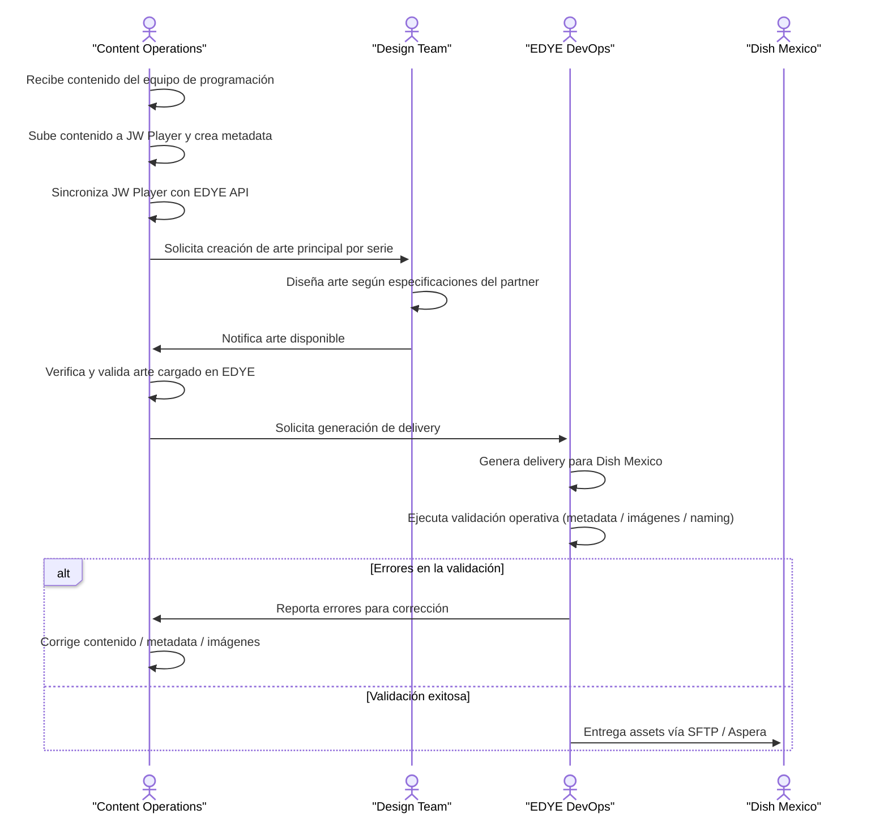

# Ingesta de Contenidos – Dish México

## 1. Descripción
Integración de ingesta VOD para Dish México mediante entrega de media,
metadata y artwork, operada principalmente vía Aspera.

## 2. Tipo de Ingesta
- Modalidad principal: Aspera
- Modalidad secundaria: API (si aplica)
- Frecuencia: diaria
- Volumen estimado: ~1500 assets/día

## 3. Canales de Entrega
### 3.1 Aspera
- Cuenta provista por Dish
- Directorios esperados:
  - /MEDIA
  - /METADATA
  - /ART

## 4. Flujo de Ingesta – Dish México

> **Figura 1.** Diagrama del flujo operativo del partner

Este flujo describe el proceso operativo completo desde la recepción del
contenido por parte del equipo de Content Operations hasta la entrega
final del contenido al cliente Dish México vía Aspera.

## 5. Metadata
- Estándar: CableLabs XML
- Versión: según especificación Dish
- Validaciones obligatorias:
  - ProgramID
  - Title
  - Rating
  - Language
  - Duration

> Ver Anexo: Metadata / XML CableLabs – Dish México

## 6. Reglas Específicas Dish
- Naming estricto por ProgramID
- Ingesta rechazada si falta artwork
- Reprocesos requieren reenvío completo

## 7. Dependencias
- Aspera
- Validador XML
- Pipeline estándar de Ingesta Edye

## 8. Referencias
- Modelo general: Ingesta de Contenidos
- Flujo general: Flujo de Ingesta de Contenidos
