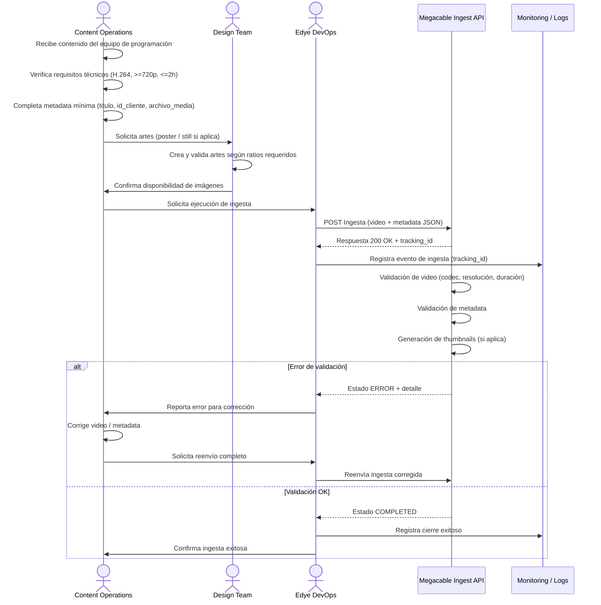

# Anexo por Partner — Megacable (Ingesta VOD Internacional)

## Introducción al diagrama de flujo

El siguiente diagrama de secuencia describe el flujo de ingesta de contenidos VOD para el partner Megacable, desde la preparación del contenido por el equipo de Operaciones hasta la validación final y confirmación de la ingesta.
El flujo se basa en el modelo genérico de ingesta de EDYE, utilizando como punto de entrada principal la API de Ingesta de Megacable, e incorporando validaciones técnicas automáticas, generación de derivados (thumbnails) y monitoreo operativo mediante identificadores de seguimiento (tracking_id).

Este diagrama permite visualizar claramente quién interviene en cada etapa, qué validaciones se ejecutan y cómo se gestionan los errores y reintentos, asegurando una integración consistente y reutilizable para este partner.



> **Figura 1.** Diagrama del flujo operativo del partner

## Descripción de la secuencia del flujo

1. **Recepción del contenido**  
   El equipo de Content Operations recibe el contenido desde el área de programación y realiza una verificación inicial de disponibilidad de video y materiales asociados.

2. **Validación técnica previa**  
   Antes de la ingesta, se valida que el archivo de video cumpla con los requisitos mínimos definidos para Megacable (codec H.264, resolución mínima 720p y duración máxima permitida).

3. **Preparación de metadata**  
   Content Operations completa la metadata mínima requerida para la ingesta, incluyendo título, identificador del cliente y referencia del archivo de media.

4. **Gestión de artes (si aplica)**  
   Cuando el partner requiere imágenes source, se solicita al Design Team la creación o validación de artes (poster, stills). Una vez disponibles, se confirma su cumplimiento de ratios y tamaños.

5. **Ejecución de la ingesta**  
   El equipo de Edye DevOps ejecuta la ingesta enviando el archivo de video y la metadata mediante un request POST a la API de Megacable. El sistema responde con un tracking_id único para el seguimiento del proceso.

6. **Validaciones automáticas del partner**  
   La API de Megacable ejecuta validaciones sobre el video, la metadata y, si corresponde, genera thumbnails u otros derivados de forma automática.

7. **Gestión de errores y reintentos**  
   Si ocurre un error de validación, el estado de la ingesta se marca como ERROR y se notifica a Content Operations para corrección del origen. Una vez corregido, se realiza un reenvío completo de la ingesta.

8. **Cierre exitoso y monitoreo**  
   Cuando todas las validaciones finalizan correctamente, la ingesta se marca como COMPLETED. El evento se registra en los sistemas de monitoreo y se notifica a Operaciones para el cierre del proceso.

---

## 1. Canal de entrega

### 1.1 Método principal (activo)

- **Tipo:** API REST
- **Endpoint ingesta:** `POST /api/ingesta/contenido`
- **Autenticación:** Bearer Token
- **Formato:** `multipart/form-data` (media) + JSON (metadata)

### 1.2 Método alterno / legado (si aplica)

- **Tipo:** FTP con polling (LEGACY)
- **Nota:** “endpoint FTP” planificado para descontinuarse en Q3 2025

### 1.3 Credenciales / rutas (a completar por partner)

- **Producción** - Base URL API: ****\*\*\*\*****\_\_****\*\*\*\***** - Token (vault/secret ref): ****\*\*\*\*****\_\_****\*\*\*\***** - (Si FTP aplica) Host: \***\*\_\_\*\*** Puerto: \_**\_ Usuario: **\_\_\***\* Ruta: **\_\_\_\_\*\*
- **QA / Sandbox** - Token de prueba (doc): `abc123` - Base URL QA: ****\*\*\*\*****\_\_****\*\*\*\*****

---

## 2. Estructura y naming

### 2.1 Para entrega por API (recomendado)

- No requiere árbol de carpetas para el “upload” (se adjunta archivo en request).
- **Naming recomendado (archivo_media):**

  `{id_cliente}{titulo_sanitizado}{yyyyMMdd}.mp4`

  Ejemplo: `7788_ElBosqueMagico_20251222.mp4`

### 2.2 Para entrega por FTP (si se mantiene habilitado)

- **Raíz FTP:** `/incoming/megacable/` - `/incoming/megacable/video/` - `/incoming/megacable/metadata/` - `/incoming/megacable/images/`
- **Ejemplos:** - `video/7788_ElBosqueMagico_20251222.mp4` - `metadata/7788_ElBosqueMagico_20251222.json` - `images/7788_ElBosqueMagico_poster_16x9.jpg`

---

## 3. Metadata

### 3.1 Campos obligatorios (mínimos)

- `titulo`
- `id_cliente`
- `archivo_media` (referencia al archivo adjunto o nombre del archivo)

### 3.2 Ejemplo de request (API)

- Ejemplo (curl, referencia): `-F file=@video.mp4 -F metadata='{...}'`

### 3.3 Ejemplo JSON mínimo (sugerido)

```json
{
  "titulo": "El Bosque Mágico",
  "id_cliente": "7788",
  "archivo_media": "7788_ElBosqueMagico_20251222.mp4"
}
```

### 3.4 Campos opcionales (si el partner los requiere)

- idioma: \***\*\_\_\*\***
- sinopsis: \***\*\_\_\*\***
- género/tema: \***\*\_\_\*\***
- temporada/episodio: \***\*\_\_\*\***
- tags/acrónimo: \***\*\_\_\*\***

---

## 4. Imágenes

> Nota: el pipeline contempla “creación de thumbnails” como proceso automático post-ingesta.

Si Megacable exige artes “source” o tamaños específicos, completar esta sección.

### 4.1 Lista de imágenes requeridas (a completar)

- Poster / Key Art (Show)
- Still (Episodio)
- Thumbnail (derivado)

### 4.2 Tamaños y ratio (a completar)

- `16:9 = ______ x ______`
- `2:3 = ______ x ______`
- `1:1 = ______ x ______`
- `Otros: __________________`

### 4.3 Watermark

- ¿Aplica watermark?: Sí / No / TBD
- Si aplica: nombre watermark en Admin + formatos asociados. (La gestión/validación de watermark y formatos se opera desde el módulo de Watermarks/Thumbnails del Admin).

---

## 5. Reglas de validación

### 5.1 Video (mínimos)

- Codec: H.264
- Resolución mínima: 720p
- Duración máxima: 2 horas

### 5.2 Metadata

- Campos mínimos presentes: titulo, id_cliente, archivo_media
- JSON válido (sin caracteres inválidos / encoding consistente)
- Consistencia entre archivo adjunto y archivo_media

### 5.3 Imágenes

- Si se entregan imágenes source: validar ratio y tamaño contra specs del partner (sección 4)
- Si se usa watermark: validar disponibilidad de watermark por formato antes de generar thumbnails

---

## 6. Criterios de aceptación

### 6.1 Aceptación técnica (API / Proceso)

- Ingesta responde 200 OK y retorna id (tracking id)
- El estado avanza a “completed” (sin quedar en “error”)
- El contenido pasa validaciones: `H.264, >=720p, <=2h`

### 6.2 Aceptación operativa (QC + evidencia)

- Thumbnails generados (si aplica) y disponibles para entrega/consulta (según configuración)
- Logs sin errores de validación para el tracking id (ver sección 7)
- Reporte/registro de entrega (Ticket/Monday/bitácora interna): **\*\*\*\***\_\_**\*\*\*\***

---

## 7. Operaciones al final (monitoreo, logs, alertas)

- Logs: Elastic/Kibana > IngestaLogs
- Eventos esperados: inicio carga, fin carga, errores de validación
- Indicadores clave: tiempo de procesamiento, % fallos por cliente
- Alertas críticas: más de 10 errores consecutivos por cliente

---

## 8. Reintentos / rollback

### 8.1 Reintentos recomendados (por estado)

- Estado “error” por “Formato no soportado” / “metadatos incompletos”:
  - Acción: corregir origen (transcode/metadata) y REENVIAR el request completo (archivo + metadata).
- Estado “received” o “processing” fuera de umbral operativo:
  - Acción: consultar status vía `GET /api/ingesta/status?id=xxx`
  - Si excede ventana interna: escalar a DevOps y evaluar reintento controlado.

### 8.2 Regenerar vs reenviar

- Regenerar (solo) cuando:
  - Falló creación de thumbnails/QC automatizado pero el media y metadata son válidos (regeneración interna).
- Reenviar completo cuando:
  - Cambia el archivo de video o cambia metadata obligatoria (id_cliente/titulo/archivo_media).
- Rollback (operativo):
  - Si un contenido “completed” debe retirarse, definir acción por catálogo (despublicación) y evidencias: **\*\*\*\***\_\_**\*\*\*\***

---

## 9. Soporte (contactos, horario, escalamiento) — A COMPLETAR

### Partner (Megacable)

- Contacto técnico: **\*\*\*\***\_\_**\*\*\*\***
- Email: **\*\*\*\***\_\_**\*\*\*\***
- Tel: **\*\*\*\***\_\_**\*\*\*\***
- Ventana de soporte: **\*\*\*\***\_\_**\*\*\*\*** (TZ)

### EDYE / HITN

- Operaciones (L1): **\*\*\*\***\_\_**\*\*\*\***
- DevOps (L2): **\*\*\*\***\_\_**\*\*\*\***
- Producto/Contenido (L3 si aplica): **\*\*\*\***\_\_**\*\*\*\***
- Severidades y SLA (si existen): **\*\*\*\***\_\_**\*\*\*\***
- Canal de escalamiento (Slack/Email/Ticket): **\*\*\*\***\_\_**\*\*\*\***
