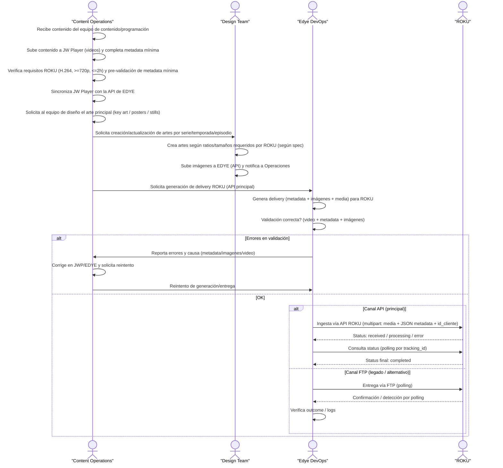

# Anexo por Partner — ROKU (Ingesta)

## Descripción general del flujo de integración

El siguiente diagrama describe el **flujo de integración por ingesta con el partner ROKU**, basado en el modelo estándar de Edye y adaptado a los requerimientos específicos del canal. El proceso cubre de extremo a extremo la preparación, validación y entrega de contenidos audiovisuales, desde la recepción del material por parte de Content Operations hasta la confirmación final de ingesta por ROKU.

El flujo contempla como **canal principal la ingesta vía API de ROKU**, utilizando un esquema `multipart` que combina media y metadata en formato JSON, con mecanismos de **seguimiento por estado (polling)** hasta su finalización. De forma controlada, también se considera un **canal alternativo/legado vía FTP**, únicamente en escenarios excepcionales.

A lo largo del proceso se integran controles de calidad sobre **video, metadata e imágenes**, con ciclos claros de corrección y reintento en caso de errores, garantizando trazabilidad, consistencia operativa y alineación con las especificaciones técnicas del partner. Este diagrama sirve como referencia única y reutilizable para operaciones, diseño y DevOps durante la ejecución y soporte de la integración con ROKU.


> **Figura 1.** Diagrama del flujo operativo del partner

## 1. Canal de entrega

**Método principal (recomendado / vigente):** API REST (Ingesta VOD)

- Endpoint: `POST /api/ingesta/contenido`
- Auth: Bearer Token
- Formato: `multipart/form-data` (media) + JSON (metadata)
- Status/tracking: `GET /api/ingesta/status?id=xxx` (usa Tracking ID retornado por la ingesta)
- Token (Sandbox): `abc123` (ejemplo)
- Token (Prod): TBD (por Roku)
- Base URL (QA/Prod): TBD
- Cliente/tenant: `id_cliente` (definido por operaciones/partner)

**Método alterno (legado):** FTP con polling (en desuso, será descontinuado Q3 2025)

**Referencia oficial:**

- [Especificación de ingesta (Roku Developer)](https://developer.roku.com/es-mx/trc-docs/video-on-demand/delivery/ingest-specifications.md)

---

## 2. Estructura y naming

**Modelo API:** No requiere árbol de carpetas.

**Convención recomendada (interno Edye → entrega a Roku):**

- Archivo de video: `external_id` o `title_id` + variante idioma/temporada/episodio si aplica

**Ejemplos:**

- `EDYE_S01E03_ES.mp4`
- `EDYE_MOV_000123_EN.mp4`

**Idempotencia / reintentos:** Mantener mismo identificador lógico (`external_id`) para rastrear reenvíos.

Si Roku exige estructura de archivos/paquetes, referenciar y alinear con su spec oficial.

---

## 3. Metadata

**Campos obligatorios mínimos:**

- `titulo`
- `id_cliente`
- `archivo_media` (en el multipart/form-data)

**Formato de envío:**

- `file=@video.mp4`
- `metadata='{...json...}'`

**Ejemplo de request:**

```http
POST /api/ingesta/contenido
Authorization: Bearer <token>
Content-Type: multipart/form-data

file: video.mp4
metadata: JSON
```

**Ejemplo JSON (mínimo + recomendado):**

```json
{
  "titulo": "Edye - Episodio 3",
  "id_cliente": "roku_premium_subs_mx",
  "external_id": "EDYE_S01E03_ES",
  "idioma": "es",
  "tipo": "episode",
  "temporada": 1,
  "episodio": 3,
  "duracion_seg": 1320,
  "rating": "TV-Y7",
  "generos": ["kids", "education"],
  "synopsis_corta": "Descripción breve del episodio."
}
```

> Nota: el doc técnico solo fija mínimos (`titulo`, `id_cliente`). El resto es extensión operativa para trazabilidad/QA. Si Roku exige esquema exacto, se ajusta a su spec.

---

## 4. Imágenes

En el flujo documentado, el procesamiento posterior incluye creación de thumbnails (automatizado).

**A completar por partner (ver guía oficial):**

- Tipos de imágenes requeridas: posters / cover / background / episodic stills / logo, etc.
- Tamaños/ratios: TBD (según Roku)
- Watermark: Sí/No (según acuerdo)

Si el modelo final exige “package” con artwork + metadata, dejar explícito aquí y vincular la spec.

---

## 5. Reglas de validación

**Video:**

- Resolución mínima: 720p
- Duración máxima: 2 horas
- Codec: H.264
- Formato: MP4 H.264 + JSON metadata

**Proceso/negocio:**

- Estados: `received`, `processing`, `error`, `completed`
- Errores comunes: formato no soportado, metadatos incompletos

**Imágenes:**

- Si Roku recibe imágenes, validar contra tamaños/ratio/watermark exigidos en la spec oficial.

---

## 6. Criterios de aceptación

Operaciones/QA debe confirmar como **ACEPTADO** cuando:

- Ingesta responde `200 OK` con `status=received` y Tracking ID
- El status del Tracking ID llega a `completed` (sin error)
- Cumple validaciones mínimas: H.264, ≥720p, ≤2h
- Metadata mínima completa (al menos `titulo`, `id_cliente`)
- QC/thumbnails generados OK (según logs)

---

## 7. Reintentos / rollback

**Reintentar (sin regenerar master) cuando:**

- Error por metadatos incompletos → corregir JSON y reenviar
- Error transitorio de red/timeouts → reenviar misma media + metadata (con mismo `external_id`)

**Regenerar media (nuevo encode) cuando:**

- Error por formato/codificación no soportada o falla de validación (codec/resolución/duración)

**Rollback (operativo):**

- Suele ser despublicación o corrección con reingesta del asset (si Roku lo permite por spec/operación)

---

## 8. Soporte

**Contactos a completar:**

- Roku Partner / Ops: Nombre + email + canal (Slack/Teams) — TBD
- Edye Content Operations: responsable de carga y validación
- Edye DevOps / Integraciones: monitoreo, troubleshooting, reintentos

**Monitoreo / logs:**

- Logs: Elastic/Kibana → IngestaLogs
- Alertas críticas: más de 10 errores consecutivos por cliente

**Horario y SLA:** TBD (definir por acuerdo operativo con Roku)
