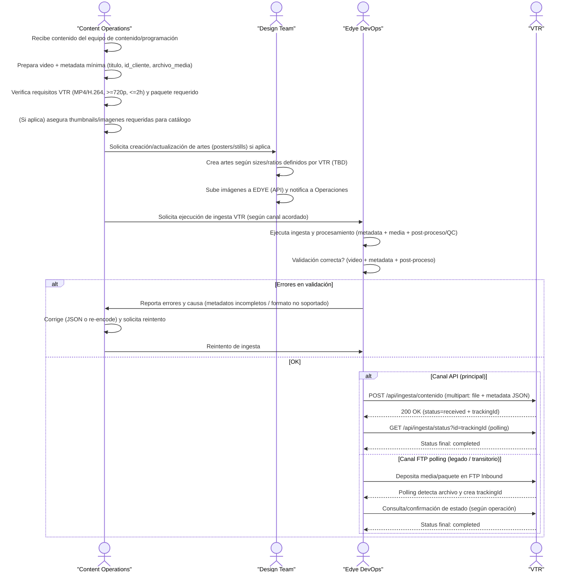

# Anexo por Partner — VTR (Integración por Ingesta)

## 1. Flujo de Ingesta – VTR

Este flujo describe el proceso de integración por ingesta con el partner VTR, siguiendo el modelo estándar de EDYE. El objetivo es asegurar que los contenidos audiovisuales (video, metadata e imágenes) cumplan con los requisitos técnicos y operativos definidos por VTR antes de ser ingeridos, procesados y marcados como `completed` en su plataforma.

El flujo está diseñado para ser reutilizable y controlado, incorporando validaciones tempranas, manejo de errores y reintentos, y soportando dos canales de entrada:

- **API REST (principal)**
- **FTP con polling (legado / transitorio)**

De esta manera, Operaciones, Diseño y DevOps trabajan de forma coordinada para garantizar una ingesta estable, trazable y con visibilidad de estado en cada etapa.

<div class="mermaid-zoom">



</div>
> **Figura 1.** Diagrama del flujo operativo del partner

## Descripción paso a paso del flujo de ingesta VTR

1) **Recepción del contenido**  
El equipo de Content Operations recibe el contenido audiovisual desde Programación o Contenidos (series, temporadas, episodios).

2) **Preparación de video y metadata mínima**  
Content Operations prepara el archivo de video y completa la metadata obligatoria requerida por VTR (por ejemplo: título, identificador de cliente y referencia al archivo de media).

3) **Validación previa de requisitos técnicos**  
Antes de iniciar la ingesta, se verifica que el contenido cumpla con las especificaciones técnicas de VTR, como formato MP4/H.264, resolución mínima de 720p y duración máxima permitida.

4) **Gestión de imágenes y artes (si aplica)**  
En caso de requerirse artes editoriales, Content Operations solicita al Design Team la creación o actualización de posters, stills u otros assets gráficos. El equipo de diseño genera las imágenes según los tamaños y ratios definidos por VTR y las carga en EDYE.

5) **Solicitud de ejecución de ingesta**  
Una vez validados video, metadata e imágenes, Content Operations solicita a Edye DevOps la ejecución del proceso de ingesta hacia VTR, utilizando el canal acordado.

6) **Ejecución de la ingesta y procesamiento**  
Edye DevOps ejecuta la ingesta, enviando el contenido mediante la API de VTR (canal principal) o a través de FTP con polling (canal alternativo). Durante esta etapa se procesan el video, la metadata y el post-proceso automático (QC y generación de thumbnails).

7) **Validación del resultado**  
DevOps valida que la ingesta se haya completado correctamente, revisando el estado del proceso (`received`, `processing`, `error` o `completed`) y confirmando que no existan fallas en video, metadata o procesamiento.

8) **Manejo de errores y reintentos**  
Si se detectan errores (por ejemplo, metadata incompleta o formato de video no soportado), DevOps reporta la causa a Content Operations. El equipo corrige los insumos necesarios y solicita un reintento de la ingesta.

9) **Cierre exitoso de la ingesta**  
Cuando el estado final es `completed`, se confirma el cierre operativo del flujo. El contenido queda correctamente ingerido en VTR y el proceso se registra para monitoreo, reporting y auditoría.

---

## 1. Canal de entrega

### Modelo de entrada (ingesta)

- **API REST (principal):** `POST /api/ingesta/contenido`
- **Autenticación:** Bearer Token
- **Payload:** `multipart/form-data` con:
  - `file` (media)
  - `metadata` (JSON)
- **Tracking:** respuesta inicial entrega un id (tracking ID), luego consulta por `GET /api/ingesta/status?id=xxx`

> **⚠️ FTP con polling (legado / en transición):**
>
> Punto de entrada histórico, en proceso de descontinuación Q3 2025 (confirmar si aplica aún en PROD).

### Flujo híbrido (operación histórica)

- VTR como Hybrid Delivery (Manual + API): videos en folders en Aspera; la API toma los videos, genera metadata y sube con imágenes a HITN Aspera; el delivery final para VTR incluye imágenes + metadata.
- Nota: mantener ambos flujos en el anexo para evitar confusión de equipos.

### Ambientes

- Desarrollo, QA, Producción.
- Token de prueba para sandbox: `abc123` (no exponer secretos reales).

### Endpoints de OAuth/entitlement (no ingesta, pero útil para soporte):

- Endpoints de OAuth/token/logout y autorización para validación integral del partner.

---

## 2. Estructura y naming

La ingesta por API no define árbol de carpetas ni naming de archivos. Se propone base para estandarizar (TBD validar con VTR):

```text
/VTR/INBOUND/VIDEOS/YYYY/MM/DD/
	SERIES_<externalId>_S<season>_E<episode>_<lang>_<version>.mp4
/VTR/INBOUND/METADATA/YYYY/MM/DD/
	SERIES_<externalId>_S<season>_E<episode>_<lang>.json
/VTR/INBOUND/IMAGES/YYYY/MM/DD/
	SERIES_<externalId>_poster_<WxH>.jpg
	SERIES_<externalId>_S<season>_E<episode>_still_<WxH>.jpg
```

**Reglas mínimas recomendadas de naming:**

- Sin tildes / caracteres invisibles; UTF-8 consistente.
- Sin espacios; usar `_` o `-`.
- IDs estables (ideal: `externalId` o `id_cliente` + un `contentId` propio del catálogo).

---

## 3. Metadata

### Campos obligatorios

- `titulo`
- `id_cliente`
- `archivo_media`

### Ejemplo JSON mínimo

```json
{
  "titulo": "Nombre del contenido",
  "id_cliente": "VTR",
  "archivo_media": "video.mp4",
  "tipo": "episode",
  "content_id": "ext-12345",
  "serie": "Serie X",
  "temporada": 1,
  "episodio": 3,
  "idioma": "es",
  "rating": "G",
  "duracion_seg": 1320,
  "sinopsis": "Descripción corta para catálogo.",
  "tags": ["kids", "comedy"]
}
```

---

## 4. Imágenes

### Especificación técnica

- En procesamiento posterior: creación de thumbnails y QC automatizado. No define tamaños/ratios específicos.

### Flujo operativo (híbrido)

- Delivery histórico: imágenes + metadata como entregables.

### Plantilla de imágenes (TBD por VTR)

- Posters (serie)
- Stills (episodio)
- Thumbnails derivados (si VTR consume thumbs específicos)

### Watermark

- No especificado (TBD)

---

## 5. Reglas de validación

### Video

- Resolución mínima: 720p
- Duración máxima: 2h
- Codificación: H.264
- Contenedor/Tipo: MP4 H.264

### Metadata

- “Metadatos incompletos” figura como error común.

### Imágenes

- No hay reglas explícitas (TBD), aunque se generan thumbnails en el post-proceso.

### Estados del proceso (API)

- `received`, `processing`, `error`, `completed`

### Errores comunes (API)

- Formato no soportado
- Metadatos incompletos

---

## 6. Criterios de aceptación

### Operaciones EDYE valida:

- El `POST /api/ingesta/contenido` responde `200 OK` con `status: received` e id válido.
- El `GET /api/ingesta/status?id=xxx` llega a `completed`.
- Validación técnica de media: `MP4/H.264, >=720p`, duración `<=2h`.
- Validación de metadata: `titulo`, `id_cliente`, `archivo_media` presentes y coherentes.
- Evidencia de post-proceso: thumbnails generados / QC automático sin fallas (según logs/monitoreo).
- Si aplica flujo híbrido de delivery (imágenes+metadata): confirmación de disponibilidad del paquete final según canal definido (Aspera).

---

## 7. Reintentos / rollback

### Reintentos recomendados (ingesta API)

- Si el estado queda en error por:
  - “Formato no soportado” → re-encode / reemplazar archivo y reingestar.
  - “Metadatos incompletos” → corregir JSON y reingestar.

### Regenerar vs reenviar completo (criterio práctico)

- Regenerar (parcial) cuando el media es válido y el problema fue metadata (cambio en JSON) o un campo faltante.
- Reenviar completo cuando cambia el archivo de video (nuevo encode) o cambian insumos que afectan thumbnails/QC.

### Rollback

- En ingesta, el “rollback” típico es: invalidar/retirar el asset en el catálogo (si ya propagó), y reingestar versión corregida con nuevo tracking.
- No se define endpoint de “delete/rollback” para ingesta (TBD).

---

## 8. Soporte

### Monitoreo / logs

- Logs: Elastic/Kibana > IngestaLogs
- Indicadores: tiempo de procesamiento, % fallos por cliente.
- Alertas críticas: >10 errores consecutivos por cliente.

### Sistemas involucrados (para triage)

- Ingest Processor
- Metadata Parser
- Media Transcoder
- Dependencias: S3 bucket, AWS Lambda, Kafka

### Escalamiento sugerido (EDYE)

- Operaciones de Contenido: valida inputs (metadata mínima + archivo).
- Equipo técnico de Integraciones/Backend: revisa logs + estado por tracking ID.
- DevOps: incidentes de infraestructura (S3/Lambda/Kafka), degradación o colas.

### Contactos / horario

- No vienen en los documentos adjuntos → TBD (añadir: nombre, email, Slack/Teams, horario, y “on-call” si aplica).

---

## 9. Notas finales específicas de VTR

- Mantener visible la dualidad:
  - Ingesta (entrada a EDYE vía API/FTP)
  - Delivery operativo/histórico (videos en Aspera + entrega de imágenes/metadata)
