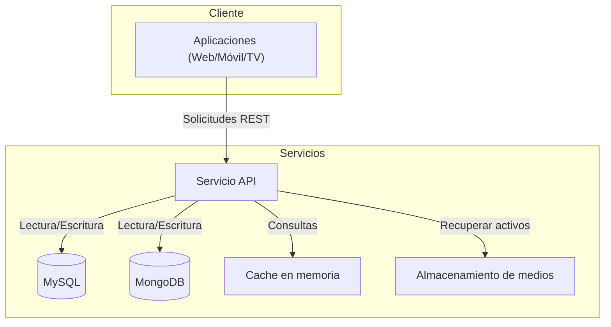

**Versión:** 1.0  
**Fecha:** 01/12/2025

---

# Servicio API

## 1. Introducción y propósito

Este documento describe la arquitectura, el despliegue y las prácticas operativas del servicio API del ecosistema EDYE/HITN Digital. El objetivo del servicio es proporcionar una capa de acceso estandarizada a los catálogos de vídeos, libros y juegos, tanto para aplicaciones propias (web, móviles y TV) como para integraciones con distribuidores. El público objetivo del documento son los equipos de DevOps, Operaciones, SRE y Seguridad.

## 2. Descripción funcional

El servicio API constituye el núcleo de comunicación entre clientes y recursos de contenido. Sus principales funciones son:

- **Exposición de contenidos:** ofrece endpoints REST para recuperar listados de series, episodios, libros y juegos, junto con metadatos multilingües.
- **Autenticación de socios:** gestiona la autenticación de distribuidores y usuarios finales. El API implementa flujos de autenticación para proveedores de TV de pago (MVPD) y para clientes directos de la plataforma.
- **Gestión de usuarios y perfiles:** permite crear cuentas, validar credenciales y administrar perfiles de menores y padres.
- **Continuidad de consumo:** proporciona endpoints para funciones como “seguir viendo” y listas de favoritos. Según el estudio de Coorva, estas funcionalidades se construyeron sobre un stack Node.js/NextJS con base de datos MongoDB ([truefirms.co](https://truefirms.co)).
- **Procesamiento de imágenes y activos:** ofrece servicios de redimensionamiento y optimización de imágenes para los clientes.

## 3. Arquitectura y componentes

El servicio está diseñado como microservicio de alto rendimiento en Node.js. Los principales componentes son:

| Componente                | Descripción                                                                                                                                                                                                                                                                                                                                                                                |
| ------------------------- | ------------------------------------------------------------------------------------------------------------------------------------------------------------------------------------------------------------------------------------------------------------------------------------------------------------------------------------------------------------------------------------------ |
| **Plataforma Node.js**        | Implementado sobre Node.js, que emplea un bucle de eventos para operaciones de E/S no bloqueantes. Este modelo permite atender muchas solicitudes simultáneamente, lo que es fundamental para un servicio de contenido.                                                                                                                                                                    |
| **Framework y controladores** | Se utiliza un framework HTTP (p. ej., Express o Fastify) para definir rutas REST, controladores y middlewares.                                                                                                                                                                                                                                                                             |
| **Bases de datos**            | 1) **MySQL** para datos relacionales como cuentas de usuario, metadatos de títulos y sus relaciones. MySQL es reconocido por su fiabilidad y soporte a ACID. 2) **MongoDB** para datos semiestructurados relacionados con la continuidad de visualización (listas de reproducción, favoritos). Laravel admite MongoDB mediante un paquete oficial, facilitando la integración con otros servicios. |
| **Servicios de cache**        | Utiliza caché en memoria (p. ej., Redis) para almacenar respuestas frecuentes y reducir la latencia.                                                                                                                                                                                                                                                                                       |
| **Servicios externos**        | Interactúa con servicios de almacenamiento para obtener activos multimedia y con el servicio de suscripciones para validar licencias de acceso.                                                                                                                                                                                                                                            |

### 3.1. Diagrama de arquitectura (Mermaid)

Este diagrama resume la interacción principal entre clientes, bases de datos y servicios de soporte.

## 4. Modelo de despliegue

El servicio se gestiona mediante pipelines de CI/CD que garantizan la integridad del código y la confiabilidad de los despliegues:

- **Control de versiones:** el código fuente se almacena en un repositorio Git con ramas para desarrollo, staging y producción.
- **Construcción y pruebas:** al realizar cambios, se ejecutan pruebas unitarias y de integración que validan las rutas, el manejo de errores y la compatibilidad con las bases de datos.
- **Contenerización:** se empaqueta la aplicación en una imagen de contenedor. Las variables de configuración (puertos, credenciales de bases de datos, claves de servicios externos) se inyectan como variables de entorno.
- **Despliegue:** las imágenes se publican en entornos de desarrollo, staging y producción. El orquestador se encarga del escalado horizontal y del balanceo de carga. Las actualizaciones se realizan mediante despliegues continuos (rolling update) para evitar interrupciones.

## 5. Monitoreo y observabilidad

Se instrumentan las siguientes prácticas:

- **Métricas técnicas:** latencia de peticiones, throughput (peticiones por segundo), porcentaje de errores 4xx y 5xx, utilización de CPU/memoria y conexión a base de datos.
- **Registros:** Node.js genera logs estructurados con nivel de severidad y trazas de solicitudes (IDs correlacionados). Los logs se recolectan en un servicio centralizado para análisis y auditoría.
- **Trazas distribuidas:** se implementa instrumentation para asociar cada solicitud con un identificador que se transmite a los servicios asociados (Cloud, Billing, Play). Esto facilita el seguimiento de errores en la cadena de servicios.
- **Alertas:** se configuran alertas basadas en métricas (p. ej., latencia alta, errores de base de datos) que notifican al equipo SRE mediante sistemas de mensajería corporativos.

## 6. Seguridad y accesos

La seguridad es una prioridad en el diseño del API:

- **Autenticación y autorización:** se implementan estándares de autorización con tokens firmados (por ejemplo, JWT) y control de acceso basado en scopes. Los distribuidores utilizan flujos de autenticación específicos (OAuth 2.0) para validar sus credenciales.
- **Cifrado de comunicaciones:** todas las interacciones se realizan mediante HTTPS/TLS. Para las conexiones a las bases de datos se utilizan túneles cifrados.
- **Protección contra abusos:** se aplican límites de tasa (rate limiting) y validación de peticiones para mitigar ataques de fuerza bruta y denegación de servicio.
- **Gestión de secretos:** las credenciales y claves de API se almacenan en gestores de secretos y se rotan periódicamente.

## Continuidad operativa

Para garantizar un servicio disponible y resiliente se aplica lo siguiente:

- **Escalado horizontal:** se ejecutan múltiples réplicas del API con balanceo de carga. Esto permite absorber picos de tráfico asociados a eventos o estrenos.
- **Replicación y backups:** la base de datos MySQL se replica a nodos secundarios y se programan copias de seguridad regulares. Los datos en MongoDB se replican en clústeres con réplica integrada.
- **Failover:** se definen procedimientos de conmutación automática ante fallos en los nodos de aplicación o en las bases de datos. Los contenedores monitorizan su estado y se reinician ante caídas.
- **Pruebas de resiliencia:** se realizan ensayos controlados de caída de nodos y de saturación para validar la capacidad de recuperación.

## 7. Dependencias y comunicación

El API interactúa con diversos servicios del ecosistema:

- **Servicio Admin:** recibe actualizaciones de metadatos y notifica operaciones completadas. El Admin es el origen de la mayoría de los cambios de catálogo.
- **Servicio Billing:** consulta la información de suscripción y derecho de acceso antes de entregar contenidos premium.
- **Servicio Cloud:** obtiene las URL de activos (videos, imágenes, libros) y gestiona firmas de acceso.
- **Servicio Play/Aplicaciones:** los clientes finales consumen el API para presentar contenido a los usuarios.
- **Servicio Connect:** proporciona tokens de autorización cuando la autenticación se realiza a través de distribuidores externos.

Cada integración utiliza contratos de API versionados para mantener la compatibilidad y la trazabilidad.
