**Versión:** 1.0  
**Fecha:** 01/12/2025

---

## 1. Introducción y propósito

El servicio Billing es responsable de la gestión de suscripciones y transacciones dentro de la plataforma EDYE/HITN Digital. Su objetivo es asegurar que solo los usuarios con planes activos o derechos válidos puedan acceder al contenido premium, administrar la facturación y proporcionar información de cobro para los distintos módulos. Este documento detalla los componentes de infraestructura y los procesos operativos para los equipos de DevOps, Operaciones, SRE y Seguridad.

## 2. Descripción funcional

Las funciones principales del servicio son:

- **Gestión de paywall:** controla el acceso a contenido restringido mediante una barrera de pago. Según la descripción de los sistemas de paywall, este mecanismo obliga a los visitantes a proporcionar datos (correo electrónico) o a suscribirse antes de acceder.
- **Gestión de suscripciones:** mantiene el registro actualizado de planes, ciclos de facturación y estado de cada suscriptor. El software de suscripción administra información de pago, cambios de tarifa y transacciones como reembolsos.
- **Procesamiento de pagos:** integra la plataforma con un proveedor de pagos externo para autorizar cobros y almacenar tokens de pago. Los datos sensibles no se guardan en los sistemas internos.
- **Control de acceso:** emite tokens de acceso y comprueba el estado de la suscripción de un usuario antes de permitir la visualización de contenidos. Este control se realiza en coordinación con el servicio API y con el front‑end de reproducción.
- **Reportes y reconciliación:** genera reportes para áreas de negocio (ingresos, cancelaciones) y facilita la conciliación con los proveedores de pagos.

## 3. Arquitectura y componentes

El servicio Billing está compuesto por los siguientes elementos:

| Componente                 | Descripción                                                                                                                                                                                                                                     |
| -------------------------- | ----------------------------------------------------------------------------------------------------------------------------------------------------------------------------------------------------------------------------------------------- |
| Interfaz de pago           | API que expone las operaciones de suscripción, cancelación y renovación. La interfaz se basa en Node.js/Express para orquestar los flujos y comunicarse con servicios externos.                                                                 |
| Proveedor de suscripciones | La plataforma utiliza un servicio de terceros especializado en paywall y administración de suscripciones para mantener la información de clientes. Este proveedor ofrece herramientas para crear planes, actualizar precios y procesar cambios. |
| Base de datos interna      | Se almacena información no sensible como identificadores de clientes, historial de cambios y correlaciones con usuarios de EDYE. Para ello se emplea MySQL por su fiabilidad y soporte a ACID.                                                  |
| Servicios auxiliares       | Incluyen un servicio de notificaciones para enviar correos electrónicos sobre renovaciones y vencimientos, y un servicio de conciliación para comparar registros internos con los reportes del proveedor de pagos.                              |

### 3.1. Diagrama de arquitectura

```mermaid
flowchart TD
    User[Usuario / Servicio Play] --> Billing[Servicio Billing]
    Billing --> External[Plataforma de suscripciones]
    External --> Billing
    Billing --> DB[(Base de datos interna MySQL)]
    Billing --> API[Servicio API]
    Billing --> Aux["Servicios auxiliares<br/>(notificaciones, conciliación)"]
```

> **Figura 1.** Diagrama de arquitectura

## 4. Flujo general

1. El usuario inicia un proceso de suscripción desde el front‑end (web o aplicación). La interfaz solicita información mínima (correo y plan deseado). El paywall exige la suscripción para acceder al contenido.
2. La información de pago se envía a la plataforma de suscripciones externa, que procesa el cobro y devuelve un token de pago autorizado.
3. El servicio Billing almacena un registro del usuario y del token, actualiza su estado a activo y notifica al API para habilitar el acceso.
4. En cada petición al API de contenidos, éste consulta el servicio Billing para validar que la suscripción está vigente antes de entregar el recurso.
5. En caso de cancelación o expiración, se actualiza el estado y se revocan los permisos correspondientes.

## 5. Modelo de despliegue

El código del servicio reside en un repositorio gestionado mediante control de versiones. El pipeline de CI/CD contempla:

- **Pruebas y validación:** se ejecutan pruebas unitarias para verificar la lógica de cálculo de fechas de renovación, verificación de tokens y comunicación con el proveedor externo.
- **Empaquetado:** se construye una imagen de contenedor con la aplicación y se gestionan variables sensibles mediante secretos de despliegue.
- **Despliegue:** la imagen se despliega en entornos de desarrollo, staging y producción. Se utilizan réplicas para alta disponibilidad y se configura auto‑escalado basado en consumo de CPU y número de transacciones.
- **Integración con servicios externos:** se registran claves de API y certificados para la conexión segura con el proveedor de suscripciones.

## 6. Monitoreo y observabilidad

Para garantizar un servicio confiable se monitorizan:

- **Indicadores de negocio:** número de suscripciones activas, cancelaciones, ingresos recurrentes mensuales (MRR), fallos de cobro.
- **Indicadores técnicos:** latencia de peticiones a la plataforma externa, tiempos de respuesta del API, ratio de errores 4xx/5xx, utilización de CPU y memoria.
- **Logs:** se registran eventos de suscripción (altas, renovaciones, cancelaciones) y se envían a un sistema centralizado. Se filtran datos sensibles para cumplir con normativas de protección de datos.
- **Alertas:** se configuran umbrales (p. ej., tasa de fallos de cobro superior al 2 %) que disparan notificaciones al equipo de operaciones.

## 7. Seguridad y accesos

El tratamiento de datos de pago requiere medidas estrictas:

- **Cumplimiento PCI DSS:** se delega el procesamiento de tarjetas al proveedor de pagos, evitando el almacenamiento de información financiera en nuestros sistemas. Las comunicaciones con el proveedor se realizan mediante TLS.
- **Autenticación y autorización:** las operaciones de alta, baja y renovación se protegen mediante autenticación de usuarios y tokens de sesión. Solo el API y las aplicaciones con permisos válidos pueden invocar los endpoints internos.
- **Cifrado:** se cifran en tránsito las comunicaciones entre el servicio Billing y los demás servicios (API, Play). Además, los identificadores de transacción se enmascaran en los registros.
- **Políticas de retención:** los datos de suscripción se conservan el tiempo mínimo necesario para cumplir con obligaciones legales y se eliminan de forma segura al finalizar.

## 8. Continuidad operativa

El servicio se diseña para ser resiliente ante fallos:

- **Alta disponibilidad:** se ejecutan varias réplicas en distintas zonas de disponibilidad. La pérdida de una instancia no impacta en la capacidad de procesar pagos.
- **Backups y replicación:** la base de datos interna se respalda regularmente. Los datos críticos como tokens de suscripción se pueden reconstituir desde el proveedor externo en caso de fallo.
- **Mecanismos de reintento:** las peticiones a la plataforma externa implementan reintentos con back‑off exponencial para manejar fallos temporales.
- **Planes de contingencia:** se documentan procedimientos para suspender temporalmente la facturación ante incidencias críticas y reanudarla cuando se resuelvan.

## 9. Dependencias y comunicación

Las principales integraciones del servicio son:

- **API de contenidos:** consulta el estado de suscripción en cada solicitud de recurso premium. La comunicación se realiza mediante endpoints internos autenticados.
- **Plataforma de pagos externa:** se utiliza para gestionar suscripciones, procesar cobros y emitir tokens de acceso. No se almacena información financiera en los sistemas de EDYE.
- **Servicio Play:** durante el flujo de suscripción, la aplicación de reproducción redirige al usuario hacia el servicio Billing para completar la compra y luego obtiene el token de autorización.
- **Servicio Admin:** permite a los operadores revisar el estado de las cuentas de distribuidores y sus permisos de acceso al contenido premium.

Todas las comunicaciones utilizan contratos de API versionados y se securizan con claves de acceso y certificados para garantizar la confidencialidad e integridad de los datos.
