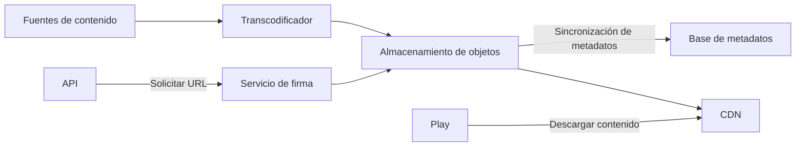

**Versión:** 1.0  
**Fecha:** 01/12/2025

---
# Servicio Cloud

## Introducción y propósito

El servicio Cloud proporciona la infraestructura de almacenamiento y distribución de contenidos en el ecosistema EDYE/HITN Digital. Su rol es almacenar vídeos, audios, imágenes, libros y archivos de juegos, y entregarlos de forma eficiente y segura a los usuarios finales y a los demás servicios internos. Este documento detalla su arquitectura, procesos de despliegue, observabilidad y controles de seguridad.

## Descripción funcional

Las responsabilidades principales del servicio son:

- **Almacenamiento de activos:** guarda de forma persistente todos los elementos multimedia del catálogo (vídeos en distintos bitrates, carátulas, e‑books y juegos). Utiliza un servicio de almacenamiento de objetos escalable y distribuido, con control de versiones y replicación geográfica.
- **Procesamiento y conversión:** integra pipelines para transcodificar vídeos a diferentes resoluciones y formatos adaptativos. También genera miniaturas e imágenes optimizadas para su uso en el servicio Play.
- **Distribución mediante CDN:** entrega contenidos a usuarios finales a través de una red de distribución de contenidos (CDN) que minimiza la latencia y mejora la experiencia de streaming.
- **Gestión de metadatos de archivos:** mantiene un catálogo interno de activos con etiquetas, versiones y políticas de expiración. Este catálogo se sincroniza con el servicio API y el servicio Admin.
- **Entrega segura:** proporciona URLs firmadas con expiración para proteger el acceso y controlar el tiempo de vida de los enlaces de descarga.

## Arquitectura y componentes

El servicio Cloud se compone de varias capas:

| Componente                 | Descripción                                                                                                                                                                                                                     |
| -------------------------- | ------------------------------------------------------------------------------------------------------------------------------------------------------------------------------------------------------------------------------- |
| Almacenamiento de objetos  | Sistema de almacenamiento distribuido que permite guardar objetos de cualquier tamaño. Permite la replicación en múltiples zonas para alta disponibilidad y durabilidad.                                                        |
| Transcodificador           | Motor que ingiere los archivos fuente y genera versiones adaptadas para streaming (HLS/DASH). También produce miniaturas e imágenes redimensionadas utilizadas por el servicio Admin y Play. |
| CDN                        | Red global que almacena copias en caché de los activos para reducir la latencia en la entrega a usuarios finales. Configura políticas de cache, invalidación y protección contra descargas masivas.                             |
| Servicio de firma          | Componente que genera firmas temporales y tokens de acceso para que el contenido solo sea accesible con permisos válidos.                                                                                                       |
| Base de datos de metadatos | Conserva información asociada a cada archivo: ubicación física, versiones, estatus de transcodificación y relaciones con títulos del catálogo.                                                                                  |

### Diagrama de arquitectura

## Modelo de despliegue

El servicio se despliega siguiendo prácticas de infraestructura como código y pipelines automatizados:

- **Aprovisionamiento:** los recursos de almacenamiento, transcodificación y CDN se definen mediante plantillas (p. ej., Terraform o CloudFormation) y se desplegaron en la nube pública.
- **CI/CD:** los scripts de automatización se actualizan y se ejecutan en pipelines que verifican sintaxis, simulan despliegues y aplican cambios en entornos de desarrollo, staging y producción.
- **Despliegue de microservicios:** el servicio de firma y el catálogo de metadatos se empaquetan en contenedores. Se despliegan en clústeres con escalado horizontal y balanceo de carga.
- **Versionado de activos:** los cambios en las configuraciones de transcodificación y políticas de CDN se versionan y se publican mediante las mismas herramientas de automatización.

## Monitoreo y observabilidad

Para asegurar la calidad y disponibilidad de la distribución se monitorizan:

- **Métricas de almacenamiento:** capacidad usada, tasa de lectura/escritura, errores de acceso.
- **Métricas de transcodificación:** tiempo de procesamiento por archivo, número de trabajos en cola y fallos de conversión.
- **Desempeño de CDN:** latencia, tasa de aciertos de caché, número de solicitudes servidas y distribución geográfica del tráfico.
- **Registros:** se registran accesos a objetos, generación de URLs firmadas y operaciones de transcodificación. Estos registros se almacenan en un sistema central para auditoría y detección de anomalías.
- **Alertas:** se configuran umbrales (p. ej., utilización de almacenamiento al 80 %, fallos de transcodificación persistentes) que disparan alertas al equipo SRE.

## Seguridad y accesos

Dado que maneja contenido protegido, se aplican controles de seguridad estrictos:

- **Controles de acceso:** los buckets de almacenamiento están configurados con políticas que restringen el acceso a servicios autenticados. Solo el servicio API y el servicio Play pueden solicitar URLs firmadas.
- **Cifrado:** los objetos se cifran tanto en reposo como en tránsito. Se utilizan claves gestionadas y se rotan periódicamente.
- **URLs firmadas:** cada enlace de descarga incluye una firma generada por el servicio de firma que limita la validez temporal y la IP que lo puede utilizar. Esto evita la redistribución no autorizada.
- **Validación de integridad:** se calculan sumas de verificación (checksums) de los archivos al cargarlos y al entregarlos para detectar corrupciones.

## Continuidad operativa

Las prácticas de resiliencia incluyen:

- **Replicación geográfica:** los objetos se replican en múltiples regiones para protegerse contra fallos regionales.
- **Backups:** aunque el almacenamiento de objetos ofrece alta durabilidad, se generan backups periódicos de los metadatos y de las configuraciones de transcodificación.
- **Estrategias de failover:** se configuran rutas alternativas en la CDN y políticas de conmutación a regiones secundarias en caso de incidentes graves.
- **Pruebas de recuperación:** se realizan ejercicios programados de restauración y de conmutación para comprobar los tiempos de recuperación objetivos.

## Dependencias y comunicación

El servicio Cloud interactúa con los siguientes módulos:

- **Servicio API:** solicita la creación de URLs firmadas para permitir el acceso a archivos. También actualiza el catálogo de metadatos cuando se suben nuevos activos o se completan transcodificaciones.
- **Servicio Admin:** carga nuevas imágenes y activa conversiones de portada. Recupera vistas en miniatura para presentación en el panel administrativo.
- **Servicio Play:** consume las URLs firmadas para reproducir vídeos, mostrar portadas y descargar libros o juegos.
- **Servicio Satellite:** obtiene archivos relacionados con listas de reproducción y elementos de seguimiento para sincronizar el progreso del usuario.

Estas interacciones se gestionan mediante API internas, asegurando el control de acceso y la trazabilidad de cada operación.
