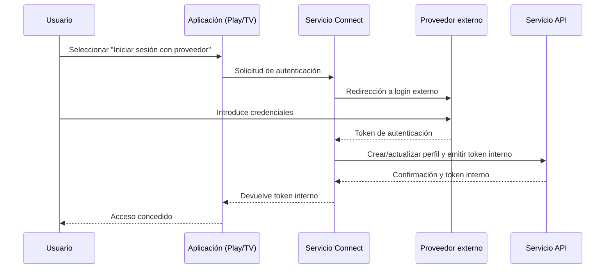

**Versión:** 1.0  
**Fecha:** 01/12/2025

---

## Introducción y propósito

El servicio Connect, también denominado Conecta, es el componente encargado de autenticar a los usuarios que acceden a EDYE/HITN Digital a través de distribuidores externos (por ejemplo, proveedores de televisión de pago). Este documento ofrece una descripción técnica de su infraestructura y de los procedimientos operativos para los equipos de DevOps, SRE, Operaciones y Seguridad.

## Descripción funcional

Las funciones clave del servicio son:

- **Integración con proveedores externos:** implementa flujos de autenticación (TV Everywhere) que permiten a los suscriptores de distribuidores identificarse con sus credenciales externas y obtener permisos sobre el contenido.
- **Gestión de sesiones:** una vez completada la autenticación con el proveedor, emite tokens internos que se utilizan para acceder a los demás servicios. Estos tokens incluyen información sobre los derechos de visualización, la expiración y el identificador de usuario.
- **Sincronización de perfiles:** crea o actualiza perfiles locales (en el servicio API) basados en la información devuelta por el distribuidor y los vincula al historial de visualización existente.
- **Compatibilidad multiplataforma:** el servicio es utilizado por aplicaciones web, móviles y de TV para redirigir al usuario hacia el flujo de autenticación del proveedor y recuperar el resultado de forma transparente.

## Arquitectura y componentes

El servicio se implementa como un microservicio orientado a integraciones externas. Los componentes incluyen:

| Componente               | Descripción                                                                                                                                                                                                         |
| ------------------------ | ------------------------------------------------------------------------------------------------------------------------------------------------------------------------------------------------------------------- |
| Gateway de autenticación | Servicio API que expone endpoints para iniciar y completar el flujo de autenticación. Encapsula la lógica específica de cada distribuidor (redirecciones, parámetros y manejo de respuestas).                       |
| Módulos de proveedor     | Cada proveedor de televisión se gestiona mediante un módulo que implementa el protocolo de autenticación acordado (OAuth 2.0, SAML u otros). Los módulos encapsulan los endpoints, scopes y parámetros específicos. |
| Base de datos de sesión  | Almacena tokens temporales y estados intermedios. Se utiliza una base de datos rápida (p. ej., Redis o MySQL) para realizar la correlación entre la solicitud inicial y la respuesta del proveedor.                 |
| Integración con API      | Una vez autenticado el usuario, el servicio comunica al API la creación o actualización del perfil, incluyendo los permisos obtenidos.                                                                              |
| Frontend de TV           | Algunos flujos se implementan como páginas web adaptadas a dispositivos de TV, desarrolladas en Laravel/Next JS para compatibilidad con navegadores embebidos.                                                      |

### Diagrama de secuencia

> **Figura 1.** Diagrama de arquitectura

## Modelo de despliegue

El servicio se despliega como microservicio independiente con las siguientes prácticas:

- **Repositorios y versionado:** el código fuente se separa por módulos de proveedor, permitiendo actualizaciones sin afectar a los demás. Las versiones se etiquetan y se mantienen contratos de integración con cada distribuidor.
- **Pipelines CI/CD:** al agregar un nuevo proveedor o actualizar un módulo, se ejecutan pruebas de integración que simulan los flujos de autenticación. La imagen de contenedor resultante se despliega en entornos de desarrollo, staging y producción.
- **Configuración dinámica:** los endpoints y parámetros de cada proveedor se gestionan mediante archivos de configuración o bases de datos que se recargan sin necesidad de desplegar código.
- **Escalado:** se configuran réplicas para absorber picos cuando hay eventos en vivo que generan autenticaciones masivas.

## Monitoreo y observabilidad

Para garantizar fiabilidad y detectar problemas con proveedores externos se supervisa:

- **Tasa de autenticación:** número de flujos iniciados, completados y fallidos por proveedor.
- **Tiempo de autenticación:** tiempo medio que transcurre desde que se inicia el flujo hasta que se entrega el token interno. Un aumento puede indicar problemas con el proveedor.
- **Errores específicos:** registro de códigos de error devueltos por los proveedores para análisis y comunicación con ellos.
- **Logs de auditoría:** se registran las solicitudes entrantes y salientes, asegurando que no se almacenen credenciales. Estos logs permiten rastrear incidencias de usuarios y detectar comportamientos anómalos.
- **Alertas:** se configuran para fallos de autenticación masivos o indisponibilidad de algún proveedor.

## Seguridad y accesos

El servicio maneja tokens y credenciales sensibles, por lo que aplica medidas estrictas:

- **Protección de tokens:** los tokens de proveedor se mantienen en memoria el tiempo mínimo necesario y se cifran antes de almacenarse temporalmente.
- **Cifrado de comunicaciones:** todas las interacciones con proveedores y con el API se realizan mediante HTTPS/TLS.
- **Validación de respuestas:** se valida la firma y la integridad de los tokens devueltos por los proveedores. Solo se aceptan respuestas provenientes de dominios autorizados.
- **Política de mínimos privilegios:** los tokens internos generados contienen únicamente la información necesaria para identificar al usuario y sus permisos. Caducan rápidamente para limitar el riesgo de uso indebido.
- **Cumplimiento:** se cumplen requisitos de privacidad infantil y se limita la cantidad de datos personales recibidos desde los distribuidores.

## Continuidad operativa

La resiliencia del servicio se asegura mediante:

- **Alta disponibilidad:** se ejecutan múltiples instancias en distintas zonas. Se utilizan health checks para retirar instancias degradadas.
- **Failover de proveedores:** en caso de que un proveedor externo esté fuera de servicio, se ofrece un mensaje de error claro al usuario y se informa al equipo de soporte para activar canales alternativos si existen.
- **Backups de configuración:** las configuraciones de cada proveedor (endpoints, claves) se respaldan y se gestionan a través de sistemas de configuración centralizados.
- **Pruebas periódicas:** se ejecutan tests automáticos que simulan autenticaciones para detectar cambios inesperados en los flujos de los distribuidores.

## Dependencias y comunicación

El servicio Connect interactúa con:

- **Proveedores externos:** utiliza protocolos estándar (OAuth 2.0, SAML) para redirigir a los usuarios e intercambiar tokens de autenticación. Las configuraciones específicas se mantienen actualizadas para cada proveedor.
- **Servicio API:** una vez obtenido el token del proveedor, se comunica con el API para crear o actualizar perfiles y obtener un token interno. Esta comunicación está autenticada y se traza para auditoría.
- **Servicio Billing:** consulta el estado de la suscripción de los usuarios autenticados a través de distribuidores para verificar que su plan está activo antes de otorgar acceso.
- **Servicio Play:** envía de vuelta el token interno a la aplicación, permitiendo iniciar la sesión en la interfaz de usuario.

Las comunicaciones usan contratos de API internos y se supervisan para garantizar el cumplimiento de los acuerdos con los distribuidores.
