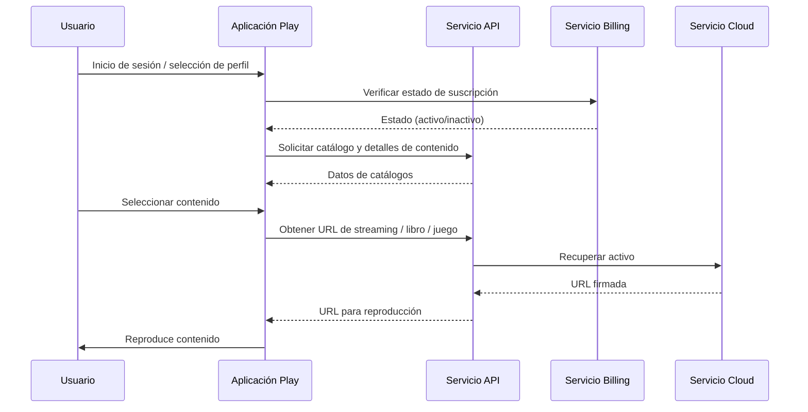

**Versión:** 1.0  
**Fecha:** 01/12/2025

---

# Servicio Play

## Introducción y propósito

El servicio Play es la puerta de entrada de los usuarios finales al catálogo audiovisual y de juegos de EDYE/HITN Digital. Incluye las aplicaciones web y móviles que permiten reproducir contenido en streaming, acceder a libros interactivos y juegos educativos, así como gestionar perfiles y preferencias. Este documento describe la infraestructura del servicio desde la perspectiva operativa y de seguridad.

## Descripción funcional

Entre las funciones clave del servicio se encuentran:

- **Reproducción de contenidos:** entrega vídeo en streaming, juegos y libros. Utiliza un reproductor de vídeo integrado y un motor de juegos ligero en el navegador o en la aplicación.
- **Interfaz de usuario:** la aplicación está desarrollada con Next JS (basado en React) para proporcionar una experiencia interactiva y responsiva. La plataforma combina páginas generadas en el servidor y componentes renderizados en el cliente.
- **Gestión de perfiles:** permite crear perfiles de niños con límites de edad y control parental. Los perfiles determinan qué categorías están disponibles y guardan el progreso de visualización.
- **Interacción con el API:** consume los endpoints del servicio API para obtener catálogos, detalles de programas y recomendaciones. También envía eventos de “seguir viendo” y favoritos para guardar el estado.
- **Soporte multi‑dispositivo:** diseñado para funcionar en navegadores modernos, aplicaciones móviles y televisores inteligentes, garantizando que el usuario pueda continuar la reproducción en distintos dispositivos. La infraestructura del API proporciona autenticación multi‑dispositivo.

## Arquitectura y componentes

| Componente                | Descripción                                                                                                                                                                                                                                                   |
| ------------------------- | ------------------------------------------------------------------------------------------------------------------------------------------------------------------------------------------------------------------------------------------------------------- |
| Frontend (Next JS)        | La aplicación de reproducción se desarrolla en Next JS, aprovechando su capacidad de renderizado híbrido y su integración con React. Next JS utiliza Node.js como entorno de ejecución del lado del servidor, beneficiándose del modelo de E/S no bloqueante. |
| Backend de servicio       | Una capa intermedia en Node.js se encarga de orquestar la comunicación con el servicio API, manejar sesiones y aplicar caché local.                                                                                                                           |
| Motor de reproducción     | Utiliza un reproductor de vídeo compatible con los requerimientos de seguridad y control parental. El reproductor recupera las URLs de streaming mediante el API y gestiona el DRM y subtítulos.                                                              |
| Gestor de juegos y libros | Carga juegos HTML5 y libros interactivos desde el servicio Cloud.                                                                                                                                                                                             |
| Base de datos local       | En dispositivos móviles se utiliza almacenamiento local (IndexedDB o SQLite) para cachear progresos y permitir la reproducción offline limitada.                                                                                                              |

### Diagrama de flujo

## Modelo de despliegue

El servicio Play se despliega como una combinación de aplicaciones web y móviles:

- **Web:** el código Next JS se compila y genera artefactos estáticos que se distribuyen en una red de entrega de contenidos (CDN). La capa de servidor (Next JS API Routes) se despliega en contenedores o funciones serverless.
- **Móvil:** la aplicación se empaqueta usando frameworks nativos o híbridos (p. ej., React Native). Se publica en tiendas de aplicaciones siguiendo ciclos de release coordinados.
- **Televisión/Consolas:** se desarrollan aplicaciones específicas utilizando SDKs de las plataformas de TV. Estas aplicaciones consumen los mismos endpoints del API.
- **CI/CD:** pipelines automatizados ejecutan pruebas de interfaz, linters y emulan dispositivos para validar la experiencia. Las variables de configuración (URLs de API, claves de reproductor, etc.) se gestionan mediante archivos de entorno y servicios de secretos.

## Monitoreo y observabilidad

Para controlar el rendimiento y la estabilidad de las aplicaciones se monitoriza:

- **Métricas de front‑end:** tiempos de carga de página, latencia de reproducción inicial, tasa de reproducción interrumpida y consumo de ancho de banda.
- **Métricas de back‑end:** tiempo de respuesta de los endpoints de la aplicación Play, utilización de cachés y tasas de error.
- **Telemetría de usuario:** eventos de uso (inicio de sesión, reproducción, pausas) se recogen de forma anonimizada para análisis. Esta telemetría ayuda a mejorar la experiencia pero se gestiona de acuerdo con las normativas de privacidad infantil.
- **Logs y trazas:** los logs de la aplicación se agregan y permiten detectar fallos de renderizado, excepciones y problemas de integración con el API.
- **Alertas:** se generan alertas por caídas de disponibilidad, altos tiempos de inicio de reproducción y errores en el flujo de suscripción.

## Seguridad y accesos

El servicio Play debe proteger la identidad de los menores y la integridad del contenido:

- **Autenticación:** utiliza tokens generados por el servicio API para validar sesiones. Los tokens tienen expiraciones cortas y se renuevan con mecanismos silenciosos.
- **Control parental:** se implementa un “parent gate” que exige un PIN u otro mecanismo de verificación para acceder a funciones administrativas o desbloquear contenido sensible.
- **Cifrado:** las conexiones se realizan mediante HTTPS/TLS. El reproductor de vídeo utiliza cifrado de extremo a extremo y DRM para evitar descargas no autorizadas.
- **Protección de datos:** se minimiza el almacenamiento local y se anonimiza la telemetría. Los datos de perfiles de niños no se comparten con terceros.

## Continuidad operativa

Para asegurar la disponibilidad de las aplicaciones:

- **CDN y escalado:** los artefactos estáticos se replican en una CDN global para reducir la latencia. El servicio de backend escala automáticamente según la demanda.
- **Modo offline:** en dispositivos móviles se permite descargar capítulos seleccionados. El progreso se sincroniza cuando vuelve la conexión.
- **Supervisión de tiendas:** se monitoriza el estado de las aplicaciones en las tiendas para detectar rápidamente fallos de distribución o de aprobación.
- **Plan de contingencia:** se establecen procedimientos para retirar versiones defectuosas, realizar rollbacks y comunicar a los usuarios actualizaciones críticas.

## Dependencias y comunicación

Las interacciones principales del servicio Play son:

- **Servicio API:** para obtener catálogos, metadatos, URL de reproducción y enviar eventos de estado.
- **Servicio Billing:** para verificar suscripciones antes de reproducir contenido premium. El flujo de pago se deriva al servicio Billing.
- **Servicio Cloud:** para descargar archivos de vídeo, audio, libros y juegos. La entrega se hace mediante URLs firmadas y temporales.
- **Servicio Satellite:** para sincronizar el estado de “seguir viendo” y favoritos cuando el usuario se mueve entre dispositivos.

## El diseño modular de estas comunicaciones facilita la actualización independiente de cada servicio sin afectar la experiencia de usuario.
