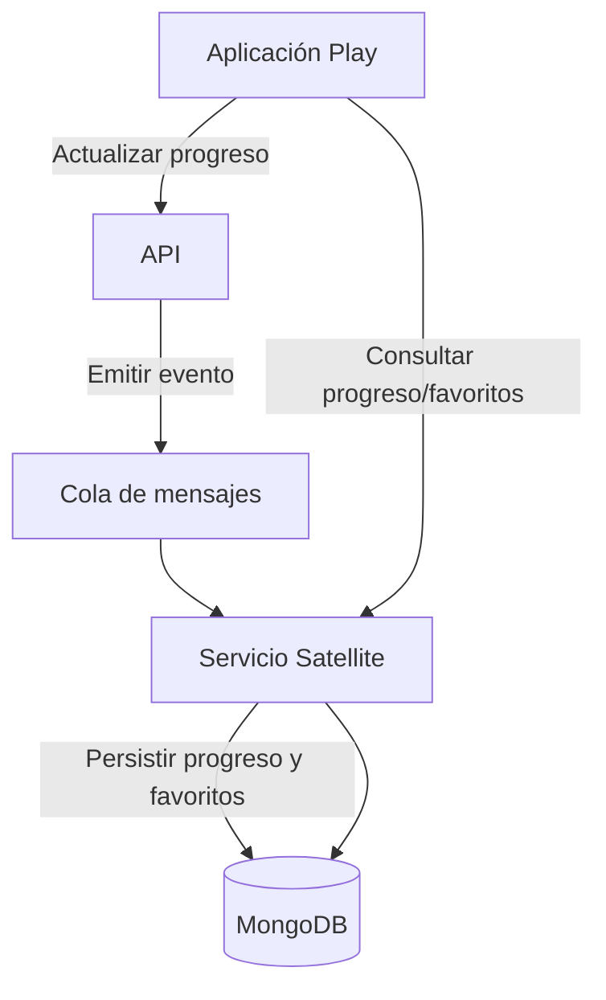

**Versión:** 1.0  
**Fecha:** 01/12/2025

---

## 1. Introducción y propósito

El servicio Satellite proporciona funcionalidades de persistencia y sincronización del estado de consumo de los usuarios en el ecosistema EDYE/HITN Digital. Está orientado a almacenar y compartir datos como la posición de reproducción (“seguir viendo”), listas de favoritos y preferencias personalizadas entre diferentes dispositivos. Este documento detalla su diseño técnico y su operación.

## 2. Descripción funcional

El servicio cumple las siguientes funciones:

- **Persistencia de progreso:** almacena la posición de reproducción de cada usuario en cada título, de manera que al cambiar de dispositivo pueda retomar el contenido donde lo dejó.
- **Gestión de favoritos y listas:** permite a los usuarios marcar programas, libros o juegos como favoritos y agruparlos en listas personalizadas. Esta información se sincroniza con el API principal.
- **Sincronización multi‑dispositivo:** centraliza la información para que la aplicación Play pueda recuperar el progreso y los favoritos independientemente de dónde se haya generado.
- **Interfaz de consulta:** expone endpoints para que los clientes consulten y actualicen su estado de consumo. Estos endpoints están protegidos mediante autenticación y autorizan únicamente al usuario propietario.

## 3. Arquitectura y componentes

| Componente                    | Descripción                                                                                                                                                                                                                                                                                                                                                       |
| ----------------------------- | ----------------------------------------------------------------------------------------------------------------------------------------------------------------------------------------------------------------------------------------------------------------------------------------------------------------------------------------------------------------- |
| Servidor Node.js/NextJS       | El núcleo del servicio está implementado con Node.js y NextJS, aprovechando su naturaleza asíncrona para gestionar numerosas peticiones de actualización de estado.                                                                                                                                                                                               |
| Base de datos NoSQL (MongoDB) | Se utiliza una base de datos orientada a documentos para almacenar estructuras flexibles de progreso y listas. MongoDB ofrece esquema dinámico y escalabilidad horizontal, lo que facilita el almacenamiento de datos semiestructurados como listas de reproducción y favoritos. Laravel y otros marcos soportan nativamente MongoDB mediante paquetes oficiales. |
| Servicio de sincronización    | Subsistema que escucha eventos del API y de la aplicación Play para actualizar los registros. Asegura consistencia eventual entre cachés locales y la base de datos central.                                                                                                                                                                                      |
| Cola de mensajes              | Gestiona eventos asincrónicos (p. ej., fin de reproducción, marcado de favorito) para desacoplar a la aplicación cliente del proceso de persistencia.                                                                                                                                                                                                             |

### 3.1. Diagrama de arquitectura

## 4. Modelo de despliegue

El servicio se construye y se distribuye mediante procesos de CI/CD:

- **Repositorio y gestión de dependencias:** el código fuente (Node.js/NextJS) se mantiene en un repositorio Git. Las dependencias se controlan mediante gestores (npm/yarn) y se actualizan con revisiones periódicas.
- **Pruebas:** se ejecutan pruebas unitarias y de integración que validan la correcta actualización y consulta de datos en MongoDB, así como la gestión de eventos.
- **Contenerización y despliegue:** se empaqueta la aplicación en contenedores. El despliegue se realiza en un clúster de microservicios con escalado horizontal automático. Las variables de configuración (URLs del API, conexión a MongoDB) se proporcionan a través de servicios de configuración.
- **Colas de eventos:** el servicio se suscribe a colas de mensajes configuradas en un sistema de mensajería (por ejemplo, RabbitMQ, Kafka) que se despliega como servicio compartido.

## 5. Monitoreo y observabilidad

El correcto funcionamiento de Satellite se supervisa mediante:

- **Métricas de sincronización:** número de eventos procesados por minuto, latencia de procesamiento de eventos y tasa de fallos en la actualización de MongoDB.
- **Uso de recursos:** monitoreo de CPU, memoria y conexiones abiertas a la base de datos. Se ajustan límites en el orquestador para evitar saturación.
- **Logs:** se registran acciones de actualización, conflictos y errores de deserialización. Estos logs se almacenan centralmente para auditoría y soporte.
- **Alertas:** se configuran umbrales para detectar colas de mensajes en crecimiento, errores de base de datos y tiempos de sincronización altos.

## 6. Seguridad y accesos

El servicio maneja datos de usuario relacionados con su consumo y preferencias. Se aplican las siguientes medidas:

- **Autenticación:** cada solicitud debe incluir un token válido emitido por el servicio API. Satellite verifica el token antes de procesar la actualización o consulta.
- **Autorización:** se garantiza que un usuario solo pueda acceder y modificar su propio progreso y listas. Los identificadores de usuario se extraen del token y se comprueban con los datos almacenados.
- **Encriptación:** las comunicaciones entre Satellite, el API y la base de datos viajan a través de conexiones cifradas. Los datos en la base de datos se cifran en reposo.
- **Política de retención:** los datos de progreso se conservan por un periodo definido y se purgan periódicamente para cumplir con normativas de protección de datos.

## 7. Continuidad operativa

Para garantizar una experiencia fluida en todas las plataformas:

- **Escalado horizontal:** se despliegan varias réplicas del servicio y la base de datos MongoDB se configura como un clúster con réplica para alta disponibilidad.
- **Persistencia de colas:** el sistema de mensajería conserva los eventos hasta que son procesados correctamente. Esto asegura que no se pierdan actualizaciones durante incidentes.
- **Backups:** se realizan copias de seguridad regulares de la base de datos. Se documentan procedimientos para restaurar datos de progreso en caso de pérdida.
- **Pruebas de resistencia:** se realizan pruebas de carga y de estrés para simular picos de eventos y validar que el servicio mantiene la latencia aceptable.

## 8. Dependencias y comunicación

El servicio Satellite se integra con:

- **Servicio API:** recibe eventos de actualización y envía solicitudes para validar la identidad del usuario. También expone endpoints a los que el API delega la recuperación de progreso y favoritos.
- **Servicio Play:** los clientes consumen directamente los endpoints de Satellite para recuperar su progreso. También envían eventos de actualización que se enrutan a través del API.
- **Servicio de colas:** se apoya en una cola de mensajería para desacoplar la generación de eventos de su procesamiento, permitiendo manejar gran volumen de actualizaciones.
- **Servicio Billing:** no interactúa directamente pero se apoya en la validación de suscripción del API para permitir el almacenamiento de progresos solo a usuarios con planes activos.

La comunicación entre servicios se diseña para ser idempotente y se asegura la consistencia eventual de los datos en todo el ecosistema.
