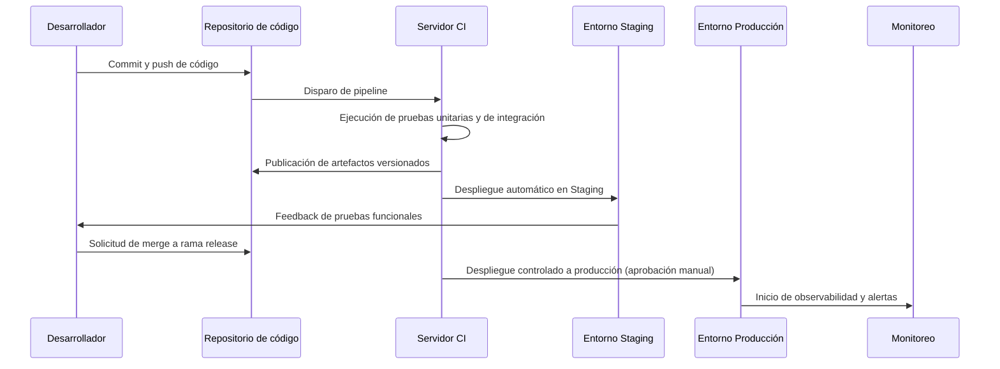
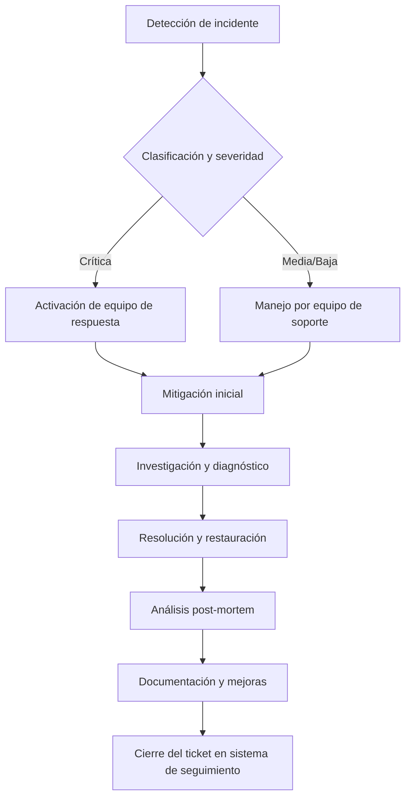

**Versión:** 1.0  
**Fecha:** 01/12/2025  

---

## 1. Introducción y propósito

El presente documento describe de manera estructurada y auditable la infraestructura tecnológica que soporta la plataforma **EDYE**, de **HITN Digital**. Su finalidad es proporcionar a los equipos de **DevOps**, **Operaciones**, **SRE** (Site Reliability Engineering) y **Seguridad** una referencia corporativa unificada sobre la arquitectura de los entornos, los componentes de infraestructura, los modelos de despliegue, los mecanismos de monitoreo y observabilidad, así como las prácticas de seguridad y continuidad operativa.

## 2. Alcance de la infraestructura

La documentación abarca el ecosistema EDYE en su conjunto y, por lo tanto, contempla los siguientes elementos principales:

- **Infraestructura de hosting y red:** proveedores cloud, regiones y centros de datos principales y secundarios.
- **Entornos segregados:** entornos locales, staging y producción con sus respectivos componentes y flujos de despliegue.
- **Servicios principales:** módulos de la aplicación (Admin, API, Billing, Play, Cloud, Connect/Conecta, Satellite) y elementos de soporte (caché, bases de datos, servidores web).
- **Tecnologías base:** marcos de trabajo y lenguajes utilizados (Node.js y sus procesos gestionados por un motor V8, framework Laravel basado en el patrón MVC, gestores de bases de datos MySQL y MongoDB, servidores web Nginx para equilibrio de carga y caché y gestores de procesos como PM2). Se incluyen únicamente componentes que forman parte real del ecosistema EDYE.
- **CI/CD y despliegues automatizados:** herramientas y procesos de integración y despliegue continuo que permiten una entrega ágil y controlada.
- **Monitoreo y observabilidad:** métricas, registros y trazas que permiten evaluar la salud del sistema, alertas y paneles de visualización.
- **Seguridad y accesos:** control de accesos, gestión de credenciales y cumplimiento de buenas prácticas.
- **Continuidad operativa y backups:** estrategias de copia de seguridad, alta disponibilidad y procedimientos de recuperación.

## 3. Arquitectura general del ecosistema

El ecosistema EDYE está organizado en una arquitectura modular compuesta por servicios de back‑end y front‑end que se comunican a través de APIs y colas de mensajes. Los servicios se despliegan en instancias virtuales o contenedores dentro de centros de datos en Estados Unidos (principal) y un centro secundario para contingencias. La capa de entrega de contenido se apoya en un proveedor de CDN de ámbito global para optimizar la distribución de contenidos a los usuarios finales.

> **Figura 1.** Arquitectura general del ecosistema Production

> **Figura 2.** Arquitectura general del ecosistema Staging

### 3.1. Descripción de la arquitectura:

- **Capa de entrega:** un CDN global se encarga de la distribución de contenidos de vídeo y estáticos, minimizando la latencia hacia los usuarios. La capa de caché (basada en servicios de almacenamiento en memoria) almacena respuestas frecuentes para reducir la carga sobre los servicios backend.

- **Servicios de negocio:** los módulos **API**, **Admin**, **Billing**, **Play**, **Cloud** y **Conecta** representan servicios independientes que encapsulan funcionalidades específicas. Los servicios escritos en **Node.js** utilizan el motor **V8** para ejecutar JavaScript del lado del servidor y emplean **PM2** como gestor de procesos para asegurar su disponibilidad continua. El servicio **Admin** se implementa con **Laravel**, un framework **PHP** que sigue el patrón modelo–vista–controlador .

- **Capas de datos:** se utilizan bases de datos relacionales **MySQL**, componente habitual del stack **LAMP**, para almacenar transacciones y datos estructurados. Para almacenar información no estructurada o semiestructurada se emplea **MongoDB**, un programa de base de datos orientado a documentos clasificado como **NoSQL** y que utiliza documentos JSON‑like con esquemas opcionales.

- **Entornos replicados:** los servicios principales se replican en entornos separados (Staging y Local) para pruebas y validación antes de promover cambios a producción. Estos entornos son aislados y no comparten datos sensibles con producción.

## 4. Entornos y segregación (Local / Staging / Producción)

La plataforma EDYE opera bajo un modelo de segregación de entornos para asegurar que el ciclo de vida del software se desarrolle de manera controlada y que los cambios sean probados adecuadamente antes de afectar a los usuarios finales.

### 4.3. Entorno local

El entorno local corresponde a las estaciones de desarrollo utilizadas por los ingenieros. Cada desarrollador dispone de una réplica ligera de los servicios necesarios para programar y validar el código. En este entorno se emplean contenedores o máquinas virtuales que simulan la base de datos, la caché y los servicios internos. El código fuente se gestiona a través de un sistema de control de versiones (p. ej. Git) y se integra con la plataforma de CI para la ejecución de pruebas automáticas.

### 4.4. Entorno staging

El entorno staging replica la arquitectura de producción a menor escala. Aquí se despliegan todas las ramas release que han superado la validación de la integración continua. Las bases de datos se inicializan con datos anonimizados o sintéticos para permitir pruebas funcionales y de rendimiento sin comprometer la información de usuarios. Este entorno sirve para pruebas de aceptación y para validar integraciones con servicios externos antes de promover los cambios.

### 4.5. Entorno de producción

El entorno de producción aloja la instancia activa de EDYE accesible por los usuarios. Está distribuido en al menos dos centros de datos geográficamente separados para proporcionar alta disponibilidad y tolerancia a fallos. El tráfico de los usuarios es distribuido a través de balanceadores y la capa CDN, que enrutan las peticiones al centro activo más cercano. La base de datos y los servicios críticos implementan réplicas síncronas o asíncronas entre regiones, de modo que un fallo en un centro de datos pueda resolverse con un failover controlado. Las políticas de configuración y despliegue se aplican de manera estricta para garantizar la estabilidad.

## 5. Infraestructura de servidores y hosting

EDYE se ejecuta sobre una plataforma de cloud computing con centros de datos en EE. UU. que actúan como primario y secundario. Cada centro de datos alberga grupos de instancias que ejecutan los servicios descritos anteriormente. La infraestructura se soporta sobre tecnologías de contenedorización o máquinas virtuales que permiten la escalabilidad horizontal.

Centros de datos: se utilizan al menos dos ubicaciones geográficas: un centro principal (por ejemplo en la región central de EE. UU.) y un centro secundario (en la costa este u otra región). Esto permite balancear la carga y garantizar continuidad operativa en caso de desastre.

Servidores de aplicación: las instancias de Node.js y Laravel se despliegan en grupos de servidores gestionados por balanceadores HTTP (Nginx) que distribuyen las peticiones y aplican políticas de caché. Nginx actúa además como proxy inverso y servidor de contenidos de alto rendimiento
nginx.org
.

Capa de caché: se emplean soluciones en memoria (Redis o Memcached) para almacenar datos temporales y mejorar los tiempos de respuesta de los servicios. La capa de caché se replica para evitar puntos únicos de fallo y se monitoriza su uso de memoria.

Almacenamiento de objetos: el servicio Cloud integra almacenamiento de objetos (compatible con S3) para albergar archivos multimedia, imágenes y documentos. Este almacenamiento se replica en varias regiones y está integrado con la CDN para distribución.

Bases de datos: las bases de datos MySQL se despliegan en clústeres maestro‑replica con replicación síncrona para garantizar la consistencia. MongoDB se configura en replica sets para proporcionar alta disponibilidad y permite funciones de sharding cuando se necesitan escalas horizontales
en.wikipedia.org
.

## 6. Arquitectura de despliegue (CI/CD)

La plataforma utiliza un flujo de integración continua y despliegue continuo (CI/CD) que automatiza la compilación, pruebas y puesta en producción del software. El flujo general es el siguiente:

Commit y control de versiones: Los desarrolladores actualizan el código en el repositorio. Se utilizan ramas feature y merge requests para revisión de pares.

Pipeline de CI: Un servidor de CI ejecuta pruebas automáticas (unitarias, de integración y estáticas) en cada commit. Si las pruebas fallan, el pipeline se marca como fallido.

Construcción y versionado: Tras superar las pruebas, el pipeline empaqueta los artefactos (por ejemplo contenedores) y los publica en un registro privado con etiquetado semántico.

Despliegue en staging: Los artefactos se despliegan automáticamente en el entorno staging para validación funcional y de rendimiento. Se automatizan migraciones de base de datos y se monitoriza la salud de los servicios.

Aprobación y despliegue a producción: Un paso manual (gated) permite que un responsable de operaciones apruebe el despliegue a producción. El despliegue se realiza de manera gradual utilizando estrategias como blue/green o canary para minimizar riesgos.

Observabilidad post‑despliegue: Tras el despliegue se supervisan métricas clave y se habilitan alertas para detectar cualquier regresión.

## 7. Gestión de procesos y servicios

La plataforma EDYE se compone de servicios que corren como procesos independientes, orquestados y monitorizados para asegurar disponibilidad y rendimiento.

Gestión de procesos para Node.js: Se utiliza PM2, un gestor de procesos de producción que mantiene las aplicaciones Node.js en línea 24/7
pm2.keymetrics.io
. PM2 ofrece clustering, recarga sin interrupción y supervisión integrada.

Gestión de servicios PHP/Laravel: Los servicios basados en Laravel se despliegan mediante PHP‑FPM detrás de Nginx o Apache. Se realizan configuraciones de pools de procesos y se ajustan parámetros de rendimiento y seguridad.

Balanceo y proxy inverso: Nginx actúa como reverse proxy, balanceador de carga y servidor de contenidos, reconocido por su alto rendimiento y bajo consumo de recursos
nginx.org
. Se configuran grupos upstream con chequeos de salud y se implementan reglas de caché en la capa de proxy.

Servicios auxiliares: La infraestructura incluye servicios adicionales como colas de mensajes (por ejemplo RabbitMQ o SQS) para desacoplar procesos, y un sistema de envío de correos para notificaciones. Los detalles precisos se corresponden con la implementación real vigente.

## 8. Monitoreo y observabilidad

La observabilidad es clave para garantizar la fiabilidad del ecosistema EDYE. La plataforma implementa un conjunto de herramientas y prácticas para recolectar métricas, logs y trazas distribuidas.

Métricas de infraestructura: Se recogen métricas de utilización de CPU, memoria, disco y red de cada instancia. Se emplean agentes que exportan dichas métricas a un sistema centralizado donde se pueden visualizar en paneles y generar alertas.

Monitoreo de servicios: Los servicios exponen endpoints de salud y métricas (por ejemplo con Prometheus metrics o herramientas equivalentes). Se monitoriza la latencia, el throughput y el porcentaje de errores.

Logs centralizados: Todos los servicios envían sus registros a un sistema de logging centralizado (ELK/Graylog u otra solución) donde se indexan y se pueden consultar mediante búsquedas. Se define un formato común de logs para facilitar el análisis.

Alertas y notificaciones: Se configuran alertas basadas en umbrales y en anomalías; las notificaciones se envían a canales de mensajería corporativa o a sistemas de ticketing.

Trazas distribuidas: Los servicios que utilizan microservicios adoptan soluciones de trazabilidad (por ejemplo OpenTelemetry) para correlacionar peticiones a través de servicios y detectar cuellos de botella.

## 9. Seguridad y control de accesos

La seguridad se aborda de forma transversal en toda la arquitectura. Las principales medidas implementadas son:

Segregación de entornos: Los entornos de desarrollo, staging y producción se mantienen completamente aislados, evitando accesos directos entre ellos. Las bases de datos de staging contienen datos anonimizados.

Gestión de identidades y accesos (IAM): Se aplica el principio de privilegios mínimos. Las cuentas de usuario y de servicio se administran con un directorio central y autenticación multifactor. Se revisan periódicamente las políticas de acceso.

Cifrado: Los canales de comunicación utilizan TLS/HTTPS. Las bases de datos cifran datos sensibles en reposo y se emplean gestores de secretos para almacenar credenciales y claves.

Hardening de servidores: Se siguen prácticas de bastionado (limitación de puertos, actualización de paquetes, desactivación de servicios innecesarios). Nginx/Apache se configuran con encabezados de seguridad y se implementan listas de control de acceso IP.

Auditoría y cumplimiento: Se activan registros de auditoría para accesos administrativos y cambios de configuración. Periódicamente se realizan pruebas de penetración y análisis de vulnerabilidades. La infraestructura cumple con normativas de protección de datos aplicables.

## 10. Continuidad operativa y backups

La continuidad de negocio se garantiza mediante diseños de alta disponibilidad y políticas de respaldo consistentes.

Alta disponibilidad y replicación: Los servicios críticos se despliegan en clústeres redundantes distribuidos entre centros de datos. Las bases de datos MySQL utilizan replicación maestro‑esclavo o multi‑maestro; MongoDB emplea replica sets para tolerancia a fallos
en.wikipedia.org
.

Copias de seguridad: Se realizan backups periódicos de bases de datos y de objetos almacenados. Los backups se cifran y se guardan en ubicaciones separadas. Se mantienen políticas de retención que permiten restaurar a puntos en el tiempo (PITR) y se prueban regularmente mediante simulacros de restauración.

Plan de contingencia: Existen runbooks para conmutación manual o automática a un centro secundario en caso de desastre. Se definen objetivos de tiempo de recuperación (RTO) y objetivo de punto de recuperación (RPO) aceptables.

Pruebas de recuperación: De forma periódica se ejecutan ejercicios de failover para validar que los procedimientos se ejecutan correctamente y que el personal está preparado para incidentes reales.

## 11. Gestión de incidencias y soporte

La organización dispone de un proceso formal para la gestión de incidencias que abarca detección, clasificación, respuesta, comunicación y cierre con aprendizaje. El flujo general es el siguiente:

Detección: Las alertas de monitoreo o los reportes de usuarios inician el proceso de incidente.

Clasificación: Se determina el nivel de severidad y se asignan recursos apropiados. Los incidentes críticos activan un equipo de respuesta especializado.

Mitigación y diagnóstico: Se trabaja para restablecer el servicio lo antes posible, analizando causas raíz y aplicando soluciones temporales cuando sea necesario.

Resolución: Se implementan correcciones definitivas y se valida la estabilidad del sistema.

Post‑mortem: Se realiza un análisis detallado documentando la causa raíz, el tiempo de resolución y las acciones preventivas. Se actualizan los runbooks y se comunican las lecciones aprendidas a los equipos.

Gestión de tickets: Todos los pasos se registran en la herramienta corporativa de seguimiento de incidencias (por ejemplo Jira), permitiendo auditoría y trazabilidad.

## 12. Buenas prácticas operativas

Para asegurar la calidad y estabilidad de la infraestructura EDYE, se adoptan las siguientes buenas prácticas:

Control de versiones y revisión de código: Todo el código pasa por revisiones de pares y pipelines automáticos antes de ser integrado en ramas principales.

Automatización: Los procesos repetitivos se automatizan mediante scripts y herramientas de orquestación, reduciendo errores manuales.

Gestión de configuraciones: Se utiliza infraestructura como código (IaC) para definir entornos de manera declarativa. Esto facilita la replicación y reduce la deriva de configuración.

Actualizaciones y parches: Se establecen ventanas de mantenimiento para aplicar parches de seguridad y actualizaciones de software. Se prueban primero en staging antes de aplicar a producción.

Observabilidad proactiva: Se analizan tendencias de métricas para anticiparse a problemas de capacidad. Se definen SLO/SLI y se revisan periódicamente.

Seguridad por diseño: La seguridad se considera desde el diseño, implementando controles de acceso adecuados, cifrado y prácticas de desarrollo seguro.

## 13. Consideraciones finales

Este documento sintetiza la infraestructura actual de EDYE y sirve como punto de partida para futuras auditorías y mejoras. Dado que la tecnología y las necesidades del negocio evolucionan, la documentación deberá revisarse y actualizarse periódicamente para mantenerse alineada con la realidad operativa. Se recomienda que cualquier cambio sustancial en la arquitectura, herramientas o procesos se refleje en la documentación y se comunique a todos los equipos impactados.
