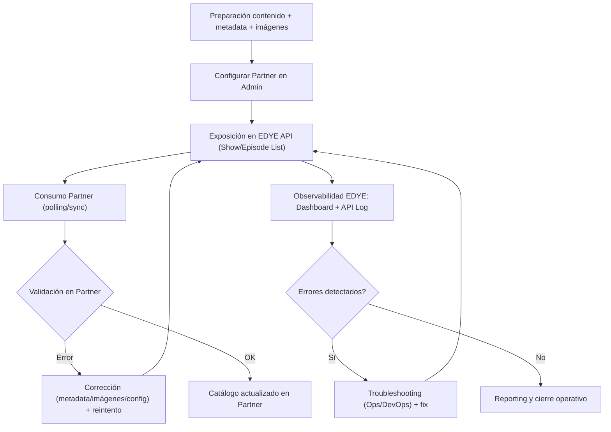

# Flujo Genérico de Delivery vía API

Este documento define el flujo estándar de entrega (delivery) vía API dentro del ecosistema EDYE, aplicable a todos los partners que consumen contenidos mediante endpoints (no por transferencia de paquetes).

El objetivo es estandarizar el proceso, manteniendo un único flujo operativo y delegando las particularidades (endpoints específicos, filtros, campos extra, autenticación y SLA) a anexos por partner.

---

## 1. Alcance

El flujo de delivery vía API cubre:

- Publicación de contenido (videos) y catálogos (shows/episodios) desde la fuente de verdad (JW Player)
- Configuración de partner (permisos, filtros, tipo de delivery)
- Exposición de endpoints EDYE (listados de shows/episodios + assets asociados)
- Consumo del partner (polling o sincronización) y control de errores
- Observabilidad (logs de API, métricas y errores)

No cubre:
- Transferencia de paquetes (SFTP/Aspera/S3)
- Autenticación de usuarios finales (SSO/OpenID)
- Facturación, revenue share o pagos

---

## 2. Sistemas involucrados

- Content Operations / Programación (curación, carga y QA editorial)
- JW Player (fuente de verdad de videos y estructura show/episodio)
- EDYE Admin (configuración de partners, permisos, thumbnails/metadata)
- EDYE API / Backend (endpoints de delivery para shows/episodios)
- Partner Platform (sistema que consume la API y publica/ingesta en su lado)
- DevOps / Operaciones (monitoreo, troubleshooting y soporte)

---

## 3. Fases del flujo

### Fase A — Preparación (Pre-delivery)

- Carga y organización del contenido
	- Videos master en JW Player
	- Estructura: show → temporada → episodio
	- Idiomas / variantes (si aplica)
- Metadata mínima y consistencia
	- Campos obligatorios (por estándar EDYE + anexo partner)
	- IDs externos (TMS/Gracenote u otros, si aplica)
	- Revisión de consistencia editorial
- Imágenes y thumbnails
	- Posters / stills / logos (según caso)
	- Generación/validación de thumbnails según formatos por partner (si aplica)
- Configuración del partner en EDYE Admin
	- Alta/edición del partner
	- Definición de permisos de API (endpoints habilitados)
	- Filtros por tags/geo (si aplica)
	- Configuración de thumbnails y/o watermark (si aplica)
	- Selección de “Delivery Type” cuando corresponda (ej. API Delivery)

> Nota: En “API Delivery”, EDYE puede agregar al JSON un campo adicional con los thumbnails configurados (p. ej. custom_thumbnails) cuando aplique.

### Fase B — Publicación y Exposición vía API

- Sincronización / actualización de datos
	- Sincronización de shows/episodios (si aplica por operación)
	- Verificación de que el contenido esté “visible” y en tags correctos
- Exposición en endpoints de EDYE
	- Endpoints típicos (según permisos):
		- Show List
		- Episode List
	- La respuesta incluye metadata + referencias a assets (imágenes/thumbnails) según configuración
- Consumo por el partner
	- El partner ejecuta polling (job programado) o sincronización bajo demanda
	- El partner:
		- Detecta nuevos shows/episodios o cambios
		- Descarga/consume assets referenciados (imágenes/thumbnails)
		- Actualiza su catálogo interno

### Fase C — Control, errores y cierre operativo

- Validación y control de errores
	- En EDYE:
		- Seguimiento de tráfico por endpoint/partner
		- Revisión de errores recientes (Latest Errors)
		- Revisión de API Log (por rango de fecha, endpoint, usuario, status)
	- En partner:
		- Manejo de reintentos y backoff
		- Reporte de inconsistencias (si un asset no existe o falta metadata)
- Corrección y reintentos
	- Si el error es editorial (metadata/imagenes): corrige Content Ops / Diseño y se reexpone por API
	- Si el error es técnico (auth, endpoint, performance): DevOps investiga logs y aplica corrección
- Reporting
	- Estado del consumo (éxitos/errores por ventana)
	- Evidencia en logs (API Log) y métricas del dashboard técnico

---

## 4. Diagrama del flujo

---

## 5. Estados de procesamiento (referenciales)

- Success / 200 OK (consumo correcto)
- Client Error / 4xx (auth, parámetros, permisos)
- Server Error / 5xx (fallas de API/infra)
- Degradación (latencia alta / timeouts) → requiere revisión operativa

---

## 6. Consideraciones generales

El control de acceso a endpoints se gestiona por usuario/partner y define qué puede consumir cada integración.

La observabilidad operativa se apoya en:

- Dashboard técnico (tráfico por endpoint, por partner, errores recientes)
- Tools → API Log para auditoría y troubleshooting.

Las particularidades (auth, endpoints adicionales, paginación, rate limits, campos obligatorios, thumbnails/watermark) deben ir en Anexo por partner.
