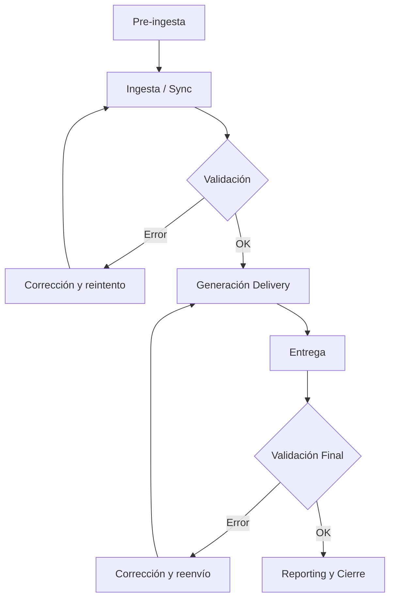

# Flujo Genérico de Ingesta de Contenidos

Este documento define el **flujo estándar de ingesta de contenidos audiovisuales**
dentro del ecosistema **EDYE**, aplicable a **todos los partners** que operan bajo
un modelo de integración por ingesta.

El objetivo es **estandarizar el proceso**, manteniendo un único flujo operativo
y delegando las particularidades a **anexos por partner**.

---

## 1. Alcance

El flujo de ingesta cubre:

- Preparación de contenido, metadata e imágenes
- Ejecución de la ingesta vía API / transferencia
- Validaciones automáticas y operativas
- Generación y entrega del delivery
- Reporting y trazabilidad post-ingesta

No cubre:

- Autenticación de usuarios finales
- Consumo del contenido por el partner
- Facturación o revenue share

---

## 2. Sistemas involucrados

- **Fuente de contenido** (Content Ops / Programación)
- **JW Player** (fuente de verdad para video)
- **EDYE API / Backend**
- **Infraestructura de Delivery** (SFTP, Aspera, S3, API)
- **Partner Platform**
- **Equipo de Operaciones**

---

## 3. Fases del flujo

### Fase A — Pre-ingesta (Preparación)

1. **Carga de contenido**

   - Videos master
   - Organización por series, temporadas y episodios
   - Idiomas y variantes

2. **Preparación de metadata**

   - Campos obligatorios
   - IDs externos (ej. TMS / Gracenote)
   - Metadata editorial y operativa

3. **Preparación de imágenes**

   - Posters
   - Episodic stills
   - Logos (si aplica)
   - Thumbnails (si aplica)

4. **Configuración de reglas por partner**
   - Tipo de metadata
   - Reglas de validación
   - Reglas de naming y estructura
   - Formato de imágenes y watermark

---

### Fase B — Ingesta (Ejecución)

5. **Disparo de ingesta**

   - Sincronización vía API
   - O ingesta vía FTP / polling (si aplica)

6. **Validación automática**

   - Video: codec, resolución, duración
   - Metadata: completitud y consistencia
   - Imágenes: existencia y formato

   **Resultado posible:**

   - Failed → requiere corrección
   - Completed with warnings
   - Validated OK

7. **Generación de Delivery**

   - Packaging según especificación del partner
   - Aplicación de naming y estructura
   - Inclusión de thumbnails / watermark (si aplica)

8. **Entrega**
   - Canal definido por partner:
     - SFTP
     - Aspera
     - S3
     - API

---

### Fase C — Post-ingesta (Control y cierre)

9. **Validación final (Operaciones)**

   - Integridad del delivery
   - Confirmación de recepción por el partner

10. **Reporting**
    - Estado del procesamiento
    - Errores y reprocesos
    - Logs y métricas de ejecución

---

## 4. Diagrama del flujo

---

## 5. Estados de procesamiento

- Received
- Processing
- Failed
- Completed with warnings
- Completed

---

## 6. Consideraciones generales

- La ingesta es totalmente automatizada
- El cumplimiento de naming y estructura es obligatorio
- Cualquier incumplimiento genera rechazo del asset
- Los reenvíos requieren regeneración del delivery
