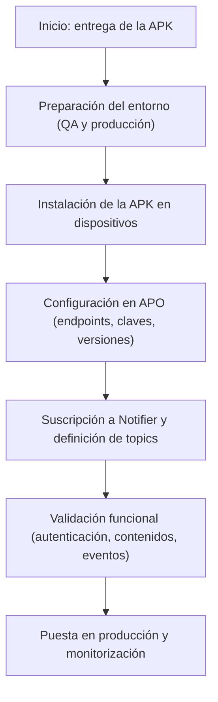

**Versión:** 1.0  
**Fecha:** 01/12/2025  

---

# Integración EDYE – Modelo APP/APO/Notifier

## 1. Introducción

Este documento describe las directrices para integrar la aplicación de EDYE en el ecosistema de un socio mediante el modelo APP INTEGRATION – APO + Notifier + APK. Está dirigido a equipos técnicos y de operaciones DevOps. Su propósito es servir como referencia genérica para cualquier partner que integre la APK oficial de EDYE, sin mencionar particularidades específicas de un operador concreto.

## 2. Objetivo y alcance

**Objetivo:** proporcionar una guía detallada para integrar la aplicación EDYE en plataformas de socios usando APO (Application Provider Operator) y Notifier.

**Alcance:** incluye la entrega de la APK oficial, la configuración de APO, la suscripción a eventos a través de Notifier y la conexión con el backend de EDYE. Se excluyen procesos de facturación o ingesta de usuarios de terceros.

## 3. Modelo de integración APO + Notifier + APK (visión general)

El modelo de integración se basa en tres elementos proporcionados por EDYE:

- **APK oficial:** aplicación empaquetada para dispositivos Android (incluyendo Android TV u OTT), suministrada firmada y sin modificaciones.
- **APO (Application Provider Operator):** consola de configuración que gestiona parámetros como entornos (QA y producción), claves API, canales de contenido y versiones.
- **Notifier:** servicio de mensajería basado en eventos que informa de acciones ocurridas en la plataforma. Según las guías de mensajería asíncrona, los eventos no requieren una acción del consumidor y no esperan una respuesta específica; el productor y el consumidor están desacoplados.

El socio integrador debe:

- Recibir e integrar la APK en su tienda o canal de distribución.
- Configurar APO con sus parámetros propios (endpoints, tokens, canales).
- Consumir los eventos emitidos por Notifier y confirmar su recepción mediante un acknowledgement para garantizar la entrega.

## 4. Arquitectura general de la integración

La arquitectura se compone de:

- **Ecosistema del Partner:** entorno donde se distribuye la APK y se opera la integración.
- **EDYE APK:** aplicación oficial que se ejecuta en los dispositivos de los usuarios.
- **APO:** plataforma de configuración centralizada.
- **Notifier:** servicio de mensajería que publica eventos operativos y de negocio.
- **Backend de EDYE:** servicios de autenticación, catálogo y streaming.

Un diagrama general podría mostrar estos componentes conectados: la APK se comunica con el backend para autenticación y contenidos, se gestiona mediante APO y publica eventos a Notifier; el partner consume dichos eventos y actualiza sus sistemas conforme a la información recibida.

## 5. Flujo general de la integración (descripción textual end‑to‑end)

1. **Entrega de la APK:** EDYE entrega la APK firmada al partner junto con metadatos de versión.
2. **Preparación del entorno:** el partner habilita un entorno de QA y recibe credenciales iniciales.
3. **Instalación de la APK:** el partner distribuye la aplicación a los dispositivos.
4. **Configuración de APO:** se definen entornos, claves, endpoints y canales de contenido en la consola APO.
5. **Suscripción a Notifier:** el partner se suscribe a los temas (topics) de eventos relevantes.
6. **Integración con el backend:** la APK invoca servicios de EDYE mediante HTTPS y tokens.
7. **Monitoreo y soporte:** el partner supervisa el funcionamiento y coordina con EDYE ante incidencias.

> **Figura 1.** Diagrama del flujo **

## 6. Componentes involucrados

### Partner (Socio Integrador)
- Integra la APK en su catálogo de aplicaciones y configura APO con sus parámetros.
- Consume eventos de Notifier y confirma su recepción.
- Gestiona el soporte de primer nivel para sus usuarios.

### EDYE APO
- Plataforma de configuración de la APK. Permite definir entornos, endpoints, canales de contenido, claves y versionado.
- Registra cambios y proporciona registros de auditoría.

### EDYE Notifier
- Servicio basado en el patrón publicador–suscriptor. Publica eventos cuando ocurren hechos relevantes.
- Implementa un sistema de confirmaciones y reintentos para asegurar la entrega de mensajes.

### EDYE APK
- Aplicación oficial que gestiona la experiencia del usuario en dispositivos Android.
- Se configura dinámicamente mediante APO.
- Reporta eventos a Notifier y consume contenidos desde el backend.

### EDYE Backend (API / Connect / Play)
- Servicios de autenticación, catálogo y streaming.
- Opera bajo HTTPS y requiere tokens de acceso. Las mejores prácticas de autenticación exigen mantener las claves secretas, incluir sólo la información necesaria en los tokens y definir expiración.

## 7. Flujo detallado por fases

### 7.1 Preparación del entorno
- EDYE entrega credenciales iniciales para QA y producción.
- El partner configura la red para permitir tráfico HTTPS hacia los dominios de EDYE.
- Se crea una cuenta en APO con permisos adecuados.

### 7.2 Entrega e instalación de la APK
- Recepción y verificación de la APK firmada.
- Distribución a través de los canales internos del partner.
- Pruebas de instalación en dispositivos compatibles.

### 7.3 Configuración de APO
- Definición de entornos, endpoints y claves.
- Configuración de canales de contenido y versiones.
- Registro de cambios y auditoría.

### 7.4 Integración de Notifier
- Suscripción a topics de eventos (por ejemplo: altas, bajas, errores).
- Implementación de un cliente que consume eventos y envía acks.
- Manejo de reintentos con back‑off e idempotencia.

### 7.5 Validación funcional
- Verificar autenticación y acceso a contenidos.
- Reproducir títulos y validar DRM.
- Probar eventos de Notifier y confirmaciones.
- Validar que la configuración de APO se aplica correctamente.

### 7.6 Puesta en producción
- Actualizar parámetros de producción en APO.
- Desplegar la APK a los usuarios finales.
- Monitorizar el servicio durante la transición y registrar las versiones y fechas.

## 8. Modelo de eventos Notifier

### 8.1 Tipos de eventos
- Alta de usuario, baja de usuario, errores, estado del servicio, interacciones de reproducción.
- Los eventos se envían en formato JSON con identificador, timestamp, tipo y datos relevantes.

### 8.2 Confirmaciones y reintentos
- Aunque los eventos no requieren acción del consumidor, se envía un ack para confirmar la recepción.
- Notifier almacenará el evento y realizará reintentos hasta que se reciba el ack.
- El consumidor debe ser idempotente para manejar duplicados.

## 9. Configuración del APO

- **Parámetros:** entornos (QA/producción), claves, endpoints, canales, versión mínima/máxima de APK.
- **Ambientes:** cada entorno tiene sus propios tokens y configuraciones.
- **Gestión de versiones:** se controla el acceso a versiones de la APK y se puede forzar actualización.
- **Controles operativos:** logs de auditoría, alertas y gestión de usuarios.

## 10. Seguridad y control de accesos

- **Autenticación:** mediante tokens que deben mantenerse secretos y tener expiración.
- **Autorización:** validación de permisos en el backend y en APO.
- **Protección de endpoints:** uso de HTTPS, rate limiting, validación de inputs.
- **Gestión de credenciales:** rotación periódica, almacenamiento seguro y control de acceso mínimo.

## 11. Manejo de errores, monitoreo y reintentos

- Manejar excepciones en la APK con reintentos y mensajes claros.
- Utilizar logs y métricas para detectar fallos.
- Idempotencia y reintentos en Notifier para asegurar entrega.
- Integración con herramientas de observabilidad del partner.

## 12. Criterios de aceptación de la integración

- Instalación y funcionamiento correcto de la APK.
- Configuración validada en APO.
- Recepción y confirmación de eventos Notifier.
- Acceso seguro a contenidos.
- Monitoreo y documentación completados.

## 13. Operación, monitoreo y soporte

- Supervisar diariamente métricas de uso y eventos.
- Actualizar configuraciones en APO según sea necesario.
- Coordinar actualizaciones de la APK con EDYE.
- Utilizar canales de soporte establecidos para resolver incidencias.
---

