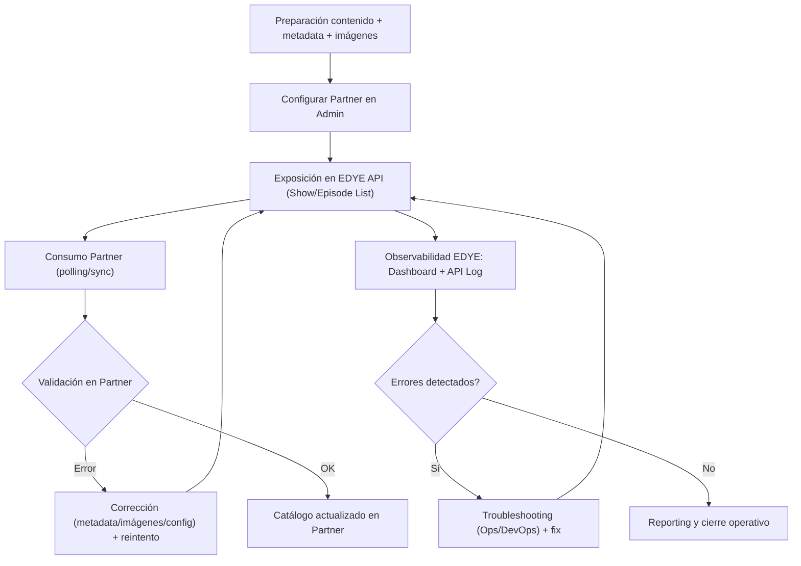

**Versión:** 1.0  
**Fecha:** 01/12/2025  

---

# Modelo de Integración: Delivery de Contenidos vía API

Este documento describe el modelo estándar de delivery vía API dentro del ecosistema EDYE, utilizado por partners para consumir catálogo, metadata e imágenes directamente desde endpoints (sin transferencia file-based como SFTP/Aspera).

Este modelo aplica, entre otros, a partners que integran catálogo mediante API (por ejemplo, aplicaciones OTT, operadores o agregadores que consumen JSON). La estructura y estilo de este documento siguen el mismo patrón del ejemplo adjunto.

---

## 1. Alcance

El modelo de delivery vía API cubre:

- Publicación y exposición de catálogo (series, películas, episodios)
- Entrega de metadata estructurada (JSON) para consumo programático
- Entrega de referencias/URLs de imágenes y thumbnails (cuando aplique)
- Versionado, paginación y sincronización incremental (checkpoint/cursor)
- Validación funcional del consumo (contrato, campos obligatorios, consistencia)
- Monitoreo, control de acceso, rate limits y troubleshooting
- Reporting y auditoría de consumo (cuando aplique)

No cubre:

- Ingesta/carga de contenido en JW Player (eso pertenece al modelo de ingesta)
- Transferencia de paquetes de assets por SFTP/Aspera/S3 (modelo file-based)
- Reproducción DRM, playback, player SDK o analítica del partner (salvo acuerdos específicos)

---

## 2. Sistemas involucrados

Los siguientes sistemas participan en el delivery vía API:

- **EDYE API**  
  Fuente central para exposición de catálogo, metadata y assets por endpoints.
- **Admin Panel (EDYE)**  
  Interfaz operativa para configuración por partner (acceso, parámetros, thumbnails, etc.) y verificación/monitoreo.
- **JW Player (JWP) (origen upstream, indirecto)**  
  Origen de videos, playlists y still images. La ingesta mantiene a EDYE actualizado, y luego el partner consume desde EDYE API.
- **Fuentes de metadata externas (cuando aplique)** - Gracenote / TMS (IDs, correlación, enriquecimiento) - Regla: Los identificadores Gracenote / TMS se requieren solo para partners que tengan correlación de catálogo vía Gracenote/TMS (definido por contrato). Para los demás partners, estos IDs no son obligatorios (opcionales / N/A).
- **Partner**  
  Cliente API (backend o app) que consume los endpoints y sincroniza su catálogo.

---

## 3. Tipos de contenido soportados

El modelo de delivery vía API soporta, según configuración:

- Series
- Películas
- Episodios
- Playlists / colecciones (si se exponen)
- Imágenes: - Posters - Episodic stills - Logos - Thumbnails (cuando aplique por partner)
- Metadata asociada al contenido (campos editoriales, disponibilidad, ratings, idiomas, etc.)

---

## 4. Flujo general de delivery vía API

El flujo estándar de delivery vía API se compone de los siguientes pasos:

### Fase A — Preparación (Pre-delivery)

- Carga y organización del contenido
  - Videos master en JW Player
  - Estructura: show → temporada → episodio
  - Idiomas / variantes (si aplica)
- Metadata mínima y consistencia
  - Campos obligatorios (por estándar EDYE + anexo partner)
  - IDs externos (TMS/Gracenote u otros, si aplica)
  - Revisión de consistencia editorial
- Imágenes y thumbnails
  - Posters / stills / logos (según caso)
  - Generación/validación de thumbnails según formatos por partner (si aplica)
- Configuración del partner en EDYE Admin
  - Alta/edición del partner
  - Definición de permisos de API (endpoints habilitados)
  - Filtros por tags/geo (si aplica)
  - Configuración de thumbnails y/o watermark (si aplica)
  - Selección de “Delivery Type” cuando corresponda (ej. API Delivery)

> Nota: En “API Delivery”, EDYE puede agregar al JSON un campo adicional con los thumbnails configurados (p. ej. custom_thumbnails) cuando aplique.

### Fase B — Publicación y Exposición vía API

- Sincronización / actualización de datos
  - Sincronización de shows/episodios (si aplica por operación)
  - Verificación de que el contenido esté “visible” y en tags correctos
- Exposición en endpoints de EDYE
  - Endpoints típicos (según permisos):
    - Show List
    - Episode List
  - La respuesta incluye metadata + referencias a assets (imágenes/thumbnails) según configuración
- Consumo por el partner
  - El partner ejecuta polling (job programado) o sincronización bajo demanda
  - El partner:
    - Detecta nuevos shows/episodios o cambios
    - Descarga/consume assets referenciados (imágenes/thumbnails)
    - Actualiza su catálogo interno

### Fase C — Control, errores y cierre operativo

- Validación y control de errores
  - En EDYE:
    - Seguimiento de tráfico por endpoint/partner
    - Revisión de errores recientes (Latest Errors)
    - Revisión de API Log (por rango de fecha, endpoint, usuario, status)
  - En partner:
    - Manejo de reintentos y backoff
    - Reporte de inconsistencias (si un asset no existe o falta metadata)
- Corrección y reintentos
  - Si el error es editorial (metadata/imagenes): corrige Content Ops / Diseño y se reexpone por API
  - Si el error es técnico (auth, endpoint, performance): DevOps investiga logs y aplica corrección
- Reporting
  - Estado del consumo (éxitos/errores por ventana)
  - Evidencia en logs (API Log) y métricas del dashboard técnico

---

### Diagrama del flujo

---

## 5. Pre-requisitos obligatorios

Antes de habilitar un partner para delivery vía API, se deben cumplir los siguientes requisitos:

- Partner creado y configurado en EDYE (entornos: staging/prod)
- Definición de esquema de autenticación (API key / bearer token / etc.)
- Permisos por rol/partner a endpoints requeridos (Access Control)
- Definición de alcance de catálogo (qué contenido ve: tags/playlists/geo/idiomas)
- Definición de campos obligatorios por partner (contrato de datos)
- Definición de thumbnails/imágenes requeridas (formatos, tamaños, watermark si aplica)
- Definición de rate limit y estrategia de reintentos
- Acuerdo de ventanas de sincronización y operación (frecuencia de consumo)

---

## 6. Variantes del modelo de delivery vía API

Las variantes se agrupan por tipo de consumo y alcance de datos.

### 6.1 Tipos de consumo (según partner)

| Tipo          | Descripción                                                                   |
| ------------- | ----------------------------------------------------------------------------- |
| Catálogo full | El partner sincroniza todo el catálogo permitido (paginado).                  |
| Incremental   | El partner consume solo cambios desde un checkpoint (updated_since / cursor). |
| Por colección | El partner consume por playlists/colecciones específicas (tags/IDs).          |
| Híbrido       | Full inicial + incremental recurrente.                                        |

### 6.2 Alcance de entrega

| Alcance                     | Descripción                                                               |
| --------------------------- | ------------------------------------------------------------------------- |
| Metadata + Imágenes         | JSON + URLs a posters/stills/thumbnails.                                  |
| Solo metadata               | JSON sin requerimientos estrictos de imágenes (si el partner lo permite). |
| Solo imágenes               | Endpoints/feeds para refresco de artwork (casos específicos).             |
| Enriquecido (TMS/Gracenote) | Incluye IDs externos y/o campos adicionales para correlación.             |

---

## 7. Validaciones del sistema

Durante el delivery vía API, se consideran las siguientes validaciones (del lado partner y operativas):

- Contrato de datos (schema): campos obligatorios presentes y con tipo válido
- Consistencia: relación show–temporada–episodio coherente
- Disponibilidad: ventanas de publicación (start/end), geo, idioma, flags editoriales
- Imágenes: existencia de URLs y formatos requeridos (si aplica)
- Codificación de metadata: evitar caracteres invisibles / texto inválido; estandarizar UTF-8
- Paginación: no duplicar ni perder items entre páginas/cursor
- Rate limit y resiliencia: reintentos controlados ante 429/5xx

**Estados de respuesta (desde la perspectiva del cliente)**

- 200 OK: respuesta válida
- 204 No Content: sin cambios / sin resultados (si aplica)
- 400 Bad Request: parámetros inválidos
- 401/403: autenticación/autorización
- 404: recurso no existe o no está permitido
- 409: conflicto (si aplica)
- 429 Too Many Requests: rate limit
- 5xx: error del servicio

---

## 8. Monitoreo y control

El estado de la operación puede monitorearse desde:

- Admin Panel (configuración del partner, validaciones operativas, revisiones)
- API Logs / Log Viewer (si está habilitado): auditoría y troubleshooting
- Métricas (tasa de requests, latencia, errores por endpoint, 429)

**Evidencia mínima para soporte (partner → EDYE)**

Cuando el partner reporte un incidente, debe incluir:

- Entorno (staging/prod)
- Endpoint + método
- Timestamp (UTC) y zona horaria del partner
- Status code
- Request/Correlation ID (si existe)
- Parámetros (sin credenciales)
- Ejemplo de IDs afectados (show_id / episode_id)

---

## 9. Errores comunes y troubleshooting

| Error / Síntoma    | Causa probable                                                                           | Acción recomendada                                                        |
| ------------------ | ---------------------------------------------------------------------------------------- | ------------------------------------------------------------------------- |
| 401 / 403          | Credenciales inválidas, expiradas o sin permisos                                         | Validar token/API key, revisar Access Control, rotar credenciales         |
| 400 Bad Request    | Parámetros no soportados (paginación/filtros)                                            | Revisar contrato, ajustar query/cursor, validar tipos                     |
| 404 Not Found      | Recurso no existe o no está en el scope del partner                                      | Confirmar filtros/tags/geo; validar IDs                                   |
| 429 Rate limit     | Exceso de requests o burst no permitido                                                  | Implementar backoff exponencial + jitter; respetar RPS acordado           |
| 5xx / timeouts     | Degradación temporal del servicio                                                        | Reintentar con backoff; activar circuit breaker; escalar a DevOps         |
| Data inconsistente | Campos obligatorios faltantes o caracteres invisibles/codificación inválida (solo UTF-8) | Normalizar metadata upstream (JWP/EDYE), corregir campos y re-sincronizar |
| Imágenes faltantes | Posters/stills no disponibles o no cumplen formato                                       | Completar imágenes, validar ratios/tamaños/watermark y reintentar         |

---

## 10. Reporting post-delivery

Una vez estabilizada la integración, EDYE puede soportar:

- Reportes de consumo (agregados por endpoint/ventana) si están habilitados
- Auditoría de catálogo entregado vs esperado (muestras por fecha/checkpoint)
- Evidencia para troubleshooting (trazas por request ID)

Algunos partners requieren reportes en formatos específicos (CSV/XLS) según operación.

---

## 11. Seguridad y control de acceso

- Acceso restringido por roles y permisos (principio de mínimo privilegio)
- No se exponen credenciales en documentación
- Rotación periódica de credenciales (recomendado)
- Opcional: allowlist de IPs del partner (según entorno)
- Toda operación relevante debe quedar registrada en logs auditables

---

## 12. Referencias

- [Flujo de Delivery vía API](../flujos/flujo-delivery-api.md)
- [Modelo de Integración: Ingesta](./ingesta.md)
- Anexos por partner (API Delivery)

---

## 13. Documentos de apoyo (Google Drive)

Esta sección centraliza documentos operativos (PDF) relacionados con operación, monitoreo y validaciones del delivery vía API.

### Operación y monitoreo

- Monitoreo de consumo API y revisión de logs (PDF)  
  _Abrir en Drive_
- Control de acceso y roles por partner (PDF)  
  _Abrir en Drive_

### Contrato de datos y validaciones

- Contrato de schema (campos obligatorios) por partner (PDF)  
  _Abrir en Drive_
- Guía de paginación e incremental sync (PDF)  
  _Abrir en Drive_
