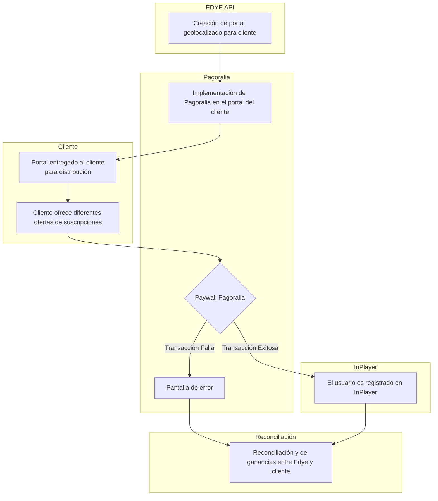

**Versión:** 1.0  
**Fecha:** 01/12/2025  

---

# Modelo de Integración: Edye Billing

Este documento describe el modelo estándar de integración de Billing dentro del ecosistema EDYE / HITN Digital, utilizado para la gestión de suscripciones, cobros, renovaciones, cancelaciones y estados de acceso asociados al consumo de contenidos y aplicaciones.

El modelo es reutilizable para cualquier partner que requiera integración de facturación directa, carrier billing o pasarela externa, manteniendo un enfoque técnico-operativo homogéneo.

## 1. Alcance

El modelo de integración de Billing cubre:

- Creación y gestión de suscripciones
- Procesamiento de pagos, renovaciones y extensiones
- Cancelación y revocación de accesos
- Sincronización de estado de cuenta
- Exposición de estado de suscripción a sistemas consumidores
- Monitoreo, reporting y auditoría de transacciones

No cubre:

- Integraciones de ingesta o delivery de contenidos
- Gestión editorial de contenidos
- UI/UX de pantallas de pago del partner
- Soporte comercial o financiero externo

## 2. Sistemas involucrados

Los siguientes sistemas participan en el flujo de Billing:

- **EDYE Billing Service:** Motor central de facturación, reglas de negocio y control de suscripciones.
- **EDYE API:** Exposición de endpoints REST para operaciones de billing y consulta de estado.
- **Admin Panel (EDYE):** Interfaz operativa para monitoreo, auditoría, reportes y troubleshooting.
- **InPlayer:** Plataforma externa para gestión de pagos, clientes y transacciones (cuando aplica).
- **Pasarela de pago / Carrier Billing (según partner):**
  - Carrier Billing
  - Pasarela externa
  - DTC / Marketplace
- **Partner:** Consumidor de los endpoints de billing y receptor del estado de suscripción.

## 3. Tipos de integración soportados

El modelo de Billing soporta los siguientes tipos de integración:

- **Direct Carrier Billing:** Cobro directo vía operador (telco).
- **DTC / Pasarela Externa:** Integración con proveedor de pagos externo.
- **Marketplace / App Store:** Validación de recibos y control de acceso.
- **Modelo híbrido:** Combinación de billing externo + control centralizado en EDYE.

## 4. Arquitectura general de la integración

La arquitectura de Billing se fundamenta en un **modelo centralizado de orquestación**, en el que EDYE coordina los distintos servicios implicados – procesos de suscripción, cobro y gestión de acceso – mediante un conjunto de microservicios y una capa de orquestación API. Este enfoque permite desacoplar a los partners de la lógica compleja de pagos, simplificando la integración y aumentando la resiliencia del sistema.

Diversos artículos sobre arquitectura de pagos señalan que los motores de orquestación modernos están construidos con microservicios para lograr escalabilidad y fiabilidad; en lugar de un monolito, las funciones se dividen en servicios independientes que pueden desarrollarse, desplegarse y escalarse por separado. En un entorno de orquestación API, un servicio dedicado gestiona el flujo de trabajo y actúa como punto único de control, secuenciando y combinando llamadas a otros servicios. Esta capa de orquestación ofrece varias ventajas: simplifica la lógica del cliente al encapsular el flujo de negocio, permite observar y depurar los procesos en un único punto y mejora la seguridad al abstraer la topología interna.

En el contexto de EDYE, el componente **EDYE Billing Service** orquesta las transacciones de cobro y las gestiona a través de su **API REST.** Los servicios internos almacenan y controlan el estado de las suscripciones, mientras que conectores específicos gestionan la comunicación con los proveedores de pago (carrier billing, pasarelas o marketplaces). La integración con plataformas externas como **InPlayer** también se desacopla a través de esta capa; InPlayer aporta servicios de identidad, pagos y gestión de acceso, pero la orquestación de estos servicios se realiza desde EDYE para asegurar un flujo homogéneo y centralizado.

**Componentes clave:**

- **API REST transaccional:** capa pública que expone operaciones de alta, renovación, cancelación y consulta.
- **Servicios de persistencia de estados:** almacenan los estados de suscripción y registros de transacciones para auditoría y sincronización.
- **Conectores de proveedor de pago:** encapsulan la comunicación con carrier billing, pasarelas externas o marketplaces, y se pueden escalar de forma independiente.
- **Módulo de orquestación:** coordina el flujo entre API, persistencia, conectores y servicios de terceros, realizando transformaciones y agregación de datos.
- **Exposición de estado normalizado a partners:** provee a los sistemas del partner una vista unificada del estado de suscripciones y transacciones.

## 5. Flujo general de Billing

El flujo estándar de Billing se compone de los siguientes pasos:

1. El partner inicia una solicitud de alta de suscripción.
2. EDYE Billing valida el producto, plan y reglas aplicables.
3. Se ejecuta el proceso de cobro vía proveedor configurado.
4. El proveedor retorna el resultado de la transacción.
5. EDYE registra la suscripción y su estado.
6. Se habilita o deniega el acceso según el resultado.
7. Se programan renovaciones automáticas (si aplica).
8. Se exponen endpoints de consulta de estado.
9. Se registran logs, métricas y eventos.
10. Se generan reportes operativos y financieros.

A continuación se muestra un diagrama de alto nivel que ilustra este flujo end‑to‑end. El diagrama refleja la interacción entre el **EDYE Billing** (como orquestador), la pasarela de pagos (**Pagoralia** en el ejemplo), el **cliente** y la plataforma externa **InPlayer**. El portal geolocalizado se crea y se integra con la pasarela; el cliente accede a su portal y oferta distintas suscripciones, el usuario ingresa al paywall y se registra, y finalmente EDYE reconcilia las ganancias con el partner. Si ocurre un fallo de transacción, se presenta una pantalla de error; en caso de éxito, el usuario queda registrado en InPlayer y se continúa con el flujo de renovación y reporting.

> **Figura 1.** Flujo general de Billing

## 6. Pre-requisitos obligatorios

Antes de habilitar una integración de Billing, se requiere:

- Partner registrado y habilitado en EDYE
- Productos y planes configurados
- Reglas de cobro definidas (trial, renovación, cancelación)
- Canal de pago configurado
- Endpoints habilitados y autenticados
- Accesos y roles definidos en Admin Panel
- Validación de ambientes (staging / producción)

## 7. Variantes del modelo de Billing

### 7.1 Tipos de cobro

Tipo Descripción
Trial Acceso gratuito por período definido
Recurring Renovación automática
One-time Pago único
Promotional Condiciones especiales

### 7.2 Gestión de estado

Estado Descripción
Active Suscripción vigente
Expired Período finalizado
Revoked Acceso cancelado
Pending Transacción en proceso

## 8. Validaciones del sistema

Durante el proceso de Billing, EDYE ejecuta validaciones automáticas sobre:

- Existencia del producto y plan
- Estado del cliente
- Resultado del proveedor de pago
- Duplicidad de suscripciones
- Consistencia de fechas y períodos
- Reglas de renovación y cancelación
- Estados de procesamiento: Pending, Active, Expired, Revoked, Failed

## 9. Monitoreo y control

El monitoreo se realiza desde el Admin Panel:

- Dashboard de actividad de billing
- Historial por cliente
- Detalle de transacciones
- Estados de suscripción
- Logs de API
- Reintentos y correcciones manuales (según rol)

## 10. Errores comunes y troubleshooting

Error / Síntoma Causa probable Acción recomendada
Subscription not activated Error en pago Revisar proveedor y reintentar
Renewal not applied Fallo en job automático Verificar scheduler
Status mismatch Desincronización Forzar sync de estado
Payment rejected Proveedor externo Validar motivo del rechazo
API unauthorized Token inválido Regenerar credenciales

## 11. Reporting post-billing

EDYE permite:

- Exportar reportes CSV / XLS
- Auditar transacciones por período
- Consultar métricas de conversión
- Revisar ingresos por partner / producto

## 12. Seguridad y control de acceso

- Autenticación vía tokens seguros
- Control de roles por operación
- Logs auditables
- No exposición de datos sensibles
- Cumplimiento de buenas prácticas de seguridad

## 13. Referencias

- Documentación EDYE Billing API.
- Manual operativo de Admin Panel.
- Procedimientos DevOps (CI/CD, monitoreo, seguridad).
- **InPlayer Basic Overview:** descripción de las tres líneas de servicio de InPlayer (gestión de identidad/autenticación, pagos/suscripciones y control de acceso).
- **Arquitectura de orquestación de pagos:** artículos sobre motores de orquestación que destacan el uso de microservicios para escalabilidad, aislamiento de fallos y despliegues independientes.
- **Capa de orquestación API:** guía sobre diseño de capas de orquestación que explica funciones como secuenciación, agregación y transformación de respuestas.
