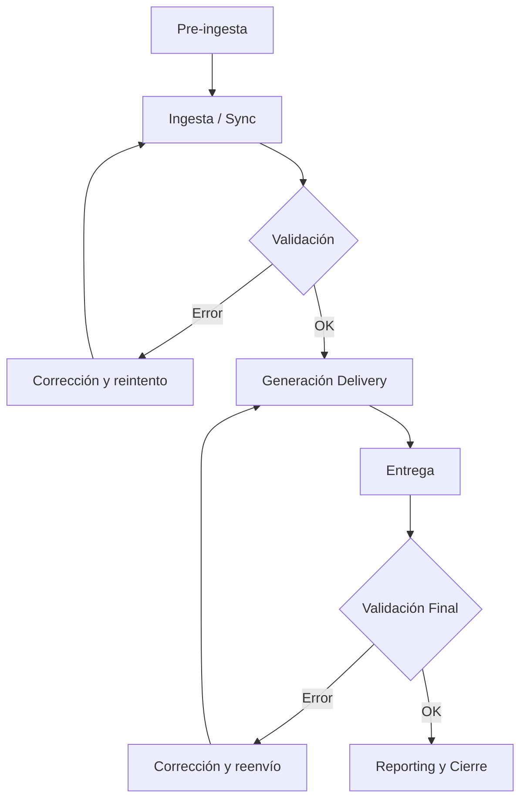

**Versión:** 1.0  
**Fecha:** 01/12/2025  

---

# Modelo de Integración: Ingesta de Contenidos

Este documento describe el **modelo estándar de ingesta de contenidos** dentro del
ecosistema **EDYE**, utilizado por múltiples partners para la distribución de
contenidos audiovisuales (series, películas, episodios, imágenes y metadata).

Este modelo aplica, entre otros, a los siguientes partners:

- Claro Video
- Megacable
- Dish México
- Sky Brasil
- Roku Premium Subscriptions
- WATCH Brazil

---

## 1. Alcance

El modelo de ingesta cubre:

- Preparación y validación de contenidos
- Sincronización con JW Player
- Normalización y validación de metadata
- Generación de assets por partner (paquetes y/o assets individuales)
- Entrega de metadata e imágenes
- Validación, monitoreo y reporting post-ingesta

No cubre:

- Autenticación de usuarios
- Facturación
- Consumo del contenido por el partner

---

## 2. Sistemas involucrados

Los siguientes sistemas participan en el flujo de ingesta:

- **JW Player (JWP)**  
  Origen de videos, playlists y still images.

- **EDYE API**  
  Motor central de procesamiento, validación y generación de assets.

- **Admin Panel (EDYE)**  
  Interfaz operativa para sincronización, validaciones, generación de deliveries y monitoreo.

- **Fuentes de metadata externas (cuando aplique)**  
  - **Gracenote / TMS** (IDs, referencias de catálogo)

> **Regla:** Los identificadores **Gracenote / TMS** se requieren **solo** para partners que tengan **correlación de catálogo vía Gracenote** (actualmente: **[NOMBRE_DEL_PARTNER]**).  
> Para los demás partners, estos IDs **no son obligatorios** (opcionales / N/A).

- **Canales de entrega / repositorios (según configuración de partner)**  
  - Aspera (HITN Production)
  - SFTP del partner
  - S3 del partner (casos específicos)
  - Delivery vía API/SSL (casos específicos)

- **Partner**  
  Receptor final de los assets generados.

---

## 3. Tipos de contenido soportados

El modelo de ingesta soporta los siguientes tipos de contenido:

- Series
- Películas
- Episodios
- Playlists
- Imágenes:
  - Posters
  - Episodic stills
  - Logos
  - Thumbnails (cuando aplique por partner)
- Metadata asociada al contenido

---

## 4. Flujo general de ingesta

El flujo estándar de ingesta se compone de los siguientes pasos:

1. El contenido audiovisual es cargado y organizado en **JW Player**.
2. Se completan **parámetros obligatorios de metadata** (según modelo y partner), por ejemplo:
   - IDs externos (p.ej. **TMS ID**) cuando aplique
   - parámetros custom (p.ej. **Acronym**) cuando aplique
3. Se ejecuta la **sincronización de JW Player con EDYE API**.
4. Se valida la metadata y el etiquetado del contenido (campos obligatorios, consistencia y tags).
5. Se valida el **paquete de imágenes** (posters / episodic stills / thumbnails) y su **naming/estructura** de acuerdo a los specs del partner.
6. Se genera un **delivery** para uno o más partners desde el Admin Panel.
7. EDYE API procesa los assets (XML/metadata, imágenes, paquetes) y ejecuta **QC** (warnings/errors).
8. Los assets son entregados vía el canal configurado (**Aspera / SFTP / S3 / API**).
9. Se valida el estado final de la ingesta (por delivery y por asset) y se reintenta lo fallido (si aplica).
10. Se generan reportes post-ingesta.

### 4.1. Fases del flujo

#### Fase A — Pre-ingesta (Preparación)

1. **Carga de contenido**

   - Videos master
   - Organización por series, temporadas y episodios
   - Idiomas y variantes

2. **Preparación de metadata**

   - Campos obligatorios
   - IDs externos (ej. TMS / Gracenote)
   - Metadata editorial y operativa

3. **Preparación de imágenes**

   - Posters
   - Episodic stills
   - Logos (si aplica)
   - Thumbnails (si aplica)

4. **Configuración de reglas por partner**
   - Tipo de metadata
   - Reglas de validación
   - Reglas de naming y estructura
   - Formato de imágenes y watermark

---

#### Fase B — Ingesta (Ejecución)

5. **Disparo de ingesta**

   - Sincronización vía API
   - O ingesta vía FTP / polling (si aplica)

6. **Validación automática**

   - Video: codec, resolución, duración
   - Metadata: completitud y consistencia
   - Imágenes: existencia y formato

   **Resultado posible:**

   - Failed → requiere corrección
   - Completed with warnings
   - Validated OK

7. **Generación de Delivery**

   - Packaging según especificación del partner
   - Aplicación de naming y estructura
   - Inclusión de thumbnails / watermark (si aplica)

8. **Entrega**
   - Canal definido por partner:
     - SFTP
     - Aspera
     - S3
     - API

---

#### Fase C — Post-ingesta (Control y cierre)

9. **Validación final (Operaciones)**

   - Integridad del delivery
   - Confirmación de recepción por el partner

10. **Reporting**
    - Estado del procesamiento
    - Errores y reprocesos
    - Logs y métricas de ejecución

---

### 4.2. Diagrama del flujo

> **Figura 1.** Diagrama del flujo **

---

## 5. Pre-requisitos obligatorios

Antes de ejecutar una ingesta, se deben cumplir los siguientes requisitos:

- Playlists correctamente configuradas en JW Player (incluyendo playlists específicas por partner, si aplica)
- Contenidos (series/películas/episodios) sincronizables con EDYE API
- Metadata completa y consistente (campos obligatorios, idioma(s), disponibilidad, etc.)
- IDs externos cargados cuando aplique (p.ej. **TMS ID**) y parámetros custom requeridos (p.ej. **Acronym**)
- Etiquetado correcto (ej. `geoList`, tags editoriales)
- Paquete de imágenes completo según el partner:
  - Posters (con aspect ratios requeridos)
  - Episodic stills por episodio (cantidad mínima requerida)
  - Thumbnails (si el partner los requiere)
- Naming y estructura de archivos conforme a las **especificaciones del partner**
- Partner habilitado para delivery (configuración de canal + formato de entrega)

---

## 6. Variantes del modelo de ingesta

Las variantes se agrupan en **canal de entrega** y **tipo de paquete**.

### 6.1 Canales de entrega (según partner)

| Canal         | Descripción                                          |
|--------------|------------------------------------------------------|
| Aspera       | Assets generados y almacenados en HITN Production    |
| SFTP Directo | Assets enviados al repositorio SFTP del partner      |
| S3           | Assets enviados al bucket S3 del partner (casos)     |
| API/SSL      | Delivery vía API/SSL (casos de integración por API)  |

### 6.2 Tipos de paquete / alcance de delivery

| Paquete             | Descripción                                             |
|---------------------|---------------------------------------------------------|
| Metadata + Imágenes | Delivery completo de metadata (XML/JSON) e imágenes     |
| Full Package        | Metadata + posters + episodic stills + thumbnails (si aplica) |
| Solo Imágenes       | Delivery limitado a artwork e imágenes                  |
| Solo Metadata       | Delivery limitado a metadata (cuando el partner lo permite) |

Cada partner puede aplicar una o más variantes del modelo.

---

## 7. Validaciones del sistema

Durante la ingesta, EDYE API ejecuta validaciones automáticas sobre:

- Existencia de imágenes requeridas (por tipo de contenido y por partner)
- Coherencia entre playlists y episodios
- Estructura y naming de assets
- Sincronización JW Player ↔ EDYE
- Configuración del delivery por partner
- Restricciones adicionales (ej. thumbnails con watermark, cuando aplique)

### Estados de procesamiento

- **Pending / Received**: Delivery creado, pendiente de ejecución
- **Processing**: Assets en generación/transferencia
- **Completed**: Ingesta finalizada correctamente
- **Failed**: Error en uno o más assets
- **Completed with Warnings** (si aplica): finaliza pero requiere revisión de alertas

---

## 8. Monitoreo y control

El estado de una ingesta puede ser monitoreado desde el **Admin Panel**:

- Vista general de deliveries
- **Delivery View**: revisión del paquete generado (por partner, por tipo de asset)
- Log detallado por asset (errores, warnings)
- Estado individual de cada archivo
- Reintento manual de assets fallidos
- **API Logs / Log Viewer** (si está habilitado): auditoría y troubleshooting

---

## 9. Errores comunes y troubleshooting

| Error / Síntoma                         | Causa probable                                                                 | Acción recomendada                                               |
|----------------------------------------|--------------------------------------------------------------------------------|------------------------------------------------------------------|
| Validation error                        | Imágenes no sincronizadas o faltantes                                          | Ejecutar sync de JW Player y revalidar                           |
| Missing assets                          | Episodios sin stills / posters incompletos                                     | Cargar/reemplazar imágenes y reintentar                          |
| Metadata inconsistente                  | Campos obligatorios faltantes **o caracteres invisibles/codificación inválida (solo UTF-8)** | Corregir metadata en JWP / EDYE, normalizar texto a UTF-8 y reintentar |
| Delivery stuck / processing prolongado  | Error en batch o dependencia en la transferencia                               | Revisar logs, reintentar, escalar a DevOps                       |
| Naming/estructura inválidos             | No cumple spec del partner                                                     | Ajustar naming/estructura y regenerar                            |

---

## 10. Reporting post-ingesta

Una vez completada la ingesta, EDYE permite:

- Descargar reportes en formato CSV o XLS
- Validar assets entregados por partner
- Auditar fechas, IDs y disponibilidad del contenido

Algunos partners requieren formatos específicos (ej. XLS).

---

## 11. Seguridad y control de acceso

- El acceso al Admin Panel está restringido por roles.
- No se exponen credenciales en la documentación.
- Las operaciones de ingesta quedan registradas en logs auditables.

---

## 12. Referencias

- [Flujo de Ingesta](../flujos/flujo-ingesta.md)
- [Ingesta Claro Video](../partners/claro-video/ingesta.md)
- [Ingesta Dish Mexico](../partners/dish-mexico/ingesta.md)

---

## 13. Documentos de apoyo (Google Drive)

Esta sección centraliza los documentos operativos (PDF) relacionados con el modelo de ingesta.
Usa estos enlaces como referencia visual paso a paso del Admin Panel y procesos de delivery.

### Operación de deliveries y monitoreo

- **Generar deliveries para partners vía EDYE API (PDF)**  
  [Abrir en Drive](https://drive.google.com/file/d/1lljpBhoBqpV9BHzWPlfA6_Rba-Q3kpa9/view?usp=drive_link)

- **Verificar el estado individual de un asset dentro de un delivery (PDF)**  
  [Abrir en Drive](https://drive.google.com/file/d/1Id1bk7cMcvQ-fLHOOZG8bCvFyNa8DSxJ/view?usp=drive_link)

- **Descargar reportes de ingesta / delivery reports (PDF)**  
  [Abrir en Drive](https://drive.google.com/file/d/1dMgpGFmfRcIClUC1X3K68CsPRi4oYyoG/view?usp=drive_link)

### Imágenes y paquetes

- **Descargar paquetes de imágenes para partners específicos (PDF)**  
  [Abrir en Drive](https://drive.google.com/file/d/1RqXEM0K-BSqC7vBPRrdundW3J1LPrVfb/view?usp=drive_link)

- **Reemplazar imágenes de episodios manualmente en EDYE API (PDF)**  
  [Abrir en Drive](https://drive.google.com/file/d/1rRpWeTCohNudmPhUEZr6QLZ0CRxGmFYy/view?usp=drive_link)

- **Sincronizar playlists e imágenes desde JW Player hacia EDYE API (PDF)**  
  [Abrir en Drive](https://drive.google.com/file/d/1EknA3RHwOift9hmv90AgMzdGwLk3KLWj/view?usp=drive_link)

### Metadata y etiquetado

- **Etiquetado masivo (Add Tags to Content in Bulk) vía EDYE API (PDF)**  
  [Abrir en Drive](https://drive.google.com/file/d/1HHgs9z459F3KGgZ8cR3qr6rMBtHYnTB9/view?usp=drive_link)
