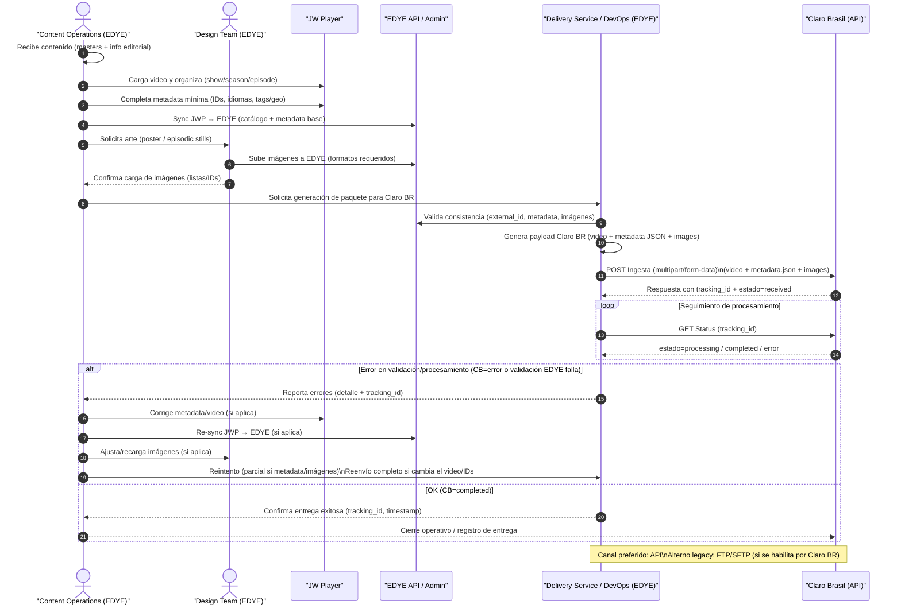

# Anexo de Integración por Ingesta – Claro Brasil

Este documento describe las **configuraciones específicas del partner Claro Brasil** que complementan el **flujo genérico de ingesta EDYE**.  
No redefine el flujo estándar, únicamente detalla los parámetros particulares requeridos por este partner.

---

## 1. Flujo de Ingesta – Claro Brasil

El siguiente diagrama representa el **flujo operativo de ingesta de contenidos hacia Claro Brasil**, basado en el **modelo estándar de ingesta EDYE** y adaptado a las particularidades técnicas de este partner.

El proceso inicia con la **preparación del contenido en JW Player**, donde se cargan los videos maestros, se estructura el catálogo (series, temporadas y episodios) y se completa la metadata obligatoria. Posteriormente, las imágenes requeridas (posters y episodic stills) son generadas y cargadas por el equipo de Diseño en EDYE.

Una vez que video, metadata e imágenes se encuentran sincronizados, el sistema de **DevOps genera el paquete de entrega específico para Claro Brasil**, ejecutando validaciones automáticas sobre formato de video, consistencia de metadata y especificaciones de imágenes.

La entrega se realiza preferentemente vía **API de ingesta de Claro Brasil**, utilizando un esquema asíncrono con **tracking ID** para el seguimiento del estado del procesamiento. En caso de errores de validación o procesamiento, el flujo contempla **corrección en origen y reintentos controlados**, ya sea parciales (metadata / imágenes) o completos (video).

El proceso concluye cuando Claro Brasil retorna el estado **`completed`**, momento en el cual la entrega es validada por Operaciones y se realiza el **cierre operativo de la ingesta**.




> **Figura 1.** _Diagrama del flujo operativo del partner_

---

## 1. Canal de Entrega

**Tipo de entrega:** Híbrida (API + transferencia de archivos)

### 1.1 Métodos soportados

- **API REST (principal)**
- **FTP / SFTP (polling)** _(en proceso de descontinuación)_

### 1.2 Endpoints principales

| Uso                  | Endpoint                                   |
| -------------------- | ------------------------------------------ |
| Ingesta de contenido | `POST /api/ingesta/contenido`              |
| Consulta de estado   | `GET /api/ingesta/status?id={tracking_id}` |

### 1.3 Autenticación

- **Bearer Token**
- Token entregado por Claro Brasil por ambiente (DEV / QA / PROD)

### 1.4 Formato de envío

- `multipart/form-data`
  - Archivo de video
  - JSON de metadata

---

## 2. Estructura y Naming

### 2.1 Estructura lógica de assets

```text
/ingesta/
 └── claro_br/
     └── {external_id}/
         ├── video/
         │   └── {external_id}.mp4
         ├── metadata/
         │   └── {external_id}.json
         └── images/
             ├── poster/
             │   └── {external_id}_poster.jpg
             └── episode/
                 └── {external_id}_ep_{n}.jpg
```

### 2.2 Convenciones de naming

- Sin espacios
- Sin caracteres especiales
- UTF-8 estricto
- Identificador externo consistente entre video, metadata e imágenes

---

## 3. Metadata

### 3.1 Campos obligatorios

| Campo       | Tipo   | Descripción                |
| ----------- | ------ | -------------------------- |
| title       | string | Título del contenido       |
| external_id | string | ID único del contenido     |
| id_cliente  | string | Identificador Claro Brasil |
| duration    | number | Duración en segundos       |
| language    | string | Idioma principal           |
| tms_id      | string | ID Gracenote / TMS         |
| acronym     | string | Acrónimo operativo         |

### 3.2 Ejemplo de JSON

```json
{
  "external_id": "SER123_EP01",
  "title": "Serie Ejemplo - Episodio 1",
  "id_cliente": "CLARO_BR",
  "language": "pt-BR",
  "duration": 1450,
  "tms_id": "SH123456789",
  "acronym": "EDYE",
  "content_type": "episode"
}
```

---

## 4. Imágenes

### 4.1 Tipos requeridos

| Tipo           | Uso      |
| -------------- | -------- |
| Poster         | Serie    |
| Episodic still | Episodio |

### 4.2 Especificaciones

| Tipo     | Resolución   | Ratio | Watermark |
| -------- | ------------ | ----- | --------- |
| Poster   | >= 2000x3000 | 2:3   | No        |
| Episodio | >= 1920x1080 | 16:9  | No        |

---

## 5. Reglas de Validación

### 5.1 Video

- Contenedor: MP4
- Codec: H.264
- Resolución mínima: 1280x720
- Duración máxima: 2 horas
- Audio AAC

### 5.2 Metadata

- JSON válido
- Campos obligatorios presentes
- Sin caracteres especiales invisibles
- UTF-8 estricto

### 5.3 Imágenes

- Cumplimiento de ratio
- Resolución mínima válida
- Naming correcto

---

## 6. Criterios de Aceptación (Operaciones)

Operaciones valida que:

- Video, metadata e imágenes correspondan al mismo external_id
- El estado final del proceso sea completed
- No existan errores de validación
- El tracking ID tenga cierre exitoso
- QC automático sin errores críticos

---

## 7. Reintentos y Rollback

### 7.1 Reintento parcial

Se permite cuando:

- Error de metadata
- Error de imagen
- Fallo de validación no estructural

### 7.2 Reenvío completo

Obligatorio cuando:

- Error de video
- Cambio de archivo maestro
- Inconsistencia de IDs

---

## 8. Estados del Proceso

| Estado     | Descripción         |
| ---------- | ------------------- |
| received   | Archivo recibido    |
| processing | En procesamiento    |
| error      | Fallo en validación |
| completed  | Proceso exitoso     |

---

## 9. Soporte y Escalamiento

### 9.1 Operación EDYE

- Horario: L-V 9:00-18:00 (UTC-5)
- Canal: Slack / Email operativo
- Escalamiento: DevOps EDYE

### 9.2 Partner Claro Brasil

- Equipo técnico Claro BR
- Escalamiento vía ticket / contacto asignado
- Ventana de soporte según SLA del partner
