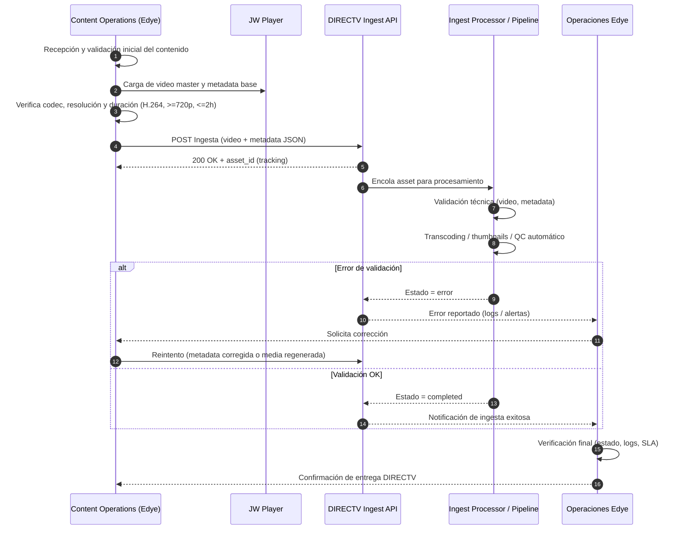

# Anexo por Partner (reutilizable) — DIRECTV (Integración tipo Ingesta)

## Descripción general del flujo de ingesta

El siguiente diagrama de secuencia de ingesta para DIRECTV describe el proceso completo de entrega de contenidos desde Edye hacia el partner, utilizando un modelo API-driven y altamente automatizado.
El objetivo del flujo es asegurar que cada asset audiovisual cumpla con los requisitos técnicos, de metadata y de procesamiento antes de ser aceptado por DIRECTV, manteniendo trazabilidad, control de errores y criterios claros de reintento.

Este flujo se apoya en un pipeline asíncrono, donde la ingesta inicial, el procesamiento y la validación final están desacoplados, permitiendo escalar volumen y reducir intervención manual.

<div class="mermaid-zoom">


</div>
> **Figura 1.** Diagrama del flujo operativo del partner

## Explicación de la secuencia paso a paso

1) **Recepción y pre-validación del contenido**  
Content Operations recibe el contenido y realiza una verificación básica previa (formato, duración, resolución), asegurando que el material esté listo para ser ingestado.

2) **Carga y preparación del asset**  
El video master y la metadata base son preparados (y, si aplica, gestionados desde JW Player como fuente de verdad), antes de iniciar la entrega al partner.

3) **Ingesta vía API DIRECTV**  
El contenido se envía mediante un request POST a la API de ingesta de DIRECTV, incluyendo el archivo de video y la metadata en formato JSON.  
La API responde con un asset_id que permite el tracking del proceso.

4) **Procesamiento asíncrono**  
El asset es encolado en el pipeline de DIRECTV, donde se ejecutan validaciones técnicas, procesamiento de video (transcoding), generación de thumbnails y controles de calidad automáticos.

5) **Validación y control de errores**  
Si ocurre un error (video inválido, metadata incompleta, fallo de procesamiento), el estado se marca como error y se notifican logs y alertas a Operaciones.  
Operaciones coordina con Content Operations la corrección correspondiente.

6) **Reintentos controlados**  
Dependiendo del tipo de error, el flujo permite:

- Reintentar solo la metadata corregida, o
- Regenerar el media y reenviar la ingesta completa.

7) **Finalización exitosa**  
Si todas las validaciones son correctas, el asset cambia a estado `completed` y queda disponible en el ecosistema de DIRECTV.

8) **Cierre operativo**  
Operaciones realiza la verificación final (estado, logs y SLA) y confirma la entrega como cerrada.

---

## 1. Canal de entrega

**Método principal (activo):** API REST (inserción de contenido vía endpoint de ingesta)

- Endpoint: `POST /api/ingesta/contenido`
- Autenticación: Bearer Token
- Content-Type: `multipart/form-data` (media) + JSON (metadata)
- Token (QA / Sandbox): `abc123` (token de prueba)
- Token (Producción): [COMPLETAR]
- Base URL (Dev/QA/Prod): [COMPLETAR]

**Método alterno (legado):** FTP con polling (nota: “FTP será descontinuado Q3 2025”)

- FTP host/ruta: [COMPLETAR]

---

## 2. Estructura y naming

**Convención recomendada (archivo media):**
`directv_<id_cliente>_<titulo_sanitizado>_<yyyyMMdd>.<ext>`
Ejemplo: `directv_7890_el-bosque-magico_20251222.mp4`

**Convención recomendada (metadata):**
`directv_<id_cliente>_<asset_id>.json`
Ejemplo: `directv_7890_1234-5678.json`

---

## 3. Metadata

**Campos obligatorios (mínimos):**

- `titulo`
- `id_cliente`
- `archivo_media` (en el multipart como “file”)

**Ejemplo JSON mínimo:**

```json
{
  "titulo": "Nombre del contenido",
  "id_cliente": "7890",
  "idioma": "es",
  "tipo": "vod",
  "anio": 2025,
  "generos": ["kids", "educativo"]
}
```

**Ejemplo de request (curl):**
`curl -X POST -F file=@video.mp4 -F metadata='{...}' <endpoint>`

**Respuesta esperada (tracking):**
`200 OK` con payload: `{ "status": "received", "id": "1234-5678" }`

---

## 4. Imágenes

En DIRECTV, el pipeline incluye “creación de thumbnails” como parte del procesamiento automático.

**Lista mínima recomendada:**

- Poster / Key Art (vertical)
- Thumbnail (horizontal)
- Still (episódico, si aplica)

**Tamaños / ratios:** [COMPLETAR]

**Watermark:** [Sí/No] [COMPLETAR]

---

## 5. Reglas de validación

**Video:**

- Codec: H.264
- Resolución mínima: 720p
- Duración máxima: 2 horas

**Metadata:**

- Rechazo si hay metadatos incompletos

**Estados de proceso:**

- `received`, `processing`, `error`, `completed`

---

## 6. Criterios de aceptación

**Checklist de aceptación (Operaciones):**

- Ingesta exitosa: API responde 200 y entrega id de tracking
- Seguimiento: el id consulta estado en `GET /api/ingesta/status?id=xxx`
- Estado final: `completed` (sin quedarse en `processing` más allá del umbral operativo)
- Validación técnica de media: cumple `720p+, H.264 y <=2h`
- Verificación de pipeline posterior: transcode ABR + thumbnails + QC automatizado completados
- Monitoreo/logs: evidencias en Elastic/Kibana (IngestaLogs)

---

## 7. Reintentos / rollback

**Reintentar (sin reenviar todo) cuando:**

- Falla por “metadatos incompletos” y el media no requiere cambios → reenviar request con metadata corregida + mismo archivo

**Regenerar y reenviar completo cuando:**

- El error es “formato no soportado” o falla de validación de video → requiere nuevo encode/export y nueva ingesta

**Rollback:**

- Detener publicación/entitlement del asset en el destino
- Reingestar versión corregida
- Auditar logs del intento fallido
- [COMPLETAR: existe endpoint de delete/cancel del asset o es solo reemplazo por reingesta]

---

## 8. Soporte

**Monitoreo / alertas:**

- Logs: Elastic/Kibana → “IngestaLogs”
- Alerta crítica: más de 10 errores consecutivos por cliente

**Contactos:**

- Partner DIRECTV (NOC/Soporte): [Nombre, email, canal]
- Edye Operations (L1): [Nombre, email, Slack/Teams]
- Edye DevOps (L2): [Nombre, on-call]
- Escalamiento (L3): [Tech Lead / Arquitectura]

**Horario:**

- Ventana operativa: [COMPLETAR]
- Ventana de mantenimiento: [COMPLETAR]

---

## 9. Notas específicas DIRECTV

- Tipo de contenido documentado: Video MP4 (H.264) + JSON de metadatos
- Volumen estimado: 1500 archivos/día
- Componentes involucrados: Ingest Processor, Metadata Parser, Media Transcoder; dependencias: S3 Bucket, AWS Lambda, Kafka
- Almacenamiento: AWS S3 (bucket: vod-ingest-prod)
