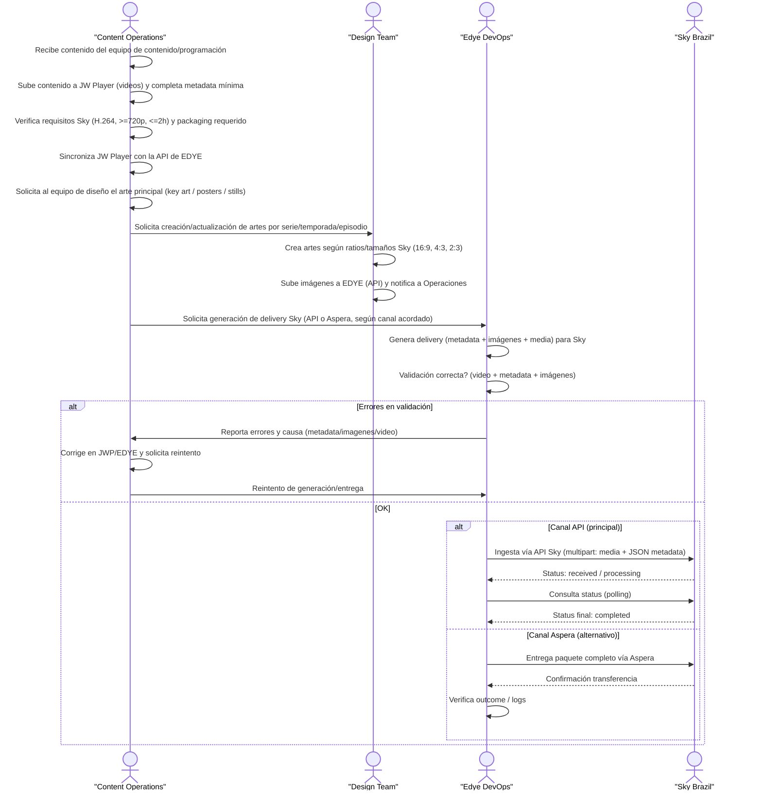

# Anexo de Integración por Ingesta – Sky Brazil

Este anexo resume los parámetros específicos para Sky Brazil. API es el canal preferido; Aspera se usa solo en flujos file-based cuando se acuerda.

---

## 1. Flujo de Ingesta – Sky Brazil

El siguiente flujo describe el **proceso end-to-end de ingesta y entrega de contenidos hacia Sky Brazil**, partiendo desde la preparación editorial y técnica en EDYE hasta la validación final del partner.
Este flujo es una **implementación específica del modelo genérico de ingesta**, adaptada a los requisitos técnicos y operativos de Sky.

<div class="mermaid-zoom">


</div>
> **Figura 1.** Diagrama del flujo operativo del partner

### Descripción del flujo

1) **Recepción y preparación del contenido**
    - Content Operations recibe contenido aprobado (video + info editorial + disponibilidad).
    - Carga los videos en JW Player con metadata mínima y valida requisitos técnicos Sky (codec, resolución, duración).

2) **Sincronización con EDYE**
    - Tras validar en JWP, se sincronizan los assets con la API de EDYE, dejando a EDYE como capa de orquestación hacia Sky.

3) **Producción y carga de artes**
    - Content Operations solicita a Design Team los artes (posters, key art, stills) con ratios/resoluciones definidas por Sky.
    - Design Team carga las imágenes en EDYE y notifica a Operaciones al completar.

4) **Generación del delivery**
    - Con video, metadata e imágenes disponibles, Edye DevOps genera el delivery para Sky Brazil aplicando reglas del canal elegido (API o Aspera).

5) **Validación técnica**
    - DevOps valida automáticamente: formato y características del video, completitud/consistencia de metadata, presencia y calidad de imágenes.
    - Ante errores, se reporta a Content Operations para corrección y reintento.

6) **Entrega a Sky Brazil**
    - Canal API (principal): ingesta vía API Sky; se monitorea el estado hasta `completed`.
    - Canal Aspera (alterno): se entrega paquete completo vía Aspera y se verifica transferencia/procesamiento.

7) **Cierre y monitoreo**
    - El flujo cierra cuando Sky confirma recepción/procesamiento correcto.
    - Logs y estados de ingesta quedan disponibles para monitoreo/reporting operativo.

---

## 2. Canal de entrega

### Opción A — Ingesta vía API (preferida)

- Tipo: API REST
- Endpoint: `POST /api/ingesta/contenido`
- Autenticación: Bearer Token
- Formato: `multipart/form-data` (media) + JSON (metadata)
- Tracking: el API retorna `id` y se consulta estado por `GET /api/ingesta/status?id={id}`
- Fallback / legado: FTP con polling (plan de deprecación Q3 2025)

### Opción B — Entrega de paquetes vía Aspera (file-based)

- Tipo: Aspera Enterprise Server (push o pull)
- Host: `aspera.engsky.com.br`
- Puertos: TCP 33001 / UDP 33001
- Requisitos onboarding: IP(s) públicas fijas, modalidad push/pull, bandwidth, contactos técnicos/operativos, whitelist y credenciales.
- Nota: mantener API como canal principal; Aspera solo para flujos específicos acordados con Sky/VRIO.

---

## 3. Estructura y naming

### API (Opción A)

- Media: `video.mp4` (H.264)
- Metadata: JSON embebido en el form (`-F metadata='{...}'`)
- Naming recomendado (EDYE):
  - `archivo_media`: `{partner}_{id_cliente}_{assetId}_{lang}_{version}.mp4`
  - `assetId`: estable, sin espacios, sin caracteres especiales invisibles (UTF-8 limpio)

### Aspera / paquetes (Opción B)

Estructura base de paquete (ejemplo):

```text
/PACKAGE_ROOT/
	ADI.XML
	media/      (video)
	images/     (posters/banners)
	subtitles/  (si aplica)
```

Regla clave: solo colocar en la carpeta de entrega paquetes ya conformes (VRIO hace pull/push y dispara procesamiento al descargar).

---

## 4. Metadata

### 3.1 Campos obligatorios (API)

- `titulo`
- `id_cliente`
- `archivo_media`
- `idioma`
- `asset_id`
- `tipo`

### 3.2 Ejemplo JSON (mínimo)

```json
{
  "titulo": "Mi Serie S01E01",
  "id_cliente": "SKYBR",
  "idioma": "es",
  "asset_id": "SERIE_S01E01",
  "tipo": "episode"
}
```

### 3.3 Metadata file-based (Aspera)

- Basada en CableLabs 1.1 con estructura ADI.XML (Title, Movie, Poster, Preview, etc., según alcance Sky/VRIO).

---

## 5. Imágenes

- Formato: JPG
- Regla editorial: 16:9 y 4:3 para carruseles/PDP sin texto para evitar sobrecarga visual.
- Watermark / labels: no requerido; labels visuales solo si se acuerda con curación.

### 4.1 Movies (mínimos)

| Ratio | Resolución | Preferencia                                                     |
| ----- | ---------- | --------------------------------------------------------------- |
| 16:9  | 1920x1080  | Iconic > Key Art > VOD Art > Banner-L2 (sin texto)              |
| 4:3   | 1440x1080  | Iconic > Key Art > VOD Art > Banner-L2 (sin texto)              |
| 2:3   | 1280x1920  | Poster Art > VOD Art > Key Art > Banner-L1 (puede llevar texto) |

### 4.2 Shows (mínimos)

| Ratio | Resolución | Preferencia                                |
| ----- | ---------- | ------------------------------------------ |
| 16:9  | 1920x1080  | Iconic > Banner-L1 > Banner-L2 (sin texto) |
| 4:3   | 1440x1080  | Iconic > Banner-L1 > Banner-L2 (sin texto) |
| 2:3   | 1280x1920  | Poster / VOD Art                           |

### 4.3 Episodes (mínimos)

| Ratio | Resolución | Preferencia                        |
| ----- | ---------- | ---------------------------------- |
| 16:9  | 1920x1080  | Iconic Art (screen grab) sin texto |
| 4:3   | 1440x1080  | Puede ser crop del 16:9            |
| 2:3   | 1280x1920  | Puede ser crop del 16:9            |

---

## 6. Reglas de validación

### 5.1 API (Sky Brazil)

- Resolución mínima: 720p
- Duración máxima: 2h
- Codificación: H.264
- Estados: `received | processing | error | completed`

### 5.2 Aspera / VRIO (file-based)

- Wrappers/codecs aceptados según spec (ej. TS + H.264/AVC + AC3, etc.).
- Subtítulos SRT: sin tags HTML `<b>` `<i>`, guardados en filesystem tipo Windows/DOS.

---

## 7. Criterios de aceptación

### 6.1 Aceptación técnica (Operaciones)

- Ingesta API responde `200 OK` con `{ "status": "received", "id": "..." }`.
- `GET /api/ingesta/status?id=...` llega a `completed` en la ventana esperada (referencia 3–5 min/archivo).
- Sin errores de validación por formato no soportado o metadata incompleta.

### 6.2 Aceptación visual

- Cumple ratios/tamaños mínimos y reglas sin texto donde aplica.

---

## 8. Reintentos / rollback

### 7.1 API

- Falla por metadata incompleta: corregir metadata y reintentar `POST` (mismo `asset_id`).
- Falla por formato/codec/duración: corregir media fuente y reingestar (nuevo archivo).
- Reintentos recomendados: máximo N (definir) antes de escalar.

### 7.2 Aspera

- Si un paquete ya fue pull/push y resulta inválido: reenvío completo del paquete (no incremental) para evitar estados inconsistentes.

---

## 9. Soporte, contactos, horarios, escalamiento

### Monitoreo / logs

- Logs: Elastic/Kibana > IngestaLogs
- Alertas críticas: >10 errores consecutivos por cliente

### Contactos (pendiente completar)

- Sky/VRIO NOC / Engineering Network Team (Aspera): TBD
- Operaciones EDYE: TBD
- Escalamiento DevOps EDYE: TBD
- Horario operativo y ventana de despliegues: TBD
