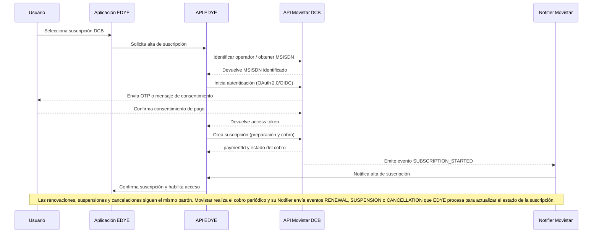

# Integración EDYE – Telefónica (Movistar) — API + Notifier (DCB)

## 1. Introducción

Este documento describe de manera específica y operativa cómo se implementa el modelo de **API + Notifier** para la facturación directa (**Direct Carrier Billing**) entre **EDYE** y **Telefónica**, a través de su marca **Movistar**. La base de trabajo es el modelo genérico de integración de EDYE, pero aquí se incluyen las particularidades del partner. El método DCB permite que el costo de la suscripción se cargue directamente en la factura del cliente. En el caso de servicios de entretenimiento como Kanto en Movistar Plus+, este enfoque ha demostrado que el importe del plan anual puede cargarse “directamente a la factura de Movistar” y que la integración se apoya en la API de facturación abierta de la iniciativa **Open Gateway**.
Para los usuarios de Movistar, este método reduce fricción al suscribirse y elimina la necesidad de introducir datos bancarios. El mismo principio se aplica a EDYE.

## 2. Alcance

Al igual que el documento genérico, este manual se dirige a equipos de **Operaciones**, **DevOps** y **técnicos de Telefónica**. Se detalla la integración del modelo API + Notifier con Movistar, cubriendo:

- Componentes y arquitectura adaptados al entorno de Telefónica.
- Flujos específicos de activación, renovación y baja de suscripción.
- Especificaciones del Notifier de Movistar.
- Consideraciones de seguridad particulares y reglas operativas acordadas.

No se duplican explicaciones generales ya contenidas en el documento genérico; cualquier referencia a mecanismos comunes se entenderá que sigue lo allí descrito.

## 3. Arquitectura lógica específica

El modelo de integración mantiene la misma estructura general (aplicación EDYE, API REST de EDYE, sistema de billing interno, Notifier y operador). En el caso de Telefónica:

- **Operador Movistar:** Telefónica expone su API de Carrier Billing a través de la iniciativa Open Gateway. Esta API soporta pagos de uno y dos pasos, cancelación y consulta de transacciones y se invoca mediante **OAuth 2.0 / OpenID** Connect para autenticar a la aplicación cliente.
- **Identificación del operador:** EDYE utiliza mecanismos como **telco finder** para determinar que el usuario pertenece a Movistar. Este paso es necesario para enrutar la solicitud al servidor correcto.
- **Consentimiento del usuario:** Telefónica gestiona el consentimiento final, redirigiendo al usuario a una página de privacidad donde autoriza el acceso a las capacidades de red.

El diagrama lógico es el mismo que en el documento genérico, con la diferencia de que el componente “Operador DCB” corresponde a **Telefónica (Movistar)** y se invoca siguiendo las especificaciones de la API CAMARA.

## 4. Flujos específicos de integración

### 4.1. Activación de suscripción con Movistar

1. **Identificación del usuario y operador:** la aplicación EDYE solicita a la API de EDYE un proceso de suscripción vía DCB. EDYE o un agregador obtiene el **MSISDN** o identificador del usuario y emplea la función de telco finder para confirmar que se trata de un cliente Movistar.
2. **Autenticación y consentimiento:** se ejecuta un flujo **OAuth 2.0 / OIDC** en modalidad backend (por ejemplo, Client Initiated Backchannel Authentication). La API de Movistar solicita autenticación al usuario, quien recibe un mensaje o notificación para aprobar la compra. Tras la aprobación, EDYE recibe un token de acceso.
3. **Preparación y solicitud de pago:** EDYE decide si utiliza el flujo de un paso (prepara y cobra en una sola llamada) o dos pasos. En el segundo caso se hace una reserva de pago y posteriormente un confirm para ejecutar el cobro. Los endpoints de cancelación y consulta de pago están disponibles para anular una reserva o recuperar información de la transacción.
4. **Cobro y activación:** Movistar carga el importe del plan en la factura del usuario. Tras el cobro exitoso, la API devuelve un paymentId y marca la suscripción como activa.
5. **Notificación de alta:** el Notifier de Telefónica envía a EDYE un evento SUBSCRIPTION_STARTED con el identificador de transacción. EDYE valida la firma y actualiza su sistema de billing interno. Se habilita el acceso al contenido.

### 4.2. Notificación de eventos de billing

Telefónica utiliza un Notification Endpoint en la API CAMARA para emitir notificaciones sobre el proceso de pago a una URL proporcionada por el cliente. Las principales características del Notifier de Movistar son:

- **Formato de mensaje:** JSON con campos como eventType, paymentId, msisdn, timestamp y payload adicional. El campo eventType adopta valores como SUBSCRIPTION_STARTED, RENEWAL, SUSPENSION y CANCELLATION (pueden existir códigos internos adicionales acordados entre las partes).
- **Firma y seguridad:** las notificaciones se firman digitalmente. Telefónica proporciona una clave pública para validar la firma o un mecanismo HMAC. EDYE debe verificar la firma antes de procesar el evento.
- **Reintentos:** si EDYE no responde con 200 OK, Telefónica reenviará la notificación utilizando un mecanismo de reintento exponencial hasta un número máximo de intentos.
- **Idempotencia:** cada notificación incluye un identificador único (paymentId o notificationId) que permite descartar duplicados.

### 4.3. Renovaciones y bajas

- **Renovaciones periódicas:** Movistar ejecuta los cargos de renovación de acuerdo con la periodicidad definida en el plan. Después de cada cobro exitoso se envía un evento RENEWAL a EDYE. EDYE actualiza la fecha de expiración y mantiene activo el acceso del usuario.
- **Suspensiones:** si la renovación no puede cobrarse (p. ej., saldo insuficiente), Movistar envía un evento SUSPENSION. EDYE marca la suscripción como suspendida y restringe temporalmente el acceso.
- **Cancelaciones:** las bajas pueden originarse por solicitud del usuario (a través de canales de Movistar) o por terminación administrativa. En ambos casos, se envía un evento CANCELLATION y EDYE revoca el acceso.

## 5. Particularidades del Notifier de Telefónica

- **Endpoints y autenticación:** Telefónica publica un endpoint de notificaciones definido en la API CAMARA; la URL del webhook de EDYE debe registrarse previamente. La autenticación se realiza mediante cabeceras con tokens generados por Telefónica y validados por EDYE.
- **Esquemas de respuesta:** EDYE debe responder siempre con 200 OK y un cuerpo vacío para confirmar la recepción. Respuestas distintas se interpretan como fallo y generan reintentos.
- **Pruebas y sandbox:** Telefónica proporciona un entorno de pruebas donde las notificaciones se envían a un webhook de sandbox. Es fundamental verificar en este entorno que las firmas se validan correctamente y que se maneja la idempotencia.

## 6. Consideraciones de seguridad y validación

- **OAuth 2.0 / OIDC:** para invocar la API de Movistar se requiere obtener un access token. El proceso incluye autenticación del usuario final y validación del operador.
- **Consentimiento del usuario:** Movistar es responsable de recopilar el consentimiento del usuario final para utilizar capacidades de red. Se redirige al usuario a una página de privacidad provista por el operador y, tras autorizar, la API devuelve el consentimiento registrado.
- **Firma de notificaciones:** todas las notificaciones contienen una firma digital o HMAC; EDYE debe validar esta firma usando la clave proporcionada por Telefónica.
- **Datos personales:** al igual que en el modelo genérico, EDYE no almacena información personal sensible del usuario; la identificación se realiza mediante pseudónimos y el MSISDN, que se cifran y se tratan de acuerdo con las leyes de protección de datos.
- **Políticas de reintentos y latencia:** las notificaciones deben recibirse y procesarse en un tiempo razonable (por ejemplo, < 2 segundos). Se recomienda monitorear la latencia y establecer alarmas en caso de retrasos.

## 7. Manejo de incidencias y escenarios de error

- **Errores de autenticación de token:** si el token OAuth es inválido o ha expirado, la API de Movistar responde con 401 Unauthorized. EDYE debe refrescar el token y reintentar la petición.
- **Pago rechazado:** cuando el operador rechaza un cobro, se devuelve un código de error en la respuesta de la API. EDYE debe finalizar el flujo de suscripción y notificar al usuario.
- **Notificaciones no reconocidas:** si llega un eventType no soportado, EDYE debe responder 400 Bad Request e iniciar una investigación con el equipo de Telefónica.
- **Desincronización de estados:** pueden ocurrir inconsistencias entre el estado reportado por Movistar y el registrado en EDYE (por ejemplo, un evento de renovación no recibido). Se recomienda contar con procesos de reconciliación periódica (consultas al endpoint de pago) y un canal de soporte técnico con Telefónica.

## 8. Reglas operativas acordadas

- **Ventanas de mantenimiento:** se deben coordinar con Telefónica para programar mantenimientos que puedan afectar al Notifier o a la API.
- **Acuerdos de nivel de servicio (SLA):** el tiempo de disponibilidad objetivo para el webhook de EDYE debe ser ≥ 99,9 %. Telefónica se compromete a entregar las notificaciones en tiempo y forma.
- **Datos de contacto:** ambas partes deben mantener actualizada la información de contacto operativo para escalar incidencias 24/7.
- **Control de versiones:** cualquier cambio en el contrato de la API o del Notifier se comunicará con antelación y se gestionará mediante versionado semántico.
- **Auditoría compartida:** ambas empresas deben conservar registros de transacciones y notificaciones para facilitar auditorías y solución de conflictos.
- **Pruebas de regresión:** antes de lanzar cambios en producción se deben ejecutar casos de prueba en el entorno de sandbox y verificar que la integración sigue funcionando correctamente.

## 9. Tabla de eventos y acciones (Movistar)

| eventType            | Significado en Movistar                          | Acción esperada en EDYE                 |
| -------------------- | ------------------------------------------------ | --------------------------------------- |
| **SUBSCRIPTION_STARTED** | Alta de suscripción; cobro inicial exitoso       | Activar plan y habilitar acceso.        |
| **RENEWAL**              | Renovación periódica del plan                    | Actualizar vigencia, mantener acceso.   |
| **SUSPENSION**           | Cobro de renovación fallido; suspensión temporal | Marcar la suscripción como suspendida.  |
| **CANCELLATION**         | Cancelación definitiva de la suscripción         | Revocar acceso y cerrar la suscripción. |
