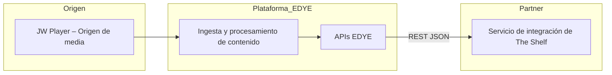
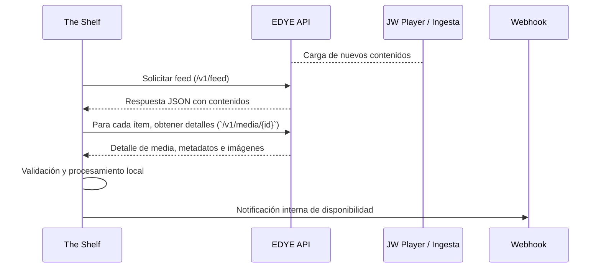

# 1. Información General

| Elemento                    | Valor                                                                                                                                                                      |
| --------------------------- | -------------------------------------------------------------------------------------------------------------------------------------------------------------------------- |
| Partner                     | The Shelf                                                                                                                                                                  |
| Nombre del Servicio         | Delivery de Contenidos – EDYE API / JW Player Feed                                                                                                                         |
| Tipo de integración         | Delivery vía API (pull de contenido)                                                                                                                                       |
| Objetivo                    | Distribuir contenido actualizado (video, metadatos, imágenes) mediante APIs EDYE hacia la plataforma del partner, permitiendo su ingesta en JW Player y sistemas internos. |
| Formato de salida           | JSON estructurado según especificaciones de JW Player y el modelo EDYE.                                                                                                    |
| Frecuencia de actualización | Cada hora o bajo demanda (evento de publicación).                                                                                                                          |

Esta sección define el alcance y los parámetros básicos de la integración. El tipo de integración Delivery vía API implica que el partner consume de forma programada o event‑driven los recursos expuestos por las APIs de EDYE. El contenido abarca video, metadatos y thumbnails, los cuales se generan en la plataforma EDYE a partir de los orígenes de media (JW Player) y se sirven mediante endpoints REST.

## 2. Estructura del JSON entregado

La API entrega un feed en formato JSON. Cada entrada del feed corresponde a un video y contiene los campos principales que se muestran a continuación. El tamaño máximo del feed es de 1 000 ítems por consulta.

### 2.1 Campos principales

| Campo            | Descripción                                                                        | Obligatorio |
| ---------------- | ---------------------------------------------------------------------------------- | ----------- |
| title            | Título del contenido.                                                              | Sí          |
| description      | Descripción breve del asset.                                                       | No          |
| image / images[] | URL de la miniatura principal o arreglo de URLs de miniaturas en varios tamaños.   | No          |
| sources          | Lista de fuentes de vídeo. Cada elemento incluye file, label, type, width, height. | Sí          |
| tags             | Conjunto de etiquetas asociadas al contenido.                                      | No          |
| pubdate          | Fecha de publicación en formato ISO 8601.                                          | Sí          |
| custom_fields    | Objeto JSON con campos personalizados definidos por el partner.                    | No          |

El endpoint de entrega se configura como una URL pública o autenticada. El partner debe solicitar los feeds de manera autenticada mediante token de API o cabecera HTTP conforme a las políticas de seguridad de EDYE.

### 2.2 Arquitectura general

La arquitectura de la entrega está compuesta por los siguientes componentes:


> **Figura 1.** _Diagrama Arquitectura general_

**Origen:** EDYE utiliza JW Player como origen de media. Las cargas de vídeo y sus variantes se almacenan y gestionan en JW Player.

**Plataforma EDYE:** realiza la ingesta del contenido, normaliza metadatos e imágenes y expone los recursos mediante las APIs EDYE.

**Partner:** The Shelf opera un servicio de integración que consume los endpoints REST para construir su catálogo local y publicar en sus reproductores (JW Player u otros).

### 2.3 APIs involucradas

A continuación se detallan los endpoints principales que el partner debe consumir. Todos los endpoints son de tipo HTTP GET y devuelven objetos JSON.

| Endpoint                                    | Descripción                                                                              | Parámetros relevantes        |
| ------------------------------------------- | ---------------------------------------------------------------------------------------- | ---------------------------- |
| /v1/feed                                    | Devuelve el feed completo de contenidos disponibles.                                     | page, page_size (paginación) |
| /v1/feed?updated_since=YYYY‑MM‑DDTHH:MM:SSZ | Devuelve únicamente los ítems actualizados desde una fecha determinada.                  | updated_since (ISO 8601)     |
| `/v1/media/{id}`                             | Devuelve el detalle de un contenido específico, incluyendo fuentes de vídeo y metadatos. | id (UUID del contenido)      |
| `/v1/media/{id}/images`                       | Devuelve la lista de miniaturas asociadas al contenido.                                  | id (UUID del contenido)      |
| `/v1/media/{id}/metadata`                     | Devuelve únicamente los metadatos del contenido.                                         | id                           |

Cada endpoint requiere autenticación mediante un token de API enviado en la cabecera Authorization: Bearer. El partner deberá gestionar la renovación y almacenamiento seguro de dicho token. Las rutas y nombres de endpoints pueden ajustarse según el entorno (QA o producción).

## 3. Contenido Multimedia y Thumbnails

### 3.1 Fuentes de vídeo

El campo `sources` es una lista de objetos que definen cada versión del vídeo. Cada objeto incluye al menos:

- `file` – URL del archivo de vídeo (HLS, MP4 u otro formato).
- `label` – Indicador de calidad o resolución (por ejemplo 1080p).
- `type` – Tipo MIME del archivo (video/mp4, application/x-mpegURL, etc.).
- `width`/`height` – Resolución del vídeo en píxeles.

Todas las URLs deben ser accesibles mediante HTTPS. El partner debe comprobar su disponibilidad antes de ingestarlas.

### 3.2 Imágenes

Las miniaturas se suministran en el campo `image` o dentro de `images[]` para soportar múltiples tamaños. Las recomendaciones de EDYE son:

- Relación de aspecto 16:9.
- Resolución mínima 640×360 px.
- Formato JPG o PNG optimizado para web.

El partner puede solicitar imágenes en diferentes resoluciones empleando el endpoint `/v1/media/{id}/images` y filtrando por clave de tamaño (small, medium, large).

### 3.3 Reglas de validación para multimedia

- **Verificación de URLs:** antes de publicar un feed, la plataforma EDYE valida automáticamente que los enlaces de vídeo e imagen respondan con código HTTP 2xx. El partner debe replicar esta verificación para descartar contenidos corruptos.
- **Integridad del archivo:** comprobar que la duración y el tamaño del vídeo se ajustan a los metadatos informados. Las discrepancias deben reportarse a soporte.
- **Formatos soportados:** solo se aceptan tipos MIME estándar (MP4/HLS para vídeo, JPEG/PNG para imágenes). Archivos con codecs no soportados deben ser omitidos.

## 4. Metadatos requeridos y opcionales

### 4.1 Campos obligatorios

| Campo   | Descripción                               |
| ------- | ----------------------------------------- |
| title   | Título del vídeo.                         |
| sources | Array de fuentes de vídeo.                |
| pubdate | Fecha de publicación en formato ISO 8601. |

### 4.2 Campos opcionales

| Campo            | Descripción                                      |
| ---------------- | ------------------------------------------------ |
| description      | Descripción o sinopsis del contenido.            |
| tags             | Lista de etiquetas temáticas o de clasificación. |
| image / images[] | Miniaturas asociadas al vídeo.                   |
| duration         | Duración del contenido en segundos.              |
| custom_fields    | JSON anidado con claves específicas del cliente. |

### 4.3 Campos personalizados

Los `custom_fields` permiten incluir metadatos específicos definidos por el partner. Este campo es opcional pero debe respetar el formato JSON. Ejemplo:

```json
{
  "custom_fields": {
    "season": "3",
    "rating": "PG‑13"
  }
}
```

La plataforma EDYE no interpreta estos valores; se almacenan y transmiten tal cual. The Shelf es responsable de la consistencia y uso de los mismos.

## 5. Proceso de entrega y endpoints

### 5.1 Método de entrega

El feed se genera en el backend de EDYE y se publica vía HTTP(S). El partner ejecuta peticiones GET a los endpoints descritos en la sección 2 para obtener datos completos o incrementales. El modelo de integración es pull, es decir, The Shelf inicia las solicitudes según su plan de actualización.

### 5.2 Seguridad y autenticación

Se emplea autenticación mediante token en la URL o encabezado, o bien autenticación básica, según lo acordado. Las credenciales se suministran a través de canales seguros. Se recomienda rotar los tokens periódicamente y utilizar HTTPS para proteger los datos en tránsito.

### 5.3 Monitoreo y notificaciones

- **Monitoreo:** EDYE registra el estado HTTP de cada entrega, logs de acceso y la integridad del JSON generado. Se recomienda que The Shelf haga un seguimiento de las llamadas, tiempos de respuesta y códigos de estado para detectar anomalías.
- **Notificaciones:** tras una actualización exitosa del feed, la plataforma puede invocar un webhook configurado por The Shelf. El webhook debe aceptar solicitudes POST y responder con código 2xx para confirmar la recepción.

### 5.4 Flujo operativo de delivery vía API


> **Figura 2.** _Flujo operativo de delivery vía API_

### 5.5 Descripción del flujo (paso a paso)

1. **Generación de contenido:** cuando se publican nuevos vídeos en JW Player, EDYE ingesta los archivos y actualiza los metadatos.
2. **Publicación del feed:** el backend de EDYE genera el feed JSON y lo expone en el endpoint `/v1/feed`.
3. **Consulta del partner:** The Shelf programa un trabajo (por ejemplo, cada hora) para solicitar el feed completo o incremental.
4. **Procesamiento:** el servicio de The Shelf analiza la respuesta, identifica nuevos o modificados, y realiza llamadas adicionales a `/v1/media/{id}`, `/v1/media/{id}/images` o `/v1/media/{id}/metadata` según sea necesario.
5. **Validación:** The Shelf verifica la integridad del JSON, la disponibilidad de los recursos multimedia y el cumplimiento de campos obligatorios.
6. **Ingesta interna:** los datos se insertan en el catálogo interno y, opcionalmente, se publica un webhook para notificar a otras aplicaciones.

### 5.6 Manejo de errores y reintentos

- **Códigos HTTP:** los endpoints devuelven códigos estándar (200, 400, 401, 404, 500). Las respuestas 4xx indican errores del cliente; las 5xx indican problemas temporales del servidor.
- **Reintentos:** se recomienda implementar reintentos exponenciales ante errores 5xx o timeouts, con un máximo de tres intentos y espera incremental.
- **Registro de fallos:** todas las llamadas fallidas deben registrarse con el timestamp, endpoint y código de estado para facilitar el análisis.
- **Gestión de límites:** respetar las políticas de rate limit (si aplican) para evitar bloqueos. Ante una respuesta 429 se debe esperar el tiempo indicado en la cabecera Retry‑After.

### 5.7 Dependencias técnicas

- **Conectividad:** acceso a Internet mediante HTTPS a los dominios de EDYE y JW Player.
- **Autenticación:** gestión de tokens de API y credenciales de acceso.
- **Entorno de ejecución:** servicio capaz de realizar solicitudes HTTP, procesar JSON y almacenar datos (p. ej. un microservicio en la infraestructura de The Shelf).
- **Sincronización horaria:** los servidores deben mantener sincronizados sus relojes para comparar `pubdate` y filtros `updated_since`.

## 6. Validaciones y control de calidad

### 6.1 Validaciones previas

Antes de publicar un feed, EDYE realiza validaciones automáticas de la estructura JSON, verifica la existencia de todos los campos obligatorios y comprueba las URLs de multimedia. The Shelf debe replicar estas validaciones al consumir los datos.

### 6.2 Logs

EDYE mantiene registros de generación, validación y publicación del feed. El partner debe conservar sus propios logs de consumo para trazabilidad: hora de petición, URL solicitada, código de respuesta y cantidad de ítems procesados.

### 6.3 Alertas y notificaciones de errores

Los errores críticos se identifican mediante alertas: código 500, JSON inválido, thumbnails rotos o faltantes. Ante un error, se debe:

- Registrar el incidente y el código devuelto.
- Reintentar la solicitud según la política de reintentos.
- Notificar al equipo de soporte de EDYE si el problema persiste.

### 6.4 Retención de versiones

La plataforma conserva el historial de los tres últimos feeds generados. The Shelf puede comparar versiones para detectar cambios o recuperar datos en caso de incidencia.

## 7. Entornos de prueba y herramientas

### 7.1 Entorno de QA

Para pruebas y certificación se dispone de un entorno QA accesible a través de una URL específica (ejemplo: https://qa.api.clientdomain.com/feed/jwplayer.json). Los datos en QA pueden diferir de producción y se reinician periódicamente.

### 7.2 Herramientas recomendadas

- **Postman** – para construir y ejecutar peticiones HTTP.
- **JSONLint** – para validar la sintaxis JSON.
- **JW Platform feed validator** – herramienta oficial de JW Player para validar feeds.

### 7.3 Ejemplo de validación

Se recomienda utilizar la herramienta de validación de JW Player disponible en https://developer.jwplayer.com/tools/feeds/validate/. Ingrese la URL del feed y revise los resultados para detectar campos faltantes o errores de formato.

### 7.4 Cliente de pruebas

Durante la integración se facilita acceso a la JW Player Dev Console con una API Key temporal. Esta consola permite probar la reproducción de contenidos y verificar las propiedades del feed.

### 7.5 Operación y soporte

- **Monitoreo continuo:** se debe instrumentar la integración para medir tiempos de respuesta, tasa de error y número de elementos procesados.
- **Gestión de incidencias:** ante un error persistente, el partner debe abrir un ticket en la mesa de ayuda de EDYE proporcionando logs y descripción del problema.
- **Ventanas de mantenimiento:** EDYE notificará con antelación cualquier intervención que pueda afectar la disponibilidad de las APIs.

# 8. Ejemplo de JSON entregado

El siguiente ejemplo ilustra una entrada del feed devuelta por `/v1/feed`:

```json
{
  "playlist": [
    {
      "title": "Avance Temporada 4",
      "description": "Tráiler oficial HD",
      "image": "https://cdn.client.com/thumbnails/t4.jpg",
      "pubdate": "2025-07-21T10:00:00Z",
      "sources": [
        {
          "file": "https://cdn.client.com/videos/t4-1080.mp4",
          "label": "1080p",
          "type": "video/mp4"
        }
      ],
      "custom_fields": {
        "season": "4",
        "language": "es"
      }
    }
  ]
}
```