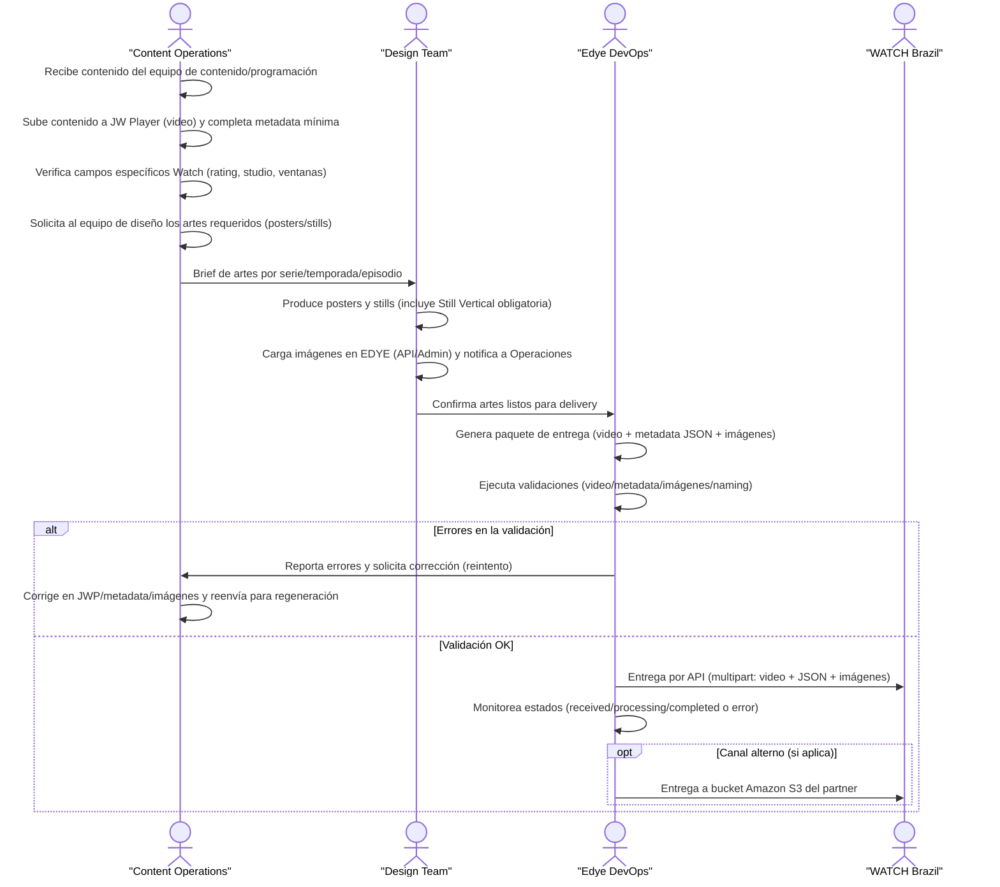

# Anexo de Integración – Ingesta de Contenidos

**Partner:** Watch Brazil  
**Tipo de integración:** Ingesta VOD  
**Estado:** Activo

Este anexo complementa el **flujo genérico de Ingesta EDYE** y define únicamente las
configuraciones específicas requeridas por el partner **Watch Brazil**.  
El flujo operativo, validaciones generales y responsabilidades base se rigen por el
documento de Ingesta estándar.

---

## 1. Flujo de Ingesta – Sky Brazil

El siguiente flujo describe el **proceso end-to-end de ingesta y entrega de contenidos hacia Sky Brazil**, partiendo desde la preparación editorial y técnica en EDYE hasta la validación final del partner.
Este flujo es una **implementación específica del modelo genérico de ingesta**, adaptada a los requisitos técnicos y operativos de Sky.



> **Figura 1.** Diagrama del flujo operativo del partner

# Flujo de Ingesta – Watch Brazil

1. **Recepción del contenido**  
   Content Operations recibe el contenido audiovisual desde programación o proveedores.

2. **Carga en JW Player**  
   El video se carga en JW Player y se completa la metadata mínima, incluyendo los campos específicos requeridos por Watch Brazil.

3. **Solicitud y creación de artes**  
   Content Operations solicita al Design Team los posters y stills; el equipo de diseño produce y carga los artes requeridos.

4. **Confirmación de assets**  
   Una vez cargadas las imágenes, el Design Team notifica a Edye DevOps que los assets están listos para delivery.

5. **Generación del paquete**  
   Edye DevOps consolida el paquete completo de entrega (video, metadata e imágenes).

6. **Validación técnica**  
   Se ejecutan validaciones de video, metadata, imágenes, naming y estructura del delivery.

7. **Correcciones (si aplica)**  
   Si hay errores, se reportan a Content Operations, se corrige el contenido y se regenera el paquete.

8. **Entrega al partner**  
   Con validación exitosa, Edye DevOps entrega el contenido a Watch Brazil (API y, si aplica, Amazon S3) y confirma el cierre del proceso.

---

## 2. Canal de entrega

**Método principal:**

- **API REST (POST multipart/form-data)**

**Métodos alternativos / heredados:**

- FTP con polling (en proceso de desuso)

**Autenticación:**

- Bearer Token

**Endpoint principal:**

```text
POST /api/ingesta/contenido
```

**Formato:**

- Video: MP4 (H.264)
- Metadata: JSON (multipart)

---

## 3. Estructura y naming

### Estructura lógica del delivery

```text
/ingesta/
├── video/
│   └── <content_id>.mp4
├── metadata/
│   └── <content_id>.json
└── images/
	├── poster_horizontal.jpg
	├── poster_vertical.jpg
	├── still_horizontal.jpg
	└── still_vertical.jpg
```

### Reglas de naming

- Un **content_id único** por asset
- Nombres sin espacios
- Solo caracteres ASCII
- Consistencia entre video, metadata e imágenes

---

## 4. Metadata

### Campos obligatorios (JSON)

| Campo                    | Descripción                  |
| ------------------------ | ---------------------------- |
| `title`                  | Título del contenido         |
| `id_cliente`             | Identificador del partner    |
| `rating`                 | Clasificación etaria         |
| `studio`                 | Debe ser **Edye**            |
| `studio_name`            | Debe ser **Edye**            |
| `licensing_window_start` | Fecha + hora (ISO 8601)      |
| `licensing_window_end`   | Fecha + hora (ISO 8601)      |
| `actors_display`         | Lista consolidada de actores |

**Reglas especiales Watch Brazil:**

- El campo `rating` **no acepta valores numéricos simples**
- Debe enviarse como:
  - `A12`, `AL`, `12` o `L`
- `studio` y `studio_name` **deben forzarse a “Edye”**

### Ejemplo JSON mínimo

```json
{
  "title": "Tipo Rato",
  "id_cliente": "watch_br",
  "rating": "L",
  "studio": "Edye",
  "studio_name": "Edye",
  "licensing_window_start": "2025-07-15T00:00:00",
  "licensing_window_end": "2026-07-15T23:59:59",
  "actors_display": "Actor 1, Actor 2, Actor 3"
}
```

---

## 5. Imágenes

### Imágenes requeridas (obligatorias)

| Tipo              | Resolución | Ratio    |
| ----------------- | ---------- | -------- |
| Poster Horizontal | 3840x2160  | 16:9     |
| Poster Vertical   | 1708x2562  | Vertical |
| Still Horizontal  | 3840x2160  | 16:9     |
| Still Vertical    | 1708x2562  | Vertical |

> ⚠️ La imagen **Still Vertical** es obligatoria. Sin este asset, la Still Horizontal será recortada en aplicaciones mobile.

- Watermark: No obligatorio
- Referencia técnica: Specs XML and Images - Edye

---

## 6. Reglas de validación

### Video

- Codec: H.264
- Resolución mínima: 720p
- Duración máxima: 2 horas

### Metadata

- Campos obligatorios completos
- Fechas con timestamp
- Codificación UTF-8 (sin caracteres invisibles rotos)

### Imágenes

- Resoluciones exactas
- Ratio correcto
- Todos los tipos requeridos presentes

---

## 7. Criterios de aceptación (Operaciones)

El delivery se considera **ACEPTADO** cuando:

- El endpoint responde `200 OK`
- Estado final: `completed`
- No existen errores de validación
- Metadata e imágenes coinciden con el video entregado
- QC automatizado sin fallos críticos

Estados posibles: `received`, `processing`, `error`, `completed`

Referencia técnica: ESP-INT Ingesta Watch Brazil

---

## 8. Reintentos y rollback

### Reintento parcial

Se permite cuando:

- Error de metadata
- Error de imágenes
- Corrección sin cambio de video

### Reenvío completo

Requerido cuando:

- Cambia el archivo de video
- Error estructural de naming
- Inconsistencia entre assets

---

## 9. Soporte y escalamiento

### Contactos

- Partner – Watch Brazil: Henrique Weber — henrique.weber@watch.tv.br
- EDYE – Operaciones: Equipo DevOps / Content Operations

### Horario de soporte

- Lunes a Viernes, horario laboral Brasil (BRT)

### Escalamiento

- Operaciones EDYE
- DevOps EDYE
- Contacto técnico Watch Brazil
