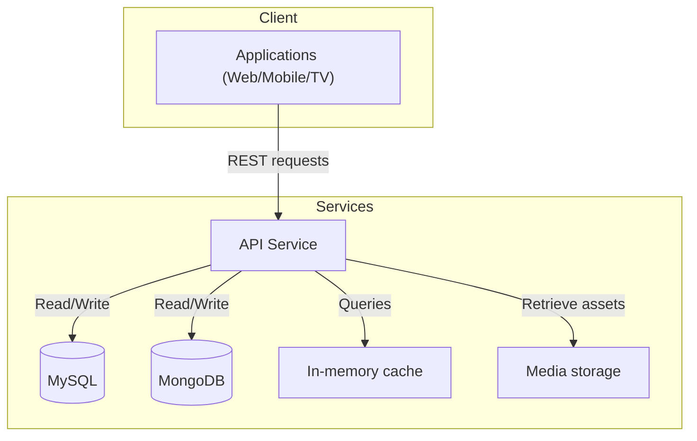

**Version:** 1.0  
**Date:** 12/01/2025

---

## 1. Introduction and Purpose

This document describes the architecture, deployment, and operational practices of the API Service in the EDYE/HITN Digital ecosystem. The service aims to provide a standardized access layer to catalogs of videos, books, and games for both first-party applications (web, mobile, and TV) and distributor integrations. The document targets DevOps, Operations, SRE, and Security teams.

## 2. Functional Description

The API Service is the core communication layer between clients and content resources. Its main functions are:

- **Content exposure:** offers REST endpoints to retrieve lists of series, episodes, books, and games, along with multilingual metadata.
- **Partner authentication:** manages authentication for distributors and end users. The API implements authentication flows for pay-TV providers (MVPD) and for direct platform customers.
- **User and profile management:** allows creating accounts, validating credentials, and managing child and parent profiles.
- **Viewing continuity:** provides endpoints for features like “continue watching” and favorites lists. According to the Coorva study, these features were built on a Node.js/NextJS stack with a MongoDB database.
- **Image and asset processing:** offers resizing and optimization services for client images.

## 3. Architecture and Components

The service is designed as a high-performance microservice in Node.js. The main components are:

| Component                | Description                                                                                                                                                                                                                                                                                                                                                                                |
| ------------------------ | ------------------------------------------------------------------------------------------------------------------------------------------------------------------------------------------------------------------------------------------------------------------------------------------------------------------------------------------------------------------------------------------ |
| **Node.js platform**     | Implemented on Node.js, which employs an event loop for non-blocking I/O operations. This model allows handling many requests simultaneously, which is critical for a content service.                                                                                                                                                                                                      |
| **Framework and controllers** | Uses an HTTP framework (e.g., Express or Fastify) to define REST routes, controllers, and middleware.                                                                                                                                                                                                                                                                                    |
| **Databases**            | 1) **MySQL** for relational data such as user accounts, title metadata, and their relationships. MySQL is recognized for reliability and ACID support. 2) **MongoDB** for semi-structured data related to viewing continuity (playlists, favorites). Laravel supports MongoDB through an official package, easing integration with other services.                                                |
| **Cache services**       | Uses in-memory cache (e.g., Redis) to store frequent responses and reduce latency.                                                                                                                                                                                                                                                                                                         |
| **External services**    | Interacts with storage services to obtain media assets and with the subscription service to validate access licenses.                                                                                                                                                                                                                                                                        |

### 3.1. Architecture Diagram

> **Figure 1.** _Architecture Diagram_

This diagram summarizes the main interaction between clients, databases, and supporting services.

## 4. Deployment Model

The service is managed via CI/CD pipelines that ensure code integrity and deployment reliability:

- **Version control:** source code is stored in a Git repository with branches for development, staging, and production.
- **Build and tests:** when changes are made, unit and integration tests run to validate routes, error handling, and database compatibility.
- **Containerization:** the application is packaged into a container image. Configuration variables (ports, database credentials, external service keys) are injected as environment variables.
- **Deployment:** images are published to development, staging, and production environments. The orchestrator handles horizontal scaling and load balancing. Updates are performed via rolling deployments to avoid downtime.

## 5. Monitoring and Observability

The following practices are instrumented:

- **Technical metrics:** request latency, throughput (requests per second), percentage of 4xx and 5xx errors, CPU/memory utilization, and database connectivity.
- **Logs:** Node.js generates structured logs with severity level and request traces (correlated IDs). Logs are collected in a centralized service for analysis and auditing.
- **Distributed traces:** instrumentation is implemented to associate each request with an identifier that propagates to associated services (Cloud, Billing, Play). This facilitates tracking errors across the service chain.
- **Alerts:** alerts are configured based on metrics (e.g., high latency, database errors) that notify the SRE team via corporate messaging systems.

## 6. Security and Access

Security is a priority in the API design:

- **Authentication and authorization:** authorization standards with signed tokens (for example, JWT) and scope-based access control are implemented. Distributors use specific authentication flows (OAuth 2.0) to validate their credentials.
- **Encrypted communications:** all interactions occur over HTTPS/TLS. Encrypted tunnels are used for database connections.
- **Abuse protection:** rate limiting and request validation are applied to mitigate brute-force and denial-of-service attacks.
- **Secret management:** credentials and API keys are stored in secret managers and rotated periodically.

## Operational Continuity

To ensure an available and resilient service, the following apply:

- **Horizontal scaling:** multiple API replicas run behind load balancing. This absorbs traffic spikes associated with events or premieres.
- **Replication and backups:** the MySQL database replicates to secondary nodes and regular backups are scheduled. Data in MongoDB is replicated in clusters with built-in replication.
- **Failover:** automatic failover procedures are defined for application node or database failures. Containers monitor their state and restart upon crashes.
- **Resilience tests:** controlled node-failure and saturation drills are performed to validate recovery capacity.

## 7. Dependencies and Communication

The API interacts with various services in the ecosystem:

- **Admin Service:** receives metadata updates and notifies completed operations. Admin is the source of most catalog changes.
- **Billing Service:** checks subscription and access rights before delivering premium content.
- **Cloud Service:** obtains asset URLs (videos, images, books) and manages access signatures.
- **Play/Applications Service:** end clients consume the API to present content to users.
- **Connect Service:** provides authorization tokens when authentication is performed through external distributors.

Each integration uses versioned API contracts to maintain compatibility and traceability.
