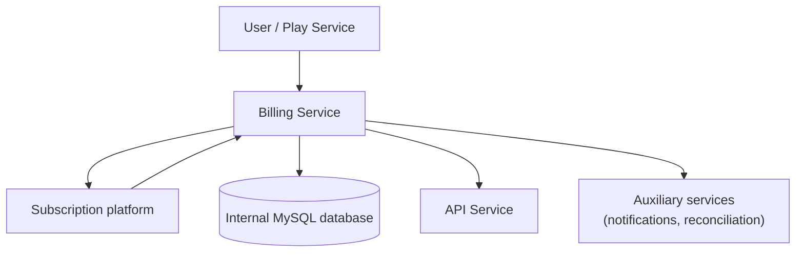

**Version:** 1.0  
**Date:** 12/01/2025

---

## 1. Introduction and Purpose

The Billing Service is responsible for managing subscriptions and transactions within the EDYE/HITN Digital platform. Its objective is to ensure that only users with active plans or valid entitlements can access premium content, manage billing, and provide payment information for different modules. This document details the infrastructure components and operational processes for DevOps, Operations, SRE, and Security teams.

## 2. Functional Description

The main functions of the service are:

- **Paywall management:** controls access to restricted content through a paywall. Per paywall system descriptions, this mechanism requires visitors to provide data (email) or subscribe before accessing.
- **Subscription management:** keeps an updated record of plans, billing cycles, and each subscriber's status. The subscription software manages payment information, rate changes, and transactions such as refunds.
- **Payment processing:** integrates the platform with an external payment provider to authorize charges and store payment tokens. Sensitive data is not stored in internal systems.
- **Access control:** issues access tokens and checks a user's subscription status before allowing content playback. This control is coordinated with the API service and the playback front end.
- **Reporting and reconciliation:** generates reports for business areas (revenue, cancellations) and facilitates reconciliation with payment providers.

## 3. Architecture and Components

The Billing Service consists of the following elements:

| Component             | Description                                                                                                                                                                                                  |
| --------------------- | ------------------------------------------------------------------------------------------------------------------------------------------------------------------------------------------------------------ |
| Payment interface     | API that exposes subscription, cancellation, and renewal operations. The interface is based on Node.js/Express to orchestrate flows and communicate with external services.                                  |
| Subscription provider | The platform uses a third-party service specialized in paywall and subscription management to maintain customer information. This provider offers tools to create plans, update prices, and process changes. |
| Internal database     | Stores non-sensitive information such as customer IDs, change history, and correlations with EDYE users. MySQL is used for its reliability and ACID support.                                                 |
| Auxiliary services    | Include a notification service to send emails about renewals and expirations, and a reconciliation service to compare internal records with payment provider reports.                                        |

### 3.1. Architecture Diagram

> **Figure 1.** _Architecture Diagram_

## 4. General Flow

1. The user starts a subscription process from the front end (web or app). The interface requests minimal information (email and desired plan). The paywall requires subscription to access content.
2. Payment information is sent to the external subscription platform, which processes the charge and returns an authorized payment token.
3. The Billing Service stores a record of the user and token, updates their status to active, and notifies the API to enable access.
4. For each content API request, it consults the Billing Service to validate that the subscription is current before delivering the resource.
5. In case of cancellation or expiration, the status is updated and corresponding permissions are revoked.

## 5. Deployment Model

The service code resides in a version-controlled repository. The CI/CD pipeline includes:

- **Testing and validation:** unit tests verify renewal date logic, token verification, and communication with the external provider.
- **Packaging:** a container image is built with the application, and sensitive variables are managed via deployment secrets.
- **Deployment:** the image is deployed to development, staging, and production environments. Replicas are used for high availability, and auto-scaling is configured based on CPU consumption and transaction count.
- **Integration with external services:** API keys and certificates are registered for secure connection to the subscription provider.

## 6. Monitoring and Observability

To ensure a reliable service, the following are monitored:

- **Business indicators:** number of active subscriptions, cancellations, monthly recurring revenue (MRR), payment failures.
- **Technical indicators:** latency of requests to the external platform, API response times, 4xx/5xx error ratio, CPU and memory utilization.
- **Logs:** subscription events (sign-ups, renewals, cancellations) are recorded and sent to a centralized system. Sensitive data is filtered to comply with data protection regulations.
- **Alerts:** thresholds are configured (e.g., payment failure rate above 2%) that trigger notifications to the operations team.

## 7. Security and Access

Handling payment data requires strict measures:

- **PCI DSS compliance:** card processing is delegated to the payment provider, avoiding storage of financial information in our systems. Communications with the provider are performed over TLS.
- **Authentication and authorization:** subscription creation, cancellation, and renewal operations are protected via user authentication and session tokens. Only the API and applications with valid permissions can invoke internal endpoints.
- **Encryption:** communications between the Billing Service and other services (API, Play) are encrypted in transit. Transaction identifiers are also masked in logs.
- **Retention policies:** subscription data is retained for the minimum time necessary to meet legal obligations and securely deleted afterward.

## 8. Operational Continuity

The service is designed to be resilient to failures:

- **High availability:** multiple replicas run in different availability zones. Losing one instance does not impact payment processing capacity.
- **Backups and replication:** the internal database is backed up regularly. Critical data such as subscription tokens can be reconstructed from the external provider in case of failure.
- **Retry mechanisms:** requests to the external platform implement retries with exponential backoff to handle temporary failures.
- **Contingency plans:** procedures are documented to temporarily suspend billing during critical incidents and resume it once resolved.

## 9. Dependencies and Communication

The main service integrations are:

- **Content API:** checks subscription status on each premium resource request. Communication occurs through authenticated internal endpoints.
- **External payment platform:** used to manage subscriptions, process charges, and issue access tokens. Financial information is not stored in EDYE systems.
- **Play Service:** during the subscription flow, the playback app redirects the user to the Billing Service to complete purchase, then obtains the authorization token.
- **Admin Service:** allows operators to review distributor account status and their permissions for premium content access.

All communications use versioned API contracts and are secured with access keys and certificates to guarantee data confidentiality and integrity.
