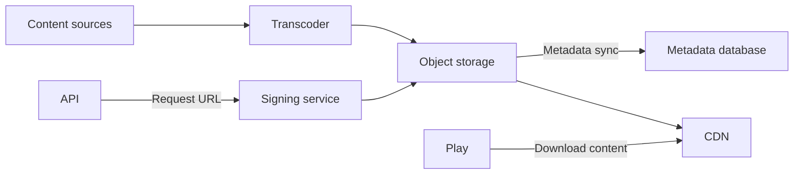

**Version:** 1.0  
**Date:** 12/01/2025

---
# Cloud Service

## Introduction and Purpose

The Cloud Service provides the storage and content delivery infrastructure in the EDYE/HITN Digital ecosystem. Its role is to store videos, audio, images, books, and game files, and deliver them efficiently and securely to end users and other internal services. This document details its architecture, deployment processes, observability, and security controls.

## Functional Description

The service's main responsibilities are:

- **Asset storage:** persistently stores all multimedia catalog items (videos at different bitrates, covers, e-books, and games). It uses a scalable, distributed object storage service with versioning and geographic replication.
- **Processing and conversion:** integrates pipelines to transcode videos to different resolutions and adaptive formats. It also generates thumbnails and optimized images for use by the Play service.
- **Distribution via CDN:** delivers content to end users through a content delivery network (CDN) that minimizes latency and improves the streaming experience.
- **File metadata management:** maintains an internal asset catalog with tags, versions, and expiration policies. This catalog synchronizes with the API and Admin services.
- **Secure delivery:** provides signed URLs with expiration to protect access and control download link lifetime.

## Architecture and Components

The Cloud Service is composed of several layers:

| Component                  | Description                                                                                                                                                                                                                     |
| -------------------------- | ------------------------------------------------------------------------------------------------------------------------------------------------------------------------------------------------------------------------------- |
| Object storage             | Distributed storage system that stores objects of any size. Supports replication across multiple zones for high availability and durability.                                                                                    |
| Transcoder                 | Engine that ingests source files and generates versions adapted for streaming (HLS/DASH). It also produces thumbnails and resized images used by the Admin and Play services.                                                    |
| CDN                        | Global network that caches asset copies to reduce latency in delivery to end users. Configures cache policies, invalidation, and protection against mass downloads.                                                             |
| Signing service            | Component that generates temporary signatures and access tokens so content is only accessible with valid permissions.                                                                                                            |
| Metadata database          | Stores information associated with each file: physical location, versions, transcoding status, and relationships to catalog titles.                                                                                              |

### Architecture Diagram

## Deployment Model

The service is deployed following infrastructure-as-code practices and automated pipelines:

- **Provisioning:** storage, transcoding, and CDN resources are defined via templates (e.g., Terraform or CloudFormation) and deployed in the public cloud.
- **CI/CD:** automation scripts are updated and executed in pipelines that validate syntax, simulate deployments, and apply changes in development, staging, and production environments.
- **Microservice deployment:** the signing service and metadata catalog are containerized. They are deployed on clusters with horizontal scaling and load balancing.
- **Asset versioning:** changes to transcoding configurations and CDN policies are versioned and published through the same automation tools.

## Monitoring and Observability

To ensure distribution quality and availability, the following are monitored:

- **Storage metrics:** used capacity, read/write rate, access errors.
- **Transcoding metrics:** processing time per file, number of queued jobs, and conversion failures.
- **CDN performance:** latency, cache hit rate, number of requests served, and geographic traffic distribution.
- **Logs:** object access, signed URL generation, and transcoding operations are logged. These records are stored in a central system for auditing and anomaly detection.
- **Alerts:** thresholds are configured (e.g., storage utilization at 80%, persistent transcoding failures) that trigger alerts to the SRE team.

## Security and Access

Because it handles protected content, strict security controls are applied:

- **Access controls:** storage buckets are configured with policies that restrict access to authenticated services. Only the API and Play services can request signed URLs.
- **Encryption:** objects are encrypted at rest and in transit. Managed keys are used and rotated periodically.
- **Signed URLs:** each download link includes a signature generated by the signing service that limits temporal validity and the IP allowed to use it. This prevents unauthorized redistribution.
- **Integrity validation:** checksums are computed when uploading and delivering files to detect corruption.

## Operational Continuity

Resilience practices include:

- **Geographic replication:** objects are replicated across multiple regions to protect against regional failures.
- **Backups:** although object storage offers high durability, periodic backups of metadata and transcoding configurations are generated.
- **Failover strategies:** alternative routes in the CDN and policies for switching to secondary regions are configured for severe incidents.
- **Recovery tests:** scheduled restoration and failover drills are conducted to verify target recovery times.

## Dependencies and Communication

The Cloud Service interacts with the following modules:

- **API Service:** requests creation of signed URLs to allow file access. It also updates the metadata catalog when new assets are uploaded or transcodings are completed.
- **Admin Service:** uploads new images and triggers cover conversions. Retrieves thumbnail views for display in the admin panel.
- **Play Service:** consumes signed URLs to play videos, display covers, and download books or games.
- **Satellite Service:** obtains files related to playlists and tracking items to synchronize user progress.

These interactions are managed through internal APIs, ensuring access control and traceability for each operation.
