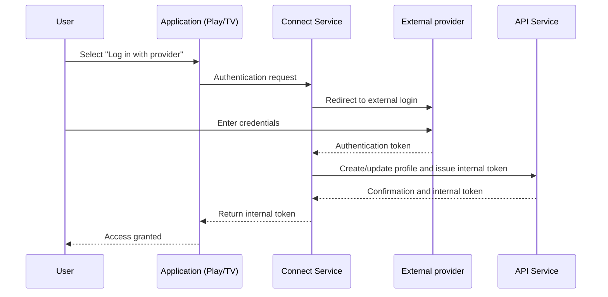

**Version:** 1.0  
**Date:** 12/01/2025  

---

# Connect Service (Conecta)

## Introduction and Purpose

The Connect Service, also known as Conecta, is the component responsible for authenticating users who access EDYE/HITN Digital through external distributors (for example, pay TV providers). This document offers a technical description of its infrastructure and operational procedures for DevOps, SRE, Operations, and Security teams.

## Functional Description

The key functions of the service are:

- **Integration with external providers:** implements authentication flows (TV Everywhere) that allow distributor subscribers to identify with their external credentials and obtain content permissions.
- **Session management:** once authentication with the provider is completed, it issues internal tokens used to access other services. These tokens include information about viewing rights, expiration, and user identifier.
- **Profile synchronization:** creates or updates local profiles (in the API service) based on information returned by the distributor and links them to the existing viewing history.
- **Multiplatform compatibility:** the service is used by web, mobile, and TV applications to redirect the user to the provider's authentication flow and retrieve the result transparently.

## Architecture and Components

The service is implemented as a microservice focused on external integrations. Components include:

| Component               | Description |
|-------------------------|-------------|
| Authentication gateway  | API service that exposes endpoints to start and complete the authentication flow. It encapsulates distributor-specific logic (redirects, parameters, and response handling). |
| Provider modules        | Each TV provider is managed through a module that implements the agreed authentication protocol (OAuth 2.0, SAML, or others). Modules encapsulate specific endpoints, scopes, and parameters. |
| Session database        | Stores temporary tokens and intermediate states. A fast database (e.g., Redis or MySQL) is used to correlate the initial request with the provider's response. |
| API integration         | Once the user is authenticated, the service informs the API to create or update the profile, including the permissions obtained. |
| TV frontend             | Some flows are implemented as web pages adapted to TV devices, developed in Laravel/Next JS for compatibility with embedded browsers. |

### Sequence Diagram

## Deployment Model

The service is deployed as an independent microservice with the following practices:

- **Repositories and versioning:** source code is separated by provider modules, allowing updates without affecting others. Versions are tagged, and integration contracts are maintained with each distributor.
- **CI/CD pipelines:** when adding a new provider or updating a module, integration tests simulate authentication flows. The resulting container image is deployed to development, staging, and production environments.
- **Dynamic configuration:** endpoints and parameters for each provider are managed through configuration files or databases that can be reloaded without deploying code.
- **Scaling:** replicas are configured to absorb spikes when live events generate massive authentications.

## Monitoring and Observability

To ensure reliability and detect issues with external providers, the following are monitored:

- **Authentication rate:** number of flows started, completed, and failed per provider.
- **Authentication time:** average time from flow start to internal token issuance. An increase may indicate provider issues.
- **Specific errors:** logging of error codes returned by providers for analysis and communication with them.
- **Audit logs:** incoming and outgoing requests are logged, ensuring credentials are not stored. These logs allow tracking user incidents and detecting anomalous behavior.
- **Alerts:** configured for massive authentication failures or unavailability of any provider.

## Security and Access

The service handles sensitive tokens and credentials, so it applies strict measures:

- **Token protection:** provider tokens are kept in memory for the minimum necessary time and encrypted before being stored temporarily.
- **Encrypted communications:** all interactions with providers and the API occur over HTTPS/TLS.
- **Response validation:** the signature and integrity of tokens returned by providers are validated. Only responses from authorized domains are accepted.
- **Least-privilege policy:** internal tokens generated contain only the information necessary to identify the user and their permissions. They expire quickly to limit misuse risk.
- **Compliance:** child privacy requirements are met, and the amount of personal data received from distributors is limited.

## Operational Continuity

Service resilience is ensured through:

- **High availability:** multiple instances run in different zones. Health checks are used to remove degraded instances.
- **Provider failover:** if an external provider is down, a clear error message is shown to the user and the support team is informed to activate alternative channels if they exist.
- **Configuration backups:** provider configurations (endpoints, keys) are backed up and managed through centralized configuration systems.
- **Periodic tests:** automated tests simulate authentications to detect unexpected changes in distributor flows.

## Dependencies and Communication

The Connect Service interacts with:

- **External providers:** uses standard protocols (OAuth 2.0, SAML) to redirect users and exchange authentication tokens. Specific configurations are kept up to date for each provider.
- **API Service:** once the provider token is obtained, it communicates with the API to create or update profiles and obtain an internal token. This communication is authenticated and traced for audit purposes.
- **Billing Service:** checks the subscription status of users authenticated through distributors to verify that their plan is active before granting access.
- **Play Service:** sends the internal token back to the application, allowing session start in the user interface.

Communications use internal API contracts and are monitored to ensure compliance with agreements with distributors.

