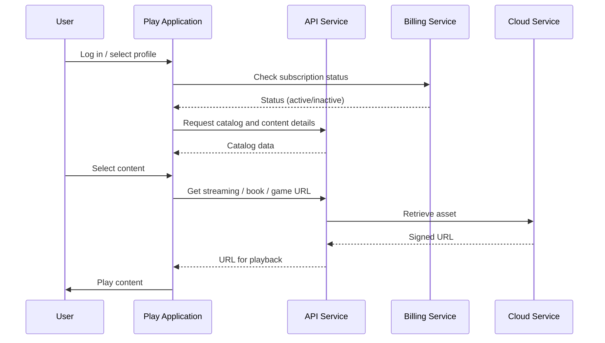

**Version:** 1.0  
**Date:** 12/01/2025

---

## Introduction and Purpose

The Play Service is the entry point for end users to the audiovisual and games catalog of EDYE/HITN Digital. It includes web and mobile applications that enable streaming playback, access to interactive books and educational games, and management of profiles and preferences. This document describes the service's infrastructure from an operational and security perspective.

## Functional Description

Key functions of the service include:

- **Content playback:** delivers streaming video, games, and books. It uses an integrated video player and a lightweight game engine in the browser or app.
- **User interface:** the application is built with Next JS (React-based) to provide an interactive, responsive experience. The platform combines server-generated pages and client-rendered components.
- **Profile management:** allows creating child profiles with age limits and parental controls. Profiles determine available categories and store viewing progress.
- **API interaction:** consumes API service endpoints to obtain catalogs, program details, and recommendations. It also sends “continue watching” and favorites events to save state.
- **Multi-device support:** designed to work on modern browsers, mobile apps, and smart TVs, ensuring users can continue playback across devices. The API infrastructure provides multi-device authentication.

## Architecture and Components

| Component                 | Description                                                                                                                                                                                                                                                   |
| ------------------------- | ------------------------------------------------------------------------------------------------------------------------------------------------------------------------------------------------------------------------------------------------------------- |
| Frontend (Next JS)        | The playback application is built in Next JS, leveraging its hybrid rendering capabilities and React integration. Next JS uses Node.js as the server-side runtime, benefiting from the non-blocking I/O model.                                                  |
| Service backend           | An intermediate Node.js layer orchestrates communication with the API service, handles sessions, and applies local caching.                                                                                                                                     |
| Playback engine           | Uses a video player compatible with security and parental control requirements. The player retrieves streaming URLs via the API and manages DRM and subtitles.                                                                                                |
| Games and books manager   | Loads HTML5 games and interactive books from the Cloud service.                                                                                                                                                                                                |
| Local database            | On mobile devices, local storage (IndexedDB or SQLite) is used to cache progress and allow limited offline playback.                                                                                                                                            |

### Flow Diagram

> **Figure 1.** _Flow Diagram_

## Deployment Model

The Play Service is deployed as a combination of web and mobile applications:

- **Web:** Next JS code is compiled and generates static artifacts distributed over a content delivery network (CDN). The server layer (Next JS API Routes) is deployed in containers or serverless functions.
- **Mobile:** the app is packaged using native or hybrid frameworks (e.g., React Native). It is published to app stores following coordinated release cycles.
- **TV/Consoles:** specific apps are developed using TV platform SDKs. These apps consume the same API endpoints.
- **CI/CD:** automated pipelines run UI tests, linters, and device emulators to validate the experience. Configuration variables (API URLs, player keys, etc.) are managed via environment files and secret services.

## Monitoring and Observability

To track application performance and stability, the following are monitored:

- **Frontend metrics:** page load times, initial playback latency, interrupted playback rate, and bandwidth consumption.
- **Backend metrics:** response time of Play application endpoints, cache utilization, and error rates.
- **User telemetry:** usage events (login, playback, pauses) are collected anonymously for analysis. This telemetry helps improve the experience but is managed according to child privacy regulations.
- **Logs and traces:** application logs are aggregated to detect rendering failures, exceptions, and integration issues with the API.
- **Alerts:** alerts are generated for availability drops, high start-playback times, and errors in the subscription flow.

## Security and Access

The Play Service must protect children's identity and content integrity:

- **Authentication:** uses tokens generated by the API service to validate sessions. Tokens have short expirations and are renewed with silent mechanisms.
- **Parental control:** implements a “parent gate” requiring a PIN or other verification mechanism to access administrative functions or unlock sensitive content.
- **Encryption:** connections use HTTPS/TLS. The video player uses end-to-end encryption and DRM to prevent unauthorized downloads.
- **Data protection:** local storage is minimized and telemetry is anonymized. Child profile data is not shared with third parties.

## Operational Continuity

To ensure application availability:

- **CDN and scaling:** static artifacts are replicated in a global CDN to reduce latency. The backend service scales automatically based on demand.
- **Offline mode:** on mobile devices, selected episodes can be downloaded. Progress syncs when the connection returns.
- **Store monitoring:** app store status is monitored to quickly detect distribution or approval failures.
- **Contingency plan:** procedures are established to pull defective versions, perform rollbacks, and communicate critical updates to users.

## Dependencies and Communication

The main interactions of the Play Service are:

- **API Service:** to obtain catalogs, metadata, playback URLs, and send state events.
- **Billing Service:** to verify subscriptions before playing premium content. The payment flow is routed to the Billing Service.
- **Cloud Service:** to download video, audio, book, and game files. Delivery is via signed, temporary URLs.
- **Satellite Service:** to synchronize “continue watching” and favorites when the user moves between devices.

The modular design of these communications facilitates independent updates to each service without affecting the user experience.
