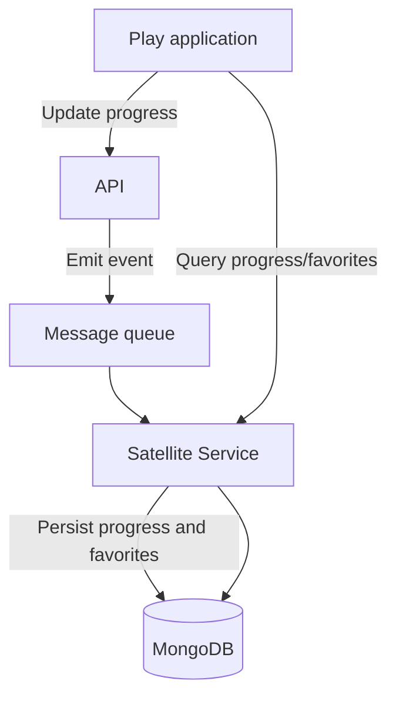

**Version:** 1.0  
**Date:** 12/01/2025

---
# Satellite Service

## 1. Introduction and Purpose

The Satellite Service provides persistence and synchronization of user consumption state within the EDYE/HITN Digital ecosystem. It is aimed at storing and sharing data such as playback position (“continue watching”), favorites lists, and personalized preferences across different devices. This document details its technical design and operation.

## 2. Functional Description

The service performs the following functions:

- **Progress persistence:** stores each user's playback position per title so that when switching devices they can resume where they left off.
- **Favorites and lists management:** allows users to mark shows, books, or games as favorites and group them into custom lists. This information syncs with the main API.
- **Multi-device synchronization:** centralizes information so the Play application can retrieve progress and favorites regardless of where they were generated.
- **Query interface:** exposes endpoints for clients to query and update their consumption state. These endpoints are protected by authentication and authorize only the owning user.

## 3. Architecture and Components

| Component                    | Description                                                                                                                                                                                                                                                                                                                                                                                            |
| ---------------------------- | ------------------------------------------------------------------------------------------------------------------------------------------------------------------------------------------------------------------------------------------------------------------------------------------------------------------------------------------------------------------------------------------------------ |
| Node.js/NextJS server        | The core of the service is implemented with Node.js and NextJS, leveraging its asynchronous nature to handle numerous state update requests.                                                                                                                                                                                                                     |
| NoSQL database (MongoDB)     | A document-oriented database stores flexible structures for progress and lists. MongoDB offers dynamic schema and horizontal scalability, making it suitable for semi-structured data like playlists and favorites. Laravel and other frameworks natively support MongoDB through official packages.                                                                                                          |
| Synchronization service      | Subsystem that listens to events from the API and Play application to update records. It ensures eventual consistency between local caches and the central database.                                                                                                                                                                                                                                    |
| Message queue                | Manages asynchronous events (e.g., end of playback, favorite marked) to decouple the client application from the persistence process.                                                                                                                                                                                                                                                                 |

### 3.1. Architecture Diagram

## 4. Deployment Model

The service is built and distributed through CI/CD processes:

- **Repository and dependency management:** the source code (Node.js/NextJS) is maintained in a Git repository. Dependencies are managed via package managers (npm/yarn) and updated through periodic reviews.
- **Testing:** unit and integration tests validate correct update and query of data in MongoDB, as well as event handling.
- **Containerization and deployment:** the application is packaged into containers. Deployment is performed in a microservices cluster with automatic horizontal scaling. Configuration variables (API URLs, MongoDB connection) are provided through configuration services.
- **Event queues:** the service subscribes to message queues configured in a messaging system (for example, RabbitMQ, Kafka) deployed as a shared service.

## 5. Monitoring and Observability

Proper operation of Satellite is monitored through:

- **Synchronization metrics:** number of events processed per minute, event processing latency, and failure rate in MongoDB updates.
- **Resource usage:** monitoring of CPU, memory, and open database connections. Limits are tuned in the orchestrator to avoid saturation.
- **Logs:** update actions, conflicts, and deserialization errors are recorded. These logs are centrally stored for auditing and support.
- **Alerts:** thresholds are configured to detect growing message queues, database errors, and high synchronization times.

## 6. Security and Access

The service handles user data related to their consumption and preferences. The following measures apply:

- **Authentication:** each request must include a valid token issued by the API service. Satellite verifies the token before processing updates or queries.
- **Authorization:** it ensures a user can only access and modify their own progress and lists. User identifiers are extracted from the token and checked against stored data.
- **Encryption:** communications between Satellite, the API, and the database travel over encrypted connections. Data in the database is encrypted at rest.
- **Retention policy:** progress data is retained for a defined period and purged periodically to comply with data protection regulations.

## 7. Operational Continuity

To guarantee a smooth experience across all platforms:

- **Horizontal scaling:** multiple service replicas are deployed and the MongoDB database is configured as a replica set for high availability.
- **Queue persistence:** the messaging system retains events until they are processed correctly. This ensures updates are not lost during incidents.
- **Backups:** regular backups of the database are performed. Procedures to restore progress data in case of loss are documented.
- **Resilience tests:** load and stress tests simulate event spikes to validate the service maintains acceptable latency.

## 8. Dependencies and Communication

The Satellite Service integrates with:

- **API Service:** receives update events and sends requests to validate user identity. It also exposes endpoints to which the API delegates retrieval of progress and favorites.
- **Play Service:** clients directly consume Satellite endpoints to retrieve their progress. They also send update events that are routed through the API.
- **Queue service:** relies on a messaging queue to decouple event generation from processing, enabling handling of high update volumes.
- **Billing Service:** does not interact directly but relies on API subscription validation to allow storing progress only for users with active plans.

Communication between services is designed to be idempotent, ensuring eventual data consistency across the ecosystem.
