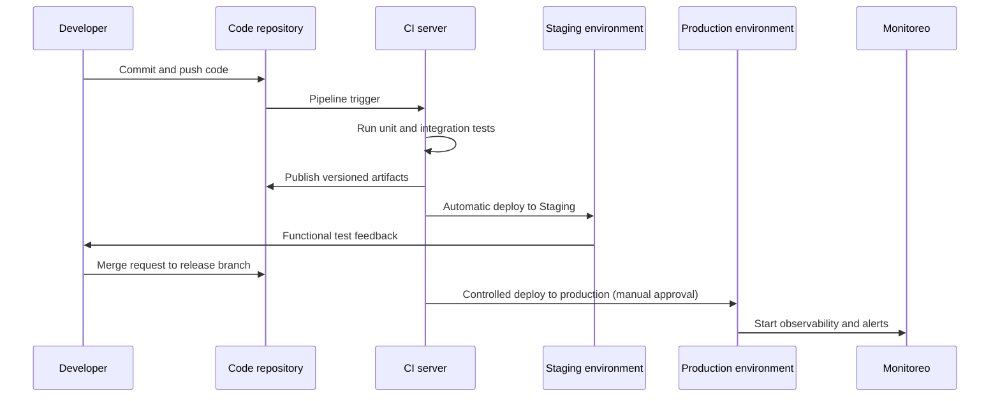
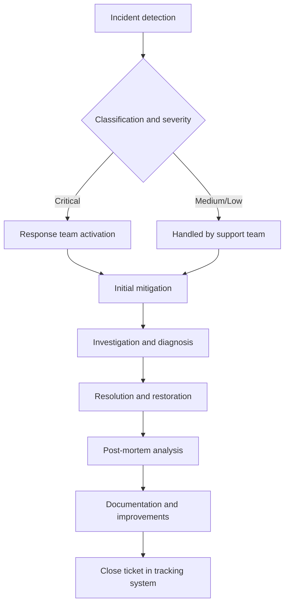

**Version:** 1.0  
**Date:** 12/01/2025  

---

## 1. Introduction and Purpose

This document describes, in a structured and auditable manner, the technological infrastructure that supports the **EDYE** platform of **HITN Digital**. Its purpose is to provide the **DevOps**, **Operations**, **SRE** (Site Reliability Engineering), and **Security** teams with a unified corporate reference on environment architecture, infrastructure components, deployment models, monitoring and observability mechanisms, as well as security and operational continuity practices.

## 2. Infrastructure Scope

The documentation covers the EDYE ecosystem as a whole and therefore includes the following main elements:

- **Hosting and network infrastructure:** cloud providers, regions, and primary and secondary data centers.
- **Segregated environments:** local, staging, and production environments with their respective components and deployment flows.
- **Core services:** application modules (Admin, API, Billing, Play, Cloud, Connect/Conecta, Satellite) and supporting elements (cache, databases, web servers).
- **Base technologies:** frameworks and languages used (Node.js and its processes managed by a V8 engine, Laravel framework based on the MVC pattern, MySQL and MongoDB database engines, Nginx web servers for load balancing and caching, and process managers such as PM2). Only components that are part of the actual EDYE ecosystem are included.
- **CI/CD and automated deployments:** continuous integration and deployment tools and processes that enable agile, controlled delivery.
- **Monitoring and observability:** metrics, logs, and traces that allow evaluating system health, alerts, and visualization dashboards.
- **Security and access:** access control, credential management, and adherence to best practices.
- **Operational continuity and backups:** backup strategies, high availability, and recovery procedures.

## 3. General Architecture of the Ecosystem

The EDYE ecosystem is organized in a modular architecture composed of back-end and front-end services that communicate via APIs and message queues. Services are deployed on virtual instances or containers within data centers in the United States (primary) and a secondary site for contingencies. The content delivery layer relies on a global CDN provider to optimize distribution to end users.

> **Figure 1.** General ecosystem architecture - Production

> **Figure 2.** General ecosystem architecture - Staging

### 3.1. Architecture Description

- **Delivery layer:** a global CDN handles distribution of video and static content, minimizing latency to users. The cache layer (based on in-memory storage services) stores frequent responses to reduce load on backend services.

- **Business services:** the **API**, **Admin**, **Billing**, **Play**, **Cloud**, and **Conecta** modules represent independent services encapsulating specific functionality. Services written in **Node.js** use the **V8** engine to run server-side JavaScript and employ **PM2** as a process manager to ensure continuous availability. The **Admin** service is implemented with **Laravel**, a **PHP** framework that follows the model–view–controller pattern.

- **Data layers:** relational **MySQL** databases, a common component of the **LAMP** stack, store transactions and structured data. **MongoDB** is used for unstructured or semi-structured information; it is a document-oriented **NoSQL** database that uses JSON-like documents with optional schemas.

- **Replicated environments:** core services are replicated in separate environments (Staging and Local) for testing and validation before promoting changes to production. These environments are isolated and do not share sensitive data with production.

## 4. Environments and Segregation (Local / Staging / Production)

The EDYE platform operates under an environment segregation model to ensure the software lifecycle proceeds in a controlled manner and changes are properly tested before impacting end users.

### 4.3. Local Environment

The local environment corresponds to developer workstations. Each developer has a lightweight replica of the services needed to code and validate changes. Containers or virtual machines are used to simulate the database, cache, and internal services. Source code is managed through a version control system (e.g., Git) and integrated with the CI platform for automated test execution.

### 4.4. Staging Environment

The staging environment mirrors production architecture at smaller scale. All release branches that pass continuous integration validation are deployed here. Databases are initialized with anonymized or synthetic data to allow functional and performance testing without compromising user information. This environment is used for acceptance tests and to validate integrations with external services before promotion.

### 4.5. Production Environment

The production environment hosts the active EDYE instance accessible to users. It is distributed across at least two geographically separated data centers to provide high availability and fault tolerance. User traffic is distributed through load balancers and the CDN layer, which route requests to the nearest active site. Databases and critical services implement synchronous or asynchronous replicas between regions so that a data center failure can be resolved with controlled failover. Configuration and deployment policies are enforced strictly to ensure stability.

## 5. Server and Hosting Infrastructure

EDYE runs on a cloud computing platform with US data centers acting as primary and secondary. Each data center hosts groups of instances running the services described above. The infrastructure relies on containerization technologies or virtual machines that enable horizontal scalability.

Data centers: at least two geographic locations are used—a primary center (for example, in the central US region) and a secondary center (on the east coast or another region). This allows load balancing and ensures operational continuity in case of disaster.

Application servers: Node.js and Laravel instances are deployed in server groups managed by HTTP load balancers (Nginx) that distribute requests and apply cache policies. Nginx also acts as a reverse proxy and high-performance content server
nginx.org
.

Cache layer: in-memory solutions (Redis or Memcached) store temporary data and improve service response times. The cache layer is replicated to avoid single points of failure and its memory usage is monitored.

Object storage: the Cloud service integrates object storage (S3-compatible) to host media files, images, and documents. This storage is replicated across multiple regions and integrated with the CDN for distribution.

Databases: MySQL databases are deployed in master–replica clusters with synchronous replication to guarantee consistency. MongoDB is configured in replica sets to provide high availability and supports sharding when horizontal scales are required
en.wikipedia.org
.

## 6. Deployment Architecture (CI/CD)

The platform uses a continuous integration and continuous deployment (CI/CD) flow that automates software build, testing, and release. The general flow is as follows:

Commit and version control: Developers update code in the repository. Feature branches and merge requests are used for peer review.

CI pipeline: A CI server runs automated tests (unit, integration, and static) on each commit. If tests fail, the pipeline is marked as failed.

Build and versioning: After tests pass, the pipeline packages artifacts (for example, containers) and publishes them to a private registry with semantic tagging.

Staging deployment: Artifacts are automatically deployed to the staging environment for functional and performance validation. Database migrations are automated and service health is monitored.

Production approval and deployment: A manual (gated) step lets an operations owner approve deployment to production. Deployment is performed gradually using strategies such as blue/green or canary to minimize risk.

Post-deployment observability: After deployment, key metrics are monitored and alerts enabled to detect regressions.

## 7. Process and Service Management

The EDYE platform is composed of services running as independent processes, orchestrated and monitored to ensure availability and performance.

Process management for Node.js: PM2 is used, a production process manager that keeps Node.js applications online 24/7
pm2.keymetrics.io
. PM2 offers clustering, zero-downtime reloads, and built-in monitoring.

PHP/Laravel service management: Laravel-based services are deployed via PHP-FPM behind Nginx or Apache. Process pools are configured and performance and security parameters are tuned.

Load balancing and reverse proxy: Nginx acts as a reverse proxy, load balancer, and content server, recognized for high performance and low resource usage
nginx.org
. Upstream groups with health checks are configured and cache rules are implemented at the proxy layer.

Auxiliary services: The infrastructure includes additional services such as message queues (for example, RabbitMQ or SQS) to decouple processes, and an email delivery system for notifications. Exact details match the current implementation.

## 8. Monitoring and Observability

Observability is key to ensuring reliability of the EDYE ecosystem. The platform implements tools and practices to collect metrics, logs, and distributed traces.

Infrastructure metrics: CPU, memory, disk, and network utilization metrics are collected for each instance. Agents export these metrics to a centralized system for dashboard visualization and alerting.

Service monitoring: Services expose health and metrics endpoints (for example, Prometheus metrics or equivalents). Latency, throughput, and error percentage are monitored.

Centralized logs: All services send logs to a centralized logging system (ELK/Graylog or another solution) where they are indexed and can be queried. A common log format is defined to ease analysis.

Alerts and notifications: Alerts are configured based on thresholds and anomalies; notifications are sent to corporate messaging channels or ticketing systems.

Distributed traces: Microservice-based services adopt tracing solutions (for example, OpenTelemetry) to correlate requests across services and detect bottlenecks.

## 9. Security and Access Control

Security is addressed cross-cutting across the architecture. Key measures implemented include:

Environment segregation: Development, staging, and production environments are kept fully isolated, preventing direct access between them. Staging databases contain anonymized data.

Identity and access management (IAM): The principle of least privilege is applied. User and service accounts are managed with a central directory and multifactor authentication. Access policies are reviewed periodically.

Encryption: Communication channels use TLS/HTTPS. Databases encrypt sensitive data at rest, and secret managers store credentials and keys.

Server hardening: Hardening practices are followed (port limitation, package updates, disabling unnecessary services). Nginx/Apache are configured with security headers and IP access control lists are implemented.

Audit and compliance: Audit logs are enabled for administrative access and configuration changes. Penetration tests and vulnerability scans are performed periodically. The infrastructure complies with applicable data protection regulations.

## 10. Operational Continuity and Backups

Business continuity is ensured through high-availability designs and consistent backup policies.

High availability and replication: Critical services are deployed in redundant clusters distributed across data centers. MySQL databases use master–slave or multi-master replication; MongoDB employs replica sets for fault tolerance
en.wikipedia.org
.

Backups: Regular backups of databases and stored objects are performed. Backups are encrypted and stored in separate locations. Retention policies allow point-in-time restores (PITR) and are regularly tested via restoration drills.

Contingency plan: Runbooks exist for manual or automatic failover to a secondary site in case of disaster. Acceptable recovery time objective (RTO) and recovery point objective (RPO) targets are defined.

Recovery tests: Failover exercises are executed periodically to validate procedures and ensure staff readiness for real incidents.

## 11. Incident Management and Support

The organization has a formal incident management process covering detection, classification, response, communication, and closure with learnings. The general flow is as follows:

**Detection**: Monitoring alerts or user reports initiate the incident process.

**Classification**: Severity level is determined and appropriate resources are assigned. Critical incidents activate a specialized response team.

**Mitigation and diagnosis**: Work focuses on restoring service as quickly as possible, analyzing root causes, and applying temporary fixes when needed.

**Resolution**: Permanent fixes are implemented and system stability is validated.

**Post-mortem**: A detailed analysis is conducted documenting root cause, time to resolution, and preventive actions. Runbooks are updated and lessons learned are communicated to teams.

**Ticket management**: All steps are recorded in the corporate incident tracking tool (for example, Jira), enabling audit and traceability.

## 12. Operational Best Practices

To ensure quality and stability of EDYE infrastructure, the following best practices are adopted:

**Version control and code review**: All code undergoes peer review and automated pipelines before being integrated into main branches.

**Automation**: Repetitive processes are automated through scripts and orchestration tools, reducing manual errors.

**Configuration management**: Infrastructure as code (IaC) is used to define environments declaratively. This facilitates replication and reduces configuration drift.

**Updates and patches**: Maintenance windows are established to apply security patches and software updates. They are tested in staging before applying to production.

**Proactive observability**: Metric trends are analyzed to anticipate capacity issues. SLO/SLI are defined and reviewed periodically.

**Security by design**: Security is considered from the design phase, implementing appropriate access controls, encryption, and secure development practices.

## 13. Final Considerations

This document summarizes EDYE's current infrastructure and serves as a starting point for future audits and improvements. As technology and business needs evolve, the documentation should be reviewed and updated periodically to remain aligned with operational reality. Any substantial change in architecture, tools, or processes should be reflected in the documentation and communicated to all impacted teams.
