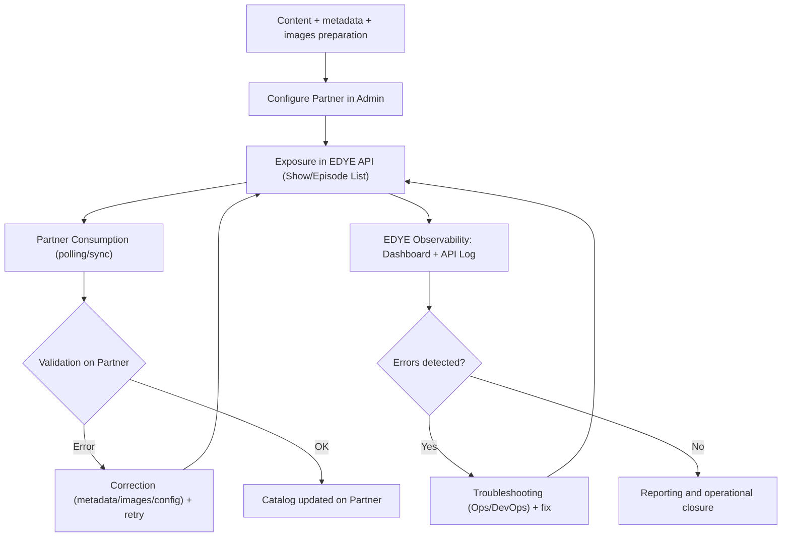

# Generic Delivery Flow via API

This document defines the standard delivery flow via API within the EDYE ecosystem, applicable to all partners that consume content through endpoints (not via package transfer).

The objective is to standardize the process, maintaining a single operational flow and delegating specifics (particular endpoints, filters, extra fields, authentication, and SLA) to partner-specific annexes.

---

## 1. Scope

The delivery flow via API covers:

- Publishing content (videos) and catalogs (shows/episodes) from the source of truth (JW Player)
- Partner configuration (permissions, filters, delivery type)
- Exposure of EDYE endpoints (lists of shows/episodes + associated assets)
- Partner consumption (polling or synchronization) and error control
- Observability (API logs, metrics, and errors)

Not covered:
- Package transfer (SFTP/Aspera/S3)
- End-user authentication (SSO/OpenID)
- Billing, revenue share, or payments

---

## 2. Systems Involved

- Content Operations / Programming (curation, upload, and editorial QA)
- JW Player (source of truth for videos and show/episode structure)
- EDYE Admin (partner configuration, permissions, thumbnails/metadata)
- EDYE API / Backend (delivery endpoints for shows/episodes)
- Partner Platform (system that consumes the API and publishes/ingests on their side)
- DevOps / Operations (monitoring, troubleshooting, and support)

---

## 3. Flow Phases

### Phase A — Preparation (Pre-delivery)

- Content upload and organization
	- Master videos in JW Player
	- Structure: show → season → episode
	- Languages / variants (if applicable)
- Minimum metadata and consistency
	- Mandatory fields (per EDYE standard + partner annex)
	- External IDs (TMS/Gracenote or others, if applicable)
	- Editorial consistency review
- Images and thumbnails
	- Posters / stills / logos (as applicable)
	- Thumbnail generation/validation according to partner formats (if applicable)
- Partner configuration in EDYE Admin
	- Create/edit partner
	- Define API permissions (enabled endpoints)
	- Filters by tags/geo (if applicable)
	- Thumbnail and/or watermark configuration (if applicable)
	- Select “Delivery Type” when appropriate (e.g., API Delivery)

> Note: In “API Delivery,” EDYE may add an additional field to the JSON with the configured thumbnails (e.g., custom_thumbnails) when applicable.

### Phase B — Publication and Exposure via API

- Data synchronization/update
	- Synchronization of shows/episodes (if applicable per operation)
	- Verification that content is “visible” and in correct tags
- Exposure on EDYE endpoints
	- Typical endpoints (per permissions):
		- Show List
		- Episode List
	- The response includes metadata + asset references (images/thumbnails) according to configuration
- Partner consumption
	- Partner performs polling (scheduled job) or on-demand synchronization
	- The partner:
		- Detects new shows/episodes or changes
		- Downloads/consumes referenced assets (images/thumbnails)
		- Updates their internal catalog

### Phase C — Control, Errors, and Operational Closure

- Validation and error control
	- In EDYE:
		- Track traffic by endpoint/partner
		- Review recent errors (Latest Errors)
		- Review API Log (by date range, endpoint, user, status)
	- On partner side:
		- Handle retries and backoff
		- Report inconsistencies (if an asset is missing or metadata is incomplete)
- Correction and retries
	- If the error is editorial (metadata/images): Content Ops / Design fixes and re-exposes via API
	- If the error is technical (auth, endpoint, performance): DevOps investigates logs and applies a fix
- Reporting
	- Consumption status (successes/errors per window)
	- Evidence in logs (API Log) and technical dashboard metrics

---

## 4. Flow Diagram

> **Figure 1.** _Flow Diagram_

---

## 5. Estados de procesamiento (referenciales)

- Success / 200 OK (consumo correcto)
- Client Error / 4xx (auth, parámetros, permisos)
- Server Error / 5xx (fallas de API/infra)
- Degradación (latencia alta / timeouts) → requiere revisión operativa

---

## 6. Consideraciones generales

El control de acceso a endpoints se gestiona por usuario/partner y define qué puede consumir cada integración.

La observabilidad operativa se apoya en:

- Dashboard técnico (tráfico por endpoint, por partner, errores recientes)
- Tools → API Log para auditoría y troubleshooting.

Las particularidades (auth, endpoints adicionales, paginación, rate limits, campos obligatorios, thumbnails/watermark) deben ir en Anexo por partner.
