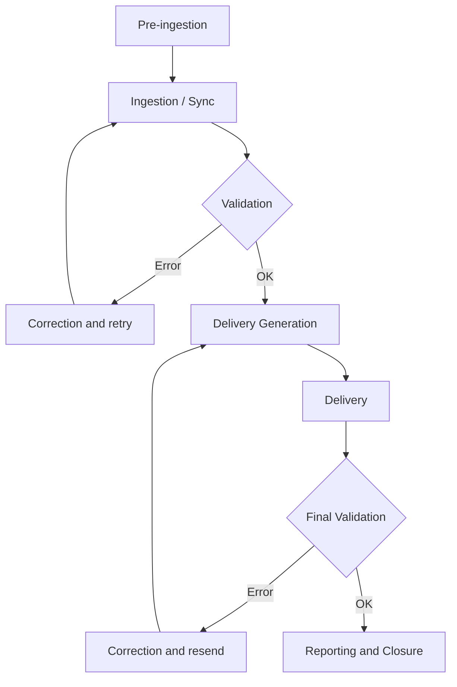

# Generic Content Ingestion Flow

This document defines the **standard audiovisual content ingestion flow** within the **EDYE** ecosystem, applicable to **all partners** operating under an ingestion integration model.

The goal is to **standardize the process**, maintaining a single operational flow and delegating specifics to **partner annexes**.

---

## 1. Scope

The ingestion flow covers:

- Preparation of content, metadata, and images
- Execution of ingestion via API / transfer
- Automatic and operational validations
- Generation and delivery of the package
- Reporting and post-ingestion traceability

Not covered:

- End-user authentication
- Partner consumption of the content
- Billing or revenue share

---

## 2. Systems Involved

- **Content source** (Content Ops / Programming)
- **JW Player** (source of truth for video)
- **EDYE API / Backend**
- **Delivery infrastructure** (SFTP, Aspera, S3, API)
- **Partner Platform**
- **Operations team**

---

## 3. Flow Phases

### Phase A — Pre-ingestion (Preparation)

1. **Content upload**

   - Master videos
   - Organization by series, seasons, and episodes
   - Languages and variants

2. **Metadata preparation**

   - Mandatory fields
   - External IDs (e.g., TMS / Gracenote)
   - Editorial and operational metadata

3. **Image preparation**

   - Posters
   - Episodic stills
   - Logos (if applicable)
   - Thumbnails (if applicable)

4. **Partner-specific rule configuration**
   - Type of metadata
   - Validation rules
   - Naming and structure rules
   - Image format and watermark

---

### Phase B — Ingestion (Execution)

5. **Ingestion trigger**

   - Synchronization via API
   - Or ingestion via FTP / polling (if applicable)

6. **Automatic validation**

   - Video: codec, resolution, duration
   - Metadata: completeness and consistency
   - Images: existence and format

   **Possible result:**

   - Failed → requires correction
   - Completed with warnings
   - Validated OK

7. **Delivery generation**

   - Packaging according to partner specification
   - Application of naming and structure
   - Inclusion of thumbnails / watermark (if applicable)

8. **Delivery**
   - Channel defined by partner:
     - SFTP
     - Aspera
     - S3
     - API

---

### Phase C — Post-ingestion (Control and Closure)

9. **Final validation (Operations)**

   - Delivery integrity
   - Partner receipt confirmation

10. **Reporting**
    - Processing status
    - Errors and reprocessing
    - Execution logs and metrics

---

## 4. Flow Diagram

---

## 5. Processing States

- Received
- Processing
- Failed
- Completed with warnings
- Completed

---

## 6. General Considerations

- Ingestion is fully automated
- Compliance with naming and structure is mandatory
- Any non-compliance results in asset rejection
- Resends require regeneration of the delivery
