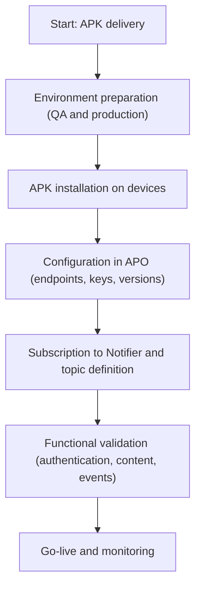

**Version:** 1.0  
**Date:** 12/01/2025

---

## 1. Introduction

This document describes the guidelines for integrating the EDYE application into a partner ecosystem using the APP INTEGRATION model – APO + Notifier + APK. It is aimed at technical teams and DevOps operations. Its purpose is to serve as a generic reference for any partner integrating the official EDYE APK, without mentioning specifics of any particular operator.

## 2. Objective and Scope

**Objective:** provide a detailed guide to integrate the EDYE application into partner platforms using APO (Application Provider Operator) and Notifier.

**Scope:** includes delivery of the official APK, APO configuration, subscription to events through Notifier, and connection with the EDYE backend. Billing processes or ingestion of third-party users are excluded.

## 3. APO + Notifier + APK Integration Model (Overview)

The integration model is based on three elements provided by EDYE:

- **Official APK:** packaged application for Android devices (including Android TV or OTT), delivered signed and unmodified.
- **APO (Application Provider Operator):** configuration console that manages parameters such as environments (QA and production), API keys, content channels, and versions.
- **Notifier:** event-based messaging service that reports actions occurring on the platform. According to asynchronous messaging guidelines, events do not require consumer action and do not expect a specific response; producer and consumer are decoupled.

The integrating partner must:

- Receive and integrate the APK into their store or distribution channel.
- Configure APO with their own parameters (endpoints, tokens, channels).
- Consume events emitted by Notifier and confirm reception via an acknowledgement to ensure delivery.

## 4. General Integration Architecture

The architecture consists of:

- **Partner Ecosystem:** environment where the APK is distributed and the integration operates.
- **EDYE APK:** official application running on user devices.
- **APO:** centralized configuration platform.
- **Notifier:** messaging service that publishes operational and business events.
- **EDYE Backend:** authentication, catalog, and streaming services.

A general diagram could show these components connected: the APK communicates with the backend for authentication and content, is managed via APO, and publishes events to Notifier; the partner consumes those events and updates their systems according to the received information.

## 5. General Integration Flow (End-to-End Textual Description)

1. **APK delivery:** EDYE delivers the signed APK to the partner along with version metadata.
2. **Environment preparation:** the partner enables a QA environment and receives initial credentials.
3. **APK installation:** the partner distributes the application to devices.
4. **APO configuration:** environments, keys, endpoints, and content channels are defined in the APO console.
5. **Notifier subscription:** the partner subscribes to relevant event topics.
6. **Backend integration:** the APK invokes EDYE services via HTTPS and tokens.
7. **Monitoring and support:** the partner monitors operation and coordinates with EDYE in case of incidents.

> **Figure 1.** _Flow diagram_

---

## 6. Components Involved

### Partner (Integrating Partner)

- Integrates the APK into their application catalog and configures APO with their parameters.
- Consumes Notifier events and confirms receipt.
- Manages first-level support for their users.

### EDYE APO

- APK configuration platform. Allows defining environments, endpoints, content channels, keys, and versioning.
- Records changes and provides audit logs.

### EDYE Notifier

- Service based on the publisher–subscriber pattern. Publishes events when relevant events occur.
- Implements an acknowledgement and retry system to ensure message delivery.

### EDYE APK

- Official application that manages the user experience on Android devices.
- Configured dynamically via APO.
- Reports events to Notifier and consumes content from the backend.

### EDYE Backend (API / Connect / Play)

- Authentication, catalog, and streaming services.
- Operates over HTTPS and requires access tokens. Best practices for authentication require keeping keys secret, including only necessary information in tokens, and defining expiration.

---

## 7. Detailed Flow by Phases

### 7.1 Environment Preparation

- EDYE provides initial credentials for QA and production.
- The partner configures the network to allow HTTPS traffic to EDYE domains.
- An account is created in APO with appropriate permissions.

### 7.2 APK Delivery and Installation

- Reception and verification of the signed APK.
- Distribution through the partner’s internal channels.
- Installation testing on compatible devices.

### 7.3 APO Configuration

- Definition of environments, endpoints, and keys.
- Configuration of content channels and versions.
- Logging of changes and audit.

### 7.4 Notifier Integration

- Subscription to event topics (for example: activations, cancellations, errors).
- Implementation of a client that consumes events and sends acks.
- Handling retries with back-off and idempotency.

### 7.5 Functional Validation

- Verify authentication and access to content.
- Play titles and validate DRM.
- Test Notifier events and acknowledgements.
- Validate that APO configuration is applied correctly.

### 7.6 Go-Live

- Update production parameters in APO.
- Deploy the APK to end users.
- Monitor the service during the transition and record versions and dates.

---

## 8. Notifier Event Model

### 8.1 Event Types

- User activation, user deactivation, errors, service status, playback interactions.
- Events are sent in JSON format with identifier, timestamp, type, and relevant data.

### 8.2 Acknowledgements and Retries

- Although events do not require consumer action, an ack is sent to confirm reception.
- Notifier will store the event and perform retries until the ack is received.
- The consumer must be idempotent to handle duplicates.

---

## 9. APO Configuration

- **Parameters:** environments (QA/production), keys, endpoints, channels, minimum/maximum APK version.
- **Environments:** each environment has its own tokens and configurations.
- **Version management:** controls access to APK versions and can force updates.
- **Operational controls:** audit logs, alerts, and user management.

---

## 10. Security and Access Control

- **Authentication:** via tokens that must be kept secret and have expiration.
- **Authorization:** validation of permissions in the backend and in APO.
- **Endpoint protection:** use of HTTPS, rate limiting, input validation.
- **Credential management:** periodic rotation, secure storage, and least-privilege access control.

---

## 11. Error Handling, Monitoring, and Retries

- Handle exceptions in the APK with retries and clear messages.
- Use logs and metrics to detect failures.
- Idempotency and retries in Notifier to ensure delivery.
- Integration with the partner’s observability tools.

---

## 12. Integration Acceptance Criteria

- Correct installation and operation of the APK.
- Configuration validated in APO.
- Reception and confirmation of Notifier events.
- Secure access to content.
- Monitoring and documentation completed.

---

## 13. Operation, Monitoring, and Support

- Monitor usage metrics and events daily.
- Update configurations in APO as needed.
- Coordinate APK updates with EDYE.
- Use established support channels to resolve incidents.

---
