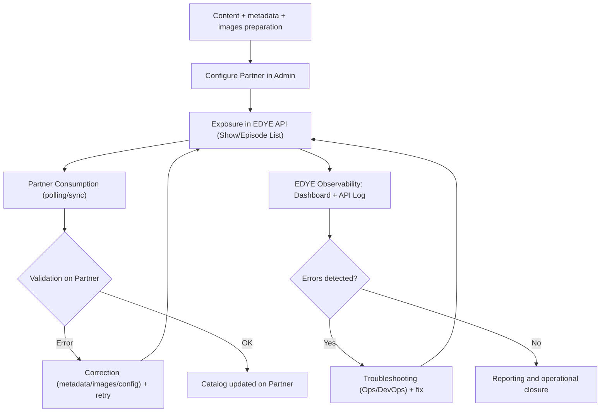

**Version:** 1.0  
**Date:** 12/01/2025  

---

This document describes the standard delivery model via API within the EDYE ecosystem, used by partners to consume catalog, metadata, and images directly from endpoints (without file-based transfer such as SFTP/Aspera).

This model applies, among others, to partners that integrate catalog via API (for example, OTT applications, operators, or aggregators consuming JSON). The structure and style of this document follow the same pattern as the attached example.

---

## 1. Scope

The delivery via API model covers:

- Publication and exposure of catalog (series, movies, episodes)
- Delivery of structured metadata (JSON) for programmatic consumption
- Delivery of image and thumbnail references/URLs (when applicable)
- Versioning, pagination, and incremental synchronization (checkpoint/cursor)
- Functional validation of consumption (contract, mandatory fields, consistency)
- Monitoring, access control, rate limits, and troubleshooting
- Reporting and consumption audit (when applicable)

Not covered:

- Content ingest/upload into JW Player (belongs to the ingestion model)
- Transfer of asset packages via SFTP/Aspera/S3 (file-based model)
- DRM playback, player SDK, or partner analytics (unless specifically agreed)

---

## 2. Systems Involved

The following systems participate in delivery via API:

- **EDYE API**  
  Central source for exposing catalog, metadata, and assets via endpoints.
- **Admin Panel (EDYE)**  
  Operational interface for per-partner configuration (access, parameters, thumbnails, etc.) and verification/monitoring.
- **JW Player (JWP) (upstream, indirect source)**  
  Source of videos, playlists, and still images. Ingestion keeps EDYE updated, and then the partner consumes from EDYE API.
- **External metadata sources (when applicable)** – Gracenote / TMS (IDs, correlation, enrichment) – Rule: Gracenote / TMS identifiers are required only for partners that correlate catalog via Gracenote/TMS (defined by contract). For other partners, these IDs are not mandatory (optional / N/A).
- **Partner**  
  API client (backend or app) that consumes the endpoints and synchronizes its catalog.

---

## 3. Supported Content Types

The delivery via API model supports, depending on configuration:

- Series
- Movies
- Episodes
- Playlists / collections (if exposed)
- Images: - Posters - Episodic stills - Logos - Thumbnails (when applicable per partner)
- Metadata associated with the content (editorial fields, availability, ratings, languages, etc.)

---

## 4. General Delivery Flow via API

The standard delivery flow via API is composed of the following steps:

### Phase A — Preparation (Pre-delivery)

- Content upload and organization
  - Master videos in JW Player
  - Structure: show → season → episode
  - Languages / variants (if applicable)
- Minimum metadata and consistency
  - Mandatory fields (per EDYE standard + partner annex)
  - External IDs (TMS/Gracenote or others, if applicable)
  - Editorial consistency review
- Images and thumbnails
  - Posters / stills / logos (as applicable)
  - Thumbnail generation/validation per partner formats (if applicable)
- Partner configuration in EDYE Admin
  - Create/edit partner
  - Define API permissions (enabled endpoints)
  - Filters by tags/geo (if applicable)
  - Thumbnail and/or watermark configuration (if applicable)
  - Selection of “Delivery Type” when appropriate (e.g., API Delivery)

> Note: In “API Delivery,” EDYE can add to the JSON an additional field with the configured thumbnails (e.g., custom_thumbnails) when applicable.

### Phase B — Publication and Exposure via API

- Data synchronization/update
  - Synchronization of shows/episodes (if applicable per operation)
  - Verification that content is “visible” and in correct tags
- Exposure on EDYE endpoints
  - Typical endpoints (per permissions):
    - Show List
    - Episode List
  - The response includes metadata + references to assets (images/thumbnails) according to configuration
- Partner consumption
  - The partner executes polling (scheduled job) or on-demand synchronization
  - The partner:
    - Detects new shows/episodes or changes
    - Downloads/consumes referenced assets (images/thumbnails)
    - Updates its internal catalog

### Phase C — Control, Errors, and Operational Closure

- Validation and error control
  - In EDYE:
    - Tracking traffic by endpoint/partner
    - Reviewing recent errors (Latest Errors)
    - Reviewing API Log (by date range, endpoint, user, status)
  - On partner side:
    - Handling retries and backoff
    - Reporting inconsistencies (if an asset does not exist or metadata is missing)
- Correction and retries
  - If the error is editorial (metadata/images): Content Ops / Design fixes and re-exposes via API
  - If the error is technical (auth, endpoint, performance): DevOps investigates logs and applies a fix
- Reporting
  - Consumption status (successes/errors per window)
  - Evidence in logs (API Log) and technical dashboard metrics

---

### Flow Diagram

---

## 5. Mandatory Prerequisites

Before enabling a partner for delivery via API, the following requirements must be met:

- Partner created and configured in EDYE (environments: staging/prod)
- Definition of authentication scheme (API key / bearer token / etc.)
- Role/partner permissions to required endpoints (Access Control)
- Definition of catalog scope (what content is visible: tags/playlists/geo/languages)
- Definition of mandatory fields per partner (data contract)
- Definition of required thumbnails/images (formats, sizes, watermark if applicable)
- Definition of rate limit and retry strategy
- Agreement on synchronization and operation windows (consumption frequency)

---

## 6. Variants of the Delivery via API Model

Variants are grouped by consumption type and data scope.

### 6.1 Consumption Types (per Partner)

| Type          | Description                                                                   |
| ------------- | ----------------------------------------------------------------------------- |
| Full catalog | The partner synchronizes the entire allowed catalog (paginated).                  |
| Incremental   | The partner consumes only changes from a checkpoint (updated_since / cursor). |
| By collection | The partner consumes specific playlists/collections (tags/IDs).          |
| Hybrid       | Initial full + recurring incremental.                                        |

### 6.2 Delivery Scope

| Scope                     | Description                                                               |
| --------------------------- | ------------------------------------------------------------------------- |
| Metadata + Images         | JSON + URLs to posters/stills/thumbnails.                                  |
| Metadata only               | JSON without strict image requirements (if the partner allows). |
| Images only               | Endpoints/feeds for artwork refresh (specific cases).             |
| Enriched (TMS/Gracenote) | Includes external IDs and/or additional fields for correlation.             |

---

## 7. System Validations

During delivery via API, the following validations are considered (partner side and operational):

- Data contract (schema): mandatory fields present and with valid type
- Consistency: coherent show–season–episode relationship
- Availability: publication windows (start/end), geo, language, editorial flags
- Images: existence of URLs and required formats (if applicable)
- Metadata encoding: avoid invisible characters/invalid text; standardize to UTF-8
- Pagination: avoid duplicating or missing items between pages/cursor
- Rate limit and resilience: controlled retries for 429/5xx

**Response states (from the client perspective)**

- 200 OK: valid response
- 204 No Content: no changes / no results (if applicable)
- 400 Bad Request: invalid parameters
- 401/403: authentication/authorization
- 404: resource does not exist or is not allowed
- 409: conflict (if applicable)
- 429 Too Many Requests: rate limit
- 5xx: service error

---

## 8. Monitoring and Control

The operational status can be monitored from:

- Admin Panel (partner configuration, operational validations, reviews)
- API Logs / Log Viewer (if enabled): audit and troubleshooting
- Metrics (request rate, latency, errors per endpoint, 429)

**Minimum evidence for support (partner → EDYE)**

When the partner reports an incident, they must include:

- Environment (staging/prod)
- Endpoint + method
- Timestamp (UTC) and partner time zone
- Status code
- Request/Correlation ID (if available)
- Parameters (without credentials)
- Example of affected IDs (show_id / episode_id)

---

## 9. Common Errors and Troubleshooting

| Error / Symptom    | Probable cause                                                                           | Recommended action                                                        |
| ------------------ | ---------------------------------------------------------------------------------------- | ------------------------------------------------------------------------- |
| 401 / 403          | Invalid, expired, or unauthorized credentials                                         | Validate token/API key, check Access Control, rotate credentials         |
| 400 Bad Request    | Unsupported parameters (pagination/filters)                                            | Review contract, adjust query/cursor, validate types                     |
| 404 Not Found      | Resource does not exist or is out of partner scope                                      | Confirm filters/tags/geo; validate IDs                                   |
| 429 Rate limit     | Excess requests or burst not allowed                                                  | Implement exponential backoff + jitter; respect agreed RPS           |
| 5xx / timeouts     | Temporary service degradation                                                        | Retry with backoff; enable circuit breaker; escalate to DevOps         |
| Inconsistent data | Missing mandatory fields or invisible characters/invalid encoding (UTF-8 only) | Normalize metadata upstream (JWP/EDYE), correct fields, and re-sync |
| Missing images | Posters/stills unavailable or not meeting format                                       | Complete images, validate ratios/sizes/watermark, and retry         |

---

## 10. Post-Delivery Reporting

Once the integration is stabilized, EDYE can support:

- Consumption reports (aggregated by endpoint/window) if enabled
- Audit of delivered vs expected catalog (samples by date/checkpoint)
- Evidence for troubleshooting (traces by request ID)

Some partners require reports in specific formats (CSV/XLS) depending on the operation.

---

## 11. Security and Access Control

- Access restricted by roles and permissions (principle of least privilege)
- Credentials are not exposed in documentation
- Periodic credential rotation (recommended)
- Optional: allowlist of partner IPs (depending on environment)
- All relevant operations must be recorded in auditable logs

---

## 12. References

- [Delivery Flow via API](../flujos/flujo-delivery-api.md)
- [Integration Model: Ingestion](./ingesta.md)
- Partner annexes (API Delivery)

---

## 13. Supporting Documents (Google Drive)

This section centralizes operational documents (PDF) related to operation, monitoring, and validations of delivery via API.

### Operation and Monitoring

- API consumption monitoring and log review (PDF)  
  _Open in Drive_
- Access control and roles per partner (PDF)  
  _Open in Drive_

### Data Contract and Validations

- Schema contract (mandatory fields) per partner (PDF)  
  _Open in Drive_
- Pagination and incremental sync guide (PDF)  
  _Open in Drive_
