**Version:** 1.0  
**Date:** 12/01/2025  

---

This document describes the standard Billing integration model within the EDYE / HITN Digital ecosystem, used for managing subscriptions, charges, renewals, cancellations, and access states associated with consumption of content and applications.

The model is reusable for any partner requiring direct billing integration, carrier billing, or external gateway, maintaining a homogeneous technical-operational approach.

## 1. Scope

The Billing integration model covers:

- Creation and management of subscriptions
- Processing of payments, renewals, and extensions
- Cancellation and revocation of access
- Account status synchronization
- Exposure of subscription status to consuming systems
- Monitoring, reporting, and transaction audit

Not covered:

- Content ingestion or delivery integrations
- Editorial content management
- Partner payment screen UI/UX
- External commercial or financial support

## 2. Systems Involved

The following systems participate in the Billing flow:

- **EDYE Billing Service:** Central billing engine, business rules, and subscription control.
- **EDYE API:** Exposure of REST endpoints for billing operations and status queries.
- **Admin Panel (EDYE):** Operational interface for monitoring, auditing, reporting, and troubleshooting.
- **InPlayer:** External platform for managing payments, customers, and transactions (when applicable).
- **Payment gateway / Carrier Billing (depending on partner):**
    - Carrier Billing
    - External gateway
    - DTC / Marketplace
- **Partner:** Consumer of billing endpoints and recipient of subscription status.

## 3. Supported Integration Types

The Billing model supports the following integration types:

- **Direct Carrier Billing:** Direct charge via operator (telco).
- **DTC / External Gateway:** Integration with an external payment provider.
- **Marketplace / App Store:** Receipt validation and access control.
- **Hybrid model:** Combination of external billing + centralized control in EDYE.

## 4. General Integration Architecture

The Billing architecture is based on a **centralized orchestration model**, in which EDYE coordinates the different services involved—subscription processes, charging, and access management—through a set of microservices and an API orchestration layer. This approach decouples partners from complex payment logic, simplifying integration and increasing system resilience.

Various articles on payment architecture note that modern orchestration engines are built with microservices to achieve scalability and reliability; instead of a monolith, functions are divided into independent services that can be developed, deployed, and scaled separately. In an API orchestration environment, a dedicated service manages the workflow and acts as a single point of control, sequencing and combining calls to other services. This orchestration layer offers several advantages: it simplifies client logic by encapsulating the business flow, allows observation and debugging of processes at a single point, and improves security by abstracting the internal topology.

In the EDYE context, the **EDYE Billing Service** component orchestrates charge transactions and manages them through its **REST API.** Internal services store and control subscription state, while specific connectors manage communication with payment providers (carrier billing, gateways, or marketplaces). Integration with external platforms such as **InPlayer** is also decoupled through this layer; InPlayer provides identity, payment, and access management services, but orchestration of these services is performed from EDYE to ensure a homogeneous and centralized flow.

**Key components:**

- **Transactional REST API:** public layer exposing operations for activation, renewal, cancellation, and queries.
- **State persistence services:** store subscription states and transaction records for audit and synchronization.
- **Payment provider connectors:** encapsulate communication with carrier billing, external gateways, or marketplaces and can scale independently.
- **Orchestration module:** coordinates the flow among API, persistence, connectors, and third-party services, performing transformations and data aggregation.
- **Normalized status exposure to partners:** provides partner systems with a unified view of subscription and transaction status.

## 5. General Billing Flow

The standard Billing flow is composed of the following steps:

1. The partner initiates a subscription activation request.
2. EDYE Billing validates the product, plan, and applicable rules.
3. The charge process is executed via the configured provider.
4. The provider returns the transaction result.
5. EDYE records the subscription and its status.
6. Access is enabled or denied depending on the result.
7. Automatic renewals are scheduled (if applicable).
8. Status query endpoints are exposed.
9. Logs, metrics, and events are recorded.
10. Operational and financial reports are generated.

Below is a high-level diagram illustrating this end-to-end flow. The diagram shows the interaction between **EDYE Billing** (as orchestrator), the payment gateway (**Pagoralia** in the example), the **client**, and the external platform **InPlayer**. The geolocated portal is created and integrated with the gateway; the client accesses their portal and offers various subscriptions, the user enters the paywall and registers, and finally EDYE reconciles earnings with the partner. If a transaction failure occurs, an error screen is shown; in case of success, the user is registered in InPlayer and the renewal and reporting flow continues.

```mermaid
flowchart TD
    %% Definición de subgráficos para representar las "swimlanes"
    subgraph EDYE_API["EDYE API"]
        A[Creación de portal geolocalizado para cliente]
    end

    subgraph Pagoralia["Pagoralia"]
        B[Implementación de Pagoralia en el portal del cliente]
        D{Paywall Pagoralia}
        E[ Pantalla de error ]
    end

    subgraph Cliente["Cliente"]
        C[Portal entregado al cliente<br>para distribución]
        F[Cliente ofrece diferentes ofertas de suscripciones]
    end

    subgraph InPlayer["InPlayer"]
        G[El usuario es registrado en InPlayer]
    end

    subgraph Reconciliación["Reconciliación"]
        H[Reconciliación y de ganancias entre Edye y cliente]
    end

    %% Flujo principal
    A --> B --> C --> F --> D
    D -->|Transacción Falla| E --> H
    D -->|Transacción Exitosa| G --> H
```

> **Figure 1.** _General Billing Flow_

## 6. Mandatory Prerequisites

Before enabling a Billing integration, the following are required:

- Partner registered and enabled in EDYE
- Products and plans configured
- Charging rules defined (trial, renewal, cancellation)
- Payment channel configured
- Endpoints enabled and authenticated
- Access and roles defined in Admin Panel
- Environment validation (staging / production)

## 7. Variants of the Billing Model

### 7.1 Charging Types

Type Description
Trial Free access for a defined period
Recurring Automatic renewal
One-time One-time payment
Promotional Special conditions

### 7.2 State Management

State Description
Active Active subscription
Expired Period ended
Revoked Access canceled
Pending Transaction in process

## 8. System Validations

During the Billing process, EDYE performs automatic validations on:

- Existence of product and plan
- Customer status
- Payment provider result
- Duplicate subscriptions
- Consistency of dates and periods
- Renewal and cancellation rules
- Processing states: Pending, Active, Expired, Revoked, Failed

## 9. Monitoring and Control

Monitoring is performed from the Admin Panel:

- Billing activity dashboard
- History per customer
- Transaction details
- Subscription states
- API logs
- Retries and manual corrections (depending on role)

## 10. Common Errors and Troubleshooting

Error / Symptom Probable cause Recommended action
Subscription not activated Payment error Check provider and retry
Renewal not applied Automatic job failure Verify scheduler
Status mismatch Desynchronization Force status sync
Payment rejected External provider Validate reason for rejection
API unauthorized Invalid token Regenerate credentials

## 11. Post-Billing Reporting

EDYE allows:

- Export CSV / XLS reports
- Audit transactions by period
- Check conversion metrics
- Review revenue by partner / product

## 12. Security and Access Control

- Authentication via secure tokens
- Role control per operation
- Auditable logs
- No exposure of sensitive data
- Compliance with security best practices

## 13. References

- EDYE Billing API documentation.
- Admin Panel operations manual.
- DevOps procedures (CI/CD, monitoring, security).
- **InPlayer Basic Overview:** description of InPlayer’s three service lines (identity/authentication management, payments/subscriptions, and access control).
- **Payment orchestration architecture:** articles on orchestration engines highlighting the use of microservices for scalability, fault isolation, and independent deployments.
- **API orchestration layer:** guide on orchestration layer design explaining functions such as sequencing, aggregation, and response transformation.
