**Versión:** 1.0  
**Fecha:** 01/12/2025  

---

# Integration Model: Content Ingestion

This document describes the **standard content ingestion model** within the
**EDYE** ecosystem, used by multiple partners for the distribution of audiovisual
content (series, movies, episodes, images, and metadata).

This model applies, among others, to the following partners:

- Claro Video
- Megacable
- Dish México
- Sky Brasil
- Roku Premium Subscriptions
- WATCH Brazil

---

## 1. Scope

The ingestion model covers:

- Content preparation and validation
- Synchronization with JW Player
- Metadata normalization and validation
- Asset generation per partner (packages and/or individual assets)
- Delivery of metadata and images
- Post-ingestion validation, monitoring, and reporting

It does not cover:

- User authentication
- Billing
- Content consumption by the partner

---

## 2. Systems Involved

The following systems participate in the ingestion flow:

- **JW Player (JWP)**  
  Source of videos, playlists, and still images.

- **EDYE API**  
  Central engine for processing, validation, and asset generation.

- **Admin Panel (EDYE)**  
  Operational interface for synchronization, validations, delivery generation, and monitoring.

- **External metadata sources (when applicable)**  
  - **Gracenote / TMS** (IDs, catalog references)

> **Rule:** **Gracenote / TMS** identifiers are required **only** for partners that have **catalog correlation via Gracenote** (currently: **[NOMBRE_DEL_PARTNER]**).  
> For other partners, these IDs are **not mandatory** (optional / N/A).

- **Delivery channels / repositories (per partner configuration)**  
  - Aspera (HITN Production)
  - Partner SFTP
  - Partner S3 (specific cases)
  - API/SSL delivery (specific cases)

- **Partner**  
  Final recipient of the generated assets.

---

## 3. Supported Content Types

The ingestion model supports the following content types:

- Series
- Movies
- Episodes
- Playlists
- Images:
  - Posters
  - Episodic stills
  - Logos
  - Thumbnails (when applicable per partner)
- Metadata associated with the content

---

## 4. General Ingestion Flow

The standard ingestion flow consists of the following steps:

1. Audiovisual content is uploaded and organized in **JW Player**.
2. **Mandatory metadata parameters** are completed (per model and partner), for example:
  - External IDs (e.g., **TMS ID**) when applicable
  - Custom parameters (e.g., **Acronym**) when applicable
3. **JW Player is synchronized with EDYE API**.
4. Metadata and content tagging are validated (mandatory fields, consistency, and tags).
5. The **image package** (posters / episodic stills / thumbnails) and its **naming/structure** are validated according to the partner specs.
6. A **delivery** is generated for one or more partners from the Admin Panel.
7. EDYE API processes the assets (XML/metadata, images, packages) and executes **QC** (warnings/errors).
8. Assets are delivered via the configured channel (**Aspera / SFTP / S3 / API**).
9. The final ingestion status is validated (per delivery and per asset) and failures are retried (if applicable).
10. Post-ingestion reports are generated.

### 4.1. Flow Phases

#### Phase A — Pre-ingestion (Preparation)

1. **Content upload**

  - Master videos
  - Organization by series, seasons, and episodes
  - Languages and variants

2. **Metadata preparation**

  - Mandatory fields
  - External IDs (e.g., TMS / Gracenote)
  - Editorial and operational metadata

3. **Image preparation**

  - Posters
  - Episodic stills
  - Logos (if applicable)
  - Thumbnails (if applicable)

4. **Partner rule configuration**
  - Type of metadata
  - Validation rules
  - Naming and structure rules
  - Image format and watermark

---

#### Phase B — Ingestion (Execution)

5. **Ingestion trigger**

  - Synchronization via API
  - Or ingestion via FTP / polling (if applicable)

6. **Automatic validation**

  - Video: codec, resolution, duration
  - Metadata: completeness and consistency
  - Images: existence and format

  **Possible outcome:**

  - Failed → requires correction
  - Completed with warnings
  - Validated OK

7. **Delivery generation**

  - Packaging according to partner specification
  - Application of naming and structure
  - Inclusion of thumbnails / watermark (if applicable)

8. **Delivery**
  - Channel defined by partner:
    - SFTP
    - Aspera
    - S3
    - API

---

#### Phase C — Post-ingestion (Control and Closure)

9. **Final validation (Operations)**

  - Delivery integrity
  - Reception confirmation by the partner

10. **Reporting**
   - Processing status
   - Errors and reprocessing
   - Execution logs and metrics

---

### 4.2. Flow Diagram

```mermaid
flowchart TD
  A[Pre-ingesta] --> B[Ingesta / Sync]
  B --> C{Validación}
  C -- Error --> R[Corrección y reintento]
  R --> B
  C -- OK --> D[Generación Delivery]
  D --> E[Entrega]
  E --> F{Validación Final}
  F -- Error --> R2[Corrección y reenvío]
  R2 --> D
  F -- OK --> G[Reporting y Cierre]
```

> **Figure 1.** Flow diagram **

---

## 5. Mandatory Prerequisites

Before running an ingestion, the following requirements must be met:

- Playlists correctly configured in JW Player (including partner-specific playlists, if applicable)
- Content (series/movies/episodes) synchronizable with EDYE API
- Complete and consistent metadata (mandatory fields, language(s), availability, etc.)
- External IDs loaded when applicable (e.g., **TMS ID**) and required custom parameters (e.g., **Acronym**)
- Correct tagging (e.g., `geoList`, editorial tags)
- Complete image package per partner:
  - Posters (with required aspect ratios)
  - Episodic stills per episode (minimum required quantity)
  - Thumbnails (if the partner requires them)
- File naming and structure according to the **partner specifications**
- Partner enabled for delivery (channel configuration + delivery format)

---

## 6. Ingestion Model Variants

Variants are grouped by **delivery channel** and **package type**.

### 6.1 Delivery channels (per partner)

| Channel       | Description                                         |
|--------------|------------------------------------------------------|
| Aspera       | Assets generated and stored in HITN Production       |
| Direct SFTP  | Assets sent to the partner SFTP repository           |
| S3           | Assets sent to the partner S3 bucket (cases)         |
| API/SSL      | Delivery via API/SSL (API integration cases)         |

### 6.2 Package types / delivery scope

| Package              | Description                                              |
|----------------------|----------------------------------------------------------|
| Metadata + Images    | Full delivery of metadata (XML/JSON) and images          |
| Full Package         | Metadata + posters + episodic stills + thumbnails (if applicable) |
| Images Only          | Delivery limited to artwork and images                   |
| Metadata Only        | Delivery limited to metadata (when the partner allows it) |

Each partner may apply one or more variants of the model.

---

## 7. System Validations

During ingestion, EDYE API runs automatic validations on:

- Existence of required images (by content type and by partner)
- Consistency between playlists and episodes
- Asset structure and naming
- JW Player ↔ EDYE synchronization
- Delivery configuration per partner
- Additional restrictions (e.g., thumbnails with watermark, when applicable)

### Processing states

- **Pending / Received**: Delivery created, pending execution
- **Processing**: Assets in generation/transfer
- **Completed**: Ingestion finished successfully
- **Failed**: Error in one or more assets
- **Completed with Warnings** (if applicable): finishes but requires alert review

---

## 8. Monitoring and Control

The status of an ingestion can be monitored from the **Admin Panel**:

- General deliveries view
- **Delivery View**: review of the generated package (per partner, per asset type)
- Detailed log per asset (errors, warnings)
- Individual status of each file
- Manual retry of failed assets
- **API Logs / Log Viewer** (if enabled): audit and troubleshooting

---

## 9. Common Errors and Troubleshooting

| Error / Symptom                         | Probable cause                                                                 | Recommended action                                               |
|----------------------------------------|--------------------------------------------------------------------------------|------------------------------------------------------------------|
| Validation error                        | Images not synchronized or missing                                             | Run JW Player sync and revalidate                                |
| Missing assets                          | Episodes without stills / incomplete posters                                   | Upload/replace images and retry                                  |
| Inconsistent metadata                   | Mandatory fields missing **or invisible characters/invalid encoding (UTF-8 only)** | Correct metadata in JWP / EDYE, normalize text to UTF-8, and retry |
| Delivery stuck / prolonged processing   | Batch error or dependency in the transfer                                      | Check logs, retry, escalate to DevOps                            |
| Invalid naming/structure                | Does not meet partner spec                                                     | Adjust naming/structure and regenerate                           |

---

## 10. Post-ingestion Reporting

Once ingestion is completed, EDYE allows:

- Downloading reports in CSV or XLS format
- Validating assets delivered by partner
- Auditing dates, IDs, and content availability

Some partners require specific formats (e.g., XLS).

---

## 11. Security and Access Control

- Access to the Admin Panel is role-restricted.
- Credentials are not exposed in the documentation.
- Ingestion operations are recorded in auditable logs.

---

## 12. References

- [Ingestion Flow](../flujos/flujo-ingesta.md)
- [Claro Video Ingestion](../partners/claro-video/ingesta.md)
- [Dish Mexico Ingestion](../partners/dish-mexico/ingesta.md)

---

## 13. Supporting Documents (Google Drive)

This section centralizes the operational documents (PDF) related to the ingestion model.
Use these links as a step-by-step visual reference of the Admin Panel and delivery processes.

### Delivery operations and monitoring

- **Generate deliveries for partners via EDYE API (PDF)**  
  [Open in Drive](https://drive.google.com/file/d/1lljpBhoBqpV9BHzWPlfA6_Rba-Q3kpa9/view?usp=drive_link)

- **Verify the individual status of an asset within a delivery (PDF)**  
  [Open in Drive](https://drive.google.com/file/d/1Id1bk7cMcvQ-fLHOOZG8bCvFyNa8DSxJ/view?usp=drive_link)

- **Download ingestion reports / delivery reports (PDF)**  
  [Open in Drive](https://drive.google.com/file/d/1dMgpGFmfRcIClUC1X3K68CsPRi4oYyoG/view?usp=drive_link)

### Images and packages

- **Download image packages for specific partners (PDF)**  
  [Open in Drive](https://drive.google.com/file/d/1RqXEM0K-BSqC7vBPRrdundW3J1LPrVfb/view?usp=drive_link)

- **Replace episode images manually in EDYE API (PDF)**  
  [Open in Drive](https://drive.google.com/file/d/1rRpWeTCohNudmPhUEZr6QLZ0CRxGmFYy/view?usp=drive_link)

- **Synchronize playlists and images from JW Player to EDYE API (PDF)**  
  [Open in Drive](https://drive.google.com/file/d/1EknA3RHwOift9hmv90AgMzdGwLk3KLWj/view?usp=drive_link)

### Metadata and tagging

- **Mass tagging (Add Tags to Content in Bulk) via EDYE API (PDF)**  
  [Open in Drive](https://drive.google.com/file/d/1HHgs9z459F3KGgZ8cR3qr6rMBtHYnTB9/view?usp=drive_link)
