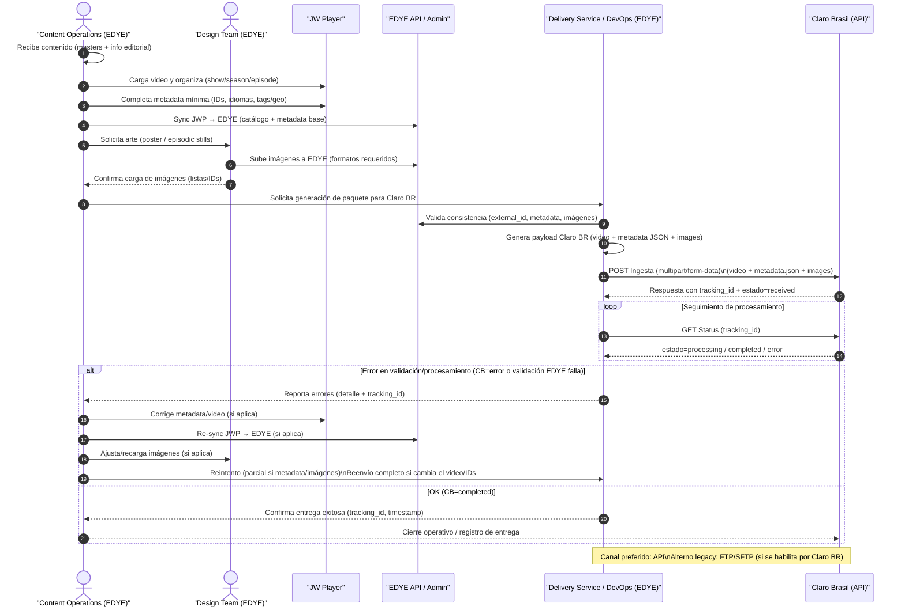

# Ingestion Integration Appendix – Claro Brazil

This document describes the **partner-specific configurations for Claro Brazil** that complement the **generic EDYE ingestion flow**.  
It does not redefine the standard flow; it only details the particular parameters required by this partner.

---

## 1. Ingestion Flow – Claro Brazil

The following diagram represents the **operational content ingestion flow toward Claro Brazil**, based on the **standard EDYE ingestion model** and adapted to this partner’s technical specifics.

The process starts with **content preparation in JW Player**, where master videos are uploaded, the catalog is structured (series, seasons, and episodes), and the required metadata is completed. The required images (posters and episodic stills) are then generated and uploaded by the Design team in EDYE.

Once video, metadata, and images are synchronized, the **DevOps system generates the delivery package specific to Claro Brazil**, running automatic validations on video format, metadata consistency, and image specifications.

Delivery is preferably performed via the **Claro Brazil ingestion API**, using an asynchronous scheme with a **tracking ID** to monitor processing status. In case of validation or processing errors, the flow includes **source correction and controlled retries**, either partial (metadata / images) or full (video).

The process concludes when Claro Brazil returns the **`completed`** status, at which point Operations validate the delivery and perform the **operational close of the ingestion**.



> **Figure 1.** _Partner operational flow diagram_

---

## 1. Delivery Channel

**Delivery type:** Hybrid (API + file transfer)

### 1.1 Supported methods

- **API REST (principal)**
- **FTP / SFTP (polling)** _(en proceso de descontinuación)_

### 1.2 Main endpoints

| Use               | Endpoint                                   |
| ----------------- | ------------------------------------------ |
| Content ingestion | `POST /api/ingesta/contenido`              |
| Status query      | `GET /api/ingesta/status?id={tracking_id}` |

### 1.3 Authentication

- **Bearer Token**
- Token provided by Claro Brazil per environment (DEV / QA / PROD)

### 1.4 Submission format

- `multipart/form-data`
  - Video file
  - Metadata JSON

---

## 2. Structure and Naming

### 2.1 Logical asset structure

```text
/ingesta/
 └── claro_br/
     └── {external_id}/
         ├── video/
         │   └── {external_id}.mp4
         ├── metadata/
         │   └── {external_id}.json
         └── images/
             ├── poster/
             │   └── {external_id}_poster.jpg
             └── episode/
                 └── {external_id}_ep_{n}.jpg
```

### 2.2 Naming conventions

- No spaces
- No special characters
- Strict UTF-8
- Consistent external identifier across video, metadata, and images

---

## 3. Metadata

### 3.1 Required fields

| Field       | Type   | Description             |
| ----------- | ------ | ----------------------- |
| title       | string | Content title           |
| external_id | string | Unique content ID       |
| id_cliente  | string | Claro Brazil identifier |
| duration    | number | Duration in seconds     |
| language    | string | Main language           |
| tms_id      | string | Gracenote / TMS ID      |
| acronym     | string | Operational acronym     |

### 3.2 JSON example

```json
{
  "external_id": "SER123_EP01",
  "title": "Serie Ejemplo - Episodio 1",
  "id_cliente": "CLARO_BR",
  "language": "pt-BR",
  "duration": 1450,
  "tms_id": "SH123456789",
  "acronym": "EDYE",
  "content_type": "episode"
}
```

---

## 4. Images

### 4.1 Required types

| Type | Use |
| Tipo | Uso |
| Poster | Series |
| Episodic still | Episode |
| Episodic still | Episodio |

### 4.2 Specifications

| Type | Resolution | Ratio | Watermark |
| Tipo | Resolución | Ratio | Watermark |
|---------|---------------|-------|-----------|
| Poster | >= 2000x3000 | 2:3 | No |
| Episodio| >= 1920x1080 | 16:9 | No |

---

## 5. Validation Rules

### 5.1 Video

- Container: MP4
- Codec: H.264
- Minimum resolution: 1280x720
- Maximum duration: 2 hours
- AAC audio
- Audio AAC

### 5.2 Metadata

- Valid JSON
- Required fields present
- No invisible special characters
- Strict UTF-8
- UTF-8 estricto

### 5.3 Imágenes

- Ratio compliance
- Valid minimum resolution
- Correct naming
- Naming correcto

---

## 6. Acceptance Criteria (Operations)

Operations validate that:
Operaciones valida que:

- Video, metadata, and images correspond to the same external_id
- The final process state is completed
- No validation errors exist
- The tracking ID closes successfully
- Automatic QC without critical errors
- QC automático sin errores críticos

---

## 7. Retries and Rollback

### 7.1 Partial retry

Allowed when:
Se permite cuando:

- Metadata error
- Image error
- Non-structural validation failure
- Fallo de validación no estructural

### 7.2 Full resend

Mandatory when:
Obligatorio cuando:

- Video error
- Master file change
- ID inconsistency
- Inconsistencia de IDs

---

## 8. Process States

| State | Description |
| Estado | Descripción |
| received | File received |
| processing | In processing |
| error | Validation failure |
| completed | Successful process |
| completed | Proceso exitoso |

---

## 9. Support and Escalation

### 9.1 EDYE Operations

- Hours: Mon-Fri 9:00-18:00 (UTC-5)
- Channel: Slack / Operational email
- Escalation: DevOps EDYE
- Escalamiento: DevOps EDYE

### 9.2 Claro Brazil Partner

- Claro BR technical team
- Escalation via ticket / assigned contact
- Support window per partner SLA
- Ventana de soporte según SLA del partner
