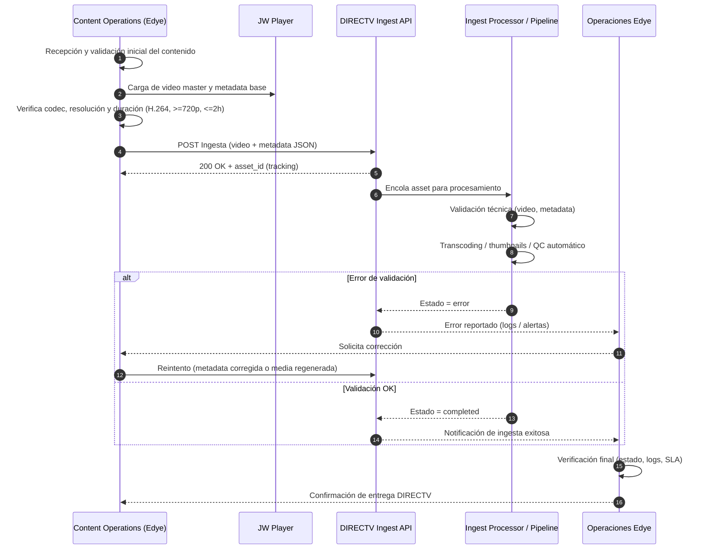

# Partner Annex (reusable) - DIRECTV (Ingestion-type Integration)

## General description of the ingestion flow

The following ingestion sequence diagram for DIRECTV describes the complete process of delivering content from Edye to the partner, using an API-driven and highly automated model.
The goal of the flow is to ensure that each audiovisual asset meets the technical, metadata, and processing requirements before being accepted by DIRECTV, maintaining traceability, error control, and clear retry criteria.

This flow relies on an asynchronous pipeline, where the initial ingestion, processing, and final validation are decoupled, allowing volume scaling and reduced manual intervention.



> **Figure 1.** _Partner operational flow diagram_

## Step-by-step sequence explanation

1. **Content reception and pre-validation**  
   Content Operations receives the content and performs a basic pre-check (format, duration, resolution), ensuring the material is ready to be ingested.

2. **Asset upload and preparation**  
   The master video and base metadata are prepared (and, if applicable, managed from JW Player as the source of truth) before starting delivery to the partner.

3. **Ingestion via DIRECTV API**  
   The content is sent through a POST request to the DIRECTV ingestion API, including the video file and metadata in JSON format.  
   The API responds with an asset_id that enables process tracking.

4. **Asynchronous processing**  
   The asset is queued in the DIRECTV pipeline, where technical validations, video processing (transcoding), thumbnail generation, and automatic quality controls are executed.

5. **Validation and error control**  
   If an error occurs (invalid video, incomplete metadata, processing failure), the status is marked as error and logs and alerts are notified to Operations.  
   Operations coordinates the corresponding correction with Content Operations.

6. **Controlled retries**  
   Depending on the type of error, the flow allows:

- Retry only the corrected metadata, or
- Regenerate the media and resend the full ingestion.

7. **Successful completion**  
   If all validations are correct, the asset changes to `completed` status and becomes available in the DIRECTV ecosystem.

8. **Operational close**  
   Operations performs the final verification (status, logs, and SLA) and confirms the delivery as closed.

---

## 1. Delivery channel

**Primary method (active):** REST API (content insertion via ingestion endpoint)

- Endpoint: `POST /api/ingesta/contenido`
- Authentication: Bearer Token
- Content-Type: `multipart/form-data` (media) + JSON (metadata)
- Token (QA / Sandbox): `abc123` (test token)
- Token (Production): [TO BE COMPLETED]
- Base URL (Dev/QA/Prod): [TO BE COMPLETED]

**Alternate method (legacy):** FTP with polling (note: "FTP will be discontinued Q3 2025")

- FTP host/path: [TO BE COMPLETED]

---

## 2. Structure and naming

**Recommended convention (media file):**
`directv_<id_cliente>_<titulo_sanitizado>_<yyyyMMdd>.<ext>`
Example: `directv_7890_el-bosque-magico_20251222.mp4`

**Recommended convention (metadata):**
`directv_<id_cliente>_<asset_id>.json`
Example: `directv_7890_1234-5678.json`

---

## 3. Metadata

**Mandatory fields (minimum):**

- `titulo`
- `id_cliente`
- `archivo_media` (en el multipart como “file”)

**Minimum JSON example:**

```json
{
  "titulo": "Nombre del contenido",
  "id_cliente": "7890",
  "idioma": "es",
  "tipo": "vod",
  "anio": 2025,
  "generos": ["kids", "educativo"]
}
```

**Request example (curl):**
`curl -X POST -F file=@video.mp4 -F metadata='{...}' <endpoint>`

**Expected response (tracking):**
`200 OK` with payload: `{ "status": "received", "id": "1234-5678" }`

---

## 4. Images

In DIRECTV, the pipeline includes "thumbnail creation" as part of the automatic processing.

**Minimum recommended list:**

- Poster / Key Art (vertical)
- Thumbnail (horizontal)
- Still (episodic, if applicable)

**Sizes / ratios:** [TO BE COMPLETED]

**Watermark:** [Yes/No] [TO BE COMPLETED]

---

## 5. Validation rules

**Video:**

- Codec: H.264
- Minimum resolution: 720p
- Maximum duration: 2 hours

**Metadata:**

- Rejected if metadata is incomplete

**Estados de proceso:**

- `received`, `processing`, `error`, `completed`

---

## 6. Acceptance criteria

**Acceptance checklist (Operations):**

- Successful ingestion: API responds 200 and provides tracking id
- Tracking: the id checks status in `GET /api/ingesta/status?id=xxx`
- Final state: `completed` (without remaining in `processing` beyond the operational threshold)
- Technical validation of media: meets `720p+, H.264 and <=2h`
- Subsequent pipeline verification: transcode ABR + thumbnails + automated QC completed
- Monitoring/logs: evidence in Elastic/Kibana (IngestaLogs)

---

## 7. Retries / rollback

**Retry (without resending everything) when:**

- Failure due to "incomplete metadata" and the media does not require changes → resend request with corrected metadata + same file

**Regenerate and resend completely when:**

- The error is "unsupported format" or video validation failure → requires new encode/export and new ingestion

**Rollback:**

- Stop publication/entitlement of the asset at the destination
- Reingest corrected version
- Audit logs of the failed attempt
- [TO BE COMPLETED: there is an endpoint to delete/cancel the asset or it is only replacement by reingestion]

---

## 8. Support

**Monitoring / alerts:**

- Logs: Elastic/Kibana → "IngestaLogs"
- Critical alert: more than 10 consecutive errors per client

**Contacts:**

- Partner DIRECTV (NOC/Support): [Name, email, channel]
- Edye Operations (L1): [Name, email, Slack/Teams]
- Edye DevOps (L2): [Name, on-call]
- Escalation (L3): [Tech Lead / Architecture]

**Schedule:**

- Operating window: [TO BE COMPLETED]
- Maintenance window: [TO BE COMPLETED]

---

## 9. DIRECTV-specific notes

- Documented content type: MP4 video (H.264) + metadata JSON
- Estimated volume: 1500 files/day
- Components involved: Ingest Processor, Metadata Parser, Media Transcoder; dependencies: S3 Bucket, AWS Lambda, Kafka
- Storage: AWS S3 (bucket: vod-ingest-prod)
