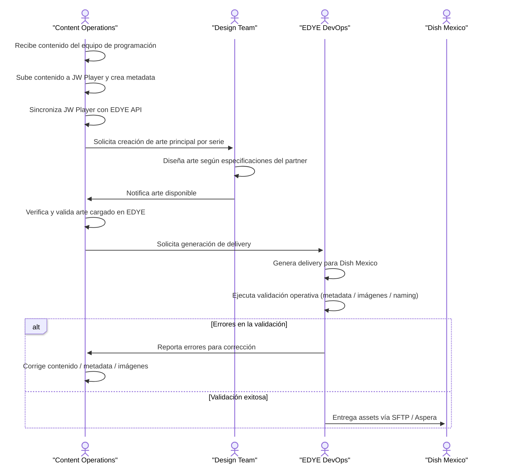

# Content Ingestion – Dish México

## 1. Description

VOD ingestion integration for Dish México through delivery of media,
metadata, and artwork, operated primarily via Aspera.

## 2. Ingestion Type

- Primary mode: Aspera
- Secondary mode: API (if applicable)
- Frequency: daily
- Estimated volume: ~1500 assets/day

## 3. Delivery Channels

### 3.1 Aspera

- Account provided by Dish
- Expected directories:
  - /MEDIA
  - /METADATA
  - /ART

## 4. Flujo de Ingesta – Dish México

> **Figure 1.** _Partner operational flow diagram_

This flow describes the complete operational process from the receipt of
content by the Content Operations team to the final delivery of the
content to the Dish México customer via Aspera.

## 5. Metadata

- Standard: CableLabs XML
- Version: according to Dish specification
- Mandatory validations:
  - ProgramID
  - Title
  - Rating
  - Language
  - Duration

> See Annex: Metadata / XML CableLabs – Dish México

## 6. Dish-Specific Rules

- Strict naming by ProgramID
- Ingestion rejected if artwork is missing
- Reprocessing requires full resend

## 7. Dependencies

- Aspera
- XML validator
- Standard Edye Ingestion pipeline

## 8. References

- General model: Ingesta de Contenidos
- General flow: Flujo de Ingesta de Contenidos
