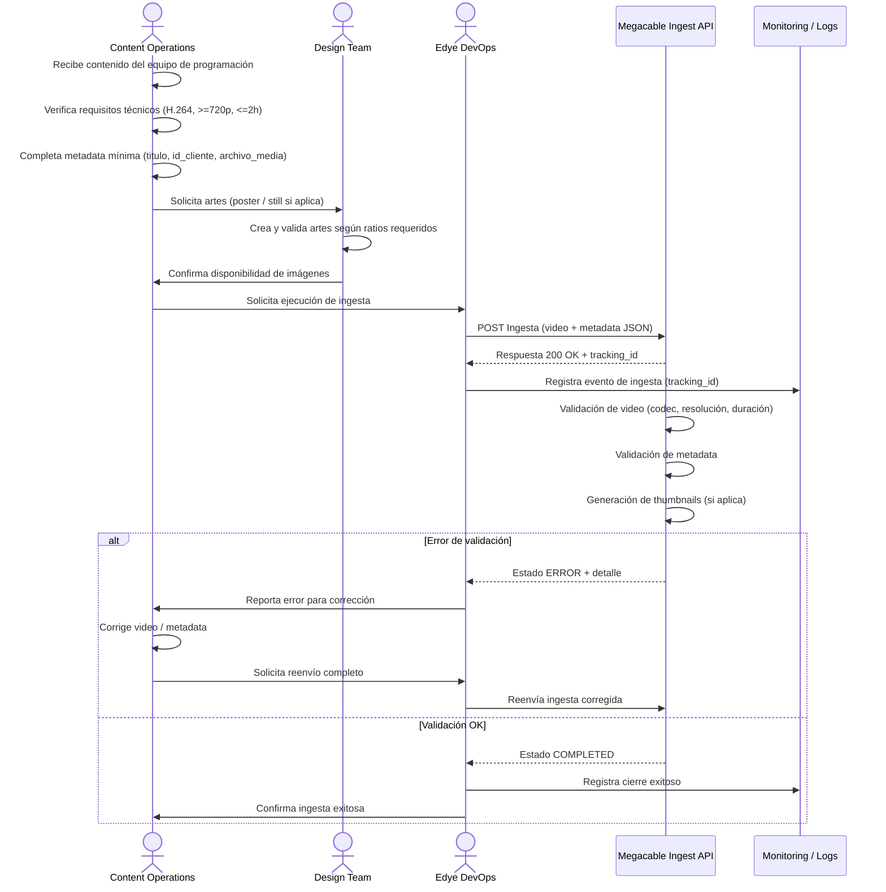

# Partner Annex — Megacable (International VOD Ingestion)

## Introduction to the flow diagram

The following sequence diagram describes the VOD content ingestion flow for the partner Megacable, from content preparation by the Operations team to the final validation and confirmation of ingestion.
The flow is based on the generic EDYE ingestion model, using the Megacable Ingest API as the main entry point and incorporating automatic technical validations, derivative generation (thumbnails), and operational monitoring through tracking identifiers (tracking_id).

This diagram clearly shows who is involved at each stage, which validations are executed, and how errors and retries are handled, ensuring a consistent and reusable integration for this partner.



> **Figure 1.** _Partner operational flow diagram_

## Flow sequence description

1. **Content reception**  
   The Content Operations team receives the content from the programming area and performs an initial check of video availability and associated materials.

2. **Pre-technical validation**  
   Before ingestion, it is validated that the video file meets the minimum requirements defined for Megacable (H.264 codec, minimum 720p resolution, and maximum allowed duration).

3. **Metadata preparation**  
   Content Operations completes the minimum metadata required for ingestion, including title, client identifier, and reference to the media file.

4. **Artwork management (if applicable)**  
   When the partner requires source images, the Design Team is asked to create or validate artwork (poster, stills). Once available, compliance with ratios and sizes is confirmed.

5. **Ingestion execution**  
   The Edye DevOps team performs the ingestion by sending the video file and metadata via a POST request to the Megacable API. The system responds with a unique tracking_id for process tracking.

6. **Partner automatic validations**  
   The Megacable API runs validations on the video, metadata, and, if applicable, automatically generates thumbnails or other derivatives.

7. **Error handling and retries**  
   If a validation error occurs, the ingestion status is marked as ERROR and Content Operations is notified for source correction. Once corrected, a full resend of the ingestion is performed.

8. **Successful close and monitoring**  
   When all validations finish correctly, the ingestion is marked as COMPLETED. The event is logged in monitoring systems and Operations is notified to close the process.

---

## 1. Delivery channel

### 1.1 Primary method (active)

- **Type:** REST API
- **Ingest endpoint:** `POST /api/ingesta/contenido`
- **Authentication:** Bearer Token
- **Format:** `multipart/form-data` (media) + JSON (metadata)

### 1.2 Alternate / legacy method (if applicable)

- **Type:** FTP with polling (LEGACY)
- **Note:** "FTP endpoint" planned to be discontinued in Q3 2025

### 1.3 Credentials / paths (to be completed by partner)

- **Production** - API Base URL: \***\*\*\*\*\*\*\***\_\_\***\*\*\*\*\*\*\*** - Token (vault/secret ref): \***\*\*\*\*\*\*\***\_\_\***\*\*\*\*\*\*\*** - (If FTP applies) Host: \***\*\_\_\*\*** Port: \_**\_ User: **\_\_\***\* Path: **\_\_\_\_\*\*
- **QA / Sandbox** - Test token (doc): `abc123` - QA Base URL: \***\*\*\*\*\*\*\***\_\_\***\*\*\*\*\*\*\***

---

## 2. Structure and naming

### 2.1 For delivery via API (recommended)

- No folder tree required for the “upload” (file is attached in request).
- **Recommended naming (archivo_media):**

  `{id_cliente}{titulo_sanitizado}{yyyyMMdd}.mp4`

  Ejemplo: `7788_ElBosqueMagico_20251222.mp4`

### 2.2 For delivery via FTP (if kept enabled)

- **FTP root:** `/incoming/megacable/` - `/incoming/megacable/video/` - `/incoming/megacable/metadata/` - `/incoming/megacable/images/`
- **Examples:** - `video/7788_ElBosqueMagico_20251222.mp4` - `metadata/7788_ElBosqueMagico_20251222.json` - `images/7788_ElBosqueMagico_poster_16x9.jpg`

---

## 3. Metadata

### 3.1 Mandatory fields (minimum)

- `titulo`
- `id_cliente`
- `archivo_media` (referencia al archivo adjunto o nombre del archivo)

### 3.2 Request example (API)

- Example (curl, reference): `-F file=@video.mp4 -F metadata='{...}'`

### 3.3 Minimum JSON example (suggested)

```json
{
  "titulo": "El Bosque Mágico",
  "id_cliente": "7788",
  "archivo_media": "7788_ElBosqueMagico_20251222.mp4"
}
```

### 3.4 Optional fields (if the partner requires them)

- idioma: \***\*\_\_\*\***
- sinopsis: \***\*\_\_\*\***
- género/tema: \***\*\_\_\*\***
- temporada/episodio: \***\*\_\_\*\***
- tags/acrónimo: \***\*\_\_\*\***

---

## 4. Images

> Nota: el pipeline contempla “creación de thumbnails” como proceso automático post-ingesta.

If Megacable requires “source” artwork or specific sizes, complete this section.

### 4.1 Required images list (to be completed)

- Poster / Key Art (Show)
- Still (Episode)
- Thumbnail (derivative)

### 4.2 Sizes and ratio (to be completed)

- `16:9 = ______ x ______`
- `2:3 = ______ x ______`
- `1:1 = ______ x ______`
- `Others: __________________`

### 4.3 Watermark

- Does watermark apply?: Yes / No / TBD
- If applicable: watermark name in Admin + associated formats. (Watermark and format management/validation is operated from the Admin Watermarks/Thumbnails module).

---

## 5. Validation rules

### 5.1 Video (mínimos)

- Codec: H.264
- Resolución mínima: 720p
- Duración máxima: 2 horas

### 5.2 Metadata

- Minimum fields present: titulo, id_cliente, archivo_media
- Valid JSON (no invalid characters / consistent encoding)
- Consistency between attached file and archivo_media

### 5.3 Imágenes

- If source images are delivered: validate ratio and size against partner specs (section 4)
- If watermark is used: validate watermark availability per format before generating thumbnails

---

## 6. Acceptance criteria

### 6.1 Technical acceptance (API / Process)

- Ingestion responds 200 OK and returns id (tracking id)
- The state moves to “completed” (without remaining in “error”)
- The content passes validations: `H.264, >=720p, <=2h`

### 6.2 Operational acceptance (QC + evidence)

- Thumbnails generated (if applicable) and available for delivery/consultation (according to configuration)
- Logs without validation errors for the tracking id (see section 7)
- Delivery report/record (Ticket/Monday/internal log): **\*\*\*\***\_\_**\*\*\*\***

---

## 7. End-of-operations (monitoring, logs, alerts)

- Logs: Elastic/Kibana > IngestaLogs
- Expected events: load start, load end, validation errors
- Key indicators: processing time, % failures per client
- Critical alerts: more than 10 consecutive errors per client

---

## 8. Retries / rollback

### 8.1 Recommended retries (by state)

- “error” state due to “Unsupported format” / “incomplete metadata”:
  - Action: correct source (transcode/metadata) and RESEND the complete request (file + metadata).
- “received” or “processing” state outside operational threshold:
  - Action: check status via `GET /api/ingesta/status?id=xxx`
  - If it exceeds internal window: escalate to DevOps and evaluate controlled retry.

### 8.2 Regenerate vs resend

- Regenerate (only) when:
  - Thumbnail creation/automated QC failed but the media and metadata are valid (internal regeneration).
- Resend completely when:
  - The video file changes or mandatory metadata changes (id_cliente/titulo/archivo_media).
- Rollback (operational):
  - If a “completed” content must be removed, define action per catalog (unpublishing) and evidence: **\*\*\*\***\_\_**\*\*\*\***

---

## 9. Support (contacts, schedule, escalation) — TO BE COMPLETED

### Partner (Megacable)

- Contacto técnico: **\*\*\*\***\_\_**\*\*\*\***
- Email: **\*\*\*\***\_\_**\*\*\*\***
- Tel: **\*\*\*\***\_\_**\*\*\*\***
- Ventana de soporte: **\*\*\*\***\_\_**\*\*\*\*** (TZ)

### EDYE / HITN

- Operaciones (L1): **\*\*\*\***\_\_**\*\*\*\***
- DevOps (L2): **\*\*\*\***\_\_**\*\*\*\***
- Producto/Contenido (L3 si aplica): **\*\*\*\***\_\_**\*\*\*\***
- Severidades y SLA (si existen): **\*\*\*\***\_\_**\*\*\*\***
- Canal de escalamiento (Slack/Email/Ticket): **\*\*\*\***\_\_**\*\*\*\***
