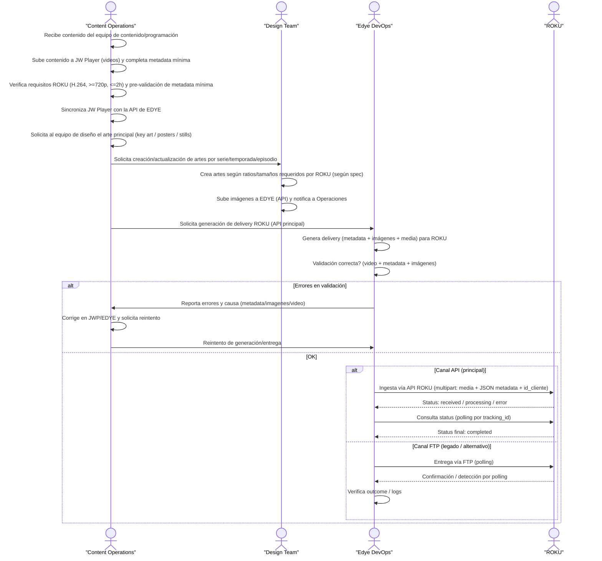

# Partner Annex — ROKU (Ingestion)

## General description of the integration flow

The following diagram describes the **ingestion integration flow with the ROKU partner**, based on the standard Edye model and adapted to the channel’s specific requirements. The process covers end-to-end preparation, validation, and delivery of audiovisual content, from receipt of the material by Content Operations to the final ingestion confirmation by ROKU.

The flow includes **ROKU API ingestion as the main channel**, using a `multipart` scheme that combines media and metadata in JSON format, with **state tracking (polling)** mechanisms until completion. In a controlled way, an **alternative/legacy channel via FTP** is also considered, only in exceptional scenarios.

Throughout the process, quality controls are integrated on **video, metadata, and images**, with clear correction and retry cycles in case of errors, ensuring traceability, operational consistency, and alignment with the partner’s technical specifications. This diagram serves as a single, reusable reference for operations, design, and DevOps during the execution and support of the integration with ROKU.


> **Figure 1.** _Partner operational flow diagram_

## 1. Delivery channel

**Primary method (recommended / current):** REST API (VOD Ingestion)

- Endpoint: `POST /api/ingesta/contenido`
- Auth: Bearer Token
- Formato: `multipart/form-data` (media) + JSON (metadata)
- Status/tracking: `GET /api/ingesta/status?id=xxx` (usa Tracking ID retornado por la ingesta)
- Token (Sandbox): `abc123` (ejemplo)
- Token (Prod): TBD (por Roku)
- Base URL (QA/Prod): TBD
- Cliente/tenant: `id_cliente` (definido por operaciones/partner)

**Alternate method (legacy):** FTP with polling (deprecated, will be discontinued Q3 2025)

**Referencia oficial:**

- [Especificación de ingesta (Roku Developer)](https://developer.roku.com/es-mx/trc-docs/video-on-demand/delivery/ingest-specifications.md)

---

## 2. Structure and naming

**API model:** Does not require a folder tree.

**Recommended convention (internal Edye → delivery to Roku):**

- Archivo de video: `external_id` o `title_id` + variante idioma/temporada/episodio si aplica

**Ejemplos:**

- `EDYE_S01E03_ES.mp4`
- `EDYE_MOV_000123_EN.mp4`

**Idempotency / retries:** Maintain the same logical identifier (`external_id`) to track resends.

If Roku requires file/package structure, reference and align with its official spec.

---

## 3. Metadata

**Minimum mandatory fields:**

- `titulo`
- `id_cliente`
- `archivo_media` (en el multipart/form-data)

**Submission format:**

- `file=@video.mp4`
- `metadata='{...json...}'`

**Request example:**

```http
POST /api/ingesta/contenido
Authorization: Bearer <token>
Content-Type: multipart/form-data

file: video.mp4
metadata: JSON
```

**JSON example (minimum + recommended):**

```json
{
  "titulo": "Edye - Episodio 3",
  "id_cliente": "roku_premium_subs_mx",
  "external_id": "EDYE_S01E03_ES",
  "idioma": "es",
  "tipo": "episode",
  "temporada": 1,
  "episodio": 3,
  "duracion_seg": 1320,
  "rating": "TV-Y7",
  "generos": ["kids", "education"],
  "synopsis_corta": "Descripción breve del episodio."
}
```

> Note: the technical doc only sets minimums (`titulo`, `id_cliente`). The rest is an operational extension for traceability/QA. If Roku requires an exact schema, it is adjusted to its spec.

---

## 4. Images

In the documented flow, subsequent processing includes thumbnail creation (automated).

**To be completed by partner (see official guide):**

- Tipos de imágenes requeridas: posters / cover / background / episodic stills / logo, etc.
- Tamaños/ratios: TBD (según Roku)
- Watermark: Sí/No (según acuerdo)

Si el modelo final exige “package” con artwork + metadata, dejar explícito aquí y vincular la spec.

---

## 5. Validation rules

**Video:**

- Resolución mínima: 720p
- Duración máxima: 2 horas
- Codec: H.264
- Formato: MP4 H.264 + JSON metadata

**Process/business:**

- Estados: `received`, `processing`, `error`, `completed`
- Errores comunes: formato no soportado, metadatos incompletos

**Images:**

- Si Roku recibe imágenes, validar contra tamaños/ratio/watermark exigidos en la spec oficial.

---

## 6. Acceptance criteria

Operations/QA must confirm as **ACCEPTED** when:

- Ingesta responde `200 OK` con `status=received` y Tracking ID
- El status del Tracking ID llega a `completed` (sin error)
- Cumple validaciones mínimas: H.264, ≥720p, ≤2h
- Metadata mínima completa (al menos `titulo`, `id_cliente`)
- QC/thumbnails generados OK (según logs)

---

## 7. Retries / rollback

**Retry (without regenerating master) when:**

- Error por metadatos incompletos → corregir JSON y reenviar
- Error transitorio de red/timeouts → reenviar misma media + metadata (con mismo `external_id`)

**Regenerate media (new encode) when:**

- Error por formato/codificación no soportada o falla de validación (codec/resolución/duración)

**Rollback (operational):**

- It is usually unpublishing or correction with reingestion of the asset (if Roku allows it by spec/operation)

---

## 8. Support

**Contacts to be completed:**

- Roku Partner / Ops: Nombre + email + canal (Slack/Teams) — TBD
- Edye Content Operations: responsable de carga y validación
- Edye DevOps / Integraciones: monitoreo, troubleshooting, reintentos

**Monitoring / logs:**

- Logs: Elastic/Kibana → IngestaLogs
- Alertas críticas: más de 10 errores consecutivos por cliente

**Schedule and SLA:** TBD (define by operational agreement with Roku)
