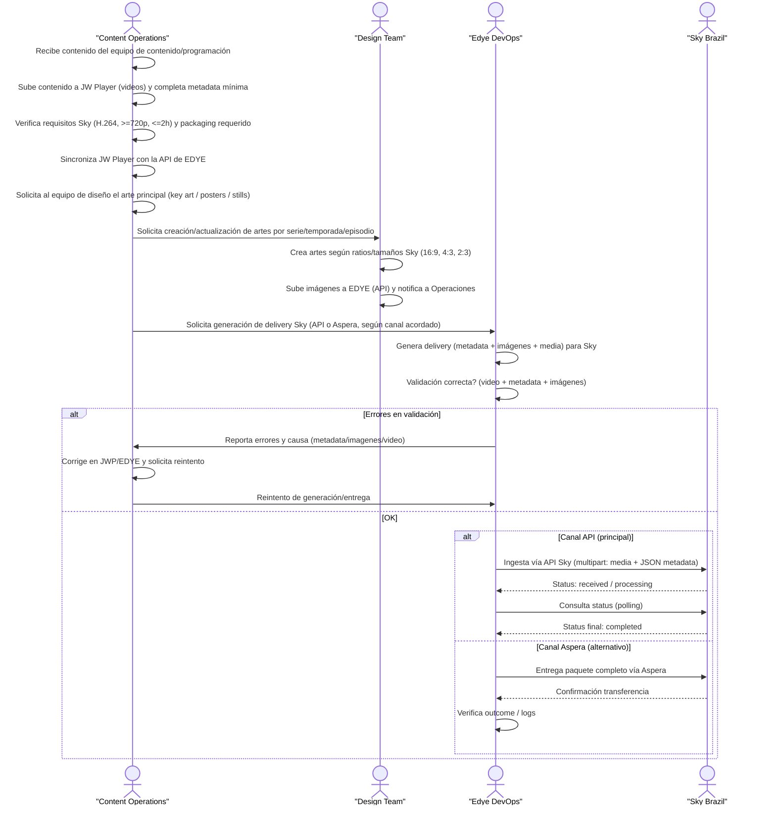

# Ingestion Integration Annex – Sky Brazil

This annex summarizes the specific parameters for Sky Brazil. API is the preferred channel; Aspera is used only in file-based flows when agreed.

---

## 1. Ingestion Flow – Sky Brazil

The following flow describes the **end-to-end ingestion and delivery process for content to Sky Brazil**, starting from editorial and technical preparation in EDYE to the partner’s final validation.
This flow is a **specific implementation of the generic ingestion model**, adapted to Sky’s technical and operational requirements.



> **Figure 1.** _Partner operational flow diagram_

### 1.2. Flow description

1. **Content reception and preparation**

   - Content Operations receives approved content (video + editorial info + availability).
   - Uploads the videos to JW Player with minimum metadata and validates Sky technical requirements (codec, resolution, duration).

2. **Synchronization with EDYE**

   - After validating in JWP, assets are synchronized with the EDYE API, making EDYE the orchestration layer toward Sky.

3. **Artwork production and upload**

   - Content Operations requests the Design Team for the artwork (posters, key art, stills) with ratios/resolutions defined by Sky.
   - Design Team uploads the images to EDYE and notifies Operations upon completion.

4. **Delivery generation**

   - With video, metadata, and images available, Edye DevOps generates the delivery for Sky Brazil applying rules of the chosen channel (API or Aspera).

5. **Technical validation**

   - DevOps automatically validates: video format and characteristics, metadata completeness/consistency, presence and quality of images.
   - In case of errors, it reports to Content Operations for correction and retry.

6. **Delivery to Sky Brazil**

   - API channel (main): ingestion via Sky API; status is monitored until `completed`.
   - Aspera channel (alternate): a full package is delivered via Aspera and transfer/processing is verified.

7. **Closure and monitoring**
   - The flow closes when Sky confirms correct receipt/processing.
   - Ingestion logs and statuses remain available for operational monitoring/reporting.

---

## 2. Delivery channel

### 2.1. Option A — Ingestion via API (preferred)

- Type: REST API
- Endpoint: `POST /api/ingesta/contenido`
- Authentication: Bearer Token
- Format: `multipart/form-data` (media) + JSON (metadata)
- Tracking: the API returns `id` and status is queried via `GET /api/ingesta/status?id={id}`
- Fallback / legacy: FTP with polling (deprecation planned Q3 2025)

### 2.2. Option B — Package delivery via Aspera (file-based)

- Type: Aspera Enterprise Server (push or pull)
- Host: `aspera.engsky.com.br`
- Ports: TCP 33001 / UDP 33001
- Onboarding requirements: fixed public IP(s), push/pull mode, bandwidth, technical/operational contacts, whitelist, and credentials.
- Note: keep API as main channel; Aspera only for specific flows agreed with Sky/VRIO.

---

## 3. Structure and naming

### 3.1. API (Option A)

- Media: `video.mp4` (H.264)
- Metadata: JSON embedded in the form (`-F metadata='{...}'`)
- Recommended naming (EDYE):
  - `archivo_media`: `{partner}_{id_cliente}_{assetId}_{lang}_{version}.mp4`
  - `assetId`: stable, no spaces, no invisible special characters (clean UTF-8)

### 3.2. Aspera / packages (Option B)

Estructura base de paquete (ejemplo):

```text
/PACKAGE_ROOT/
	ADI.XML
	media/      (video)
	images/     (posters/banners)
	subtitles/  (si aplica)
```

Key rule: only place already conformed packages in the delivery folder (VRIO performs pull/push and triggers processing upon download).

---

## 4. Metadata

### 4.1 Mandatory fields (API)

- `titulo`
- `id_cliente`
- `archivo_media`
- `idioma`
- `asset_id`
- `tipo`

### 4.2 JSON example (minimum)

```json
{
  "titulo": "Mi Serie S01E01",
  "id_cliente": "SKYBR",
  "idioma": "es",
  "asset_id": "SERIE_S01E01",
  "tipo": "episode"
}
```

### 4.3 Metadata file-based (Aspera)

- Based on CableLabs 1.1 with ADI.XML structure (Title, Movie, Poster, Preview, etc., per Sky/VRIO scope).

---

## 5. Images

- Format: JPG
- Editorial rule: 16:9 and 4:3 for carousels/PDP without text to avoid visual overload.
- Watermark / labels: not required; visual labels only if agreed with curation.

### 5.1 Movies (minimums)

| Ratio | Resolución | Preferencia                                                     |
| ----- | ---------- | --------------------------------------------------------------- |
| 16:9  | 1920x1080  | Iconic > Key Art > VOD Art > Banner-L2 (sin texto)              |
| 4:3   | 1440x1080  | Iconic > Key Art > VOD Art > Banner-L2 (sin texto)              |
| 2:3   | 1280x1920  | Poster Art > VOD Art > Key Art > Banner-L1 (puede llevar texto) |

### 5.2 Shows (minimums)

| Ratio | Resolución | Preferencia                                |
| ----- | ---------- | ------------------------------------------ |
| 16:9  | 1920x1080  | Iconic > Banner-L1 > Banner-L2 (sin texto) |
| 4:3   | 1440x1080  | Iconic > Banner-L1 > Banner-L2 (sin texto) |
| 2:3   | 1280x1920  | Poster / VOD Art                           |

### 5.3 Episodes (minimums)

| Ratio | Resolución | Preferencia                        |
| ----- | ---------- | ---------------------------------- |
| 16:9  | 1920x1080  | Iconic Art (screen grab) sin texto |
| 4:3   | 1440x1080  | Puede ser crop del 16:9            |
| 2:3   | 1280x1920  | Puede ser crop del 16:9            |

---

## 6. Validation rules

### 6.1 API (Sky Brazil)

- Resolución mínima: 720p
- Duración máxima: 2h
- Codificación: H.264
- Estados: `received | processing | error | completed`

### 6.2 Aspera / VRIO (file-based)

- Wrappers/codecs aceptados según spec (ej. TS + H.264/AVC + AC3, etc.).
- Subtítulos SRT: sin tags HTML `<b>` `<i>`, guardados en filesystem tipo Windows/DOS.

---

## 7. Acceptance criteria

### 7.1 Technical acceptance (Operations)

- Ingesta API responde `200 OK` con `{ "status": "received", "id": "..." }`.
- `GET /api/ingesta/status?id=...` llega a `completed` en la ventana esperada (referencia 3–5 min/archivo).
- Sin errores de validación por formato no soportado o metadata incompleta.

### 7.2 Visual acceptance

- Cumple ratios/tamaños mínimos y reglas sin texto donde aplica.

---

## 8. Retries / rollback

### 8.1 API

- Failure due to incomplete metadata: correct metadata and retry `POST` (same `asset_id`).
- Failure due to format/codec/duration: correct source media and reingest (new file).
- Recommended retries: maximum N (define) before escalating.

### 8.2 Aspera

- If a package has already been pull/push and turns out invalid: full resend of the package (not incremental) to avoid inconsistent states.

---

## 9. Support, contacts, schedules, escalation

### 9.1. Monitoring / logs

- Logs: Elastic/Kibana > IngestaLogs
- Critical alerts: >10 consecutive errors per client

### 9.2. ontacts (pending completion)

- Sky/VRIO NOC / Engineering Network Team (Aspera): TBD
- EDYE Operations: TBD
- EDYE DevOps escalation: TBD
- Operating schedule and deployment window: TBD
