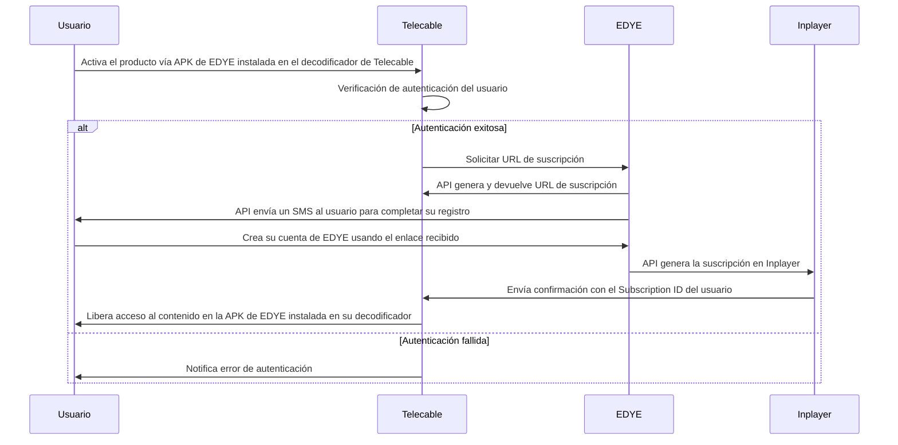

# EDYE Integration – APP/APO/Notifier Model for Telecable

## 1. Introducción

This document provides detailed instructions for Telecable to integrate the official EDYE application into its ecosystem using the APP INTEGRATION model – APO + Notifier + APK. It is aimed at Telecable technical and operations teams and describes all the phases needed to deploy, configure, and operate the integration.

## 2. Objetivo y alcance

**Objective:** guide Telecable’s team in implementing the integration with EDYE, ensuring a homogeneous deployment in line with security and operations standards.

**Scope:** covers delivery of the EDYE APK, APO configuration, subscription and consumption of Notifier events, and connection to the EDYE backend. It does not cover proprietary billing processes or user ingestion from Telecable systems.

## 3. Modelo de integración APO + Notifier + APK (visión general)

En el contexto de Telecable:

**EDYE delivers:**

- La APK oficial de la aplicación EDYE para los dispositivos Android/Android TV operados por Telecable.
- El acceso a APO, que permite configurar entornos, claves, endpoints y canales.
- El servicio Notifier, que publica eventos de negocio y operativos.

**Telecable performs:**

- La distribución interna de la APK en su set‑top box y plataformas móviles.
- La configuración de APO con sus credenciales y parámetros.
- El consumo de eventos de Notifier y la confirmación de su recepción con acks.
- La provisión de soporte de primer nivel a sus usuarios finales.

The messaging architecture is event-based, where the producer publishes facts without waiting for a response, and the consumer replies with an ack to ensure delivery.

## 4. Arquitectura general de la integración

The following description summarizes the architecture for Telecable:

- **Entorno Telecable:** compuesto por el set‑top box y aplicaciones móviles donde se desplegará la APK de EDYE.
- **EDYE APK:** aplicación que se ejecuta en los dispositivos de Telecable y que se conecta con APO para obtener su configuración.
- **EDYE APO:** utilizado por Telecable para configurar credenciales, endpoints, canales y versiones.
- **EDYE Notifier:** servicio que emite eventos; Telecable configura un cliente para recibirlos y procesarlos.
- **Backend de EDYE:** servicios que proporcionan autenticación, catálogo y streaming.

## 5. Flujo general de la integración (descripción end‑to‑end)

1. **APK delivery and validation:** Telecable receives the signed EDYE APK and checks its integrity.
2. **Environment preparation:** a QA environment is enabled with specific credentials and the network is configured to allow HTTPS connections to EDYE.
3. **APK installation:** the application is added to Telecable’s internal repository and distributed to devices in the QA environment.
4. **APO configuration:** Telecable registers its credentials in APO and defines authentication, catalog, and streaming endpoints, as well as content channels and allowed versions.
5. **Notifier subscription:** Telecable configures its messaging client to subscribe to signup, cancel, error, and other relevant events.
6. **Backend connection:** the APK calls EDYE services using tokens and retrieves dynamic configuration from APO.
7. **Monitoring and support:** Telecable oversees operations, logs events, and coordinates with EDYE to resolve issues.

> **Figura 1.** Diagrama del flujo operativo del partner
> **Figure 1.** Partner operational flow diagram

## 6. Componentes involucrados

### Telecable

- Integra la APK en su set‑top box y aplicaciones.
- Configura APO con claves, endpoints y canales.
- Desarrolla o configura un cliente para consumir eventos de Notifier y confirma su recepción.
- Monitorea la operación y brinda soporte a sus usuarios.

### EDYE APO

- Allows Telecable to manage environments, keys, endpoints, channels, and versions.
- Provides a secure interface with audit logs for all actions.

### EDYE Notifier

- Publishes events related to operations (for example, signups, cancellations, errors, service status).
- Requires confirmation via ack to guarantee delivery, allowing retries and idempotency.

### EDYE APK

- Manages user authentication and content access.
- Receives dynamic configuration from APO.
- Reports internal events to Notifier.

### EDYE Backend

- Provides authentication, content catalog, and streaming services.
- Its endpoints use HTTPS and tokens with secure parameters (expiration, minimal claims, etc.).

## 7. Flujo detallado por fases

### 7.1 Environment preparation

- **Credentials:** EDYE generates API credentials for Telecable (QA and production).
- **Network:** Telecable enables firewall rules to allow HTTPS traffic to EDYE.
- **Account in APO:** an operator account is configured for Telecable with appropriate users and permissions.

### 7.2 APK delivery and installation

- The APK is distributed through Telecable’s internal repository to test devices.
- Installation and compatibility are verified on different devices (STB, Android TV).
- The installed version is recorded for later control.

### 7.3 APO configuration

- Telecable configures QA and production parameters: authentication, catalog, streaming endpoints; keys and tokens; content channels; minimum/maximum versioning.
- Changes are logged and validated in QA.
- Once verified, parameters are replicated to production.

### 7.4 Notifier integration

- Telecable subscribes to Notifier topics (user.signup, user.cancel, error, status, interaction).
- Telecable’s client processes each event, executes the corresponding logic (for example, signup or cancellation in its system), and sends an ack.
- In case of errors, retries are performed according to the retry policy.
- Reception and confirmation of each event are recorded.

### 7.5 Functional validation

- **Authentication and access:** verify that the APK authenticates correctly and users can access content.
- **Notifier events:** generate test events to verify that Telecable receives and processes them.
- **APO configuration:** apply changes in APO and verify they are reflected in the APK.
- **Compatibility:** test different devices to ensure the experience is uniform.

### 7.6 Production rollout

- Final configurations are updated in APO for production.
- The authorized APK version is deployed to Telecable end users.
- Behavior in production is monitored during the first 48 hours and mitigation actions are coordinated if issues are detected.
- APK versions, deployment dates, and relevant data are documented.

## 8. Modelo de eventos Notifier

### 8.1 Enabled event types

- Telecable subscribes to the following events:
  - user.signup – User signup.
  - user.cancel – User cancellation.
  - error – Notifications of playback or authentication errors.
  - status – Changes in service status.
  - interaction – Interaction events such as start or end of playback.

### 8.2 Structure and handling

- Events are sent in JSON format with identifier, timestamp, type, and additional data.
- Telecable must send an ack for each consumed event to guarantee delivery and avoid resends.
- Consumers must be idempotent to handle duplicates.
- Notifier will retry until it receives the ack or exhausts the maximum number of attempts.

## 9. APO configuration

Telecable uses APO to:

- Define QA and production environments with their own endpoints, keys, and tokens.
- Configure content channels and allowed APK versions.
- Set Notifier parameters, including subscribed topics and retry policies.
- Perform change auditing and access control.

## 10. Security and access control

- **Tokens and keys:** keep them secret and ensure their expiration.
- **Authorization:** validate permissions on every call to the backend and in APO management.
- **Endpoint protection:** use HTTPS, input filtering, rate limiting, and monitoring.
- **Credential management:** periodic rotation, secure storage, and role-based access control.

## 11. Error handling, monitoring, and retries

- Error handling in the APK with retries and clear messages.
- Notifier and APO logs and metrics to diagnose issues.
- Automatic retries and idempotency for event delivery.
- Integration with Telecable observability tools to monitor event latency, playbacks, and errors.

## 12. Integration acceptance criteria

- The APK installs and runs without errors on Telecable devices.
- APO configurations correctly applied in QA and production.
- Telecable consistently receives and processes Notifier events and confirms with ack.
- Users can authenticate and play EDYE content without incidents.
- Telecable team has visibility and control over logs and metrics.
- Documentation and support procedures completed.

## 13. Operations, monitoring, and support

- Telecable monitors usage metrics, errors, and events daily.
- Updates APO configuration according to operational needs.
- Coordinates APK updates with EDYE.
- Maintains a direct support channel with EDYE to resolve incidents and plan maintenance.

## 14. Annex – Telecable

- **APK distribution channel:** Telecable distributes the EDYE application through its internal application repository and the set‑top box. Authorized devices download the APK after validating with the Telecable server.
- **Environments used:** Telecable operates with two environments: QA, for internal testing, and production, for end users. Each environment has independent keys and endpoints in APO.
- **Authentication scheme:** user authentication is performed via JWT tokens provided by the EDYE backend. Telecable manages obtaining and renewing these tokens through the APK and does not store sensitive credentials on devices.
- **Enabled Notifier events:** Telecable is subscribed to the user.signup, user.cancel, error, status, and interaction events, with retry and confirmation policies defined in section 8.
- **Operational particularities:** Telecable operates in the Europe/Madrid time zone and has defined maintenance windows. Bandwidth limits of the Telecable network must be considered to adjust the frequency of status events and payload sizes.

**Support contacts:**

| Área                       | Contacto             |
| -------------------------- | -------------------- |
| Soporte funcional          | soporte@edye.com     |
| Soporte técnico            | techsupport@edye.com |
| Coordinación de despliegue | proyectos@edye.com   |

**Maintenance windows:** planned updates of the APK and the EDYE platform are carried out on Wednesdays between 02:00 and 04:00 CET. Telecable will be notified in advance and actions will be coordinated to minimize user impact.
