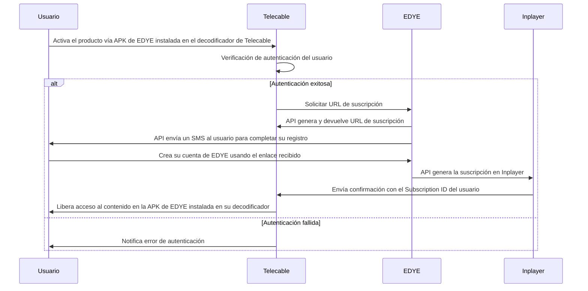

# Integración EDYE – Modelo APP/APO/Notifier para Telecable

## 1. Introducción

Este documento proporciona instrucciones detalladas para que Telecable integre la aplicación oficial de EDYE en su ecosistema mediante el modelo APP INTEGRATION – APO + Notifier + APK. Está dirigido a equipos técnicos y de operaciones de Telecable y describe todas las fases necesarias para desplegar, configurar y operar la integración.

## 2. Objetivo y alcance

**Objetivo:** guiar al equipo de Telecable en la implementación de la integración con EDYE, asegurando un despliegue homogéneo y conforme a las normas de seguridad y operaciones.

**Alcance:** cubre la entrega de la APK de EDYE, la configuración de APO, la suscripción y consumo de eventos de Notifier y la conexión con el backend de EDYE. No aborda procesos de facturación propios ni la ingesta de usuarios desde sistemas de Telecable.

## 3. Modelo de integración APO + Notifier + APK (visión general)

En el contexto de Telecable:

**EDYE entrega:**

- La APK oficial de la aplicación EDYE para los dispositivos Android/Android TV operados por Telecable.
- El acceso a APO, que permite configurar entornos, claves, endpoints y canales.
- El servicio Notifier, que publica eventos de negocio y operativos.

**Telecable realiza:**

- La distribución interna de la APK en su set‑top box y plataformas móviles.
- La configuración de APO con sus credenciales y parámetros.
- El consumo de eventos de Notifier y la confirmación de su recepción con acks.
- La provisión de soporte de primer nivel a sus usuarios finales.

La arquitectura de mensajería se basa en eventos, donde el productor publica hechos sin esperar respuesta, y el consumidor responde con un ack para asegurar la entrega.

## 4. Arquitectura general de la integración

La siguiente descripción resume la arquitectura para Telecable:

- **Entorno Telecable:** compuesto por el set‑top box y aplicaciones móviles donde se desplegará la APK de EDYE.
- **EDYE APK:** aplicación que se ejecuta en los dispositivos de Telecable y que se conecta con APO para obtener su configuración.
- **EDYE APO:** utilizado por Telecable para configurar credenciales, endpoints, canales y versiones.
- **EDYE Notifier:** servicio que emite eventos; Telecable configura un cliente para recibirlos y procesarlos.
- **Backend de EDYE:** servicios que proporcionan autenticación, catálogo y streaming.

## 5. Flujo general de la integración (descripción end‑to‑end)

1. **Entrega y validación de la APK:** Telecable recibe la APK firmada de EDYE y comprueba su integridad.
2. **Preparación del entorno:** se habilita un entorno de QA con credenciales específicas y se configura la red para permitir conexiones HTTPS hacia EDYE.
3. **Instalación de la APK:** la aplicación se incorpora al repositorio interno de Telecable y se distribuye a los dispositivos en el entorno de QA.
4. **Configuración en APO:** Telecable registra sus credenciales en APO y define los endpoints de autenticación, catálogo y streaming, así como los canales de contenido y las versiones permitidas.
5. **Suscripción a Notifier:** Telecable configura su cliente de mensajería para suscribirse a los eventos de altas, bajas, errores y otros eventos relevantes.
6. **Conexión al backend:** la APK invoca los servicios de EDYE usando tokens y obtiene la configuración dinámica desde APO.
7. **Monitoreo y soporte:** Telecable supervisa la operación, registra eventos y coordina con EDYE para resolver incidencias.

> **Figura 1.** Diagrama del flujo operativo del partner

## 6. Componentes involucrados

### Telecable
- Integra la APK en su set‑top box y aplicaciones.
- Configura APO con claves, endpoints y canales.
- Desarrolla o configura un cliente para consumir eventos de Notifier y confirma su recepción.
- Monitorea la operación y brinda soporte a sus usuarios.

### EDYE APO
- Permite a Telecable gestionar entornos, claves, endpoints, canales y versiones.
- Proporciona una interfaz segura con registros de auditoría para todas las acciones.

### EDYE Notifier
- Publica eventos relacionados con operaciones (por ejemplo, altas, bajas, errores, estado del servicio).
- Requiere confirmación mediante ack para garantizar la entrega, permitiendo reintentos e idempotencia.

### EDYE APK
- Gestiona la autenticación del usuario y el acceso a contenidos.
- Recibe configuración dinámica desde APO.
- Reporta eventos internos a Notifier.

### EDYE Backend
- Suministra los servicios de autenticación, catálogo de contenidos y streaming.
- Sus endpoints utilizan HTTPS y tokens con parámetros seguros (expiración, mínimas claims, etc.).

## 7. Flujo detallado por fases

### 7.1 Preparación del entorno
- **Credenciales:** EDYE genera credenciales de API para Telecable (QA y producción).
- **Red:** Telecable habilita reglas de firewall para permitir tráfico HTTPS hacia EDYE.
- **Cuenta en APO:** se configura una cuenta de operador para Telecable con usuarios y permisos adecuados.

### 7.2 Entrega e instalación de la APK
- La APK se distribuye a través del repositorio interno de Telecable a los dispositivos de prueba.
- Se verifica la instalación y compatibilidad en distintos dispositivos (STB, Android TV).
- Se registra la versión instalada para control posterior.

### 7.3 Configuración de APO
- Telecable configura los parámetros de QA y producción: endpoints de autenticación, catálogo, streaming; claves y tokens; canales de contenido; versionado mínimo/máximo.
- Se registran los cambios y se validan en QA.
- Una vez verificados, se replican los parámetros en producción.

### 7.4 Integración de Notifier
- Telecable se suscribe a los topics de Notifier (user.signup, user.cancel, error, status, interaction).
- El cliente de Telecable procesa cada evento, ejecuta la lógica correspondiente (por ejemplo, alta o baja en su sistema) y envía un ack.
- En caso de errores, se realizan reintentos según la política de reenvío.
- Se registra la recepción y confirmación de cada evento.

### 7.5 Validación funcional
- **Autenticación y acceso:** se comprueba que la APK se autentica correctamente y que los usuarios pueden acceder a contenidos.
- **Eventos de Notifier:** se generan eventos de prueba para verificar que Telecable los recibe y procesa.
- **Configuración de APO:** se aplican cambios en APO y se verifica que se reflejan en la APK.
- **Compatibilidad:** se prueban distintos dispositivos para asegurar que la experiencia es uniforme.

### 7.6 Puesta en producción
- Se actualizan las configuraciones definitivas en APO para producción.
- Se despliega la versión de la APK autorizada a los usuarios finales de Telecable.
- Se monitoriza el comportamiento en producción durante las primeras 48 horas y se coordinan acciones de mitigación si se detectan incidencias.
- Se documentan las versiones de APK, fechas de despliegue y datos relevantes.

## 8. Modelo de eventos Notifier

### 8.1 Tipos de eventos habilitados
- Telecable se suscribe a los siguientes eventos:
	- user.signup – Alta de usuario.
	- user.cancel – Baja de usuario.
	- error – Notificaciones de errores de reproducción o autenticación.
	- status – Cambios en el estado del servicio.
	- interaction – Eventos de interacción como inicio o finalización de reproducción.

### 8.2 Estructura y manejo
- Los eventos se envían en formato JSON con identificador, timestamp, tipo y datos adicionales.
- Telecable debe enviar un ack por cada evento consumido para garantizar la entrega y evitar reenvíos.
- Los consumidores deben ser idempotentes para manejar duplicados.
- Notifier realizará reintentos hasta recibir el ack o hasta agotar el número máximo de intentos.

## 9. Configuración del APO

Telecable utiliza APO para:
- Definir entornos de QA y producción con sus propios endpoints, claves y tokens.
- Configurar canales de contenido y versiones permitidas de la APK.
- Establecer parámetros de Notifier, incluidos los topics suscritos y las políticas de reintento.
- Realizar auditoría de cambios y control de accesos.

## 10. Seguridad y control de accesos

- **Tokens y claves:** mantenerlos en secreto y garantizar su expiración.
- **Autorización:** validar permisos en cada llamada al backend y en la gestión de APO.
- **Protección de endpoints:** emplear HTTPS, filtros de entrada, rate limiting y monitorización.
- **Gestión de credenciales:** rotación periódica, almacenamiento seguro y control de acceso basado en roles.

## 11. Manejo de errores, monitoreo y reintentos

- Manejo de errores en la APK con reintentos y mensajes claros.
- Logs y métricas de Notifier y APO para diagnosticar problemas.
- Reintentos automáticos e idempotencia para la entrega de eventos.
- Integración con herramientas de observabilidad de Telecable para supervisar latencia de eventos, reproducciones y errores.

## 12. Criterios de aceptación de la integración

- La APK se instala y ejecuta sin errores en dispositivos Telecable.
- Configuraciones de APO aplicadas correctamente en QA y producción.
- Telecable recibe y procesa eventos Notifier de forma consistente y confirma con ack.
- Los usuarios pueden autenticarse y reproducir contenidos de EDYE sin incidencias.
- El equipo de Telecable tiene visibilidad y control sobre logs y métricas.
- Documentación y procedimientos de soporte completados.

## 13. Operación, monitoreo y soporte

- Telecable vigila diariamente métricas de uso, errores y eventos.
- Actualiza la configuración de APO según necesidades operativas.
- Coordina las actualizaciones de la APK con EDYE.
- Se mantiene un canal de soporte directo con EDYE para resolver incidencias y planificar mantenimientos.

## 14. Anexo – Telecable

- **Canal de distribución de la APK:** Telecable distribuye la aplicación EDYE a través de su repositorio interno de aplicaciones y del set‑top box. Los dispositivos autorizados descargan la APK tras validarse con el servidor de Telecable.
- **Ambientes utilizados:** Telecable opera con dos entornos: QA, destinado a pruebas internas, y producción, para usuarios finales. Cada entorno tiene claves y endpoints independientes en APO.
- **Esquema de autenticación:** la autenticación de los usuarios se realiza mediante tokens JWT proporcionados por el backend de EDYE. Telecable gestiona la obtención y renovación de dichos tokens a través de la APK y no almacena credenciales sensibles en los dispositivos.
- **Eventos Notifier habilitados:** Telecable está suscrito a los eventos user.signup, user.cancel, error, status e interaction, con las políticas de reintentos y confirmación definidas en la sección 8.
- **Particularidades operativas:** Telecable opera en la zona horaria de Europa/Madrid y tiene ventanas de mantenimiento definidas. Deben considerarse los límites de ancho de banda de la red de Telecable para ajustar la frecuencia de eventos de estado y el tamaño de las cargas.

**Contactos de soporte:**

| Área                    | Contacto                |
|-------------------------|-------------------------|
| Soporte funcional       | soporte@edye.com        |
| Soporte técnico         | techsupport@edye.com    |
| Coordinación de despliegue | proyectos@edye.com   |

**Ventanas de mantenimiento:** las actualizaciones planificadas de la APK y de la plataforma EDYE se realizan los miércoles entre las 02:00 y las 04:00 CET. Telecable será notificado con antelación y se coordinarán acciones para minimizar el impacto en los usuarios.
