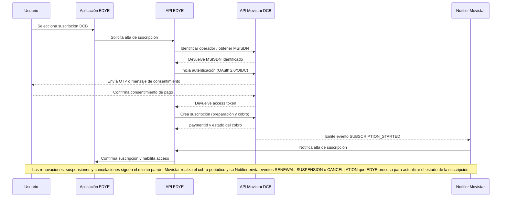

# EDYE Integration – Telefónica (Movistar) — API + Notifier (DCB)

## 1. Introducción

This document specifically and operationally describes how the **API + Notifier** model is implemented for **Direct Carrier Billing (DCB)** between **EDYE** and **Telefónica**, through its **Movistar** brand. The baseline is EDYE’s generic integration model, but here the partner’s particularities are included. The DCB method allows the subscription cost to be charged directly to the customer’s bill. In entertainment services such as Kanto on Movistar Plus+, this approach has shown that the annual plan amount can be charged “directly to the Movistar bill” and that the integration relies on the open billing API of the **Open Gateway** initiative.
For Movistar users, this method reduces friction when subscribing and removes the need to enter banking data. The same principle applies to EDYE.

## 2. Alcance

As in the generic document, this manual is aimed at **Operations**, **DevOps**, and **Telefónica technical teams**. It details the integration of the API + Notifier model with Movistar, covering:

- Components and architecture adapted to Telefónica’s environment.
- Specific flows for subscription activation, renewal, and cancellation.
- Specifications of the Movistar Notifier.
- Particular security considerations and agreed operational rules.

General explanations already contained in the generic document are not duplicated; any reference to common mechanisms is understood to follow what is described there.

## 3. Arquitectura lógica específica

The integration model maintains the same general structure (EDYE application, EDYE REST API, internal billing system, Notifier, and operator). In the case of Telefónica:

- **Movistar operator:** Telefónica exposes its Carrier Billing API through the Open Gateway initiative. This API supports one- and two-step payments, cancellation, and transaction queries, and is invoked via **OAuth 2.0 / OpenID** Connect to authenticate the client application.
- **Operator identification:** EDYE uses mechanisms such as **telco finder** to determine that the user belongs to Movistar. This step is necessary to route the request to the correct server.
- **User consent:** Telefónica manages the final consent, redirecting the user to a privacy page where network capabilities access is authorized.

The logical diagram is the same as in the generic document, with the difference that the “DCB Operator” component corresponds to **Telefónica (Movistar)** and is invoked following the CAMARA API specifications.

## 4. Flujos específicos de integración

### 4.1. Subscription activation with Movistar

1. **User and operator identification:** the EDYE application requests a DCB subscription process from the EDYE API. EDYE or an aggregator obtains the **MSISDN** or user identifier and uses the telco finder function to confirm the user is a Movistar customer.
2. **Authentication and consent:** an **OAuth 2.0 / OIDC** flow is executed in backend mode (for example, Client Initiated Backchannel Authentication). The Movistar API requests user authentication; the user receives a message or notification to approve the purchase. After approval, EDYE receives an access token.
3. **Payment preparation and request:** EDYE decides whether to use the one-step flow (prepare and charge in a single call) or two steps. In the latter, a payment reservation is made and later a confirm to execute the charge. The cancellation and payment query endpoints are available to void a reservation or retrieve transaction information.
4. **Charge and activation:** Movistar charges the plan amount to the user’s bill. After successful charging, the API returns a paymentId and marks the subscription as active.
5. **Activation notification:** Telefónica’s Notifier sends EDYE a SUBSCRIPTION_STARTED event with the transaction identifier. EDYE validates the signature and updates its internal billing system. Access to content is enabled.

### 4.2. Billing event notification

Telefónica uses a Notification Endpoint in the CAMARA API to send notifications about the payment process to a URL provided by the client. The main characteristics of the Movistar Notifier are:

- **Message format:** JSON with fields such as eventType, paymentId, msisdn, timestamp, and additional payload. The eventType field takes values such as SUBSCRIPTION_STARTED, RENEWAL, SUSPENSION, and CANCELLATION (there may be additional internal codes agreed between the parties).
- **Signature and security:** notifications are digitally signed. Telefónica provides a public key to validate the signature or an HMAC mechanism. EDYE must verify the signature before processing the event.
- **Retries:** if EDYE does not respond with 200 OK, Telefónica will resend the notification using an exponential retry mechanism up to a maximum number of attempts.
- **Idempotency:** each notification includes a unique identifier (paymentId or notificationId) that allows discarding duplicates.

### 4.3. Renewals and cancellations

- **Periodic renewals:** Movistar performs renewal charges according to the periodicity defined in the plan. After each successful charge a RENEWAL event is sent to EDYE. EDYE updates the expiration date and keeps the user’s access active.
- **Suspensions:** if the renewal cannot be charged (e.g., insufficient balance), Movistar sends a SUSPENSION event. EDYE marks the subscription as suspended and temporarily restricts access.
- **Cancellations:** cancellations may originate from user request (through Movistar channels) or administrative termination. In both cases, a CANCELLATION event is sent and EDYE revokes access.

## 5. Particularidades del Notifier de Telefónica

- **Endpoints and authentication:** Telefónica publishes a notification endpoint defined in the CAMARA API; the EDYE webhook URL must be registered beforehand. Authentication is performed via headers with tokens generated by Telefónica and validated by EDYE.
- **Response schemas:** EDYE must always respond with 200 OK and an empty body to confirm receipt. Different responses are interpreted as failure and generate retries.
- **Testing and sandbox:** Telefónica provides a test environment where notifications are sent to a sandbox webhook. It is essential to verify in this environment that signatures are validated correctly and idempotency is handled.

## 6. Consideraciones de seguridad y validación

- **OAuth 2.0 / OIDC:** to invoke the Movistar API an access token must be obtained. The process includes end-user authentication and operator validation.
- **User consent:** Movistar is responsible for collecting the end user’s consent to use network capabilities. The user is redirected to a privacy page provided by the operator and, after authorization, the API returns the recorded consent.
- **Notification signature:** all notifications contain a digital or HMAC signature; EDYE must validate this signature using the key provided by Telefónica.
- **Personal data:** as in the generic model, EDYE does not store sensitive personal information; identification is performed through pseudonyms and the MSISDN, which are encrypted and handled according to data protection laws.
- **Retry and latency policies:** notifications must be received and processed within a reasonable time (for example, < 2 seconds). Monitoring latency and setting alarms in case of delays is recommended.

## 7. Manejo de incidencias y escenarios de error

- **Token authentication errors:** if the OAuth token is invalid or expired, the Movistar API responds with 401 Unauthorized. EDYE must refresh the token and retry the request.
- **Payment rejected:** when the operator rejects a charge, an error code is returned in the API response. EDYE must end the subscription flow and notify the user.
- **Unrecognized notifications:** if an unsupported eventType arrives, EDYE must respond 400 Bad Request and start an investigation with the Telefónica team.
- **State desynchronization:** inconsistencies may occur between the state reported by Movistar and that recorded in EDYE (for example, a renewal event not received). Periodic reconciliation processes (queries to the payment endpoint) and a technical support channel with Telefónica are recommended.

## 8. Reglas operativas acordadas

- **Maintenance windows:** must be coordinated with Telefónica to schedule maintenance that may affect the Notifier or the API.
- **Service level agreements (SLA):** the target availability time for the EDYE webhook must be ≥ 99.9%. Telefónica commits to delivering notifications on time and correctly.
- **Contact information:** both parties must keep operational contact information up to date to escalate incidents 24/7.
- **Version control:** any change in the API or Notifier contract will be communicated in advance and managed through semantic versioning.
- **Shared audit:** both companies must keep transaction and notification records to facilitate audits and conflict resolution.
- **Regression testing:** before releasing changes to production, test cases must be executed in the sandbox environment and verify that the integration continues to function correctly.

## 9. Tabla de eventos y acciones (Movistar)

| eventType            | Meaning in Movistar                          | Expected action in EDYE                 |
| -------------------- | -------------------------------------------- | --------------------------------------- |
| **SUBSCRIPTION_STARTED** | Subscription activation; successful initial charge | Activate plan and enable access.        |
| **RENEWAL**              | Periodic plan renewal                        | Update validity, keep access.           |
| **SUSPENSION**           | Renewal charge failed; temporary suspension | Mark the subscription as suspended.     |
| **CANCELLATION**         | Final cancellation of the subscription      | Revoke access and close the subscription. |
