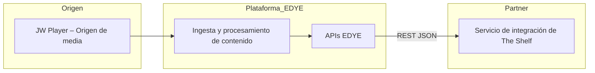
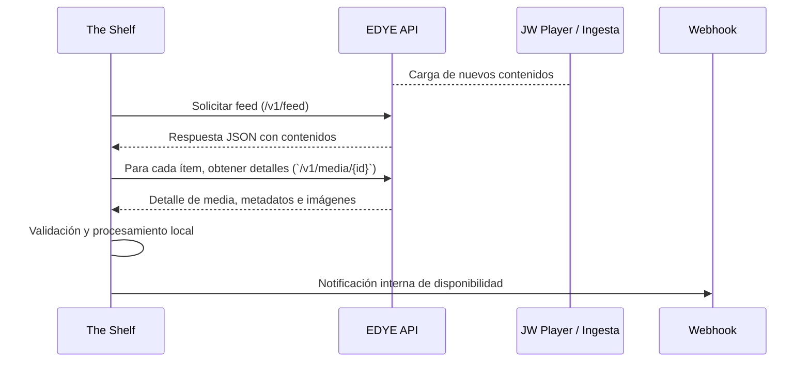

# 1. General Information

| Elemento                    | Valor                                                                                                                                                 |
| --------------------------- | ----------------------------------------------------------------------------------------------------------------------------------------------------- |
| Partner                     | The Shelf                                                                                                                                             |
| Nombre del Servicio         | Content Delivery – EDYE API / JW Player Feed                                                                                                          |
| Tipo de integración         | Delivery via API (content pull)                                                                                                                       |
| Objetivo                    | Distribute updated content (video, metadata, images) through EDYE APIs to the partner platform, enabling ingestion in JW Player and internal systems. |
| Formato de salida           | JSON structured according to JW Player specifications and the EDYE model.                                                                             |
| Frecuencia de actualización | Every hour or on demand (publish event).                                                                                                              |

This section defines the scope and basic parameters of the integration. The Delivery via API integration type implies that the partner consumes the resources exposed by EDYE APIs on a scheduled or event-driven basis. The content covers video, metadata, and thumbnails, which are generated on the EDYE platform from media sources (JW Player) and served through REST endpoints.

## 2. Structure of the delivered JSON

The API delivers a feed in JSON format. Each entry in the feed corresponds to a video and contains the main fields shown below. The maximum feed size is 1,000 items per query.

### 2.1 Main fields

| Campo            | Description                                                                    | Obligatorio |
| ---------------- | ------------------------------------------------------------------------------ | ----------- |
| title            | Content title.                                                                 | Sí          |
| description      | Short description of the asset.                                                | No          |
| image / images[] | URL of the main thumbnail or array of thumbnail URLs in various sizes.         | No          |
| sources          | List of video sources. Each element includes file, label, type, width, height. | Sí          |
| tags             | Set of tags associated with the content.                                       | No          |
| pubdate          | Publication date in ISO 8601 format.                                           | Sí          |
| custom_fields    | JSON object with custom fields defined by the partner.                         | No          |

The delivery endpoint is configured as a public or authenticated URL. The partner must request feeds in an authenticated manner via API token or HTTP header according to EDYE security policies.

### 2.2 General architecture

The delivery architecture is composed of the following components:



**Origin:** EDYE uses JW Player as the media source. Video uploads and their variants are stored and managed in JW Player.

**EDYE Platform:** ingests content, normalizes metadata and images, and exposes the resources via EDYE APIs.

**Partner:** The Shelf operates an integration service that consumes the REST endpoints to build its local catalog and publish to its players (JW Player or others).

### 2.3 APIs involved

The main endpoints the partner must consume are detailed below. All endpoints are HTTP GET and return JSON objects.

| Endpoint                                    | Description                                                                           | Parámetros relevantes        |
| ------------------------------------------- | ------------------------------------------------------------------------------------- | ---------------------------- |
| /v1/feed                                    | Returns the full feed of available content.                                           | page, page_size (pagination) |
| /v1/feed?updated_since=YYYY‑MM‑DDTHH:MM:SSZ | Returns only the items updated since a given date.                                    | updated_since (ISO 8601)     |
| `/v1/media/{id}`                            | Returns the details of a specific content item, including video sources and metadata. | id (UUID of the content)     |
| `/v1/media/{id}/images`                     | Returns the list of thumbnails associated with the content.                           | id (UUID of the content)     |
| `/v1/media/{id}/metadata`                   | Returns only the metadata of the content.                                             | id                           |

Each endpoint requires authentication via an API token sent in the Authorization: Bearer header. The partner must manage renewal and secure storage of this token. Routes and endpoint names may be adjusted depending on the environment (QA or production).

## 3. Multimedia Content and Thumbnails

### 3.1 Video sources

The `sources` field is a list of objects that define each version of the video. Each object includes at least:

- `file` – URL del archivo de vídeo (HLS, MP4 u otro formato).
- `label` – Indicador de calidad o resolución (por ejemplo 1080p).
- `type` – Tipo MIME del archivo (video/mp4, application/x-mpegURL, etc.).
- `width`/`height` – Resolución del vídeo en píxeles.

All URLs must be accessible via HTTPS. The partner must verify their availability before ingesting them.

### 3.2 Images

Thumbnails are provided in the `image` field or within `images[]` to support multiple sizes. EDYE recommendations are:

- Relación de aspecto 16:9.
- Resolución mínima 640×360 px.
- Formato JPG o PNG optimizado para web.

The partner can request images in different resolutions using the `/v1/media/{id}/images` endpoint and filtering by size key (small, medium, large).

### 3.3 Validation rules for multimedia

- **URL verification:** before publishing a feed, the EDYE platform automatically validates that video and image links respond with HTTP 2xx. The partner must replicate this verification to discard corrupt content.
- **File integrity:** check that the video duration and size match the reported metadata. Discrepancies must be reported to support.
- **Supported formats:** only standard MIME types are accepted (MP4/HLS for video, JPEG/PNG for images). Files with unsupported codecs must be omitted.

## 4. Required and optional metadata

### 4.1 Mandatory fields

| Campo   | Descripción                               |
| ------- | ----------------------------------------- |
| title   | Título del vídeo.                         |
| sources | Array de fuentes de vídeo.                |
| pubdate | Fecha de publicación en formato ISO 8601. |

### 4.2 Optional fields

| Campo            | Descripción                                      |
| ---------------- | ------------------------------------------------ |
| description      | Descripción o sinopsis del contenido.            |
| tags             | Lista de etiquetas temáticas o de clasificación. |
| image / images[] | Miniaturas asociadas al vídeo.                   |
| duration         | Duración del contenido en segundos.              |
| custom_fields    | JSON anidado con claves específicas del cliente. |

### 4.3 Custom fields

`custom_fields` allow inclusion of specific metadata defined by the partner. This field is optional but must follow JSON format. Example:

```json
{
  "custom_fields": {
    "season": "3",
    "rating": "PG‑13"
  }
}
```

The EDYE platform does not interpret these values; they are stored and transmitted as is. The Shelf is responsible for their consistency and use.

## 5. Delivery process and endpoints

### 5.1 Delivery method

The feed is generated in the EDYE backend and published via HTTP(S). The partner performs GET requests to the endpoints described in section 2 to obtain full or incremental data. The integration model is pull; The Shelf initiates requests according to its update schedule.

### 5.2 Security and authentication

Authentication via token in the URL or header, or basic authentication, is used as agreed. Credentials are supplied through secure channels. Rotating tokens periodically and using HTTPS to protect data in transit is recommended.

### 5.3 Monitoring and notifications

- **Monitoring:** EDYE logs the HTTP status of each delivery, access logs, and the integrity of the generated JSON. It is recommended that The Shelf track calls, response times, and status codes to detect anomalies.
- **Notifications:** after a successful feed update, the platform can invoke a webhook configured by The Shelf. The webhook must accept POST requests and respond with 2xx to confirm receipt.

### 5.4 Operational flow of delivery via API



### 5.5 Flow description (step by step)

1. **Content generation:** when new videos are published in JW Player, EDYE ingests the files and updates metadata.
2. **Feed publication:** the EDYE backend generates the JSON feed and exposes it at the `/v1/feed` endpoint.
3. **Partner request:** The Shelf schedules a job (e.g., hourly) to request the full or incremental feed.
4. **Processing:** The Shelf service parses the response, identifies new or modified items, and makes additional calls to `/v1/media/{id}`, `/v1/media/{id}/images`, or `/v1/media/{id}/metadata` as needed.
5. **Validation:** The Shelf verifies JSON integrity, availability of multimedia resources, and compliance with mandatory fields.
6. **Internal ingestion:** the data is inserted into the internal catalog and, optionally, a webhook is published to notify other applications.

### 5.6 Error handling and retries

- **HTTP codes:** endpoints return standard codes (200, 400, 401, 404, 500). 4xx responses indicate client errors; 5xx indicate temporary server issues.
- **Retries:** implement exponential retries for 5xx errors or timeouts, with a maximum of three attempts and incremental wait.
- **Failure logging:** all failed calls must be logged with timestamp, endpoint, and status code to ease analysis.
- **Rate limit handling:** respect rate limit policies (if applicable) to avoid blocking. Upon a 429 response, wait the time indicated in the Retry‑After header.

### 5.7 Technical dependencies

- **Connectivity:** Internet access via HTTPS to EDYE and JW Player domains.
- **Authentication:** management of API tokens and access credentials.
- **Runtime environment:** service capable of performing HTTP requests, processing JSON, and storing data (e.g., a microservice in The Shelf infrastructure).
- **Time synchronization:** servers must keep their clocks synchronized to compare `pubdate` and `updated_since` filters.

## 6. Validations and quality control

### 6.1 Pre-validations

Before publishing a feed, EDYE performs automatic validations of the JSON structure, verifies the presence of all mandatory fields, and checks multimedia URLs. The Shelf must replicate these validations when consuming the data.

### 6.2 Logs

EDYE keeps records of feed generation, validation, and publication. The partner must retain its own consumption logs for traceability: request time, requested URL, response code, and number of items processed.

### 6.3 Alerts and error notifications

Critical errors are identified via alerts: code 500, invalid JSON, broken or missing thumbnails. In case of an error:

- Log the incident and the returned code.
- Retry the request according to the retry policy.
- Notify the EDYE support team if the problem persists.

### 6.4 Version retention

The platform retains the history of the last three generated feeds. The Shelf can compare versions to detect changes or recover data in case of an incident.

## 7. Test environments and tools

### 7.1 QA environment

For testing and certification there is a QA environment accessible through a specific URL (example: https://qa.api.clientdomain.com/feed/jwplayer.json). Data in QA may differ from production and is reset periodically.

### 7.2 Recommended tools

- **Postman** – para construir y ejecutar peticiones HTTP.
- **JSONLint** – para validar la sintaxis JSON.
- **JW Platform feed validator** – herramienta oficial de JW Player para validar feeds.

### 7.3 Validation example

It is recommended to use the JW Player validation tool available at https://developer.jwplayer.com/tools/feeds/validate/. Enter the feed URL and review the results to detect missing fields or format errors.

### 7.4 Test client

During integration, access to the JW Player Dev Console is provided with a temporary API Key. This console allows testing content playback and verifying feed properties.

### 7.5 Operation and support

- **Continuous monitoring:** the integration must be instrumented to measure response times, error rate, and number of processed items.
- **Incident management:** in case of a persistent error, the partner must open a ticket in the EDYE help desk providing logs and a description of the problem.
- **Maintenance windows:** EDYE will notify in advance any intervention that may affect API availability.

# 8. Example of delivered JSON

The following example illustrates an entry from the feed returned by `/v1/feed`:

```json
{
  "playlist": [
    {
      "title": "Avance Temporada 4",
      "description": "Tráiler oficial HD",
      "image": "https://cdn.client.com/thumbnails/t4.jpg",
      "pubdate": "2025-07-21T10:00:00Z",
      "sources": [
        {
          "file": "https://cdn.client.com/videos/t4-1080.mp4",
          "label": "1080p",
          "type": "video/mp4"
        }
      ],
      "custom_fields": {
        "season": "4",
        "language": "es"
      }
    }
  ]
}
```
