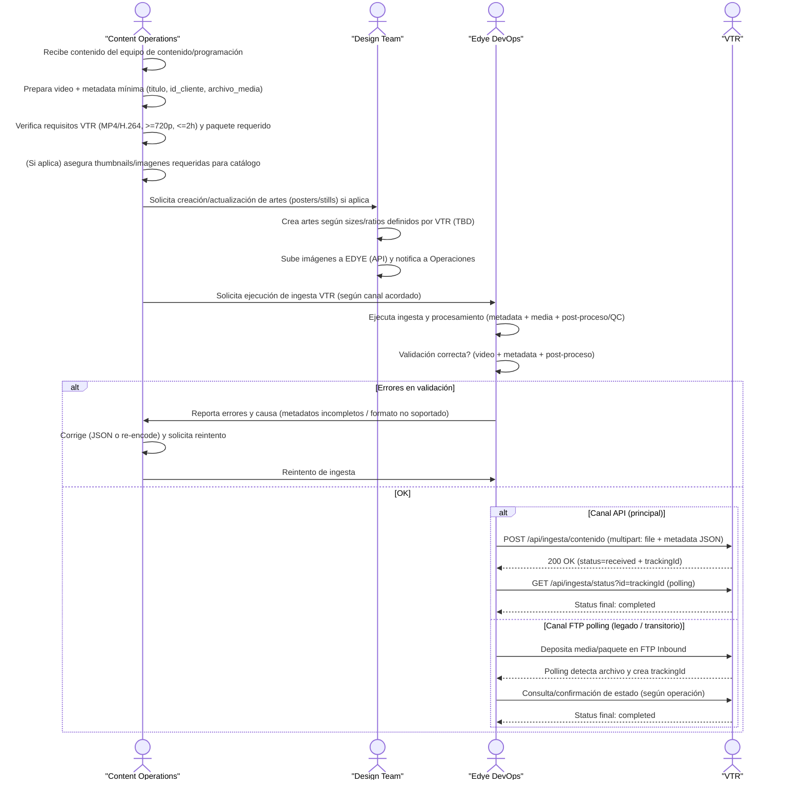

# Partner Annex — VTR (Ingestion Integration)

## 1. Ingestion Flow – VTR

This flow describes the ingestion-based integration process with the VTR partner, following EDYE’s standard model. The goal is to ensure audiovisual content (video, metadata, and images) meets VTR’s technical and operational requirements before it is ingested, processed, and marked as `completed` on their platform.

The flow is designed to be reusable and controlled, incorporating early validations, error handling and retries, and supporting two input channels:

- **API REST (principal)**
- **FTP con polling (legado / transitorio)**

This way, Operations, Design, and DevOps work in coordination to ensure stable ingestion, traceability, and status visibility at every stage.



> **Figure 1.** _Partner operational flow diagram_

## Step-by-step description of the VTR ingestion flow

1. **Content reception**  
   The Content Operations team receives audiovisual content from Programming or Content (series, seasons, episodes).

2. **Preparation of video and minimum metadata**  
   Content Operations prepares the video file and completes the mandatory metadata required by VTR (for example: title, client identifier, and reference to the media file).

3. **Pre-validation of technical requirements**  
   Before starting ingestion, the team verifies that the content meets VTR’s technical specifications, such as MP4/H.264 format, minimum resolution of 720p, and maximum allowed duration.

4. **Image and artwork management (if applicable)**  
   If editorial artwork is required, Content Operations requests the Design Team to create or update posters, stills, or other graphic assets. The design team generates the images according to the sizes and ratios defined by VTR and uploads them to EDYE.

5. **Ingestion execution request**  
   Once video, metadata, and images are validated, Content Operations asks Edye DevOps to execute the ingestion process toward VTR using the agreed channel.

6. **Ingestion execution and processing**  
   Edye DevOps executes ingestion, sending content through VTR’s API (main channel) or via FTP with polling (alternative channel). During this stage, the video, metadata, and automatic post-processing (QC and thumbnail generation) are processed.

7. **Result validation**  
   DevOps validates that ingestion completed successfully, reviewing the process status (`received`, `processing`, `error`, or `completed`) and confirming there are no issues in video, metadata, or processing.

8. **Error handling and retries**  
   If errors are detected (for example, incomplete metadata or unsupported video format), DevOps reports the cause to Content Operations. The team corrects the required inputs and requests an ingestion retry.

9. **Successful ingestion closure**  
   When the final status is `completed`, the operational closure of the flow is confirmed. The content is correctly ingested in VTR and the process is recorded for monitoring, reporting, and auditing.

---

## 1. Delivery channel

### Input model (ingestion)

- **API REST (principal):** `POST /api/ingesta/contenido`
- **Autenticación:** Bearer Token
- **Payload:** `multipart/form-data` con:
  - `file` (media)
  - `metadata` (JSON)
- **Tracking:** respuesta inicial entrega un id (tracking ID), luego consulta por `GET /api/ingesta/status?id=xxx`

> **⚠️ FTP with polling (legacy / in transition):**
>
> Historical entry point, in the process of being decommissioned in Q3 2025 (confirm whether it still applies in PROD).

### Hybrid flow (historical operation)

- VTR as Hybrid Delivery (Manual + API): videos in folders in Aspera; the API takes the videos, generates metadata, and uploads with images to HITN Aspera; the final delivery for VTR includes images + metadata.
- Note: keep both flows in the annex to avoid team confusion.

### Environments

- Development, QA, Production.
- Test token for sandbox: `abc123` (do not expose real secrets).

### OAuth/entitlement endpoints (not ingestion, but useful for support):

- OAuth/token/logout and authorization endpoints for comprehensive partner validation.

---

## 2. Structure and naming

Ingestion via API does not define a folder tree or file naming. A baseline is proposed for standardization (TBD validate with VTR):

```text
/VTR/INBOUND/VIDEOS/YYYY/MM/DD/
	SERIES_<externalId>_S<season>_E<episode>_<lang>_<version>.mp4
/VTR/INBOUND/METADATA/YYYY/MM/DD/
	SERIES_<externalId>_S<season>_E<episode>_<lang>.json
/VTR/INBOUND/IMAGES/YYYY/MM/DD/
	SERIES_<externalId>_poster_<WxH>.jpg
	SERIES_<externalId>_S<season>_E<episode>_still_<WxH>.jpg
```

**Minimum recommended naming rules:**

- No accents / invisible characters; consistent UTF-8.
- No spaces; use `_` or `-`.
- Stable IDs (ideally `externalId` or `id_cliente` + a `contentId` from the catalog).

---

## 3. Metadata

### Mandatory fields

- `titulo`
- `id_cliente`
- `archivo_media`

### Minimum JSON example

```json
{
  "titulo": "Nombre del contenido",
  "id_cliente": "VTR",
  "archivo_media": "video.mp4",
  "tipo": "episode",
  "content_id": "ext-12345",
  "serie": "Serie X",
  "temporada": 1,
  "episodio": 3,
  "idioma": "es",
  "rating": "G",
  "duracion_seg": 1320,
  "sinopsis": "Descripción corta para catálogo.",
  "tags": ["kids", "comedy"]
}
```

---

## 4. Images

### Technical specification

- During post-processing: thumbnail creation and automated QC. No specific sizes/ratios are defined.

### Operational flow (hybrid)

- Historical delivery: images + metadata as deliverables.

### Image template (TBD by VTR)

- Posters (series)
- Stills (episode)
- Derived thumbnails (if VTR consumes specific thumbs)

### Watermark

- Not specified (TBD)

---

## 5. Validation rules

### Video

- Minimum resolution: 720p
- Maximum duration: 2h
- Encoding: H.264
- Container/Type: MP4 H.264

### Metadata

- “Metadatos incompletos” appears as a common error.

### Imágenes

- No explicit rules (TBD), although thumbnails are generated in post-processing.

### Estados del proceso (API)

- `received`, `processing`, `error`, `completed`

### Errores comunes (API)

- Unsupported format
- Incomplete metadata

---

## 6. Acceptance criteria

### EDYE Operations validates:

- `POST /api/ingesta/contenido` responds `200 OK` with `status: received` and a valid id.
- `GET /api/ingesta/status?id=xxx` reaches `completed`.
- Technical media validation: `MP4/H.264, >=720p`, duration `<=2h`.
- Metadata validation: `titulo`, `id_cliente`, `archivo_media` present and consistent.
- Post-processing evidence: thumbnails generated / automatic QC without failures (per logs/monitoring).
- If the hybrid delivery flow applies (images+metadata): confirmation of availability of the final package according to the defined channel (Aspera).

---

## 7. Retries / rollback

### Recommended retries (ingestion API)

- If the status remains in error due to:
  - “Unsupported format” → re-encode / replace the file and re-ingest.
  - “Metadatos incompletos” → correct the JSON and re-ingest.

### Regenerate vs resend complete (practical criterion)

- Regenerate (partial) when the media is valid and the issue was metadata (JSON change) or a missing field.
- Resend the full package when the video file changes (new encode) or inputs that affect thumbnails/QC change.

### Rollback

- In ingestion, the typical “rollback” is to invalidate/remove the asset in the catalog (if it already propagated) and re-ingest the corrected version with new tracking.
- No “delete/rollback” endpoint is defined for ingestion (TBD).

---

## 8. Support

### Monitoring / logs

- Logs: Elastic/Kibana > IngestaLogs
- Indicators: processing time, % failures per client.
- Critical alerts: >10 consecutive errors per client.

### Systems involved (for triage)

- Ingest Processor
- Metadata Parser
- Media Transcoder
- Dependencies: S3 bucket, AWS Lambda, Kafka

### Suggested escalation (EDYE)

- Content Operations: validates inputs (minimum metadata + file).
- Technical Integrations/Backend team: reviews logs + status by tracking ID.
- DevOps: infrastructure incidents (S3/Lambda/Kafka), degradation or queues.

### Contacts / schedule

- Not provided in attached documents → TBD (add: name, email, Slack/Teams, schedule, and “on-call” if applicable).

---

## 9. Final notes specific to VTR

- Keep the duality visible:
- Ingestion (entry to EDYE via API/FTP)
- Operational/historical delivery (videos in Aspera + delivery of images/metadata)
