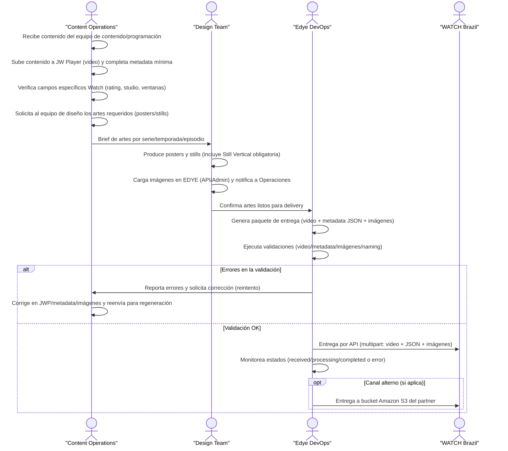

# Integration Annex – Content Ingestion

**Partner:** Watch Brazil  
**Integration type:** VOD Ingestion  
**Status:** Active

This annex complements the **generic EDYE Ingestion flow** and defines only the specific configurations required by the **Watch Brazil** partner.  
The operational flow, general validations, and base responsibilities are governed by the standard Ingestion document.

---

## 1. Ingestion Flow – Sky Brazil

The following flow describes the **end-to-end ingestion and content delivery process to Sky Brazil**, starting from the editorial and technical preparation in EDYE through the partner’s final validation. This flow is a **specific implementation of the generic ingestion model**, adapted to Sky’s technical and operational requirements.

<div class="mermaid-zoom">



</div>
> **Figure 1.** Partner operational flow diagram

# Ingestion Flow – Watch Brazil

1. **Content reception**  
   Content Operations receives audiovisual content from programming or suppliers.

2. **Upload to JW Player**  
   The video is uploaded to JW Player and the minimum metadata is completed, including the specific fields required by Watch Brazil.

3. **Request and creation of artwork**  
   Content Operations requests posters and stills from the Design Team; the design team produces and uploads the required artwork.

4. **Asset confirmation**  
   Once the images are uploaded, the Design Team notifies Edye DevOps that the assets are ready for delivery.

5. **Package generation**  
   Edye DevOps consolidates the complete delivery package (video, metadata, and images).

6. **Technical validation**  
   Video, metadata, images, naming, and delivery structure validations are executed.

7. **Corrections (if applicable)**  
   If there are errors, they are reported to Content Operations, the content is corrected, and the package is regenerated.

8. **Delivery to the partner**  
   With successful validation, Edye DevOps delivers the content to Watch Brazil (API and, if applicable, Amazon S3) and confirms process closure.

---

## 2. Delivery channel

**Main method:**

- **API REST (POST multipart/form-data)**

**Alternative / legacy methods:**

- FTP con polling (en proceso de desuso)

**Authentication:**

- Bearer Token

**Main endpoint:**

```text
POST /api/ingesta/contenido
```

**Format:**

- Video: MP4 (H.264)
- Metadata: JSON (multipart)

---

## 3. Structure and naming

### Logical delivery structure

```text
/ingesta/
├── video/
│   └── <content_id>.mp4
├── metadata/
│   └── <content_id>.json
└── images/
	├── poster_horizontal.jpg
	├── poster_vertical.jpg
	├── still_horizontal.jpg
	└── still_vertical.jpg
```

### Naming rules

- One **unique content_id** per asset
- Names without spaces
- ASCII characters only
- Consistency among video, metadata, and images

---

## 4. Metadata

### Mandatory fields (JSON)

| Campo                    | Descripción                 |
| ------------------------ | --------------------------- |
| `title`                  | Content title               |
| `id_cliente`             | Partner identifier          |
| `rating`                 | Age rating                  |
| `studio`                 | Must be **Edye**            |
| `studio_name`            | Must be **Edye**            |
| `licensing_window_start` | Date + time (ISO 8601)      |
| `licensing_window_end`   | Date + time (ISO 8601)      |
| `actors_display`         | Consolidated list of actors |

**Special Watch Brazil rules:**

- The `rating` field **does not accept simple numeric values**
- It must be sent as:
  - `A12`, `AL`, `12`, or `L`
- `studio` and `studio_name` **must be forced to “Edye”**

### Minimum JSON example

```json
{
  "title": "Tipo Rato",
  "id_cliente": "watch_br",
  "rating": "L",
  "studio": "Edye",
  "studio_name": "Edye",
  "licensing_window_start": "2025-07-15T00:00:00",
  "licensing_window_end": "2026-07-15T23:59:59",
  "actors_display": "Actor 1, Actor 2, Actor 3"
}
```

---

## 5. Images

### Required images (mandatory)

| Type              | Resolution | Ratio    |
| ----------------- | ---------- | -------- |
| Poster Horizontal | 3840x2160  | 16:9     |
| Poster Vertical   | 1708x2562  | Vertical |
| Still Horizontal  | 3840x2160  | 16:9     |
| Still Vertical    | 1708x2562  | Vertical |

> ⚠️ The **Still Vertical** image is mandatory. Without this asset, the Still Horizontal will be cropped in mobile applications.

- Watermark: Not mandatory
- Technical reference: Specs XML and Images - Edye

---

## 6. Validation rules

### Video

- Codec: H.264
- Minimum resolution: 720p
- Maximum duration: 2 hours

### Metadata

- Mandatory fields completed
- Dates with timestamp
- UTF-8 encoding (without broken invisible characters)

### Imágenes

- Exact resolutions
- Correct ratio
- All required types present

---

## 7. Acceptance criteria (Operations)

The delivery is considered **ACCEPTED** when:

- The endpoint responds `200 OK`
- Final status: `completed`
- No validation errors exist
- Metadata and images match the delivered video
- Automated QC without critical failures

Possible states: `received`, `processing`, `error`, `completed`

Technical reference: ESP-INT Ingesta Watch Brazil

---

## 8. Retries and rollback

### Partial retry

Allowed when:

- Metadata error
- Image error
- Correction without video change

### Full resend

Required when:

- The video file changes
- Structural naming error
- Inconsistency among assets

---

## 9. Support and escalation

### Contacts

- Partner – Watch Brazil: Henrique Weber — henrique.weber@watch.tv.br
- EDYE – Operations: DevOps Team / Content Operations

### Support hours

- Monday to Friday, business hours Brazil (BRT)

### Escalation

- EDYE Operations
- EDYE DevOps
- Watch Brazil technical contact
